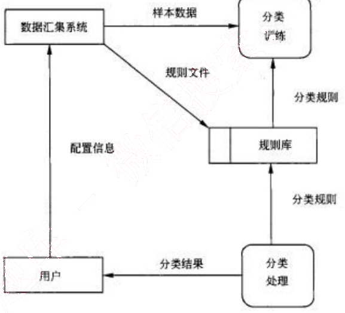
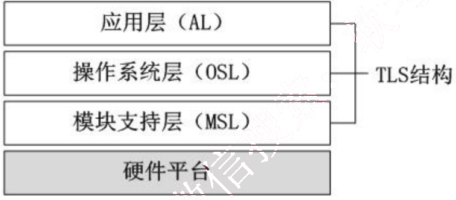
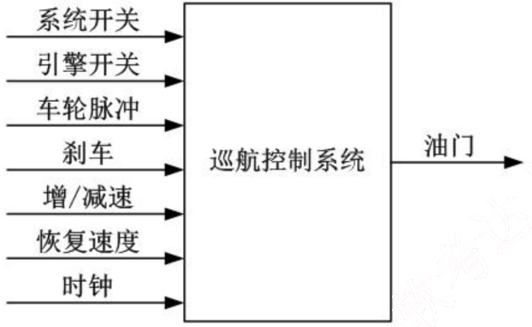

# 2009 年下半年 系统架构设计师 · 案例分析原卷（无答案）

> 题干与插图取自原卷；参考答案见同考期的研读版文件
>
> **来源**：本地购买扫描件《2009 年下半年 系统架构设计师 案例分析》（原卷，题干与参考答案分离）
> **来源类型**：`real`
> **解析方式**：byted-las-document-parse（normal 模式）+ 机械清洗，已剔除页眉、广告条与页码
> **答案与解析**：原卷不含参考答案；作答后请对照同考期的研读版文件评分
> **使用建议**：用于盲练：题干取自原卷，卷面本身无答案
> **完整性**：案例分析 5 题（原卷题干）

## 试题一
> **题型**：案例 01 · 架构评估（ATAM）

某软件开发公司欲为某电子商务企业开发一个在线交易平台，支持客户完成网上购物活动中的在线交易。在系统开发之初，企业对该平台提出了如下要求：
1.  在线交易平台必须在1s内完成客户的交易请求。
2.  该平台必须保证客户个人信息和交易信息的安全。
3.  当发生故障时，该平台的平均故障恢复时间必须小于10s。
4.  由于企业业务发展较快，需要经常为该平台添加新功能或进行硬件升级。添加新功能或进行硬件升级必须在6小时内完成。

针对这些要求，该软件开发公司决定采用基于架构的软件开发方法，以架构为核心进行在线交易平台的设计与实现。

### 【问题 1】（9分）

软件质量属性是影响软件架构设计的重要因素。请用200字以内的文字列举六种不同的软件质量属性名称并解释其含义。

### 【问题 2】（16分）

请对该在线交易平台的4个要求进行分析，用300字以内的文字指出每个要求对应何种软件质量属性；并针对每种软件质量属性，各给出2种实现该质量属性的架构设计策略。

从下列的 4 道试题（试题二至试题五）中任选 2 道解答。
如果解答的试题数超过 2 道，则题号小的 2 道解答有效。

## 试题二
> **题型**：案例 04 · UML 建模与分析

某公司拟开发一个商业情报处理系统，使公司能够及时针对市场环境的变化及时调整发展战略，以获取最大的商业利益。项目组经过讨论，决定采用结构化分析和设计方法。在系统分析阶段，为了更好地对情报数据处理流程及其与外部角色的关联进行建模，项目组成员分别给出了自己的设计思路：
(1) 小张提出先构建系统流程图（System Flowcharts），以便更精确地反映系统的业务处理过程及数据的输入和输出。
(2) 小李提出先构建系统数据流图（Data Flow Diagrams），来展现系统的处理过程和定义业务功能边界，并给出了情报分类子系统的0层和1层数据流图，后者如下图所示。

项目组经讨论确定以数据流图作为本阶段的建模手段。工程师老王详细说明了流程图和数据流图之间的区别与联系，并指出了上图所示数据流图中存在的错误。

### 【问题1】（11分）
流程图和数据流图是软件系统分析设计中常用的两种手段，请用300字以内文字简要说明流程图与数据流图的含义及其区别，并说明项目组为何确定采用数据流图作为建模手段。

### 【问题2】（6分）

请分析指出上图所示的数据流图中存在的错误及其原因，并针对1层数据流图绘制出情报分类子系统的0层数据流图。

### 【问题3】 （8分）

高质量的数据流图是可读的、内部一致的并能够准确表示系统需求。请用300字以内文字说明在设计高质量的数据流图时应考虑的三个原则。

## 试题三
> **题型**：案例 08 · 嵌入式 / 构件组装

某公司承担了一项宇航嵌入式设备的研制任务。本项目除对硬件设备环境有很高的要求外，还要求支持以下功能：
(1) 设备由多个处理机模块组成，需要时外场可快速更换（即 LRM 结构）；
(2) 应用软件应与硬件无关，便于软硬件的升级；
(3) 由于宇航嵌入式设备中要支持不同功能，系统应支持完成不同功能任务间的数据隔离；
(4) 宇航设备可靠性要求高，系统要有故障处理能力。

公司在接到此项任务后，进行了反复论证，提出三层栈（TLS）软件总体架构，如下图所示，并将软件设计工作交给了李工，要求他在三周内完成软件总体设计工作，给出总体设计方案。

### 【问题1】 （8分）

用150字以内的文字，说明公司制定的TLS软件架构的层次特点，并针对上述功能需求（1）-（4），说明架构中各层内涵。

### 【问题2】 （10分）

在TLS软件架构的基础上，关于选择哪种类型的嵌入式操作系统问题，李工与总工程师发生了严重分歧。李工认为，宇航系统是实时系统，操作系统的处理时间越快越好，隔离意味着以时间作代价，没有必要，建议选择类似于VxWorks5.5的操作系统；总工程师认为，应用软件间隔离是宇航系统安全性要求，宇航系统在选择操作系统时必须考虑这一点，建议选择类似于Linux的操作系统。

请说明两种操作系统的主要差异，完成下表中的空白部分，并针对本任务要求，用200字以内的文字说明你选择操作系统的类型和理由。

两种操作系统的主要差异

<table>
<thead>
  <tr>
    <th>比较类型</th>
    <th>VxWorks5.5</th>
    <th>Linux</th>
  </tr>
</thead>
<tbody>
  <tr>
    <td>工作方式</td>
    <td>操作系统与应用程序处于同一存储空间</td>
    <td>①</td>
  </tr>
  <tr>
    <td>多任务支持</td>
    <td>支持多任务（线程）操作</td>
    <td>②</td>
  </tr>
  <tr>
    <td>实时性</td>
    <td>③</td>
    <td>实时系统</td>
  </tr>
  <tr>
    <td>安全性</td>
    <td>④</td>
    <td>⑤</td>
  </tr>
  <tr>
    <td>标准API</td>
    <td>支持</td>
    <td>支持</td>
  </tr>
</tbody>
</table>

### 【问题3】 （7分）

故障处理是宇航系统软件设计中极为重要的组成部分。故障处理主要包括故障监视、故障定位、故障隔离和系统容错（重组）。用150字以内的文字说明嵌入式系统中故障主要分哪几类？并分别给出两种常用的故障滤波算法和容错算法。

## 试题四
> **题型**：案例 08 · 嵌入式 / 构件组装

某公司欲开发一个车辆定速巡航控制系统，以确保车辆在不断变化的地形中以固定的速度行驶。该系统的简化示意图如下图所示。各种系统输入的含义见下表。

图4-1 定速巡航控制系统的简化示意图

表4-1 定速巡航控制系统输入说明

<table>
  <tr>
    <td>输入名称</td>
    <td>作用</td>
  </tr>
  <tr>
    <td>系统开关</td>
    <td>开启/关闭巡航控制系统</td>
  </tr>
  <tr>
    <td>引擎开关</td>
    <td>开启/关闭洗车引擎（引擎开启时，巡航控制系统处于就绪状态）</td>
  </tr>
  <tr>
    <td>车轮脉冲</td>
    <td>车轮每转一次，相应地发出一次脉冲</td>
  </tr>
  <tr>
    <td>刹车</td>
    <td>当刹车被踩下时，定速巡航控制系统会临时恢复到人工控制</td>
  </tr>
  <tr>
    <td>增/减速</td>
    <td>增加或减慢当前车速（仅在定速巡航控制系统处于开启的状态下可用）</td>
  </tr>
  <tr>
    <td>恢复速度</td>
    <td>恢复原来保持的车速（仅在定速巡航控制系统处于开启的状态下可用）</td>
  </tr>
  <tr>
    <td>时钟</td>
    <td>每毫秒定时脉冲</td>
  </tr>
</table>

公司的领域专家对需求进行深入分析后，将系统需求认定为：任何时刻，只要定速巡航控制系统处于工作状态，就要有确定的期望速度，并通过调整引擎油门的设定值来维持期望速度。

在对车辆定速巡航控制系统的架构进行设计时，公司的架构师王工提出采用面向对象的架构风格，而李工则主张采用控制环路的架构风格。在架构评估会议上，专家对这两种方案进行综合评价，最终采用了面向对象和控制环路相结合的混合架构风格。

### 【问题1】 （5分）

在实际的软件项目开发中，采用成熟的架构风格是项目成功的保证。请用200字以内的文字说明：什么是软件架构风格；面向对象和控制环路两种架构风格各自的特点。

### 【问题2】 （12分）

用户需求没有明确给出该系统如何根据输入集合计算输出。请用300字以内的文字针对该系统的增减速功能，分别给出两种架构风格中的主要构件，并详细描述计算过程。

### 【问题3】 （8分）

实际的软件系统架构通常是多种架构风格的混合，不同的架构风格都有其适合的应用场景。以该系统为例，针对面向对象架构风格和控制环路架构风格，各给出两个适合的应用场景，并简要说明理由。

## 试题五
> **题型**：案例 07 · 安全架构分析

某企业根据业务扩张的要求，需要将原有的业务系统扩展到互联网上，建立自己的B2C业务系统，此时系统的安全性成为一个非常重要的设计需求。为此，该企业向软件开发商提出如下要求：
(1) 合法用户可以安全地使用该系统完成业务；
(2) 灵活的用户权限管理；
(3) 保护系统数据的安全，不会发生信息泄漏和数据损坏；
(4) 防止来自于互联网上各种恶意攻击；
(5) 业务系统涉及到各种订单和资金的管理，需要防止授权侵犯；
(6) 业务系统直接面向最终用户，需要在系统中保留用户使用痕迹，以应对可能的商业诉讼。

该软件开发商接受任务后，成立方案设计小组，提出的设计方案是：在原有业务系统的基础上，保留了原业务系统中的认证和访问控制模块；为了防止来自互联网的威胁，增加了防火墙和入侵检测系统。

企业和软件开发商共同组成方案评审会，对该方案进行了评审，各位专家对该方案提出了多点不同意见。李工认为，原业务系统只针对企业内部员工，采用了用户名/密码方式是可以的，但扩展为基于互联网的B2C业务系统后，认证方式过于简单，很可能造成用户身份被盗取；王工认为，防止授权侵犯和保留用户痕迹的要求在方案中没有体现。而刘工则认为，即使是在原有业务系统上的扩展与改造，也必须全面考虑信息系统面临的各种威胁，设计完整的系统安全架构，而不是修修补补。

### 【问题1】 （9分）

信息系统面临的安全威胁多种多样，来自多个方面。请指出信息系统面临哪些方面的安全威胁并分别予以简要描述。

### 【问题2】 （8分）

认证是安全系统中不可缺少的环节，请简要描述主要的认证方式，并说明该企业应采用哪种认证方式。

### 【问题3】 （8分）

请解释授权侵犯的具体含义；针对王工的意见给出相应的解决方案，说明该解决方案的名称、内容和目标。
