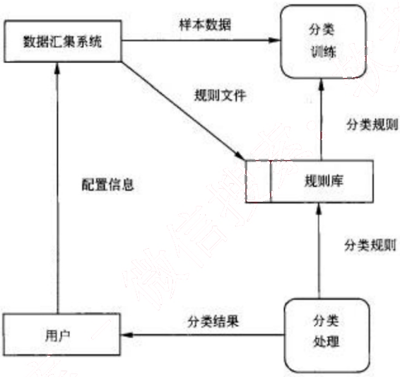
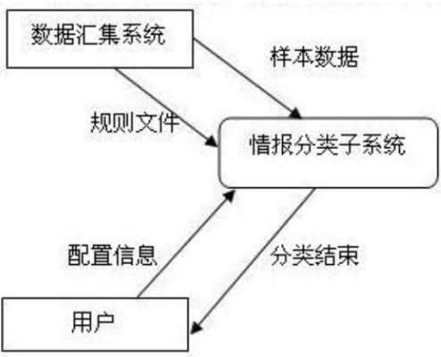
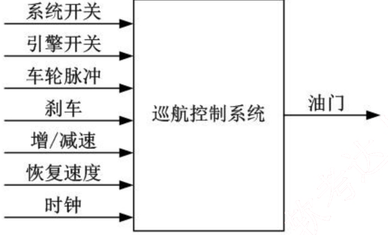

# 2009 年下半年 系统架构设计师 · 案例分析真题

>
> **来源**：本地购买扫描件《2009 年下半年系统架构设计师 答案详解》（贡献者已购买并授权转录）
> **来源类型**：`real`
> **解析方式**：byted-las-document-parse（normal 模式）+ 机械清洗，已剔除页眉、广告条与页码
> **答案与解析**：取自随卷答案详解，非本仓库编写
> **使用范围**：经典选题，仅保留原题号 一、二、四、五；不作为完整年份模考。筛选依据见 [历史题复核](../HISTORICAL_CURATION.md)。

## 试题一
> **题型**：案例 01 · 架构评估与质量属性

某软件开发公司欲为某电子商务企业开发一个在线交易平台，支持客户完成网上购物活动中的在线交易。在系统开发之初，企业对该平台提出了如下要求：

(1) 在线交易平台必须在 1s 内完成客户的交易请求。

(2) 该平台必须保证客户个人信息和交易信息的安全。

(3) 当发生故障时，该平台的平均故障恢复时间必须小于 10s。

(4) 由于企业业务发展较快，需要经常为该平台添加新功能或进行硬件升级。添加新功能或进行硬件升级必须在 6 小时内完成。

针对这些要求，该软件开发公司决定采用基于架构的软件开发方法，以架构为核心进行在线交易平台的设计与实现。

### 【问题1】 （9分）

软件质量属性是影响软件架构设计的重要因素。请用 200 字以内的文字列举六种不同的软件质量属性名称并解释其含义。

常见的软件质量属性有多种，例如性能（Performance）、可用性（Availability）、可靠性（Reliability）、健壮性（Robustness）、安全性（Security）、可修改性（Modification）、可变性（Changeability）、易用性（Usability）、可测试性（Testability）、功能性（Functionality）和互操作性（Inter-operation）等。

这些质量属性的具体含义是：

(1) 性能是指系统的响应能力，即要经过多长时间才能对某个事件做出响应，或者在某段时间内系统所能处理事件的个数。

(2) 可用性是系统能够正常运行的时间比例。

(3) 可靠性是指软件系统在应用或错误面前，在意外或错误使用的情况下维持软件系统功能特性的基本能力。

(4) 健壮性是指在处理或环境中，系统能够承受压力或变更的能力。

(5) 安全性是指系统向合法用户提供服务的同时能够阻止非授权用户使用的企图或拒绝服务的能力。

(6) 可修改性是指能够快速地以较高的性能价格比对系统进行变更的能力。

(7) 可变性是指体系结构经扩充或变更成为新体系结构的能力。

(8) 易用性是衡量用户使用一个软件产品完成指定任务的难易程度。

（9）可测试性是指软件发现故障并隔离、定位其故障的能力特性，以及在一定的时间和成本前提下，进行测试设计、测试执行的能力。

（10）功能性是系统所能完成所期望工作的能力。

（11）互操作性是指系统与外界或系统与系统之间的相互作用能力。

【解析】
本题考查考生对于质量属性及质量属性实现策略的掌握情况。

### 【问题2】 （16分）

请对该在线交易平台的4个要求进行分析，用300字以内的文字指出每个要求对应何种软件质量属性；并针对每种软件质量属性，各给出2种实现该质量属性的架构设计策略。

（1）在线交易平台必须在1s内完成客户的交易请求。该要求主要对应性能，可以采用的架构设计策略有增加计算资源、改善资源需求（减少计算复杂度等）、资源管理（并发、数据复制等）和资源调度（先进先出队列、优先级队列等）。

（2）该平台必须严格保证客户个人信息和交易信息的保密性和安全性。该要求主要对应安全性，可以采用的架构设计策略有抵御攻击（授权、认证和限制访问等）、攻击检测（入侵检测等）、从攻击中恢复（部分可用性策略）和信息审计等。

（3）当发生故障时，该平台的平均故障恢复时间必须小于10s。该要求主要对应可用性，可以采用的架构设计策略有Ping/Edio、心跳、异常和主动冗余等。

（4）由于企业业务发展较快，需要经常为该平台添加新功能或进行硬件升级。添加新功能或进行平台升级必须在6小时内完成。该要求主要对应可修改性，可以采用的架构设计策略有软件模块泛化、限制模块之间通信、使用中介和延迟绑定等。

## 试题二
> **题型**：案例 14 · 结构化分析与 DFD

某公司拟开发一个商业情报处理系统，使公司能够及时针对市场环境的变化及时调整发展战略，以获取最大的商业利益。项目组经过讨论，决定采用结构化分析和设计方法。在系统分析阶段，为了更好地对情报数据处理流程及其与外部角色的关联进行建模，项目组成员分别给出了自己的设计思路：
(1) 小张提出先构建系统流程图（System Flowcharts），以便更精确地反映系统的业务处理过程及数据的输入和输出。
(2) 小李提出先构建系统数据流图（Data Flow Diagrams），来展现系统的处理过程和定义业务功能边界，并给出了情报分类子系统的0层和1层数据流图，后者如下图所示。

项目组经讨论确定以数据流图作为本阶段的建模手段。工程师老王详细说明了流程图和数据流图之间的区别与联系，并指出了上图所示数据流图中存在的错误。

### 【问题1】 （11分）

流程图和数据流图是软件系统分析设计中常用的两种手段，请用300字以内文字简要说明流程图与数据流图的含义及其区别，并说明项目组为何确定采用数据流图作为建模手段。

数据流图作为一种图形化工具，用来说明业务处理过程、系统边界内所包含的功能和系统中的数据流。

流程图以图形化的方式展示应用程序从数据输入开始到获得输出为止的逻辑过程，描述处理过程的控制流。

两者的区别主要包括：

(1) 数据流图中的处理过程可并行；流程图在某个时间点只能处于一个处理过程。

(2) 数据流图展现系统的数据流；流程图展现系统的控制流。

(3) 数据流图展现全局的处理过程，过程之间遵循不同的计时标准；流程图中处理过程遵循一致的计时标准。

(4) 数据流图适用于系统分析中的逻辑建模阶段；流程图适用于系统设计中的物理建模阶段。

【解析】本题考查考生对于结构化系统建模方法的掌握情况。

数据流图和流程图是结构化建模中使用的重要工具，能够帮助开发人员更好地分析和设计系统，增强系统开发人员之间交流的准确性和有效性。数据流图作为一种图形化工具，用来说明业务处理过程、系统边界内所包含的功能和系统中的数据流，适用于系统分析中的逻辑建模阶段。流程图以图形化的方式展示应用程序从数据输入开始到获得输出为止的逻辑过程，描述处理过程的控制流，往往涉及到具体的技术和环境，适用于系统设计中的物理建模阶段。

本题项目组为了更好地对情报数据处理流程及其与外部角色的关联进行建模，符合数据流图的应用场景要求，因此，首先构建数据流图以反映数据流向和系统边界。

数据流图和流程图是为了达到不同的目的而产生的，其所采用的标准符号集合也不相同。在实际应用中，区别主要包括是否可以描述处理过程的并发性；描述内容是数据流还是控制流等几个方面。

### 【问题2】 （6分）

请分析指出上图所示的数据流图中存在的错误及其原因，并针对1层数据流图绘制出情报分类子系统的0层数据流图。

如图所示的数据流图中存在的错误有以下4种：
(1) “分类训练”加工：只有输入没有输出，产生数据黑洞；
(2) “分类处理”加工：只有输出没有输入，无中生有；
(3) “规则文件”数据流：外部实体没有经过加工处理，直接到数据存储；
(4) “配置信息”数据流：外部实体之间没有加工处理，存在直接数据流。

【解析】

数据流图中常见的错误分为两种类型：一类是语法错误，包括外部实体之间、数据存储之间或外部实体与数据存储之间不经过加工而存在直接数据流；另一类是逻辑错误，包括数据黑洞（只有输入没有产生输出）、灰洞（输入不足以产生输出）和无输入。

- “分类训练”加工属于数据黑洞错误；
- “分类处理”加工属于无输入错误；
- “规则文件”和“配置信息”数据流属于语法错误。

对于复杂系统，一般采用分层数据流图逐步细化系统的内部处理逻辑。0层数据流图是1层数据流图更高级别的抽象。“分类训练”和“分类处理”加工属于内部加工，“分类规则”数据流属于内部数据流，抽象为“情报分类子系统”加工。其中，“样本数据”、“规则文件”和“配置信息”为输入数据流；“分类结果”为输出数据流。

### 【问题3】 （8分）

高质量的数据流图是可读的、内部一致的并能够准确表示系统需求。请用300字以内文字说明在设计高质量的数据流图时应考虑的三个原则。

高质量数据流图设计时应考虑的三个原则：

(1) 复杂性最小化原则。DFD分层结构就是把信息划分为小的且相对独立的一大批子集例子，这样就可以单独考查每一个DFD。如果要了解某个过程更加详细的信息，可以跳转到该过程的下一层；如果要知道一个DFD如何与其他DFD相关联，可以跳转到上一层的DFD进行考查。

(2) 接口最小化原则。接口最小化是复杂性最小化的一种具体规则，在设计模型时，应使得模型中各个元素之间的接口数或连接数最小化。

（3）数据流一致性原则。一个过程和它的过程分解在数据流内容中是否有差别？是否存在有数据流出但没有相应的数据流入的加工？是否存在有数据流入但没有相应的数据流出的加工？

【解析】

高质量的数据流图首先要求满足数据流一致性要求，即数据流的输入输出应该匹配，输入数据的信息量足以产生输出数据，所有的输出数据都能够从输入数据中找到数据的来源。对于复杂性系统，可以采用 DFD 分层结构将系统的复杂性逐步分解降低，以提高数据流图的有效性。高质量的数据流图应该简化复杂的接口，最小化接口或连接的数目。

*（原图含机构广告或水印，已移除）*

## 试题四
> **题型**：案例 03 · 架构风格对比与选型

某公司欲开发一个车辆定速巡航控制系统，以确保车辆在不断变化的地形中以固定的速度行驶。该系统的简化示意图如下图所示。各种系统输入的含义见下表。

图4-1 定速巡航控制系统的简化示意图

表4-1 定速巡航控制系统输入说明

<table>
<tr><td>输入名称</td><td>作用</td></tr>
<tr><td>系统开关</td><td>开启/关闭巡航控制系统</td></tr>
<tr><td>引擎开关</td><td>开启/关闭洗车引擎（引擎开启时，巡航控制系统处于就绪状态）</td></tr>
<tr><td>车轮脉冲</td><td>车轮每转一次，相应地发出一次脉冲</td></tr>
<tr><td>刹车</td><td>当刹车被踩下时，定速巡航控制系统会临时恢复到人工控制</td></tr>
<tr><td>增/减速</td><td>增加或减慢当前车速（仅在定速巡航控制系统处于开启的状态下可用）</td></tr>
<tr><td>恢复速度</td><td>恢复原来保持的车速（仅在定速巡航控制系统处于开启的状态下可用）</td></tr>
<tr><td>时钟</td><td>每毫秒定时脉冲</td></tr>
</table>

公司的领域专家对需求进行深入分析后，将系统需求认定为：任何时刻，只要定速巡航控制系统处于工作状态，就要有确定的期望速度，并通过调整引擎油门的设定值来维持期望速度。

在对车辆定速巡航控制系统的架构进行设计时，公司的架构师王工提出采用面向对象的架构风格，而李工则主张采用控制环路的架构风格。在架构评估会议上，专家对这两种方案进行综合评价，最终采用了面向对象和控制环路相结合的混合架构风格。

### 【问题1】 (5分)

在实际的软件项目开发中，采用成熟的架构风格是项目成功的保证。请用200字以内的文字说明：什么是软件架构风格；面向对象和控制环路两种架构风格各自的特点。

软件架构风格是描述某一类特定应用领域中软件系统组织方式和惯用方式。

面向对象架构风格的特征是将数据表示和基本操作封装在对象中。这种模式的构件是对象，对象维护自身表示的完整性，对象之间通过消息机制进行通信，对象交互时需要知道彼此的标识，通过对象之间的协作完成计算过程。

控制环路架构风格是将过程输出的指定属性维护在一个特定的参考值（设定点）。控制环路风格包括过程变量、被控变量、输入变量、操纵变量和设定点等构件，通过收集实际和理想的过程状态信息，并能调整过程变量使得实际状态趋于理想状态。

### 【问题2】 (12分)

用户需求没有明确给出该系统如何根据输入集合计算输出。请用300字以内的文字针对该系统的增减速功能，分别给出两种架构风格中的主要构件，并详细描述计算过程。

对于系统的增减速功能，来用面向对象风格的巡航控制系统首先会定义司机、油门、时钟、速度计和车轮等构件 a 整个计算的主要过程是：

(1) 司机进行增/减速操作设置期望速度，该期望速度以消息的形式传递给速度计；

(2) 速度计通过向车轮和时钟发送消息获取车轮转速和时钟值，得到当前速度；

(3) 速度计计算前速度和期望速度的速度差值；

(4) 该差值以消息的形式发送给油门，油门通过速度差值调节自身状态；

(5) 整个过程在时钟的控制下定期向速度计发送消息，重复执行（2）～（4）。 控制环路的架构风格以控制器为核心，期望速度、车轮脉冲、时钟和油门等作为

构件。

具体的计算过程是：
(1) 司机进行增/减速操作设置期M速度值；
(2) 将设定值为期望速度值；
(3) 控制器采集车轮脉冲和时钟值，计算出当前速度；
(4) 比较期望速度和当前速度，计算速度差值，控制油门动作；
(5) 反复执行(3)和(4)。

### 【问题3】 （8分）

实际的软件系统架构通常是多种架构风格的混合，不同的架构风格都有其适合的应用场景。以该系统为例，针对面向对象架构风格和控制环路架构风格，各给出两个适合的应用场景，并简要说明理由。

适合面向对象架构风格的应用场景：
(1) 用户刹车，立即退出巡航控制系统。理由：这是一个典型的事件驱动的场景，适合于面向对象风格。
(2) 系统对突发事件的处理，如某些部件失灵等。理由：当发生突发事件时，系统会同时产生数据和事件，这种情况用对象建模较为恰当。

适合面向控制环路架构风格的应用场景：
(1) 在达到期望速度后，系统维持恒定速度行驶。理由：这是一个典型的闭环控制的情景，系统需要在外界情况不断发生变化的情况下进行调整，使得系统状态尽可能接近期望状态。
(2) 用户改变期望速度后，系统不断进行调整，直至到达恒定速度。理由：这是一个闭环控制情景，当用户设定期望速度值后，系统需要在不断获取当前速度和外界条件的情况下对系统状态持续调整，使得系统状态尽可能接近这个新的期望状态。

## 试题五
> **题型**：案例 07 · 安全架构分析

某企业根据业务扩张的要求，需要将原有的业务系统扩展到互联网上，建立自己的 B2C 业务系统，此时系统的安全性成为一个非常重要的设计需求。为此，该企业向软件开发商提出如下要求：
(1) 合法用户可以安全地使用该系统完成业务；
(2) 灵活的用户权限管理；
(3) 保护系统数据的安全，不会发生信息泄漏和数据损坏；
(4) 防止来自于互联网上各种恶意攻击；
(5) 业务系统涉及到各种订单和资金的管理，需要防止授权侵犯；
(6) 业务系统直接面向最终用户，需要在系统中保留用户使用痕迹，以应对可能的商业诉讼。

该软件开发商接受任务后，成立方案设计小组，提出的设计方案是：在原有业务系统的基础上，保留了原业务系统中的认证和访问控制模块；为了防止来自互联网的威胁，增加了防火墙和入侵检测系统。

企业和软件开发商共同组成方案评审会，对该方案进行了评审，各位专家对该方案提出了多点不同意见。李工认为，原业务系统只针对企业内部员工，采用了用户名/密码方式是可以的，但扩展为基于互联网的 B2C 业务系统后，认证方式过于简单，很可能造成用户身份被盗取；王工认为，防止授权侵犯和保留用户痕迹的要求在方案中没有体现。而刘工则认为，即使是在原有业务系统上的扩展与改造，也必须全面考虑信息系统面临的各种威胁，设计完整的系统安全架构，而不是修修补补。

### 【问题1】 （9分）

信息系统面临的安全威胁多种多样，来自多个方面。请指出信息系统面临哪些方面的安全威胁并分别予以简要描述。

信息系统面临的安全威胁来自于物理环境、通信链路、网络系统、操作系统、应用系统以及管理等多个方面。

物理安全威胁是指对系统所用设备的威胁，如自然灾害、电源故障、数据库故障和设备被盗等造成数据丢失或信息泄漏。

通信链路安全威胁是指在传输线路上安装窃听装置或对通信链路进行干扰。

网络安全威胁当前主要是指由于因特网的开放性、国际性与无安全管理性，对内部网络形成的严重安全威胁。

操作系统安全威胁指的是操作系统本身的后门或安全缺陷，如“木马”和“陷阱 门”等。

应用系统安全威胁是指对于网络服务或用户业务系统安全的威胁，包括应用系统自身漏洞，也受到“木马”的威胁。

管理系统安全威胁指的是人员管理和各种安全管理制度。

### 【问题2】 （8分）

认证是安全系统中不可缺少的环节，请简要描述主要的认证方式，并说明该企业应采用哪种认证方式。

目前主要的认证方式有三类：

(1) 用户名和口令认证：主要是通过一个客户端与服务器知的口令（或与口令相关的数据）进行验证。根据处理形式的不同，分为验证数据的明文传送、利用单向散列函数处理验证数据、利用单向散列函数和随机数处理验证数据。

(2) 使用令牌认证：该方式中，进行验证的密钥存储于令牌中，目前的令牌包括安全证书和智能卡等方式。

(3) 生物识别认证：主要是根据认证者的图像、指纹、气味和声音等作为认证数据。根据该企业的业务特征，采用令牌认证较为合适。

### 【问题3】 （8分）

请解释授权侵犯的具体含义；针对王工的意见给出相应的解决方案，说明该解决方案的名称、内容和目标。

授权侵犯指的是被授权以某一目的使用某一系统或资源的某个人，将此权限用于其他非授权的目的，也称作“内部攻击”。

针对王工的建议，从系统安全架构设计的角度需要提供抗抵赖框架。

抗抵赖服务包括证据的生成、验证和记录，以及在解决纠纷时随即进行的证据恢复和再次验证。

框架中抗抵赖服务的目的是提供有关特定事件或行为的证据。例如，必须确认数据原发者和接收者的身份和数据完整性，在某些情况下，可能需要涉及上下文关系（如日期、时间、原发者/接收者的地点等）的证据，等等。

【解析】本题考查信息系统的安全威胁以及采用的常用方案。

信息系统面临的安全主要包括信息系统所依赖环境的安全、信息系统自身安全和使用信息系统的人员管理和相关规章制度。

信息系统所依赖的环境带来的安全威胁有物理环境、通信链路和操作系统。物理安全威胁是指对系统所用设备的威胁，如自然灾害、电源故障、数据库故障和设备被盗等造成数据丢失或信息泄漏。通信链路安全威胁是指在传输线路上安装窃听装置或对通信链路进行干扰。网络安全威胁当前主要是指由于因特网的开放性、国际性与无安全管理性，对内部网络形成的严重安全威胁。操作系统安全威胁指的是操作系统本身的后门或安全缺陷，如“木马”和“陷阱门”等。

应用系统安全威胁是指对于网络服务或用户业务系统安全的威胁，包括应用系统自身漏洞，也受到“木马”的威胁。

管理系统安全威胁指的是人员管理和各种安全管理制度。所谓的安全措施，是指“三分技术，七分管理”。

在信息系统安全中，认证是必不可少的环节。常见的认证方式有三种：（1）用户名和口令认证：主要是通过一个客户端与服务器共知的口令（或与口令相关的数据）进行验证。根据处理形式的不同，分为验证数据的明文传送、利用单向散列函数处理验证数据、利用单向散列函数和随机数处理验证数据。（2）使用令牌认证：该方式中，进行验证的密钥存储于令牌中，目前的令牌包括安全证书和智能卡等方式。（3）生物识别认证：主要是根据认证者的图像、指纹、气味和声音等作为认证数据。根据该企业原有信息系统中的认证方式，并考虑到接入因特网后的用户特征，采用令牌认证的方式较为适合。

目前威胁信息系统安全中，有相当一部分是由于内部人员犯罪所引起的，即授权侵犯。授权侵犯指的是被授权以某一目的使用某一系统或资源的某个人，将此权限用于其他非授权的目的，也称作“内部攻击”。防止授权侵犯的主要手段是提供类似于审计的功能，从系统安全架构设计的角度来讲，即提供抗抵赖框架。抗抵赖服务包括证据的生成、验证和记录，以及在解决纠纷时随即进行的证据恢复和再次验证。框架中抗抵赖服务的目的是提供有关特定事件或行为的证据。例如，必须确认数据原发者和接收者的身份和数据完整性，在某些情况下，可能需要涉及上下文关系（如日期、时间、原发者/接收者的地点等）的证据，等等。
