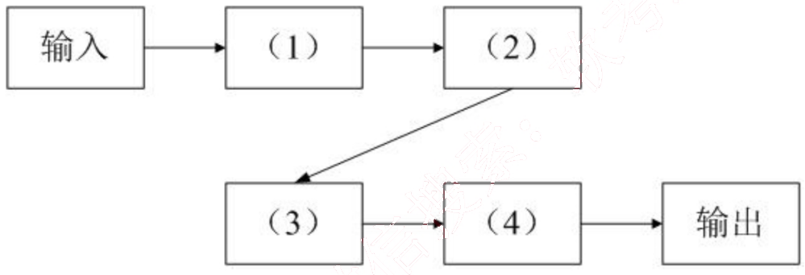
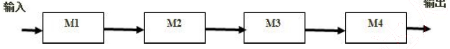
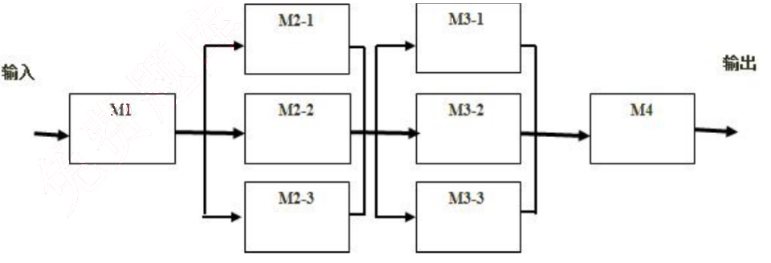

# 2010 年下半年 系统架构设计师 · 案例分析原卷（无答案）

>
> **来源**：本地购买扫描件《2010 年下半年 系统架构设计师 案例分析》（原卷，题干与参考答案分离）
> **来源类型**：`real`
> **解析方式**：byted-las-document-parse（normal 模式）+ 机械清洗，已剔除页眉、广告条与页码
> **答案与解析**：原卷不含参考答案；作答后请对照同考期的研读版文件评分
> **使用范围**：经典选题，仅保留原题号 一、二、四、五；不作为完整年份模考。筛选依据见 [历史题复核](../HISTORICAL_CURATION.md)。

## 试题一
> **题型**：案例 03 · 架构风格对比与选型

阅读以下关于软件架构设计的叙述，在答题纸上回答问题1至问题3。

### 【说明】
某公司欲针对Linux操作系统开发一个KWIC（KeyWord in Context）检索系统。该系统接收用户输入的查询关键字，依据字母顺序给出相关帮助文档并根据帮助内容进行循环滚动阅读。在对KWIC系统进行需求分析时，公司的业务专家发现用户后续还有可能采用其他方式展示帮助内容。根据目前需求，公司的技术人员决定通过重复剪切帮助文档中的第一个单词并将其插入到行尾的方式实现帮助文档内容的循环滚动，后续还将采用其他的方法实现这一功能。

在对KWIC系统的架构进行设计时，公司的架构师王工提出采用共享数据的主程序-子程序的架构风格，而李工则主张采用管道-过滤器的架构风格。在架构评估会议上，大家从系统的算法变更、功能变更、数据表示变更和性能等方面对这两种方案进行评价，最终采用了李工的方案。

### 【问题1】（8分）
在实际的软件项目开发中，采用恰当的架构风格是项目成功的保证。请用200字以内的文字说明什么是软件架构风格，并对主程序-子程序和管道-过滤器这两种架构风格的特点进行描述。

### 【问题2】（13分）
请完成表1-1中的空白部分（用+表示优、-表示差），对王工和李工提出的架构风格进行评价，并指出采用李工方案的原因。

表1-1 王工与李工的架构风格评价

<table>
<thead>
  <tr>
    <th>架构风格 评价要素</th>
    <th>共享数据的主程序-子程序</th>
    <th>管道-过滤器</th>
  </tr>
</thead>
<tbody>
  <tr>
    <td>算法变更</td>
    <td>-</td>
    <td>（1）</td>
  </tr>
  <tr>
    <td>功能变更</td>
    <td>（2）</td>
    <td>+</td>
  </tr>
  <tr>
    <td>数据表示变更</td>
    <td>（3）</td>
    <td>（4）</td>
  </tr>
  <tr>
    <td>性能</td>
    <td>（5）</td>
    <td>（6）</td>
  </tr>
</tbody>
</table>

### 【问题3】 （4分）

图1-1 是李工给出的架构设计示意图，请将恰当的功能描述填入图中的（1）～（4）。

## 试题二
> **题型**：案例 02 · 数据库设计（分布式 / 读写分离）

阅读以下关于软件架构设计的叙述，在答题纸上回答问题1至问题3 。

【说明】

RMO 是一家运动服装制造销售公司，计划在5年时间内将销售区域从华南地区扩展至全国范围。为了扩大信息技术对于未来业务发展的价值，公司邀请咨询顾问帮助他们制订战略信息系统规划。经过评审，咨询顾问给出的战略规划要点之一是建立客户关系支持系统 CRSS。RMO 公司决定由其技术部成立专门的项目组负责 CRSS 的开发和维护工作。

项目组在仔细调研和分析了系统需求的基础上，确定了基于互联网的 CRSS 系统架构。但在确定系统数据架构时，张工认为应该采用集中式的数据架构，给出的理由是结构简单、易维护且开发及运行成本低；而刘工建议采用分布式的数据架构，并提出在开发中通过“局部数据库+缓存”的读写分离结构实现，具有较好的运行性能和可扩展性。

项目组经过集体讨论，考虑到公司的未来发展规划，最终采用了刘工的建议。

### 【问题1】 （8分）

请用300字以内的文字，说明张工和刘工提出的数据架构的基本思想。

### 【问题2】 （13分）

在刘工建议的基础上，为了避免 CRSS 系统的单点故障，请用200字以内的文字简要说明如何建立 CRSS 的数据库系统；对于数据的读取、添加、更改和删除操作分别如何实现。

### 【问题3】 （4分）

RMO 公司销售区域将在未来5年大面积扩展，其潜在客户数量也会因此大幅度增加，所以良好的可扩展性是 CRSS 系统所必需的质量属性。请分别说明在集中式和分布式数据架构下，可以采用哪些方法提升系统的可扩展性。

## 试题四
> **题型**：案例 10 · SOA 与企业应用集成

阅读以下关于软件架构设计的叙述，在答题纸上回答问题1至问题3 。

## 【说明】
TeleDev 是一个大型的电信软件开发公司，公司内部采用多种商业/开源的工具进行软件系统设计与开发工作。为了提高系统开发效率，公司管理层决定开发一个分布式的系统设计与开发工具集成框架，将现有的系统设计与开发工具有效集成在一起。集成框架开发小组经过广泛调研，得到了如下核心需求。
(1) 目前使用的系统设计与开发工具的运行平台和开发语言差异较大，集成框架应无缝集成各个工具的功能；
(2) 目前使用的系统设计与开发工具所支持的通信协议和数据格式各不相同，集成框架应实现工具之间的灵活通信和数据格式转换；
(3) 集成框架需要根据实际的开发流程灵活、动态地定义系统工具之间的协作关系；
(4) 集成框架应能集成一些常用的第三方实用工具，如即时通信、邮件系统等。

集成框架开发小组经过分析与讨论，最终决定采用企业服务总线（ESB）作为集成框架的基础架构。

## 【问题1】（8分）
ESB 是目前企业级应用集成常用的基础架构。请列举出 ESB 的 4 个主要功能，并从集成系统的部署方式、待集成系统之间的耦合程度、集成系统的可扩展性三个方面说明为何采用 ESB 作为集成框架的基础架构。

## 【问题2】（12分）
在 ESB 基础架构的基础上，请根据题干描述中的 4 个需求，说明每个需求应该采用何种具体的集成方式或架构风格最为合适。

### 【问题3】 （5分）

请指出在实现工具之间数据格式的灵活转换时，通常采用的设计模式是什么，并对实现过程进行简要描述。

## 试题五
> **题型**：案例 13 · 可靠性与容错设计

阅读以下信息系统可靠性的问题，在答题纸上回答问题1至问题3。

某软件公司开发一项基于数据流的软件，其系统的主要功能是对输入的数据进行多次分析、处理和加工，生成需要的输出数据。需求方对该系统的软件可靠性要求很高，要求系统能够长时间无故障运行。该公司将该系统设计交给王工负责。王工给出该系统的模块示意图，如图5-1所示。王工解释：只要各个模块的可靠度足够高，失效率足够低，则整个软件系统的可靠性是有保证的。

图5-1 王工建议的软件系统模块示意图

李工对王工的方案提出了异议。李工认为王工的说法有两个问题：第一，即使每个模块的可靠度足够高，假设各个模块的可靠度均为0.99，但是整个软件系统模块之间全部采用串联，则整个软件系统的可靠度为$0.99^4=0.96$，即整个软件系统的可靠度下降明显；第二，软件系统模块全部采用串联结构，一旦某个模块失效，则意味着整个软件系统失效。

李工认为，应该在软件系统中采用冗余技术中的动态冗余或者软件容错的N版本程序设计技术，对容易失效或者非常重要的模块进行冗余设计，将模块之间的串联结构部分变为并联结构，来提高整个软件系统的可靠性。同时，李工给出了采用动态冗余技术后的软件系统模块示意图，如图5-2所示。

图5-2 李工建议的系统模块示意图

刘工建议，李工方案中M1和M4模块没有采用容错设计，但M1和M4发生故障有可能导致严重后果。因此，可以在M1和M4模块设计上采用检错技术，在软件出现故障后能及时发现并报警，提醒维护人员进行处理。

注：假设各个模块的可靠度均为0.99。

### 【问题1】 （4分）

在系统可靠性中，可靠度和失效率是两个非常关键的指标，请分别解释其含义。

### 【问题2】 （13分）

请解释李工提出的动态冗余和N版本程序设计技术，给出图5-1中模块M2采用图5-2动态冗余技术后的可靠度。

请给出采用李工设计方案后整个系统可靠度的计算方法，并计算结果。

### 【问题3】 （8分）

请给出检错技术的优缺点，并说明检测技术常见的实现方式和处理方式。
