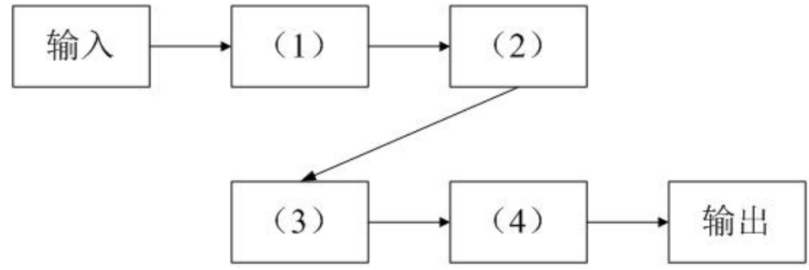
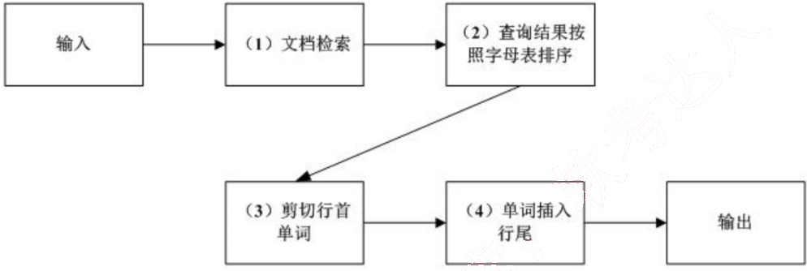
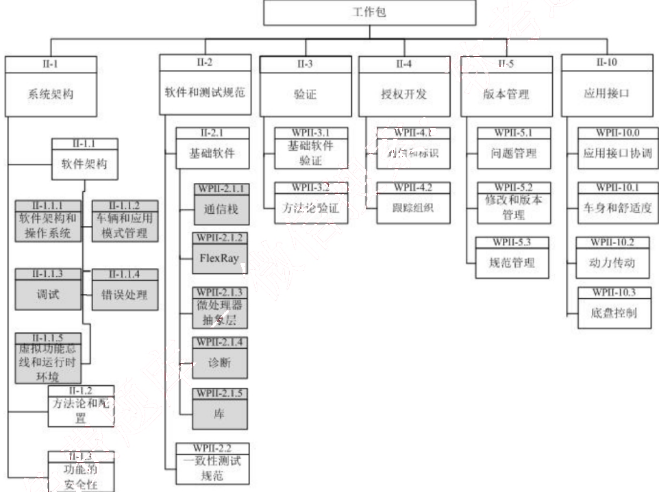
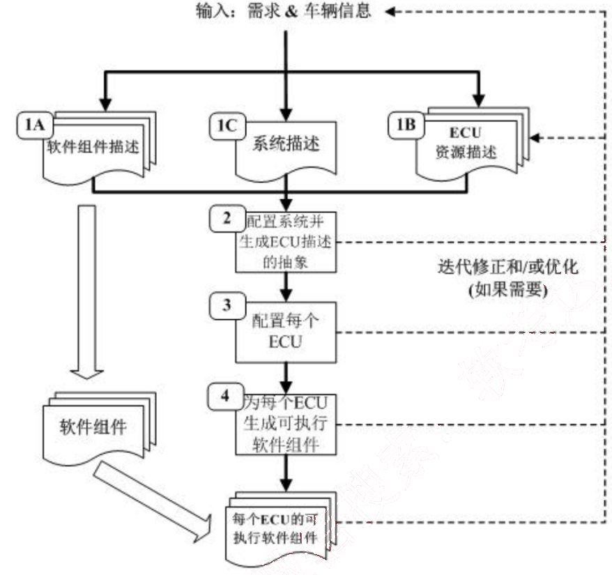
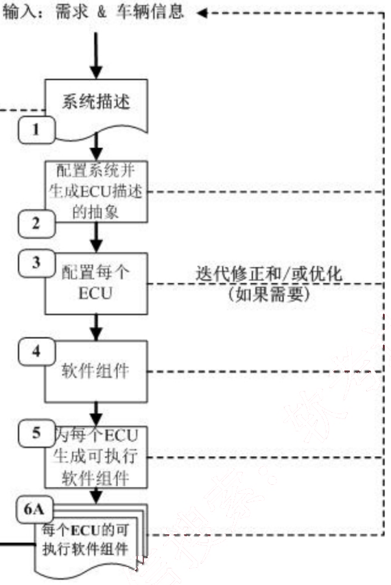
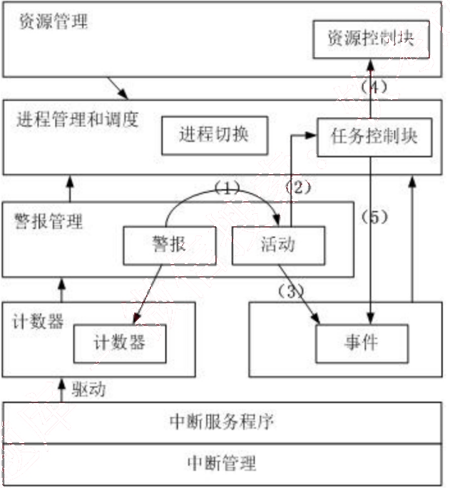
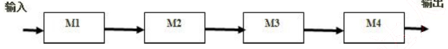
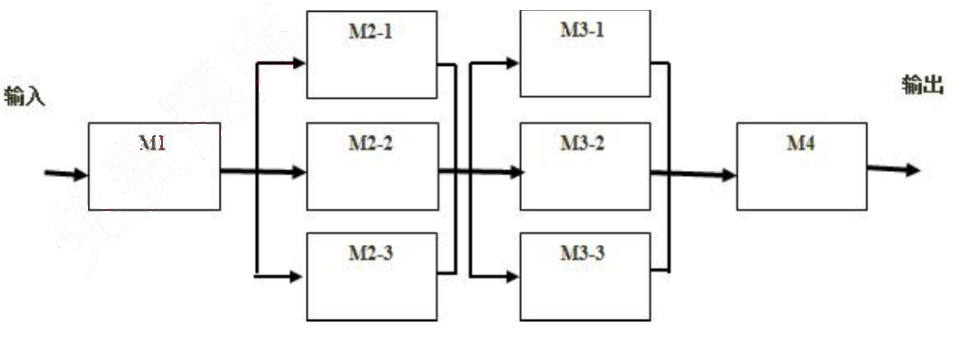

# 2010 年下半年 系统架构设计师 · 案例分析真题

> 试题一必答 + 试题二至五选答 2 道；含参考答案
>
> **来源**：本地购买扫描件《2010 年下半年系统架构设计师 答案详解》（贡献者已购买并授权转录）
> **来源类型**：`real`
> **解析方式**：byted-las-document-parse（normal 模式）+ 机械清洗，已剔除页眉、广告条与页码
> **答案与解析**：取自随卷答案详解，非本仓库编写
> **使用建议**：可用于章节训练与年份模考；关键数字建议对照原始 PDF 复核
> **完整性**：综合知识 75 题、案例分析 5 题、论文 4 题齐备

## 试题一
> **题型**：案例 03 · 架构风格对比与选型

阅读以下关于软件架构设计的叙述，在答题纸上回答问题1至问题3 。

【说明】

某公司欲针对Linux操作系统开发一个KWIC（KeyWord in Context）检索系统。该系统接收用户输入的查询关键字，依据字母顺序给出相关帮助文档并根据帮助内容进行循环滚动阅读。在对KWIC系统进行需求分析时，公司的业务专家发现用户后续还有可能采用其他方式展示帮助内容。根据目前需求，公司的技术人员决定通过重复剪切帮助文档中的第一个单词并将其插入到行尾的方式实现帮助文档内容的循环滚动，后续还将采用其他的方法实现这一功能。

在对KWIC系统的架构进行设计时，公司的架构师王工提出采用共享数据的主程序-子程序的架构风格，而李工则主张采用管道-过滤器的架构风格。在架构评估会议上，大家从系统的算法变更、功能变更、数据表示变更和性能等方面对这两种方案进行评价， 最终采用了李工的方案。

### 【问题1】 (7分)

在实际的软件项目开发中，采用恰当的架构风格是项目成功的保证。请用200字以内的文字说明什么是软件架构风格，并对主程序-子程序和管道-过滤器这两种架构风格的特点进行描述。

【答案】

软件架构风格是描述特定软件系统组织方式的惯用模式。组织方式描述了系统的组成构件和这些构件的组织方式，惯用模式则反映众多系统共有的结构和语义。

主程序-子程序架构风格中，所有的计算构件作为子程序协作工作，并由一个主程序 顺序地调用这些子程序，构件通过共享存储区交换数据。

管道-过滤器架构风格中，每个构件都有一组输入和输出，构件接受数据输入，经过内部处理，然后产生数据输出。这里的构件称为过滤器，构件之间的连接件称为数据流传输的管道。

<table>
<thead>
  <tr>
    <th>\ 架构风格 评价要素</th>
    <th>共享数据的主程序-子程序</th>
    <th>管道-过滤器</th>
  </tr>
</thead>
<tbody>
  <tr>
    <td>算法变更</td>
    <td>-</td>
    <td>(1) +</td>
  </tr>
  <tr>
    <td>功能变更</td>
    <td>(2) -</td>
    <td>+</td>
  </tr>
  <tr>
    <td>数据表示变更</td>
    <td>(3) -</td>
    <td>(4) -</td>
  </tr>
  <tr>
    <td>性能</td>
    <td>(5) +</td>
    <td>(6) -</td>
  </tr>
</tbody>
</table>

【解析】

本题主要考查软件架构风格的定义，并考查对两种与本题相关的架构风格的定义。软件架构风格是描述特定软件系统组织方式的惯用模式。组织方式描述了系统的组成构件和这些构件的组织方式，惯用模式则反映众多系统共有的结构和语义。

主程序-子程序架构风格中，所有的计算构件作为子程序协作工作，并由一个主程序顺序地调用这些子程序，构件通过共享存储区交换数据。

管道-过滤器架构风格中，每个构件都有一组输入和输出，构件接受数据输入，经过内部处理，然后产生数据输出。这里的构件称为过滤器，构件之间的连接件称为数据流传输的管道。

### 【问题2】 （12分）

请完成表1-1中的空白部分（用+表示优、-表示差），对王工和李工提出的架构风格进行评价，并指出采用李工方案的原因。

表1-1 王工与李工的架构风格评价

<table>
<thead>
  <tr>
    <th>\ 架构风格 评价要素</th>
    <th>共享数据的主程序-子程序</th>
    <th>管道-过滤器</th>
  </tr>
</thead>
<tbody>
  <tr>
    <td>算法变更</td>
    <td>-</td>
    <td>(1)</td>
  </tr>
  <tr>
    <td>功能变更</td>
    <td>(2)</td>
    <td>+</td>
  </tr>
  <tr>
    <td>数据表示变更</td>
    <td>(3)</td>
    <td>(4)</td>
  </tr>
  <tr>
    <td>性能</td>
    <td>(5)</td>
    <td>(6)</td>
  </tr>
</tbody>
</table>

【答案】

根据题干描述：“用户后续还有可能采用其他方式展示帮助内容”，因此KWIC系统对功

能变更要求较高；

根据题干描述：“后续还将采用其他的方法实现这一功能”，因此 KWIC 系统对实现某一个功能的算法变更要求较高。

KWIC 是一个支持用户交互的窗口界面程序，因此对性能要求并不高。

KWIC 系统的显示帮助内容为文本，数据的表示基本不变，因此对数据表示变更要求不高。

综合上述分析，可以看出应该采用李工提出的管道-过滤器架构风格。

【解析】

本问题是一道填表题，其核心是对两种架构风格在算法变更、功能变更、数据表示变更和性能等方面的特点进行比较。其中共享数据的主程序-子程序在算法变更方面灵活性较差，算法变更时一般需要重新编译整个系统；在功能变更方面也比较差；在数据表示方面，当需要变更时，也意味着程序传递参数的变化以及整个程序的调整，表现比较差；在性能方面，由于整个程序处在一个紧耦合的状态，因此性能较高。管道-过滤器架构风格在算法变更方面实现比较简单，只需要修改过滤器的实现即可；在功能变更方面也比较简单；在数据表示方面，需要同时改变数据格式和过滤器的结构，相对比较复杂；在性能方面，由于整个系统是松耦合连接在一起的，因此性能不高。

根据题干描述：“用户后续还有可能采用其它方式展示帮助内容”，因此 KWIC 系统对功能变更要求较高；根据题干描述：“…，后续还将采用其它的方法实现这一功能”，因此 KWIC 系统对实现某一个功能的算法变更要求较高；KWIC 是一个支持用户交互的窗口界面程序，因此对性能要求并不高；KWIC 系统的显示帮助内容为文本，数据的表示基本不变，因此对数据表示变更要求不高。针对这些考虑，可以看出应该采用管道-过滤器的架构风格。

### 【问题3】 （6分）

图 1-1 是李工给出的架构设计示意图，请将恰当的功能描述填入图中的（1）～（4）。

【答案】

【解析】
本问题是一道读图题，考查用户对系统架构的理解程度。根据题干中的关键描述“…接收用户输入的查询关键字，依据字母顺序给出相关帮助文档并根据帮助内容进行循环滚动阅读…”和“…公司的技术人员决定通过重复剪切帮助文档中的第一个单词并将其插入到行尾的方式实现帮助文档内容的循环滚动…”，可以看出整个系统的流程是：输入→文档检索→查询结果按字母排序→剪切行首单词→单词插入行尾→输出。

## 试题二
> **题型**：案例 00 · 未归类（待补题型）

阅读以下关于软件架构设计的叙述，在答题纸上回答问题1至问题3。

【说明】

RMO 是一家运动服装制造销售公司，计划在 5 年时间内将销售区域从华南地区扩展至全国范围。为了扩大信息技术对于未来业务发展的价值，公司邀请咨询顾问帮助他们制订战略信息系统规划。经过评审，咨询顾问给出的战略规划要点之一是建立客户关系支持系统 CRSS。RMO 公司决定由其技术部成立专门的项目组负责 CRSS 的开发和维护工作。

项目组在仔细调研和分析了系统需求的基础上，确定了基于互联网的 CRSS 系统架构。但在确定系统数据架构时，张工认为应该采用集中式的数据架构，给出的理由是结构简单、易维护且开发及运行成本低；而刘工建议采用分布式的数据架构，并提出在开发中通过“局部数据库+缓存”的读写分离结构实现，具有较好的运行性能和可扩展性。

项目组经过集体讨论，考虑到公司的未来发展规划，最终采用了刘工的建议。

【解析】本题考查考生对于软件系统数据架构建模的掌握情况。

数据架构定义了信息系统中文件和数据库的分布结构。数据架构建模是以数据为中心，建模业务数据类型和结构，以及设计满足应用需求的数据库系统。传统以主机为中心的信息系统开发中，利用单个的数据库系统实现数据的集中式存储，物理上所有的数据位于同一个位置，构成的是一种集中式的数据架构；现代基于网络的分布式系统开发中，很少有组织会将其全部的数据存储在单个的数据库中，通常需要多个数据库系统组成，数据在这些数据库系统之间可以传送，由多个不同的数据库管理系统控制，构成的是一种分布式的数据架构。

### 【问题1】 （8分）

请用 300 字以内的文字，说明张工和刘工提出的数据架构的基本思想。

【答案】

（1）张工提出的集中式数据架构是由一个处理器、与它相关联的数据存储设备以及其他外围设备组成，它被物理地定义到单个位置。系统提供数据处理能力，用户可以在同样的站点上操作，也可以在地理位置隔开的其他站点上通过远程终端来操作。系统及其数据管理被某个或中心站点集中控制。

（2）刘工提出的分布式数据架构使用多个计算机系统上的多个局部数据库系统构成，数据可以在多个不同的局部数据库中进行传送，由不同的数据库管理系统软件进行管理，运行在多种不同的计算机上，支持多种不同的操作系统。这些机器位于（或分布在）不同的地理

位置并通过多种通信网络连接在一起。企业数据可以分布在不同的计算机上，一个应用程序可以操作位于不同地理位置的机器上的数据。

【解析】

集中式数据架构中，一个或多个局域网中的客户共享一个单独计算机系统中的单个数据库。系统提供数据处理能力，用户可以在同样的站点上操作，也可以在地理位置隔开的其他站点上通过远程终端来操作。系统及其数据管理被某个或中心站点集中控制。单个数据库服务器结构的主要优点就是简单、易维护开发及运行成本低；但由于所有的客户直接请求服务器，容易发生性能瓶颈，如果服务失败，单个服务器不能提供备份和恢复，所有依赖的应用程序都将不能工作。

分布式数据架构中，使用多个计算机系统以及用户能够访问远程系统的数据，数据可以在多个不同的数据库中进行传送，由不同的数据库管理系统软件进行管理，运行在多种不同的计算机上，支持多种不同的操作系统。这些机器位于（或分布在）不同的地理位置并通过多种通信网络连接在一起。企业数据可以分布在不同的计算机上，一个应用程序可以操作位于不同地理位置的机器上的数据。多个数据库服务器结构的主要优点就是系统的容错能力和对广域网容量的需求有所降低，可以采用多种策略提升整个系统的服务质量；由于多个数据库系统分布在不同的网络节点上，位于不同位置的数据之间需要同步和协作，系统结构复杂、运行成本高并且维护困难。

在实际应用系统的数据架构建模中，应根据不同的应用需求选择集中式或分布式的数据架构。本题中由于 RMO 要扩展其销售区域，其潜在客户数量也会因此大幅度增加，所以良好的可扩展性是 CRSS 系统所必需的质量属性；并且由于其销售区域扩大后，系统中的数据会存储于不同的地理位置，所以采用分布式数据架构最为合理。

### 【问题2】 （13分）

在刘工建议的基础上，为了避免 CRSS 系统的单点故障，请用 200 字以内的文字简要说明如何建立 CRSS 的数据库系统；对于数据的读取、添加、更改和删除操作分别如何实现。

【答案】

读写分离架构利用了数据库的复制技术，将数据的读和写分布在不同的处理节点上，从而达到提高可用性和扩展性的目的。

CRSS 的分布式数据库系统需要由多个局部数据库系统、多个热备份数据库系统和多个数据缓存组成。局部数据库负责数据的写入，多个热备份数据库系统用以解决单点故障的问

题，数据缓存负责为应用提供所读取的数据。

(1) 读取数据：应用访问缓存，如果命中则返回，否则从局部数据库系统中读取数据并将数据加载到缓存后返回。

(2) 添加数据：采用延迟加载策略，应用将数据直接写入局部数据库。

(3) 更改数据：应用更改局部数据库中的数据，将缓存中的数据标记为失效。

(4) 删除数据：应用删除局部数据库中的数据，将缓存中的数据标记为失效。

【解析】

读写分离架构应用非常广泛，很多网站采用数据库+缓存的方式来实现。通过缓存层来承载大量的读访问，如广泛采用的Mencached，其自身往往不具备持久层存储的功能，通常和数据库一起组成分布式的数据架构，由数据库负责数据持久化存储和写入功能，缓存负责承载大量的并发访问，从而提高了系统的数据处理效率。要避免数据访问的单点故障，通常采用主数据库热备份的方式来实现。所以，要实现题目要求的分布式数据架构，需要多个局部数据库系统、多个热备份数据库系统和多个数据缓存组成。

读写分离结构中，应用读取数据时访问缓存，如果没有命中所需数据，则从主数据库中读取数据并写入缓存；对于新增、修改和删除操作，需要采用延迟加载的策略，新增时只修改主数据库，修改和删除时除了修改主数据库中的内容，还需要将缓存中的数据标记为失效。

### 【问题3】 （4分）

RMO 公司销售区域将在未来5 年大面积扩展，其潜在客户数量也会因此大幅度增加，所以良好的可扩展性是CRSS 系统所必需的质量属性。请分别说明在集中式和分布式数据架构下，可以采用哪些方法提升系统的可扩展性。

【答案】

张工提出的集中式数据架构通过向上扩展（Scale Up）提升系统的可扩展性。具体的实现方式包括硬件扩容（增加CPU 数量、内存容量、磁盘数量）和硬件升级（更换为高端主机或高速磁盘等）。

刘工提出的分布式数据架构通过向外扩展（Scale Out）提升系统的可扩展性。具体的实现方式包括数据复制、数据垂直切分或/和水平切分、缓存和全文搜索。

【解析】

传统的集中式数据架构中由于只有单个的数据库系统，所以要满足可扩展性的要求，更多的只能通过硬件的方式来实现。具体的实现方式包括硬件扩容（增加CPU/内存容量/磁盘

数量）和硬件升级（更换高端主机或高速磁盘等）。

基于网络的分布式数据架构中由多个数据库系统共同组成，可以通过更改和优化数据分布来满足系统可扩展性的要求。具体的实现方式包括数据复制、数据垂直切分（或/和）水平切分、缓存和全文搜索。

## 试题三
> **题型**：案例 08 · 嵌入式 / 构件组装

阅读以下关于软件架构设计的叙述，在答题纸上回答问题1至问题3 。

【说明】

某软件公司承担了某项国家重点项目的研制工作，任务重点是参考国外汽车电子发展趋势，开发某汽车公司的企业汽车电子基础软件的架构，逐步实现汽车企业未来技术发展规划。

该软件公司接受此项任务后，调动全体技术人员深入收集国外相关技术资料，经过多方调研和分析，公司提出遵照国际组织最新推出的 AUTOSAR 规范，按统筹规划、分步骤实施的原则，实现汽车公司的基础软件架构设计。图 3-1 给出了 AUTOSAR 规范所定义的工作包，图中灰色部分代表本项目工作所包含的内容，即软件架构和基础软件。

图 3-1 AUTOSAR 定义的工作包

【解析】

本题主要考查汽车电子基础软件架构的分析与设计，特别是系统的开发和架构设计方面。

### 【问题1】 （7分）

AUTOSAR 规范中要求，汽车电子软件开发流程应尽量满足并发、可多次迭代的特性。为了定义汽车电子的软件开发过程，公司李工和王工分别提出了两种软件开发流程， 其开发流程见图 3-2 和图 3-3 （图中 ECU 是指汽车电子中的电子控制单元）。请说明李工和王工谁

定义的流程更符合 AUTOSAR 的规定，并说明理由。

图 3-2 李工设计的流程

图 3-3 王工设计的流程

【答案】

李工设计的流程符合 AUTOSAR 要求，理由是：

李工定义的流程是将软件组件描述、系统描述和 ECU 资源描述同时定义，而王工定义的流程仅仅只做系统描述；

王工定义的流程没有考虑软件组件的描述，只是简单将软件组件作为第 4 步被集成；李工定义的 ECU 软件开发流程的优势是明确了顶层定义阶段，并行度高，迭代清晰。

【解析】

本问题主要考查在一定规范的约束下，系统设计流程的设计与定义。AUTOSAR 规范中要求，汽车电子软件开发流程应尽量满足并发、可多次迭代的特性。因此应该紧扣该规范对系统设计流程方面的要求，对李工和王工定义的流程进行评价。具体来说：

（1）李工定义的流程是将软件组件描述、系统描述和 ECU 资源描述同时定义，而王工定义的流程仅仅只做系统描述；

（2）王工定义的流程没有考虑软件组件的描述，只是简单将软件组件作为第 4 步被集

成；

（3）李工定义的ECU软件开发流程的优势是明确了顶层定义阶段，并行度高，迭代清晰。

综上，应该采用李工的设计方案。

### 【问题2】 （10分）

图3-1中的II-U.1项中定义了软件架构和操作系统的要求，图3-4是满足AUTOSAR定义的操作系统各功能模块的层次结构，请说明（1）～（5）箭头所标的具体操作含义。

图3-4 AUTOSAR定义的操作系统结构

【答案】

(1) 操作系统的警报管理发现ECU系统出错时，启动错误处理程序；

(2) 错误处理程序将具体动作交由进程管理完成对发生错误的任务进行处理；

(3) 错误处理程序产生一个错误事件；

(4) 任务控制块处理程序调用资源管理功能，实现硬件资源重分配；

(5) 任务控制块处理程序通知事件管理，对错误事件进行应答。

【解析】

本问题是一道读图题，要求考生在分析AUTOSAR定义的操作系统结构进行分析与理解的

基础上进行填写。根据图示，系统从下至上依次可以分为中断管理、事件管理、警报管理、进程管理和调度以及资源管理四个部分。根据图中模块之间的关系，可以看出，（1）处主要表示当操作系统的警报管理发现 ECU 系统出错时，启动错误处理程序；（2）表示错误处理程序将具体动作交由进程管理完成对发生错误的任务进行处理；（3）表示错误处理程序产生一个错误事件；（4）表示任务控制块处理程序调用资源管理功能，实现硬件资源重分配；（5）表示任务控制块处理程序通知事件管理，对错误事件进行应答。

### 【问题3】 （8分）

AUTOSAR 是一种开放式架构，用 150 字以内的文字，说明采用 AUTOSAR 架构的主要优点，并说明汽车电子 ECU 覆盖汽车的哪三个领域。

【答案】
采用 AUTOSAR 开放式架构的优点是：
(1) 可以有效支持多厂家汽车电子基础软件的研制；
(2) 有利于软件的重用，可根据不同的 ECU 结构，通过数据配置，自动生成各种 ECU 软件组件；
(3) AUTOSAR 定义的软件框架支持了汽车电子软件的全生存周期，包括构架、开发、测试、验证、授权、版本和接口。

AUTOSAR 规范覆盖整个汽车电子的三大领域：动力、底盘、车身。

【解析】
本题主要考查考生对 AUTOSAR 架构的分析与总结能力。根据题干和上述两个题目的回答，可以看出，采用 AUTOSAR 开放式架构的优点主要包括：
(1) 具有厂商独立性，可以有效支持多厂家汽车电子基础软件的研制；
(2) 软件层次上的重用性，可根据不同的 ECU 结构，通过数据配置，自动生成各种 ECU 软件组件；
(3) 支持汽车电子软件的全生存周期，包括构架、开发、测试、验证、授权、版本和接口；

另外，该规范覆盖整个汽车电子的三大领域为动力、底盘和车身。

## 试题四
> **题型**：案例 00 · 未归类（待补题型）

阅读以下关于软件架构设计的叙述，在答题纸上回答问题1至问题3。

【说明】

TeleDev 是一个大型的电信软件开发公司，公司内部采用多种商业/开源的工具进行软件系统设计与开发工作。为了提高系统开发效率，公司管理层决定开发一个分布式的系统设计与开发工具集成框架，将现有的系统设计与开发工具有效集成在一起。集成框架开发小组经过广泛调研，得到了如下核心需求。

（1）目前使用的系统设计与开发工具的运行平台和开发语言差异较大，集成框架应无缝集成各个工具的功能；

（2）目前使用的系统设计与开发工具所支持的通信协议和数据格式各不相同，集成框架应实现工具之间的灵活通信和数据格式转换；

（3）集成框架需要根据实际的开发流程灵活、动态地定义系统工具之间的协作关系；

（4）集成框架应能集成一些常用的第三方实用工具，如即时通信、邮件系统等。

集成框架开发小组经过分析与讨论，最终决定采用企业服务总线（ESB）作为集成框架的基础架构。

【解析】

本题主要考查系统集成的相关知识及应用，需要考生结合题干描述和自己的实际经验进行回答。

### 【问题1】 （8分）

ESB 是目前企业级应用集成常用的基础架构。请列举出 ESB 的 4 个主要功能，并从集成系统的部署方式、待集成系统之间的耦合程度、集成系统的可扩展性三个方面说明为何采用 ESB 作为集成框架的基础架构。

【答案】

ESB 的主要功能包括：
（1）应用程序的位置透明性
（2）传输协议转换
（3）消息格式转换
（4）消息路由
（5）消息增强
（6）安全支持

（7）监控和管理

采用 ESB 作为集成框架，能够实现灵活的部署结构，包括 CS 结构、P2P 结构等。采用 ESB 作为集成框架，待集成系统只需要和总线进行联系，彼此之间不需要互相通信，这样就大大降低了系统的耦合程度。

采用 ESB 作为集成框架，在加入新的待集成系统时，只需要采用插件的方式实现传输协议和数据格式的适配即可，系统的可扩展性较强。

【解析】
本问题主要考查企业服务总线（ESB）的基本概念，需要考生列举出企业服务总线七个核心功能中的任意四个，根据 ESB 的特点，其核心功能包括：
（1）应用程序的位置透明性
（2）传输协议转换
（3）消息格式转换
（4）消息路由
（5）消息增强
（6）安全支持
（7）监控和管理

根据集成系统的部署方式，可以看出采用 ESB 作为集成框架，能够实现灵活的部署结构，包括 CS 结构、P2P 结构等。

从待集成系统之间的耦合程度，可以看出采用 ESB 作为集成框架，待集成系统只需要和总线进行联系，彼此之间不需要互相通信，这样就大大降低了系统的耦合程度。

从集成系统的可扩展性，可以看出采用 ESB 作为集成框架，在加入新的待集成系统时，只需要采用插件的方式实现传输协议和数据格式的适配即可，系统的可扩展性较强。

### 【问题2】 （12分）

在 ESB 基础架构的基础上，请根据题干描述中的 4 个需求，说明每个需求应该采用何种具体的集成方式或架构风格最为合适。

【答案】
对于需求（1）来说，由于需要共享系统的功能，并且系统的运行平台与语言差异较大，应该采用面向服务的方式进行功能集成，可以将工具的功能包装为服务，实现跨语言与跨平台访问。

对于需求（2）来说，工具所支持的通信协议和数据格式各不相同，并需要实现工具之间的灵活通信协议和数据格式交换，因此应该基于消息总线，以协议及数据适配器的方式实现灵活的通信协议和数据格式转换。

对于需求（3）来说，集成框架需要根据实际的软件系统开发流程，灵活、动态地定义系统设计与开发工具之间的协作关系，因此应该引入工作流定义语言及其引擎来动态描述工具之间的协作关系。

对于需求（4）来说，应该采用界面集成的方法对第三方工具进行集成，绕过工具内部的复杂处理逻辑。

【解析】

对于需求（1）“目前使用的系统设计与开发工具的运行平台和开发语言差异较大，集成框架应无缝集成各个工具的功能”来说，由于需要共享系统的功能，并且系统的运行平台与语言差异较大，应该采用面向服务的方式进行功能集成，可以将工具的功能包装为服务，实现跨语言与跨平台访问。

对于需求（2）“目前使用的系统设计与开发工具所支持的通信协议和数据格式各不相同，集成框架应实现工具之间的灵活通信和数据格式转换”来说，工具所支持的通信协议和数据格式各不相同，并需要实现工具之间的灵活通信协议和数据格式交换，因此应该基于消息总线，以协议及数据适配器的方式实现灵活的通信协议和数据格式转换。

对于需求（3）“集成框架需要根据实际的开发流程灵活、动态地定义系统工具之间的协作关系”来说，集成框架需要根据实际的软件系统开发流程，灵活、动态地定义系统设计与开发工具之间的协作关系，因此应该采用解释器架构风格，引入工作流定义语言及其引擎来动态描述工具之间的协作关系。

对于需求（4）“集成框架应能集成一些常用的第三方实用工具，如即时通信，邮件系统等”来说，应该采用界面集成的方法对第三方工具进行集成，绕过工具内部的复杂处理逻辑，实现功能集成。

### 【问题3】 （5分）

请指出在实现工具之间数据格式的灵活转换时，通常采用的设计模式是什么，并对实现过程进行简要描述。

【答案】

在实现工具之间数据格式的灵活转换时，通常采用适配器设计模式。即应首先定义一个

统一的数据转换接口类，然后针对不同的数据格式转换需求定义对应的实际转换类，实际转换类需要继承数据转换接口类，并实现接口转换类定义的接口。

【解析】

本题主要考查数据转换在实现层面上的常用方法。在实现工具之间数据格式的灵活转换时，通常采用适配器设计模式。即应首先定义一个统一的数据转换接口类，然后针对不同的数据格式转换需求定义对应的实际转换类，实际转换类需要继承数据转换接口类，并实现接口转换类定义的接口。）

## 试题五
> **题型**：案例 13 · 可靠性与容灾设计

阅读以下信息系统可靠性的问题，在答题纸上回答问题1至问题3。

某软件公司开发一项基于数据流的软件，其系统的主要功能是对输入的数据进行多次分析、处理和加工，生成需要的输出数据。需求方对该系统的软件可靠性要求很高，要求系统能够长时间无故障运行。该公司将该系统设计交给王工负责。王工给出该系统的模块示意图，如图5-1所示。王工解释：只要各个模块的可靠度足够高，失效率足够低，则整个软件系统的可靠性是有保证的。

图5-1 王工建议的软件系统模块示意图

李工对王工的方案提出了异议。李工认为王工的说法有两个问题：第一，即使每个模块的可靠度足够高，假设各个模块的可靠度均为0.99，但是整个软件系统模块之间全部采用串联，则整个软件系统的可靠度为0.99⁴=0.96，即整个软件系统的可靠度下降明显；第二，软件系统模块全部采用串联结构，一旦某个模块失效，则意味着整个软件系统失效。

李工认为，应该在软件系统中采用冗余技术中的动态冗余或者软件容错的N版本程序设计技术，对容易失效或者非常重要的模块进行冗余设计，将模块之间的串联结构部分变为并联结构，来提高整个软件系统的可靠性。同时，李工给出了采用动态冗余技术后的软件系统模块示意图，如图5-2所示。

图5-2 李工建议的系统模块示意图

刘工建议，李工方案中M1和M4模块没有采用容错设计，但M1和M4发生故障有可能导致严重后果。因此，可以在M1和M4模块设计上采用检错技术，在软件出现故障后能及时发现并报警，提醒维护人员进行处理。

注：假设各个模块的可靠度均为0.99。

【解析】

本题考查信息系统中可靠性的设计，是比较传统的题目，要求考生细心分析题目中所描述的内容。

### 【问题1】 （4分）

在系统可靠性中，可靠度和失效率是两个非常关键的指标，请分别解释其含义。

【答案】
可靠度就是系统在规定的条件下、规定的时间内不发生失效的概率。

失效率又称风险函数，也可以称为条件失效强度，是指运行至此刻系统未出现失效的情况下，单位时间系统出现失效的概率。

【解析】
本问题考查信息系统可靠性的两个基本概念：可靠度和失效率。可靠性是指产品在规定的条件下和规定的时间内完成规定功能的能力。考虑到软件本身的复杂性，软件可靠性的定义是：在规定的条件下，在规定的时间内，软件不引起系统失效的概率。

在软件可靠性的定量描述中，软件可靠性可以基于使用条件、规定时间、系统输入、系统使用和软件缺陷等变量构建数学表达式，来对软件可靠性进行定量描述。相关概念有规定时间、失效概率、可靠度、失效强度、失效率、平均无失效时间等。其中可靠度是表示可靠性最直接的方式，是软件系统在规定的条件下、规定的时间内不发生失效的概率。而失效率又称风险函数，也可以称为条件失效强度，是指运行至此刻系统未出现失效的情况下，单位时间系统出现失效的概率。

### 【问题2】 （13分）

请解释李工提出的动态冗余和N版本程序设计技术，给出图5-1中模块M2采用图5-2动态冗余技术后的可靠度。

请给出采用李工设计方案后整个系统可靠度的计算方法，并计算结果。

【答案】
动态冗余又称为主动冗余，它是通过故障检测、故障定位及故障恢复等手段达到容错的目的。其主要方式是多重模块待机储备，当系统检测到某工作模块出现错误时，就用一个备用的模块来替代它并重新运行。各备用模块在其待机时，可与主模块一样工作，也可以不工作。前者叫热备份系统（双重系统），后者叫冷备份系统（双工系统、双份系统）。N版本程序设计是一种静态的故障屏蔽技术，其设计思想是用N个具有相同功能的程序同时执行一项

计算，结果通过多数表决来选择。其中N个版本的程序必须由不同的人独立设计，使用不同的方法、设计语言、开发环境和工具来实现，目的是减少N个版本的程序在表决点上相关错误的概率。

M2 采用动态冗余后的可靠度为：R=1- (1-0.99) ^ 3 = 0.999999

李工给出的方案同时采用了串联和并联方式，其计算方法为首先计算出中间M2和M3两个并联系统的可靠度，再按照串联系统的计算方法计算出整个系统的可靠度。

R = 0.99 * 0.999999 * 0.999999 * 0.99 = 0.98

【解析】

本问题考查在常规的软件设计中，应用各种方法和技术，使程序设计在兼顾用户功能和性能需求的同时，全面满足软件的可靠性要求。常见的软件可靠性技术主要有容错设计、检错设计和降低复杂度设计等技术。

其中，容错设计技术主要有恢复快设计、N版本程序设计和冗余设计三种方法。N版本程序设计是一种静态的故障屏蔽技术，其设计思想是用N个具有相同功能的程序同时执行一项计算，结果通过多数表决来选择。其中N个版本的程序必须由不同的人独立设计，使用不同的方法、设计语言、开发环境和工具来实现，目的是减少N个版本的程序在表决点上相关错误的概率。动态冗余又称为主动冗余，它是通过故障检测、故障定位及故障恢复等手段达到容错的目的。其主要方式是多重模块待机储备，当系统检测到某工作模块出现错误时，就用一个备用的模块来替代它并重新运行。各备用模块在其待机时，可与主模块一样工作，也可以不工作。前者叫热备份系统（双重系统），后者叫冷备份系统（双工系统、双份系统）。计算机系统是一个复杂系统，影像其可靠性的因素很多，很难直接进行可靠性分析，往往需要建立对应的数学模型。组合模型是分析系统可靠性的一种常用方法。

组合模型下可靠度的计算方法为：

串联系统：R=R1×R2×……×Rn；

并联系统：R=1-(1-R1) ×(1-R2) ×……×(1-Rn)；

串联和并联混合系统则根据实际情况，灵活运用上述两个计算公式。

M2 采用动态冗余后，成为并联系统，则其可靠度为：$R = 1 - (1-0.99)^3 = 0.999999$。

李工给出的方案同时采用了串联和并联方式，其计算方法为首先计算出中间M2和M3两个并联系统的可靠度，再按照串联系统的计算方法计算出整个系统的可靠度。

R = 0.99 * 0.999999 * 0.999999 * 0.99 = 0.98

### 【问题3】 （8分）

请给出检错技术的优缺点，并说明检测技术常见的实现方式和处理方式。

【答案】

检错技术实现的代价一般低于容错技术和冗余技术，但有一个明显的缺点，就是不能自动解决故障，出现故障后如果不进行人工干预，将最终导致软件系统不能正常运行。

检错技术常见的实现方式：最直接的一种实现方式是判断返回结果，如果返回结果超出正常范围，则进行异常处理；计算运行时间也是一种常用技术，如果某个模块或函数运行时间超过预期时间，可以判断出现故障；还有置状态标志位等多种方法，自检的实现方式需要根据实际情况来选用。

检错技术的处理方式，大多数都采用“查出故障-停止软件运行-报警”的处理方式。但根据故障的不同情况，也有采用不停止或部分停止软件系统运行的情况，这一般由故障是否需要实时处理来决定。

【解析】本问题考查软件可靠性设计中的检错技术。

检错技术常见的实现方式有多种，最直接的一种实现方式是判断返回结果，如果返回结果超出正常范围，则进行异常处理；计算运行时间也是一种常用技术，如果某个模块或函数运行时间超过预期时间，可以判断出现故障；还有置状态标志位等多种方法，自检的实现方式需要根据实际情况来选用。

检错技术的处理方式也有多种，大多数都采用“查处故障-停止软件运行-报警”的处理方式。但根据故障的不同情况，也有采用不停止或部分停止软件系统运行的情况，这一般由故障是否需要实时处理来决定。

检错技术实现的代价一般低于容错技术和冗余技术，但有一个明显的缺点，就是不能自动解决故障，出现故障后如果不进行人工干预，将最终导致软件系统不能正常运行。
