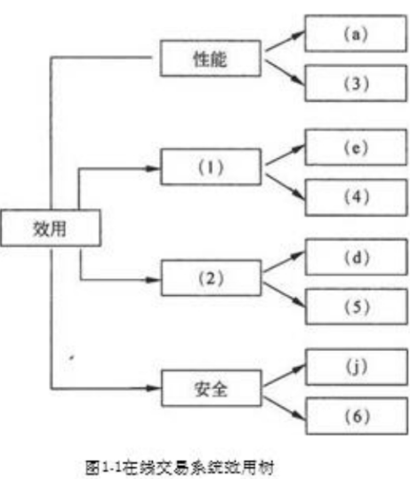
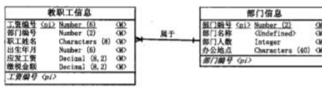
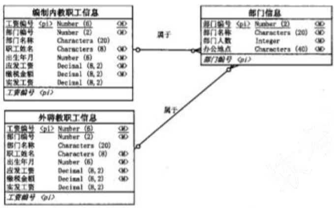
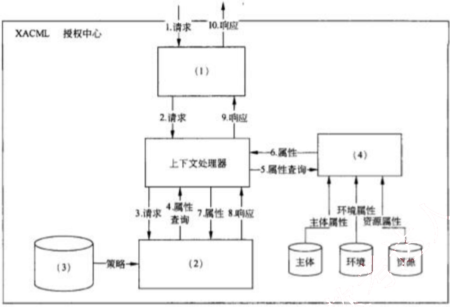

# 2011 年下半年 系统架构设计师 · 案例分析原卷（无答案）

>
> **来源**：本地购买扫描件《2011 年下半年 系统架构设计师 案例分析》（原卷，题干与参考答案分离）
> **来源类型**：`real`
> **解析方式**：byted-las-document-parse（normal 模式）+ 机械清洗，已剔除页眉、广告条与页码
> **答案与解析**：原卷不含参考答案；作答后请对照同考期的研读版文件评分
> **使用范围**：经典选题，仅保留原题号 一、二、四、五；不作为完整年份模考。筛选依据见 [历史题复核](../HISTORICAL_CURATION.md)。

## 试题一
> **题型**：案例 01 · 架构评估（ATAM）

【说明】

某网上购物电子商务公司拟升级正在使用的在线交易系统，以提高用户网上购物在线支付环节的效率和安全性。在系统的需求分析与架构设计阶段，公司提出的需求和关键质量属性场景如下：

(a) 正常负载情况下，系统必须在 0.5 秒内对用户的交易请求进行响应；
(b) 信用卡支付必须保证 99.999%的安全性；
(c) 对交易请求处理时间的要求将影响系统的数据传输协议和处理过程的设计；
(d) 网络失效后，系统需要在 1.5 分钟内发现错误并启用备用系统；
(e) 需要在 20 人月内为系统添加一个新的 CORBA 中间件；
(f) 交易过程中涉及到的产品介绍视频传输必须保证画面具有 600*480 的分辨率，20帧/秒的速率；
(g) 更改加密的级别将对安全性和性能产生影响；
(h) 主站点断电后，需要在 3 秒内将访问请求重定向到备用站点；
(i) 假设每秒中用户交易请求的数量是 10 个，处理请求的时间为 30 毫秒，则“在1秒内完成用户的交易请求”这一要求是可以实现的；
(j) 用户信息数据库授权必须保证 99.999%可用；
(k) 目前对系统信用卡支付业务逻辑的描述尚未达成共识，这可能导致部分业务功能模块的重复，影响系统的可修改性；
(l) 更改 Web 界面接口必须在 4 人周内完成；
(m) 系统需要提供远程调试接口，并支持系统的远程调试。

在对系统需求和质量属性场景进行分析的基础上，系统的架构师给出了三个候选的架构设计方案。公司目前正在组织系统开发的相关人员对系统架构进行评估。

### 【问题1】

在架构评估过程中，质量属性效用树（utility tree）是对系统质量属性进行识别和优先级排序的重要工具。请给出合适的质量属性，填入图 1-1 中（1）、（2）空白处；并选择题干描述的（a）～（m），填入（3）～（6）空白处，完成该系统的效用树。

图1-1在线交易系统效用树

### 【问题2】

在架构评估过程中，需要正确识别系统的架构风险、敏感点和权衡点，并进行合理的架构决策。请用300字以内的文字给出系统架构风险、敏感点和权衡点的准义，并从 题干（a）～（m）中各选出1个对系统架构风险、敏感点和权衡点最为恰当的描述。

## 试题二
> **题型**：案例 02 · 数据库设计（反规范化）

【说明】
某软件公司成立项目组为某高校开发一套教职工信息管理系统。与教职工信息相关的数据需求和处理需求如下：
(1) 数据需求：在教职工信息中能够存储学校所有在职的教工和职工信息，包括姓名、所属部门、出生年月、工资编号、工资额和缴税信息；部门信息中包括部门编号、部门名称、部门人数和办公地点信息。
(2) 处理需求：能够根据编制内或外聘教职工的工资编号分别查询其相关信息；每个月的月底统一核发工资，要求系统能够以最快速度查询出教工或者职工所在部门名称、实发工资金额；由于学校人员相对稳定，所以数据变化及维护工作量很少。

项目组王工和李工针对上述应用需求分别给出了所设计的数据模型（如图 2-1 和图 2-2 所示）。王工遵循数据库设计过程，按照第三范式对数据进行优化和调整，所设计的数据模型简单且基本没有数据冗余；而李工设计的数据模型中存在大量数据冗余。

项目组经过分析和讨论，特别是针对数据处理中对数据访问效率的需求，最终选择了李工给出的数据模型设计方案。

### 【问题1】

请用 300 字以内的文字，说明什么是数据库建模中的反规范化技术，指出采用反规范化技术能获得哪些益处，可能带来哪些问题。

图2-1 王工设计的数据模型

图2-2 李工设计的数据模型

### 【问题2】

请简要叙述常见的反规范化技术有哪些。

### 【问题3】

请分析李工是如何应用反规范化技术来满足教职工信息管理需求的。

## 试题四
> **题型**：案例 10 · SOA 与资源服务（REST）

【说明】

某公司拟开发一个市场策略跟踪与分析系统，根据互联网上用户对公司产品信息的访问情况和产品实际销售情况来追踪各种市场策略的效果。其中互联网上用户对公司产品信息的访问情况需要借助两种不同的第三方Web分析软件进行数据采集与统计，并生成不同格式的数据报表；公司产品的实际销售情况则需要通过各个分公司的产品销售电子表格或数据库进行采集与汇总。得到相关数据后，还要对数据进行分析与统计，并通过浏览器以在线的方式向市场策略制定者展示最终的市场策略效果。

在对市场策略跟踪与分析系统的架构进行设计时，公司的架构师王工提出采用面向服务的系统架构，首先将各种待集成的第三方软件和异构数据源统一进行包装，然后将数据访问功能以标准Web服务接口的形式对外暴露，从而支持系统进行数据的分析与处理，前端则采用CSS等技术实现浏览器数据的渲染与展示。架构师李工则认为该系统的核心在于数据的定位、汇聚与转换，更适合采用面向资源的架构，即首先为每种数据元素确定地址，然后将各种数据格式统一转换为JSON格式，通过对JSON数据的组合支持数据的分析与处理任务，处理结果经过渲染后在浏览器的环境中进行展示。在架构评估会议上，专家对这两种方案进行综合评价，最终采用了李工的方案。

### 【问题1】

请根据题干描述，对市场策略跟踪与分析系统的数据源特征与数据操作方式进行分析，完成表4-1中的（1）～（3），并用200字以内的文字说明李工方案的优点。

<table>
<thead>
<tr>
<th rowspan="2">数据源类型</th>
<th colspan="2">数据源特征</th>
<th>数据操作方式</th>
</tr>
<tr>
<th>数据形态</th>
<th>数据访问实时性</th>
<th></th>
</tr>
</thead>
<tbody>
<tr>
<td>互联网用户访问信息</td>
<td>（1）</td>
<td>非实时</td>
<td>（3）</td>
</tr>
<tr>
<td>产品销售信息</td>
<td>电子表格与数据库</td>
<td>（2）</td>
<td>只读</td>
</tr>
</tbody>
</table>

### 【问题2】

请从数据获取方式、数据交互方式和数据访问的上下文无关性三个方面对王工和李工的方案进行比较，并用500字以内的文字说明为什么没有采用王工的方案。

### 【问题3】

表现层状态转换（REST）是面向资源架构的核心思想，请用200字以内的文字解释什么是 REST，并指出在 REST 中将哪三种关注点进行分离。

## 试题五
> **题型**：案例 07 · 安全架构分析（加密 / RBAC）

【说明】

某大型跨国企业的 IT 部门一年前基于 SOA（Service-Oriented Architecture）对企业原有的多个信息系统进行了集成，实现了原有各系统之间的互联互通，搭建了支撑企业完整业务流程运作的统一信息系统平台。随着集成后系统的投入运行，IT 部门发现在满足企业正常业务运作要求的同时，系统也暴露出明显的安全性缺陷，并在近期出现了企业敏感业务数据泄漏及系统核心业务功能非授权访问等严重安全事件。针对这一情况，企业决定由 IT 部门成立专门的项目组负责提高现有系统的安全性。

项目组在仔细调研和分析了系统现有安全性问题的基础上，决定首先为在网络中传输的数据提供机密性（Confidentiality）与完整性（Integrity）保障，同时为系统核心业务功能的访问提供访问控制机制，以保证只有授权用户才能使用特定功能。

经过分析和讨论，项目组决定采用加密技术为网络中传输的数据提供机密性与完整性保障。但在确定具体访问控制机制时，张工认为应该采用传统的强制访问控制（Mandatory Access Control）机制，而王工则建议采用基于角色的访问控制（Role-Based Access Control）与可扩展访问控制标记语言（extensible Access Control Markup Language, XACML）相结合的机制。项目组经过集体讨论，最终采用了王工的方案。

### 【问题1】

请用400字以内的文字，分别针对采用对称加密策略与公钥加密策略，说明如何利用加密技术为在网络中传输的数据提供机密性与完整性保障。

### 【问题2】

请用300字以内的文字，从授权的可管理性、细粒度访问控制的支持和对分布式环境的支持三个方面指出项目组采用王工方案的原因。

### 【问题3】

图5-1给出了基于XACML的授权决策中心的基本结构以及一次典型授权决策的执行过程，请分别将备选答案填入图中的（1）～（4）。

备选答案：策略管理点（PAP）、策略执行点（PEP）、策略信息点（PIP）、策略决策点（PDP）

图5-1 基于XACML的授权决策中心的基本结构
