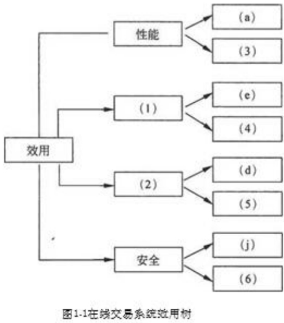
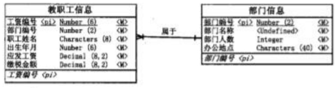
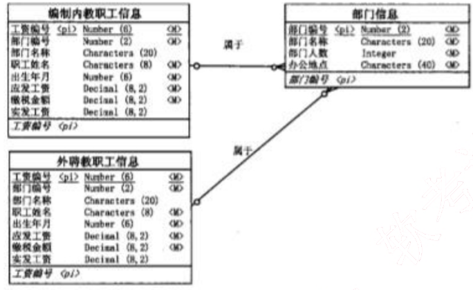
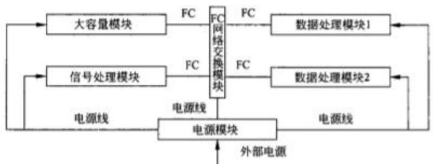
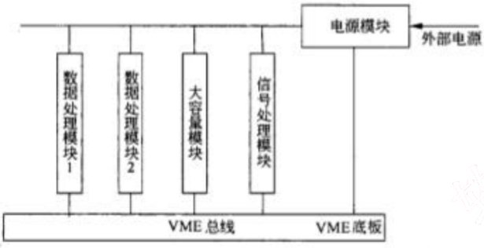
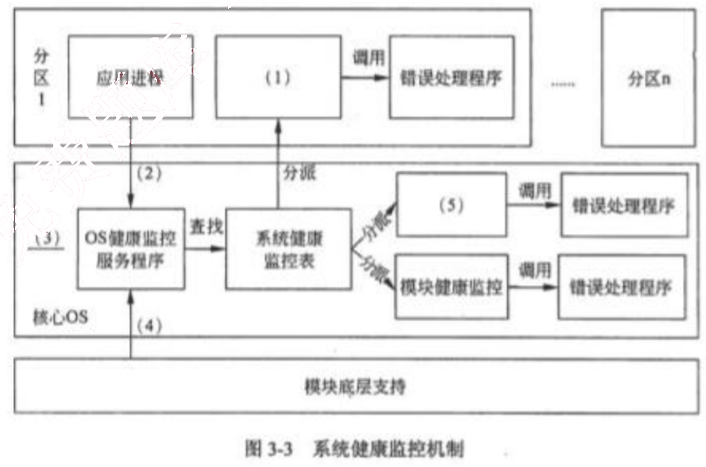
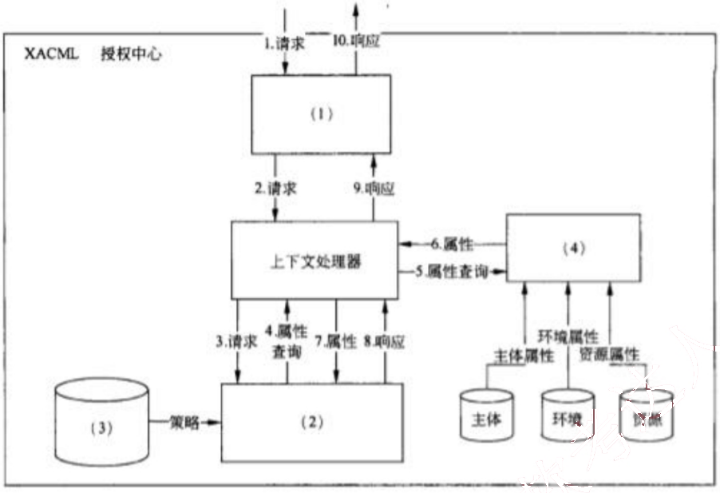

# 2011 年下半年 系统架构设计师 · 案例分析真题

> 试题一必答 + 试题二至五选答 2 道；含参考答案
>
> **来源**：本地购买扫描件《2011 年下半年系统架构设计师 答案详解》（贡献者已购买并授权转录）
> **来源类型**：`real`
> **解析方式**：byted-las-document-parse（normal 模式）+ 机械清洗，已剔除页眉、广告条与页码
> **答案与解析**：取自随卷答案详解，非本仓库编写
> **使用建议**：可用于章节训练与年份模考；关键数字建议对照原始 PDF 复核
> **完整性**：综合知识 75 题、案例分析 5 题、论文 4 题齐备

## 试题一

【说明】
某网上购物电子商务公司拟升级正在使用的在线交易系统，以提高用户网上购物在线支付环节的效率和安全性。在系统的需求分析与架构设计阶段，公司提出的需求和关键质量属性场景如下：

(a) 正常负载情况下，系统必须在 0.5 秒内对用户的交易请求进行响应；
(b) 信用卡支付必须保证 99.999%的安全性；
(c) 对交易请求处理时间的要求将影响系统的数据传输协议和处理过程的设计；
(d) 网络失效后，系统需要在 1.5 分钟内发现错误并启用备用系统；
(e) 需要在 20 人月内为系统添加一个新的 CORBA 中间件；
(f) 交易过程中涉及到的产品介绍视频传输必须保证画面具有 600*480 的分辨率，20帧/秒的速率；
(g) 更改加密的级别将对安全性和性能产生影响；
(h) 主站点断电后，需要在 3 秒内将访问请求重定向到备用站点；
(i) 假设每秒中用户交易请求的数量是 10 个，处理请求的时间为 30 毫秒，则“在 1秒内完成用户的交易请求”这一要求是可以实现的；
(j) 用户信息数据库授权必须保证 99.999%可用；
(k) 目前对系统信用卡支付业务逻辑的描述尚未达成共识，这可能导致部分业务功能模块的重复，影响系统的可修改性；
(l) 更改 Web 界面接口必须在 4 人周内完成；
(m) 系统需要提供远程调试接口，并支持系统的远程调试。

在对系统需求和质量属性场景进行分析的基础上，系统的架构师给出了三个候选的架构设计方案。公司目前正在组织系统开发的相关人员对系统架构进行评估。

### 【问题1】

在架构评估过程中，质量属性效用树（utility tree）是对系统质量属性进行识别和优先级排序的重要工具。请给出合适的质量属性，填入图 1-1 中（1）、（2）空白处；并选择题干描述的（a）～（m），填入（3）～（6）空白处，完成该系统的效用树。

图1-1在线交易系统效用树

<table>
  <tr>
    <th>编号</th>
    <th>答案</th>
  </tr>
  <tr>
    <td>(1)</td>
    <td>可修改性</td>
  </tr>
  <tr>
    <td>(2)</td>
    <td>可用性</td>
  </tr>
  <tr>
    <td>(3)</td>
    <td>f)</td>
  </tr>
  <tr>
    <td>(4)</td>
    <td>l)</td>
  </tr>
  <tr>
    <td>(5)</td>
    <td>h)</td>
  </tr>
  <tr>
    <td>(6)</td>
    <td>b)</td>
  </tr>
</table>

### 【问题2】

在架构评估过程中，需要正确识别系统的架构风险、敏感点和权衡点，并进行合理的架构决策。请用300字以内的文字给出系统架构风险、敏感点和权衡点的侠义，并从题干（a）～（m）中各选出1个对系统架构风险、敏感点和权衡点最为恰当的描述。

系统架构风险是指架构设计中潜在的、存在问题的架构决策所带来的隐患。

敏感点是指为了实现某种特定的质量属性，一个或多个系统组件所具有的特性。权衡点是指影响多个质量属性，并对多个质量属性来说都是敏感点的系统属性。题干描述中，（k）描述的是系统架构风险；（c）描述的是敏感点；（g）描述的是权衡点。

## 试题二

## 【说明】

某软件公司成立项目组为某高校开发一套教职工信息管理系统。与教职工信息相关的数据需求和处理需求如下：

（1）数据需求：在教职工信息中能够存储学校所有在职的教工和职工信息，包括姓名、所属部门、出生年月、工资编号、工资额和缴税信息；部门信息中包括部门编号、部门名称、部门人数和办公地点信息。

（2）处理需求：能够根据编制内或外聘教职工的工资编号分别查询其相关信息；每个月的月底统一核发工资，要求系统能够以最快速度查询出教工或者职工所在部门名称、实发工资金额；由于学校人员相对稳定，所以数据变化及维护工作量很少。

项目组王工和李工针对上述应用需求分别给出了所设计的数据模型（如图 2-1 和 2-2 所示）。王工遵循数据库设计过程，按照第三范式对数据进行优化和调整，所设计的数据模型简单且基本没有数据冗余；而李工设计的数据模型中存在大量数据冗余。

项目组经过分析和讨论，特别是针对数据处理中对数据访问效率的需求，最终选择了李工给出的数据模型设计方案。

## 【问题1】

请用 300 字以内的文字，说明什么是数据库建模中的反规范化技术，指出采用反规范化技术能获得哪些益处，可能带来哪些问题。

*（原图含机构广告或水印，已移除）*

图2-1 王工设计的数据模型

图2-2 李工设计的数据模型

规范化设计后，数据库设计者希望牺牲部分规范化来提高性能，这种从规范化设计的回退方法叫做反规范化技术。反规范化设计允许保留或者新增一些冗余数据，从而减少数据查询中表连接的数目或简化计算过程，提高数据访问效率。

采用反规范化技术的益处：能够减少数据库查询时SQL连接的数目，从而减少磁盘I/O数据量，提高查询效率。

可能带来的问题：数据的重复存储，浪费了磁盘空间；为了保障数据的一致性，增加了数据维护的复杂性。

### 【问题2】

请简要叙述常见的反规范化技术有哪些。

常见的反规范化技术包括：
(1) 增加冗余列：在多个表中保留相同的列，通过增加数据冗余减少或避免查询时的连接操作；
(2) 增加派生列：在表中增加可以由本表或其他表中数据计算生成的列，减少查询时的连接操作并避免计算或使用集合函数；
(3) 表水平分割：根据一列或多列数据的值，把数据放到多个独立的表中，主要用于表数据

规模很大、表中数据相对独立或数据需要存放到多个介质上时使用；

(4) 表垂直分割：对表进行分割，将主键与部分列放到一个表中，主键与其他列放到另一个表中，在查询时减少 I/O 次数。

### 【问题3】

请分析李工是如何应用反规范化技术来满足教职工信息管理需求的。

在教职工信息管理系统的需求中，(1)能够根据编制内或外聘教职工的工资编号分别查询其相关信息；(2)数据查询要求有很高的处理效率。

李工所设计的数据模型中采用了三种反规范化技术：

(1) 增加冗余列：增加“部门名称”列，消除了数据查询中“教职工信息”表和“部门信息”表之间的连接；

(2) 增加派生列：增加“实发工资”列，消除了实发工资的计算过程；

(3) 表水平分割：将教职工信息表分割为“编制内教职工信息”表和“外聘教职工信息”表，减少了数据查询的范围。

*（原图含机构广告或水印，已移除）*

## 试题三

【说明】
某公司承接了某机载嵌入式系统的研制任务。该机载嵌入式系统由数据处理模块、大容量模块、信号处理模块、数据交换模块和电源模块等组成。数据处理模块有2个，分别完成数据融合和导航通讯任务；大容量模块主要功能是存储系统数据，同时要记录信号处理模块、数据处理模块的自检测、维护数据，向数据处理模块提供地图数据；信号处理模块的处理器为专用的DSP，接收红外、雷达等前端传感器数据并进行处理，将处理后的有效数据（数据带宽较大）发送给数据处理模块；数据交换模块主要负责系统的数据交换；电源模块主要负责给其他模块供电，电源模块上没有软件。

要求该机载嵌入式系统符合综合化、模块化的设计思想，并考虑系统在生命周期中的可靠性和安全性，以及硬件的可扩展性和软件可升级性，还要求系统通讯延迟小，支持多模块上的应用任务同步。

### 【问题1】

在设计系统架构时，李工提出了如图3-1所示的系统架构，即模块间的网络通信采用光纤通信(Fiber Channel, FC)技术，而王工认为应采用VME总线架构，如图3-2所示。王工的理由是公司多年来基于VME总线技术设计了多个产品，技术成熟，且费用较小。但公司经过评审后，决定采用图3-1所示的基于Fd的系统结构。

图3-1 基于FC技术的机载嵌入式系统架构

图3-2 基于VME总线的机载嵌入式系统架构

请用500字以内的文字，说明VME和FC各自的特点，并针对机载嵌入式系统的要求指出公司采用李工方案的理由。

1. VME总线采用存储映射方式，多主仲裁机制，同一时刻由单一主机控制，同时仲裁机制为菊花链方式。

针对本系统要求，采用VME方案存在如下问题：

a) 当多主机设备仲裁时，按菊花链的连接次序一个主机处理完成后，才能将控制权交给另一主机控制总线，导致任务执行延时大，不能满足“系统通讯延迟小”以及“支持多模块上的应用任务同步”的要求；

b) 与FC相比，VME总线实时性差，带宽低；

c) VME总线方式限制了可扩展性。

2. FC采用消息包交换机制，支持广播和组播。

针对本系统要求，采用FC方案有以下优点：

a) 由于采用消息包交换机制，支持广播和组播，任务执行并发性好，能满足“系统通讯延迟小”以及“支持多模块上的应用任务同步”的要求。

b) 与VME比较，FC实时性好，带宽高；

c) FC 的误码率低，所以可靠性高；
d) 允许在同一接口上传输多种不同的协议，对上层应用实现提供了便利；
e) FC 采用消息机制，FC 可扩展性好，如模块较多可采用多个 FC 网络交换模块级联；
f) 传输距离远，当与外部其他设备相连时，比较方便；
g) 系统采用统一的 FC 网络代替了 VME 底板总线，降低总线驱动的功耗，简化了底板。

### 【问题2】

公司依据 ARINC653 标准，设计了满足 ARINC653 标准的操作系统，该操作系统对系统中可能发生的模块级、分区级和进程级的错误进行处理，实现了如图 3-3 所示的系统健康监控机制，请分别将备选答案中的各种错误和健康监控部件填入图 3-3 中的 (1) ～ (5)。

备选答案：分区健康监控、分区初始化阶段出现的分区配置错误、分区切换时出现的错误、应用进程错误、进程健康监控。

注：ARINC653 标准（Avionics Application Software Standard Interface）是美国航空电子工程协会 AEEC 于 1997 年为航空民用飞机的模块化综合航空电子系统定义的应用程序接口标准，该标准提出了分区（Partition）的概念以及健康监控（healthmonitoring）机制。分区是应用的一种功能划分，也是操作系统调度的基本单位，严格按预先分配的时间片调度。分区间具有时空隔离特点。分区内的每一执行单元称为进程。

<table>
<thead>
<tr>
<th>编号</th>
<th>答 案</th>
</tr>
</thead>
<tbody>
<tr>
<td>(1)</td>
<td>进程健康监控</td>
</tr>
<tr>
<td>(2)</td>
<td>应用进程错误</td>
</tr>
<tr>
<td>(3)</td>
<td>分区初始化阶段出现的分区配置错误</td>
</tr>
<tr>
<td>(4)</td>
<td>分区切换时出现的错误</td>
</tr>
<tr>
<td>(5)</td>
<td>分区健康监控</td>
</tr>
</tbody>
</table>

### 【问题3】

为了实现满足 ARINC653 标准的操作系统的时空分区隔离机制，项目组选择了 PowerPC 作为数据处理模块的处理器（CPU）。这样，当一个分区出现故障时，不会蔓延到模块中同一处理器的其他分区。请用 500 字以内的文字，说明如何采用 PowerPC 实现应用与内核以及诸应用之间的隔离和保护。

采用 PowerPC 实现系统隔离和保护的两种机制是：

第一种是内存管理机制（MMU），MMU 能够实现逻辑地址到物理地址的转化，并且对访问权进行控制，既可以保护系统内核不受应用软件有意或无意的破坏，也可有效防止各软件之间的互相破坏。

第二种是 TRAP 系统调用机制。操作系统为实现对内核以及应用之间的保护，提供了用户态和系统态两种运行形态。操作系统内核在系统态运行，因此用户态的应用不能直接调用系统内核提供的功能接口，必须通过 TRAP 系统调用的方式进行。因此可以实现应用与内核之间的隔离与保护。

## 试题四

【说明】

某公司拟开发一个市场策略跟踪与分析系统，根据互联网上用户对公司产品信息的访问情况和产品实际销售情况来追踪各种市场策略的效果。其中互联网上用户对公司产品信息的访问情况需要借助两种不同的第三方Web分析软件进行数据采集与统计，并生成不同格式的数据报表；公司产品的实际销售情况则需要通过各个分公司的产品销售电子表格或数据库进行采集与汇总。得到相关数据后，还要对数据进行分析与统计，并通过浏览器以在线的方式向市场策略制定者展示最终的市场策略效果。

在对市场策略跟踪与分析系统的架构进行设计时，公司的架构师王工提出采用面向服务的系统架构，首先将各种待集成的第三方软件和异构数据源统一进行包装，然后将数据访问功能以标准Web服务接口的形式对外暴露，从而支持系统进行数据的分析与处理，前端则采用CSS等技术实现浏览器数据的渲染与展示。架构师李工则认为该系统的核心在于数据的定位、汇聚与转换，更适合采用面向资源的架构，即首先为每种数据元素确定地址，然后将各种数据格式统一转换为JSON格式，通过对JSON数据的组合支持数据的分析与处理任务，处理结果经过渲染后在浏览器的环境中进行展示。在架构评估会议上，专家对这两种方案进行综合评价，最终采用了李工的方案。

### 【问题1】

请根据题干描述，对市场策略跟踪与分析系统的数据源特征与数据操作方式进行分析，完成表4-1 中的（1）～（3），并用200字以内的文字说明李工方案的优点。

<table>
  <caption>表4-1 系统数据源特征与数据操作方式</caption>
  <tr>
    <td rowspan="2">数据源类型</td>
    <td colspan="2">数据源特征</td>
    <td rowspan="2">数据操作方式</td>
  </tr>
  <tr>
    <td>数据形态</td>
    <td>数据访问实时性</td>
  </tr>
  <tr>
    <td>互联网用户访问信息</td>
    <td>（1）</td>
    <td>非实时</td>
    <td>（3）</td>
  </tr>
  <tr>
    <td>产品销售信息</td>
    <td>电子表格与数据库</td>
    <td>（2）</td>
    <td>只读</td>
  </tr>
</table>

表4-1 系统数据源特征与数据操作方式

<table>
  <tr>
    <td rowspan="2">数据源类型</td>
    <td colspan="2">数据源特征</td>
    <td rowspan="2">数据操作方式</td>
  </tr>
  <tr>
    <td>数据形态</td>
    <td>数据访问实时性</td>
  </tr>
  <tr>
    <td>互联网用户访问信息</td>
    <td>（1）数据报表</td>
    <td>非实时</td>
    <td>（3）只读</td>
  </tr>
  <tr>
    <td>产品销售信息</td>
    <td>电子表格与数据库</td>
    <td>（2）非实时</td>
    <td>只读</td>
  </tr>
</table>

通过对系统的数据源特征和数据操作方式进行分析可以看出，待集成的数据均为持久型数据

（文件或数据库），系统对数据的访问均为只读非实时性的。针对上述应用特征，李工提出的面向资源的架构方式以对数据资源的只读访问为核心，通过数据唯一标识直接对各种数据进行访问与获取，系统架构清晰、实现简单、效率较高。

### 【问题2】

请从数据获取方式、数据交互方式和数据访问的上下文无关性三个方面对王工和李工的方案进行比较，并用500字以内的文字说明为什么没有采用王工的方案。

从数据获取方式看，王工的方案需要将现有的多个系统和异构的数据源包装为服务，采用Web服务暴露数据接口，客户端需要通过服务调用获取数据，这种方法工作量大，复杂度较高。李工的方案则绕开了复杂的功能封装，只需要明确数据的位置与标识，通过特定的网络协议直接使用标识定位并获取数据，与王工的方案相比工作量小，实现简单。

从数据交互方式看，王工的方案采用远程过程调用和异步XML消息等模式实现数据交互，这种方式适合于系统之间功能调用时进行的少量数据传输，而在进行单纯的数据访问时效率不高，稳定性也较差。李工的方案则以数据资源为核心，在对数据资源进行标识的基础上，通过标识符直接对数据资源进行访问与交互，实现简单且效率较高。

从数据访问的上下文无关性看，王工的方案中数据访问是与上下文有关的，具体表现在每次客户端进行数据请求都需要附加唯一的请求标识，并且服务端需要区分不同的客户端请求，效率较低。李工的方案中数据访问是与上下文无关的，客户端通过全局唯一的统一资源标识符（URI）请求对应的数据资源，服务端不需要区分不同的客户端请求。

### 【问题3】

表现层状态转换（REST）是面向资源架构的核心思想，请用200字以内的文字解释什么是REST，并指出在REST中将哪三种关注点进行分离。

REST 从资源的角度来定义整个网络系统结构，分布在各处的资源由统一资源标识符（URI）确定，客户端应用程序通过 URI 获取资源的表现，并通过获得资源表现使得其状态发生改变。REST 中将资源、资源的表现和获取资源的动作三者进行分离。

## 试题五

【说明】

某大型跨国企业的 IT 部门一年前基于 SOA（Service-Oriented Architecture）对企业原有的多个信息系统进行了集成，实现了原有各系统之间的互连互通，搭建了支撑企业完整业务流程运作的统一信息系统平台。随着集成后系统的投入运行，IT 部门发现在满足企业正常业务运作要求的同时，系统也暴露出明显的安全性缺陷，并在近期出现了企业敏感业务数据泄漏及系统核心业务功能非授权访问等严重安全事件。针对这一情况，企业决定由 IT 部门成立专门的项目组负责提高现有系统的安全性。

项目组在仔细调研和分析了系统现有安全性问题的基础上，决定首先为在网络中传输的数据提供机密性（Confidentiality）与完整性（Integrity）保障，同时为系统核心业务功能的访问提供访问控制机制，以保证只有授权用户才能使用特定功能。

经过分析和讨论，项目组决定采用加密技术为网络中传输的数据提供机密性与完整性保障。但在确定具体访问控制机制时，张工认为应该采用传统的强制访问控制（Mandatory Access Control）机制，而王工则建议采用基于角色的访问控制（Role-Based Access Control）与可扩展访问控制标记语言(extensible Access Control Markup Language, XACML)相结合的机制。项目组经过集体讨论，最终采用了王工的方案。

### 【问题1】

请用 400 字以内的文字，分别针对采用对称加密策略与公钥加密策略，说明如何利用加密技术为在网络中传输的数据提供机密性与完整性保障。

对称加密策略：
机密性：发送者利用对称密钥对要发送的数据进行加密，只有拥有正确相同密钥的接收者才能将数据正确解密，从而提供机密性。
完整性：发送者根据要发送的数据生成消息认证码（或消息摘要），利用对称密钥对消息认证码进行加密并附加到数据上发送；接收者使用相同密钥将对方发送的消息认证码解密，并根据接收到的数据重新生成消息认证码，比较两个认证码是否相同以验证数据的完整性。

公钥加密策略：
机密性：发送者利用接收者的公钥对要发送的数据进行加密，只有拥有对应私钥的接收者才能将数据正确解密，从而提供机密性。

完整性：发送者根据要发送的数据生成消息认证码（或消息摘要），利用自己的私钥对消息认证码进行加密并附加到数据上发送；接收者利用对方的公钥将对方发送的消息认证码解密，并根据接收到的数据重新生成消息认证码，比较两个认证码是否相同以验证数据的完整性。

### 【问题2】

请用 300 字以内的文字，从授权的可管理性、细粒度访问控制的支持和对分布式环境的支持三个方面指出项目组采用王工方案的原因。

采用王工方案是因为基于角色的访问控制与 XACML 相结合的机制具有以下优势：
授权的可管理性：RBAC 将用户与权限分离，相比 MAC 减小了授权管理的复杂性，更适合于大型企业级系统的安全管理；
细粒度访问控制的支持：XACML 提供了统一的访问控制策略描述语言，策略表达能力强，可用来描述各种复杂的和细粒度的访问控制安全需求，更适合企业复杂业务功能的访问控制要求；
分布式环境的支持：XACML 的标准性便于各子系统的协作交互，各子系统或企业业务部门可以分布管理访问控制权限，而 MAC 则通常需要对访问控制权限集中管理，不太适合企业基于 SOA 集成后的分布式系统。

### 【问题3】

图5-1给出了基于XACML的授权决策中心的基本结构以及一次典型授权决策的执行过程，请分别将备选答案填入图中的（1）～（4）。

备选答案：策略管理点（PAP）、策略执行点（PEP）、策略信息点（PIP）、策略决策点（PDP）

图 5-1 基于 XACML 的授权决策中心的基本结构

(1) 策略执行点 (PEP)
(2) 策略决策点 (PDP)
(3) 策略管理点 (PAP)
(4) 策略信息点 (PIP)
