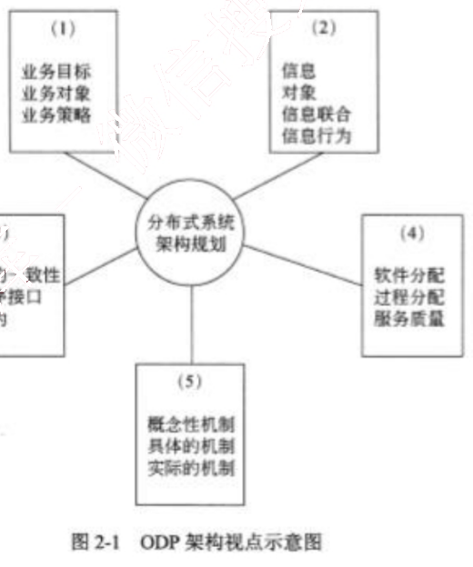
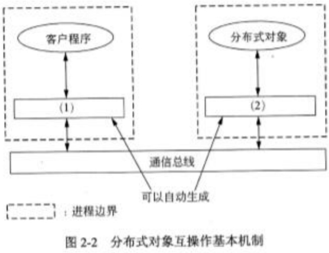
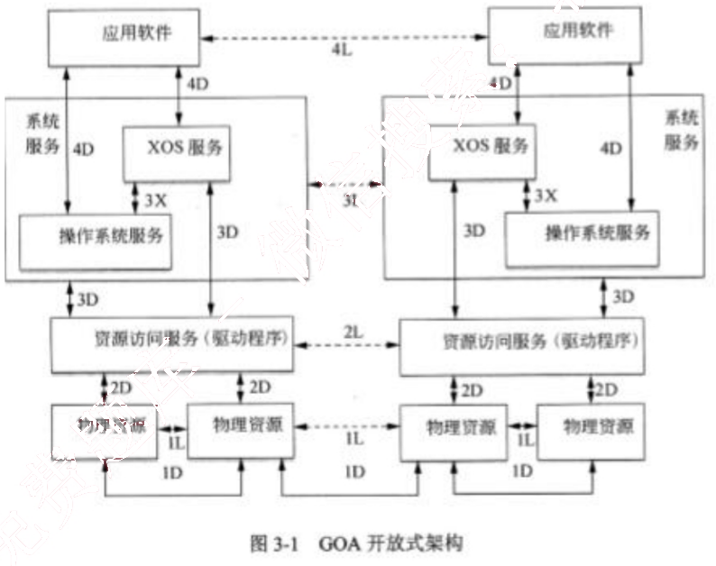

# 2012 年下半年 系统架构设计师 · 案例分析真题

> 试题一必答 + 试题二至五选答 2 道；含参考答案
>
> **来源**：本地购买扫描件《2012 年下半年系统架构设计师 答案详解》（贡献者已购买并授权转录）
> **来源类型**：`real`
> **解析方式**：byted-las-document-parse（normal 模式）+ 机械清洗，已剔除页眉、广告条与页码
> **答案与解析**：取自随卷答案详解，非本仓库编写
> **使用建议**：可用于章节训练与年份模考；关键数字建议对照原始 PDF 复核
> **完整性**：综合知识 75 题、案例分析 5 题、论文 4 题齐备

## 试题一
> **题型**：案例 03 · 架构风格对比与选型

【说明】

某软件公司为其新推出的字处理软件设计了一种脚本语言，专门用于开发该字处理软件的附加功能插件。为了提高该语言的编程效率，公司组织软件工具开发部门为脚本语言研制一套集成开发环境。软件工具开发部门根据字处理软件的特点，对集成开发环境进行了需求分析，总结出以下3项核心需求：

(1) 集成开发环境需要提供对脚本语言的编辑、语法检查、解释、执行和调试等功能的支持，并要实现各种功能的灵活组合、配置与替换。

(2) 集成开发环境需要提供一组可视化的编程界面，用户通过对界面元素拖曳和代码填充的方式就可以完成功能插件核心业务流程的编写与组织。

(3) 在代码调试功能方面，集成开发环境需要实现在脚本语言编辑界面中的代码自动定位功能。具体来说，在调试过程中，编辑界面需要响应调试断点命中事件，并自动跳转到当前断点处所对应的代码。

针对上述需求，软件工具开发部门对集成开发环境的架构进行分析与设计，王工认为该集成开发环境应该采用管道-过滤器的架构风格实现，李工则认为该集成开发环境应该采用以数据存储为中心的架构风格来实现。公司组织专家对王工和李工的方案进行了评审，最终采用了李工的方案。

### 【问题1】

请用200字以内的文字解释什么是软件架构风格，并从集成开发环境与用户的交互方式、集成开发环境的扩展性、集成开发环境的数据管理三个方面说明为什么最终采用了李工的设计方案。

软件架构风格是指描述特定软件系统组织方式的惯用模式。组织方式描述了系统的组成构件和这些构件的组织方式，惯用模式则反映众多系统共有的结构和语义。

从集成开发环境与用户的交互方式看，用户通常采用交互式的方式对脚本语言进行编辑、解释执行与调试。在这种情况下，采用以数据存储为中心的架构风格能够很好地支持交互式数据处理，而管道-过滤器架构风格则对用户的交互式数据处理支持有限。

从集成开发环境的扩展性来看，系统核心需求要求实现各种编辑、语法检查、解释执行等多种功能的灵活组织、配置与替换。在这种情况下，采用以数据存储为中心的架构风格，

以数据格式解耦各种功能之间的依赖关系，并可以灵活定义功能之间的逻辑顺序。管道-过滤器器架构风格同样以数据格式解耦数据处理过程之间的依赖关系，但其在数据处理逻辑关系的灵活定义方面较差。

从集成开发环境的数据管理来看，集成开发环境需要支持脚本语言、语法树（用于检查语法错误）、可视化模型、调试信息等多种数据类型，并需要支持数据格式的转换。以数据存储为中心的架构将数据存储在统一的中心存储器中，中心存储器能够表示多种数据格式，并能够为数据格式转换提供各种支持。管道-过滤器架构风格通常只能支持有限的数据格式，并且在数据格式转换方面的灵活性较差。

### 【问题2】

在对软件系统架构进行设计时，要对架构需求进行分析，针对特定需求选择最为合适的架构风格，因此实际的软件系统通常会混合多种软件架构风格。请对核心需求进行分析，说明为了满足需求（2）和（3），分别应采用何种架构风格，并概要说明采用相应架构风格后的架构设计过程。

为了满足需求（2），应该采用解释器架构风格。具体来说，需要：①为可视化编程元素及其拖拽关系定义某种语言，并描述其语法与语义；②编写解释器对该语言进行解释；③生成对应的脚本语言程序。

为了满足需求（3），应该采用隐式调用架构风格。具体来说，首先需要定义“断点在调试过程中命中”这一事件，并实现当断点命中后的屏幕定位函数。集成开发环境维护一个事件注册表结构，将该事件与屏幕定位函数关联起来形成注册表中的一个记录项。在调试过程中，集成开发环境负责监听各种事件，当“断点在调试过程中命中”这一事件发生时，集成开发环境查找事件注册表，找到并调用屏幕定位函数，从而实现脚本语言编辑界面与调试代码的自动定位。

## 试题二
> **题型**：案例 05 · 微服务拆分与重构

【说明】
某软件公司拟开发一套电信领域的分布式系统，该系统后台多个功能模块同时运行时的计算负载较大，且需要控制不同的特定电信硬件设备，由于硬件体积和 I/O 端口冲突等原因，这些设备需要分散安装在多个不同计算机系统中。该系统上线运行后将为企业最终用户提供7×24 小时的不间断服务，而用户的单次接入服务往往需要后台多个模块共同协作完成。基于上述原因，该系统后台软件模块需分布在局域网内的多台计算机上。
项目组决定基于 ISO 的开放分布进程（ODP）规范来进行系统架构的设计与开发，近期项目组召开了多次会议，对架构设计阶段的关键问题进行了讨论分析。

### 【问题1】

ODP 从5个标准的视点组织分析系统的架构，这些视点描述了同一系统的不同重要方面，请根据图 2-1 中不同视点所关注的核心内容，将备选的架构视点填入图中的（1）~（5）。

图 2-1 ODP 架构视点示意图
备选答案：技术选择架构、企业业务架构、分布式工程架构、计算接口架构、逻辑信息架构
（1）企业业务架构
（2）逻辑信息架构
（3）计算接口架构

(4) 分布式工程架构

(5) 技术选择架构

### 【问题2】

在技术选择架构规划时，王工认为系统应基于现有分布式基础设施（分布式中间件）来构建，因为这样可以充分利用现有基础设施提供的各种支撑，在更短时间内构造出质量更高的分布式系统；而李工则认为可基于基本的进程间通信机制自主开发系统的支撑平台，这样可以避免对特定中间件的依赖，项目组经过认真讨论，最终采用了王工的方案。请用400字以内文字，从构件管理支持、互操作支持以及公共服务支持三个方面说明现有分布式基础设施为构建分布式系统所提供的基本支撑。

(1) 构件管理支持：现有分布式基础设施一般通过构件容器为构件提供基本的运行环境；具体功能一般包括管理构件的实例及其生命周期、管理构件的元信息等。

(2) 互操作支持：现有分布式基础设施均提供了高层通信协议以屏蔽节点的物理特性以及各节点在处理器、操作系统、程序设计语言等方面的异构性；基于互操作支持，开发人员在开发与调用分布式对象时，均不需自己编写处理底层通信的代码。

(3) 公共服务支持：现有分布式基础设施通常将针对分布式软件的通用支持集成于一身，以公共服务的形式提供给应用程序；其提供的常见公共服务包括命名服务、事务服务、安全服务、持久性服务等。

### 【问题3】

由于系统后台模块的分布式特性，后台分布式对象之间的互操作机制是需要考虑的核心问题之一。图2-2所示是当前分布式基础设施中支持分布式对象互操作的基本机制， 请将相应部件名称填入图中（1）~（2）；基于图2-2给出的结构，用300字以内文字说明完成一次分布式对象调用的详细步骤。

图2-2 分布式对象互操作基本机制

（1）存根/桩
（2）框架或
（1）代理
（2）存根

一次远程调用的过程如下：
①客户程序将调用请求发送给客户端桩，对于客户程序来说，桩就是服务程序在客户端的代理。
②客户端桩负责将远程调用请求进行编组并发送给通信总线。
③调用请求经通信总线传送到服务端框架。
④服务端框架将调用请求解组并分派给真正的远程对象实现（服务程序）。
⑤服务程序完成客户端的调用请求，将结果返回给服务端框架。
⑥服务端框架将调用结果编组并发送给通信总线。
⑦调用结果经通信总线传送到客户端桩。
⑧客户端桩将调用结果解组并返回给客户程序，客户程序得到调用结果。

## 试题三
> **题型**：案例 08 · 嵌入式 / 构件组装

【说明】

在嵌入式系统中，软件采用开放式架构已成为新的发展趋势。软件架构设计的优劣将直接影响软件的重用和移植能力。

某软件公司主要从事宇航领域的嵌入式软件研发工作。经二十多年的发展，其软件产品已被广泛应用于各种航天飞行器中。该公司积累了众多成熟软件，但由于当初没有充分考虑软件的架构，原有软件无法被再利用，为适应嵌入式软件技术发展需要，该公司决策层决定成立宇航嵌入式软件开放式架构研究小组，为公司完成开放式架构的定义与设计，确保公司软件资源能得到充分利用。

研究小组查阅了大量的国外资料和标准，最终将研究重点集中在了 SAEAS4893《通用开放式架构（GOA）框架》标准，图 3-1 给出了 GOA 定义的架构图。

图 3-1 GOA 开放式架构

### 【问题1】

请用 300 字以内的文字简要说明开放式架构的四个基本特点。

开放架构应具有以下 4 个基本特点：

①可移植性。各种计算机应用系统可在具有开放架构特性的各种计算机系统间进行移植，不论这些计算机是否同种型号、同种机型。

②可互操作性。如计算机网络中的各结点机都具有开放架构的特性，则该网上各结点机间可相互操作和资源共享。

③可剪裁性。如某个计算机系统是具有开放架构特性的，则在该系统的低档机上运行的应用系统应能在高档机上运行，原在高档机上运行的应用系统经剪裁后也可在低档机上运行。

④易获得性。在具有开放架构特性的机器上所运行的软件环境易于从多方获得，不受某个来源所控制。

### 【问题2】

如图 3-1 所示，GOA 框架规定了软件、硬件和接口的结构，以在不同应用领域中实现系统功能。GOA 框架规定了一组接口，其重要特点是建立了关键组件及组件间接口关系，这些接口的确定可用于支持软件的可移植性和可升级性，以满足功能的增加和技术的更新要求。除操作系统服务与扩展操作系统之间的接口（3X）外，GOA 将其他接口分为两类：即直接接口（iD（i=1, 2, 3, …））和逻辑接口（iL（i=1, 2, 3, …）），直接接口定义了信息传输方式；逻辑接口定义了对等数据交换的要求，逻辑接口没有定义真正的信息传输方式，其传输发生在一个或多个直接接口。根据图 3-1 所标注的接口在框架中的具体位置，请填写表3-1 的（1）～（8）处空白。

<table>
<caption>表 3-1 GOA 中的接口与功能</caption>
<tbody><tr>
<th>序号</th>
<th>接口功能描述</th>
<th>接口名称</th>
</tr>
<tr>
<td>范例</td>
<td>实现处理机之间有效的通信方式，操作系统服务和操作系统扩展服务之间的接口</td>
<td>3X</td>
</tr>
<tr>
<td>1</td>
<td>(1)</td>
<td>4D</td>
</tr>
<tr>
<td>2</td>
<td>一组对等的物理资源之间数据交换接口/协议的要求组成的接口，它能实现通信链路物理资源访问（物理资源逻辑接口）</td>
<td>(2)</td>
</tr>
<tr>
<td>3</td>
<td>一组软件（操作系统）访问硬件资源的服务接口。该组接口为软件与硬件资源之间定义了一个边界（系统服务到资源访问直接接口）</td>
<td>(3)</td>
</tr>
<tr>
<td>4</td>
<td>提供在任何处理机中应用软件与其他应用软件之间的接口。也包括不同系统间的应用软件之间的接口（应用逻辑接口）</td>
<td>(4)</td>
</tr>
<tr>
<td>5</td>
<td>(5)</td>
<td>1D</td>
</tr>
<tr>
<td>6</td>
<td>(6)</td>
<td>3L</td>
</tr>
<tr>
<td>7</td>
<td>根据对等信息/数据交换要求。在同一处理机或不同处理机间，资源访问服务之间的对等操作服务的接口（资源访问服务逻辑接口）</td>
<td>(7)</td>
</tr>
<tr>
<td>8</td>
<td>由服务于硬件指令机制和寄存器使用的资源访问服务组成的接口（资源服务到物理资源直接接口）</td>
<td>(8)</td>
</tr>
</tbody></table>

<table>
<caption>表 3-1 GOA 中的接口与功能</caption>
<thead>
  <tr>
    <th>序号</th>
    <th>接口功能描述</th>
    <th>接口名称</th>
  </tr>
</thead>
<tbody>
  <tr>
    <td>范例</td>
    <td>实现处理机之间有效的通信方式，支持提供操作系统服务和操作系统扩展服务之间的接口</td>
    <td>3X</td>
  </tr>
  <tr>
    <td>1</td>
    <td>（1）为任何处理机中的服务功能提供各应用软件互操作服务的接口（应用到系统服务的直接接口）</td>
    <td>4D</td>
  </tr>
  <tr>
    <td>2</td>
    <td>一组对等的物理资源之间数据交换接口/协议的要求组成的接口，它能实现通信链路物理资源访问（物理资源逻辑接口）</td>
    <td>（2）1L</td>
  </tr>
  <tr>
    <td>3</td>
    <td>一组软件（操作系统）访问硬件资源的服务接口。该组接口为软件与硬件资源之间定义了一个边界（系统服务到资源访问直接接口）</td>
    <td>（3）3D</td>
  </tr>
  <tr>
    <td>4</td>
    <td>提供在任何处理机中应用软件与其他应用软件之间的接口。也包括不同系统间的应用软件之间的接口（应用逻辑接口）</td>
    <td>（4）4L</td>
  </tr>
  <tr>
    <td>5</td>
    <td>（5）物理资源与物理资源之间以及物理资源与外部环境之间的接口（物理资源到物理资源直接接口）</td>
    <td>1D</td>
  </tr>
  <tr>
    <td>6</td>
    <td>（6）在同一个或不同的处理机之间，为处理机中的系统服务提供逻辑服务和远程服务的接口（系统服务逻辑接口）</td>
    <td>3L</td>
  </tr>
  <tr>
    <td>7</td>
    <td>根据对等信息/数据交换要求。在同一处理机或不同处理机间，资源访问服务之间的对等操作服务的接口（资源访问服务逻辑接口）</td>
    <td>（7）2L</td>
  </tr>
  <tr>
    <td>8</td>
    <td>由服务于硬件指令机制和寄存器使用的资源访问服务组成的接口（资源服务到物理资源直接接口）</td>
    <td>（8）2D</td>
  </tr>
</tbody>
</table>

## 试题四
> **题型**：案例 04 · UML 建模与分析

【说明】

某软件企业为影音产品销售公司W开发一套在线销售系统，以提升服务的质量和效率。项目组经过讨论后决定采用面向对象方法开发该系统。在设计建模阶段需要满足以下设计要求：

(1) W公司经常进行促销活动。根据不同的条件（如订单总额、商品数量、产品种类等），公司可以提供百分比折扣或现金减免等多种促销方式供提交订单的用户选择。实现每种促销活动的代码量很大，且会随促销策略不同经常修改。系统设计中需要考虑现有的促销和新的促销，而不用经常地重写控制器类代码。

(2) 该在线销售系统需要计算每个订单的税率，不同商品的税率及计算方式会有所区别。所以W公司决定在系统中直接调用不同商品供应商提供的税率计算类，但每个供应商的类提供了不同的调用方法。系统设计中需要考虑如果公司更换了供应商，应该尽可能少地在系统中修改或创建新类。

项目组架构师决定采用设计模式来满足上述设计要求，并确定从当前已经熟练掌握的设计模式中进行选择，这些设计模式包括：适配器模式（Adapter）、构造器模式（Builder）、命令模式（Command）、外观模式（Facade）、中介模式（Mediator）、原型模式（Prototype）、代理模式（Proxy）、状态模式（State）和策略模式（Strategy）等。

### 【问题1】

设计模式按照其应用模式可以分为三类：创建型、结构型和行为型，请用200字以内文字说明三者的作用。

创建型模式主要用于创建对象，为设计类实例化新对象提供指南。

结构型模式主要用于处理类或对象的组合，对类如何设计以形成更大的结构提供指南。

行为型模式主要用于描述类或对象的交互以及职责的分配，对类之间交互以及分配责任的方式提供指南。

### 【问题2】

请将项目组已经掌握的设计模式按照其作用分别归类到创建型、结构型和行为型模式中。

创建型模式：构造器模式、原型模式。

结构型模式：适配器模式、外观模式、代理模式。

行为型模式：命令模式、中介模式、状态模式和策略模式。

### 【问题3】

针对题目中所提出的设计要求（1）和（2），项目组应该分别选择何种设计模式？请分别用 200 字以内文字说明具体的解决方案。

(1) 策略模式

解决方案：在具有公共接口的独立类中定义每个计算。可以利用该模式创建各种促销类，它们从同一个超类继承。每个类都有相同名称的标准接口方法，用于根据订单编号计算将要折扣的金额总数。计算每个促销的内部代码对促销类来说完全不同（3 分）。

(2) 适配器模式

解决方案：增加一个类作为适配器，转换类的接口到客户端类期望的另一个接口。实现一个适配器类，这个类为系统的其他部分提供了一个不变的方法供调用，为了集成不同商品供应商提供的税率计算类，编写一个适配器类的子类，包含调用购买类所需的代码。该子类将系统的调用映射到某个供应商的税率计算类。如果要更换供应商，那么只需要写一个新的适配器子类，其他保持不变。

*（原图含机构广告或水印，已移除）*

## 试题五
> **题型**：案例 09 · 大数据 / Web 架构设计

【说明】

某软件公司欲开发一个基于 Web 2.0 的大型社交网络系统。就该系统的数据架构而言，李工决定采用公司熟悉的数据架构，使用通用的商用关系型数据库，系统内部数据采用中央集中方式存储。

该系统投入使用后，初期用户数量少，系统运行平稳。6个月后，用户数出现了爆炸式增长，系统暴露出诸多问题，集中表现在：
(1) 用户执行读写操作时，响应时间均变得很慢；
(2) 随着系统功能的扩充，原有数据格式发生变化，又出现新的数据格式，维护困难；
(3) 数据容量很快超过系统原有的设计上限，数据库扩容困难；
(4) 软件系统不断出现宕机，整个系统可用性较差。

经过多次会议讨论，公司的王工建议采用 NoSQL 数据库来替代关系数据库，以解决上述问题。但李工指出 NoSQL 数据库出现时间不长，在使用上可能存在风险。公司技术人员对 NoSQL 数据库产品进行了认真测试，最终决定采用 NoSQL 数据库来替代现有的数据库系统。

### 【问题1】

分别解释产生问题（1）～（4）的原因。

其原因主要是：
(1) 用户响应时间慢。大型社交网络系统要根据用户个性化信息来实时生成动态页面和提供动态信息，所以基本上无法使用动态页面静态化技术，因此数据库并发负载非常高，往往要达到每秒上万次读写请求。关系数据库应付上万次 SQL 查询还勉强可以，但是应付上万次 SQL 写数据请求，硬盘 I/O 就已经无法承受了。特别是涉及到多表连接操作，会导致响应变慢。
(2) 数据格式变化。大型社交网络系统随着用户的使用，会不断地增加新的功能，导致原有数据格式发生变化，甚至出现新的数据格式。但关系数据库中采用元组方式组织数据，难以使用新型数据格式，难以维护。
(3) 数据容量超过设计上限。对于大型社交网络系统，往往会在很短时间内产生海量数据。关系数据库多采用中央数据存储，使得数据容量受限于前期设计的上限，很难实现数据容量的横向扩展。

（4）系统可用性差：关系数据库采用中央数据存储，容易成为系统的性能瓶颈，单点故障很容易导致系统崩溃，负载过高往往导致系统出现宕机现象。

### 【问题2】

请针对问题（1）～（4），分别指出 NoSQL 数据库的哪些特点促使公司最终采用了 NoSQL 数据库。

针对问题（1），NoSQL 数据库支持高并发数据访问，性能较高。

针对问题（2），NoSQL 数据库的数据存储结构松散，能够灵活支持多种类型的数据格式。

针对问题（3），NoSQL 数据库能够支持海量数据的存储，且易于横向扩展。

针对问题（4），NoSQL 数据库基于分布式数据存储，不存在单点故障和性能瓶颈，系统可用性高。

### 【问题3】

请指出该系统采用 NoSQL 数据库时可能存在的问题。

该系统采用 NoSQL 数据库时可能存在的问题有：
(1) NoSQL 数据库的现有产品不够成熟，大多数产品处于初创期。
(2) NoSQL 数据库并未形成一定的标准，产品种类繁多，缺乏官方支持。
(3) NoSQL 数据库不提供对 SQL 的支持，学习和应用迁移成本较高。
(4) NoSQL 数据库支持的特性不够丰富，现有产品提供的功能比较有限。
