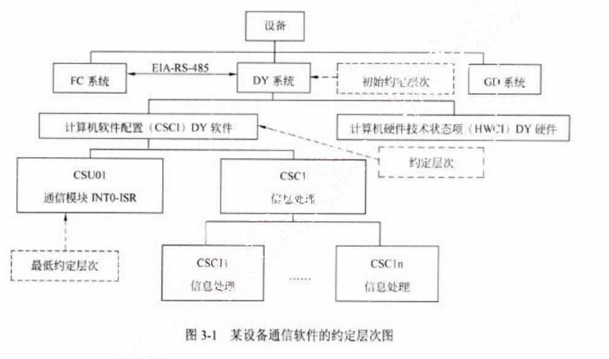
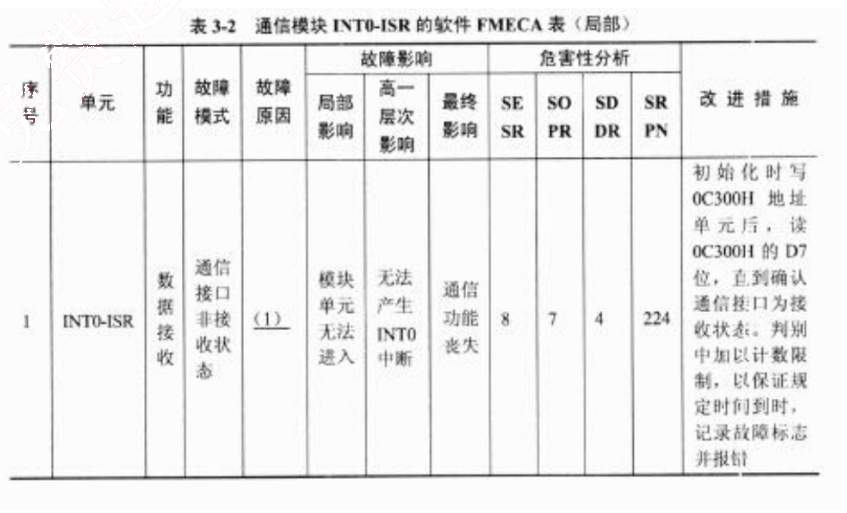

# 2013 年下半年 系统架构设计师 · 案例分析原卷（无答案）

> 题干与插图取自原卷；参考答案见同考期的研读版文件
>
> **来源**：本地购买扫描件《2013 年下半年 系统架构设计师 案例分析》（原卷，题干与参考答案分离）
> **来源类型**：`real`
> **解析方式**：byted-las-document-parse（normal 模式）+ 机械清洗，已剔除页眉、广告条与页码
> **答案与解析**：原卷不含参考答案；作答后请对照同考期的研读版文件评分
> **使用建议**：用于盲练：题干取自原卷，卷面本身无答案
> **完整性**：案例分析 5 题（原卷题干）

## 试题一
> **题型**：案例 10 · SOA 与企业应用集成

某航空公司希望对构建于上世纪七八十年代的主要业务系统进行改造与集成，提高企业的竞争力。由于集成过程非常复杂，公司决定首先以 Ramp Coordination 系统为例进行集成过程的探索与验证。

在航空业中，Ramp Coordination 是指飞机从降落到起飞过程中所需要进行的各种业务活动的协调过程。通常每个航班都有一位员工负责 Ramp Coordination，称之为 Ramp Coordinator。由 Ramp Coordinator 协调的业务活动包括检查机位环境、卸货和装货等。由于航班类型、机型的不同，RampCoordination 的流程有很大差异。图 1-1(a)所示的流程主要针对短期中转航班，这类航班在机场稍作停留后就起飞；图 1-1(b)所示的流程主要针对到达航班，通常在机场过夜后第二天起飞；图 1-1(c)所示的流程主要针对离港航班，这类航班是每天的第一班飞机。这三种类型的航班根据长途/短途、国内/国外等因素还可以进一步细分，每种细分航班类型的 Ramp Coordination 的流程也略有不同。

为了完成上述业务，Ramp Coordination 信息系统需要从乘务人员管理系统中提取航班乘务员的信息、从订票系统中提取乘客信息、从机务人员管理系统中提取机务人员信息、接收来自航班调度系统的航班到达事件。其中乘务人员管理系统和航班调度系统运行在大型主

机系统中，机务人员管理系统运行在 Unix 操作系统之上，订票系统基于 Java 语言，具有 Web 界面，运行在 Linux 操作系统之上。

目前 RampCoordination 信息系统主要由人工完成所有协调工作，效率低且容易出错。公司领导要求集成后的 Ramp Coordination 信息系统能够针对不同需求迅速开展业务流程，灵活、高效地完成协调任务。

针对上述要求，公司 IT 部门的架构师经过分析与讨论，最终采用面向服务的架构，以服务为中心进行 Ramp Coordination 信息系统的集成工作。

### 【问题1】

服务建模是对 Ramp Coordination 信息系统进行集成的首要工作，公司的架构师首先对Ramp Coordination 信息系统进行服务建模，识别出系统中的两个主要业务服务组件：
(1) Ramp Control：负责 RampCoordination 信息系统中相关各种业务活动的组件；
(2) Flight Management：负责航班相关信息的管理，包括航班日程，乘客信息等。

<table>
<caption>表 1-1  业务组件服务提供的服务</caption>
<thead>
<tr>
<th>业务服务组件</th>
<th>提供的服务名称</th>
</tr>
</thead>
<tbody>
<tr>
<td>Ramp Control</td>
<td></td>
</tr>
<tr>
<td>Flight Management</td>
<td></td>
</tr>
</tbody>
</table>

### 【问题2】

对 Ramp Coordination 信息系统的集成涉及对乘务人员管理系统、航班调度系统、机务人员管理系统和订票系统的组织与协调，公司架构师决定采用企业服务总线(Enterprise Service Bus, ESB)技术进行系统集成，请用 200 字以内的文字对 ESB 的定义进行描述，给出ESB 的五个主要功能，并针对题干描述，将恰当的内容填入图 1-2 中的（1）～（6）。

从下列的 4 道试题（试题二至试题五）中任选 2 道解答。
如果解答的试题数超过 2 道，则题号小的 2 道解答有效。

## 试题二
> **题型**：案例 00 · 未归类（待补题型）

某软件公司拟开发一套电子商务系统，王工作为项目组负责人负责编制项目计划。由于该企业业务发展需要，CEO 急于启动电子商务系统，要求王工尽快准备一份拟开发系统的时间和成本估算报告。

项目组经过讨论后，确定出与项目相关的任务如表 2-1 所示。其中，根据项目组开发经验，分别给出了正常工作及加班赶工两种情况下所需的时间和费用。

<table>
<caption>表 2-1 项目开发任务进度及费用</caption>
  <thead>
    <tr>
      <th>任务名称</th>
      <th>正常工作</th>
      <th>加班工作</th>
      <th>前置任务</th>
    </tr>
  </thead>
  <tbody>
    <tr>
      <td>A. 系统调研</td>
      <td>4 天/7200 元</td>
      <td>3 天/8400 元</td>
      <td>-</td>
    </tr>
    <tr>
      <td>B. 提交项目计划</td>
      <td>2 天/1600 元</td>
      <td>1 天/1900 元</td>
      <td>A</td>
    </tr>
    <tr>
      <td>C. 需求分析</td>
      <td>6 天/9600 元</td>
      <td>4 天/14200 元</td>
      <td>B</td>
    </tr>
    <tr>
      <td>D. 系统设计</td>
      <td>12 天/22200 元</td>
      <td>8 天/27600 元</td>
      <td>C</td>
    </tr>
    <tr>
      <td>E. 数据库开发</td>
      <td>3 天/5100 元</td>
      <td>2 天/5700 元</td>
      <td>D</td>
    </tr>
    <tr>
      <td>F. 网页开发</td>
      <td>6 天/8700 元</td>
      <td>5 天/10000 元</td>
      <td>D</td>
    </tr>
  </tbody>
</table>

续表
<table>
  <thead>
    <tr>
      <th>任务名称</th>
      <th>正常工作</th>
      <th>加班工作</th>
      <th>前置任务</th>
    </tr>
  </thead>
  <tbody>
    <tr>
      <td>G. 报表开发</td>
      <td>4 天/6000 元</td>
      <td>任务外包无法赶工</td>
      <td>D</td>
    </tr>
    <tr>
      <td>H. 测试修改</td>
      <td>7 天/9800 元</td>
      <td>4 天/12800 元</td>
      <td>E,F,G</td>
    </tr>
    <tr>
      <td>I. 安装部署</td>
      <td>4 天/4000 元</td>
      <td>2 天/5000 元</td>
      <td>H</td>
    </tr>
  </tbody>
</table>

### 【问题 1】
请用 400 字以内文字说明王工拟编制的项目计划中应包括哪些内容。

### 【问题 2】
请根据表 2-1，分别给出正常工作和最短工期两种情况下完成此项目所需的时间和费用。

### 【问题 3】
如果项目在系统调研阶段用了7天时间才完成，公司要求尽量控制成本，王工可在后续任务中采取什么措施来保证项目能按照正常工作进度完成？

### 【问题 4】

如果企业 CEO 想在 34 天后系统上线，王工应该采取什么措施来满足这一要求？这种情况下完成项目所需的费用是多少？

## 试题三
> **题型**：案例 13 · 可靠性与容灾设计

故障（失效）模型影响分析 FMEA 是分析产品所有可能的故障模式及其可能产生的影响，并按每个故障模式产生影响的严重程度及其发生概率予以分类的一种归约分析方法。近年来，FMEA 方法已被广泛用于安全关键系统的嵌入式软件可靠性分析工作。

某软件公司承担了一项通信软件的开发项目。该项目由 FC 系统、DY 系统和 GD 系统组成，而 DY 系统（TMS320C25S）软件负责按系统的通信协议完成与 FC 系统的通信，图 3-1 给出了该通信软件的约定层次图。公司高层将项目交给王工，王工认为比项目是安全关键系统，安全等级应为 II 类（致命的），因此应开展软件的 FMEA 分析。

### 【问题1】

请阅读以下有关 FMEA 的描述，将恰当的内容填入（1）～（7）。

FMEA 是 FMA（故障模式分析）和 FEA（故障影响分析）的组合，它对系统各种可能的风险进行评价、分析后，在现有技术的基础上消除这些风险或将这些风险降低到可接受的水平。为达到最佳效益，FMEA 必须在产品研制初期进行。

FMEA 实际是一组系列化的活动，其主要活动包括：

(1) ________________________________________；
(2) ________________________________________；
(3) ________________________________________。

由于产品故障可能与设计、制造过程、使用、承包商/供应商以及服务有关，因此 FMEA 又细分为（4）FMEA、(5) FMEA、(6) FMEA 和 (7) FMEA 四类。

### 【问题2】

从图3-1可以看出，CSU01通信模块是该项目的关键模块，主要功能定义为：总线通信控制器自动完成一帧数据的接收，存入数据缓冲区，并产生中断（INT0），通知CPU从数据缓冲区中读取数据；CPU读完数据后，将准备好的发送数据写至数据缓存区，写完后通知总线通信控制器自动完成一帧数据的发送。CRC校验由外部电路完成判别，其结果通过数据线上的相应位进行标识。针对CSU01通信模块，简要描述实施FMEA的具体内容，填写完成表3-1的（1）～（5）。

<table>
<caption>表3-1 CSU01通信模块FMEA步骤的主要内容</caption>
<tr>
<th>序号</th>
<th>主要步骤</th>
<th>具体内容</th>
</tr>
<tr>
<td>1</td>
<td>故障模式确定</td>
<td>(1)</td>
</tr>
<tr>
<td>2</td>
<td>故障原因分析</td>
<td>(2)</td>
</tr>
<tr>
<td>3</td>
<td>故障影响分析</td>
<td>(3)</td>
</tr>
<tr>
<td>4</td>
<td>危害性分析</td>
<td>(4)</td>
</tr>
<tr>
<td>5</td>
<td>改进措施</td>
<td>(5)</td>
</tr>
</table>

### 【问题3】

表3-2给出针对该项目的CSU01通信模块的软件故障（失效）模型影响分析FMECA表（局部），请根据此题描述情况填写表3-2中的（1）～（7）。

注：表3-2中的SRPN（软件风险优先数）=SESR（软件故障模式的严酷度等级）×SOPR（软件故障模式的发生概率等级）×SDDR（软件故障模式的被检测难度等级）。

表3-2 通信模块INT0-ISR的软件FMECA表（局部）

<table class="table">
<caption>续表</caption>
<thead>
  <tr>
    <th rowspan="2">序号</th>
    <th rowspan="2">单元</th>
    <th rowspan="2">功能</th>
    <th rowspan="2">故障模式</th>
    <th rowspan="2">故障原因</th>
    <th colspan="2">故障影响</th>
    <th rowspan="2">最终影响</th>
    <th colspan="4">危害性分析</th>
    <th rowspan="2">改进措施</th>
  </tr>
  <tr>
    <th>局部影响</th>
    <th>高一层次影响</th>
    <th>SE SR</th>
    <th>SO PR</th>
    <th>SD DR</th>
    <th>SR PN</th>
  </tr>
</thead>
<tbody>
  <tr>
    <td>2</td>
    <td rowspan="4">INT0-ISR</td>
    <td rowspan="2">数据接收</td>
    <td>中断允许处于禁止状态</td>
    <td>程序使用DINT和EINT不当</td>
    <td>模块单元无法进入</td>
    <td>(2)</td>
    <td>通信功能丧失</td>
    <td>8</td>
    <td>7</td>
    <td>4</td>
    <td>224</td>
    <td>严格检查DINT和EINT的语句位置</td>
  </tr>
  <tr>
    <td>3</td>
    <td>CRC错误</td>
    <td>(3)</td>
    <td>接收数据异常</td>
    <td>接收数据错误</td>
    <td>(4)</td>
    <td>7</td>
    <td>5</td>
    <td>6</td>
    <td>210</td>
    <td>首先读0C200H地址单元的D0位，判别CRC是否正确，若CRC错误，则放弃此帧</td>
  </tr>
  <tr>
    <td>4</td>
    <td rowspan="2">数据发送</td>
    <td>尚未发送就强行设置接收状态</td>
    <td>(5)</td>
    <td>影响发送数据的正确性</td>
    <td>发送数据错误</td>
    <td>通信错误</td>
    <td>7</td>
    <td>6</td>
    <td>5</td>
    <td>(6)</td>
    <td>写0C200H地址单元后，读0C200H地址单元的D7位，判别是否已发送完，再通过写0C300H地址单元设置通信接口为接收状态。注：此措施与模式10和11相结合</td>
  </tr>
  <tr>
    <td>5</td>
    <td>(7)</td>
    <td>总线通信控制器错误</td>
    <td>发送数据失败，如果程序处理不当可能造成死循环</td>
    <td>发送数据失败，处理不当此单元可能无法退出</td>
    <td>通信功能丧失，处理不当可能死机</td>
    <td>8</td>
    <td>6</td>
    <td>7</td>
    <td>336</td>
    <td>写0C200H地址单元后，读0C200H地址单元的D7位，判别是否已发送完，并加以计数限制，以保证规定时间到时，记录故障标志并退出此模块</td>
  </tr>
</tbody>
</table>

## 试题四
> **题型**：案例 04 · UML 建模与分析

某商业银行欲开发一套个人银行系统，为用户提供常见的金融服务，包括转账、查询、存款变更和个人信息管理等功能。该软件除了业务需求外，还有一些特殊的表现层需求：
(1) 根据用户级别的不同，界面和可用功能是不同的；
(2) 支持 Web、Windows、手机 App 等多种不同类型的界面；
(3) 考虑到将来功能的扩展，需要系统支持界面的定制以及动态生成等功能，以降低系统维护和新功能发布的成本。

经过对需求的讨论，该银行初步决定采用 MVC 模式设计该个人银行系统的表现层，采用 XML 作为 GUI 的描述语言，并应用 XML 的界面管理技术来实现灵活的界面配置、界面动态生成和界面定制。

## 【问题 1】

MVC 模式强制性地将一个应用处理流程按照模型、视图、控制的方式进行分离，三者的协作关系如图 4-1 所示。

请填写图 4-1 中的(1)～(3)，并简要说明在该个人银行系统中采用 MVC 模式对界面设计的作用。

### 【问题2】

请从设计模式的角度，简要说明设计方案采用 XML 作为 GUI 描述语言的机制。

### 【问题3】

基于 XML 的界面管理技术可实现灵活的界面配置、界面动态生成和界面定制，其思路是用 XML 生成配置文件及界面所需的元数据，按不同需求生成界面元素及软件界面，其技术框图如图 4-2 所示。

请将恰当的内容填入图 4-2 中的（1）～（3），并简要解释说明其含义。

## 试题五
> **题型**：案例 07 · 安全架构分析

某软件公司拟开发一套信息安全支撑平台，为客户的局域网业务环境提供信息安全保护。该支撑平台的主要需求如下：
(1) 为局域网业务环境提供用户身份鉴别与资源访问授权功能；
(2) 为局域网环境中交换的网络数据提供加密保护；
(3) 为服务器和终端机存储的敏感持久数据提供加密保护；
(4) 保护的主要实体对象包括局域网内交换的网络数据包、文件服务器中的敏感数据文件、数据库服务器中的敏感关系数据和终端机用户存储的敏感数据文件；
(5) 服务器中存储的敏感数据按安全管理员配置的权限访问；
(6) 业务系统生成的单个敏感数据文件可能会达到数百兆的规模；
(7) 终端机用户存储的敏感数据为用户私有；
(8) 局域网业务环境的总用户数在100人以内。

### 【问题1】

在确定该支撑平台所采用的用户身份鉴别机制时，王工提出采用基于口令的简单认证机制，而李工则提出采用基于公钥体系的认证机制。项目组经过讨论，确定采用基于公钥体系的机制，请结合上述需求具体分析采用李工方案的原因。

### 【问题2】

针对需求(7)，项目组经过讨论，确定了基于数字信封的加密方式，其加密后的文件结构如图5-1所示。请结合需求说明对文件数据进行加密时，应采用对称加密的块加密方式还是流加密方式，为什么？并对该机制中的数据加密与解密过程进行描述。

图5-1 加密数据文件结构

### 【问题3】

对数据库服务器中的敏感关系数据进行加密保护时，客户业务系统中的敏感关系数据主要是特定数据库表中的敏感字段值，客户要求对不同程度的敏感字段采用不同强度的密钥进行防护，且加密方式应尽可能减少安全管理与应用程序的负担。目前数据库管理系统提供的基本数据加密方式主要包括加解密API和透明加密两种，请用300字以内的文字对这两种方式进行解释，并结合需求说明应采用哪种加密方式。
