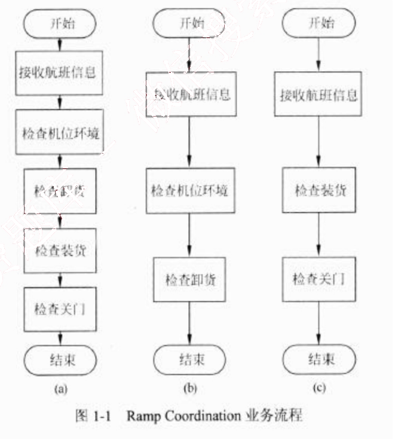
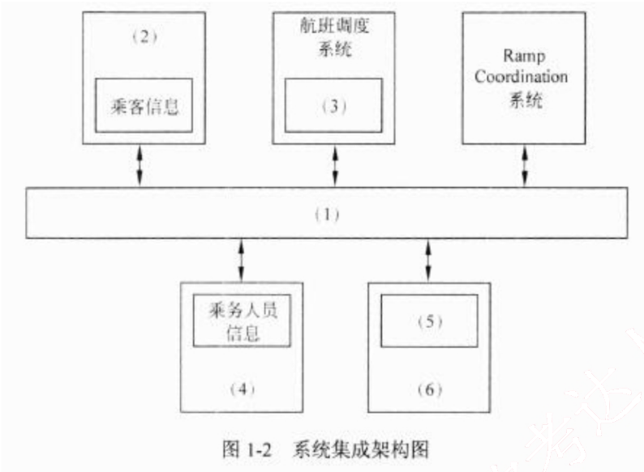
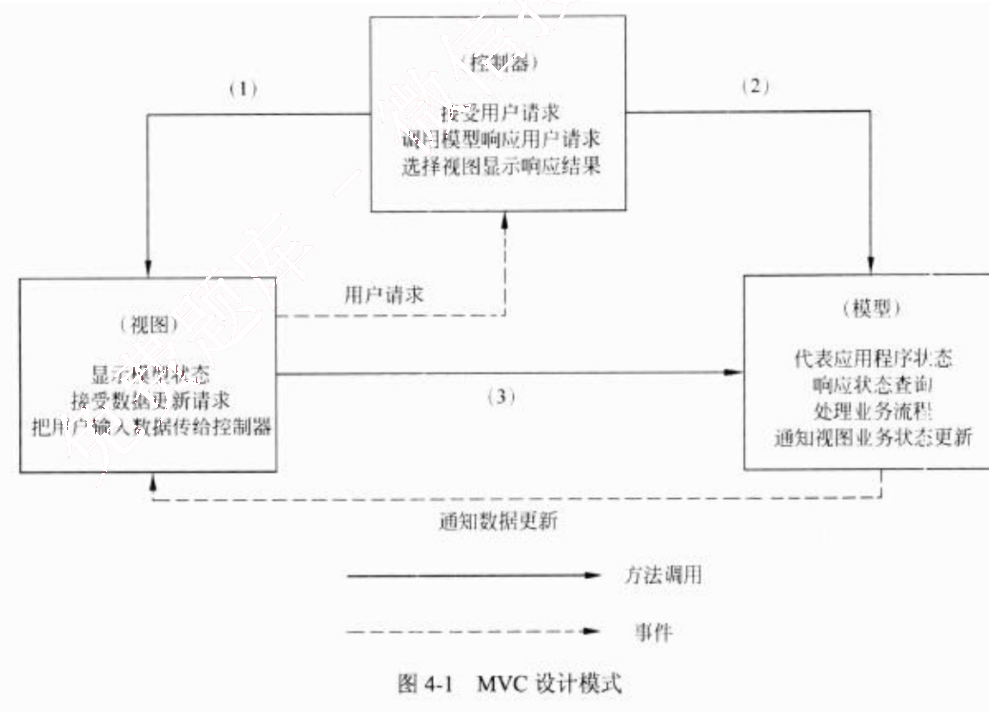
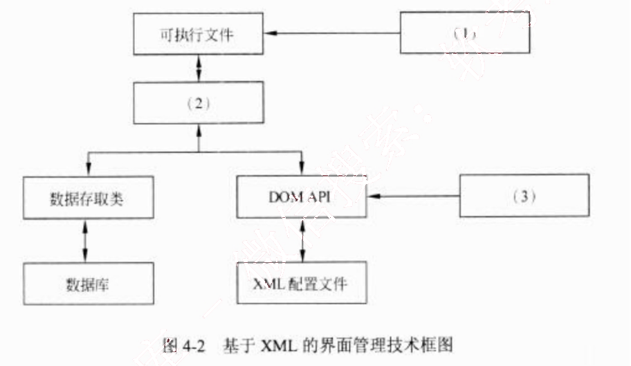
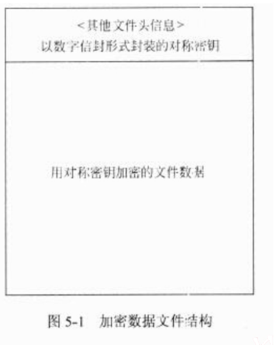

# 2013 年下半年 系统架构设计师 · 案例分析原卷（无答案）

>
> **来源**：本地购买扫描件《2013 年下半年 系统架构设计师 案例分析》（原卷，题干与参考答案分离）
> **来源类型**：`real`
> **解析方式**：byted-las-document-parse（normal 模式）+ 机械清洗，已剔除页眉、广告条与页码
> **答案与解析**：原卷不含参考答案；作答后请对照同考期的研读版文件评分
> **使用范围**：经典选题，仅保留原题号 一、四、五；不作为完整年份模考。筛选依据见 [历史题复核](../HISTORICAL_CURATION.md)。

## 试题一
> **题型**：案例 10 · SOA 与企业应用集成

某航空公司希望对构建于上世纪七八十年代的主要业务系统进行改造与集成，提高企业的竞争力。由于集成过程非常复杂，公司决定首先以 Ramp Coordination 系统为例进行集成过程的探索与验证。

在航空业中，Ramp Coordination 是指飞机从降落到起飞过程中所需要进行的各种业务活动的协调过程。通常每个航班都有一位员工负责 Ramp Coordination，称之为 Ramp Coordinator。由 Ramp Coordinator 协调的业务活动包括检查机位环境、卸货和装货等。由于航班类型、机型的不同，RampCoordination 的流程有很大差异。图 1-1(a)所示的流程主要针对短期中转航班，这类航班在机场稍作停留后就起飞；图 1-1(b)所示的流程主要针对到达航班，通常在机场过夜后第二天起飞；图 1-1(c)所示的流程主要针对离港航班，这类航班是每天的第一班飞机。这三种类型的航班根据长途/短途、国内/国外等因素还可以进一步细分，每种细分航班类型的 Ramp Coordination 的流程也略有不同。

为了完成上述业务，Ramp Coordination 信息系统需要从乘务人员管理系统中提取航班乘务员的信息、从订票系统中提取乘客信息、从机务人员管理系统中提取机务人员信息、接收来自航班调度系统的航班到达事件。其中乘务人员管理系统和航班调度系统运行在大型主

机系统中，机务人员管理系统运行在 Unix 操作系统之上，订票系统基于 Java 语言，具有 Web 界面，运行在 Linux 操作系统之上。

目前 RampCoordination 信息系统主要由人工完成所有协调工作，效率低且容易出错。公司领导要求集成后的 Ramp Coordination 信息系统能够针对不同需求迅速开展业务流程，灵活、高效地完成协调任务。

针对上述要求，公司 IT 部门的架构师经过分析与讨论，最终采用面向服务的架构，以服务为中心进行 Ramp Coordination 信息系统的集成工作。

### 【问题1】

服务建模是对 Ramp Coordination 信息系统进行集成的首要工作，公司的架构师首先对Ramp Coordination 信息系统进行服务建模，识别出系统中的两个主要业务服务组件：
(1) Ramp Control：负责 RampCoordination 信息系统中相关各种业务活动的组件；
(2) Flight Management：负责航班相关信息的管理，包括航班日程，乘客信息等。

<table>
<caption>表 1-1  业务组件服务提供的服务</caption>
<thead>
<tr>
<th>业务服务组件</th>
<th>提供的服务名称</th>
</tr>
</thead>
<tbody>
<tr>
<td>Ramp Control</td>
<td></td>
</tr>
<tr>
<td>Flight Management</td>
<td></td>
</tr>
</tbody>
</table>

### 【问题2】

对 Ramp Coordination 信息系统的集成涉及对乘务人员管理系统、航班调度系统、机务人员管理系统和订票系统的组织与协调，公司架构师决定采用企业服务总线(Enterprise Service Bus, ESB)技术进行系统集成，请用 200 字以内的文字对 ESB 的定义进行描述，给出ESB 的五个主要功能，并针对题干描述，将恰当的内容填入图 1-2 中的（1）～（6）。

## 试题四
> **题型**：案例 03 · 架构风格（MVC / 解释器）

某商业银行欲开发一套个人银行系统，为用户提供常见的金融服务，包括转账、查询、存款变更和个人信息管理等功能。该软件除了业务需求外，还有一些特殊的表现层需求：
(1) 根据用户级别的不同，界面和可用功能是不同的；
(2) 支持 Web、Windows、手机 App 等多种不同类型的界面；
(3) 考虑到将来功能的扩展，需要系统支持界面的定制以及动态生成等功能，以降低系统维护和新功能发布的成本。

经过对需求的讨论，该银行初步决定采用 MVC 模式设计该个人银行系统的表现层，采用 XML 作为 GUI 的描述语言，并应用 XML 的界面管理技术来实现灵活的界面配置、界面动态生成和界面定制。

## 【问题 1】

MVC 模式强制性地将一个应用处理流程按照模型、视图、控制的方式进行分离，三者的协作关系如图 4-1 所示。

请填写图 4-1 中的(1)～(3)，并简要说明在该个人银行系统中采用 MVC 模式对界面设计的作用。

### 【问题2】

请从设计模式的角度，简要说明设计方案采用 XML 作为 GUI 描述语言的机制。

### 【问题3】

基于 XML 的界面管理技术可实现灵活的界面配置、界面动态生成和界面定制，其思路是用 XML 生成配置文件及界面所需的元数据，按不同需求生成界面元素及软件界面，其技术框图如图 4-2 所示。

请将恰当的内容填入图 4-2 中的（1）～（3），并简要解释说明其含义。

## 试题五
> **题型**：案例 07 · 安全架构分析

某软件公司拟开发一套信息安全支撑平台，为客户的局域网业务环境提供信息安全保护。该支撑平台的主要需求如下：
(1) 为局域网业务环境提供用户身份鉴别与资源访问授权功能；
(2) 为局域网环境中交换的网络数据提供加密保护；
(3) 为服务器和终端机存储的敏感持久数据提供加密保护；
(4) 保护的主要实体对象包括局域网内交换的网络数据包、文件服务器中的敏感数据文件、数据库服务器中的敏感关系数据和终端机用户存储的敏感数据文件；
(5) 服务器中存储的敏感数据按安全管理员配置的权限访问；
(6) 业务系统生成的单个敏感数据文件可能会达到数百兆的规模；
(7) 终端机用户存储的敏感数据为用户私有；
(8) 局域网业务环境的总用户数在100人以内。

### 【问题1】

在确定该支撑平台所采用的用户身份鉴别机制时，王工提出采用基于口令的简单认证机制，而李工则提出采用基于公钥体系的认证机制。项目组经过讨论，确定采用基于公钥体系的机制，请结合上述需求具体分析采用李工方案的原因。

### 【问题2】

针对需求(7)，项目组经过讨论，确定了基于数字信封的加密方式，其加密后的文件结构如图5-1所示。请结合需求说明对文件数据进行加密时，应采用对称加密的块加密方式还是流加密方式，为什么？并对该机制中的数据加密与解密过程进行描述。

图5-1 加密数据文件结构

### 【问题3】

对数据库服务器中的敏感关系数据进行加密保护时，客户业务系统中的敏感关系数据主要是特定数据库表中的敏感字段值，客户要求对不同程度的敏感字段采用不同强度的密钥进行防护，且加密方式应尽可能减少安全管理与应用程序的负担。目前数据库管理系统提供的基本数据加密方式主要包括加解密API和透明加密两种，请用300字以内的文字对这两种方式进行解释，并结合需求说明应采用哪种加密方式。
