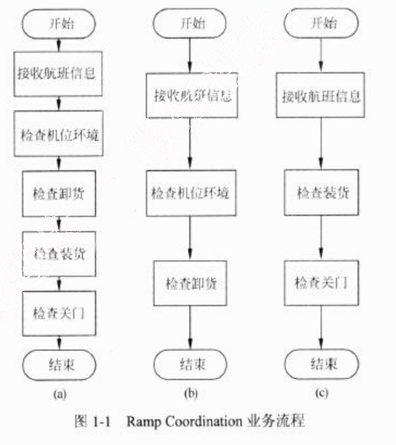
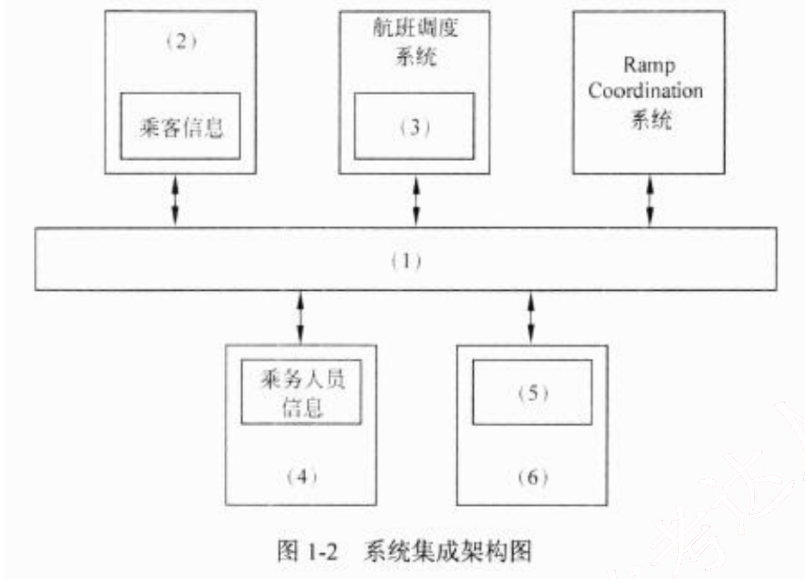
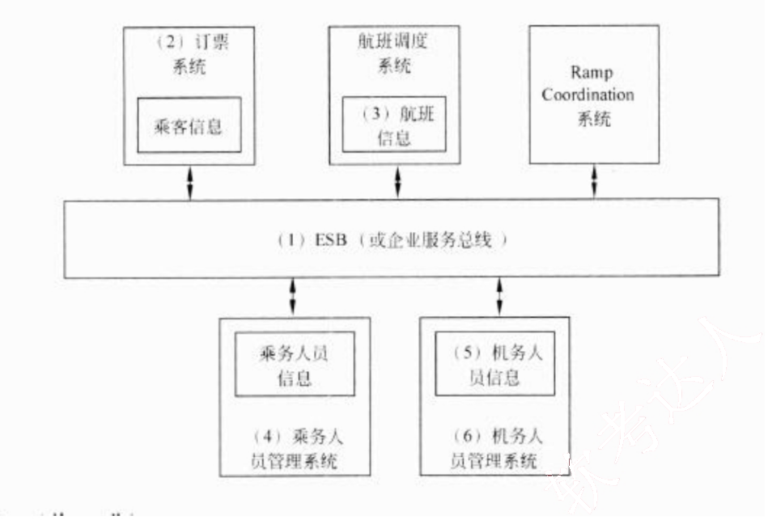
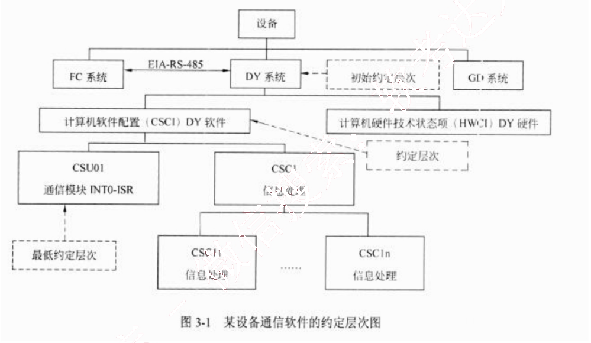
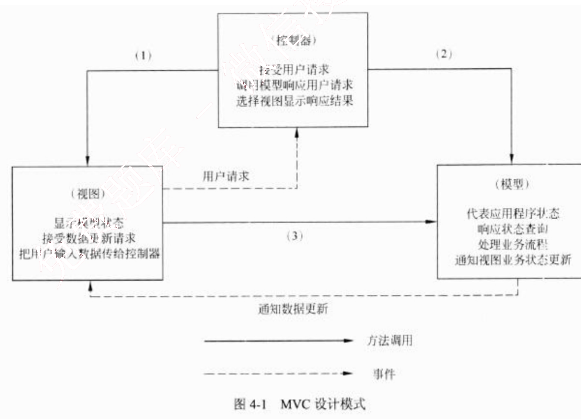
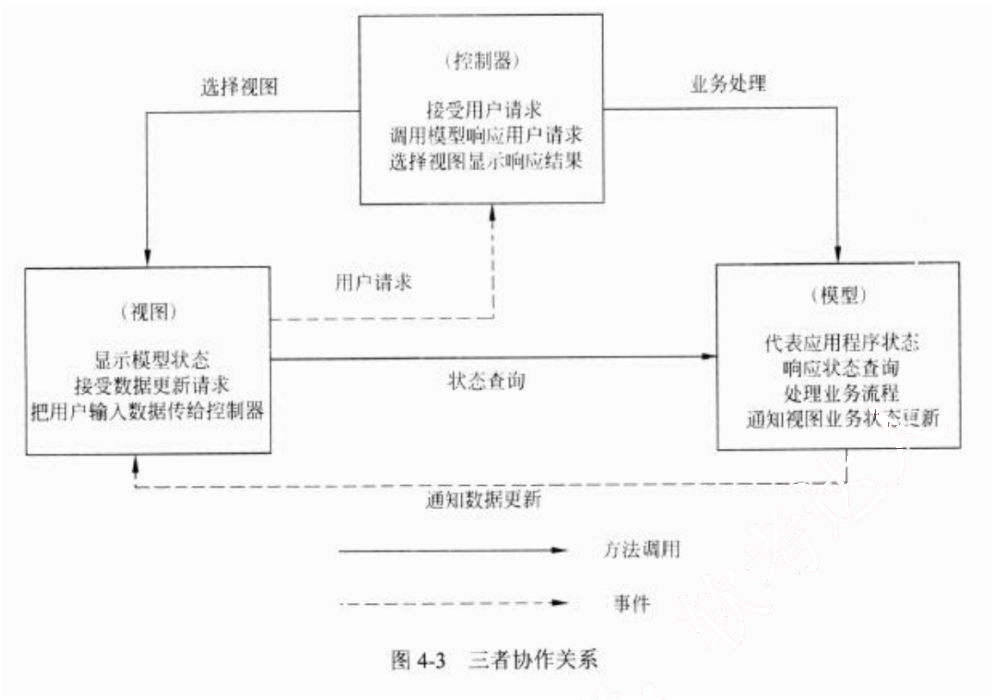
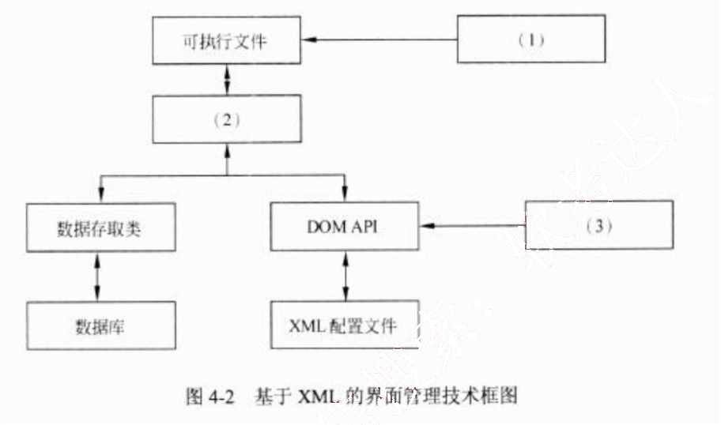
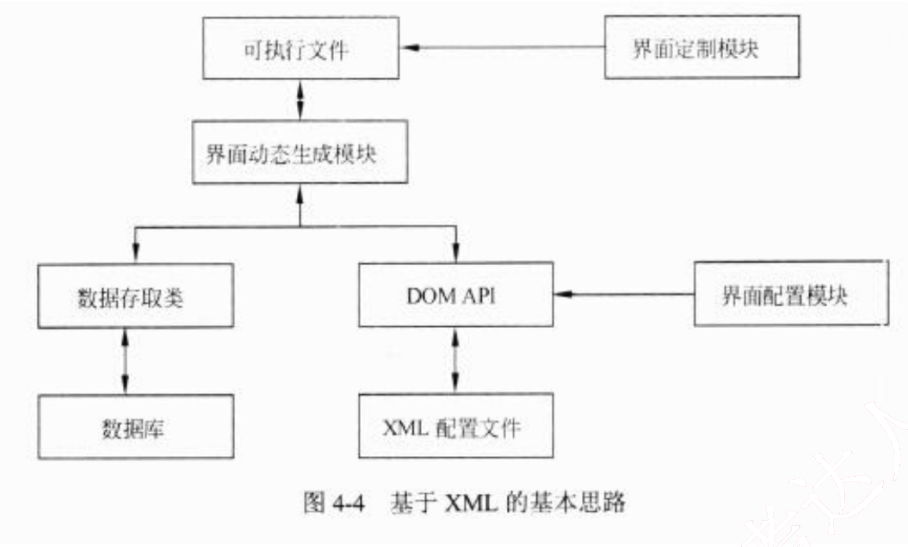
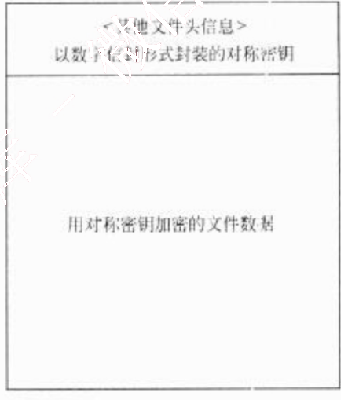

# 2013 年下半年 系统架构设计师 · 案例分析真题

> 试题一必答 + 试题二至五选答 2 道；含参考答案
>
> **来源**：本地购买扫描件《2013 年下半年系统架构设计师 答案详解》（贡献者已购买并授权转录）
> **来源类型**：`real`
> **解析方式**：byted-las-document-parse（normal 模式）+ 机械清洗，已剔除页眉、广告条与页码
> **答案与解析**：取自随卷答案详解，非本仓库编写
> **使用建议**：可用于章节训练与年份模考；关键数字建议对照原始 PDF 复核
> **完整性**：综合知识 75 题、案例分析 5 题、论文 4 题齐备

## 试题一
> **题型**：案例 10 · SOA 与企业应用集成

某航空公司希望对构建于上世纪七八十年代的主要业务系统进行改造与集成，提高企业的竞争力。由于集成过程非常复杂，公司决定首先以 Ramp Coordination 系统为例进行集成过程的探索与验证。

在航空业中，Ramp Coordination 是指飞机从降落到起飞过程中所需要进行的各种业务活动的协调过程。通常每个航班都有一位员工负责 Ramp Coordination，称之为 Ramp Coordinator。由 Ramp Coordinator 协调的业务活动包括检查机位环境、卸货和装货等。由于航班类型、机型的不同，RampCoordination 的流程有很大差异。图 1-1(a)所示的流程主要针对短期中转航班，这类航班在机场稍作停留后就起飞；图 1-1(b)所示的流程主要针对到达航班，通常在机场过夜后第二天起飞；图 1-1(c)所示的流程主要针对离港航班，这类航班是每天的第一班飞机。这三种类型的航班根据长途/短途、国内/国外等因素还可以进一步细分，每种细分航班类型的 Ramp Coordination 的流程也略有不同。

为了完成上述业务，Ramp Coordination 信息系统需要从乘务人员管理系统中提取航班乘务员的信息、从订票系统中提取乘客信息、从机务人员管理系统中提取机务人员信息、接收来自航班调度系统的航班到达事件。其中乘务人员管理系统和航班调度系统运行在大型主机系统中，机务人员管理系统运行在 Unix 操作系统之上，订票系统基于 Java 语言，具有

Web 界面，运行在 Linux 操作系统之上。

目前 RampCoordination 信息系统主要由人工完成所有协调工作，效率低且容易出错。公司领导要求集成后的 Ramp Coordination 信息系统能够针对不同需求迅速开展业务流程，灵活、高效地完成协调任务。

针对上述要求，公司 IT 部门的架构师经过分析与讨论，最终采用面向服务的架构，以服务为中心进行 Ramp Coordination 信息系统的集成工作。

### 【问题1】

服务建模是对 Ramp Coordination 信息系统进行集成的首要工作，公司的架构师首先对 Ramp Coordination 信息系统进行服务建模，识别出系统中的两个主要业务服务组件：
(1) Ramp Control：负责 RampCoordination 信息系统中相关各种业务活动的组件；
(2) Flight Management：负责航班相关信息的管理，包括航班日程，乘客信息等。

<table>
<caption>表 1-1 业务组件服务提供的服务</caption>
<thead>
<tr>
<th>业务服务组件</th>
<th>提供的服务名称</th>
</tr>
</thead>
<tbody>
<tr>
<td>Ramp Control</td>
<td></td>
</tr>
<tr>
<td>Flight Management</td>
<td></td>
</tr>
</tbody>
</table>

<table>
<thead>
<tr>
<th>业务服务组件</th>
<th>提供的服务名称</th>
</tr>
</thead>
<tbody>
<tr>
<td>Ramp Control</td>
<td>检查机位环境、检查卸货、检查装货、检查关门</td>
</tr>
<tr>
<td>Flight Management</td>
<td>接收航班信息</td>
</tr>
</tbody>
</table>

本问题主要考查系统需求分析的基础知识，要求考生能够根据题干描述，找出两个核心业务服务组件 RampControl 和 FlightManagement 对外提供的服务，考生需要仔细阅读题干描述，总结需要提供的服务，并进行归类。

### 【问题2】

对 Ramp Coordination 信息系统的集成涉及对乘务人员管理系统、航班调度系统、机务人员管理系统和订票系统的组织与协调，公司架构师决定采用企业服务总线（Enterprise Service Bus，ESB）技术进行系统集成，请用 200 字以内的文字对 ESB 的定义进行描述，给出 ESB 的五个主要功能，并针对题干描述，将恰当的内容填入图 1-2 中的（1）～（6）。

企业服务总线（Enterprise Service Bus, ESB）是传统中间件技术与XML、Web服务等技术结合的产物，主要支持异构系统集成。ESB 基于内容的路由和过滤，具备复杂数据的传输能力，并可以提供一系列的标准接口。

ESB 的主要功能有：
(1) 服务位置透明性；
(2) 传输协议转换；
(3) 消息格式转换；
(4) 消息路由；
(5) 消息增强；
(6) 安全性；
(7) 监控与管理。

本问题主要考查企业服务总线（EnterpriseServiceBus, ESB）的基本概念和主要功能。企业服务总线是传统中间件技术与XML、Web服务等技术结合的产物，主要支持异构系统集成。ESB 基于内容的路由和过滤，具备复杂数据的传输能力，并可以提供一系列的标准接口。ESB 的主要功能有：服务位置透明性；传输协议转换；消息格式转换；消息路由；消息增强；安全性；监控与管理等。在采用 ESB 进行系统集成时，各个现有系统将会以模块的形式接入 ESB 中，需要明确与 ESB 交换的数据，因此考生需要根据题干描述，明确要接入的系统和该系统需要提供或交换的数据。

## 试题二
> **题型**：案例 00 · 未归类（待补题型）

某软件公司拟开发一套电子商务系统，王工作为项目组负责人负责编制项目计划。由于该企业业务发展需要，CEO 急于启动电子商务系统，要求王工尽快准备一份拟开发系统的时间和成本估算报告。

项目组经过讨论后，确定出与项目相关的任务如表 2-1 所示。其中，根据项目组开发经验，分别给出了正常工作及加班赶工两种情况下所需的时间和费用。

<table>
<caption>表2-1 项目开发任务进度及费用</caption>
  <tr>
    <th>任务名称</th>
    <th>正常工作</th>
    <th>加班工作</th>
    <th>前置任务</th>
  </tr>
  <tr>
    <td>A. 系统调研</td>
    <td>4 天/7200 元</td>
    <td>3 天/8400 元</td>
    <td>-</td>
  </tr>
  <tr>
    <td>B. 提交项目计划</td>
    <td>2 天/1600 元</td>
    <td>1 天/1900 元</td>
    <td>A</td>
  </tr>
  <tr>
    <td>C. 需求分析</td>
    <td>6 天/9600 元</td>
    <td>4 天/14200 元</td>
    <td>B</td>
  </tr>
  <tr>
    <td>D. 系统设计</td>
    <td>12 天/22200 元</td>
    <td>8 天/27600 元</td>
    <td>C</td>
  </tr>
  <tr>
    <td>E. 数据库开发</td>
    <td>3 天/5100 元</td>
    <td>2 天/5700 元</td>
    <td>D</td>
  </tr>
  <tr>
    <td>F. 网页开发</td>
    <td>6 天/8700 元</td>
    <td>5 天/10000 元</td>
    <td>D</td>
  </tr>
  <tr>
    <td>G. 报表开发</td>
    <td>4 天/6000 元</td>
    <td>任务外包无法赶工</td>
    <td>D</td>
  </tr>
  <tr>
    <td>H. 测试修改</td>
    <td>7 天/9800 元</td>
    <td>4 天/12800 元</td>
    <td>E,F,G</td>
  </tr>
  <tr>
    <td>I. 安装部署</td>
    <td>4 天/4000 元</td>
    <td>2 天/5000 元</td>
    <td>H</td>
  </tr>
</table>

### 【问题1】

请用 400 字以内文字说明王工拟编制的项目计划中应包括哪些内容。

王工在接到任务后开始项目计划的编制工作，编制的计划应包括：
(1) 项目总计划（包括范围计划、工作范围定义、活动定义、资源需求、资源计划、活动排序、费用估算、进度计划及费用计划）
(2) 项目辅助计划（质量计划、沟通计划、人力资源计划、风险计划、采购计划）。

本问题考查项目计划的主要内容。项目计划通常包含两个部分：项目总计划包括范围计划、工作范围定义、活动定义、资源需求、资源计划、活动排序、费用估算、进度计划及费用计划；项目辅助计划包括质量计划、沟通计划、人力资源计划、风险计划、采购计划。

### 【问题2】

请根据表 2-1，分别给出正常工作和最短工期两种情况下完成此项目所需的时间和费用。
(1) 正常工作：时间 41 天，成本 74200 元；
(2) 最短工期：时间 27 天，成本 91600 元。

本问题考查项目计划中的进度计划。根据表2-1中所列任务、时间和任务间依赖关系，分别绘制正常和加班两种情况下项目开发的PERT图，分别找出最长的路径即关键路径。正常工作情况下，所需时间为41天，费用74200元；加班工作情况下其最短工期为27天，费用91600元。

### 【问题3】

如果项目在系统调研阶段用了7天时间才完成，公司要求尽量控制成本，王工可在后续任务中采取什么措施来保证项目能按照正常工作进度完成？

在“B 提交项目计划”和“I 安装部署”任务中采用加班工作措施，以使得项目能够按照正常工作进度完成。

本问题考查项目计划中的任务调度。正常工作所需时间为41天，由于系统调研任务多花费了3天时间，所以后续任务必须加班工作才能保证项目按照正常工作进度完成。为了满足题目要求，后续所调整的任务必须满足两个条件：
(1)调整位于关键路径上的关键任务；
(2)调整这些任务所增加的成本最小。

经过计算关键任务每减少一天的费用可知，任务B的300元/天和任务I的500元/天为最小值。所以，可以在“B 提交项目计划”和“I 安装部署”任务中采用加班工作措施，以使得项目能够按照正常工作进度完成。

### 【问题4】

如果企业CEO想在34天后系统上线，王工应该采取什么措施来满足这一要求？这种情况下完成项目所需的费用是多少？

在“A 系统调研”、“B 提交项目计划”、“H 测试修改”和“I 安装部署”任务中采用加班工作措施。项目所需费用79700元。

本问题考查项目计划中的任务调度。为了满足题目要求，可在【问题3】的基础上，计算任务A每减少一天的成本，再综合计算41-34=7天所增加成本的最小值。计算后可知，除了任务B和任务I外，任务H的1000元/天和任务A的1200元/天为关键任务的最小值。需要注意的是任务E为600元/天，但其不是关键任务，所以调整该任务对整个项目的开发工

期没有影响。所以，在“A 系统调研”、“B 提交项目计划”、“H 测试修改”和“I 安装部署”任务中采用加班工作措施。项目所需费用 79700 元。

## 试题三
> **题型**：案例 13 · 可靠性与容灾设计

故障（失效）模型影响分析 FMEA 是分析产品所有可能的故障模式及其可能产生的影响，并按每个故障模式产生影响的严重程度及其发生概率予以分类的一种归约分析方法。近年来，FMEA 方法已被广泛用于安全关键系统的嵌入式软件可靠性分析工作。

某软件公司承担了一项通信软件的开发项目。该项目由 FC 系统、DY 系统和 GD 系统组成，而 DY 系统（TMS320C25S）软件负责按系统的通信协议完成与 FC 系统的通信，图 3-1 给出了该通信软件的约定层次图。公司高层将项目交给王工，王工认为比项目是安全关键系统，安全等级应为 II 类（致命的），因此应开展软件的 FMEA 分析。

### 【问题1】

请阅读以下有关 FMEA 的描述，将恰当的内容填入（1）～（7）。

FMEA 是 FMA（故障模式分析）和 FEA（故障影响分析）的组合，它对系统各种可能的风险进行评价、分析后，在现有技术的基础上消除这些风险或将这些风险降低到可接受的水平。为达到最佳效益，FMEA 必须在产品研制初期进行。

FMEA 实际是一组系列化的活动，其主要活动包括：

(1) ________________________________________；
(2) ________________________________________；
(3) ________________________________________。

由于产品故障可能与设计、制造过程、使用、承包商/供应商以及服务有关，因此 FMEA 又细分为（4）FMEA、（5）FMEA、（6）FMEA 和（7）FMEA 四类。

(1) 找出产品/过程中潜在的故障模式
(2) 根据相应的评价体系对找出的潜在故障模式进行风险量化评估
(3) 列出故障起因/机理，寻找预防或改进措施
(4) 设计
(5) 过程
(6) 使用
(7) 服务

本问题主要考查考生对 FMEA 的理解程度。在做 FMEA 分析之前考生必须清楚三种主要活动，其一是分析系统或产品有可能存在故障模式，其二是对每一种故障模式开展风险评估（量化分析），其三对故障机理进行分析，制定出预防和改进措施。风险评估可采用多种方法，对软件而言，严酷度等级（SESR）、发生概率等级（SOPR）和被检测难度等级（SDDR）是评估的主要评价参数，这些等级通常以经验或专家评判方法获取。考生应该清楚，FMEA 方法可适用产品整个生命周期的各类活动，不同活动可采用不同的评估方法。通常存在四种 FMEA，设计 FMEA、过程 FMEA、使用 FMEA 和服务 FMEA。

### 【问题2】

从图 3-1 可以看出，CSU01 通信模块是该项目的关键模块，主要功能定义为：总线通信控制器自动完成一帧数据的接收，存入数据缓冲区，并产生中断（INTO），通知 CPU 从数据缓冲区中读取数据；CPU 读完数据后，将准备好的发送数据写至数据缓存区，写完后通知总线通信控制器自动完成一帧数据的发送。CRC 校验由外部电路完成判别，其结果通过数据线上的相应位进行标识。针对 CSU01 通信模块，简要描述实施 FMEA 的具体内容，填写完成表3-1 的 (1)～(5)。

<table>
<caption>表3-1 CSU01通信模块FMEA步骤的主要内容</caption>
<thead>
  <tr>
    <th>序号</th>
    <th>主 要 步 骤</th>
    <th>具体内容</th>
  </tr>
</thead>
<tbody>
  <tr>
    <td>1</td>
    <td>故障模式确定</td>
    <td>(1)</td>
  </tr>
  <tr>
    <td>2</td>
    <td>故障原因分析</td>
    <td>(2)</td>
  </tr>
  <tr>
    <td>3</td>
    <td>故障影响分析</td>
    <td>(3)</td>
  </tr>
  <tr>
    <td>4</td>
    <td>危害性分析</td>
    <td>(4)</td>
  </tr>
  <tr>
    <td>5</td>
    <td>改进措施</td>
    <td>(5)</td>
  </tr>
</tbody>
</table>

(1) 根据通信协议，可按接收数据功能和发送数据功能分别确定故障模式；

(2) 故障原因分为总线通信控制器原因、对方发送的原因和自身程序的原因；
(3) 针对每个故障模式分析其对本模块直至整个 DY 系统造成的影响；
(4) 采用风险优先数 RPN 方法进行该通信模块的危害性分析；
(5) 根据以上故障模式、原因、影响及危害性的分析结果，综合考虑故障的影响及 SRPN 值等情况，对每个故障模式制定了相应的改进措施。

给出了 CSU01 通信模块的工作原理，考生可根据自己原先掌握的嵌入式数据采集的基本工作经验，回答出 FMEA 分析工作 5 个步骤中具体内容。回答的要点可以这样考虑如下：
(1) 影响数据交换的主要失效原因不外乎发生在输入（接收）、输出（发送）操作上，因此可从这两方面入手；
(2) 故障原因分析可将产生故障的点定位在三方面，即硬件控制器、发送方和自身缺陷；
(3) 故障影响分析，按照 FMEA 的分层思想，根据 3-1 结构，影响范围可以包括对本软件模块（INT0-ISR）的影响、对上一层软件（DY 软件）的影响和对最终 DY 系统的影响；
(4) 危害分析和改进措施，软件 FMEA 通常采用风险优先数 RPN 方法分析，改进措施通常就是根据危害性分析结果和风险优先数等情况，逐一对故障模式制定改进措施。

如果清楚了问题1和问题2所给出一些分析概念的话。

### 【问题3】

表 3-2 给出针对该项目的 CSU01 通信模块的软件故障（失效）模型影响分析 FMECA 表（局部），请根据此题描述情况填写表 3-2 中的（1）～（7）。

注：表 3-2 中的 SRPN（软件风险优先数）=SESR（软件故障模式的严酷度等级）×SOPR（软件故障模式的发生概率等级）×SDDR（软件故障模式的检测难度等级）。

<table>
<caption>表3-2 通信模块 INT0-ISR 的软件 FMECA 表（局部）</caption>
<thead>
  <tr>
    <th rowspan="2">序号</th>
    <th rowspan="2">单元</th>
    <th rowspan="2">功能</th>
    <th rowspan="2">故障模式</th>
    <th rowspan="2">故障原因</th>
    <th colspan="3">故障影响</th>
    <th colspan="4">危害性分析</th>
    <th rowspan="2">改进措施</th>
  </tr>
  <tr>
    <th>局部影响</th>
    <th>高一层次影响</th>
    <th>最终影响</th>
    <th>SE SR</th>
    <th>SO PR</th>
    <th>SD DR</th>
    <th>SR PN</th>
  </tr>
</thead>
<tbody>
  <tr>
    <td>1</td>
    <td>INT0-ISR</td>
    <td>数据接收</td>
    <td>通信接口非接收状态</td>
    <td>(1)</td>
    <td>模块单元无法进入</td>
    <td>无法产生 INT0 中断</td>
    <td>通信功能丧失</td>
    <td>8</td>
    <td>7</td>
    <td>4</td>
    <td>224</td>
    <td>初始化时写 0C300H 地址单元后，读 0C300H 的 D7 位，直到确认通信接口为接收状态。判别中加以计数限制，以保证规定时间到时，记录故障标志并报量</td>
  </tr>
</tbody>
</table>

<table class="table">
<caption>续表</caption>
<thead>
  <tr>
    <th rowspan="2">序号</th>
    <th rowspan="2">单元</th>
    <th rowspan="2">功能</th>
    <th rowspan="2">故障模式</th>
    <th rowspan="2">故障原因</th>
    <th colspan="3">故障影响</th>
    <th colspan="4">危害性分析</th>
    <th rowspan="2">改进措施</th>
  </tr>
  <tr>
    <th>局部影响</th>
    <th>高一层次影响</th>
    <th>最终影响</th>
    <th>SE SR</th>
    <th>SO PR</th>
    <th>SD DR</th>
    <th>SR PN</th>
  </tr>
</thead>
<tbody>
  <tr>
    <td>2</td>
    <td rowspan="2"></td>
    <td rowspan="2">数据接收</td>
    <td>中断允许处于禁止状态</td>
    <td>程序使用DINT和EINT不当</td>
    <td>模块单元无法进入</td>
    <td>（2）</td>
    <td>通信功能丧失</td>
    <td>8</td>
    <td>7</td>
    <td>4</td>
    <td>224</td>
    <td>严格检查DINT和EINT的语句位置</td>
  </tr>
  <tr>
    <td>3</td>
    <td>CRC错误</td>
    <td>（3）</td>
    <td>接收数据异常</td>
    <td>接收数据错误</td>
    <td>（4）</td>
    <td>7</td>
    <td>5</td>
    <td>6</td>
    <td>210</td>
    <td>首先读0C200H地址单元的D0位，判别CRC是否正确，若CRC错误，则放弃此帧</td>
  </tr>
  <tr>
    <td>4</td>
    <td rowspan="2">INT0-ISR</td>
    <td rowspan="2">数据发送</td>
    <td>尚未发送就强行设置接收状态</td>
    <td>（5）</td>
    <td>影响发送数据的正确性</td>
    <td>发送数据错误</td>
    <td>通信错误</td>
    <td>7</td>
    <td>6</td>
    <td>5</td>
    <td>（6）</td>
    <td>写0C200H地址单元后，读0C200H地址单元的D7位，判别是否已发送完，再通过写0C300H地址单元设置通信接口为接收状态。注：此措施与模式10和11相结合</td>
  </tr>
  <tr>
    <td>5</td>
    <td>（7）</td>
    <td>总线通信控制器错误</td>
    <td>发送数据失败，如果程序处理不当可能造成死循环</td>
    <td>发送数据失败，处理不当此单元可能无法退出</td>
    <td>通信功能丧失，处理不当可能死机</td>
    <td>8</td>
    <td>6</td>
    <td>7</td>
    <td>336</td>
    <td>写0C200H地址单元后，读0C200H地址单元的D7位，判别是否已发送完，并加以计数限制，以保证规定时间到时，记录故障标志并退出此模块</td>
  </tr>
</tbody>
</table>

(1) 程序写0C300H地址单元不当
(2) 无法响应INT0中断
(3) 线路误码
(4) 通信错误
(5) 程序控制错误
(6) 210
(7) 数据发送始终不成功数据发送始终不成功

只要有实践经验，可通过表3-2中的相关信息正确判断出相应内容。这里要说明的是故障模式5由于其软件风险优先数（SRPN）很高（336），在设计时应重点关注。

## 试题四
> **题型**：案例 04 · UML 建模与分析

某商业银行欲开发一套个人银行系统，为用户提供常见的金融服务，包括转账、查询、存款变更和个人信息管理等功能。该软件除了业务需求外，还有一些特殊的表现层需求：

(1) 根据用户级别的不同，界面和可用功能是不同的；

(2) 支持 Web、Windows、手机 App 等多种不同类型的界面；

(3) 考虑到将来功能的扩展，需要系统支持界面的定制以及动态生成等功能，以降低系统维护和新功能发布的成本。

经过对需求的讨论，该银行初步决定采用 MVC 模式设计该个人银行系统的表现层，采用 XML 作为 GUI 的描述语言，并应用 XML 的界面管理技术来实现灵活的界面配置、界面动态生成和界面定制。

### 【问题1】

MVC 模式强制性地将一个应用处理流程按照模型、视图、控制的方式进行分离，三者的协作关系如图 4-1 所示。

请填写图 4-1 中的(1)～(3)，并简要说明在该个人银行系统中采用 MVC 模式对界面设计的作用。

(1) 选择视图；
(2) 业务处理；
(3) 状态查询

MVC模式对该个人银行系统的作用：
(1) 允许多种界面的扩展，视图的变更与增加，与模型无关；
(2) 易于维护，控制器和视图随着模型的扩展而扩展，只要保持公共接口，控制器和视图的旧版本可以继续使用；
(3) 可支持功能强大的用户界面。

本题考查层次式架构设计中表现层框架设计的相关知识。软件体系结构设计中，层次设计是一种常见的架构设计方法，使设计的系统结构清晰，便于提高复用能力和产品维护能力。
本问题考查MVC设计模式在表现层设计中的应用。MVC是一种目前广泛流行的软件设计模式。MVC强制性地将一个应用处理流程按照模型、视图、控制的方式进行分离，形成了控制器、模型、视图三个核心模块。

(1) 控制器：接受用户的输入并调用模型和视图去完成用户的请求。一方面接受视图的输入，将其转为对模型特定方法的调用；一方面处理来自模型的事件，调用适当的视图反馈给用户。
(2) 模型：应用程序的主体部分，表示业务数据和业务逻辑，可以为多个视图提供数据。
(3) 视图：用户看到并与之交互的界面。视图可以向模型查询业务状态，接收模型的数据更新事件，同步更新界面。

三者协作关系如图4-3所示。

使用MVC设计表现层，具有以下优点：
(1) 允许多种用户界面的扩展。在MVC模式中，视图与模型没有必然的联系，都是通过控制器发生联系，如果增加新类型的用户界面，只需修改响应的控制器和视图即可，模型无需变动；
(2) 易于维护。控制器和视图随着模型的扩展而扩展，只要保持公共接口，控制器和视图的旧版本可以继续使用；
(3) 支持功能强大的用户界面。用户界面与模型方法调用组合起来，使程序的使用更清晰，可将友好的界面发布给用户。

### 【问题2】

请从设计模式的角度，简要说明设计方案采用 XML 作为 GUI 描述语言的机制。

从设计模式的角度来说，整个 XML 表现层解析的机制是一种策略模式。在调用显示 GUI 时，不是直接调用特定的表现技术的 API, 而是装载 GUI 对应的 XML 配置文件，然后根据特定的表现技术的解析器解析 XML，得到 GUI 视图实例对象。这样，对于 GUI 开发人员来说，GUI 视图只需要维护一套 XML 文件即可。

本问题考查 XML 作为表现层控件描述语言的相关知识。

对于应用系统而言，GUI 主要是由 GUI 控件组成。控件本身可以被看作是一个数据对象，包含控件的位置信息、类型和绑定的事件等。因此可以采用 XML 来描述，将控件作为数据节点保存，控件的相关属性描述为该节点的属性。而 XML 本身是一种树形结构描述语言，可以很好地支持控件之间的层次结构。而应用程序的表现层仅需要针对该 XML 语言进行解析，再加上应用系统特有的表现技术，即可以实现应用系统的界面。

从设计模式的角度来说，整个 XML 表现层解析的机制是一种策略模式。在调用显示 GUI 时，不是直接调用特定的表现技术的 API, 而是装载 GUI 对应的 XMLS3 置文件，然后根据特定的表现技术的解析器解析 XML，得到 GUI 视图实例对象。这样，对于 GUI 开发人员来说，GUI 视图只需要维护一套 XML 文件即可。

### 【问题3】

基于 XML 的界面管理技术可实现灵活的界面配置、界面动态生成和界面定制，其思路是用 XML 生成配置文件及界面所需的元数据，按不同需求生成界面元素及软件界面，其技术框图如图 4-2 所示。

请将恰当的内容填入图 4-2 中的（1）～（3），并简要解释说明其含义。

本问题考查基于 XML 的界面管理相关知识。

基于 XML 的界面管理技术可以实现灵活的界面配置、界面动态生成和界面定制。其思路是用 XML 生成配置文件及界面所需的元数据，按照不同需求生成界面元素和软件界面。基本思路如图 4-4 所示。

界面定制是对用户界面的动态修改过程，在软件运行过程中，用户可按照需求和使用习惯，对界面元素的属性进行修改。软件运行结束后，界面定制的结果被保存。

界面动态生成是系统通过 DOM API 读取 XML 配置文件的表示层信息，通过数据存取类读取数据库中的数据层信息，运行时由界面元素动态生成界面。界面配置和定制模块在软件运行前后修改配置文件、更改界面内容。

界面配置是对用户界面的静态定义，通过读取配置文件的初始值对界面配置。由界面配置对软件功能进行裁剪、重组和扩充，以实现特殊需求。

基于 XML 的界面管理技术实现的管理信息系统实现了用户界面描述信息与功能实现代码的分离，可针对不同用户需求进行界面配置和定制，能适应一定程度的数据结构改动。只需要对 XML 文件稍加修改，即可实现系统的移植。

## 试题五
> **题型**：案例 07 · 安全架构分析

某软件公司拟开发一套信息安全支撑平台，为客户的局域网业务环境提供信息安全保护。该支撑平台的主要需求如下：

(1) 为局域网业务环境提供用户身份鉴别与资源访问授权功能；

(2) 为局域网环境中交换的网络数据提供加密保护；

(3) 为服务器和终端机存储的敏感持久数据提供加密保护；

(4) 保护的主要实体对象包括局域网内交换的网络数据包、文件服务器中的敏感数据文件、数据库服务器中的敏感关系数据和终端机用户存储的敏感数据文件；

(5) 服务器中存储的敏感数据按安全管理员配置的权限访问；

(6) 业务系统生成的单个敏感数据文件可能会达到数百兆的规模；

(7) 终端机用户存储的敏感数据为用户私有；

(8) 局域网业务环境的总用户数在 100 人以内。

### 【问题1】

在确定该支撑平台所采用的用户身份鉴别机制时，王工提出采用基于口令的简单认证机制，而李工则提出采用基于公钥体系的认证机制。项目组经过讨论，确定采用基于公钥体系的机制，请结合上述需求具体分析采用李工方案的原因。

(1) 基于口令的认证方式实现简单，但由于口令复杂度及管理方面的原因，易受到认证攻击；而在基于公钥体系的认证方式中，由于其密钥机制的复杂性，同时在认证过程中私钥不在网络上传输，因此可以有效防止认证攻击，与基于口令的认证方式相比更为安全。

(2) 按照需求描述，在完成用户身份鉴别后，需依据用户身份进一步对业务数据进行安全保护，且受保护数据中包含用户私有的终端机数据文件，在基于口令的认证方式中，用户口令为用户和认证服务器共享，没有用户独有的直接秘密信息，而在基于公钥的认证方式中，可基于用户私钥对私有数据进行加密保护，实现更加简便。

(3) 基于公钥体系的认证方式协议和计算更加复杂，因此其计算复杂度要高？基于口令的认证方式，但业务环境的总用户数在100人以内，用户规模不大，运行环境又为局域网环境，因此基于公钥体系的认证方式可满足平台效率要求。

本问题考查身份认证机制的特点及应用范围，基于口令的认证机制实现简单，但其安全性较低，易受认证攻击，而基于公钥体系的认证方式中，由于其密钥机制的复杂性，同时在认证过程中私钥不在网络上传输，因此可以有效防止认证攻击，与基于口令的认证方式相比更为安全。【说明】中第（3）与第（7）条需求要求依据用户身份对业务数据进行安全保护，且受保护数据中包含用户私有的终端机数据文件，在基于口令的认证方式中，用户口令为用户和认证服务器共享，没有用户独有的直接秘密信息，而在基于公钥的认证方式中，可基于用户私钥对私有数据进行加密保护，实现更加简便。但基于公钥的认证方式计算复杂，同时【说明】中第（10）条需求表明业务环境的总用户数在100人以内，用户规模不大，运行环境又为局域网环境，因此基于公钥体系的认证方式可满足平台效率要求。综上不难看出，采用基于公钥体系的机制更符合题目中给出的具体需求。

### 【问题2】

针对需求（7），项目组经过讨论，确定了基于数字信封的加密方式，其加密后的文件结构如图5-1所示。请结合需求说明对文件数据进行加密时，应采用对称加密的块加密方式还是流加密方式，为什么？并对该机制中的数据加密与解密过程进行描述。

图5-1 加密数据文件结构

应采用流加密方式。因为需求中提及“单个敏感数据文件可能会达到数百兆的规模”，文件数据量较大，使用流加密方式可以获得更高的加解密效率。

数据加密与解密过程如下：

其加密过程为：首先生成一个对称密钥，使用用户公钥加密这个对称密钥后存储在文件头，然后用生成的对称密钥加密文件数据存储；

其解密过程为：用户首先使用自己的私钥解密被加密的对称密钥，再用该对称密钥解密出数据原文。

本问题考查文件数据的加密保护技术。因为【说明】中第（6）条需求提及“单个敏感数据文件可能会达到数百兆的规模”，文件数据量较大，使用流加密方式可以获得更高的加解密效率，因此应采用流加密方式。该机制中数据加密与解密过程属于常规的基于数字信封的加解密方式，属于基本的信息安全知识。

### 【问题3】

对数据库服务器中的敏感关系数据进行加密保护时，客户业务系统中的敏感关系数据主要是特定数据库表中的敏感字段值，客户要求对不同程度的敏感字段采用不同强度的密钥进行防护，且加密方式应尽可能减少安全管理与应用程序的负担。目前数据库管理系统提供的基本数据加密方式主要包括加解密API和透明加密两种，请用300字以内的文字对这两种方式进行解释，并结合需求说明应采用哪种加密方式。

目前数据库管理系统提供的基本数据加密支持主要有以下两种：

（1）加解密API：数据库管理系统提供可在SQL语句中调用的加解密API，应用可以利用这些API构建自己的基础架构，对数据进行加密保护。

（2）透明加密：安全管理员为数据库敏感字段选择加密方式及密钥强度，应用访问受保护数据时只需使用口令打开或关闭密钥表，对数据的加密和解密由数据库管理系统自动完成。
加解密API方式的灵活性强，但构建和管理复杂；而透明加密方式管理简单，应用程序负担轻，但灵活性较差。用户要求尽可能减少安全管理与应用程序的负担，因此应选择透明加密方式。

本问题考查数据库持久数据的加密保护技术。目前数据库管理系统提供的基本数据加密方式主要包括加解密API和透明加密两种，典型的如Oracle数据库管理系统中提供的数据加密方式。其中加解密API方式的灵活性强，但构建和管理复杂；而透明加密方式管理简单，应用程序负担轻，但灵活性较差。透明加密方式支持对特定敏感字段进行透明加密，且可以根据安全管理需要对不同程度的敏感字段采用不同强度的密钥进行保护，满足题目要求，同

时题目中明确给出“用户要求尽可能减少安全管理与应用程序的负担”，因此应选择透明加密方式。
