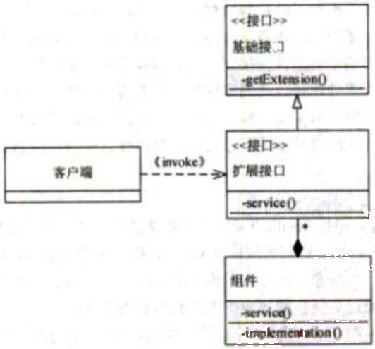
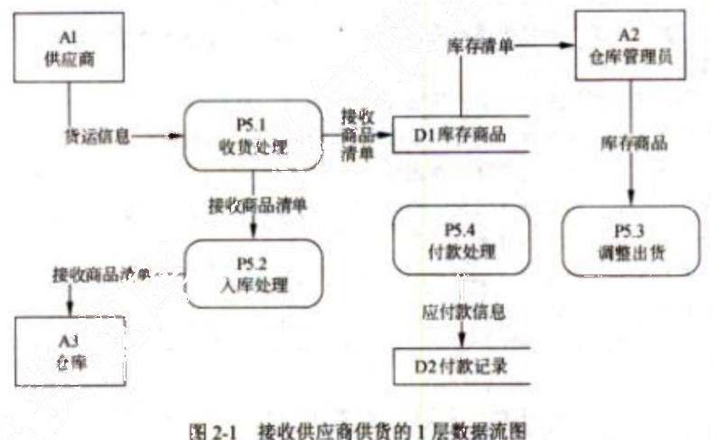
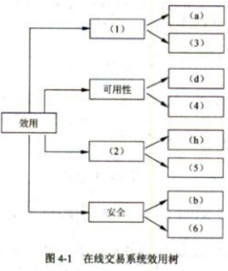

# 2014 年下半年 系统架构设计师 · 案例分析原卷（无答案）

>
> **来源**：本地购买扫描件《2014 年下半年 系统架构设计师 案例分析》（原卷，题干与参考答案分离）
> **来源类型**：`real`
> **解析方式**：byted-las-document-parse（normal 模式）+ 机械清洗，已剔除页眉、广告条与页码
> **答案与解析**：原卷不含参考答案；作答后请对照同考期的研读版文件评分
> **使用范围**：经典选题，仅保留原题号 一、二、四；不作为完整年份模考。筛选依据见 [历史题复核](../HISTORICAL_CURATION.md)。

## 试题一
> **题型**：案例 03 · 架构风格（MVC / 扩展接口）

## 【说明】
某软件公司欲开发一个网络设备管理系统，对管理区域内的网络设备（如路由器和交换机等）进行远程监视和控制。公司的系统分析师首先对系统进行了需求分析，识别出如下3项核心需求：
- （a）目前需要管理的网络设备确定为10类20种，未来还将有新类别的网络设备纳入到该设备管理系统中；
- （b）不同类别的网络设备，监视和控制的内容差异较大；同一类网络设备，监视和控制的内容相似，但不同厂商的实现方式（包括控制接口格式、编程语言等）差异较大；
- （c）网络管理员能够在一个统一的终端之上实现对这些网络设备的可视化呈现和管理操作。

针对上述需求，公司研发部门的架构师对网络设备管理系统的架构进行了分析与设计，架构师王工认为该系统可以采用MVC架构风格实现，即对每种网络设备设计一个监控组件，组件通过调用网络设备厂商内置的编程接口对监控指令进行接收和处理；系统管理员通过管理模块向监控组件发送监控指令，对网络设备进行远程管理；网络状态、监控结果等信息会在控制终端上进行展示。针对不同网络设备的差异，王工认为可以对当前的20种网络设备接口进行调研与梳理，然后通过定义统一操作接口屏蔽设备差异。李工同意王工提出的MVC架构风格和定义统一操作接口的思路，但考虑到未来还会有新类别的网络设备接入，认为还需要采用扩展接口的方式支持系统开发人员扩展或修改现有操作接口。公司组织专家进行架构评审，最终同意了王工的方案和李工的改进意见。

## 【问题1】
请用300字以内的文字解释什么是MVC架构风格以及其中的组件交互关系，并根据题干描述，指出该系统中的M、V、C分别对应什么。

## 【问题2】
扩展接口模式结构通常包含四个角色：基础接口、组件、扩展接口和客户端，它们之间的关系如图1-1所示。其中每个扩展接口需要通过扩展基础接口获得基本操作能力，然后加入自己特有的操作接口，并通过设置全局唯一接口ID对自身接口进行标识；每个具体的

组件需要实现扩展接口完成实际操作；客户端不与组件直接交互，而需要通过与扩展接口交互提出调用请求，扩展接口根据请求查找并选择合适的实现组件响应客户端请求。请根据上图所示和题干描述，指出扩展接口模式结构中的四个角色分别对应网络设备管理系统的哪些部分；并以客户端发起调用操作这一场景为例，填写表 1-1 中的（1）～（5）。

图 1-1 扩展接口模式角色关系

<table>
<caption>表 1-1 客户端发起调用操作过程描述</caption>
<thead>
<tr>
<th>序号</th>
<th>操 作</th>
</tr>
</thead>
<tbody>
<tr>
<td>1</td>
<td>客户端调用某个（1）A 上的操作接口，该操作接口可能是基础接口，也可能是扩展接口</td>
</tr>
<tr>
<td>2</td>
<td>若实现 A 的（2）存在被执行请求的操作接口，则调用该操作接口向用户返回结果</td>
</tr>
<tr>
<td>3</td>
<td>如果所有组件均没有实现（3），则客户端调用 A 上的 getExtension 方法，传入需要的（4），通过查找与定位，找到实现该操作接口的（5）B，并将 B 的引用传回给客户端</td>
</tr>
<tr>
<td>4</td>
<td>客户端调用 B 上的操作接口，通过相应的实现组件返回结果</td>
</tr>
</tbody>
</table>

备选答案：基础接口、扩展接口、操作接口、接口 ID、客户端、组件。

## 试题二
> **题型**：案例 14 · 结构化分析与 DFD

### 【说明】
某公司正在研发一套新的库存管理系统。系统中一个关键事件是接收供应商供货。项目组系统分析员小王花了大量时间在仓库观察了整个事件的处理过程，并开发出该过程所执行活动的列表：供应商发送货物和商品清单，公司收到商品后执行收货处理，包括卸载商品、确定收到了订单上的商品、处理与供应商的分歧等。对于已有商品，调整其库存信息，对于新采购的商品，在库存中添加新的商品记录。收货完成后，系统执行入库处理，将商品放到仓库对应的货架上。在付款处理活动中，自动生成应付账款信息，如果查询到该供应商有待付款记录，则进行合并付款，付款完成后消除应付账款记录。最后，仓库管理员根据最新的库存商品，调整出货信息。

小王根据自己观察的过程创建了该事件的1层数据流图，如图 2-1 所示。

图 2-1 接收供应商供货的1层数据流图

### 【问题 1】
请用 300 以内文字说明数据流图(Data Flow Diagram)的基本元素及其作用。

### 【问题 2】
数据流图在绘制过程中可能出现多种语法错误，请分析上图所示数据流图中哪些地方有错误，并分别说明错误的类型。

### 【问题3】

系统建模过程中为了保证数据模型和过程模型的一致性，需要通过数据-过程-CRUD矩阵来实现数据模型和过程模型的同步，请在表2-1所示CRUD矩阵（1）～（5）中填入相关操作。

表2-1 接收供应商供货的CRUD矩阵
<table>
  <tr>
    <th></th>
    <th>P5.1 收货处理</th>
    <th>P5.2 入库处理</th>
    <th>P5.3 调整出货</th>
    <th>P5.4 付款处理</th>
  </tr>
  <tr>
    <td>供应商</td>
    <td>（1）</td>
    <td></td>
    <td></td>
    <td>（2）</td>
  </tr>
  <tr>
    <td>库存商品</td>
    <td></td>
    <td>（3）</td>
    <td>（4）</td>
    <td></td>
  </tr>
  <tr>
    <td>付款记录</td>
    <td></td>
    <td></td>
    <td></td>
    <td>（5）</td>
  </tr>
</table>

## 试题四
> **题型**：案例 01 · 架构评估（ATAM）

【说明】

某电子商务公司拟升级目前正在使用的在线交易系统，以提高客户网上购物时在线支付环节的效率和安全性。公司研发部门在需求分析的基础上，给出了在线交易系统的架构设计。公司组织相关人员召开了针对架构设计的评估会议，会上用户提出的需求、架构师识别的关键质量属性场景和评估专家的意见等内容部分列举如下：

（a）在正常负载情况下，系统必须在 0.5 秒内响应用户的交易请求；

（b）用户的信用卡支付必须保证 99.999%的安全性；

（c）系统升级后用户名要求至少包含 8 个字符；

（d）网络失效后，系统需要在 2 分钟内发现错误并启用备用系统；

（e）在高峰负载情况下，用户发起支付请求后系统必须在 10 秒内完成支付功能；

（f）系统拟采用新的加密算法，这会提高系统安全性，但同时会降低系统的性能；

（g）对交易请求处理时间的要求将影响系统数据传输协议和交易处理过程的设计；

（h）需要在 30 人月内为系统添加公司新购买的事务处理中间件；

（i）现有架构设计中的支付部分与第三方支付平台紧耦合，当系统需要支持新的支付平台时，这种设计会导致支付部分代码的修改，影响系统的可修改性；

（j）主站点断电后，需要在 3 秒内将访问请求重定向到备用站点；

（k）用户信息数据库授权必须保证 99.999%可用；

（l）系统需要对 Web 界面风格进行修改，修改工作必须在 4 人月内完成；

（m）系统需要为后端工程师提供远程调试接口，并支持远程调试。

### 【问题1】

在架构评估过程中，质量属性效用树（utility tree）是对系统质量属性进行识别和优先级排序的重要工具。请给出合适的质量属性，填入图 4-1 中（1）、（2）空白处；并选择题干描述的（a）～（m），填入（3）～（6）空白处，完成该系统的效用树。

图4-1 在线交易系统效用树

### 【问题2】

在架构评估过程中，需要正确识别系统的架构风险、敏感点和权衡点，并进行合理的架构决策。请用300字以内的文字给出系统架构风险、敏感点和权衡点的定义，并从题干（a）～（m）中各选出1个对系统架构风险、敏感点和权衡点最为恰当的描述。
