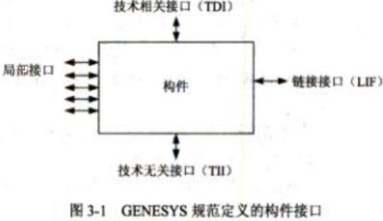
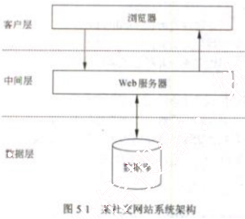

# 2014 年下半年 系统架构设计师 · 案例分析原卷（无答案）

> 题干与插图取自原卷；参考答案见同考期的研读版文件
>
> **来源**：本地购买扫描件《2014 年下半年 系统架构设计师 案例分析》（原卷，题干与参考答案分离）
> **来源类型**：`real`
> **解析方式**：byted-las-document-parse（normal 模式）+ 机械清洗，已剔除页眉、广告条与页码
> **答案与解析**：原卷不含参考答案；作答后请对照同考期的研读版文件评分
> **使用建议**：用于盲练：题干取自原卷，卷面本身无答案
> **完整性**：案例分析 5 题（原卷题干）

## 试题一
> **题型**：案例 01 · 架构评估（ATAM）

## 【说明】
某软件公司欲开发一个网络设备管理系统，对管理区域内的网络设备（如路由器和交换机等）进行远程监视和控制。公司的系统分析师首先对系统进行了需求分析，识别出如下3项核心需求：
- （a）目前需要管理的网络设备确定为10类20种，未来还将有新类别的网络设备纳入到该设备管理系统中；
- （b）不同类别的网络设备，监视和控制的内容差异较大；同一类网络设备，监视和控制的内容相似，但不同厂商的实现方式（包括控制接口格式、编程语言等）差异较大；
- （c）网络管理员能够在一个统一的终端之上实现对这些网络设备的可视化呈现和管理操作。

针对上述需求，公司研发部门的架构师对网络设备管理系统的架构进行了分析与设计，架构师王工认为该系统可以采用MVC架构风格实现，即对每种网络设备设计一个监控组件，组件通过调用网络设备厂商内置的编程接口对监控指令进行接收和处理；系统管理员通过管理模块向监控组件发送监控指令，对网络设备进行远程管理；网络状态、监控结果等信息会在控制终端上进行展示。针对不同网络设备的差异，王工认为可以对当前的20种网络设备接口进行调研与梳理，然后通过定义统一操作接口屏蔽设备差异。李工同意王工提出的MVC架构风格和定义统一操作接口的思路，但考虑到未来还会有新类别的网络设备接入，认为还需要采用扩展接口的方式支持系统开发人员扩展或修改现有操作接口。公司组织专家进行架构评审，最终同意了王工的方案和李工的改进意见。

## 【问题1】
请用300字以内的文字解释什么是MVC架构风格以及其中的组件交互关系，并根据题干描述，指出该系统中的M、V、C分别对应什么。

## 【问题2】
扩展接口模式结构通常包含四个角色：基础接口、组件、扩展接口和客户端，它们之间的关系如图1-1所示。其中每个扩展接口需要通过扩展基础接口获得基本操作能力，然后加入自己特有的操作接口，并通过设置全局唯一接口ID对自身接口进行标识；每个具体的

组件需要实现扩展接口完成实际操作；客户端不与组件直接交互，而需要通过与扩展接口交互提出调用请求，扩展接口根据请求查找并选择合适的实现组件响应客户端请求。请根据上图所示和题干描述，指出扩展接口模式结构中的四个角色分别对应网络设备管理系统的哪些部分；并以客户端发起调用操作这一场景为例，填写表 1-1 中的（1）～（5）。

图 1-1 扩展接口模式角色关系

<table>
<caption>表 1-1 客户端发起调用操作过程描述</caption>
<thead>
<tr>
<th>序号</th>
<th>操 作</th>
</tr>
</thead>
<tbody>
<tr>
<td>1</td>
<td>客户端调用某个（1）A 上的操作接口，该操作接口可能是基础接口，也可能是扩展接口</td>
</tr>
<tr>
<td>2</td>
<td>若实现 A 的（2）存在被执行请求的操作接口，则调用该操作接口向用户返回结果</td>
</tr>
<tr>
<td>3</td>
<td>如果所有组件均没有实现（3），则客户端调用 A 上的 getExtension 方法，传入需要的（4），通过查找与定位，找到实现该操作接口的（5）B，并将 B 的引用传回给客户端</td>
</tr>
<tr>
<td>4</td>
<td>客户端调用 B 上的操作接口，通过相应的实现组件返回结果</td>
</tr>
</tbody>
</table>

备选答案：基础接口、扩展接口、操作接口、接口 ID、客户端、组件。

从下列的 4 道试题（试题二至试题五）中任选 2 道解答。
如果解答的试题数超过 2 道，则题号小的 2 道解答有效。

## 试题二
> **题型**：案例 04 · UML 建模与分析

### 【说明】
某公司正在研发一套新的库存管理系统。系统中一个关键事件是接收供应商供货。项目组系统分析员小王花了大量时间在仓库观察了整个事件的处理过程，并开发出该过程所执行活动的列表：供应商发送货物和商品清单，公司收到商品后执行收货处理，包括卸载商品、确定收到了订单上的商品、处理与供应商的分歧等。对于已有商品，调整其库存信息，对于新采购的商品，在库存中添加新的商品记录。收货完成后，系统执行入库处理，将商品放到仓库对应的货架上。在付款处理活动中，自动生成应付账款信息，如果查询到该供应商有待付款记录，则进行合并付款，付款完成后消除应付账款记录。最后，仓库管理员根据最新的库存商品，调整出货信息。

小王根据自己观察的过程创建了该事件的1层数据流图，如图 2-1 所示。

图 2-1 接收供应商供货的1层数据流图

### 【问题 1】
请用 300 以内文字说明数据流图(Data Flow Diagram)的基本元素及其作用。

### 【问题 2】
数据流图在绘制过程中可能出现多种语法错误，请分析上图所示数据流图中哪些地方有错误，并分别说明错误的类型。

### 【问题3】

系统建模过程中为了保证数据模型和过程模型的一致性，需要通过数据-过程-CRUD矩阵来实现数据模型和过程模型的同步，请在表2-1所示CRUD矩阵（1）～（5）中填入相关操作。

表2-1 接收供应商供货的CRUD矩阵
<table>
  <tr>
    <th></th>
    <th>P5.1 收货处理</th>
    <th>P5.2 入库处理</th>
    <th>P5.3 调整出货</th>
    <th>P5.4 付款处理</th>
  </tr>
  <tr>
    <td>供应商</td>
    <td>（1）</td>
    <td></td>
    <td></td>
    <td>（2）</td>
  </tr>
  <tr>
    <td>库存商品</td>
    <td></td>
    <td>（3）</td>
    <td>（4）</td>
    <td></td>
  </tr>
  <tr>
    <td>付款记录</td>
    <td></td>
    <td></td>
    <td></td>
    <td>（5）</td>
  </tr>
</table>

## 试题三
> **题型**：案例 08 · 嵌入式 / 构件组装

【说明】

构件（component）也称为组件，是一个功能相对独立的具有可复用价值的软硬件单元。近年来，构件技术正在逐步应用于大型嵌入式系统的软件设计。某公司长期从事飞行器电子设备研制工作，已积累了大量成熟软件。但是，由于当初管理和设计等原因，公司的大量软件不能被复用，严重影响了公司后续发展。公司领导层高度重视软件复用问题，明确提出了要将本公司的成熟软件进行改造，建立公司可复用的软件构件库，以提升开发效率、降低成本。公司领导层决定将此项任务交给技术部门的王工程师负责组织实施。两个月后，王工程师经过调研、梳理和实验，提交了一份实施方案。此方案得到了公司领导层的肯定，但在实施过程中遇到了许多困难，主要表现在公司软件架构的变更和构件抽取的界面等方面。

### 【问题1】

请用 200 字以内文字说明获取构件的方法有哪几种？开发构件通常采用哪几种策略？并列举出两种主流构件标准。

### 【问题2】

由于该公司已具备大量的成熟软件，王工程师此次的主要工作就是采用遗留工程（Legacy Engineering）方法，将具有潜在复用价值的软件提取出来，得到可复用的构件。因此，在设计软件时与原开发技术人员产生了重大意见分歧，主要分歧焦点在于大家对构件概念理解上的差异。请根据你对构件的理解，判断表 3-1 给出的有关构件的说法是否正确，将答案写在答题纸上。

<table>
<caption>表 3-1 有关构件的6种说法</caption>
  <tr>
    <th>序号</th>
    <th>关于构件的说明</th>
    <th>正确：√ 不正确：×</th>
  </tr>
  <tr>
    <td>1</td>
    <td>构件是系统中的一个封装了设计与实现，而只披露接口的可更换的部分</td>
    <td>（1）</td>
  </tr>
  <tr>
    <td>2</td>
    <td>构件是解决软件复用的基础，复用的形式可分为垂直式复用和水平式复用。而水平式复用的主要关键点在于领域分析，具有领域特征和相似性，受到广泛关注</td>
    <td>（2）</td>
  </tr>
  <tr>
    <td>3</td>
    <td>构件构建在平台之上，平台提供核心平台服务，是构件实现与构件组装的基础。构件组装通常采用基于功能的组装技术、基于数据的组装技术和基于配置的组装技术等三种技术</td>
    <td>（3）</td>
  </tr>
  <tr>
    <td>4</td>
    <td>软件架构为软件系统提供了一个结构、行为和属性的高级抽象，由构件的描述、构件的相互作用（连接件）、指导构件集成的模式以及这些模式的约束组成</td>
    <td>（4）</td>
  </tr>
  <tr>
    <td>5</td>
    <td>构件可分为硬件构件、软件构件、系统构件和应用构件。RTL（运行时库）属于软件构件，由于 RTL 与应用领域相关，所以RTL 应属于垂直式复用构件</td>
    <td>（5）</td>
  </tr>
  <tr>
    <td>6</td>
    <td>硬件构件的功能被给定的硬件结构如 ASIC 预先确定，是不能修改的。同样，软件构件的功能由在 FPGA 或者 CPU 上的软件确定的，也是不能修改的</td>
    <td>（6）</td>
  </tr>
</table>

### 【问题3】

王工程师的实施方案指出：本公司的大部分产品是为用户提供标准计算平台的，而此平台中的主要开发工作是为嵌入式操作系统研制板级支持软件(BSP)。为了提高 BSP 软件的复用，应首先开展 BSP 构件的开发，且构件架构应符合国外 GENESYS 规范定义的嵌入式系统架构风格。图 3-1 给出了架构风格定义的构件通用接口，其中：链接接口（LIF）是构件对外提供的功能服务接口；局部接口建立了构件和它的局部环境的连接，如传感器、作动器或人机接口；技术相关接口(TDI)提供了查看构件内部、观察构件的内部变量的手段，如诊断等；技术无关接口(TII)用来在运行时配置、复使、重启构件的接口。现需要针对 BSP 中常用的RS-232 串行驱动程序设计一个可复用的软构件，请说明该软构件四类接口的具体功能。

图 3-1 GENESYS 规范定义的构件接口

## 试题四
> **题型**：案例 01 · 架构评估（ATAM）

【说明】

某电子商务公司拟升级目前正在使用的在线交易系统，以提高客户网上购物时在线支付环节的效率和安全性。公司研发部门在需求分析的基础上，给出了在线交易系统的架构设计。公司组织相关人员召开了针对架构设计的评估会议，会上用户提出的需求、架构师识别的关键质量属性场景和评估专家的意见等内容部分列举如下：

（a）在正常负载情况下，系统必须在 0.5 秒内响应用户的交易请求；

（b）用户的信用卡支付必须保证 99.999%的安全性；

（c）系统升级后用户名要求至少包含 8 个字符；

（d）网络失效后，系统需要在 2 分钟内发现错误并启用备用系统；

（e）在高峰负载情况下，用户发起支付请求后系统必须在 10 秒内完成支付功能；

（f）系统拟采用新的加密算法，这会提高系统安全性，但同时会降低系统的性能；

（g）对交易请求处理时间的要求将影响系统数据传输协议和交易处理过程的设计；

（h）需要在 30 人月内为系统添加公司新购买的事务处理中间件；

（i）现有架构设计中的支付部分与第三方支付平台紧耦合，当系统需要支持新的支付平台时，这种设计会导致支付部分代码的修改，影响系统的可修改性；

（j）主站点断电后，需要在 3 秒内将访问请求重定向到备用站点；

（k）用户信息数据库授权必须保证 99.999%可用；

（l）系统需要对 Web 界面风格进行修改，修改工作必须在 4 人月内完成；

（m）系统需要为后端工程师提供远程调试接口，并支持远程调试。

### 【问题1】

在架构评估过程中，质量属性效用树（utility tree）是对系统质量属性进行识别和优先级排序的重要工具。请给出合适的质量属性，填入图 4-1 中（1）、（2）空白处；并选择题干描述的（a）～（m），填入（3）～（6）空白处，完成该系统的效用树。

图4-1 在线交易系统效用树

### 【问题2】

在架构评估过程中，需要正确识别系统的架构风险、敏感点和权衡点，并进行合理的架构决策。请用300字以内的文字给出系统架构风险、敏感点和权衡点的定义，并从题干（a）～（m）中各选出1个对系统架构风险、敏感点和权衡点最为恰当的描述。

## 试题五
> **题型**：案例 11 · 架构演化与系统改造

【说明】
某软件公司开发运维了一个社交网站系统，该系统基于开源软件平台LAMP(Linux+Apache+MySQL+PHP)构建，运行一段时间以来，随着用户数量及访问量的增加，系统在Web服务器负载、磁盘I/O等方面出现了明显瓶颈，已不能满足大量客户端并发访问的要求，因此公司成立了专门的项目组，拟对系统架构进行调整以提高系统并发处理能力。目前系统采用了传统的三层结构，系统架构如图5-1所示。

图5-1 某社交网站系统架构

### 【问题1】

针对目前出现的Web服务器负载过大问题，项目组决定在客户端与中间层Web服务器之间引入负载均衡器，通过中间层Web服务器集群来提高Web请求的并发处理能力。在讨论拟采用的负载均衡机制时，王工提出采用基于DNS的负载均衡机制，而李工则认为应采用基于反向代理的负载均衡机制，项目组经过讨论，最终确定采用李工提出的方案。请用200字以内的文字，分别简要说明两个机制的基本原理；并从系统执行效率、安全性及简易性等方面将两种机制进行对比，将对比结果填入表5-1中。

<table>
<caption>表5-1 两种负载均衡机制对比分析表</caption>
  <tr>
    <th colspan="2">特性</th>
    <th>基于DNS的负载均衡</th>
    <th>基于反向代理的负载均衡</th>
  </tr>
  <tr>
    <td rowspan="2">系统执行效率</td>
    <td>是否考虑内部服务器性能差异及实时负载情况</td>
    <td>(1)</td>
    <td>(2)</td>
  </tr>
  <tr>
    <td>是否可对内部服务器静态资源进行缓存</td>
    <td>(3)</td>
    <td>(4)</td>
  </tr>
  <tr>
    <td>安全性</td>
    <td>是否能屏蔽客户端对真实Web服务器的直接访问</td>
    <td>(5)</td>
    <td>(6)</td>
  </tr>
  <tr>
    <td>简易性</td>
    <td>是否具有实现简单、容易实施及低成本的特性</td>
    <td>(7)</td>
    <td>(8)</td>
  </tr>
</table>

注：请在表格（1）~（8）处填入“是”或“否”

### 【问题2】

针对并发数据库访问所带来的磁盘I/O瓶颈问题，项目组决定在数据层引入数据库扩展机制。经过调研得知系统数据库中存储的主要数据为以用户标识为索引的社交网络数据，且系统运行时发生的大部分数据库操作为查询操作。经过讨论，项目组决定引入数据库分区和MySQL主从复制两种扩展机制。数据库分区可采用水平分区和垂直分区两种方式，请用350字以内的文字说明在本系统中应采用哪种方式及其原因，并分析引入主从复制机制给系统带来的好处。

### 【问题3】

为进一步提高数据库访问效率，项目组决定在中间层与数据层之间引入缓存机制。赵工开始提出可直接使用MySQL的查询缓存(query cache)机制，但项目组经过分析好友动态显示等典型业务的操作需求，同时考虑已引入的数据库扩展机制，认为查询缓存尚不能很好地提升系统的查询操作效率，项目组最终决定在中间层与数据层之间引入Memcached分布式缓存机制。

（a）请补充下述关于引入Memcached后系统访问数据库的基本过程：系统需要读取后台数据时，先检查数据是否存在于（1）中，若存在则直接从其中读取，若不存在则从（2）中读取并保存在（3）中；当（4）中数据发生更新时，需要将更新后的内容同步到（5）实例中。（备选答案：数据库、Memcached 缓存）

（b）请结合已知信息从缓存架构、缓存有效性及缓存数据类型等方面分析使用Memcached代替数据库查询缓存的原因。
