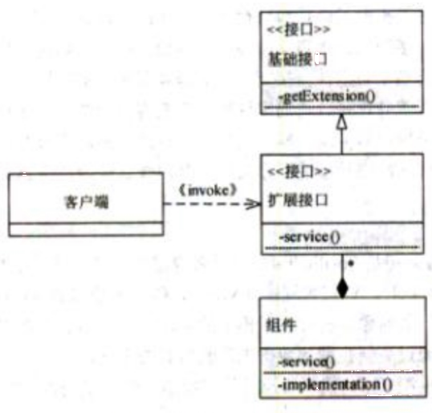
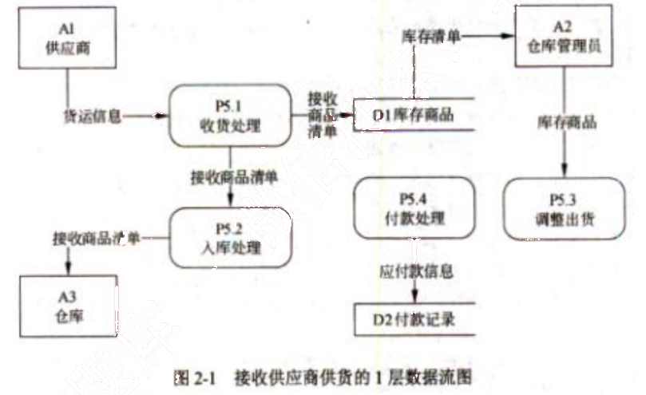
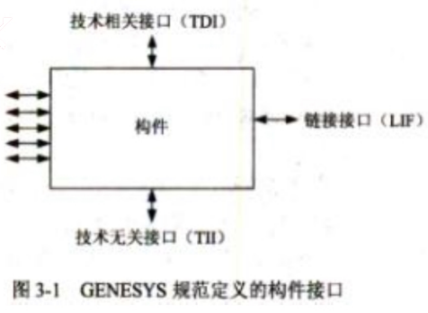
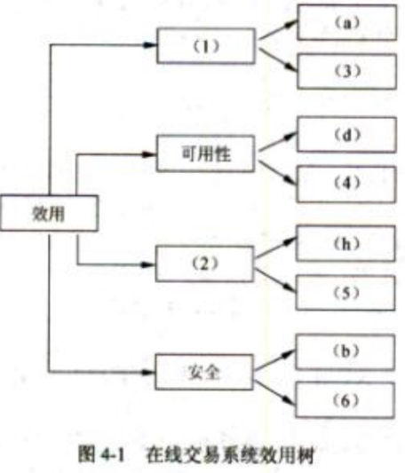
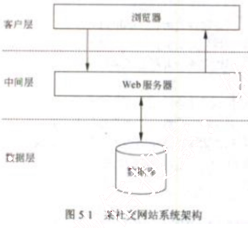

# 2014 年下半年 系统架构设计师 · 案例分析真题

> 试题一必答 + 试题二至五选答 2 道；含参考答案
>
> **来源**：本地购买扫描件《2014 年下半年系统架构设计师 答案详解》（贡献者已购买并授权转录）
> **来源类型**：`real`
> **解析方式**：byted-las-document-parse（normal 模式）+ 机械清洗，已剔除页眉、广告条与页码
> **答案与解析**：取自随卷答案详解，非本仓库编写
> **使用建议**：可用于章节训练与年份模考；关键数字建议对照原始 PDF 复核
> **完整性**：综合知识 75 题、案例分析 5 题、论文 4 题齐备

## 试题一
> **题型**：案例 01 · 架构评估（ATAM）

【说明】

某软件公司欲开发一个网络设备管理系统，对管理区域内的网络设备（如路由器和交换机等）进行远程监视和控制。公司的系统分析师首先对系统进行了需求分析，识别出如下3项核心需求：

（a）目前需要管理的网络设备确定为10类20种，未来还将有新类别的网络设备纳入到该设备管理系统中；

（b）不同类别的网络设备，监视和控制的内容差异较大；同一类网络设备，监视和控制的内容相似，但不同厂商的实现方式（包括控制接口格式、编程语言等）差异较大；

（c）网络管理员能够在一个统一的终端之上实现对这些网络设备的可视化呈现和管理操作。

针对上述需求，公司研发部门的架构师对网络设备管理系统的架构进行了分析与设计，架构师王工认为该系统可以采用MVC架构风格实现，即对每种网络设备设计一个监控组件，组件通过调用网络设备厂商内置的编程接口对监控指令进行接收和处理；系统管理员通过管理模块向监控组件发送监控指令，对网络设备进行远程管理；网络状态、监控结果等信息会在控制终端上进行展示。针对不同网络设备的差异，王工认为可以对当前的20种网络设备接口进行调研与梳理，然后通过定义统一操作接口屏蔽设备差异。李工同意王工提出的MVC架构风格和定义统一操作接口的思路，但考虑到未来还会有新类别的网络设备接入，认为还需要采用扩展接口的方式支持系统开发人员扩展或修改现有操作接口。公司组织专家进行架构评审，最终同意了王工的方案和李工的改进意见。

### 【问题1】

请用300字以内的文字解释什么是MVC架构风格以及其中的组件交互关系，并根据题干描述，指出该系统中的M、V、C分别对应什么。

MVC架构风格最初是Smalltalk-80中用来构建用户界面时采用的架构设计风格。其中M代表模型（Model），V代表视图（View），C代表控制器（Controller）。在该风格中，模型表示待展示的对象，视图表示模型的展示，控制器负责把用户的动作转成针对模型的操作。模型通过更新视图的数据来反映自身的变化。

在本系统中，模型（M）代表监控组件、视图（V）代表控制终端、控制器（C）代表管理模块。

本题主要考查MVC架构风格的定义以及扩展接口模式结构的分析与理解。

MVC架构风格最初是Smalltalk-80中用来构建用户界面时采用的架构设计风格。其中M代表模型（Model），V代表视图（View），C代表控制器（Controller）。在该风格中，模型表示待展示的对象，视图表示模型的展示，控制器负责把用户的动作转成针对模型的操作。模型通过更新视图的数据来反映自身的变化。

在本系统中，模型（M）代表监控组件、视图（V）代表控制终端、控制器（C）代表管理模块。

### 【问题2】

扩展接口模式结构通常包含四个角色：基础接口、组件、扩展接口和客户端，它们之间的关系如图1-1所示。其中每个扩展接口需要通过扩展基础接口获得基本操作能力，然后加入自己特有的操作接口，并通过设置全局唯一接口ID对自身接口进行标识；每个具体的组件需要实现扩展接口完成实际操作；客户端不与组件直接交互，而需要通过与扩展接口交互提出调用请求，扩展接口根据请求查找并选择合适的实现组件响应客户端请求。请根据上图所示和题干描述，指出扩展接口模式结构中的四个角色分别对应网络设备管理系统的哪些部分；并以客户端发起调用操作这一场景为例，填写表1-1中的（1）～（5）。

图 1-1 扩展接口模式角色关系

<table>
<caption>表 1-1 客户端发起调用操作过程描述</caption>
<thead>
  <tr>
    <th>序号</th>
    <th>操 作</th>
  </tr>
</thead>
<tbody>
  <tr>
    <td>1</td>
    <td>客户端调用某个 (1) A 上的操作接口，该操作接口可能是基础接口，也可能是扩展接口</td>
  </tr>
  <tr>
    <td>2</td>
    <td>若实现 A 的 (2) 存在被执行请求的操作接口，则调用该操作接口向用户返回结果</td>
  </tr>
  <tr>
    <td>3</td>
    <td>如果所有组件均没有实现 (3)，则客户端调用 A 上的 getExtension 方法，传入需要的 (4)，通过查找与定位，找到实现该操作接口的 (5) B，并将 B 的引用传回给客户端</td>
  </tr>
  <tr>
    <td>4</td>
    <td>客户端调用 B 上的操作接口，通过相应的实现组件返回结果</td>
  </tr>
</tbody>
</table>

备选答案：基础接口、扩展接口、操作接口、接口 ID、客户端、组件。

各个角色与网络设备管理系统的对应关系为：

基础接口对应统一操作接口；

组件对应监控组件；

扩展接口对应新网络设备的操作接口；

客户端对应控制终端。

客户端发起调用操作场景下的描述如下：

<table>
<thead>
  <tr>
    <th>序号</th>
    <th>操 作</th>
  </tr>
</thead>
<tbody>
  <tr>
    <td>1</td>
    <td>客户端调用某个 (1) 扩展接口 A 上的操作接口，该操作接口可能是基础接口，也可能是扩展接口</td>
  </tr>
  <tr>
    <td>2</td>
    <td>若实现 A 的 (2) 组件存在被执行请求的操作接口，则调用该操作接口向用户返回结果</td>
  </tr>
  <tr>
    <td>3</td>
    <td>如果所有组件均没有实现 (3) 操作接口，则客户端调用 A 上的 getExtension 方法，传入需要的 (4) 接口 ID，通过查找与定位，找到实现该操作接口的 (5) 扩展接口 B，并将 B 的引用传回给客户端</td>
  </tr>
  <tr>
    <td>4</td>
    <td>客户端调用 B 上的操作接口，通过相应的实现组件返回结果</td>
  </tr>
</tbody>
</table>

扩展接口模式结构通常包含四个角色：基础接口、组件、扩展接口和客户端。其中每个

扩展接口需要通过扩展基础接口获得基本操作能力，然后加入自己特有的操作接口，并通过设置全局唯一接口 ID 对自身接口进行标识。每个具体的组件需要实现扩展接口完成实际操作，客户端不与组件直接交互，而需要通过与扩展接口交互提出调用请求，扩展接口根据请求查找并选择合适的实现组件响应客户端请求。根据题干描述，可以看出基础接口这一角色应该对应统一操作接口，组件这一角色应该对应监控组件，扩展接口这一角色应该对应新网络设备的操作接口，客户端这一角色应该对应控制终端。

## 试题二
> **题型**：案例 04 · UML 建模与分析

【说明】
某公司正在研发一套新的库存管理系统。系统中一个关键事件是接收供应商供货。项目组系统分析员小王花了大量时间在仓库观察了整个事件的处理过程，并开发出该过程所执行活动的列表：供应商发送货物和商品清单，公司收到商品后执行收货处理，包括卸载商品、确定收到了订单上的商品、处理与供应商的分歧等。对于已有商品，调整其库存信息，对于新采购的商品，在库存中添加新的商品记录。收货完成后，系统执行入库处理，将商品放到仓库对应的货架上。在付款处理活动中，自动生成应付账款信息，如果查询到该供应商有待付款记录，则进行合并付款，付款完成后消除应付账款记录。最后，仓库管理员根据最新的库存商品，调整出货信息。

小王根据自己观察的过程创建了该事件的1层数据流图，如图 2-1 所示。

图 2-1 接收供应商供货的1层数据流图

### 【问题1】

请用300以内文字说明数据流图(Data Flow Diagram)的基本元素及其作用。

四种元素：
(1) External Agent(实体/外部代理)：定义位于项目范围之外，但与正在被研发的系统有交互关系的人、部门、外部系统或组织。
(2) Process(加工/处理)：在输入数据流或条件上执行，或者对输入数据流或条件做出响应的工作。
(3) Data Store(数据存储)：静止的数据，表示系统中需要保存的数据。
(4) Data Flow(数据流)：运动中的数据，表示到一个过程的数据输入，或者来自一个

过程的数据输出。

本题考查系统过程建模的相关知识。

数据流图（Data Flow Diagram）从数据传递和加工角度，以图形方式来表达系统的逻辑功能、数据在系统内部的逻辑流向和逻辑变换过程，是结构化系统分析方法的主要表达工具及用于表示软件模型的一种图示方法。为了表达数据处理过程的数据加工情况，用一个数据流图往往是不够的。层次结构的数据流图按照系统的层次结构进行逐步分解，并以分层的数据流图反映这种结构关系，能清楚地表达和容易理解整个系统。

本问题考查数据流图中包含的元素及其作用。

数据流图通过外部代理（实体）描述系统与外界之间的数据交互关系，内部的活动通过处理（加工）表示，用数据流描述系统中不同活动之间的数据传输内容和方向，需要持久化存储的数据用数据存储表示，一般用文件系统或者数据库表存储数据，数据流图中所包含的四种元素：

(1) 外部实体（External Agent）定义位于项目范围之外，但与正在被研发的系统有交互关系的人、部门、外部系统或组织；

(2) 加工（Process）在输入数据流或条件上执行，或者对输入数据流或条件做出响应的工作；

(3) 数据存储（Data Store）描述静止的数据，表示系统中需要保存的数据；

(4) 数据流（Data Flow）描述运动中的数据，表示到一个过程的数据输入，或者来自一个过程的数据输出。

### 【问题2】

数据流图在绘制过程中可能出现多种语法错误，请分析上图所示数据流图中哪些地方有错误，并分别说明错误的类型。

四种错误：
(1) D1 到 A2：缺少移动数据流的加工。
(2) P5.3：没有输出数据流，输入输出不平衡。
(3) P5.4：没有输入数据流，输入输出不平衡。
(4) D2：数据存储没有输出的数据流。

本问题考查数据流图绘制过程中常见的错误。

数据流图中的错误包括两类：第一类是逻辑错误，加工节点输入输出不平衡，包括黑洞、灰洞和无输入三种类型；第二类是语法错误，比如数据存储不完整、在数据存储与外部代理之间或者各自之间没有经过加工之间发生数据流等。根据图2-1所示，P5.3和P5.4属于逻辑错误，数据流图不平衡，D2没有输出数据流，D1到A2缺少加工等属于第二类错误。

### 【问题3】

系统建模过程中为了保证数据模型和过程模型的一致性，需要通过数据-过程-CRUD矩阵来实现数据模型和过程模型的同步，请在表2-1所示CRUD矩阵（1）～（5）中填入相关操作。

<table>
<caption>表2-1 接收供应商供货的CRUD矩阵</caption>
  <tr>
    <td></td>
    <td>P5.1 收货处理</td>
    <td>P5.2 入库处理</td>
    <td>P5.3 调整出货</td>
    <td>P5.4 付款处理</td>
  </tr>
  <tr>
    <td>供应商</td>
    <td>(1)</td>
    <td></td>
    <td></td>
    <td>(2)</td>
  </tr>
  <tr>
    <td>库存商品</td>
    <td></td>
    <td>(3)</td>
    <td>(4)</td>
    <td></td>
  </tr>
  <tr>
    <td>付款记录</td>
    <td></td>
    <td></td>
    <td></td>
    <td>(5)</td>
  </tr>
</table>

(1) R
(2) R
(3) CRU
(4) RU
(5) CRUD

CRUD(Create\Read\Update\Delete)矩阵用于检查系统建模过程中数据模型和过程模型的一致性，分别表示了加工对于数据的新增、读取、修改和删除四种操作。根据需求陈述和表2-1所示内容，P5.1收货处理和P5.4付款处理两个加工分别需要获得供应商的货运信息和付款记录，（1）和（2）处为读取操作（R）；P5.2入库处理中需要添加新的商品记录或者查询并修改现有商品的库存信息，（3）处为创建、读取和更新操作；P5.3调整出货会读取并修改库存商品信息，（4）处为读取和修改操作（RU）；P5.4付款处理中除了生成付款记录、读取或修改付款记录外，对于已经付款的信息要消除应付款信息，所以（5）处为新增、读取、修改和删除四种操作（CRUD）。

## 试题三
> **题型**：案例 08 · 嵌入式 / 构件组装

【说明】
构件(component)也称为组件，是一个功能相对独立的具有可复用价值的软硬件单元。
近年来，构件技术正在逐步应用于大型嵌入式系统的软件设计。某公司长期从事飞行器电子设备研制工作，已积累了大量成熟软件。但是，由于当初管理和设计等原因，公司的大量软件不能被复用，严重影响了公司后续发展。公司领导层高度重视软件复用问题，明确提出了要将本公司的成熟软件进行改造，建立公司可复用的软件构件库，以提升开发效率、降低成本。公司领导层决定将此项任务交给技术部门的王工程师负责组织实施。两个月后，王工程师经过调研、梳理和实验，提交了一份实施方案。此方案得到了公司领导层的肯定，但在实施过程中遇到了许多困难，主要表现在公司软件架构的变更和构件抽取的界面等方面。

### 【问题1】

请用200字以内文字说明获取构件的方法有哪几种？开发构件通常采用哪几种策略？并列举出两种主流构件标准。

基于构件的软件开发中，可以通过不同的途径来获取构件，主要包括以下4种方法：
(1) 从现有构件中获得符合要求的构件，直接使用或做适应性修改，得到可复用的构件；
(2) 通过遗留工程（Legacy Engineering），将具有潜在复用价值的软件提取出来，得到可复用的构件；
(3) 从市场上购买现成的商业构件，BPCOTS(Commercial Off-The-Shell)构件；
(4) 开发新的符合要求的构件。

开发构件通常采取3种策略：
(1) 分区(partitioning)：指的是将问题情景的空间分割成几乎可以独立研究的部分；
(2) 抽象(abstraction)：是对在给定实践内执行指定计算的软/硬件申.元的一种抽象；
(3) 分割（segmentation）：是将结构引入构件的行为，支持对行为性质进行时序推理。

当前主流构件标准有：
(1) CORBA：由OMG(对象管理集团)制定；
(2) COM/DCOM：由Microsoft制定；
(3) EJB：由SUN的Java企业Bean制定。

本题考查软件构件（component）基本概念、提取构件需要采取的一般方法，通过一种简

单的实例，重点考查考生对构件知识使用的掌握程度。

此类题B要求考生认真阅读题目对问题的描述，通过自己对构件知识的掌握的程度，采用总结、抽象和概括等的方式，从问题描述中发现问题的相关性，正确回答问题。

构件（component）也称为组件，是一个功能相对独立的具有可复用价值的软硬件单元。近年来，构件技术正在逐步应用于大型嵌入式系统的软件设计。从传统意义上来讲，构件就是一种可独立开发、具备独立功能的一类软件。它具备有独立性、可重用性、可组装性、可配置性等特点，构件没有大小之分，可通过将几个构件组装成一个新构件。

通常情况下，软件人员在从事开发时，在分析和论证的基础上，提炼出适合本项目需要的构件，这样可降低软件开发成本、缩短开发周期。软构件可通过多种途径获取，目前可主要归纳为以下四种方法：

(1) 修改已有构件：从现有构件中获得符合要求的构件，直接使用或做适应性修改，得到可复用的构件；

(2) 封装新构件：通过遗留工程（Legacy Engineering），将具有潜在复用价值的软件提取出来，得到可复用的构件；

(3) COTS 构件：从市场上购买现成的商业软件（构件），通过处理形成满足自己需要的构件，即COTS(Commercial Off-The-Shell)构件；

(4) 新开发构件：针对项目需要，在分许、评估的基础上，开发新的符合要求的构件。

软件构件的开发方法通常包括了分区（partitioning）、抽象（abstraction）和分割（segmentation）等三种。分区指的是将问题情景的空间分割成几乎可以独立研究的部分；抽象是对在给定实践内执行指定计算的软/硬件单元的一种抽象；分割是将结构引入构件的行为，支持对行为性质进行时序推理。通俗地说，分区就是在空间上对软件进行划分，保证构件在空间上具备独立特性，分割就是按软件程序的执行行为特征，按时间关系进行分解，保证构件在时间上具备独立特性，抽象就是按软件功能独立性进行分解和抽象。目前，基于构件的软件体系标准是由 OMG(对象管理集团) 制定的 CORBA 标准、由 Microsoft 公司制定 COM/DCOM 标准和由 SUN 的 Java 企业 Bean 制定 EJB 标准。

### 【问题2】

由于该公司已具备大量的成熟软件，王工程师此次的主要工作就是采用遗留工程(Legacy Engineering)方法，将具有潜在复用价值的软件提取出来，得到可复用的构件。因此，在设计软件时与原开发技术人员产生了重大意见分歧，主要分歧焦点在于大家对构件概

念理解上的差异。请根据你对构件的理解，判断表 3-1 给出的有关构件的说法是否正确，将答案写在答题纸上。

<table>
<caption>表 3-1 有关构件的 6 种说法</caption>
<thead>
<tr>
<th>序号</th>
<th>关于构件的说明</th>
<th>正确：√ 不正确：×</th>
</tr>
</thead>
<tbody>
<tr>
<td>1</td>
<td>构件是系统中的一个封装了设计与实现，而只披露接口的可更换的部分</td>
<td>(1)</td>
</tr>
<tr>
<td>2</td>
<td>构件是解决软件复用的基础，复用的形式可分为垂直式复用和水平式复用。而水平式复用的主要关键点在于领域分析，具有领域特征和相似性，受到广泛关注</td>
<td>(2)</td>
</tr>
<tr>
<td>3</td>
<td>构件构建在平台之上，平台提供核心平台服务，是构件实现与构件组装的基础。构件组装通常采用基于功能的组装技术、基于数据的组装技术和基于配置的组装技术等三种技术</td>
<td>(3)</td>
</tr>
<tr>
<td>4</td>
<td>软件架构为软件系统提供了一个结构、行为和属性的高级抽象，由构件的描述、构件的相互作用（连接件）、指导构件集成的模式以及这些模式的约束组成</td>
<td>(4)</td>
</tr>
<tr>
<td>5</td>
<td>构件可分为硬件构件、软件构件、系统构件和应用构件。RTL（运行时库）属于软件构件，由于 RTL 与应用领域相关，所以 RTL 应属于垂直式复用构件</td>
<td>(5)</td>
</tr>
<tr>
<td>6</td>
<td>硬件构件的功能被给定的硬件结构如 ASIC 预先确定，是不能修改的。同样，软件构件的功能由在 FPGA 或者 CPU 上的软件确定的，也是不能修改的</td>
<td>(6)</td>
</tr>
</tbody>
</table>

（1）√（2）×（3）×（4）√（5）×（6）×

本问题主要考查考生对构件基本知识的掌握程度，通过判断正确、错误的形式，考察考生对构件概念正确性理解。每个判断题正确的描述如下：

(1) “构件是系统中的一个封装了设计与实现，而只披露接口的可更换的部分”。此种描述是正确的。

(2) “构件是解决软件复用的基础，复用的形式可分为垂直式复用和水平式复用。而垂直式复用的主要关键点在于领域分析，具有领域特征和相似性，受到广泛关注”。垂直式复用是与领域特性相关的，而水平式复用是一种公用的服务，不予某个特殊领域相关。

(3) “构件构建在平台之上，平台提供核心平台服务，是构件实现与构件组装的基础。构件组装通常采用基于功能的组装技术、基于数据的组装技术和面向对象的组装技术等三种技术”。配置只是一种构件功能组合动态方法，而不是构件组装的技术。

(4) “软件架构为软件系统提供了一个结构、行为和属性的高级抽象，由构件的描述、构件的相互作用（连接件）、指导构件集成的模式以及这些模式的约束组成”。该描述是正确的。

（5）“构件可分为硬件构件、软件构件、系统构件和应用构件。RTL（运行时库）属于软件构件，由于RTL可适应多种应用领域，所以RTL与属于水平式复用构件”。RTL是C/C++语言为用户提供的一种运行时库，如数学库、stdio库等，它可服务于多种应用，而与领域需求无关，所以说RTL不属于垂直式复用构件。

（6）“硬件构件的功能被给定的硬件结构如ASIC预先确定，他是不能修改的。同样，软件构件的功能由在FPGA或者CPU上的软件确定的，我们将加载在软件构件上的软件称为作业。将作业分配给适当的可以执行该作业的硬件单元就创建了新的构件。软件构件的功能所以在构件的寿命期中可以修改”。

### 【问题3】

王工程师的实施方案指出：本公司的大部分产品是为用户提供标准计算平台的，而此平台中的主要开发工作是为嵌入式操作系统研制板级支持软件（BSP）。为了提高BSP软件的复用，应首先开展BSP构件的开发，且构件架构应符合国外GENESYS规范定义的嵌入式系统架构风格。图3-1给出了架构风格定义的构件通用接口，其中：链接接口（LIF）是构件对外提供的功能服务接口；局部接口建立了构件和它的局部环境的连接，如传感器、作动器或人机接口；技术相关接口（TDI）提供了查看构件内部、观察构件的内部变量的手段，如诊断等；技术无关接口（TII）用来在运行时配置、复使、重启构件的接口。现需要针对BSP中常用的RS-232串行驱动程序设计一个可复用的软构件，请说明该软构件四类接口的具体功能。

RS-232驱动程序主要完成对RS-232芯片的初始化，实现RS-232数据发送、接收和控制等功能。依据GENESYS规范定义的构件接口含义，RS-232驱动程序构件的接口定义如下：

（1）链接接口
RS-232驱动构件的使用者是上层的操作系统或应用软件，本构件应该给他们提供串行接口的数据发送、数据接收服务（1分）。因此，链接接口至少包括以下功能服务：

- Send()：处理机中的程序向 RS-232 芯片输出数据；
- Receive()：处理机中的程序通过 RS-232 芯片从外部接收数据；
- Init232()：初始化 RS-232 芯片。

### （2）局部接口
RS-232 驱动构件的局部接口应该是 RS-232 芯片为编程提供的各类寄存器和 CPU 对外围芯片的支持，此接口与硬件紧密相关。就 RS-232 芯片而言，局部接口至少包括以下功能服务：
- Intconnect()：将 RS-232 芯片的外部中断向量连接到 CPU；
- Read()：从 RS-232 芯片中读取寄存器的内容（包括控制、状态类寄存器和数据输入寄存器）；
- Write()：将控制信息或输出的数据写入 RS-232 芯片的相应寄存器。

### （3）技术相关接口
RS-232 驱动构件的技术相关接口应该是 RS-232 驱动构件为维护人员提供的芯片诊断接口，此接口与硬件和应用紧密相关。就 RS-232 芯片使用而言，技术相关接口至少包括以下诊断功能服务：
- Datacheck()：诊断数据传输校验的错误。

### （4）技术无关接口
RS-232 驱动构件的技术无关接口应该是 RS-232 驱动构件为编程人员提供的芯片初始化或运行时的配置接口。技术无关接口至少包括以下功能服务：
- Reset()：RS-232 芯片或驱动构件复位；
- Restart()：RS-232 芯片或驱动构件重启动；
- Rateconfigure()：配置、重新配置 RS-232 传输速率。

本问题要求考生根据自己掌握的构件基本知识，结合图 3-1 给出的一种构件接口要求，在分析题干的基础上，针对一个驱动实例，完成串行接口的驱动软构件的设计。RS-232 驱动程序是每个从事嵌入式软件开发人员都知道的一种软件，它主要完成对 RS-232 芯片的初始化，实现 RS-232 数据发送、接收和控制等功能。本题要求考生将这些功能（服务）有效地分解到图 3-1 定义的构件四类接口。如果考生具有一定实际经验，就可完成次设计。下面简要说明答题思路：

### （1）链接接口

RS-232 驱动构件的使用者是上层的操作系统或应用软件，本构件应该给他们提供串行接口的数据发送、数据接收服务。因此，链接接口至少包括以下功能服务：
- Send()：处理机中的程序向 RS-232 芯片输出数据；
- Receive()：处理机中的程序通过 RS-232 芯片从外部接收数据；
- Init232()：初始化 RS-232 芯片。

(2) 局部接口

RS-232 驱动构件的局部接口应该是 RS-232 芯片为编程提供的各类寄存器和 CPU 对外围芯片的支持，此接口与硬件紧密相关。就 RS-232 芯片而言，局部接口至少包括以下功能服务：
- Intconnect()：将 RS-232 芯片的外部中断向量连接到 CPU；
- Read()：从 RS-232 芯片中读取寄存器的内容（包括控制、状态类寄存器和数据输入寄存器）；
- Write()：将控制信息或输出的数据写入 RS-232 芯片的相应寄存器。

(3) 技术相关接口

RS-232 驱动构件的技术相关接口应该是 RS-232 驱动构件为维护人员提供的芯片诊断接口，此接口与硬件和应用紧密相关。就 RS-232 芯片使用而言，技术相关接口至少包括以下诊断功能服务：
- Datacheck0：诊断数据传输校验的错误。

(4) 技术无关接口

RS-232 驱动构件的技术无关接口应该是 RS-232 驱动构件为编程人员提供的芯片初始化或运行时的配置接口。技术无关接口至少包括以下功能服务：
- Reset()：RS-232 芯片或驱动构件复位；
- Restart()：RS-232 芯片或驱动构件重启动；
- Rateconfigure()：配置、重新配置 RS-232 传输速率。

问题 3 的解答内容仅供参考，每一类接口提供的服务格式、分类等可以有差异，但对于 RS-232 驱动构件每种功能分类一致即可。

## 试题四
> **题型**：案例 01 · 架构评估（ATAM）

【说明】
某电子商务公司拟升级目前正在使用的在线交易系统，以提高客户网上购物时在线支付环节的效率和安全性。公司研发部门在需求分析的基础上，给出了在线交易系统的架构设计。公司组织相关人员召开了针对架构设计的评估会议，会上用户提出的需求、架构师识别的关键质量属性场景和评估专家的意见等内容部分列举如下：

（a）在正常负载情况下，系统必须在 0.5 秒内响应用户的交易请求；
（b）用户的信用卡支付必须保证 99.999%的安全性；
（c）系统升级后用户名要求至少包含 8 个字符；
（d）网络失效后，系统需要在 2 分钟内发现错误并启用备用系统；
（e）在高峰负载情况下，用户发起支付请求后系统必须在 10 秒内完成支付功能；
（f）系统拟采用新的加密算法，这会提高系统安全性，但同时会降低系统的性能；
（g）对交易请求处理时间的要求将影响系统数据传输协议和交易处理过程的设计；
（h）需要在 30 人月内为系统添加公司新购买的事务处理中间件；
（i）现有架构设计中的支付部分与第三方支付平台紧耦合，当系统需要支持新的支付平台时，这种设计会导致支付部分代码的修改，影响系统的可修改性；
（j）主站点断电后，需要在 3 秒内将访问请求重定向到备用站点；
（k）用户信息数据库授权必须保证 99.999%可用；
（l）系统需要对 Web 界面风格进行修改，修改工作必须在 4 人月内完成；
（m）系统需要为后端工程师提供远程调试接口，并支持远程调试。

### 【问题1】

在架构评估过程中，质量属性效用树（utility tree）是对系统质量属性进行识别和优先级排序的重要工具。请给出合适的质量属性，填入图 4-1 中（1）、（2）空白处；并选择题干描述的（a）～（m），填入（3）～（6）空白处，完成该系统的效用树。

图4-1 在线交易系统效用树

本题主要考查考生对软件架构评估、软件质量属性以及架构评估中相关概念的理解与掌握。考生应该在熟记基础概念的基础上结合实际问题灵活掌握并应用这些概念。

在解答本题时，首先需要对题干中的所有软件需求描述进行分析与梳理，区分并找出其中的需求分析、软件质量属性描述，或者可能的风险、权衡点或敏感点描述。具体列举如下：

(a) 在正常负载情况下，系统必须在0.5秒内响应用户的交易请求，对应性能属性。

(b) 用户的信用卡支付必须保证99.999%的安全性，对应安全性属性。

(c) 系统升级后用户名要求至少包含8个字符，对应软件业务需求。

(d) 网络失效后，系统需要在2分钟内发现错误并启用备用系统，对应可用性属性。

(e) 在高峰负载情况下，用户发起支付请求后系统必须在10秒内完成支付功能，对应性能属性。

(f) 系统拟采用新的加密算法，这会提高系统安全性，但同时会降低系统的性能，系统权衡点。

(g) 对交易请求处理时间的要求将影响系统数据传输协议和交易处理过程的设计，对应系统敏感点。

(h) 需要在30人月内为系统添加公司新购买的事务处理中间件，对应可修改性属性。

85 25 300 75</bbox>

(i) 现有架构设计中的支付部分与第三方支付平台紧耦合，当系统需要支持新的支付平台时，这种设计会导致支付部分代码的修改，影响系统的可修改性，对应系统风险。

(j) 主站点断电后，需要在 3 秒内将访问请求重定向到备用站点，对应可用性属性。

(k) 用户信息数据库授权必须保证 99.999%可用，对应安全性属性。

(l) 系统需要对 Web 界面风格进行修改，修改工作必须在 4 人月内完成，对应可修改性属性。

(m) 系统需要为后端工程师提供远程调试接口，并支持远程调试，对应可测试性属性。

在架构评估过程中，质量属性效用树（utility tree）是对系统质量属性进行识别和优先级排序的重要工具。效用树主要关注性能、可修改性、可用性和安全4个方面，考生首先必须填入对应的质量属性名称，并根据上述分析依次填入合适的标号。

### 【问题2】

在架构评估过程中，需要正确识别系统的架构风险、敏感点和权衡点，并进行合理的架构决策。请用 300 字以内的文字给出系统架构风险、敏感点和权衡点的定义，并从题干（a）～（m）中各选出 1 个对系统架构风险、敏感点和权衡点最为恰当的描述。

系统架构风险是指架构设计中潜在的、存在问题的架构决策所带来的隐患。

敏感点是为了实现某种特定质量属性，一个或多个系统组件所具有的特性。

权衡点是影响多个质量属性，并对多个质量属性来说都是敏感点的系统属性。

题干描述中，（i）描述的是系统架构风险；（g）描述的是敏感点；（f）描述的是权衡点。

系统架构风险是指架构设计中潜在的、存在问题的架构决策所带来的隐患。敏感点是为了实现某种特定质量属性，一个或多个系统组件所具有的特性。权衡点是影响多个质量属性，并对多个质量属性来说都是敏感点的系统属性。根据上述分析可知题干描述中，（i）描述的是系统架构风险；（g）描述的是敏感点；（f）描述的是权衡点。

## 试题五
> **题型**：案例 11 · 架构演化与系统改造

【说明】
某软件公司开发运维了一个社交网站系统，该系统基于开源软件平台LAMP(Linux+Apache+MySQL+PHP)构建，运行一段时间以来，随着用户数量及访问量的增加，系统在Web服务器负载、磁盘I/O等方面出现了明显瓶颈，已不能满足大量客户端并发访问的要求，因此公司成立了专门的项目组，拟对系统架构进行调整以提高系统并发处理能力。目前系统采用了传统的三层结构，系统架构如图5-1所示。

### 【问题1】

针对目前出现的Web服务器负载过大问题，项目组决定在客户端与中间层Web服务器之间引入负载均衡器，通过中间层Web服务器集群来提高Web请求的并发处理能力。在讨论拟采用的负载均衡机制时，王工提出采用基于DNS的负载均衡机制，而李工则认为应采用基于反向代理的负载均衡机制，项目组经过讨论，最终确定采用李工提出的方案。请用200字以内的文字，分别简要说明两个机制的基本原理；并从系统执行效率、安全性及简易性等方面将两种机制进行对比，将对比结果填入表5-1中。

<table>
<caption>表5-1 两种负载均衡机制对比分析表</caption>
  <tr>
    <th colspan="2">特性</th>
    <th>基于DNS的负载均衡</th>
    <th>基于反向代理的负载均衡</th>
  </tr>
  <tr>
    <td rowspan="2">系统执行效率</td>
    <td>是否考虑内部服务器性能差异及实时负载情况</td>
    <td>(1)</td>
    <td>(2)</td>
  </tr>
  <tr>
    <td>是否可对内部服务器静态资源进行缓存</td>
    <td>(3)</td>
    <td>(4)</td>
  </tr>
  <tr>
    <td>安全性</td>
    <td>是否能屏蔽客户端对真实Web服务器的直接访问</td>
    <td>(5)</td>
    <td>(6)</td>
  </tr>
  <tr>
    <td>简易性</td>
    <td>是否具有实现简单、容易实施及低成本的特性</td>
    <td>(7)</td>
    <td>(8)</td>
  </tr>
</table>

注：请在表格(1)～(8)处填入“是”或“否”

两种机制的基本原理：

基于 DNS 的负载均衡机制通过 DNS 服务器实现，通常通过循环复用具有同一域名的多个主机地址的服务器实现负载均衡。

反向代理负载均衡则是将来自 Internet 的连接请求以反向代理的方式动态转发给内部网络上的多台服务器进行处理，从而达到负载均衡的目的。

<table>
<thead>
<tr>
<th colspan="2">特 性</th>
<th>基于 DNS 的负载均衡</th>
<th>基于反向代理的负载均衡</th>
</tr>
</thead>
<tbody>
<tr>
<td>系统执行效率</td>
<td>是否考虑内部服务器性能差异及实时负载情况</td>
<td>（1）否</td>
<td>（2）是</td>
</tr>
<tr>
<td></td>
<td>是否可对内部服务器静态资源进行缓存</td>
<td>（3）否</td>
<td>（4）是</td>
</tr>
<tr>
<td>安全性</td>
<td>是否能屏蔽客户端对真实 Web 服务器的直接访问</td>
<td>（5）否</td>
<td>（6）是</td>
</tr>
<tr>
<td>简易性</td>
<td>是否具有实现简单、容易实施及低成本特性</td>
<td>（7）是</td>
<td>（8）否</td>
</tr>
</tbody>
</table>

本题考查大型 Web 应用访问效率优化相关技术手段。

本问题考查典型负载机制相关知识。

负载均衡机制是大型 Web 应用解决高负荷访问和大量并发请求时常用的有效解决方法，典型的负载均衡机制包括基于 DNS 的负载均衡、基于反向代理的负载均衡等。

基于 DNS 的负载均衡机制通过 DNS 服务器实现，通常通过循环复用具有同一域名的多个主机地址的服务器实现负载均衡，可以看出，该机制具有实现简单、容易实施及低成本的特性。反向代理负载均衡则是将来自 Internet 的连接请求以反向代理的方式动态转发给内部网络上的多台服务器进行处理，从而达到负载均衡的目的。

从系统执行效率方面讲，基于 DNS 的负载均衡机制实现简单，但其通常不能区分服务器的差异，也不能反映服务器的当前运行状态。基于反向代理的则可以根据内部服务器的性能差异及实时负载情况进行动态负载均衡，当系统多个 Web 服务器性能存在明显差异或内部 Web 服务器出现故障时，负载均衡器可以更快做出响应，从而保证客户端的访问效率。采用基于反向代理的负载均衡机制，可在代理服务器中引入调速缓存机制，对 Web 服务器返回的静态页面或图片等静态资源进行缓存，由代理服务器承担对原始服务器的静态资源访问请求，从而进一步降低原始 Web 服务器的负载。

从安全性方面讲，采用基于反向代理的负载均衡机制，代理服务器屏蔽了客户端对真实 Web 服务器的直接访问，恶意用户无法对真实 Web 服务器进行攻击，且可以通过代理服务器为原本不安全的客户端与 Web 服务器之间的连接建立安全通道。因此采用基于反向代理的负载均衡机制可为系统提供更好的安全性保障。

### 【问题2】

针对并发数据库访问所带来的磁盘 I/O 瓶颈问题，项目组决定在数据层引入数据库扩展机制。经过调研得知系统数据库中存储的主要数据为以用户标识为索引的社交网络数据，且

系统运行时发生的大部分数据库操作为查询操作。经过讨论，项目组决定引入数据库分区和MySQL 主从复制两种扩展机制。数据库分区可采用水平分区和垂直分区两种方式，请用 350 字以内的文字说明在本系统中应采用哪种方式及其原因，并分析引入主从复制机制给系统带来的好处。

（1）本系统中应主要使用水平分区机制。根据已知信息，系统数据库中存储的主要数据为以用户标识为索引的社交网络数据，采用水平分区机制可根据用户标识将用户数据进行水平分割，用户操作时先将请求分发到不同数据库分区，再进行具体数据库操作，以提高数据库访问效率。

（2）引入主从复制机制所带来的好处：
①避免数据库单点故障：主服务器实时、异步复制数据到从服务器，当主数据库宕机时，可在从数据库中选择一个升级为主服务器，从而防止数据库单点故障。
②提高查询效率：根据系统数据库访问特点，可以使用主数据库进行数据的插入、删除及更新等写操作，而从数据库则专门用来进行数据查询操作，从而将查询操作分担到不同的从服务器以提高数据库访问效率。

本问题考查数据库集群相关知识。

根据已知信息，系统数据库中存储的主要数据为以用户标识为索引的社交网络数据，采用水平分区机制可根据用户标识将用户数据进行水平分割，用户操作时先将请求分发到不同数据库分区，再进行具体数据库操作，以提高数据库访问效率。因此本系统中应主要使用水平分区机制。

在系统中引入主从复制机制，首先可以利用主从复制机制的备份功能避免系统数据库单点故障；其次已知“系统运行时发生的大部分数据库操作为查询操作”。因此可以使用主数据库进行数据的插入、删除及更新等写操作，而从数据库则专门用来进行数据查询操作，从而将查询操作分担到不同的从服务器以提高数据库访问效率。

### 【问题3】

为进一步提高数据库访问效率，项目组决定在中间层与数据层之间引入缓存机制。赵工开始提出可直接使用 MySQL 的查询缓存（query cache）机制，但项目组经过分析好友动态显示等典型业务的操作需求，同时考虑已引入的数据库扩展机制，认为查询缓存尚不能很好地提升系统的查询操作效率，项目组最终决定在中间层与数据层之间引入 Memcached 分布式缓存机制。

（a）请补充下述关于引入Memcached后系统访问数据库的基本过程：系统需要读取后台数据时，先检查数据是否存在于（1）中，若存在则直接从其中读取，若不存在则从（2）中读取并保存在（3）中；当（4）中数据发生更新时，需要将更新后的内容同步到（5）实例中。

（备选答案：数据库、Memcacbed 缓存）

（b）请结合已知信息从缓存架构、缓存有效性及缓存数据类型等方面分析使用Memcached代替数据库查询缓存的原因。

(a)
(1) Memcached 缓存
(2) 数据库
(3) Memcached 缓存
(4) 数据库
(5) Memcached 缓存

(b) 使用Memcached代替数据库查询缓存的原因：
(1) 缓存架构：数据库查询缓存通常每个数据库只有一个实例，因此存储内容受数据库服务器可用内存限制，可缓存数据有限。而Memcached可采用高速分布式缓存服务器结构，不受数据库服务器约束，可扩展性更好。
(2) 缓存有效性：数据库查询缓存只要在发生写操作时就会失效，即使更新的是数据库中的其他行。而Memcached可通过键值将数据进行散列缓存，有效降低缓存的更新频率，从而提高缓存的有效性。
(3) 缓存数据类型：数据库查询缓存只能缓存数据库行，对社交网站好友动态显示等典型业务所需要的组合数据缓存缺乏有效支持，而Memcached理论上可缓存任何内容。因此可以将分散在数据库中的关系或者列表组合后进行缓存，以提高缓存数据的针对性和效率。

本问题考查数据缓存机制相关知识。

引入Memcached后系统访问数据库的基本过程为：系统需要读取后台数据时，先检查数据是否存在于Memcached中，若存在则直接从Memcached中读取，或不存在则从数据库中读取并保存在Memcached中；当系统数据库中数据发生更新时，需要将更新后的内容同步到Memcached缓存实例中。

与MySQL查询缓存相比，使用Memcached机制存在以下优势：
(1) 缓存架构：数据库查询缓存通常每个数据库只有一个实例，因此存储内容受数据库服务器可用内存限制，可缓存数据有限；而Memcached可采用高速分布式缓存服务器结构，不受数据库服务器约束，可扩展性更好。
(2) 缓存有效性：数据库查询缓存只要在发生写操作时就会失效，即使更新的是数据库中的其他行；而Memcached可通过键值将数据进行散列缓存，有效降低缓存的更新频率，从而提高缓存的有效性。
(3) 缓存数据类型：数据库查询缓存只能缓存数据库行，对社交网站好友动态显示等典型业务所需要的组合数据缓存缺乏有效支持，而Memcached理论上可缓存任何内容，因此可以将分散在数据库中的关系或者列表组合后进行缓存，以提高缓存数据的针对性和效率。
