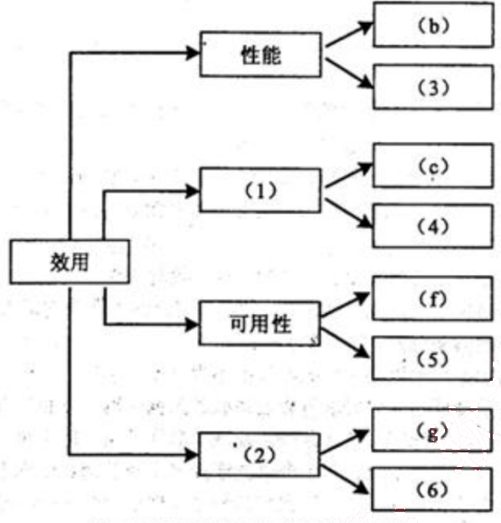
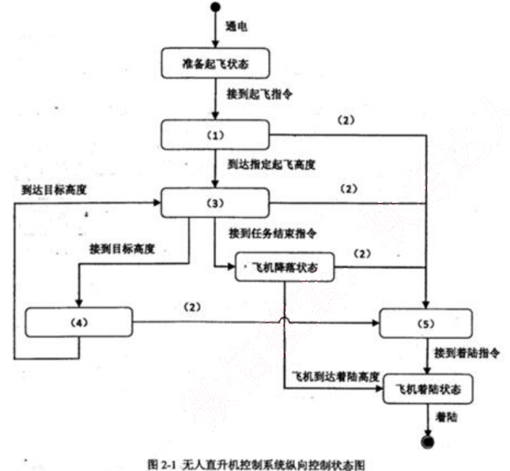
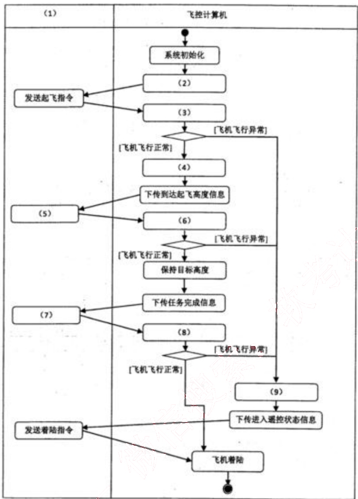
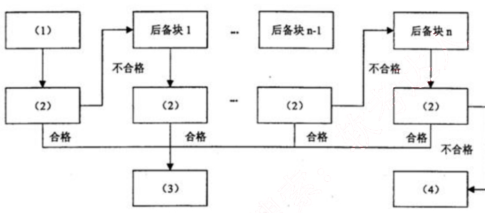

# 2015 年下半年 系统架构设计师 · 案例分析原卷（无答案）

>
> **来源**：本地购买扫描件《2015 年下半年 系统架构设计师 案例分析》（原卷，题干与参考答案分离）
> **来源类型**：`real`
> **解析方式**：byted-las-document-parse（normal 模式）+ 机械清洗，已剔除页眉、广告条与页码
> **答案与解析**：原卷不含参考答案；作答后请对照同考期的研读版文件评分
> **使用范围**：经典选题，仅保留原题号 一、二、三；不作为完整年份模考。筛选依据见 [历史题复核](../HISTORICAL_CURATION.md)。

## 试题一
> **题型**：案例 01 · 架构评估（ATAM）

【说明】

某软件公司拟为某市级公安机关开发一套特种车辆管理与监控系统，以提高特种车辆管理的效率和准确性。在系统需求分析与架构设计阶段，用户提出的部分需求和关键质量属性场景如下：

(a) 系统用户分为管理员、分管领导和普通民警等三类；
(b) 正常负载情况下，系统必须在 0.5 秒内对用户的车辆查询请求进行响应；
(c) 系统能够抵御 99.999%的黑客攻击；
(d) 系统的用户名必须以字母开头，长度不少于 5 个字符；
(e) 对查询请求处理时间的要求将影响系统的数据传输协议和处理过程的设计；
(f) 网络失效后，系统需要在 2 分钟内发现并启用备用网络系统；
(g) 在系统升级时，需要保证在 1 个月内添加一个新的消息处理中间件；
(h) 查询过程中涉及到的车辆实时视频传输必须保证 20 帧/秒的速率，且画面具有 600*480的分辨率；
(i) 更改系统加密的级别将对安全性和性能产生影响；
(j) 系统主站点断电后，需要在 3 秒内将请求重定向到备用站点；
(k) 假设每秒中用户查询请求的数量是 10 个，处理请求的时间为 30 毫秒，则“在 1 秒内完成用户的查询请求”这一要求是可以实现的；
(l) 对用户信息数据的授权访问必须保证 99.999%的安全性；
(m) 目前对“车辆信息实时监控”业务逻辑的描述尚未达成共识，这可能导致部分业务功能模块的重复，影响系统的可修改性；
(n) 更改系统的 Web 界面接口必须在 1 周内完成；
(o) 系统需要提供远程调试接口，并支持系统的远程调试。

在对系统需求和质量属性场景进行分析的基础上，系统的架构师给出了三个候选的架构设计方案。公司目前正在组织系统开发的相关人员对系统架构进行评估。

### 【问题1】

在架构评估过程中，质量属性效用树（utility tree）是对系统质量属性进行识别和优

先级排序的重要工具。请给出合适的质量属性，填入图 1-1 中 (1)、(2) 空白处；并选择题干描述中的(a)～(o)，将恰当的序号填入(3)～(6)空白处，完成该系统的效用树。

图1-1 特种车辆管理与监控系统效用树

### 【问题2】

在架构评估过程中；需要正确识别系统的架构风险、敏感点和权衡点，并进行合理的架构决策。请用 300 字以内的文字给出系统架构风险、敏感点和权衡点的定义，并从题干描述中的(a)～(o)各选出 1 个属于系统架构风险、敏感点和权衡点的描述。

## 试题二
> **题型**：案例 04 · UML 建模与分析

### 【说明】
某公司拟研制一款高空监视无人直升机，该无人机采用遥控—自主复合型控制实现垂直升降。该直升机飞行控制系统由机上部分和地面部分组成，机上部分主要包括无线电传输设备、飞控计算机、导航设备等，地面部分包括遥控操纵设备、无线电传输设备以及地面综合控制计算机等。其主要工作原理是地面综合控制计算机负责发送相应指令，飞控计算机按照预定程序实现相应功能。经过需求分析，对该无人直升机控制系统纵向控制基本功能整理如下：

(a) 飞控计算机加电后，应完成系统初始化，飞机进入准备起飞状态；
(b) 在准备起飞状态中等待地面综合控制计算机发送起飞指令，飞控计算机接收到起飞指令后，进入垂直起飞状态；
(c) 垂直起飞过程中如果飞控计算机发现飞机飞行异常，飞行控制系统应转入无线电遥控飞行状态，地面综合控制计算机发送遥控指令；
(d) 垂直起飞达到预定起飞高度后，飞机应进入高度保持状态；
(e) 飞控计算机在收到地面综合控制计算机发送的目标高度后，飞机应进入垂直升降状态，接近目标高度；垂直升降过程中出现飞机飞行异常，控制系统应转入无线电遥控飞行；
(f) 飞机到达目标高度后，应进入高度保持状态，完成相应的任务；
(g) 飞机在接到地面综合控制计算机发送的任务执行结束指令后，进入飞机降落状态；
(h) 飞机降落过程中如果出现飞机飞行异常，控制系统应转入无线电遥控飞行；
(i) 飞机降落到指定着陆高度后，进入飞机着陆状态，应按照预定着陆算法，进行着陆；
(j) 无线电遥控飞行中，地面综合控制计算机发送着陆指令，飞机进入着陆状态，应按照预定着陆算法，进行着陆。

### 【问题 1】
状态图和活动图是软件系统设计建模中常用的两种手段，请用 200 字以内文字简要说明状态图和活动图的含义及其区别。

### 【问题2】

根据题干中描述的基本功能需求，架构师王工通过对需求的分析和总结给出了无人直升机控制系统纵向控制状态图(图2-1)。请根据题干描述，提炼出相应状态及条件，并完善图2-1所示状态图中的(1)～(5)，将答案填写在答题纸中。

图2-1 无人直升机控制系统纵向控制状态图

### 【问题3】

根据题目中描述的基本功能需求，架构师王工给出了无人直升机控制系统纵向控制的顶层活动图（图2-2）。请根据题干描述，完善图2-2活动图的（1）-（9），将答案填写在答题纸中。

图2-2 无人直升机控制系统纵向控制顶层活动图

## 试题三
> **题型**：案例 13 · 可靠性与容错设计

某宇航公司长期从事宇航装备的研制工作，嵌入式系统的可靠性分析与设计已成为该公司产品研制中的核心工作，随着宇航装备的综合化技术发展，嵌入式软件规模发生了巨大变化，代码规模已从原来的几十万扩展到上百万，从而带来了由于软件失效而引起系统可靠性降低的隐患。公司领导非常重视软件可靠性工作，决定抽调王工程师等5人组建可靠性研究团队，专门研究提高本公司宇航装备的系统可靠性和软件可靠性问题，并要求在三个月内，给出本公司在系统和软件设计方面如何考虑可靠性设计的方法和规范。可靠性研究团队很快拿出了系统及硬件的可靠性提高方案，但对于软件可靠性问题始终没有研究出一种普遍认同的方法。

### 【问题1】

请用 200 字以内文字说明系统可靠性的定义及包含的 4 个子特性，并简要指出提高系统可靠性一般采用哪些技术？

### 【问题2】

王工带领的可靠性研究团队之所以没能快速取得软件可靠性问题的技术突破，其核心原因是他们没有搞懂高可靠性软件应具备的特点。软件可靠性一般致力于系统性地减少和消除对软件程序性能有不利影响的系统故障。除非被修改，否则软件系统不会随着时间的推移而发生退化。请根据你对软件可靠性的理解，给出表3-1所列出的硬件可靠性特征对应的软件可靠性特征之间的差异或相似之处，将答案写在答题纸上。

表3-1 硬件和软件可靠性对比

<table>
  <tr>
    <th>序号</th>
    <th>硬件可靠性</th>
    <th>软件可靠性</th>
  </tr>
  <tr>
    <td>1</td>
    <td>失效率服从浴缸曲线。老化状态类似于软件调试状态</td>
    <td>（1）</td>
  </tr>
  <tr>
    <td>2</td>
    <td>即使不适用，材料劣化也会导致失效</td>
    <td>（2）</td>
  </tr>
  <tr>
    <td>3</td>
    <td>硬件维修会恢复原始状态</td>
    <td>（3）</td>
  </tr>
  <tr>
    <td>4</td>
    <td>硬件失效之前会有报警</td>
    <td>（4）</td>
  </tr>
</table>

### 【问题3】

王工带领的可靠性研究团队在分析了大量相关资料基础上，提出软件的质量和可靠性必须在开发过程构建到软件中，也就是说，为了提高软件的可靠性，必须在需求分析、设计阶段开展软件可靠性筹划和设计。研究团队针对本公司承担的飞行控制系统制定出一套飞控

软件的可靠性设计要求。飞行控制系统是一种双余度同构型系统，输入采用了独立的两路数据通道，在系统内完成输入数据的交叉对比、表决、制导率计算，输出数据的交叉对比、表决、一输出等功能，系统的监控模块实现对系统失效或失步的检测与宠位。其软件的可靠性设计包括恢复块方法和N版本程序设计方法。请根据恢复块方法工作原理完成图3-1，在(1)～(4)中填入恰当的内容。并比较恢复块方法与N版本程序设计方法，将比较结果(5)～(8)填入表3-2中。

图3-1 恢复块方法

表3-2 恢复块方法与N版本程序设计的比较
<table>
  <tr>
    <th></th>
    <th>恢复块方法</th>
    <th>N版本程序设计</th>
  </tr>
  <tr>
    <td>硬件运行环境</td>
    <td>单机</td>
    <td>多机</td>
  </tr>
  <tr>
    <td>错误检测方法</td>
    <td>验证测试程序</td>
    <td>(5)</td>
  </tr>
  <tr>
    <td>恢复策略</td>
    <td>(6)</td>
    <td>向前恢复</td>
  </tr>
  <tr>
    <td>实时性</td>
    <td>(7)</td>
    <td>(8)</td>
  </tr>
</table>
