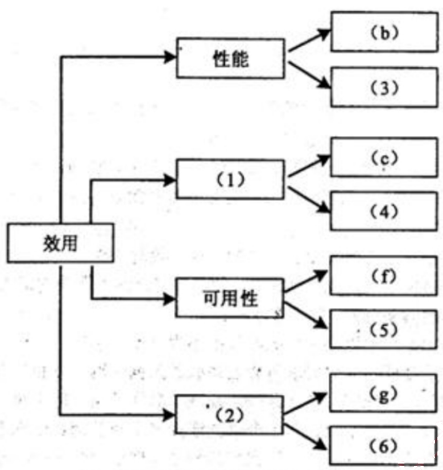
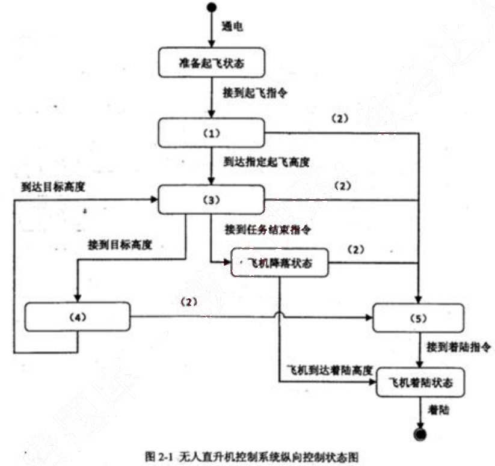
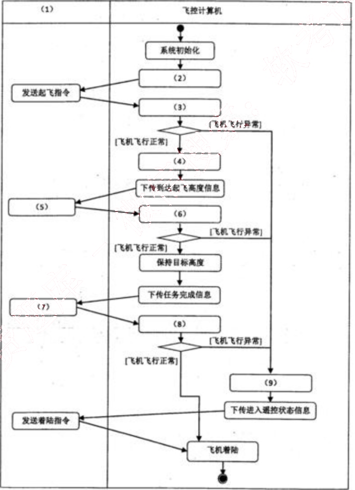
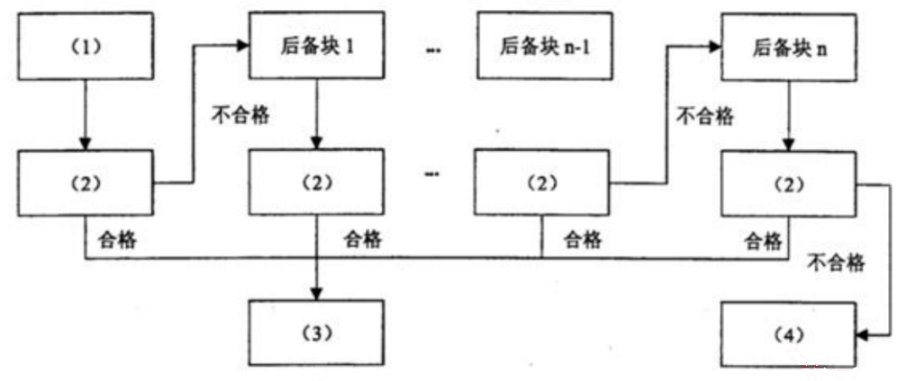

# 2015 年下半年 系统架构设计师 · 案例分析真题

> 试题一必答 + 试题二至五选答 2 道；含参考答案
>
> **来源**：本地购买扫描件《2015 年下半年系统架构设计师 答案详解》（贡献者已购买并授权转录）
> **来源类型**：`real`
> **解析方式**：byted-las-document-parse（normal 模式）+ 机械清洗，已剔除页眉、广告条与页码
> **答案与解析**：取自随卷答案详解，非本仓库编写
> **使用建议**：可用于章节训练与年份模考；关键数字建议对照原始 PDF 复核
> **完整性**：综合知识 75 题、案例分析 5 题、论文 4 题齐备

## 试题一

【说明】

某软件公司拟为某市级公安机关开发一套特种车辆管理与监控系统，以提高特种车辆管理的效率和准确性。在系统需求分析与架构设计阶段，用户提出的部分需求和关键质量属性场景如下：

(a) 系统用户分为管理员、分管领导和普通民警等三类；
(b) 正常负载情况下，系统必须在 0.5 秒内对用户的车辆查询请求进行响应；
(c) 系统能够抵御 99.999%的黑客攻击；
(d) 系统的用户名必须以字母开头，长度不少于 5 个字符；
(e) 对查询请求处理时间的要求将影响系统的数据传输协议和处理过程的设计；
(f) 网络失效后，系统需要在 2 分钟内发现并启用备用网络系统；
(g) 在系统升级时，需要保证在 1 个月内添加一个新的消息处理中间件；
(h) 查询过程中涉及到的车辆实时视频传输必须保证 20 帧/秒的速率，且画面具有 600*480的分辨率；
(i) 更改系统加密的级别将对安全性和性能产生影响；
(j) 系统主站点断电后，需要在 3 秒内将请求重定向到备用站点；
(k) 假设每秒中用户查询请求的数量是 10 个，处理请求的时间为 30 毫秒，则“在 1 秒内完成用户的查询请求”这一要求是可以实现的；
(l) 对用户信息数据的授权访问必须保证 99.999%的安全性；
(m) 目前对“车辆信息实时监控”业务逻辑的描述尚未达成共识，这可能导致部分业务功能模块的重复，影响系统的可修改性；
(n) 更改系统的 Web 界面接口必须在 1 周内完成；
(o) 系统需要提供远程调试接口，并支持系统的远程调试。

在对系统需求和质量属性场景进行分析的基础上，系统的架构师给出了三个候选的架构设计方案。公司目前正在组织系统开发的相关人员对系统架构进行评估。

### 【问题1】

在架构评估过程中，质量属性效用树（utility tree）是对系统质量属性进行识别和优先级排序的重要工具。请给出合适的质量属性，填入图 1-1 中 (1)、(2) 空白处；并选择题干描述中的 (a)～(o)，将恰当的序号填入 (3)～(6) 空白处，完成该系统的效用树。

图 1-1 特种车辆管理与监控系统效用树

<table>
  <tr>
    <td>编号</td>
    <td>答案</td>
  </tr>
  <tr>
    <td>(1)</td>
    <td>安全性</td>
  </tr>
  <tr>
    <td>(2)</td>
    <td>可修改性</td>
  </tr>
  <tr>
    <td>(3)</td>
    <td>(h)</td>
  </tr>
  <tr>
    <td>(4)</td>
    <td>(i)</td>
  </tr>
  <tr>
    <td>(5)</td>
    <td>(j)</td>
  </tr>
  <tr>
    <td>(6)</td>
    <td>(n)</td>
  </tr>
</table>

本题主要考查考生对于软件质量属性的理解、掌握和应用。在解答该问题时，应认真阅读题干中给出的场景与需求描述，分析该需求描述了何种质量属性，根据质量属性描述对其归类，并需要理解架构风险、敏感点和权衡点这些概念。

质量属性效用树是对质量属性进行分类、权衡、分析的架构分析工具，主要关注系统的性能、可用性、可修改性和安全性四个方面。根据对相关质量属性的定义和含义， 其中 “正常负载情况下，系统必须在 0.5 秒内对用户的车辆查询请求进行响应” 和 “查询过程中涉及到的车辆实时视频传输必须保证画面具有 $600 \times 480$ 的分辨率，20 帧/秒的速率”，这描述的是系统的性能属性；“网络失效后，系统需要在 2 分钟内发现错误并启用备用系统” 和 “系统主站点断电后，需要在 3 秒内将请求重定向到备用站点描述的则是系统的可用性；“在系统升级时，需要保证在 20 人月内添加一个新的消息处理中间件” 和 “更改系统的 Web 界面接口必须在 4 人周内完成” 描述的是系统的可修改性；“车辆信息查询功能必须保证 99.999%的安全性” 和 “用户信息数据库授权必须保证 99.999%可用” 描述的是系统的安全性。

### 【问题2】

在架构评估过程中；需要正确识别系统的架构风险、敏感点和权衡点，并进行合理的架构决策。请用300字以内的文字给出系统架构风险、敏感点和权衡点的定义，并从题干描述中的(a)～(o)各选出1个属于系统架构风险、敏感点和权衡点的描述。

系统架构风险是指架构设计中潜在的、存在问题的架构决策所带来的隐患。

敏感点是指为了实现某种特定的质量属性，一个或多个系统组件所具有的特性。权衡点是指影响多个质量属性，并对多个质量属性来说都是敏感点的系统属性。题干描述中，(m)描述的是系统架构风险；(e)描述的是敏感点；(i)描述的是权衡点。

系统的架构风险、敏感点和权衡点是对质量属性效用树进行分析的主要依据，根据相关概念，题干中“对查询请求处理时间的要求将影响系统的数据传输协议和处理过程的设计”描述的是敏感点；“目前对‘车辆信息实时监控’业务逻辑的描述尚未达成共识，这可能导致部分业务功能模块的重复，影响系统的可修改性”描述的是系统的架构风险；“更改系统加密的级别将对安全性和性能产生影响”描述的是权衡点。
*（原图含机构广告或水印，已移除）*

## 试题二

【说明】
某公司拟研制一款高空监视无人直升机，该无人机采用遥控—自主复合型控制实现垂直升降。该直升机飞行控制系统由机上部分和地面部分组成，机上部分主要包括无线电传输设备、飞控计算机、导航设备等，地面部分包括遥控操纵设备、无线电传输设备以及地面综合控制计算机等。其主要工作原理是地面综合控制计算机负责发送相应指令，飞控计算机按照预定程序实现相应功能。经过需求分析，对该无人直升机控制系统纵向控制基本功能整理如下：

(a) 飞控计算机加电后，应完成系统初始化，飞机进入准备起飞状态；
(b) 在准备起飞状态中等待地面综合控制计算机发送起飞指令，飞控计算机接收到起飞指令后，进入垂直起飞状态；
(c) 垂直起飞过程中如果飞控计算机发现飞机飞行异常，飞行控制系统应转入无线电遥控飞行状态，地面综合控制计算机发送遥控指令；
(d) 垂直起飞达到预定起飞高度后，飞机应进入高度保持状态；
(e) 飞控计算机在收到地面综合控制计算机发送的目标高度后，飞机应进入垂直升降状态，接近目标高度；垂直升降过程中出现飞机飞行异常，控制系统应转入无线电遥控飞行；
(f) 飞机到达目标高度后，应进入高度保持状态，完成相应的任务；
(g) 飞机在接到地面综合控制计算机发送的任务执行结束指令后，进入飞机降落状态；
(h) 飞机降落过程中如果出现飞机飞行异常，控制系统应转入无线电遥控飞行；
(i) 飞机降落到指定着陆高度后，进入飞机着陆状态，应按照预定着陆算法，进行着陆；
(j) 无线电遥控飞行中，地面综合控制计算机发送着陆指令，飞机进入着陆状态，应按照预定着陆算法，进行着陆。

### 【问题1】

状态图和活动图是软件系统设计建模中常用的两种手段，请用200字以内文字简要说明状态图和活动图的含义及其区别。

状态图主要用于描述一个对象在其生存期间的动态行为，表现一个对象所经历的状态序列，引起状态转移的事件（event），以及因状态转移而伴随的动作（action）。

活动图可以用于描述系统的工作流程和并发行为。活动图其实可看作状态图的特殊形式，活动图中一个活动结束后将立即进入下一个活动（在状态图中状态的转移可能需要事件的触

发）。

两者最大的区别是：状态图侧重于描述行为的结果，而活动图侧重描述行为的动作。其次活动图可描述并发行为，而状态图不能。

### 【问题2】

根据题干中描述的基本功能需求，架构师王工通过对需求的分析和总结给出了无人直升机控制系统纵向控制状态图(图2-1)。请根据题干描述，提炼出相应状态及条件，并完善图2-1所示状态图中的(1)～(5)，将答案填写在答题纸中。

图2-1 无人直升机控制系统纵向控制状态图

(1) 垂直起飞状态
(2) 飞机飞行异常
(3) 高度保持状态
(4) 垂直升降状态
(5) 无线电遥控飞行状态。

本问题考查系统建模中状态图的设计与应用。考生应该在熟记基本概念的基础上结合实际问题灵活掌握并应用这些概念。

在解答本题时，首先需要对题目中描述的基本功能需求(a)～(j)进行分析与梳理，确定系统控制中的所有状态以及状态间的转换条件，再结合问题2中已经给出的状态，完成其余状态及条件的设计。

### 【问题3】

根据题目中描述的基本功能需求，架构师王工给出了无人直升机控制系统纵向控制的顶层活动图（图2-2）。请根据题干描述，完善图2-2活动图的（1）-（9），将答案填写在答题纸中。

图2-2 无人直升机控制系统纵向控制顶层活动图

（1）地面综合控制计算机
（2）下传起飞就绪信息

(3) 垂直起飞
(4) 高度保持
(5) 发送目标高度
(6) 垂直升降
(7) 发送任务结束指令
(8) 飞机降落
(9) 无线电遥控飞行

本问题考查系统建模中活动图的设计与应用。考生应该掌握泳道活动图的概念并且学会应用。泳道活动图，是将一个活动图中的活动状态进行分组，每一组表示一个特定的类或者对象，它们负责完成组内的活动。每个活动都明确属于一个泳道，不可以跨越泳道，而转移则可以跨越泳道。

在解答本题时，首先需要对题目中描述的基本功能需求进行分析与梳理，确定题目中存在哪些硬件设备与飞控计算机进行交互，以及设备间的交互关系，再结合问题3中已经给出的活动，完成其余活动及设备的设计。

## 试题三

某宇航公司长期从事宇航装备的研制工作，嵌入式系统的可靠性分析与设计已成为该公司产品研制中的核心工作，随着宇航装备的综合化技术发展，嵌入式软件规模发生了巨大变化，代码规模已从原来的几十万扩展到上百万，从而带来了由于软件失效而引起系统可靠性降低的隐患。公司领导非常重视软件可靠性工作，决定抽调王工程师等5人组建可靠性研究团队，专门研究提高本公司宇航装备的系统可靠性和软件可靠性问题，并要求在三个月内，给出本公司在系统和软件设计方面如何考虑可靠性设计的方法和规范。可靠性研究团队很快拿出了系统及硬件的可靠性提高方案，但对于软件可靠性问题始终没有研究出一种普遍认同的方法。

### 【问题1】

请用200 字以内文字说明系统可靠性的定义及包含的4个子特性，并简要指出提高系统可靠性一般采用哪些技术？

系统可靠性定义：系统在规定的时间内及规定的环境条件下，完成规定功能的能力，就是系统无故障运行的概率。

根据国家标准《软件工程产品质量 第1部分：质量模型》(GB/T16260.1—2006)的规定，系统可靠性包括：成熟性、容错性、易恢复性和可靠性的依从性4个子特性。

提高系统可靠性一般采用以下4类技术：
(1) 冗余技术；
(2) 软件容错技术；
(3) 双机容错技术；
(4) 集群技术。

本题主要考查考生对软件可靠性设计知识的掌握程度。本题首先系统可靠性定义，并了解考生是否分辨出系统可靠性的4个主要子特性；其次，考查对软件可靠性与硬件可靠性的差别，了解软件可靠性的主要特征；最后，通过填空回答宇航设备中飞行控制系统中为提高可靠性所采用的恢复块方法的具体设计实现。此类题目要求考生认真阅读题目对问题的描述，通过自己对软件可靠性和嵌入式系统的知识掌握程度，采用总结、概括和分析等的方式，可从问题描述中发现问题的相关性，正确回答问题。

可靠性的定义在不同书籍中给出解释各不相同，但是，比较公认的定义是：系统可靠性

是指系统在规定的时间内及规定的环境条件下，完成规定功能的能力，就是系统无故障运行的概率。通常系统可靠性可分为硬件可靠性和软件可靠性，软件可靠性是近年来国内外研究的重点。

国家标准《软件工程产品质量 第1部分：质量模型》(GB/T16260.1—2006)中给出了系统可靠性的4个主要子特性：

成熟性：成熟性是指系统避免因错误的发生而导致失效的能力；

容错性：容错性是指在系统发生故障或违反指定接口的情况下，系统维持规定的性能级别的能力；

易恢复性：易恢复性是指系统发生失效的情况下，重建规定的性能级别并恢复受直接影响的数据的能力；

依从性：可靠性的依从性是指系统依附于与可靠性相关的标准、约定或规定的能力。

通常，提高系统可靠性采用冗余技术、软件容错技术、双机容错技术和集群技术等4类技术。

### 【问题2】

王工带领的可靠性研究团队之所以没能快速取得软件可靠性问题的技术突破，其核心原因是他们没有搞懂高可靠性软件应具备的特点。软件可靠性一般致力于系统性地减少和消除对软件程序性能有不利影响的系统故障。除非被修改，否则软件系统不会随着时间的推移而发生退化。请根据你对软件可靠性的理解，给出表3-1所列出的硬件可靠性特征对应的软件可靠性特征之间的差异或相似之处，将答案写在答题纸上。

表3-1 硬件和软件可靠性对比

<table>
  <tr>
    <th>序号</th>
    <th>硬件可靠性</th>
    <th>软件可靠性</th>
  </tr>
  <tr>
    <td>1</td>
    <td>失效率服从浴缸曲线。老化状态类似于软件调试状态</td>
    <td>（1）</td>
  </tr>
  <tr>
    <td>2</td>
    <td>即使不适用，材料劣化也会导致失效</td>
    <td>（2）</td>
  </tr>
  <tr>
    <td>3</td>
    <td>硬件维修会恢复原始状态</td>
    <td>（3）</td>
  </tr>
  <tr>
    <td>4</td>
    <td>硬件失效之前会有报警</td>
    <td>（4）</td>
  </tr>
</table>

(1) 不考虑软件演化的情况下，失效率在统计上是非增的

(2) 如果不使用该软件，永远不会发生失效

(3) 软件维护会创建新的软件代码

(4) 软件失效之前很少会有警告

本问题主要要求考生在理解软件的特殊性基础上，深刻认识软件可靠性一般是致力于系

统性地减少和消除对软件程序性能有不利影响的系统故障。除非被修改，否则软件系统不会随着时间的推移而发生退化。在掌握这一特征的基础上，可以回答硬件可靠性特征与其对应的软件可靠性特征之间的差异或相似之处。

(1) 从硬件角度分析，由于硬件一旦生产完成，其可靠性指标将会随着使用时间延长而逐步老化，从而带来可靠性降低，即呈现失效率服从浴缸曲线；而软件不存在随时间延长而老化的现象，因此，在不考虑软件演化的情况下，失效率在统计上是非增的。

(2) 由于硬件是由多种电子器件组成，即使不使用，材料劣化也会导致失效；而软件就不同了，软件一旦调试完成，固化到设备中，在不考虑存储介质的老化因素的前提下，即使不使用该软件，软件也永远不会发生失效。

(3) 由于硬件存在可更换性，其硬件通过维修，可恢复原始状态；而对于软件而言，一旦需要维护，必然是存在需求更改、程序存在bug等现象，其维护必然会创建新的软件代码。

(4) 一般而言，硬件失效存在一个发展过程，在发生故障之前必然会有报警现象出现，而软件失效之前很少会有警告。

### 【问题3】

王工带领的可靠性研究团队在分析了大量相关资料基础上，提出软件的质量和可靠性必须在开发过程构建到软件中，也就是说，为了提高软件的可靠性，必须在需求分析、设计阶段开展软件可靠性筹划和设计。研究团队针对本公司承担的飞行控制系统制定出了一套飞控软件的可靠性设计要求。飞行控制系统是一种双余度同构型系统，输入采用了独立的两路数据通道，在系统内完成输入数据的交叉对比、表决‘制导率计算，输出数据的交叉对比、表决、一输出等功能，系统的监控模块实现对系统失效或失步的检测与宠位。其软件的可靠性设计包括恢复块方法和N版本程序设计方法。请根据恢复块方法工作原理完成图3-1，在(1)～(4)中填入恰当的内容。并比较恢复块方法与N版本程序设计方法，将比较结果(5)～(8)填入表3-2 中。

图3-1 恢复块方法

表3-2 恢复块方法与N版本程序设计的比较

<table>
  <tr>
    <td></td>
    <td>恢复块方法</td>
    <td>N版本程序设计</td>
  </tr>
  <tr>
    <td>硬件运行环境</td>
    <td>单机</td>
    <td>多机</td>
  </tr>
  <tr>
    <td>错误检测方法</td>
    <td>验证测试程序</td>
    <td>(5)</td>
  </tr>
  <tr>
    <td>恢复策略</td>
    <td>(6)</td>
    <td>向前恢复</td>
  </tr>
  <tr>
    <td>实时性</td>
    <td>(7)</td>
    <td>(8)</td>
  </tr>
</table>

1. 恢复块方法：
(1) 主块
(2) 验证测试
(3) 输出正确结果
(4) 异常处理

2. 恢复块方法与N版本程序设计的比较
(5) 表决
(6) 反向恢复
(7) 差
(8) 好

软件的可靠性设计主要包括了恢复块和N版本程序设计两种方法，如果考生对这两种方法有所了解，则可很容易地进行判断。

恢复块方法是一种反向恢复的方法，其核心原理是：对于可靠性要求高的软件，在程序运行的某时刻，将数据或程序进行备份，一旦发现主程序块有异常发生时，可将已备份的数

据或程序进行恢复，保证程序的正确性。基于这样的原理，显然(1)空处是主块，而(2)空处将是对正确性进行检验测试判断，一旦判断正确，(3)空处将是“输出正确结果”，以此类推，显然(4)空处是进入“异常处理”了。

如果考生能够答对第一问，说明考生已掌握恢复块与N版本两种方法，那么，填写第二问的空应该没问题的。在表3-2已经给出了两种方法适应的硬件环境，也就是说：恢复块方法的使用必然是单机环境，而N版本方法必然要使用多机环境。理解了环境需求，那么多机余度工作方式，必然采用“表决”（(5)空）方式进行容错；同时不难分析出N版本的工作原理是向前恢复，恢复快则是反向恢复（(6)空）；由于恢复快方法是反复寻找正确的备份块，而N版本方法则是多个机器同时计算同样内容，表决完后即可给出正确结果，这样，恢复快方法相比N版本方法显然实时性差（(7)空），而N版本方法显然好（(8)空）于恢复快方法。

*（原图含机构广告或水印，已移除）*

## 试题四

## 【说明】
某软件公司拟开发一套贸易综合管理系统，包括客户关系管理子系统和商品信息管理子系统两部分。客户关系管理子系统主要管理客户信息，并根据贸易业务需要频繁向客户发送相关的电子邮件、短信等提醒信息。商品信息管理子系统主要为客户提供商品信息在线查询功能，包括商品基本信息、实时库存与价格等。

在对系统进行数据架构设计时，公司项目组的架构师王工主张采用文件系统进行数据管理，原因是目前公司客户和商品数量不大，且系统功能较为简单，采用文件系统进行数据管理简单直观，开发周期短。架构师李工则建议采用关系数据库进行数据管理，原因在于公司目前正处在高速扩张期，虽然目前的客户和商品数量不大，但随着公司快速发展，需要管理的数据必然飞速膨胀，采用关系数据库作为数据存储层，系统的扩展性更强，并能够对未来可能增加的复杂业务提供有效支持。经过讨论，项目组初步采纳了李工的意见，决定采用关系数据库存储客户数据，并针对业务特征对系统性能进行优化。

## 【问题 1】
请从设计难度、数据冗余程度、数据架构、应用扩展性等 4 个方面对关系型数据库管理系统和文件系统两种数据存储方式进行比较，填写表 4-1 中 (1)～(4)。

表4-1 关系型数据库管理系统和文件系统存储方式比较
<table>
  <tr>
    <th></th>
    <th>设计难度</th>
    <th>数据冗余程度</th>
    <th>数据架构</th>
    <th>应用扩展性</th>
  </tr>
  <tr>
    <td>关系型数据库</td>
    <td>(1)</td>
    <td>遵守数据库范式，数据冗余较少</td>
    <td>以数据库为中心组织、管理数据</td>
    <td>(4)</td>
  </tr>
  <tr>
    <td>文件系统</td>
    <td>针对特定应用系统设计，难度较小</td>
    <td>(2)</td>
    <td>(3)</td>
    <td>符合特定应用系统要求的文件数据很难在不同的应用系统之间共享</td>
  </tr>
</table>

(1) 数据结构需要符合关系模式，设计难度较大
(2) 可能在多个文件中复制相同的数据属性，数据冗余较大
(3) 以应用系统为中心组织、管理数据
(4) 数据独立于应用系统，很容易在不同的应用系统之间共享数据

本题考查文件系统、关系型数据库、内存型数据库的主要特点。

此类题目要求考生认真阅读题目对现实问题的描述，依据系统的核心业务需求的特点（数据模型、读写性能、存储容量、可靠性），正确选取不同的数据存储架构。并能够根据业务

务的具体情况分析影响数据库查询的主要原因。

影响数据存储方式的主要考虑因素包括：设计难度、数据冗余程度、数据架构、应用扩展性；

文件系统具有以下特点：
- 针对特定应用系统设计，难度较小；
- 数据冗余较大，可能在多个文件中复制相同的数据属性；
- 以应用系统为中心组织、管理数据；
- 符合特定应用系统要求的文件数据很难在不同的应用系统之间共享。

关系型数据库具有以下特点。
- 数据结构需要符合关系模式，设计难度较大；
- 遵守数据库范式，数据冗余较少；
- 以数据库为中心组织、管理数据；
- 数据独立于应用系统，很容易在不同的应用系统之间共享数据。

### 【问题2】

对系统的核心业务需求进行认真分析后，公司的资深架构师张工提出一种内存数据库和关系数据库的混合存储架构，其核心思想是将需要频繁读写的数据存入内存数据库，而将相对固定不变的数据存入关系数据库。请首先分析比较内存数据库和关系数据库在数据模型、读写性能、存储容量、可靠性等方面的差异，填写表4-2中(1)～(4)的空白，并根据张工的思路指定各种业务数据的存储方式，填写表4-3中(5)～(9)中的空白。

表4-2 内存数据库和关系数据库比较

<table>
  <tr>
    <th></th>
    <th>主要数据模型</th>
    <th>读写性能</th>
    <th>存储容量</th>
    <th>可靠性</th>
  </tr>
  <tr>
    <td>内存数据库</td>
    <td>(1)</td>
    <td>内存直接读写，性能相对较高</td>
    <td>(3)</td>
    <td>(4)</td>
  </tr>
  <tr>
    <td>关系数据库</td>
    <td>关系模式</td>
    <td>(2)</td>
    <td>基于磁盘存储，存储容量大</td>
    <td>内建恢复机制，可靠性较高</td>
  </tr>
</table>

表4-3 业务数据存储方式

<table>
  <tr>
    <th>业务数据</th>
    <th>存储方式</th>
  </tr>
  <tr>
    <td>客户基本信息</td>
    <td>关系数据库</td>
  </tr>
  <tr>
    <td>客户电子邮件</td>
    <td>(5)</td>
  </tr>
  <tr>
    <td>客户联系电话</td>
    <td>(6)</td>
  </tr>
  <tr>
    <td>商品基本信息</td>
    <td>(7)</td>
  </tr>
  <tr>
    <td>商品库存信息</td>
    <td>(8)</td>
  </tr>
  <tr>
    <td>商品价格信息</td>
    <td>(9)</td>
  </tr>
</table>

(1) Key-Value 模式(键-值对模式)

(2) 外存读写，性能相对较低

(3) 基于内存存储， 存储容量受限

(4) 恢复机制复杂， 可靠性较低

(5) 内存数据库

(6) 内存数据库

(7) 关系数据库

(8) 内存数据库

(9) 内存数据库

内存数据库型数据库是将数据放在内存中直接操作的数据库，使用内存型数据库将极大地提高应用的性能，同时通过数据缓存、快速算法、并行操作等的改进，使内存型数据库相对于传统的关系型数据库数据处理性能提高10倍以上，同时内存型数据库的应用受到内存大小，数据恢复要求的限制。

关系型数据库和内存数据的主要特点如下：

<table>
  <thead>
    <tr>
      <th></th>
      <th>主要数据模型</th>
      <th>读写性能</th>
      <th>存储容量</th>
      <th>可靠性</th>
    </tr>
  </thead>
  <tbody>
    <tr>
      <td>内存数据库</td>
      <td>Key-Value模式(键-值对模式)</td>
      <td>内存直接读写，性能相对较高</td>
      <td>基于内存存储，存储容量受限</td>
      <td>恢复机制复杂，可靠性较低</td>
    </tr>
    <tr>
      <td>关系数据库</td>
      <td>关系模式</td>
      <td>外存读写，性能相对较低</td>
      <td>基于磁盘存储，存储容量大</td>
      <td>内建恢复机制，可靠性较高</td>
    </tr>
  </tbody>
</table>

根据贸易综合管理系统的需求描述，需要频繁向客户发送相关的电子邮件、短信等提醒信息，并实时更新商品库存信息和商品价格信息，因此混合存储架构中，将客户电子邮件、客户联系电话、商品库存信息、商品价格信息等数据存入内存数据库；客户基本信息，商品基本信息相对稳定、访问频率较低，存入关系型数据库。

### 【问题3】

系统开发完成进行压力测试时，发现在较大数据量的情况下，部分业务查询响应时间过长，经过分析发现其主要原因是部分SQL查询语句效率低下。请判断表4-4中的SQL语句设计策略哪些可能会提升查询效率，哪些可能会降低查询效率，在(1)~(4)中填入“提升”或“降低”。

表4-4 SQL设计策略对性能的影响

<table>
  <thead>
    <tr>
      <th>SQL语句设计策略</th>
      <th>查询性能影响情况</th>
    </tr>
  </thead>
  <tbody>
    <tr>
      <td>查询时不要返回不需要的行、列</td>
      <td>(1)</td>
    </tr>
    <tr>
      <td>需要进行多表连接查询时，尽量采用子查询结构</td>
      <td>(2)</td>
    </tr>
    <tr>
      <td>尽量采用NOT IN、NOT EXIST、LIKE等操作</td>
      <td>(3)</td>
    </tr>
    <tr>
      <td>尽量避免使用DISTINCT关键字</td>
      <td>(4)</td>
    </tr>
  </tbody>
</table>

(1) 提升
(2) 降低
(3) 降低
(4) 提升

SQL语句设计时，影响查询效率的设计原则是：
- 查询时尽量不要返回不需要的行、列；
- 需要进行多表连接查询时，尽量使用连接查询，避免使用子查询结构；
- 尽量避免采用NOTIN、NOTEXIST、LIKE等使用全表查询的操作；
- 尽量避免使用DISTINCT关键字。

## 试题五

【说明】

某信息技术公司计划开发一套在线投票系统，用于为市场调研、信息调查和销售反馈等业务提供服务。该系统计划通过大量宣传和奖品鼓励的方式快速积累用户，当用户规模扩大到一定程度时，开始联系相关企业提供信息服务，并按照信息服务种类和用户投票数量收取费用。

为了降低开发成本和提高开发效率，项目组经过讨论后决定采用轻量级Java EE开发框架设计系统应用架构。在应用架构设计中，除了满足系统主要功能需求，还需要考虑的因素包括：
(1) 项目开发采用MySQL数据库存储数据，一但将来可能移植到其它数据库平台；
(2) 系统开发过程中尽可能降低或者消除SQL语句开发的工作量；
(3) 投票系统中数据之间的关系复杂，需要支持数据对象的聚合和继承等关系。

项目组基于MVC模式设计出了投票系统的架构，包括表示层、业务逻辑层、数据持久层和数据层。在具体讨论数据持久层采用哪种技术方案时，老王建议采用成熟的Hibernate框架，小李则认为iBatis更加灵活，更适合作为投票系统数据持久层开发技术。

### 【问题1】

请用300以内文字说明什么是数据持久层，使用数据持久层能够为项目开发带来哪些好处？

数据持久层是根据分层思想，通过建立逻辑数据操作接口，采取一定的对象/关系映射策略，隐藏数据库访问代码细节，向业务开发人员提供透明的对象持久化操作机制。能够为项目开发带来的好处：
(1) 分离业务逻辑层和数据层，降低两者之间的耦合；
(2) 通过对象/关系映射向业务逻辑提供面向对象的数据访问；
(3) 简化数据层访问，隐藏数据库链接、数据读写命令和事务管理细节。

本题考查Web应用系统数据持久层设计相关知识。

此类题目要求考生了解轻量级JavaEE开发框架和常用的数据持久层技术，通过认真阅读题目对实际问题•的描述，能够根据在线投票系统架构设计中所考虑的因素，选择合适的数据持久层技术。主流的数据持久层技术按照其实现思路可以分为4类技术方案，包括基于

数据库连接 UDBC 封装)、命令转换 (SQL Mapping)、对象关系映射 (O/RMapping) 和数据持久化对象 (Entity Bean)，考生在实际应用中，不仅要掌握技术使用方法，更重要的是能够了解其基本原理，便于在实际应用架构设计中选择合适的技术。

本问题考查数据持久层的基本概念以及在实际应用中能够为项目开发带来的好处。数据持久层主要是根据分层思想，通过建立逻辑数据操作接口，采取一定的对象/关系映射策略，隐藏数据库访问代码细节，向业务开发人员提供透明的对象持久化操作机制。具体来说，数据持久层能够带来的好处能够在三层或者多层结构设计中分离业务逻辑层和数据层，解耦两者之间的直接关联；通过对象/关系映射，将面向业务逻辑的数据处理全部以对象形式暴露，将对对象的操作自动转换为基于关系模式的数据库访问操作；在复杂的数据访问操作中，能够利用数据持久层简化数据层的访问，隐藏数据库链接、数据读写命令和事务管理细节，有效提升系统开发效率。

### 【问题2】

针对在线投票系统的实际应用需求和要求，项目组应选用哪种技术实现数据持久层？请用 200 字以内文字说明其采用该技术的原因。

项目组应该采用 Hibernate 框架。
原因：
(1) Hibernate 支持多种不同类型数据库，满足项目组数据库移植需求；
(2) Hibernate 相对于 iBatis 减少了 SQL 语句开发的工作量；
(3) iBatis 生成的 PO 是扁平化的，无法像 Hibernate 一样支持对象的继承和聚合等立体化关系。

本问题考查考生对 Hibernate 和 iBatis 这两种持久层技术的掌握情况。Hibernate 和iBatis 是轻量级 hvaEE 框架中两种数据持久层技术，两者都是优秀的开源项目。iBatis 相对简单易学而且更灵活，但开发工作量较大，数据之间是关联关系；Hibernate 框架相对复杂，所生成的持久化对象能够表达面向对象中的继承和聚合等关系，开发工作量较小，Hibernate 使用更广泛更成熟，能够适应目前所有主流的关系型数据库。根据题目中所描述的考虑因素，系统需要满足数据库的可移植性、开发过程简单、支持对象间的复杂关系等需求，所以选择 Hibernate 作为数据持久层技术更为合适。

### 【问题3】

数据持久层是 Web 应用系统框架中重要的组成部分，主流的数据持久层技术分别基于不

同的技术方案，请在表5-1中（1）-（4）处分别根据（a）~（d）所列技术的方案类别填入其序号。

表5-1 数据持久层技术分类

<table>
<tr>
<td>技术方案</td>
<td>实现技术</td>
</tr>
<tr>
<td>JDBC 封装</td>
<td>(1)</td>
</tr>
<tr>
<td>SQL Mapping</td>
<td>(2)</td>
</tr>
<tr>
<td>O/R Mapping</td>
<td>(3)</td>
</tr>
<tr>
<td>Entity Bean</td>
<td>(4)</td>
</tr>
</table>

(a) BMP, CMP
(b) iBatis/MyBatis
(c) SprmgJdbcTemplate
(d) TopLink, JDO, Hibernate

(1) (c)
(2) (b)
(3) (d)
(4) (a)

本问题考查考生对数据持久层基本原理和技术方案的掌握情况。SpringJdbcTemplate 通过封装 JDBC 操作接口实现数据库访问操作，fflatis/MyBatis 是通过 SQL 映射将数据操作请求转换为数据库的 SQL 操作，Hibernate、JDO 和 TopLink 等技术都采用了对象关系映射的思想，j2EE 中的 BMP 和 CMP 及 EJB3.0 都是利用实体 Bean 对象完成数据访问操作。
