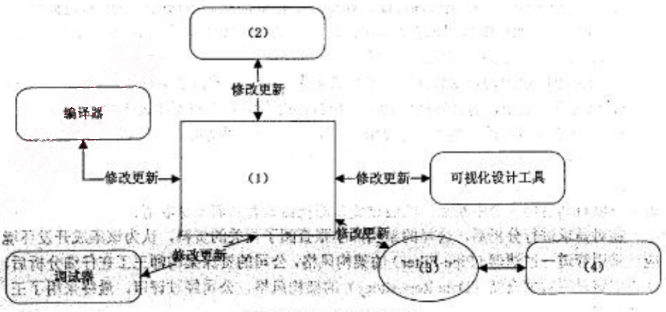
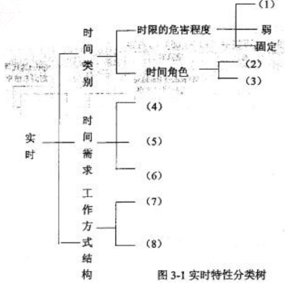
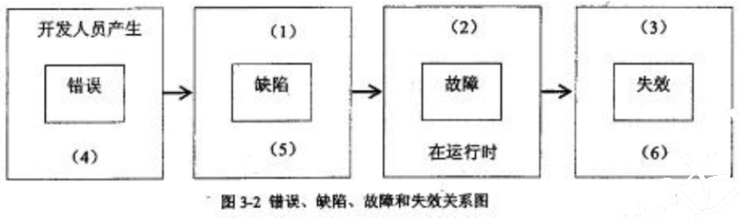
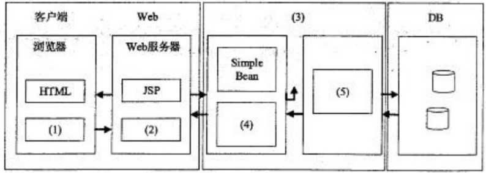
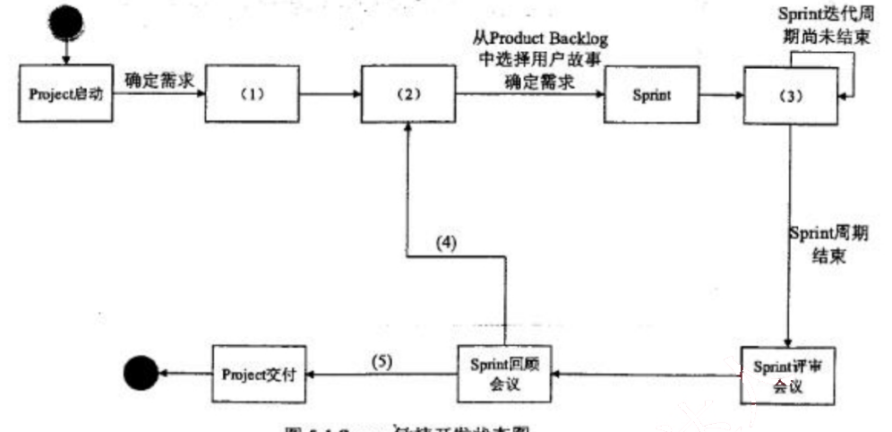
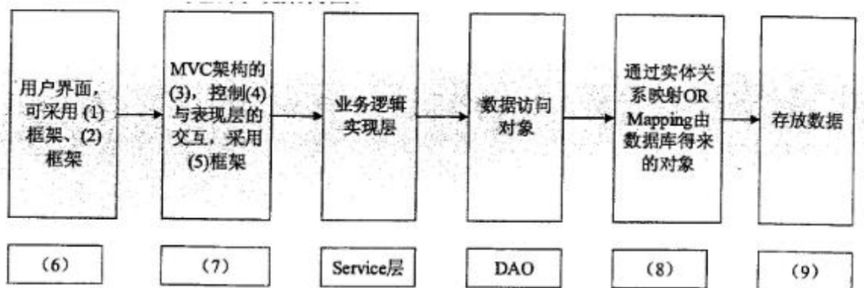

# 2016 年下半年 系统架构设计师 · 案例分析原卷（无答案）

> 题干与插图取自原卷；参考答案见同考期的研读版文件
>
> **来源**：本地购买扫描件《2016 年下半年 系统架构设计师 案例分析》（原卷，题干与参考答案分离）
> **来源类型**：`real`
> **解析方式**：byted-las-document-parse（normal 模式）+ 机械清洗，已剔除页眉、广告条与页码
> **答案与解析**：原卷不含参考答案；作答后请对照同考期的研读版文件评分
> **使用建议**：用于盲练：题干取自原卷，卷面本身无答案
> **完整性**：案例分析 5 题（原卷题干）

## 试题一
> **题型**：案例 01 · 架构评估（ATAM）

阅读以下关于软件架构设计的叙述，在答题纸上回答问题1至问题3 。

## 【说明】
某软件公司为某品牌手机厂商开发一套手机应用程序集成开发环境，以提高开发手机应用程序的质量和效率。在项目之初，公司的系统分析师对该集成开发环境的需求进行了调研和分析，具体描述如下：

a. 需要同时支持该厂商自行定义的应用编程语言的编辑、界面可视化设计、编译、调试等模块，这些模块产生的模型或数据格式差异较大，集成环境应提供数据集成能力。集成开发环境还要支持以适配方式集成公司现有的应用模拟器工具。

b. 经过调研，手机应用开发人员更倾向于使用 Windows 系统，因此集成开发环境的界面需要与Windows平台上的主流开发工具的界面风格保持一致。

c. 支持相关开发数据在云端存储，需要保证在云端存储数据的机密性和完整性。

d. 支持用户通过配置界面依据自己的喜好修改界面风格，包括颜色、布局、代码高亮方式等，配置完成后无需重启环境。

e. 支持不同模型的自动转换。在初始需求中定义的机器性能条件下，对于一个包含50个对象的设计模型，将其转换为相应代码框架时所消耗时间不超过5秒。

f. 能够连续运行的时间不小于240小时，意外退出后能够在10秒之内自动重启。

g. 集成开发环境具有模块化结构，支持以模块为单位进行调试、测试与发布。

h. 支持应用开发过程中的代码调试功能：开发人员可以设置断点，启动调试，编辑器可以自动卷屏并命中断点，能通过变量监视器查看当前变量取值。

在对需求进行分析后，公司的架构师小张查阅了相关的资料，认为该集成开发环境应该采用管道—过滤器(Pipe-Filter)的架构风格，公司的资深架构师王工在仔细分析后，认为应该采用数据仓储（Data Repository）的架构风格。公司经过评审，最终采用了王工的方案。

## 【问题1】（10分）
识别软件架构质量属性是进行架构设计的重要步骤。请分析题干中的需求描述，填写表1-1中(1)～(5)处的空白。

<table>
<caption>表1-1 质量属性识别表</caption>
<thead>
<tr>
<th>质量属性名称</th>
<th>需求描述编号</th>
</tr>
</thead>
<tbody>
<tr>
<td>可用性</td>
<td>(1)</td>
</tr>
<tr>
<td>(2)</td>
<td>e</td>
</tr>
<tr>
<td>可修改性</td>
<td>(3)</td>
</tr>
<tr>
<td>可测试性</td>
<td>(4)</td>
</tr>
<tr>
<td>安全性</td>
<td>c</td>
</tr>
<tr>
<td>易用性</td>
<td>(5)</td>
</tr>
</tbody>
</table>

### 【问题2】 （7分）

请在阅读题干需求描述的基础上，从交互方式、数据结构、控制结构和扩展方法4个方面对两种架构风格进行比较，填写表1-2 中(1)～(4)处的空白。

<table>
<caption>表1-2 两种架构的比较</caption>
<thead>
<tr>
<th>比较因素</th>
<th>管道-过滤器风格</th>
<th>数据仓储风格</th>
</tr>
</thead>
<tbody>
<tr>
<td>交互方式</td>
<td>顺序结构或有限的循环结构</td>
<td>(1)</td>
</tr>
<tr>
<td>数据结构</td>
<td>(2)</td>
<td>文件或模型</td>
</tr>
<tr>
<td>控制结构</td>
<td>(3)</td>
<td>业务功能驱动</td>
</tr>
<tr>
<td>扩展方法</td>
<td>接口适配</td>
<td>(4)</td>
</tr>
</tbody>
</table>

### 【问题3】 （8分）

在确定采用数据仓库架构风格后，王工给出了集成开发环境的架构图。请填写图1-1中(1)～(4)处的空白，完成该集成开发环境的架构图。

图1-1 集成开发环境架构图

从下列的 4 道试题（试题二至试题五）中任选 2 道解答。
如果解答的试题数超过 2 道，则题号小的 2 道解答有效。

## 试题二
> **题型**：案例 04 · UML 建模与分析

阅读以下关于软件系统建模的叙述，在答题纸上回答问题1至问题3。

【说明】
某软件公司计划开发一套教学管理系统，用于为高校提供教学管理服务。该教学管理系统基本的需求包括：
(1) 系统用户必须成功登录到系统后才能使用系统的各项功能服务；
(2) 管理员（Registrar）使用该系统管理学校（University）、系（Department）、教师（Lecturer）、学生（Student）和课程(Course)等教学基础信息；
(3) 学生使用系统选择并注册课程，必须通过所选课程的考试才能获得学分；如果考试不及格，必须参加补考，通过后才能获得课程学分；
(4) 教师使用该系统选择所要教的课程，并从系统获得选择该课程的学生名单；
(5) 管理员使用系统生成课程课表，维护系统所需的有关课程、学生和教师的信息；
(6) 每个月到了月底系统会通过打印机打印学生的考勤信息。

项目组经过分析和讨论，决定采用面向对象开发技术对系统各项需求建模。

### 【问题1】 （7分）

用例建模用来描述待开发系统的功能需求，主要元素是用例和参与者。请根据题目所述需求，说明教学服务系统中有哪些参与者。

### 【问题2】 （7分）

用例是对系统行为的动态描述，用例获取是需求分析阶段的主要任务之一。请指出在面向对象系统建模中，用例之间的关系有哪几种类型？对题目所述教学服务系统的需求建模时，“登录系统”用例与“注册课程”用例之间、“参加考试”用例与“参加补考”用例之间的关系分别属于哪种类型？

### 【问题3】 （11分）

类图主要用来描述系统的静态结构，是组件图和配置图的基础。请指出在面向对象系统

建模中，类之间的关系有哪几种类型？对题目所述教学服务系统的需求建模时，类University与类Student之间、类University和类Department之间、类Student和类Course之间的关系分别属于哪种类型？

## 试题三
> **题型**：案例 08 · 嵌入式 / 构件组装

阅读以下关于嵌入式实时系统设计的描述，回答问题1至问题3。

【说明】
嵌入式系统是当前航空、航天、船舶及工业、医疗等领域的核心技术，嵌入式系统可包括实时系统与非实时系统两种。某宇航公司长期从事航空航天飞行器电子设备的研制工作，随着业务的扩大，需要大量大学毕业生补充到科研生产部门。按照公司规定，大学毕业生必须进行相关基础知识培训，为此，公司经理安排王工对他们进行了长达一个月的培训。

### 【问题1】 （7分）

王工在培训中指出：嵌入式系统主要负责对设备的各种传感器进行管理与控制。而航空航天飞行器的电子设备由于对时间具有很强的敏感性，通常由嵌入式实时系统进行管控，请用300字以内文字说明什么是实时系统，实时系统有哪些主要特性。

### 【问题2】 （8分）

实时系统根据应用场景、时间特征以及工作方式的不同，存在多种实时特性，大致有三种分类方法，即时间类别、时间需求和工作方式结构。根据自己所掌握的“实时性”知识，将图3-1给出的实时特性按三种分类方式，填写图3-1中(1)～(8)处空白。

备选答案：时限的危害程度；时间角色；弱；时间响应；固定；时限/反应时间；时间明确；输入/输出激励；时间触发；强；周期/零星/非周期；事件触发。

### 【问题3】 （10分）

可靠性是实时系统的关键特性之一，区分软件的错误(Error)、缺陷（Defect）、故障(Fault)和失效(Failure)概念是软件可靠性设计工作的基础。请简要说明错误、缺陷、故障和失效的定义；并在图3-2中标出错误、缺陷和失效出现阶段，说明缺陷、故障和失效的表现形式，填写图3-2中(1)～(6)处的空白。

图3-2 错误、缺陷、故障和失效关系图

## 试题四
> **题型**：案例 11 · 架构演化与系统改造

阅读以下关于应用服务器的叙述，在答题纸上回答问题1至问题3。

【说明】
某电子产品制造公司，几年前开发建设了企业网站系统，实现了企业宣传、产品介绍、客服以及售后服务等基本功能。该网站技术上采用了Web服务器、动态脚本语言PHP。随着市场销售渠道变化以及企业业务的急剧拓展，该公司急需建立完善的电子商务平台。

公司张工建议对原有网站系统进行扩展，增加新的功能（包括订单系统、支付系统、库存管理等），这样有利于降低成本、快速上线；而王工则认为原有网站系统在技术上存在先天不足，不能满足企业业务的快速发展，尤其是企业业务将服务全球，需要提供24小时不间断服务，系统在大负荷和长时间运行下的稳定性至关重要。建议采用应用服务器的Web开发方法，例如J2EE，为该企业重新开发新的电子商务平台。

### 【问题1】 （7分）

王工认为原有网站在技术上存在先天不足，不能满足企业业务的快速发展，根据你的理解，请用300字以内的文字说明原系统存在哪几个方面的不足。

### 【问题2】 （8分）

请简要说明应用服务器的概念，并重点说明应用服务器如何来保障系统在大负荷和长时间运行下的稳定性以及可扩展性。

### 【问题3】 （10分）

J2EE平台采用了多层分布式应用程序模型，实现不同逻辑功能的应用程序被封装到不同的构件中，处于不同层次的构件可被分别部署到不同的机器中。请填写图4-1 中(1)～(5)处的空白，完成J2EE的N层体系结构。

图4-1 J2EE 的 N 层体系结构示意图

## 试题五
> **题型**：案例 12 · DevOps 部署与 CI/CD 设计

阅读以下关于Scrum敏捷开发过程的叙述，在答题纸上回答问题1至问题3。

## 【说明】
Scrum 是一个增量的、迭代的敏捷软件开发过程。某软件公司计划开发一个基于Web的Scrum项目管理系统，用于支持项目团队采用Scrum敏捷开发方法进行软件开发，辅助主管智能决策。此项目管理系统提供的主要服务包括项目团队的管理、敏捷开发过程管理和工件的管理。

Scrum 敏捷开发中，项目团队由Scrum主管、产品负责人和开发团队人员三种不同的角色组成，其开发过程由若干个Sprint（短的迭代周期，通常为2到4周）活动组成。

Product Backlog 是在Scrum过程初期产生的一个按照商业价值排序的需求列表，该列表条目的体现形式通常为用户故事。在每一个Sprint活动中，项目团队从Product Backlog中挑选最高优先级的用户故事进行开发。被挑选的用户故事在Sprint计划会议上经过细化分解为任务，同时初步估算每一个任务的预计完成时间，编写Sprint Backlog。

在Sprint活动期间，项目团队每天早晨需举行每日站立会议，重新估算剩余任务的预计完成时间，更新Sprint Backlog、Sprint燃尽图和Release燃尽图。在每个Sprint活动结束时，项目团队召开评审会议和回顾会议，交付产品增量，总结Sprint期间的工作情况和问题。此时，如果Product Backlog中还有未完成的用户故事，则项目团队将开始筹备下一个Sprint活动迭代。

为完成Scrum项目管理系统，考虑到系统的智能决策需求，公司决定使用MVC架构模式开发该项目管理系统。具体来说，系统采用轻量级J2EE架构和SSH框架进行开发，使用MySQL数据库作为底层存储。

## 【问题1】（10分）
Scrum项目管理软件需真实模拟Scrum敏捷开发流程，请根据你的理解完成图5-1给出的Scrum敏捷开发状态图，填写其中(1)～(5)的内容。

图5-1 Scrum敏捷开发状态图

### 【问题2】 （6分）

根据题干描述，本系统采用MVC架构模式，请从备选答案a~n中分别选出属于MVC架构模型中的模型（Model）、视图（View）和控制器（Controler）的相关内容描述填入表5-1的空(1)～(3)处。

表5-1 架构模式中包含的内容
<table>
  <tr>
    <th>架构模式</th>
    <th>包含内容</th>
  </tr>
  <tr>
    <td>模型（Model）</td>
    <td>(1)</td>
  </tr>
  <tr>
    <td>视图（View）</td>
    <td>(2)</td>
  </tr>
  <tr>
    <td>控制器（Controler）</td>
    <td>(3)</td>
  </tr>
</table>

备选答案：
<table>
  <tr>
    <td>a</td>
    <td>Sprint 燃尽图</td>
    <td>h</td>
    <td>用户</td>
  </tr>
  <tr>
    <td>b</td>
    <td>Project</td>
    <td>i</td>
    <td>交付产品增量</td>
  </tr>
  <tr>
    <td>c</td>
    <td>Product Backlog</td>
    <td>j</td>
    <td>新建项目</td>
  </tr>
  <tr>
    <td>d</td>
    <td>用户故事</td>
    <td>k</td>
    <td>Task</td>
  </tr>
  <tr>
    <td>e</td>
    <td>估算任务预计完成时间</td>
    <td>l</td>
    <td>Sprint</td>
  </tr>
  <tr>
    <td>f</td>
    <td>Release 燃尽图</td>
    <td>m</td>
    <td>产品负责人</td>
  </tr>
  <tr>
    <td>g</td>
    <td>Sprint 回顾会议</td>
    <td>n</td>
    <td>Sprint Backlog</td>
  </tr>
</table>

### 【问题3】 （9分）

根据项目组给出的系统设计方案，将备选答案a~l的内容填写在图5-2中的空(1)～(9)，完成系统架构图。

图5-2 系统架构图

备选答案：

<table>
  <tr>
    <td>a</td>
    <td>Struts 2</td>
    <td>g</td>
    <td>模型层</td>
  </tr>
  <tr>
    <td>b</td>
    <td>Hibernate 持久层</td>
    <td>h</td>
    <td>控制层</td>
  </tr>
  <tr>
    <td>c</td>
    <td>数据库服务（MySQL）</td>
    <td>i</td>
    <td>EJB</td>
  </tr>
  <tr>
    <td>d</td>
    <td>Sitemesh</td>
    <td>j</td>
    <td>Web 层</td>
  </tr>
  <tr>
    <td>e</td>
    <td>业务逻辑层</td>
    <td>k</td>
    <td>视图层</td>
  </tr>
  <tr>
    <td>f</td>
    <td>JQuery</td>
    <td>l</td>
    <td>PostgreSQL</td>
  </tr>
</table>
