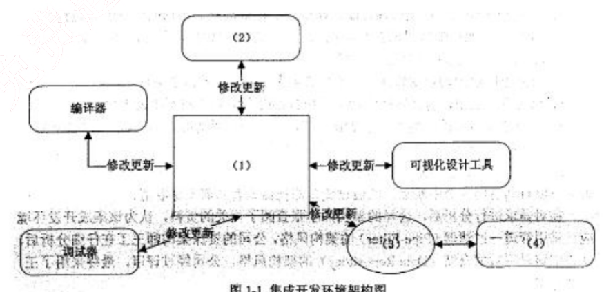
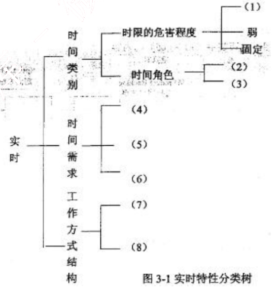
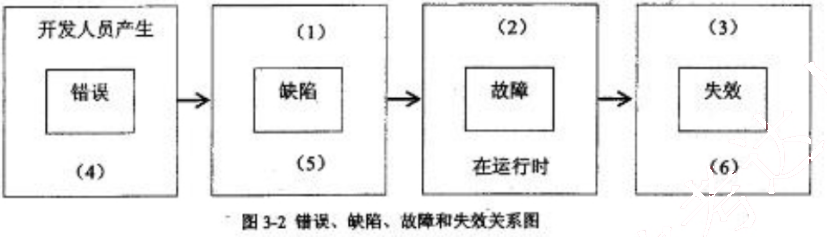
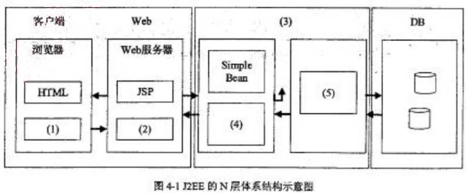
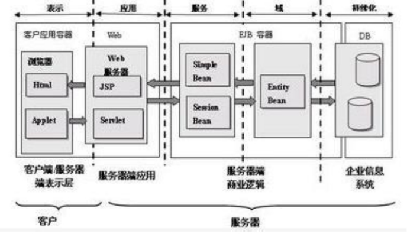
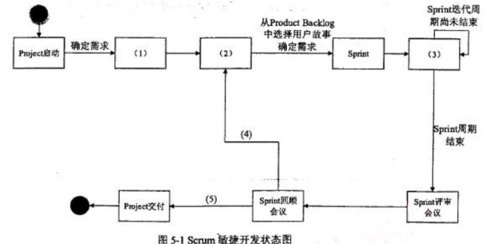
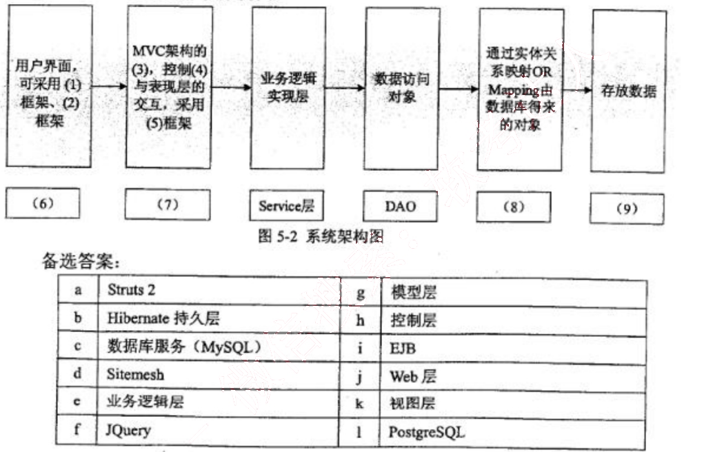

# 2016 年下半年 系统架构设计师 · 案例分析真题

> 试题一必答 + 试题二至五选答 2 道；含参考答案
>
> **来源**：本地购买扫描件《2016 年下半年系统架构设计师 答案详解》（贡献者已购买并授权转录）
> **来源类型**：`real`
> **解析方式**：byted-las-document-parse（normal 模式）+ 机械清洗，已剔除页眉、广告条与页码
> **答案与解析**：取自随卷答案详解，非本仓库编写
> **使用建议**：可用于章节训练与年份模考；关键数字建议对照原始 PDF 复核
> **完整性**：综合知识 75 题、案例分析 5 题、论文 4 题齐备

## 试题一

阅读以下关于软件架构设计的叙述，在答题纸上回答问题1至问题3 。

【说明】

某软件公司为某品牌手机厂商开发一套手机应用程序集成开发环境，以提高开发手机应用程序的质量和效率。在项目之初，公司的系统分析师对该集成开发环境的需求进行了调研和分析，具体描述如下：

a. 需要同时支持该厂商自行定义的应用编程语言的编辑、界面可视化设计、编译、调试等模块，这些模块产生的模型或数据格式差异较大，集成环境应提供数据集成能力。集成开发环境还要支持以适配方式集成公司现有的应用模拟器工具。

b. 经过调研，手机应用开发人员更倾向于使用Windows系统，因此集成开发环境的界面需要与Windows平台上的主流开发工具的界面风格保持一致。

c. 支持相关开发数据在云端存储，需要保证在云端存储数据的机密性和完整性。

d. 支持用户通过配置界面依据自己的喜好修改界面风格，包括颜色、布局、代码高亮方式等，配置完成后无需重启环境。

e. 支持不同模型的自动转换。在初始需求中定义的机器性能条件下，对于一个包含50个对象的设计模型，将其转换为相应代码框架时所消耗时间不超过5秒。

f. 能够连续运行的时间不小于240小时，意外退出后能够在10秒之内自动重启。

g. 集成开发环境具有模块化结构，支持以模块为单位进行调试、测试与发布。

h. 支持应用开发过程中的代码调试功能：开发人员可以设置断点，启动调试，编辑器可以自动卷屏并命中断点，能通过变量监视器查看当前变量取值。

在对需求进行分析后，公司的架构师小张查阅了相关的资料，认为该集成开发环境应该采用管道-过滤器（Pipe-Filter）的架构风格，公司的资深架构师王工在仔细分析后，认为应该采用数据仓储（Data Repository）的架构风格。公司经过评审，最终采用了王工的方案。

### 【问题1】 （10分）

识别软件架构质量属性是进行架构设计的重要步骤。请分析题干中的需求描述，填写表1-1 中(1)～(5)处的空白。

<table>
<caption>表1-1 质量属性识别表</caption>
  <tr>
    <th>质量属性名称</th>
    <th>需求描述编号</th>
  </tr>
  <tr>
    <td>可用性</td>
    <td>（1）</td>
  </tr>
  <tr>
    <td>（2）</td>
    <td>e</td>
  </tr>
  <tr>
    <td>可修改性</td>
    <td>（3）</td>
  </tr>
  <tr>
    <td>可测试性</td>
    <td>（4）</td>
  </tr>
  <tr>
    <td>安全性</td>
    <td>c</td>
  </tr>
  <tr>
    <td>易用性</td>
    <td>（5）</td>
  </tr>
</table>

（1）f　　（2）性能　　（3）g　　（4）h　　（5）b

### 【问题2】 （7分）

请在阅读题干需求描述的基础上，从交互方式、数据结构、控制结构和扩展方法4个方面对两种架构风格进行比较，填写表1-2中(1)～(4)处的空白。

<table>
<caption>表1-2 两种架构的比较</caption>
  <tr>
    <th>比较因素</th>
    <th>管道-过滤器风格</th>
    <th>数据仓储风格</th>
  </tr>
  <tr>
    <td>交互方式</td>
    <td>顺序结构或有限的循环结构</td>
    <td>（1）</td>
  </tr>
  <tr>
    <td>数据结构</td>
    <td>（2）</td>
    <td>文件或模型</td>
  </tr>
  <tr>
    <td>控制结构</td>
    <td>（3）</td>
    <td>业务功能驱动</td>
  </tr>
  <tr>
    <td>扩展方法</td>
    <td>接口适配</td>
    <td>（4）</td>
  </tr>
</table>

（1）星型
（2）数据流
（3）数据流驱动
（4）模型适配

### 【问题3】 （8分）

在确定采用数据仓库架构风格后，王工给出了集成开发环境的架构图。请填写图1-1中(1)～(4)处的空白，完成该集成开发环境的架构图。

图1-1 集成开发环境架构图

（1）语法结构树

（2）编辑器

（3）适配器

（4）应用模拟器工具

## 试题二

阅读以下关于软件系统建模的叙述，在答题纸上回答问题1至问题3。

【说明】

某软件公司计划开发一套教学管理系统，用于为高校提供教学管理服务。该教学管理系统基本的需求包括：

(1) 系统用户必须成功登录到系统后才能使用系统的各项功能服务；

(2) 管理员（Registrar）使用该系统管理学校（University）、系（Department）、教师（Lecturer）、学生（Student）和课程(Course)等教学基础信息；

(3) 学生使用系统选择并注册课程，必须通过所选课程的考试才能获得学分；如果考试不及格，必须参加补考，通过后才能获得课程学分；

(4) 教师使用该系统选择所要教的课程，并从系统获得选择该课程的学生名单；

(5) 管理员使用系统生成课程课表，维护系统所需的有关课程、学生和教师的信息；

(6) 每个月到了月底系统会通过打印机打印学生的考勤信息。

项目组经过分析和讨论，决定采用面向对象开发技术对系统各项需求建模。

### 【问题1】 （7分）

用例建模用来描述待开发系统的功能需求，主要元素是用例和参与者。请根据题目所述需求，说明教学服务系统中有哪些参与者。

【参考答案】

学生、教师、管理员、时间、打印机。

【试题解析】

参与者是指系统以外的，需要使用系统或与系统交互的事物，包括：人或组织、设备、外部系统等。在本题中，较为容易识别的参与者包括：学生、教师、管理员，比较隐晦的参与者包括：时间、打印机。

### 【问题2】 （7分）

用例是对系统行为的动态描述，用例获取是需求分析阶段的主要任务之一。请指出在面向对象系统建模中，用例之间的关系有哪几种类型？对题目所述教学服务系统的需求建模时，“登录系统”用例与“注册课程”用例之间、“参加考试”用例与“参加补考”用例之间的关系分别属于哪种类型？

用例之间的关系包括：包含、扩展、泛化。

“登录系统”用例与“注册课程”用例之间的关系为：包含关系。

“参加考试”用例与“参加补考”用例之间的关系为：扩展关系。

### 【问题3】 （11分）

类图主要用来描述系统的静态结构，是组件图和配置图的基础。请指出在面向对象系统建模中，类之间的关系有哪几种类型？对题目所述教学服务系统的需求建模时，类University与类Student之间、类University和类Department之间、类Student和类Course之间的关系分别属于哪种类型？

【参考答案】

类之间的关系包括：关联、聚合、组合、依赖、泛化、实现（可写可不写，因为实现是接口与类之间的关系，而接口是一种特殊的类）。

类University与类Student之间的关系是：聚合关系。

类University与类Department之间的关系是：组合关系。

类Student与类Course之间的关系是：关联关系。

【试题解析】

依赖关系：一个事物发生变化影响另一个事物。

泛化关系：特殊/一般关系。

关联关系：描述了一组链，链是对象之间的连接。

聚合关系：整体与部分生命周期不同。

组合关系：整体与部分生命周期相同。

实现关系：接口与类之间的关系。

## 试题三

阅读以下关于嵌入式实时系统设计的描述，回答问题1至问题3。

【说明】
嵌入式系统是当前航空、航天、船舶及工业、医疗等领域的核心技术，嵌入式系统可包括实时系统与非实时系统两种。某宇航公司长期从事航空航天飞行器电子设备的研制工作，随着业务的扩大，需要大量大学毕业生补充到科研生产部门。按照公司规定，大学毕业生必须进行相关基础知识培训，为此，公司经理安排王工对他们进行了长达一个月的培训。

### 【问题1】 （7分）

王工在培训中指出：嵌入式系统主要负责对设备的各种传感器进行管理与控制。而航空航天飞行器的电子设备由于对时间具有很强的敏感性，通常由嵌入式实时系统进行管控，请用300字以内文字说明什么是实时系统，实时系统有哪些主要特性。

【参考答案】
实时系统是指向系统发出一指令后，在一个极短的时间内，系统回复结果。

实时系统的特性：
（1）时间约束性（及时性）
（2）可预测性
（3）高可靠性
（4）与外部环境的交互作用性
（5）多任务类型
（6）约束的复杂性
（7）具有短暂超载的特点

【试题解析】
实时系统的特性包括：

一、时间约束性
实时系统的任务具有一定的时间约束（截止时间）。根据截止时间，实时系统的实时性分为“硬实时”和“软实时”。硬实时是指应用的时间需求能够得到完全满足，否则就造成重大安全事故，甚至造成重大的生命财产损失和生态破坏，如在航空航天、军事、核工业等一些关键领域中的应用。软实时是指某些应用虽然提出时间需求，但实时任务偶尔违反这种

需求对系统运行及环境不会造成严重影响，如监控系统等和信息采集系统等。

## 二、可预测性
可预测性是指系统能够对实时任务的执行时间进行判断，确定是否能够满足任务的时限要求。由于实时系统对时间约束要求的严格性，使可预测性称为实时系统的一项重要性能要求。除了要求硬件延迟的可预测性以外，还要求软件系统的可预测性，包括应用程序的响应时间是可预测的，即在有限的时间内完成必须的工作；以及操作系统的可预测性，即实时原语、调度函数等运行开销应是有界的，以保证应用程序执行时间的有界性。

## 三、可靠性
大多数实时系统要求有较高的可靠性。在一些重要的实时应用中，任何不可靠因素和计算机的一个微小故障，或某些特定强实时任务（又叫关键任务）超过时限，都可能引起难以预测的严重后果。为此，系统需要采用静态分析和保留资源的方法及冗余配置，使系统在最坏情况下都能正常工作或避免损失。可靠性已成为衡量实时系统性能不可缺少的重要指标。

## 四、与外部环境的交互作用性
实时系统通常运行在一定的环境下，外部环境是实时系统不可缺少的一个组成部分。计算机子系统一般是控制系统，它必须在规定的时间内对外部请求做出反应。外部物理环境往往是被控子系统，两者互相作用构成完整的实时系统。大多数控制子系统必须连续运转以保证子系统的正常工作或准备对任何异常行为采取行动。

## 五、多任务类型
在实时系统中，不但包括周期任务、偶发任务、非周期任务，还包括非实时任务。实时任务要求要满足时限，而非实时任务要求要使其响应时间尽可能的短。多种类型任务的混合，使系统的可调度性分析更加困难。

## 六、约束的复杂性
任务的约束包括时间约束、资源约束、执行顺序约束和性能约束。时间约束是任何实时系统都固有的约束。资源约束是指多个实时任务共享有限的资源时，必须按照一定的资源访问控制协议进行同步，以避免死锁和高优先级任务被低优先级任务堵塞的时间（即优先级倒置时间）不可预测。执行顺序约束是指各任务的启动和执行必须满足一定的时间和顺序约束。例如，在分布式端到端（end-to-end）实时系统很重，同一任务的各子任务之间存在前驱/后驱约束关系，需要执行同步协议来管理子任务的启动和控制子任务的执行，使它们满足时间约束和系统可调度要求。性能约束是指必须满足如可靠性、可用性、可预测性、服

务质量（Quality of Service, QoS）等性能指标。

七、具有短暂超载的特点

在实时系统中，即使一个功能设计合理、资源充足的系统也可能由于以下原因超载：

1）系统元件出现老化，外围设备错误或系统发生故障。随着系统运行时间的增长，系统元件出现老化，系统部件可能发生故障，导致系统可用资源降低，不能满足实时任务的时间约束要求。

2）环境的动态变化。由于不能对未来的环境、系统状态进行正确有效地预测，因此不能从整体角度上对任务进行调度，可能导致系统超载。

3）应用规模的扩大。原先满足实时任务时限要求的系统，随着应用规模的增大，可能出现不能满足任务时限要求的情况，而重新设计、重建系统在时间和经济上又不允许。

### 【问题2】 （8分）

实时系统根据应用场景、时间特征以及工作方式的不同，存在多种实时特性，大致有三种分类方法，即时间类别、时间需求和工作方式结构。根据自己所掌握的“实时性”知识，将图3-1给出的实时特性按三种分类方式，填写图3-1中(1)～(8)处空白。

备选答案：时限的危害程度；时间角色；弱；时间响应；固定；时限/反应时间；时间明确；输入/输出激励；时间触发；强；周期/零星/非周期；事件触发。

（1）强

（2）（3）时间响应、时间明确

（4）（5）（6）时限/反应时间、输入/输出激励、周期/零星/非周期

（7）（8）时间触发、事件触发

### 【问题3】 （10分）

可靠性是实时系统的关键特性之一，区分软件的错误(Error)、缺陷（Defect）、故障(Fault)和失效(Failure)概念是软件可靠性设计工作的基础。请简要说明错误、缺陷、故障和失效的定义；并在图3-2中标出错误、缺陷和失效出现阶段，说明缺陷、故障和失效的表现形式，填写图3-2中(1)～(6)处的空白。

【参考答案】

软件错误：软件错误是指在软件生存期内的不希望或不可接受的人为错误，其结果是导致软件缺陷的产生。

软件缺陷：软件缺陷是存在于软件（文档、数据、程序）之中的那些不希望或不可接受的偏差。

软件故障：软件故障是指软件运行过程中出现的一种不希望或不可接受的内部状态。

软件失效：软件失效是指软件运行时产生 的一种不希望或不可接受的外部行为结果。

（1）一个错误导致一个或多个缺陷
（2）缺陷激活时产生故障
（3）故障未处理好
（4）软件生存期各个阶段
（5）软件生存期各个阶段
（6）在运行时

【试题解析】

软件失效的机理可描述为：软件错误→软件缺陷→软件故障→软件失效。

1、软件错误：在可以预见的时期内，软件仍将由人来开发。在整个软件生存期的各个阶段，都贯穿着人的直接或间接的干预。然而，人难免犯错误，这必然给软件留下不良的痕

迹。软件错误是指在软件生存期内的不希望或不可接受的人为错误，其结果是导致软件缺陷的产生。可见，软件错误是一种人为过程，相对于软件本身，是一种外部行为。

2、软件缺陷：软件缺陷是存在于软件（文档、数据、程序）之中的那些不希望或不可接受的偏差，如少一个逗号、多一语句等。其结果是软件运行于某一特定条件时出现软件故障，这时称软件缺陷被激活。

3、软件故障：软件故障是指软件运行过程中出现的一种不希望或不可接受的内部状态。譬如，软件处于执行一个多余循环过程时，我们说软件出现故障。此时若无时当的措施（容错）加以及时处理，便产生软件失效。显然，软件故障是一种动态行为。

4、软件失效：软件失效是指软件运行时产生 的一种不希望或不可接受的外部行为结果。

## 试题四

阅读以下关于应用服务器的叙述，在答题纸上回答问题1至问题3。

## 【说明】
某电子产品制造公司，几年前开发建设了企业网站系统，实现了企业宣传、产品介绍、客服以及售后服务等基本功能。该网站技术上采用了Web服务器、动态脚本语言PHP。随着市场销售渠道变化以及企业业务的急剧拓展，该公司急需建立完善的电子商务平台。

公司张工建议对原有网站系统进行扩展，增加新的功能（包括订单系统、支付系统、库存管理等），这样有利于降低成本、快速上线；而王工则认为原有网站系统在技术上存在先天不足，不能满足企业业务的快速发展，尤其是企业业务将服务全球，需要提供24小时不间断服务，系统在大负荷和长时间运行下的稳定性至关重要。建议采用应用服务器的Web开发方法，例如J2EE，为该企业重新开发新的电子商务平台。

## 【问题1】（7分）
王工认为原有网站在技术上存在先天不足，不能满足企业业务的快速发展，根据你的理解，请用300字以内的文字说明原系统存在哪几个方面的不足。

1、PHP只能实现简单的分布式两层或三层的架构，而JAVA在这方面就比较强大，可以实现多层的网络架构。数据库层（持久化层）、应用（业务）逻辑层、表示逻辑层彼此分开，而且现在不同的层都已经有一些成熟的开发框架的支持。

2、PHP是面向过程的语言，Java是面向对象的，面向过程语言开发的程序只要业务流程发生变化，修改工作量很大，所以可修改性差，同时可复用性也差。

3、PHP语言在可靠性方面比J2EE平台差，J2EE平台有大量增强可靠性的成熟解决方案，而PHP只是一种简单的脚本语言，在可靠性方面缺乏成熟解决方案。

4、PHP对于不同的数据库采用不同的数据库访问接口，而Java通过JDBC来访问数据库，通过不同的数据库厂商提供的数据库驱动方便地访问数据库，访问数据库的接口比较统一。所以原架构在数据库连接方面修改起来工作量也是很大的。

5、PHP适合于小型项目，所以本项目中以前采用PHP是合适的，但目前大量功能需要增加，PHP在稳定性方面也达不到要求。

6、PHP比Java的可维护性差。

7、PHP比Java的扩展性差。

8、PHP比Java的安全性差。

### 【问题2】 (8分)

请简要说明应用服务器的概念，并重点说明应用服务器如何来保障系统在大负荷和长时间运行下的稳定性以及可扩展性。

【参考答案】

应用服务器是指通过各种协议把商业逻辑曝露给客户端的程序。

1、若系统负荷很大，可以部署多台应用服务，多台应用服务器分担任务，以达到性能要求。

2、应用服务器可以通过灵活的增加服务器完成扩展，所以可扩展性很好。

3、应用服务器可长时间稳定运行。因为当一台应用服务器出现故障时，可以将当前运行的事务转移至正常应用服务器上完成执行，不影响业务正常执行，从而保障高可靠性与稳定性。

【试题解析】

应用服务器是指通过各种协议把商业逻辑曝露给客户端的程序。它提供了访问商业逻辑的途径以供客户端应用程序使用。应用服务器使用此商业逻辑就像调用对象的一个方法一样。简单的说能实现动态网页技术的服务器叫做 Web 应用服务器。

### 【问题3】 (10分)

J2EE 平台采用了多层分布式应用程序模型，实现不同逻辑功能的应用程序被封装到不同的构件中，处于不同层次的构件可被分别部署到不同的机器中。请填写图 4-1 中(1)～(5)处的空白，完成 J2EE 的 N 层体系结构。

(1) Applet ； (2) Servlet ； (3) EJB 容器 ； (4) SessionBean ； (5) EntityBean

## 试题五

阅读以下关于 Scrum 敏捷开发过程的叙述，在答题纸上回答问题 1 至问题 3。

【说明】
Scrum 是一个增量的、迭代的敏捷软件开发过程。某软件公司计划开发一个基于 Web 的 Scrum 项目管理系统，用于支持项目团队采用 Scrum 敏捷开发方法进行软件开发，辅助主管智能决策。此项目管理系统提供的主要服务包括项目团队的管理、敏捷开发过程管理和工件的管理。

Scrum 敏捷开发中，项目团队由 Scrum 主管、产品负责人和开发团队人员三种不同的角色组成，其开发过程由若干个 Sprint（短的迭代周期，通常为 2 到 4 周）活动组成。

Product Backlog 是在 Scrum 过程初期产生的一个按照商业价值排序的需求列表，该列表条目的体现形式通常为用户故事。在每一个 Sprint 活动中，项目团队从 Product Backlog 中挑选最高优先级的用户故事进行开发。被挑选的用户故事在 Sprint 计划会议上经过细化分解为任务，同时初步估算每一个任务的预计完成时间，编写 Sprint Backlog。

在 Sprint 活动期间，项目团队每天早晨需举行每日站立会议，重新估算剩余任务的预计完成时间，更新 Sprint Backlog、Sprint 燃尽图和 Release 燃尽图。在每个 Sprint 活动结束时，项目团队召开评审会议和回顾会议，交付产品增量，总结 Sprint 期间的工作情况和问题。此时，如果 Product Backlog 中还有未完成的用户故事，则项目团队将开始筹备下一个 Sprint 活动迭代。

为完成 Scrum 项目管理系统，考虑到系统的智能决策需求，公司决定使用 MVC 架构模式开发该项目管理系统。具体来说，系统采用轻量级 J2EE 架构和 SSH 框架进行开发，使用 MySQL 数据库作为底层存储。

### 【问题1】 （10 分）

Scrum 项目管理软件需真实模拟 Scrum 敏捷开发流程，请根据你的理解完成图 5-1 给出的 Scrum 敏捷开发状态图，填写其中 (1)～(5) 的内容。

图5-1 Scrum敏捷开发状态图

(1) Product Backlog
(2) Sprint 计划会议
(3) 每日站立会议
(4) 还有未完成的用户故事
(5) 交付产品增量

### 【问题2】 （6分）

根据题干描述，本系统采用MVC架构模式，请从备选答案a~n中分别选出属于MVC架构模型中的模型（Model）、视图（View）和控制器（Controller）的相关内容描述填入表5-1的空(1)～(3)处。

<table>
<thead>
  <tr>
    <th>架构模式</th>
    <th>包含内容</th>
  </tr>
</thead>
<tbody>
  <tr>
    <td>模型（Model）</td>
    <td>(1)</td>
  </tr>
  <tr>
    <td>视图（View）</td>
    <td>(2)</td>
  </tr>
  <tr>
    <td>控制器（Controller）</td>
    <td>(3)</td>
  </tr>
</tbody>
</table>

备选答案：

<table>
  <tr>
    <td>a</td>
    <td>Sprint 燃尽图</td>
    <td>h</td>
    <td>用户</td>
  </tr>
  <tr>
    <td>b</td>
    <td>Project</td>
    <td>i</td>
    <td>交付产品增量</td>
  </tr>
  <tr>
    <td>c</td>
    <td>Product Backlog</td>
    <td>j</td>
    <td>新建项目</td>
  </tr>
  <tr>
    <td>d</td>
    <td>用户故事</td>
    <td>k</td>
    <td>Task</td>
  </tr>
  <tr>
    <td>e</td>
    <td>估算任务预计完成时间</td>
    <td>l</td>
    <td>Sprint</td>
  </tr>
  <tr>
    <td>f</td>
    <td>Release 燃尽图</td>
    <td>m</td>
    <td>产品负责人</td>
  </tr>
  <tr>
    <td>g</td>
    <td>Sprint 回顾会议</td>
    <td>n</td>
    <td>Sprint Backlog</td>
  </tr>
</table>

(1) c、e、n

(2) a、f、j

(3) g

### 【问题3】 （9分）

根据项目组给出的系统设计方案，将备选答案a～l的内容填写在图5-2中的空(1)～(9)，完成系统架构图。

(1) (2) d f
(3) h
(4) g
(5) a
(6) k
(7) h
(8) b
(9) c
