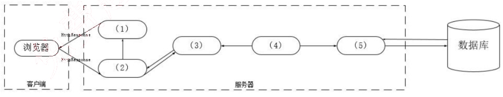
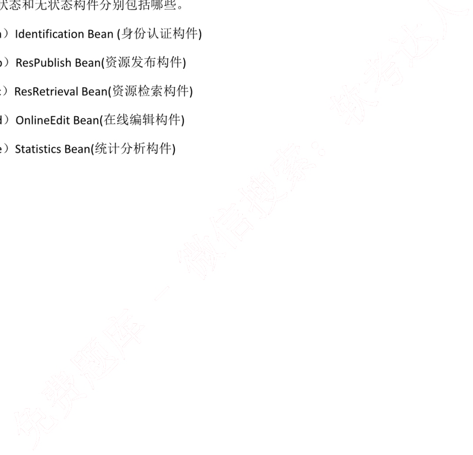
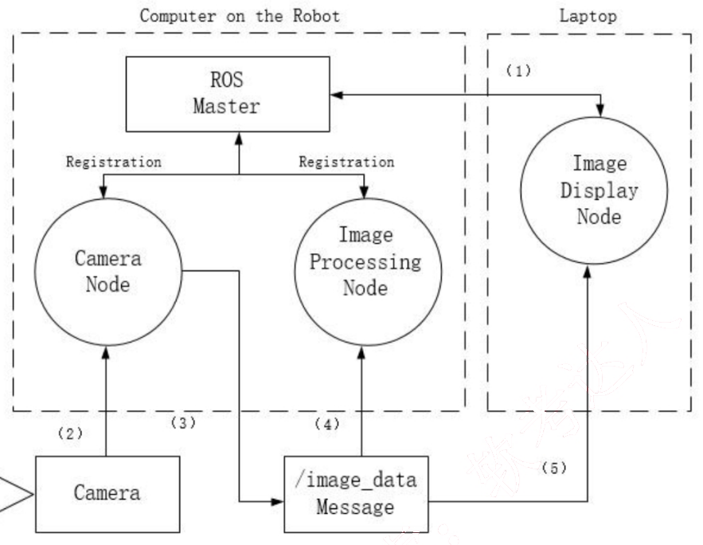

# 2017 年下半年 系统架构设计师 · 案例分析原卷（无答案）

> 题干与插图取自原卷；参考答案见同考期的研读版文件
>
> **来源**：本地购买扫描件《2017 年下半年 系统架构设计师 案例分析》（原卷，题干与参考答案分离）
> **来源类型**：`real`
> **解析方式**：byted-las-document-parse（normal 模式）+ 机械清洗，已剔除页眉、广告条与页码
> **答案与解析**：原卷不含参考答案；作答后请对照同考期的研读版文件评分
> **使用建议**：用于盲练：题干取自原卷，卷面本身无答案
> **完整性**：案例分析 5 题（原卷题干）

## 试题一
> **题型**：案例 01 · 架构评估（ATAM）

阅读以下关于软件架构评估的叙述，在答题纸上回答问题1 和问题 2。

### 【说明】

某单位为了建设健全的公路桥梁养护管理档案，拟开发一套公路桥梁在线管理系统。在系统的需求分析与架构设计阶段，用户提出的需求、质量属性描述和架构特性如下：

(a) 系统用户分为高级管理员、数据管理员和数据维护员等三类；
(b) 系统应该具备完善的安全防护措施，能够对黑客的攻击行为进行检测与防御；
(c) 正常负载情况下，系统必须在 0.5 秒内对用户的查询请求进行响应；
(d) 对查询请求处理时间的要求将影响系统的数据传输协议和处理过程的设计；
(e) 系统的用户名不能为中文，要求必须以字母开头，长度不少于 5 个字符；
(f) 更改系统加密的级别将对安全性和性能产生影响；
(g) 网络失效后，系统需要在 10 秒内发现错误并启用备用系统；
(h) 查询过程中涉及到的桥梁与公路的实时状态视频传输必须保证画面具有 1024*768 的分辨率，40 帧/秒的速率；
(i) 在系统升级时，必须保证在 10 人月内可添加一个新的消息处理中间件；
(j) 系统主站点断电后，必须在 3 秒内将请求重定向到备用站点；
(k) 如果每秒钟用户查询请求的数量是 10 个，处理单个请求的时间为 30 毫秒，则系统应保证在 1 秒内完成用户的查询请求；
(l) 对桥梁信息数据库的所有操作都必须进行完整记录；
(m) 更改系统的 Web 界面接口必须在 4 人周内完成；
(n) 如果"养护报告生成"业务逻辑的描述尚未达成共识，可能导致部分业务功能模块规则的矛盾，影响系统的可修改性；
(o) 系统必须提供远程调试接口，并支持系统的远程调试。

在对系统需求，质量属性描述和架构特性进行分析的基础上，系统的架构师给出了三个候选的架构设计方案，公司目前正在组织系统开发的相关人员对系统架构进行评估。

### 【问题 1】 (12 分)

在架构评估过程中，质量属性效用树（utility tree）是对系统质量属性进行识别和优先级

排序的重要工具。请给出合适的质量属性，填入图1-1 中 (1)、(2) 空白处；并选择题干描述的 (a)~(o)，填入(3)~(6) 空白处，完成该系统的效用树。

### 【问题2】 (13 分)

在架构评估过程中，需要正确识别系统的架构风险、敏感点和权衡点，并进行合理的架构决策。请用 300 字以内的文字给出系统架构风险、敏感点和权衡点的定义，并从题干(a)~(o) 中分别选出 1 个对系统架构风险、敏感点和权衡点最为恰当的描述。

从下列的 4 道试题（试题二至试题五）中任选 2 道解答。
如果解答的试题数超过 2 道，则题号小的 2 道解答有效。

## 试题二
> **题型**：案例 10 · SOA 与企业应用集成

阅读以下关于软件系统设计的叙述，在答题纸上回答问题 1 至问题 3。

【说明】
某软件企业受该省教育部门委托建设高校数字化教育教学资源共享平台，实现以众筹众创的方式组织省内普通高校联合开展教育教学资源内容建设，实现全省优质教学资源整合和共享。该资源共享平台的主要功能模块包括：
(1)统一身份认证模块：提供统一的认证入口，为平台其他核心业务模块提供用户管理、身份认证、权限分级和单点登录等功能；
(2) 共享资源管理模块：提供教学资源申报流程服务，包括了资源申报、分类定制、资料上传、资源审核和资源发布等功能；
(3)共享资源展示模块：提供教育教学共享资源的展示服务，包括资源导航、视频点播、资源检索、分类展示、资源评价和推荐等功能；
(4) 资源元模型管理模块：依据资源类型提供共享资源的描述属性、内容属性和展示属性，包括共享资源统一标准和规范、资源加工和在线编辑工具、数字水印和模板定制等功能；
(5) 系统综合管理模块：提供系统管理和维护服务，包括系统配置、数据备份恢复、资源导入导出和统计分析等功能。

项目组经过分析和讨论，决定采用基于 Java EE 的 MVC 模式设计资源共享平台的软件架构，如图 2-1 所示。

图 2-1 资源共享平台软件架构

### 【问题1】 (9 分)

MVC 架构中包含哪三种元素，它们的作用分别是什么?请根据图 2-1 所示架构将 JavaEE 中 JSP、Servlet、Service、JavaBean、DAO 五种构件分别填入空 (1)~(5) 所示位置。

### 【问题2】 (6分)

项目组架构师王工提出在图2-1所示架构设计中加入EJB构件，采用企业级JavaEE架构开发资源共享平台。请说明EJB构件中的Bean (构件)分为哪三种类型，每种类型Bean的职责是什么。

### 【问题3】 (10分)

如果采用王工提出的企业JavaEE架构，请说明下列(a)-(e) 所给出的业务功能构件中，有状态和无状态构件分别包括哪些。

（a）Identification Bean (身份认证构件)
（b）ResPublish Bean(资源发布构件)
（c）ResRetrieval Bean(资源检索构件)
（d）OnlineEdit Bean(在线编辑构件)
（e）Statistics Bean(统计分析构件)

## 试题三
> **题型**：案例 08 · 嵌入式 / 构件组装

阅读以下关于机器人操作系统架构的描述，回答问题1至问题3

【说明】

随着人工智能技术的发展，工业机器人已成为当前工业界的热点研究对象。某宇航设备公司为了扩大业务范围，决策层研究决定准备开展工业机器人研制新业务。公司将论证工作交给了软件架构师王工，王工经过分析和调研，从机器人市场现状、领域需求、组成及关键技术和风险分析等方面开展了综合论证。论证报告指出：首先，为了保障本公司机器人研制的持续性，应根据领域需求选择一种适应的设计架构；其次，为了规避风险，公司的研制工作不能从零开始，应该采用国际开源社区所提供机器人操作系统（Robot Operating System ，ROS）作为机器人开发的基本平台。

在讨论会上，架构师李工提出不同意见，他认为公司针对宇航领域已开发了某款嵌入式实时操作系统，且被多种宇航装备使用，可靠性较高。因此应该采用现有架构体系作为机器人的开发平台。会上王工说明了机器人操作系统与该款操作系统的差别，要沿用需要进行改造，投入较大。经过激烈讨论，公司领导同意了王工采用 ROS 的意见。

### 【问题1】 (5分)

王工拟采用的 ROS 具有分布式进程框架，以点对点设计以及服务和节点管理方式，使得执行程序可以各自独立地设计，松散地、实时地组合起来。这些进程可以按照功能包和功能包集的方式分组，因而可以容易地分享和发布。请用400字以内文字说明 ROS 与嵌入式实时操作系统的共同点，以及在实时性和任务通信方式两个方面的差异。

### 【问题2】 (10分)

ROS 为应用程序间通信提供了主题(Topic) 、服务 (Service)和动作 (Action) 三种消息通信方式，每种通信方式都有其特点。请将以下给出的三类通信的主要特点填入表3-1中(1)-(5)的空白处，将答案写在答题纸上。

(a) 适合用于传输传感器信息（数据流）
(b) 能够知道是否调用成功
(c) 一对多模式
(d) 有握手信号
(e) 服务执行完会有反馈

(f) 可以监控长时间执行的进程
(g) 较复杂
(h) 可能让系统过载(数据太多)
(i) 服务执行完之前，程序会等待
(j) 建立通信较慢
(k) 可能丢失数据

<table>
<caption>表3-1 ROS三类通信的主要特点</caption>
<tbody>
<tr>
<td>类型</td>
<td>特点</td>
</tr>
<tr>
<td rowspan="4">主题（Topic）</td>
<td>（a）适合于传输传感器信息（数据流）</td>
</tr>
<tr>
<td>（1）</td>
</tr>
<tr>
<td>（2）</td>
</tr>
<tr>
<td>（h）可能让系统过载（数据太多）</td>
</tr>
<tr>
<td rowspan="4">服务（Service）</td>
<td>（b）能够知道是否调用成功</td>
</tr>
<tr>
<td>（3）</td>
</tr>
<tr>
<td>（e）服务执行完会有反馈</td>
</tr>
<tr>
<td>（4）</td>
</tr>
<tr>
<td rowspan="3">动作（Action）</td>
<td>（5）</td>
</tr>
<tr>
<td>（g）较复杂</td>
</tr>
<tr>
<td>（d）有握手信号</td>
</tr>
</tbody>
</table>

### 【问题3】 (10 分)

ROS 的架构定义了 ROS 系统由多个各自独立的节点(组件) 组成，并且各个节点之间可以通过发布/订阅(Publish/Subscribe )消息模型进行通信。图 3-1 给出一个简单机器人结构实例，请根据以下文字描述，补充图 3-1 中(1)~(5) 处空白，将答案写在答题纸上。
"机器人开始阶段，所有节点都要注册 (Registration) 到 Master 上，注册后，摄像头节点声明它要发布(Publish)一个叫做/image_data 的消息。另外两个节点（图像处理处理节点和图像显示节点）声明它们需要订阅( Subscribe) 这个/image_data 消息。因此， 一旦摄像头节点收到相机发送的数据(Data)，就立即将数据/image_data 直接发送到另外两个节点。

## 试题四
> **题型**：案例 02 · 数据库设计（ER + 规范化）

阅读以下关于数据库设计的叙述，在答题纸上回答问题1至问题3。

【说明】

某制造企业为拓展网上销售业务，委托某软件企业开发一套电子商务网站。初期仅解决基本的网上销售、订单等功能需求。该软件企业很快决定基于.NET平台和SQL Server数据库进行开发，但在数据库访问方式上出现了争议。王工认为应该采用程序在线访问的方式访问数据库；而李工认为本企业内部程序员缺乏数据库开发经验，而且应用简单，应该采用ORM（对象关系映射）方式。最终经过综合考虑，该软件企业采用了李工的建议。

随着业务的发展，该电子商务网站逐渐发展成一个通用的电子商务平台，销售多家制造企业的产品，电子商务平台的功能也日益复杂。目前急需对该电子商务网站进行改造，以支持对多种异构数据库平台的数据访问，同时满足复杂的数据管理需求。该软件企业针对上述需求，对电子商务网站的架构进行了重新设计，新增加了数据访问层，同时采用工厂设计模式解决异构数据库访问的问题。新设计的系统架构如图4-1所示。

### 【问题1】 （9分）

请用300字以内的文字分别说明数据库程序在线访问方式和ORM方式的优缺点，说明该软件企业采用ORM的原因。

### 【问题2】 (9分)

请用100字以内的文字说明新体系架构中增加数据访问层的原因。请根据图4-1所示，填写图中空白处(1) - (3)。

### 【问题3】 (7分)

应用程序设计中，数据库访问需要良好的封装性和可维护性，因此经常使用工厂设计模式来实现对数据库访问的封装。请解释工厂设计模式，并说明其优点和应用场景；请解释说明工厂模式在数据访问层中的应用。

## 试题五
> **题型**：案例 09 · 大数据 / Web 架构设计

阅读以下关于 Web 系统架构设计的叙述，在答题纸上回答问题1至问题3.

## 【说明】
某电子商务企业因发展良好，客户量逐步增大，企业业务不断扩充，导致其原有的 B2C 商品交易平台已不能满足现有业务需求。因此，该企业委托某软件公司重新开发一套商品交易平台。该企业要求新平台应可适应客户从手机、平板设备、电脑等不同终端设备访问系统，同时满足电商定期开展"秒杀"、"限时促销"等活动的系统高并发访问量的需求。面对系统需求，软件公司召开项目组讨论会议，制定系统设计方案。讨论会议上，王工提出可以应用响应式 Web 设计满足客户从不同设备正确访问系统的需求。同时，采用增加镜像站点、CDN 内容分发等方式解决高并发访问量带来的问题。李工在王工的提议上补充，仅仅依靠上述外网加速技术不能完全解决高用户并发访问问题，如果访问量持续增加，系统仍存在崩溃可能。李工提出应同时结合负载均衡、缓存服务器、Web 应用服务器、分布式文件系统、分布式数据库等方法设计系统架构。经过项目组讨论，最终决定综合王工和李工的思路，完成新系统的架构设计。

## 【问题 1】(5 分)
请用 200 字以内的文字描述什么是"响应式 Web 设计"，并列举 2 个响应式 Web 设计的实现方式。

## 【问题 2】(16 分)
综合王工和李工的提议，项目组完成了新商品交易平台的系统架构设计方案。新系统架构图如图 5-1 所示。请从选项 (a) - (j) 中为架构图中(1) - (8) 处空白选择相应的内容，补充支持高并发的 Web 应用系统架构设计图。

(a) Web 应用层
(b) 界面层
(c) 负载均衡层
(d) CDN 内容分发
(e) 主数据库
(f) 缓存服务器集群
(g) 从数据库
(h) 写操作
(i) 读操作
(j) 文件服务器集群

### 【问题3】 (4分)

根据李工的提议，新的 B2C 商品交易平台引入了主从复制机制。请针对 B2C 商品交易平台的特点，简要叙述引入该机制的好处。
