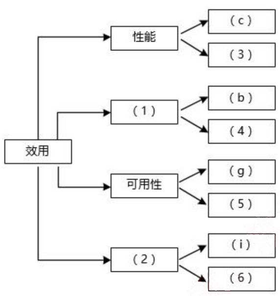
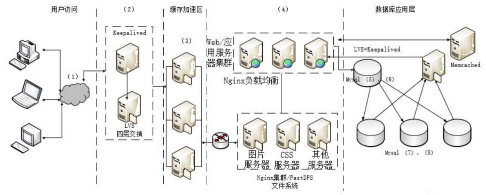

# 2017 年下半年 系统架构设计师 · 案例分析原卷（无答案）

>
> **来源**：本地购买扫描件《2017 年下半年 系统架构设计师 案例分析》（原卷，题干与参考答案分离）
> **来源类型**：`real`
> **解析方式**：byted-las-document-parse（normal 模式）+ 机械清洗，已剔除页眉、广告条与页码
> **答案与解析**：原卷不含参考答案；作答后请对照同考期的研读版文件评分
> **使用范围**：经典选题，仅保留原题号 一、四、五；不作为完整年份模考。筛选依据见 [历史题复核](../HISTORICAL_CURATION.md)。

## 试题一
> **题型**：案例 01 · 架构评估（ATAM）

阅读以下关于软件架构评估的叙述，在答题纸上回答问题1 和问题 2。

### 【说明】

某单位为了建设健全的公路桥梁养护管理档案，拟开发一套公路桥梁在线管理系统。在系统的需求分析与架构设计阶段，用户提出的需求、质量属性描述和架构特性如下：

(a) 系统用户分为高级管理员、数据管理员和数据维护员等三类；
(b) 系统应该具备完善的安全防护措施，能够对黑客的攻击行为进行检测与防御；
(c) 正常负载情况下，系统必须在 0.5 秒内对用户的查询请求进行响应；
(d) 对查询请求处理时间的要求将影响系统的数据传输协议和处理过程的设计；
(e) 系统的用户名不能为中文，要求必须以字母开头，长度不少于 5 个字符；
(f) 更改系统加密的级别将对安全性和性能产生影响；
(g) 网络失效后，系统需要在 10 秒内发现错误并启用备用系统；
(h) 查询过程中涉及到的桥梁与公路的实时状态视频传输必须保证画面具有 1024*768 的分辨率，40 帧/秒的速率；
(i) 在系统升级时，必须保证在 10 人月内可添加一个新的消息处理中间件；
(j) 系统主站点断电后，必须在 3 秒内将请求重定向到备用站点；
(k) 如果每秒钟用户查询请求的数量是 10 个，处理单个请求的时间为 30 毫秒，则系统应保证在 1 秒内完成用户的查询请求；
(l) 对桥梁信息数据库的所有操作都必须进行完整记录；
(m) 更改系统的 Web 界面接口必须在 4 人周内完成；
(n) 如果"养护报告生成"业务逻辑的描述尚未达成共识，可能导致部分业务功能模块规则的矛盾，影响系统的可修改性；
(o) 系统必须提供远程调试接口，并支持系统的远程调试。

在对系统需求，质量属性描述和架构特性进行分析的基础上，系统的架构师给出了三个候选的架构设计方案，公司目前正在组织系统开发的相关人员对系统架构进行评估。

### 【问题 1】 (12 分)

在架构评估过程中，质量属性效用树（utility tree）是对系统质量属性进行识别和优先级

排序的重要工具。请给出合适的质量属性，填入图1-1 中 (1)、(2) 空白处；并选择题干描述的 (a)~(o)，填入(3)~(6) 空白处，完成该系统的效用树。

### 【问题2】 (13 分)

在架构评估过程中，需要正确识别系统的架构风险、敏感点和权衡点，并进行合理的架构决策。请用 300 字以内的文字给出系统架构风险、敏感点和权衡点的定义，并从题干(a)~(o) 中分别选出 1 个对系统架构风险、敏感点和权衡点最为恰当的描述。

## 试题四
> **题型**：案例 02 · 数据库访问层与 ORM

阅读以下关于数据库设计的叙述，在答题纸上回答问题1至问题3。

【说明】

某制造企业为拓展网上销售业务，委托某软件企业开发一套电子商务网站。初期仅解决基本的网上销售、订单等功能需求。该软件企业很快决定基于.NET平台和SQL Server数据库进行开发，但在数据库访问方式上出现了争议。王工认为应该采用程序在线访问的方式访问数据库；而李工认为本企业内部程序员缺乏数据库开发经验，而且应用简单，应该采用ORM（对象关系映射）方式。最终经过综合考虑，该软件企业采用了李工的建议。

随着业务的发展，该电子商务网站逐渐发展成一个通用的电子商务平台，销售多家制造企业的产品，电子商务平台的功能也日益复杂。目前急需对该电子商务网站进行改造，以支持对多种异构数据库平台的数据访问，同时满足复杂的数据管理需求。该软件企业针对上述需求，对电子商务网站的架构进行了重新设计，新增加了数据访问层，同时采用工厂设计模式解决异构数据库访问的问题。新设计的系统架构如图4-1所示。

### 【问题1】 （9分）

请用300字以内的文字分别说明数据库程序在线访问方式和ORM方式的优缺点，说明该软件企业采用ORM的原因。

### 【问题2】 (9分)

请用100字以内的文字说明新体系架构中增加数据访问层的原因。请根据图4-1所示，填写图中空白处(1) - (3)。

### 【问题3】 (7分)

应用程序设计中，数据库访问需要良好的封装性和可维护性，因此经常使用工厂设计模式来实现对数据库访问的封装。请解释工厂设计模式，并说明其优点和应用场景；请解释说明工厂模式在数据访问层中的应用。

## 试题五
> **题型**：案例 09 · 高并发 Web 架构设计

阅读以下关于 Web 系统架构设计的叙述，在答题纸上回答问题1至问题3.

## 【说明】
某电子商务企业因发展良好，客户量逐步增大，企业业务不断扩充，导致其原有的 B2C 商品交易平台已不能满足现有业务需求。因此，该企业委托某软件公司重新开发一套商品交易平台。该企业要求新平台应可适应客户从手机、平板设备、电脑等不同终端设备访问系统，同时满足电商定期开展"秒杀"、"限时促销"等活动的系统高并发访问量的需求。面对系统需求，软件公司召开项目组讨论会议，制定系统设计方案。讨论会议上，王工提出可以应用响应式 Web 设计满足客户从不同设备正确访问系统的需求。同时，采用增加镜像站点、CDN 内容分发等方式解决高并发访问量带来的问题。李工在王工的提议上补充，仅仅依靠上述外网加速技术不能完全解决高用户并发访问问题，如果访问量持续增加，系统仍存在崩溃可能。李工提出应同时结合负载均衡、缓存服务器、Web 应用服务器、分布式文件系统、分布式数据库等方法设计系统架构。经过项目组讨论，最终决定综合王工和李工的思路，完成新系统的架构设计。

## 【问题 1】(5 分)
请用 200 字以内的文字描述什么是"响应式 Web 设计"，并列举 2 个响应式 Web 设计的实现方式。

## 【问题 2】(16 分)
综合王工和李工的提议，项目组完成了新商品交易平台的系统架构设计方案。新系统架构图如图 5-1 所示。请从选项 (a) - (j) 中为架构图中(1) - (8) 处空白选择相应的内容，补充支持高并发的 Web 应用系统架构设计图。

(a) Web 应用层
(b) 界面层
(c) 负载均衡层
(d) CDN 内容分发
(e) 主数据库
(f) 缓存服务器集群
(g) 从数据库
(h) 写操作
(i) 读操作
(j) 文件服务器集群

### 【问题3】 (4分)

根据李工的提议，新的 B2C 商品交易平台引入了主从复制机制。请针对 B2C 商品交易平台的特点，简要叙述引入该机制的好处。
