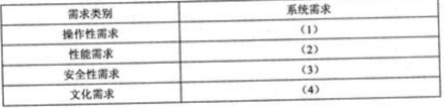
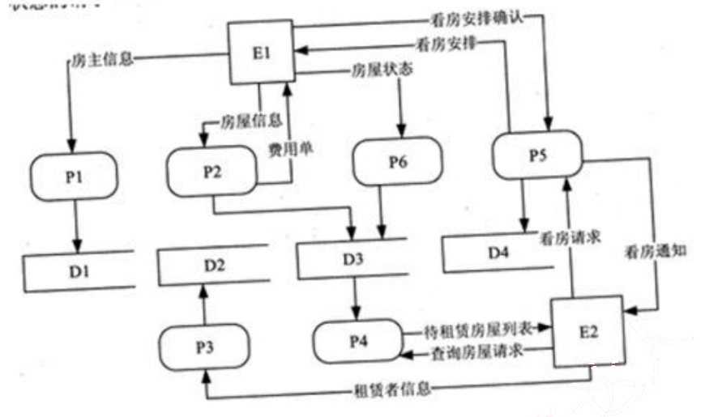
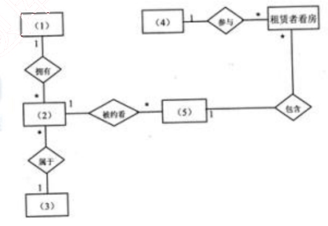
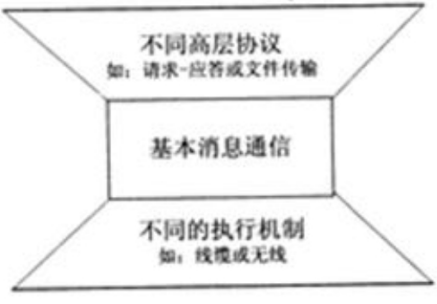
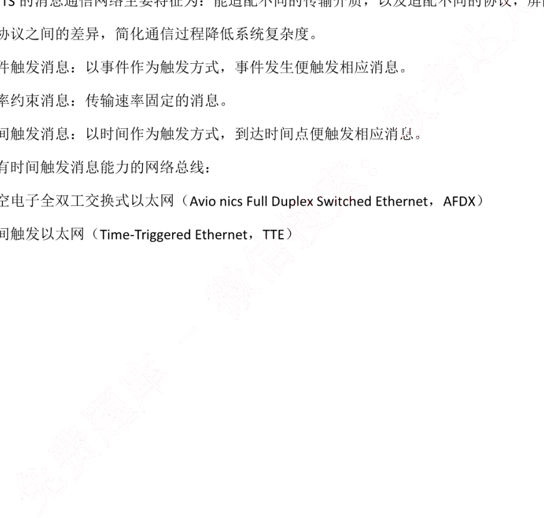
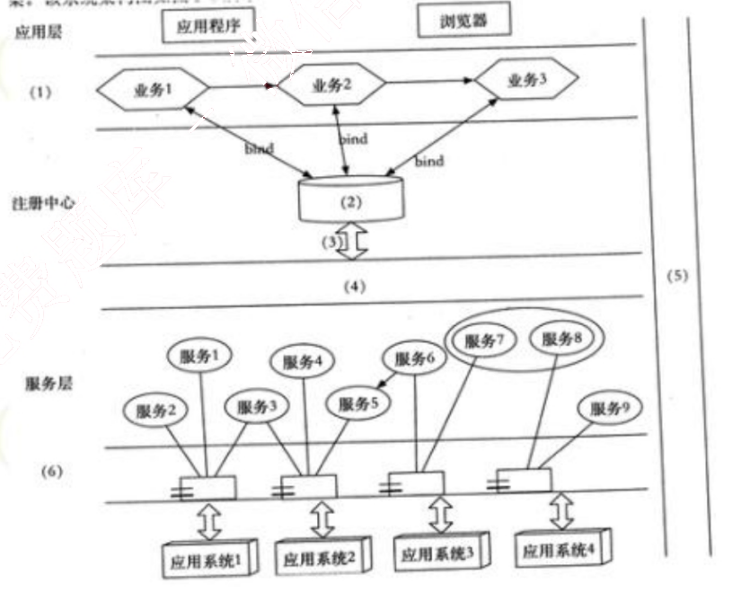

# 2018 年下半年 系统架构设计师 · 案例分析真题

> 试题一必答 + 试题二至五选答 2 道；含参考答案
>
> **来源**：本地购买扫描件《2018 年下半年系统架构设计师 答案详解》（贡献者已购买并授权转录）
> **来源类型**：`real`
> **解析方式**：byted-las-document-parse（normal 模式）+ 机械清洗，已剔除页眉、广告条与页码
> **答案与解析**：取自随卷答案详解，非本仓库编写
> **使用建议**：可用于章节训练与年份模考；关键数字建议对照原始 PDF 复核
> **完整性**：案例分析 5 题、论文 4 题齐备；综合知识沿用仓库已有整理

## 试题一

阅读以下关于软件系统设计的叙述，在答题纸上回答问题 1 至问题 3。

【说明】

某文化产业集团委托软件公司开发一套文化用品商城系统，业务涉及文化用品销售、定制、竞拍和点评等板块，以提升商城的信息化建设水平。该软件公司组织项目组完成了需求调研，现已进入到系统架构设计阶段。考虑到系统需求对架构设计决策的影响，项目组先列出了可能影响系统架构设计的部分需求如下：

（a）用户界面支持用户的个性化定制；

（b）系统需要支持当前主流的标准和服务，特别是通信协议和平台接口；

（c）用户操作的响应时间应不大于 3 秒，竞拍板块不大于 1 秒；

（d）系统具有故障诊断和快速恢复能力；

（e）用户密码需要加密传输；

（f） 系统需要支持不低于 2G 的数据缓存；

（g）用户操作停滞时间超过一定时限需要重新登录验证；

（h）系统支持用户选择汉语、英语或法语三种语言之一进行操作。

项目组提出了两种系统架构设计方案：瘦客户端 C/S 架构和胖客户端 C/S 架构，经过对上述需求逐条分析和讨论，最终决定采用瘦客户端 C/S 架构进行设计。

### 【问题1】 （8 分）

在系统架构设计中，决定系统架构设计的非功能性需求主要有四类：操作性需求、性能需求、安全性需求和文化需求。请简要说明四类需求的含义。

### 【问题2】 （8 分）

根据表 1-1 的分类，将题干所给出的系统需求（a）~（h）分别填入（1） ~（4）。

表 1-1 需求分类

### 【问题3】 （9 分）

请说明瘦客户端 C/S 架构能够满足题干中给出的哪些系统需求（只需要回答出三个系

统需求）。

答案：

### 【问题1】

系统性能需求（Performance Requirements）：指响应时间、吞吐量、准确性、有效性、资源利用率等与系统完成任务效率相关的指标。可靠性、可用性等指标归为此类。

安全性需求（Security Requirements）：系统向合法用户提供服务并阻止非授权用户使用服务方面的系统需求。

操作性需求（Operational Requirements）:与用户操作使用系统相关的一些需求。

文化需求（Cultural Requirements）：带有文化背景因素的系统需求。

### 【问题2】

（1）（a）（b）

（2）（c）（d）（f）

（3）（e）（g）

（4）（h）

### 【问题3】

（a）瘦的把业务逻辑从客户端放到了服务上。

（b）胖和瘦无明显差异

（c）胖客户端，在客户端的运算能力强一些。瘦客户端可以在服务端面用集群做支持

（d）瘦客户端将业务逻辑迁移到应用服务器上，所以故障只要修复服务器上的内容，而胖客户端要更新所有客户端，工作量大，所以此情况下瘦客户端有优势。

（e）胖客户端的后端是数据库，没有业务逻辑，此时要做加密传输没有基础，但瘦客户端可以做到。

（f）胖客户端做到2G数据缓存很容易，而瘦客户端不现实。

（g）瘦客户端与胖客户端均可做到。

（h）瘦客户端与胖客户端均可做到。

解析：

系统性能需求（Performance Requirements）：系统扩展性（Scalability Requirements）、系统可靠性（Reliability Requirements）、系统可用性（Availability Requirements）

安全性需求（Security Requirements）：用户安全需求（User Security Requirements）、数据安全需求（Data Security Requirements）

系统运营需求（Operational Requirements）：硬件平台需求（Hard Requirements）、软件平台需求（Software Requirements）、网络需求（Network Requirements）、产品支持需求（Product Suport Requirements）

国际化需求（Globalization Requirements）：中国文化及政策需求（Cultural and Political Requirements）、本地化需求（Localization Requirements）

## 试题二

阅读以下关于软件系统建模的叙述，在答题纸上回答问题 1 至问题 3。

【说明】

某公司欲建设一个房屋租赁服务系统，统一管理房主和租赁者的信息，提供快捷的租赁服务。本系统的主要功能描述如下：

1. 登记房主信息。记录房主的姓名、住址、身份证号和联系电话等信息，并写入房主信息文件。

2. 登记房屋信息。记录房屋的地址、房屋类型（如平房、带阳台的楼房、独立式住宅等）、楼层、租金及房屋状态（待租赁、已出租）等信息，并写入房屋信息文件。一名房主可以在系统中登记多套待租赁的房屋。

3. 登记租赁者信息。记录租赁者的个人信息，包括：姓名、性别、住址、身份证号和电话号码等，并写入租赁者信息文件。

4. 安排看房。已经登记在系统中的租赁者，可以从待租赁房屋列表中查询待租赁房屋信息。租赁者可以提出看房请求，系统安排租赁者看房。对于每次看房，系统会生成一条看房记录并将其写入看房记录文件中。

5. 收取手续费。房主登记完房屋后，系统会生成一份费用单，房主根据费用单交纳相应的费用。

6. 变更房屋状态。当租赁者与房主达成租房或退房协议后，房主向系统提交变更房屋状态的请求。系统将根据房主的请求，修改房屋信息文件。

图 2-1 房屋租赁服务系统顶层 DFD

### 【问题1】 （12 分）

若采用结构化方法对房屋租赁服务系统进行分析，得到如图 2-1 所示的顶层 DFD。使用题干中给出的词语，给出图 2-1 中外部实体 E1~E2、加工 P1~P6 以及数据存储 D1~D4 的名称。

### 【问题2】 （5 分）

若采用信息工程（Information Engineering）方法对房屋租赁服务系统进行分析，得到如图 2-2 所示的 ERD。请给出图 2-2 中实体（1）~（5）的名称。

图 2-2 房屋租赁服务系统 ERD

### 【问题3】 （8 分）

（1）信息工程方法中的“实体（entity）” 与面向对象方法中的“类（class）”之间有哪些不同之处？

（2）在面向对象方法中通常采用用例（Use Case）来捕获系统的功能需求。用例可以按照不同的层次来进行划分，其中的 Essential Use Cases 和 Real Use Cases 有哪些区别？

答案：

### 【问题1】

E1：房主
E2：租赁者
P1：登记房主信息
P2：登记房屋信息
P3：登记租赁者信息
P4：查询租赁房屋信息
P5：安排看房
P6：变更房屋状态
D1：房主信息文件
D2：租赁者信息文件
D3 房屋信息文件
D4：看房记录文件

### 【问题2】

（1）房主
（2）房屋
（3）房屋
（4）租赁者
（5）看房记录

### 【问题3】

（1）实体用于数据建模，而类用于面向对象建模。实体只有属性，而类有属性和操作。

（2）Essential Use Cases 可翻译为抽象用例，而 Real Use Cases 可翻译为基础用例。他们是区别在于：基础用例是实实在在与用户需求有对应关系的用例，是从用户需求获取的渠道得到的，而抽象用例是从基础用例中抽取的用例的公共部分，是为了避免重复工作，优化结构而提出的用例。

## 试题三

阅读以下关于嵌入式实时系统相关技术的叙述，在答题纸上回答问题 1 和问题 2。

【说明】

某公司长期从事宇航领域嵌入式实时系统的软件研制任务。公司为了适应未来嵌入式系统网络化、智能化和综合化的技术发展需要，决定重新考虑新产品的架构问题，经理将论证工作交给王工负责。王工经调研和分析，完成了新产品架构设计方案，提交公司高层讨论。

### 【问题1】 （14 分）

王工提交的设计方案中指出：由于公司目前研制的嵌入式实时产品属于简单型系统，其嵌入式子系统相互独立，功能单一，时序简单。而未来满足网络化、智能化和综合化的嵌入式实时系统将是一种复杂系统，其核心特征体现为实时任务的机理、状态和行为的复杂性。简单任务和复杂任务的特征区分主要表现在十个方面。请参考表 3-1 给出的实时任务特征分类，用题干中给出的（a）~（t）20 个实时任务特征描述，补充完善表 3-1 给出的空（1）~（14）。

（a）任务属性不会随时间变化而改变；
（b）任务的属性与时间相关；
（c）任务仅可以从非连续集中获取特征变量；
（d）任务变量域是连续的；
（e）功能原理不依赖于上下文；
（f）功能原理依赖于上下文；
（g）任务行为可以用 step-by-step 顺序分析方法来理解；
（h）许多任务在产生访问活动时相互间是并发处理的，很难用 step-bystep 方法分析；
（i）因果关系相互影响；
（j）行为特征依赖于大量的反馈机制；
（k）系统内构成、策略和描述是相似的；
（l）系统内存在许多不同的构成、策略和描述；
（m）功能关系是非线性的；
（n）功能关系是线性的；
（o）不同的子任务是相互独立的，任务内部仅存在少量的交互操作；
（p）不同的子任务有很高的交互操作，要把一个单任务的行为隔离开是困难的；
（q）域特征有非常整齐的原则和规则；

(r) 许多不同的上下文依赖于规则；
(s) 原理和规则在表面属性上很容易被识别；
(t) 原理被覆盖、抽象，而不会在表面属性上被识别。

表 3-1 简单任务和复杂任务特征比较
<table>
<thead>
<tr>
<th>特征分类</th>
<th>简单任务（simple task）</th>
<th>复杂任务（complex task）</th>
</tr>
</thead>
<tbody>
<tr>
<td>静态/动态</td>
<td>（a）</td>
<td>（b）</td>
</tr>
<tr>
<td>连续/非连续</td>
<td>（1）</td>
<td>（2）</td>
</tr>
<tr>
<td>子系统的独立性</td>
<td>（3）</td>
<td>（4）</td>
</tr>
<tr>
<td>顺序/并行执行</td>
<td>（5）</td>
<td>（6）</td>
</tr>
<tr>
<td>单一性/混合性</td>
<td>（7）</td>
<td>（8）</td>
</tr>
<tr>
<td>工作原理</td>
<td>（9）</td>
<td>（10）</td>
</tr>
<tr>
<td>线性/非线性</td>
<td>（11）</td>
<td>（12）</td>
</tr>
<tr>
<td>上下文相关性</td>
<td>（13）</td>
<td>（14）</td>
</tr>
<tr>
<td>规律/不规律</td>
<td>（q）</td>
<td>（r）</td>
</tr>
<tr>
<td>表面属性</td>
<td>（s）</td>
<td>（t）</td>
</tr>
</tbody>
</table>

### 【问题2】 （11 分）

王工设计方案中指出：要满足未来网络化、智能化和综合化的需求，应该设计一种能够充分表达嵌入式系统行为的、且具有一定通用性的通信架构， 以避免复杂任务的某些特征带来的通信复杂性。通常为了实现嵌入式系统中计算组件间的通信，在架构上需要一种简单的架构风格，用于屏蔽不同协议、不同硬件和不同结构组成所带来的复杂性。图 3-1 给出了一种“腰（Waistline）”型通信模式的架构风格。腰型架构的关键是基本消息通信（BMTS），通常 BMTS 的消息与时间属性相关，支持事件触发消息、速率约束消息和时间触发消息。

请说明基于 BMTS 的消息通信网络的主要特征和上述三种消息的基本含义，并举例给出两种具有时间触发消息能力的网络总线。

图 3-1 “腰”型通信模式架构风格

答案：

### 【问题1】

（1）（d）
（2）（c）
（3）（e）
（4）（f）
（5）（g）
（6）（h）
（7）（i）
（8）（j）
（9）（k）
（10）（l）
（11）（n）
（12）（m）
（13）（o）
（14）（p）

### 【问题2】

BMTS 的消息通信网络主要特征为：能适配不同的传输介质，以及适配不同的协议，屏蔽不同协议之间的差异，简化通信过程降低系统复杂度。

事件触发消息：以事件作为触发方式，事件发生便触发相应消息。

速率约束消息：传输速率固定的消息。

时间触发消息：以时间作为触发方式，到达时间点便触发相应消息。

具有时间触发消息能力的网络总线：

航空电子全双工交换式以太网（Avionics Full Duplex Switched Ethernet，AFDX）

时间触发以太网（Time-Triggered Ethernet，TTE）

## 试题四

阅读以下关于分布式数据库缓存设计的叙述，在答题纸上回答问题 1 至问题 3.

【说明】

某企业是为城市高端用户提供高品质蔬菜生鲜服务的初创企业，创业初期为快速开展业务，该企业采用轻量型的开发架构（脚本语言+关系型数据库）研制了一套业务系统。业务开展后受到用户普遍欢迎，用户数和业务数量迅速增长，原有的数据库服务器已不能满足高度并发的业务要求。为此，该企业成立了专门的研发团队来解决该问题。

张工建议重新开发整个系统，采用新的服务器和数据架构，解决当前问题的同时为日后的扩展提供支持。但是，李工认为张工的方案开发周期过长，投入过大，当前应该在改动尽量小的前提下解决该问题。李工认为访问量很大的只是部分数据，建议采用缓存工具MemCache 来减轻数据库服务器的压力，这样开发量小，开发周期短，比较适合初创公司，同时将来也可以通过集群进行扩展。然而，刘工又认为李工的方案中存在数据可靠性和一致性问题，在宕机时容易丢失交易数据，建议采用 Redis 来解决问题。在经过充分讨论，该公司最终决定采用刘工的方案。

### 【问题1】 （9 分）

在李工和刘工的方案中，均采用分布式数据库缓存技术来解决问题。请说明分布式数据库缓存的基本概念。

表 4-1 中对 MemCache 和 Redis 两种工具的优缺点进行了比较，请补充完善表 4-1中的空（1）~（6）。

表 4-1 MemCache 与 Redis 能力比较
<table>
<thead>
<tr>
<th>对比项</th>
<th>Memcache</th>
<th>Redis</th>
</tr>
</thead>
<tbody>
<tr>
<td>数据类型</td>
<td>简单 key/value 结构</td>
<td>（1）</td>
</tr>
<tr>
<td>持久性</td>
<td>（2）</td>
<td>支持</td>
</tr>
<tr>
<td>分布式存储</td>
<td>（3）</td>
<td>多种方式，主从、Sentinel、Cluster 等</td>
</tr>
<tr>
<td>多线程支持</td>
<td>支持</td>
<td>（4）</td>
</tr>
<tr>
<td>内存管理</td>
<td>（5）</td>
<td>无</td>
</tr>
<tr>
<td>事务支持</td>
<td>（6）</td>
<td>有限支持</td>
</tr>
</tbody>
</table>

### 【问题2】 （8 分）

刘工认为李工的方案存在数据可靠性和一致性的问题，请说明原因。

为避免数据可靠性和一致性的问题，刘工的方案采用 Redis 作为数据库缓存，请说明基本的 Redis 与原有关系数据库的数据同步方案。

### 【问题3】 （8 分）

请给出 Redis 分布式存储的 2 种常见方案和 Redis 集群切片的几种常见方式。

答案：

### 【问题1】

（1）key/value，list，set，hash，sorted
（2）不支持
（3）不支持
（4）不支持
（5）有
（6）不支持

### 【问题2】

（1）Memcache 没有持久化功能，所以掉电数据会全部丢失，而且无法直接恢复，这存在可靠性问题。
（2）Memcache 不支持事务，所以操作过程中可能产生数据的不一致性。

同步方案：读取数据时，先读取 Redis 中的数据，如果 Redis 没有，则从原数据库中读取，并同步更新 Redis 中的数据，写回时，写入到原数据库中，并同步更新至 Redis 中。

### 【问题3】

Redis 分布式存储的2种常见方案：
1. 主从
2. Cluster

Redis 集群切片的常见方式：
1. 客户端切片，即在客户端就通过 key 的 hash 值对应到不同的服务器。
2. 对数据根据 key 散列到不同的 slot 上，不同的 slot 对应到不同服务器。

 

## 试题五

阅读以下关于 Web 系统设计的叙述，在答题纸上回答问题 1 至问题 3。

【说明】
某银行拟将以分行为主体的银行信息系统，全面整合为由总行统一管理维护的银行信息系统，实现统一的用户账户管理、转账汇款、自助缴费、理财投资、贷款管理、网上支付、财务报表分析等业务功能。但是，由于原有以分行为主体的银行信息系统中，多个业务系统采用异构平台、数据库和中间件，使用的报文交换标准和通信协议也不尽相同，使用传统的EAI 解决方案根本无法实现新的业务模式下异构系统间灵活的交互和集成。因此，为了以最小的系统改进整合现有的基于不同技术实现的银行业务系统，该银行拟采用基于 ESB 的面向服务架构（SOA）集成方案实现业务整合。

### 【问题1】 （7 分）

请说明什么是面向服务架构（SOA）以及 ESB 在 SOA 中的作用与特点。

### 【问题2】 （12 分）

基于该信息系统整合的实际需求，项目组完成了基于 SOA 的银行信息系统架构设计方案。该系统架构图如图 5-1 所示：

图 5-1 基于 SOA 的银行信息系统架构设计

请从（a）~（j）中选择相应内容填入图 5-1 的（1）~（6），补充完善架构设计图。
（a）数据层

（b）界面层

（c）业务层

（d） bind

（e） 企业服务总线 ESB

（f） XML

（g） 安全验证和质量管理

（h） publish

（i） UDDI

（j） 组件层

（k） BPEL

### 【问题3】 （6分）

针对银行信息系统的数据交互安全性需求，列举3 种可实现信息系统安全保障的措施。

答案：

### 【问题1】

SOA 是一个组件模型，它将应用程序的不同功能单元（称为服务）通过这些服务之间定义良好的接口和契约联系起来。接口是采用中立的方式进行定义的，它应该独立于实现服务的硬件平台、操作系统和编程语言。这使得构建在各种这样的系统中的服务可以一种统一和通用方式进行交互。

ESB 作用于特点：
1、SOA 的一种实现方式，ESB 在面向服务的架构中起到的是总线作用，将各种服务进行连接与整合；
2、描述服务的元数据和服务注册管理；
3、在服务请求者和提供者之间传递数据，以及对这些数据进行转换的能力，并支持由实践中总结出来的一些模式如同步模式、异步模式等；
4、发现、路由、匹配和选择的能力，以支持服务之间的动态交互，解耦服务请求者和服务提供者。高级一些的能力，包括对安全的支持、服务质量保证、可管理性和负载平衡等。

### 【问题2】

（1）（c）业务层
（2）（i）UDDI
（3）（h）publish
（4）（e）企业服务总线 ESB
（5）（g）安全验证和质量管理
（6）（j）组件层

### 【问题3】

1、引入 https 协议或采用加密技术对数据先加密再传输

2、采用信息摘要技术对重要信息进行完整性验证

3、交易类敏感信息采用数字签名机制

解析：

从应用的角度定义，可以认为 SOA 是一种应用框架，它着眼于日常的业务应用，并将它们划分为单独的业务功能和流程，即所谓的服务。SOA 使用户可以构建、部署和整合这些服务，且无需依赖应用程序及其运行平台，从而提高业务流程的灵活性。这种业务灵活性可使企业加快发展速度，降低总体拥有成本，改善对及时、准确性信息的访问。SOA 有助于实现更多的资产重用、更轻松的管理和更快的开发与部署。

从软件的基本原理定义，可以认为 SOA 是一个组件模型，它将应用程序的不同功能单元（称为服务）通过这些服务之间定义良好的接口和启用联系起来。接口是采用中立的方式进行定义的，它应该独立于实现服务的硬件平台、操作系统和编程语言。这使得构建在各种这样的系统中的服务可以一种统一和通用的方式进行交互。
