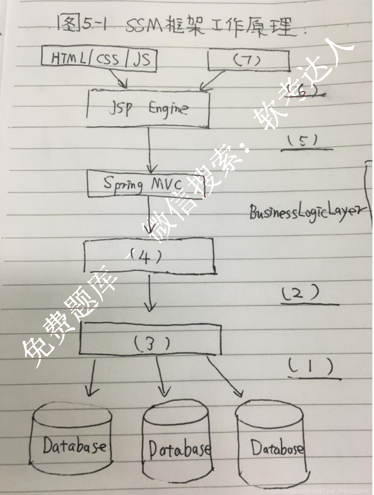
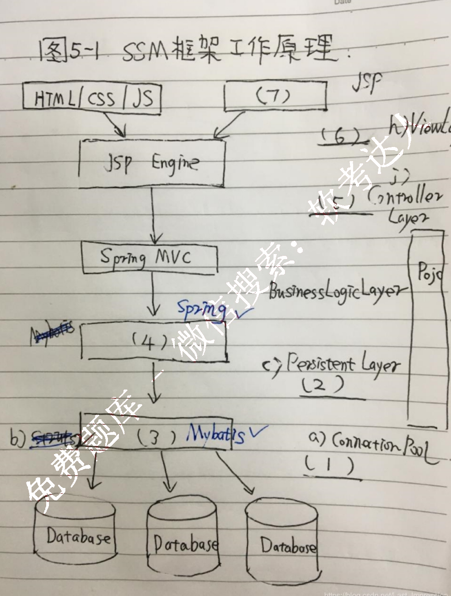

# 2020 年 系统架构设计师 · 案例分析真题

> 含参考答案与解析
>
> **来源**：本地购买扫描件《2020 年系统架构师真题（案例分析及答案解析）》（贡献者已购买并授权转录）
> **来源类型**：`real`
> **解析方式**：byted-las-document-parse（normal 模式）+ 机械清洗，已剔除页眉、广告条与页码
> **答案与解析**：取自随卷解析
> **使用建议**：可用于章节训练与年份模考；关键数字建议对照原始 PDF 复核
> **完整性**：案例分析 5 题齐备

## 试题一（质量属性）

某公司拟开发一套在线软件开发系统，支持用户通过浏览器在线进行软件开发活动。该系统的主要功能包括：我的编辑、语法高亮提示、代码编译、系统调试、代码仓库管理等，在需求分析与架构设计阶段，公司提出的需求和质量属性描述如下：

a) 根据用户的付费情况对用户进行分类，并根据类别提供相应的开发功能；
b) 在正常负载情况下，系统应该在 0.2s 内对用户的界面操作请求进行响应；
c) 系统应该具备完善的安全防护措施，能够对黑客的攻击行为进行检测和防御；
d) 系统主站点断电后应在 3s 内将请求重定向到备用站点；
e) 系统支持中文昵称，但用户名必须以字母开头，长度不少于 8 个字符；
f) 系统宕机后，需要在 15s 内发现错误，并启用备用系统；
g) 在正常负载情况下，用户的代码提交请求应在 0.5s 内完成；
h) 系统支持硬件设备灵活扩容，应保证在 2 人天内完成；
i) 系统需要针对代码仓库的所有操作进行详细记录，便于后期查阅与审计；
j) 更改系统 web 界面风格需要在 4 人天内完成；
k) 系统本身需要提供远程调试接口，支持开发团队进行远程排错。

在对系统需求质量属性和架构特性进行分析的基础上，该公司的系统架构师给了两种方案，分别是管道-过滤器风格和仓库风格。

### 【问题1】 (13 分)

请问该需求应该采用哪一种风格？表 1-1 是对这两种风格分别从数据处理方式、系统拓展方式和处理性能三个方面进行了比较，请填写表 1-1 中(1) ~ (4)处的空白。

### 【问题2】 (12 分)

请分析题干中的需求描述，填写图 1-2 中(1)~ (6)处的空白。

*（原图含机构广告或水印，已移除）*

*（原图含机构广告或水印，已移除）*

<table>
  <thead>
    <tr>
      <th>架构风格名称</th>
      <th>数据处理方式</th>
      <th>系统拓展性</th>
      <th>处理性能(劣势)</th>
      <th>处理性能(优势)</th>
    </tr>
  </thead>
  <tbody>
    <tr>
      <td>管道-过滤器</td>
      <td>数据驱动机制，处理流程事先确定，交互性差</td>
      <td>(2)</td>
      <td>需数据格式转换，性能降低</td>
      <td>支持开发调用，性能提高</td>
    </tr>
    <tr>
      <td>仓库</td>
      <td>(1)</td>
      <td>数据与处理解耦合，可动态添加或删除组件</td>
      <td>(3)</td>
      <td>(4)</td>
    </tr>
  </tbody>
</table>

【问题1 我的解答】
该需求应该采用仓库风格。
1) 以数据为中心，数据在中央节点，交互性好
2) 一个组件的输出是另一个组件的输入，数据与处理有相关性
3) 中心节点要求可靠性要高，出现故障的话影响整个系统
4) 添加或删除组件不改变其性能

【问题1 标准答案】
应该采用仓库风格

1) 模型驱动，处理流程事先不确定，交互性强
2) 数据与处理紧耦合，以接口适配方式实现扩展
3) 知识源之间不直接通讯，他们之间的交互只能通过黑板完成，性能较低
4) 更容易处理任务之间的协作，系统更加灵活，性能好

【问题2 我的解答】
1) 安全性
2) 可修改性
3) g
4) l
5) f
6) J

<table>
<thead>
<tr>
<th>No</th>
<th>场景描述</th>
<th>质量属性</th>
</tr>
</thead>
<tbody>
<tr>
<td>a</td>
<td>根据用户的付费情况对用户进行分类，并根据类别提供相应的开发功能</td>
<td>？-？安全性</td>
</tr>
<tr>
<td>b</td>
<td>在正常负载情况下，系统应该在0.2s内对用户的界面操作请求进行响应</td>
<td>性能</td>
</tr>
<tr>
<td>c</td>
<td>系统应该具备完善的安全防护措施，能够对黑客的攻击行为进行检测和防御</td>
<td>安全性</td>
</tr>
<tr>
<td>d</td>
<td>系统主站点断电后应在3s内将请求重定向到备用站点</td>
<td>可用性</td>
</tr>
<tr>
<td>e</td>
<td>系统支持中文昵称，但用户名必须以字母开头，长度不少于8个字符</td>
<td>？设计制约</td>
</tr>
<tr>
<td>f</td>
<td>系统宕机后，需要在15s内发现错误，并启用备用系统</td>
<td>可用性</td>
</tr>
<tr>
<td>g</td>
<td>在正常负载情况下，用户的代码提交请求应在0.5s内完成</td>
<td>性能</td>
</tr>
<tr>
<td>h</td>
<td>系统支持硬件设备灵活扩容，应保证在2人天内完成</td>
<td>可修改性</td>
</tr>
<tr>
<td>i</td>
<td>系统需要针对代码仓库的所有操作进行详细记录，便于后期查阅与审计</td>
<td>安全性</td>
</tr>
<tr>
<td>j</td>
<td>更改系统web界面风格需要在4人天内完成</td>
<td>可修改性</td>
</tr>
<tr>
<td>k</td>
<td>系统本身需要提供远程调试接口，支持开发团队进行远程排错</td>
<td>易测试性</td>
</tr>
</tbody>
</table>

【问题2 标准答案】
同上

【试题一心得体会】
这里第二问考查的是质量属性，就是送分题。这里我就不多说了。
第一问考查的是两种架构风格的比较。数据仓库和管道过滤器这两种风格。比较出来选择数据仓库。
数据仓库是模型驱动的，所以交互性强，但流程在事先是不确定的，它在数据处理方式的特点，和管道过滤器正好是相反的。
管道过滤器是紧耦合，因为这里的紧耦合，扩展是需要适配接口，而数据仓库是解耦合的，更加容易实现组件的追加和删除；
数据仓库单位性能较低，因为解耦之后组件也就是知识源之间无法直接调用，都需要通过黑板来完成，也正因为解耦，所以灵活性就比管道过滤器更加高效。
软件架构风格的优点缺点应用场景，特点等都需要搞清楚明白之后才可以。考查方式简单经典，但要拿全分还是需要背诵概念的。

## 试题二（数据库系统）

某企业委托软件公司开发包裹信息管理系统，以便于对该企业通过快递收发定位包裹信息进行统一管理。在系统设计阶段，需要对不同快递信息的包裹单信息进行建模，其中邮政包裹

单如下图所示。
图略

### 【问题1】

请说明关系型数据库开发中，逻辑数据模型设计过程包含哪些任务？根据图 2-1 包裹详情单应该设计出哪些关系模式的名称，并指出每个关系模式的主键属性。

### 【问题2】

请说明什么是超类实体，结合图中包裹单信息，试设计一种超类实体，给出完整的属性列表。

### 【问题3】

请说明什么是派生属性，结合图中包裹单信息，说明哪个属性是派生属性。

【问题 1 我的解答】
将 ER 图转化为关系表；
定义关系表的主键和外键；
定义关系表中元组的自定义完整性；
关系模式：
收件人（姓名，电话，单位名称，详细地址）；其中收件人电话是主键；
寄件人（姓名，电话，单位名称，详细地址，用户代码，邮政编码），其中寄件人电话是主键；
发件（寄件人电话，收件人电话，资费，重量，挂号费，保险费，回执单，总计）；寄件人电话和收件人电话的组合键是主键，而两者分别又是外键；

【问题 1 标准答案】
1) 确定数据模型
2) 将 ER 图转换为指定的数据模型
3) 确定完整性约束
4) 确定用户视图
设计的关系模式主要有：
1) 收件人信息，主键为电话号码；
2) 寄件人信息，主键为电话号码；
3) 包裹单信息，包裹单编号；
4) 快递员信息，员工编号；
5) 邮局站点信息，邮局编号；

【问题 2 我的解答】
超类实体就是包含了收件人、寄件人以及寄件所有需要信息的一个实体。这样超类实体包含了所有的信息，不在需要做关系表的连接。
发件（寄件人电话，…收件人电话，…资费，重量，挂号费，保险费，回执单，总计）；

【问题 2 标准答案】
将一些子实体所共有的属性抽象为一个单独的新实体，这个新的实体就是超类实体。
结合图中包裹单信息，设计一个人员信息的超类，人员信息（姓名，电话，单位名称，详细地址，邮政编码）；

【问题 3 我的解答】
派生属性是从其他关系表中的属性中派生出来的，依赖于其他属性，依赖的元属性发生变化

时，派生属性也会随之发生变化的属性。

总计就是派生属性，因为通过重量，资费，挂号费和保险费等可以计算出总价来。

【问题3 标准答案】
根据其他属性计算得出的属性就是派生属性。如快递包裹费用中的总计就是派生属性。

【心得体会】
1.此题是典型考查关系数据库的试题。逻辑数据模型设计的设计过程包含哪几个步骤，这个概念；没有背过这个概念只能通过自己的经验回答。
2.在这里我遗漏了首先要确定逻辑数据模型，和最后一步定义用户视图表示；
3.在设计的关系模式当中，我有了寄件人，发件人信息表，但是没有将快递员信息，包裹单信息，邮局站点信息给给识别出来；
4.第二问考查的是超类实体的概念，我这里瞎蒙错了。超类和面向对象中的父类，继承等有关系；子实体所共有的属性抽象为一个单独的新实体，这个新实体就是超类实体，比如寄件人信息和发件人信息这两个子实体中都有人员信息，那么新抽出的人员信息就是超类实体。
5.第三空考查了派生属性，还有类似的冗余属性等概念还有反规范化的概念结合起来记忆会比较好。
6.概念数据模型，物理数据模型的建模又可以分为几步，这里也可以扩展一下知识点。

## 试题四（Web 架构）

某互联网公司因业务发展需要建立网上平台，为用户提供一个对网络文化产品进行评论（小说，电影等）交流的平台，该平台的部分功能如下：
a) 用户帖子的评论计数器
b) 支持粉丝列表功能
c) 支持标签管理
d) 支持共同好友功能
e) 提供排名功能
f) 用户的信息结构化存储
g) 提供好友信息的发布订阅功能

该系统在性能上需要考虑高性能，并发以支持大量的用户同时访问，经过考虑在数据管理上，决定采用 Redis 数据库的解决方案。

### 【问题1】

Redis 支持丰富的类型，请选择题干描述的 a-g 功能选项，填入表 4-1 中 1-5 的空白处。

### 【问题2】

缓存中存储当前的热点数据，Redis 为每个 key 值都设置了过期时间，以提高缓存命中率，为了消除非热点数据，Redis 选择了定期删除加惰性删除策略。如果该策略失效，Redis 内存的使用率会越来越高，一般采用内存淘汰机制来解决，请用 100 字以内的文字，简要描述该策略的失效场景，并给出三种内存淘汰机制。

<table>
<thead>
<tr>
<th>数据类型</th>
<th>存储的值</th>
<th>可实现的业务功能</th>
</tr>
</thead>
<tbody>
<tr>
<td>String</td>
<td>字符串等</td>
<td>（1）</td>
</tr>
<tr>
<td>List</td>
<td>列表</td>
<td>（2）</td>
</tr>
<tr>
<td>Set</td>
<td>无序集合</td>
<td>（3）</td>
</tr>
<tr>
<td>Hash</td>
<td>包括键值对的无序列表</td>
<td>（4）</td>
</tr>
<tr>
<td>ZSet</td>
<td>有序集合</td>
<td>（5）</td>
</tr>
</tbody>
</table>

【问题1 我的解答】
a) 用户帖子的评论计数器 （String）
b) 支持粉丝列表功能（List）
c) 支持标签管理（Hash）
d) 支持共同好友功能（Set）
e) 提供排名功能（ZSet）
f) 用户的信息结构化存储（Set）
g) 提供好友信息的发布订阅功能（Hash）
1）a
2）b
3）d, f
4）c, g
5）e

【问题1 标准答案】
1）a
2）b
3）c, d
4）f
5）e

【问题2 我的解答】
三种内存淘汰机制：
1）最久没有被访问数据淘汰
给出最近一次访问的时间戳，当需要淘汰时，访问每个数据的上一次访问的时间戳，当时间戳为空，或者最为久远时，该数据就淘汰。
2）定期未命中数据淘汰策略
一定时间内对于没有被访问的数据，采用定期淘汰的策略，淘汰出内存数据库；
3）最少使用数据淘汰策略
给访问数据的次数记上标志位，访问一次标志位加1；标志位初始值为0，标志位最小的数据先淘汰；

【问题2 标准答案】
由于 Redis 的定期删除是定期性轮询 Redis 中的时效性数据，采用随机抽取的策略，利用过期数据占比的方式控制删除频度，不可能扫描清除掉所有过期的 Key 并删除，而惰性策略就是在客户端访问这个 key 的时候，对过期时间进行检查，如果过期了就立刻删除。

如果一些 key 定期删除没有抽取到，惰性删除也没有触发，这样 Redis 的内存占比会越来越高，此时就系要内存淘汰机制。

常用的内存淘汰机制
1) 从已设置的过期时间的数据集中挑选最近最少使用的数据淘汰
2) 从已设置的过期时间的数据集中挑选将要过期数据淘汰
3) 从已设置的过期时间的数据集中随机任意选择数据淘汰
4) 从已设置的过期时间的数据集挑选使用频率最低的数据淘汰
5) 从数据集中挑选最近最少使用的数据淘汰
6) 从数据集中挑选使用频率最低的数据淘汰
7) 从数据集中挑选任意数据淘汰
8) 禁止驱逐数据，这也是默认策略

【心得体会】
1.此题考察的是 Redis 的相关知识。第一问看似送分题，但其实也没有那么简单。
2.支持标签管理需要使用 Set; 这里的标签应该是所有标签的列表，也不需要顺序，所有使用无序集合 Set;
3.用户的信息结构化存储，首先每个用户是集合数据，多个用户需要保存而且通过用户 ID 或者类似 key 就要找到用户信息，所以使用 Hash 是妥当的。
4.第二问就是考查了 Redis 中的失效场景以及如何使用内存淘汰机制来解决这里的失效场景。在这里内存失效淘汰策略可以联系上计算机组成原理中的页面淘汰算法,常见算法有最近最少使用，随机访问，淘汰使用频率最低，禁止淘汰等;
5.以上这些算法策略都是针对 Redis 中所有的缓存数据，但在这里还有一个过期时间，针对过期时间的数据，又可以选择随机淘汰，最近最少淘汰，频率低淘汰，还可以淘汰即将过期的数据。

第五题（Web 架构设计）
开发基于 Web 的工业设备检测系统，以实现对多种工业数据的分类采集，运行状态检测以及相关信息的管理，该系统应具备的功能如下：
现场设备状态采集功能: 根据数据类型对设备检测指标状态信号进行分类采集。
设备采集数据传输功能: 采用可靠传输技术, 实现将设备数据从制造现场传输到系统后台设备检测。
显示功能: 对设备的运行状态工作以及报警状态进行检测并提供相应的图形化界面。
设备信息管理功能: 支持设备运行历史状态，报警记录和参数信息的查询。
同时该系统还需要满足以下非功能性需求:
a) 系统应支持大于 100 个工业设备的运行检测
b) 设备数据从制造现场传输到系统后台传输时间小于 1s;
c) 系统应该 7×24 小时运行
d) 可抵御 XSS 攻击
e) 系统在故障情况下，应在 0.5 小时内恢复
f) 支持数据审计
面对系统需求, 公司召开了项目讨论会议, 制定系统设计方案, 最终决定使用三层拓扑结构,即现场设备数据采集层，Web 检测服务层和前端 Web 显示层。

### 【问题1】

按照性能，安全性和可用性三种非功能需求分类，将题干的 a-f 填入 1-3; 非功能性需求归

类表

非功能性需求类别 非功能性需求
性能 （1）
安全性 （2）
可用性 （3）

### 【问题2】

该系统 Web 检测服务层拟采用 SSM 框架进行系统研发，SSM 的工作流程图如图所示。请从下面给出的 a-k 中进行选择，补充完善图 5-1 中 1-7 处空白的内容

a) Connection pool
b) Struts2
c) Persistent layer
d) MyBatis
e) HTTP
f) MVC
g) Kafka
h) Viewlayer
i) jsp
j) Controller Layer
k) Spring

### 【问题3】

该工业设备检测系统拟采用工业控制领域中统一的数据访问机制，实现与各种不同设备的数据交互。请用 100 以内的文字说明，采用标准的数据访问机制的原因。

【问题1 我的解答】

<table>
<thead>
<tr>
<th>需求</th>
<th>需求分类</th>
</tr>
</thead>
<tbody>
<tr>
<td>系统应支持大于100个工业设备的运行检测</td>
<td>性能</td>
</tr>
<tr>
<td>设备数据从制造现场传输到系统后台传输时间小于1s</td>
<td>性能</td>
</tr>
<tr>
<td>系统应该7*24小时运行</td>
<td>可用性</td>
</tr>
<tr>
<td>可抵御XSS攻击</td>
<td>安全性</td>
</tr>
<tr>
<td>系统在故障情况下，应在0.5小时内恢复</td>
<td>可用性</td>
</tr>
<tr>
<td>支持数据审计</td>
<td>安全性</td>
</tr>
</tbody>
</table>

1) a, b
2) d, f
3) c, e

【问题1 标准答案】
同上

【问题2 我的解答】
1) a
2) c
3) b
4) d
5) j
6) h
7) i

【问题2 标准答案】
1) a
2) c
3) d

4) k
5) j
6) h
7) i

【问题3 我的解答】
各种不同设备的数据交互变得容易
更加容易导入可靠性传输技术；
更加容易对数据的分类采集；

【问题3 标准答案】
采用标准的数据访问机制，可以屏蔽不同设备之间数据交互的差异，解决系统使用数据不一致性；在一定程度上降低了数据结构与应用系统的耦合度，减少了应用系统的维护工作量；

【心得体会】
1.比较简单的一道题。感觉第一问和第二问都是送分题。唯独第二问中空3和空4我选错了。Mybatis 可以直接联系数据库，而 Spring 下面连接的是数据持久层。
2.第三问的优点：屏蔽设备差异，解决数据不一致，降低耦合，减少维护工作量。这些好像都不需要联系案例背景的。其实这里有点像面向服务的特征：减少耦合，减少维护工作量不就是来自 SOA 嘛
*（原图含机构广告或水印，已移除）*
