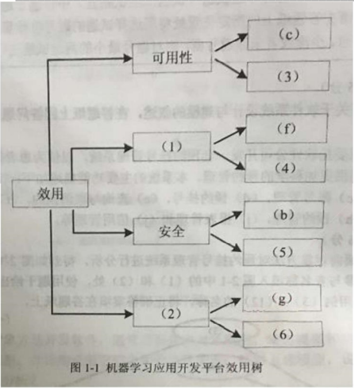
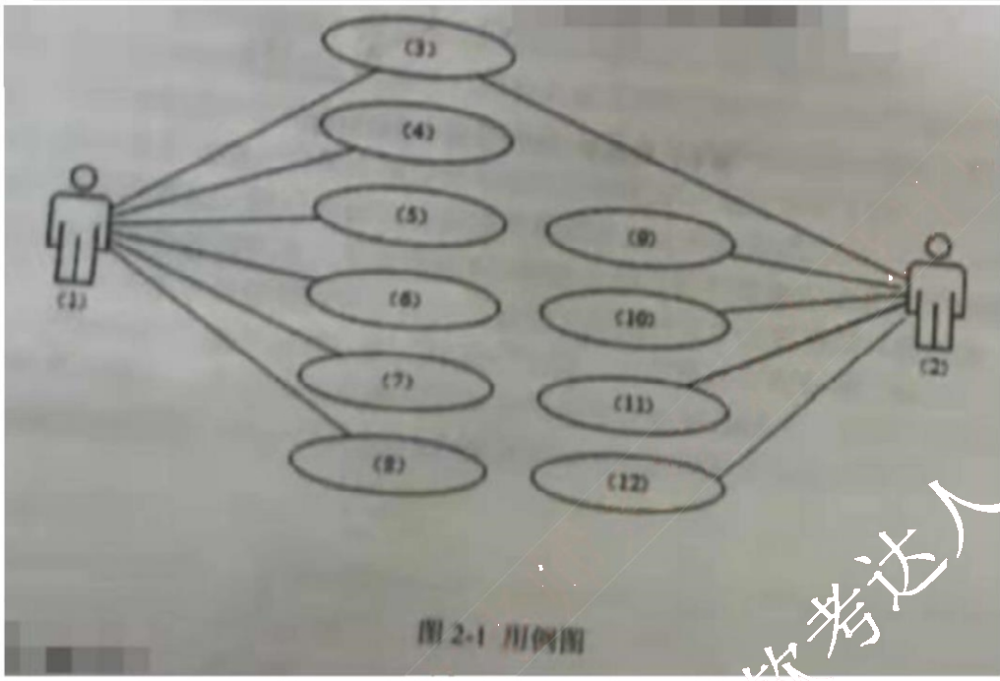
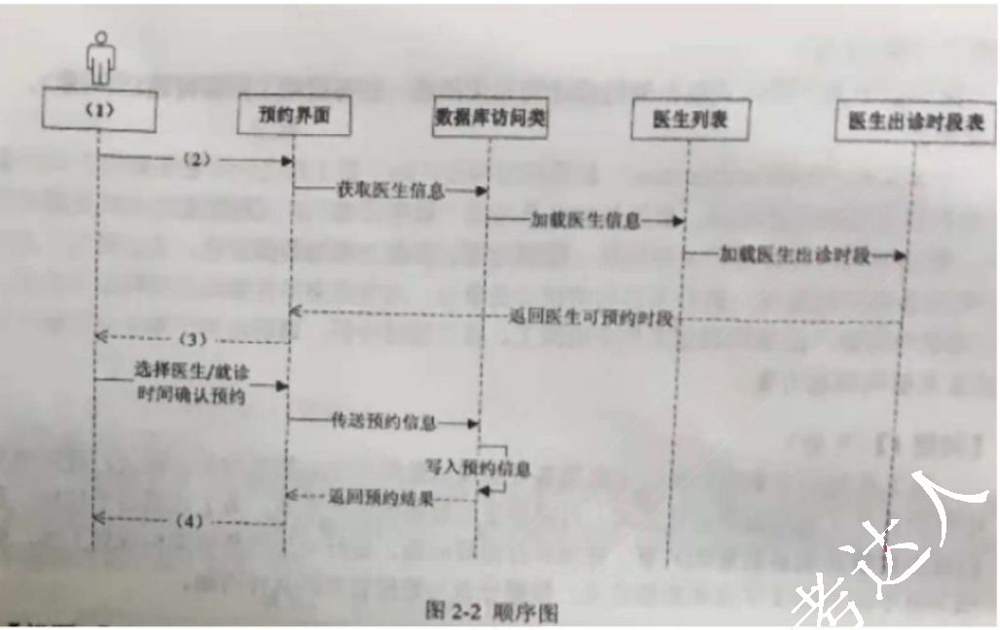
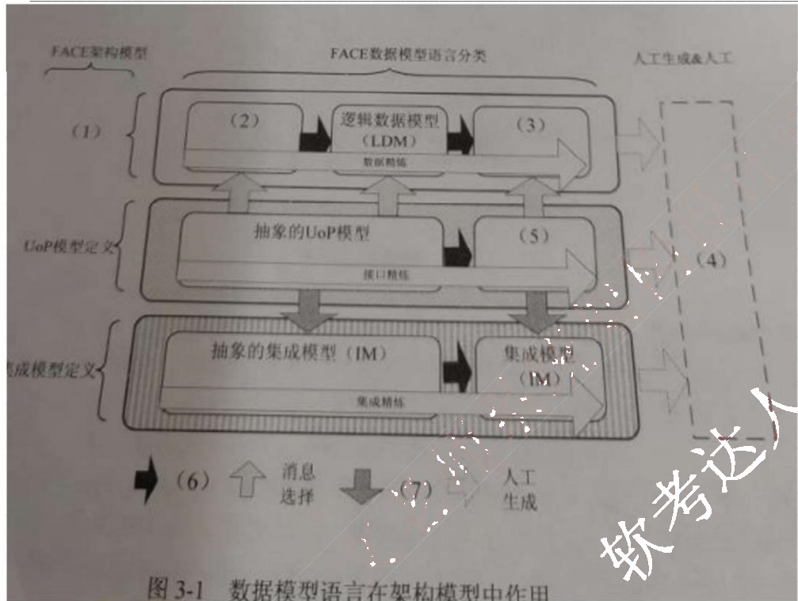

# 2021 年下半年 系统架构设计师 · 案例分析真题

> 试题一至五，各 25 分；含参考答案
>
> **来源**：本地购买扫描件《2021.11 系统架构设计师真题及解析》（贡献者已购买并授权转录）
> **来源类型**：`real`
> **解析方式**：byted-las-document-parse（normal 模式）+ 机械清洗，已剔除页眉、广告条与页码
> **答案与解析**：取自该卷解析
> **使用建议**：可用于章节训练与年份模考；关键数字建议对照原始 PDF 复核
> **完整性**：案例分析 5 题齐备

## 试题一（共 25 分）
> **题型**：案例 01 · 架构评估（ATAM）

阅读以下关于软件架构设计与评估的叙述，在答题纸上回答问题 1 和问题 2。

### 【说明】

某公司拟开发一套机器学习应用开发平台，支持用户使用浏览器在线进行基于机器学习的智能应用开发活动。该平台的核心应用场景是用户通过拖拽算法组件灵活定义机器学习流程，采用自助方式进行智能应用设计、实现与部署，并可以开发新算法组件加入平台中。在需求分析与架构设计阶段，公司提出的需求和质量属性描述如下：

(a) 平台用户分为算法工程师、软件工程师和管理员等三种角色，不同角色的功能界面有所不同；
(b) 平台应该具备数据库保护措施，能够预防核心数据库被非授权用户访问；
(c) 平台支持分布式部署，当主站点断电后，应在 20 秒内将请求重定向到备用站点；
(d) 平台支持初学者和高级用户两种界面操作模式，用户可以根据自己的情况灵活选择合适的模式；
(e) 平台主站点宕机后，需要在 15 秒内发现错误并启用备用系统；
(f) 在正常负载情况下，机器学习流程从提交到开始执行，时间间隔不大于 5 秒；
(g) 平台支持硬件扩容与升级，能够在 3 人天内完成所有部署与测试工作；
(h) 平台需要对用户的所有操作过程进行详细记录，便于审计工作；
(i) 平台部署后，针对界面风格的修改需要在 3 人天内完成；
(j) 在正常负载情况下，平台应在 0.5 秒内对用户的界面操作请求进行响应；
(k) 平台应该与目前国内外主流的机器学习应用开发平台的界面风格保持一致；
(l) 平台提供机器学习算法的远程调试功能，支持算法工程师进行远程调试。

在对平台需求、质量属性描述和架构特性进行分析的基础上，公司的架构师给出了三种候选的架构设计方案，公司目前正在组织相关专家对平台架构进行评估。

### 【问题 1】(9 分)

在架构评估过程中，质量属性效用树（utility tree）是对系统质量属性进行识别和优先级排序的重要工具。请将合适的质量属性名称填入图 1-1 中(1)、(2)空白处，并从题干中的(a)~(l)中选择合适的质量属性描述，填入(3)~(6)空白处，完成该平台的效用树。

图1-1 机器学习应用开发平台效用树

### 【问题2】 (16分)

针对该系统的功能，赵工建议采用解释器(interpreter)架构风格，李工建议采用管道-过滤器(ppe-and-hlter)的架构风格，王工则建议采用隐式调用(implicit invocation)架构风格。请针对平台的核心应用场景，从机器学习流程定义的灵活性和学习算法的可扩展性两个方面对三种架构风格进行对比与分析，并指出该平台更适合采用哪种架构风格。

答案：

### 【问题1】

1. 性能
2. 可修改性
3. e
4. j
5. h
6. i

### 【问题2】

应采取解释器风格。

（1）解释器风格是自定义了一套规则供使用者使用，使用者基于这个规则来开发构件，能够跨平台适配。

（2）管道-过滤器风格每个构件都有一组输入和输出，构件读取输入的数据流，经过内部处理（计算或增值），产生输出数据流。前一个构件的输出作为后一个构件的输入，前后数据流关联。过滤器就是构件，连接件就是管道。

（3）隐式调用风格是构件不直接调用一个过程，而是触发或广播一个或多个事件。构件中的过程在一个或多个事件中注册，当某个事件被触发时，系统自动调用在这个事件中注册的所有过程。一个事件的触发就导致了另一个模块中的过程调用。

平台支持初学者和高级用户两种界面操作模式，用户可以根据自己的情况灵活选择合适的模式：

从灵活性上解释器可以通过灵活的自定义规则实现规则的重组。

从可扩展性上解释器可以包括一个完成解释工作的解释引擎、一个包含将被解释的代码的存储区、一个记录解释引擎当前工作状态的数据结构，以及一个记录源代码被解释执行的进度的数据结构。可以通过新建规则实现可扩展性。

解析：本题的题型和我考前发布的案例冲刺题预测类似，可以猜测以后架构第一题就是这种题型了，质量属性+架构风格对比，对架构学员来说是一件好事，以后有了主攻方向，案例会更简单。本题问题一没问题，问题二就看个人发挥了，整体拿18分应该没问题。

## 试题二(共 25 分)
> **题型**：案例 04 · UML 用例与类建模

阅读以下关于软件系统设计与建模的叙述，在答题纸上回答问题 1 至问题 3。

## 【说明】
某医院拟委托软件公司开发一套预约挂号管理系统，以便为患者提供更好的就医体验，为医院提供更加科学的预约管理。本系统的主要功能描述如下：
(a)注册登录，(b)信息浏览，(c)账号管理，(d)预约挂号，(e)查询与取消预约，(F)号源管理，(g)报告查询，(h)预约管理，(i)报表管理和(j)信用管理等。

## 【问题 1】(6 分)
若采用面向对象方法对预约挂号管理系统进行分析，得到如图 2-1 所示的用例图。请将合适的参与者名称填入图 2-1 中的(1)和(2)处，使用题干给出的功能描述(a)~(j)，完善用例(3)~(12)的名称，将正确答案填在答题纸上。

### 【问题2】 (10 分)

预约人员(患者)登录系统后发起预约挂号请求，进入预约界面。进行预约挂号时使用数据库访问类获取医生的相关信息，在数据库中调用医生列表，并调取医生出诊时段表，将医生出诊时段反馈到预约界面，并显示给预约人员；预约人员选择医生及就诊时间后确认预约，系统返回预约结果，并向用户显示是否预约成功。

采用面向对象方法对预约挂号过程进行分析，得到如图 2-2 所示的顺序图，使用题干中给出的描述，完善图 2-2 中对象(1)，及消息(2)~(4)的名称，将正确答案填在答题纸上请简要说明在描述对象之间的动态交互关系时，协作图与顺序图存在哪些区别。

### 【问题3】 (9分)

采用面向对象方法开发软件，通常需要建立对象模型、动态模型和功能模型，请分别介绍这3种模型，并详细说明它们之间的关联关系，针对上述模型，说明哪些模型可用于软件的需求分析？

答案：

### 【问题1】

(1) 系统管理员 (2) 患者
(3) a (4) c (5) f (6) h (7) i (8) j
(9) b (10) d (11) e (12) g
(4)-(8)答案可互换。(9)-(12)答案可互换。

### 【问题2】

(1) 预约人员 (2) 发起预约挂号请求 (3) 显示医生出诊时段 (4) 显示是否预约成功
顺序图强调交互的消息时间顺序。

协作图强调接受和发送消息的对象的结构组织，强调通信的方式。

### 【问题3】

对象模型描述系统中对象的静态结构、对象之间的关系、属性和操作，主要用对象图来实现。

动态模型描述与时间和操作顺序有关的系统特征，例如，激发事件、事件序列、确定事件先后关系的状态等，主要用状态图来实现。

功能模型描述一个计算如何从输入值得到输出值，它不考虑计算的次序，主要用DFD来实现。

功能模型指发生了什么，动态模型确定什么时候发生，而对象模型确定发生的客体。

对象设计建立基于分析模型的设计模型并考虑实现细节，可用于软件的需求分析。

解析：本题也在我们考前发布的案例冲刺题里能找到类似题型，问题1和问题2是很容易的，问题3的三个模型没详细说过，需要自己顾名思义去发散，整体拿18分应该可以。

## 试题三(共 25 分)
> **题型**：案例 02 · 数据库设计（ER + 规范化）

阅读以下关于嵌入式数据架构设计的相关描述，在答题纸上回答问题1至问题3。

【说明】
数据架构(Data architecture)是系统架构设计的主要工作之一。它主要用于描述业务数据以及数据间的关系。数据架构着重考虑“数据需求”，关注的是持久化数据的组织，数据架构的设计过程主要包括：数据定义、数据分布与数据管理。某公司为了适应宇航装备的持续发展，提升本公司的核心竞争力，改变原来事件驱动的架构设计模式。公司领导将新产品架构规划工作交给张工。张工经过分析、调研给出了本企业宇航产品的未来架构规划方案。

### 【问题1】 (9分)

张工在规划方案中指出：宇航装备要实现以数据为中心的架构设计模式，就应改变传统的各个子系统独立设计方式，打破原宇航装备的生产关系。为了达到这个目标，我们首先要解决装备数据的共享、管理和存储等问题，做好顶层的数据架构规划工作。请用300字以内的文字说明数据定义、数据分布与数据管理的具体内涵。

### 【问题2】 (7分)

张工在规划方案中提出公司未来产品设计要遵从一种开放式的架构体系，并在此基础上完善数据架构的设计工作，形成一套规格化的数据模型语言。张工给出了基于FACE(Future Airborne Capability Environment)架构的新产品架构，其中，图3-1说明了数据模型语言在架构模型中作用。

答案：

### 【问题1】

### 【问题2】

解析：题目不全，暂无答案，待补充，从已有信息来看，本题不应该选。

## 试题四（共25分）
> **题型**：案例 09 · 大数据 / Web 架构设计

阅读以下关于数据库设计的叙述，在答题纸上回答问题1至问题3。

【说明】
某医药销售企业因业务发展，需要建立线上药品销售系统，为用户提供便捷的互联网药品销售服务。该系统除了常规药品展示、订单、用户交流与反馈功能外，还需要提供当前热销产品排名、评价分类管理等功能。

通过对需求的分析，在数据管理上初步决定采用关系数据库（MySQL）和数据库缓存（Redis）的混合架构实现。

经过规范化设计之后，该系统的部分数据库表结构如下所示。

供应商（供应商ID，供应商名称，联系方式，供应商地址）；

药品（药品ID，药品名称，药品型号，药品价格，供应商ID）；

药品库存（药品ID，当前库存数量）；

订单（订单号码，药品ID，供应商ID，药品数量，订单金额）；

### 【问题1】 （9 分）

在系统初步运行后，发现系统数据访问性能较差。经过分析，刘工认为原来数据库规范化设计后，关系表过于细分，造成了大量的多表关联查询，影响了性能。例如当用户查询商品信息时，需要同时显示该药品的信息、供应商的信息、当前库存等信息。

为此，刘工认为可以采用反规范化设计来改造药品关系的结构，以提高查询性能。修改后的药品关系结构为：

药品（药品 ID，药品名称，药品型号，药品价格，供应商 ID，供应商名称，当前库存数量）；

请用 200 字以内的文字说明常见的反规范化设计方法，并说明用户查询商品信息应该采用哪种反规范化设计方法。

### 【问题2】 （9 分）

王工认为，反规范化设计可提高查询的性能，但必然会带来数据的不一致性问题。请用 200 字以内的文字说明在反规范化设计中，解决数据不一致性问题的三种常见方法，并说明该系统应该采用哪种方法。

### 【问题3】 （7 分）

该系统采用了 Redis 来实现某些特定功能（如当前热销药品排名等），同时将药品关系数据放到内存以提高商品查询的性能，但必然会造成 Redis 和 MySQL 的数据实时同步问题。

（1）Redis 的数据类型包括 String、Hash、List、Set 和 ZSet 等，请说明实现当前热销药品排名的功能应该选择使用哪种数据类型。

（2）请用 200 字以内的文字解释说明解决 Redis 和 MySQL 数据实时同步问题的常见方案。

答案：

### 【问题1】

常见反规范化技术如下：

（1）增加冗余列：在多个表中保留相同的列，通过增加数据冗余减少或避免查询时的连接操作。

（2）增加派生列：在表中增加可以由本表或其它表中数据计算生成的列，减少查询时的连接操作并避免计算或使用集合函数。

（3）重新组表：如果许多用户需要查看两个表连接出来的结果数据，则把这两个表重新组成一个表来减少连接而提高性能。

（4）水平分割表：根据一列或多列数据的值，把数据放到多个独立的表中，主要用于表数据规模很大、表中数据相对独立或数据需要存放到多个介质上时使用。

（5）垂直分割表：对表进行分割，将主键与部分列放到一个表中，主键与其它列放到另一个表中，在查询时减少 I/O 次数。

用户查询商品信息采用的是增加冗余列的方式。

### 【问题2】

批处理维护、应用逻辑和触发器。

（1）批处理维护：指对复制列或派生列的修改积累一定的时间后，运行一批处理作业或存储过程对复制或派生列进行修改，这只能在对实时性要求不高的情况下使用。

（2）应用逻辑：要求必须在同一事务中对所有涉及的表进行增、删、改操作。用应用逻辑来实现数据的完整性风险较大，因为同一逻辑必须在所有的应用中使用和维护，容易遗漏，特别是在需求变化时，不易于维护。

（3）触发器：对数据的任何修改立即触发对复制列或派生列的相应修改。触发器是实时的，而且相应的处理逻辑只在一个地方出现，易于维护。一般来说，是解决这类问题比较好的办法。

该系统应该采用触发器。

### 【问题3】

（1）ZSet

（2）一、对强一致要求比较高的，应采用实时同步方案，即查询缓存查询不到再从 DB 查询，保存到缓存；更新缓存时，先更新数据库，再将缓存的设置过期（建议不要去更新缓存内容，直接设置缓存过期）。

二、对于并发程度较高的，可采用异步队列的方式同步，可采用 kafka 等消息中间件处理消息生产和消费。

三、使用阿里的同步工具 canal，canal 实现方式是模拟 mysql slave 和 master 的同步机制，监控 DB bitlog 的日志更新来触发缓存的更新，此种方法可以解放程序员双手，减少工作量，但在使用时有些局限性。

四、采用 UDF 自定义函数的方式，面对 mysql 的 API 进行编程，利用触发器进行缓存同步。

解析：本题可以选，不过只能拿低分，只有问题一是有把握的，问题二、三就要看缘分，整体可能只能得到 10-12 分左右。

## 试题五（共25分）
> **题型**：案例 08 · 嵌入式 / 构件组装

阅读以下关于Web系统架构设计的叙述，在答题纸上回答问题1至问题3。

【说明】
某公司拟开发一个智能家居管理系统，该系统的主要功能需求如下：
1）用户可使用该系统客户端实现对家居设备的控制，且家居设备可向客户端反馈实时状态；
2）支持家居设备数据的实时存储和查询；
3）基于用户数据，挖掘用户生活习惯，向用户提供家居设备智能化使用建议。

基于上述需求，该公司组建了项目组，在项目会议上，张工给出了基于家庭网关的传统智能家居管理系统的设计思路，李工给出了基于云平台的智能家居系统的设计思路。经过深入讨论，公司决定采用李工的设计思路。

### 【问题1】 （8分）

请用400字以内的文字简要描述基于家庭网关的传统智能家居管理系统和基于云平台的智能家居管理系统在网关管理、数据处理和系统性能等方面的特点，以说明项目组选择李工设计思路的原因。

### 【问题2】 （12分）

请从下面给出的（a）~（j）中进行选择，补充完善图5-1中空（1）~（6）处的内容，协助李工完成该系统的架构设计方案。

*（原图含机构广告或水印，已移除）*

（a）Wi-FI

（b）蓝牙
（c）驱动程序
（d）数据库
（e）家庭网关
（f）云平台
（g）微服务
（h）用户终端
（i）鸿蒙
（j）TCP/IP

### 【问题3】 （5分）

该系统需实现用户终端与服务端的双向可靠通信，请用300字以内的文字从数据传输可靠性的角度对比分析TCP和UDP通信协议的不同，并说明该系统应采用哪种通信协议。

答案：

### 【问题1】

在网关管理方面，基于云平台的智能家居管理系统可以将分散的智能家居网关数据集中起来,实现对智能家居网关的远程高效管理。
在数据处理方面，云端服务器对智能家居网关数据进行备份存储,当家庭网关由于故障等原因导致数据丢失时,可以通过云端管理系统对网关数据进行恢复,从而提高数据的容灾性。
在系统性能方面，基于云服务平台的智能家居管理系统将数据信息存储在云端，减少了数据请求时间，提高了通信效率。

### 【问题2】

(1) h 用户终端 (2) i 鸿蒙 (3) f 云平台 (4) d 数据库 (5) e 家庭网关 (6) c 驱动程序

### 【问题3】

TCP 在 IP 协议提供的不可靠数据服务的基础上，采用了重发技术，为应用程序提供了一个可靠的、面向连接的、全双工的数据传输服务。TCP 协议一般用于传输数据量比较少，且对可靠性要求高的场合。
UDP 是一种不可靠的、无连接的协议，可以保证应用程序进程间的通信，与 TCP 相比，UDP 是一种无连接的协议，它的错误检测功能要弱得多。
该系统应采用 TCP 协议

解析：本题应该选，典型的选图填空题，而且也有熟悉的知识点，整体可以拿15分以上。
