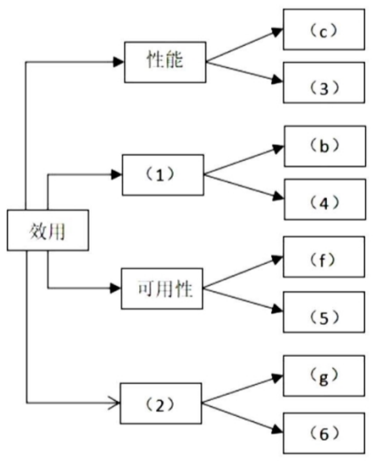
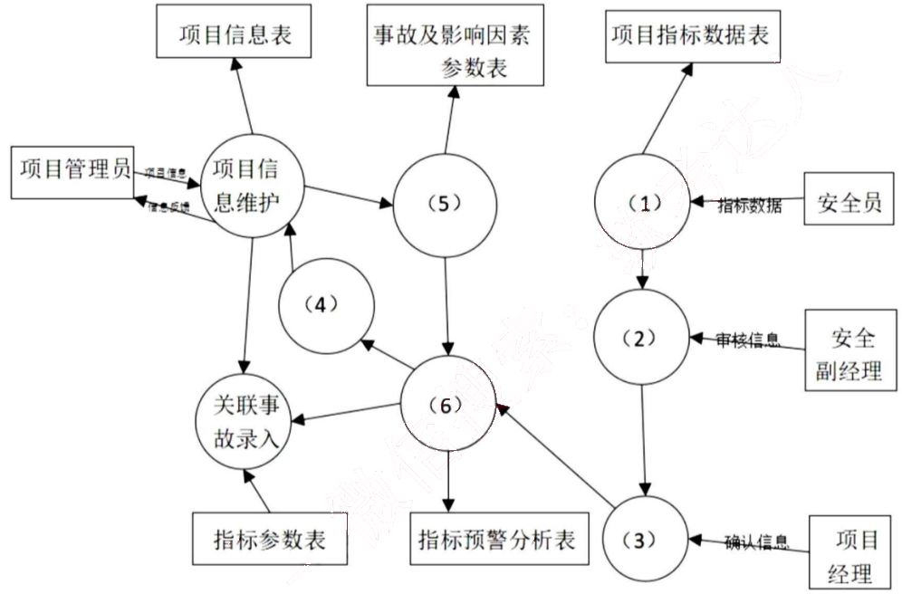
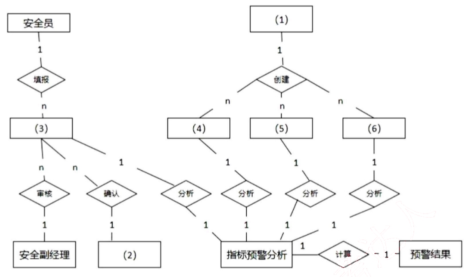
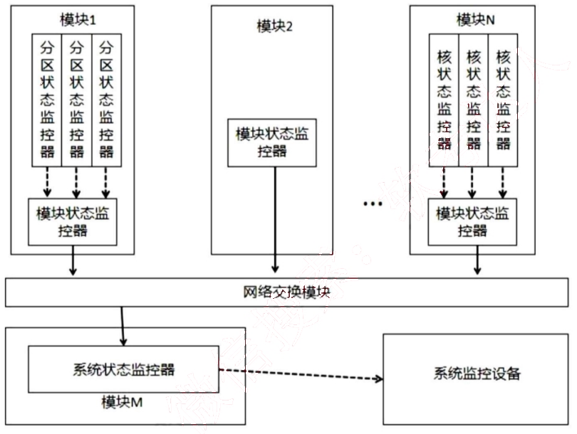
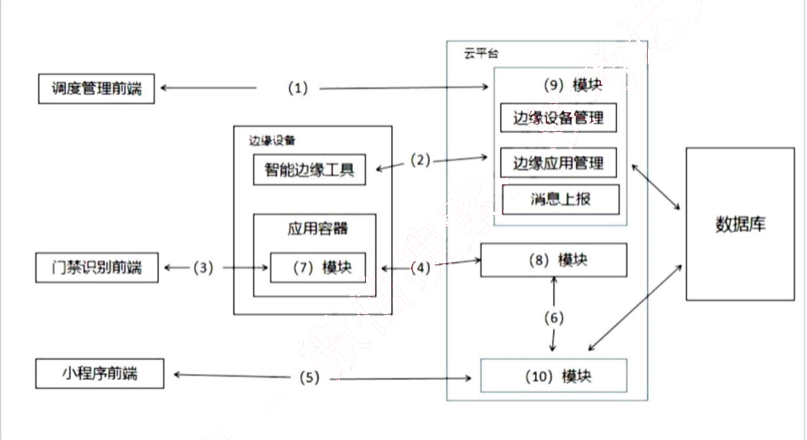

# 2022 年 系统架构设计师 · 案例分析真题

> 试题一必答 + 试题二至五选答 2 道；文末附参考答案与解析
>
> **来源**：本地购买扫描件《2022 年系统架构设计师真题-案例分析》+《2022 年系统架构设计师真题-答案解析》（贡献者已购买并授权转录）
> **来源类型**：`real`
> **解析方式**：byted-las-document-parse（normal 模式）+ 机械清洗，已剔除页眉、广告条与页码
> **答案与解析**：题干取自原卷；参考答案与解析取自同卷答案解析
> **使用建议**：可用于案例专项训练与年份模考；关键数字建议对照原始 PDF 复核
> **完整性**：案例分析 5 题齐备，参考答案见文末附录

## 试题一(共25分)
> **题型**：案例 01 · 架构评估（ATAM）

阅读以下关于软件架构设计与评估的叙述， 在答题纸上回答问题1和问题2。

【说明】

某电子商务公司拟升级其会员与促销管理系统，向用户提供个性化服务，提高用户的粘性。在项目立项之初，公司领导层一致认为本次升级的主要目标是提升会员管理方式的灵活性， 由于当前用户规模不大，业务也相对简单，系统性能方面不做过多考虑，新系统除了保持现有的四级固定会员制度外，还需要根据用户的消费金额、偏好、重复性等相关特征动态调整商品的折扣力度，并支持在特定的活动周期内主动筛选与活动主题高度相关的用户集合，提供个性化的打折促销活动。

在需求分析与架构设计阶段， 公司提出的需求和质量属性描述如下：

(a)管理员能够在页面上灵活设置折扣力度规则和促销活动逻辑，设置后即可生效；(b)系统应该具备完整的安全防护措施，支持对恶意攻击行为进行检测与报警；
(c)在正常负载情况下， 系统应在 0.3 秒内对用户的界面操作请求进行响应；
(d)用户名是系统唯一标识，要求以字母开头，由数字和字母组合而成，长度不少于6个字符。
(e)在正常负载情况下， 用户支付商品费用后在 3 秒内确认订单支付信息；
(f)系统主站点电力中断后， 应在 5 秒内将请求重定向到备用站点；
(g)系统支持横向存储扩展， 要求在 2 人天内完成所有的扩展与测试工作；
(h)系统宕机后， 需要在 10 秒内感知错误， 并自动启动热备份系统；
(i)系统需要内置接口函数， 支持开发团队进行功能调试与系统诊断；
(j)系统需要为所有的用户操作行为进行详细记录， 便于后期查阅与审计；
(k)支持对系统的外观进行调整和配置， 调整工作需要在 4 人天内完成。

在对系统需求、质量属性描述和架构特性进行分析的基础上，系统架构师给出了两种候选的架构设计方案，公司目前正在组织相关专家对系统架构进行评估。

### 【问题1】 (12 分)

在架构评估过程中，质量属性效用树 (utility tree)是对系统质量属性进行识别和优先级排序的重要工具。请将合适的质量属性名称填入图 1-1 中(1)、(2)空白处， 并选择题干描述的(a)~(k)填入(3)~(6)空白处，完成该系统的效用树。

*（原图含机构广告或水印，已移除）*

图1-1 会员与促销管理系统效用树

### 【问题2】 (13 分)

针对该系统的功能，李工建议采用面向对象的架构风格，将折扣力度计算和用户筛选分别封装为独立对象，通过对象调用实现对应的功能；王工则建议采用解释器(interpreters) 架构风格，将折扣力度计算和用户筛选条件封装为独立的规则，通过解释规则实现对应的功能。请针对系统的主要功能，从折扣规则的可能改性、个性化折扣定义灵活性和系统性能三个方面对这两种架构风格进行比较与分析，并指出该系统更适合采用哪种架构风格。

## 试题二(共 25 分)
> **题型**：案例 04 · UML 建模与分析

阅读以下关于软件系统设计与建模的叙述， 在答题纸上回答问题1 至问题 3。

【说明】

煤炭生产是国民经济发展的主要领域之一，其煤矿的安全非常重要。某能源企业拟开发一套煤矿建设项目安全预警系统，以保护煤矿建设项目从业人员生命安全。本系统的主要功能包括如下(a)~(h)所述。

(a)项目信息维护
(b)影响因素录入
(c)关联事故录入
(d)安全评价得分
(e)项目指标预警分析
(f)项目指标填报

(g) 项目指标审核
(h) 项目指标确认

### 【问题1】 (9 分)

王工根据煤矿建设项目安全预警系统的功能要求，设计完成了系统的数据流图，如图 2-1 所示。请使用题干中描述的功能(a)~(h)，补充完善空(1)~(6)处的内容，并简要介绍数据流图在分层细化过程中遵循的数据平衡原则。

图 2-1 煤矿建设项目安全预警系统数据流图

### 【问题2】 (9 分)

请根据【问题1】中数据流图表示的相关信息，补充完善煤矿建设项目安全预警系统总体 ER图(见图2-2)中实体(1)~(6)的具体内容，将正确答案填在答题纸上。

图 2-2 煤矿建设项目安全预警系统总体 E-R 图

### 【问题3】 (7 分)

在结构化分析和设计过程中，数据流图和数据字典是常用的技术手段，请用 200 字以内的文字简要说明它们在软件需求分析和设计阶段的作用。

## 试题三（25 分）
> **题型**：案例 13 · 可靠性与容灾设计

阅读以下关于嵌入式系统故障检测和诊断的相关描述，在答题纸上回答问题 1 至问题 3。

【说明】
系统的故障检测和诊断是宇航系统提高装备可靠性的主要技术之一，随着装备信息化的发展，分布式架构下的资源配置越来越多、资源布局也越来越分散，这对系统的故障检测和诊断方法提出了新的要求。为了适应宇航装备的分布式综合化电子系统的发展，解决由于系统资源部署的分散性，造成系统状态的综合和监控困难的问题，公司领导安排张工进行研究。张工经过分析、调研提出了针对分布式综合化电子系统架构的故障检测和诊断的方案。

### 【问题1】 (8 分)

张工提出：宇航装备的软件架构可采用四层的层次化体系结构，即模块支持层、操作系统层、分布式中间件层和功能应用层。为了有效、方便地实现分布式系统的故障检测和诊断能力，方案建议将系统的故障检测和诊断能力构建在分布式中间件内，通过使用心跳或者超时探测技术来实现故障检测器。请用 300 字以内的文字分别说明心跳检测和超时探测技术的基本原理及特点。

### 【问题2】 (8分)

张工针对分布式综合化电子系统的架构特征，给出了初步设计方案，指出每个节点的故障监测与诊断器主要负责监控系统中所有的故障信息，并将故障信息进行综合分析判断，使用故障诊断器分析出故障原因，给出解决方案和措施。系统可以给模块的每个处理器核配置核状态监控器、给每个分区配置分区状态监控器、给每个模块配置模块状态监控器、给系统配置系统状态监控器，如图3-1所示。

图3-1 系统故障检测和诊断原理

请根据下面给出的分布式综合化电子系统可使产生的故障(a)-(h)，判断这些故障分别属于哪类监控器检测的范围，完善表3-1的(1)-(8)的空白。

(a)应用程序除零
(b)看门狗故障
(c)任务超时
(d)网络诊断故障
(e)BIT检测故障
(f)分区堆栈溢出
(g)操作系统异常
(h)模块掉电

表3-1 故障分类

<table>
  <tr>
    <td>核状态监控器</td>
    <td>(1)、(2)</td>
  </tr>
  <tr>
    <td>分区状态监控器</td>
    <td>(3)</td>
  </tr>
  <tr>
    <td>模块状态监控器</td>
    <td>(4)、(5)、(6)</td>
  </tr>
  <tr>
    <td>系统状态监控器</td>
    <td>(7)、(8)</td>
  </tr>
</table>

### 【问题3】 (9 分)

张工在方案中指出，本系统的故障诊断采用故障诊断器实现，它可综合多种故障信息和系统状态，依据智能决策数据库提供的决策策略判定出故障类型和处理方法。智能决策数据库中的策略可以对故障开展定性或定量分析，通常，在定量分析中，普遍采用基于解析模型的方法和数据驱动的方法，张工在方案中提出该系统定量分析时应采用基于解析模型的方法。但是此提议受到王工的反对，王工指出采用数据驱动的方法更适合分布式综合化电子系统架构的设计。请用 300字以内的文字，说明数据驱动方法的基本概念，以及王工提出采用此方法的理由。

## 试题四(25 分)
> **题型**：案例 06 · 消息中间件 / 缓存应用

阅读以下关于数据库缓存的叙述，在答题纸上回答问题1至问题3。

【说明】

某大型电商平台建立了一个在线 B2B 商店系统，并在全国多地建设了货物仓储中心，通过提前备货的方式来提高货物的运送效率。但是在运营过程中，发现会出现很多跨仓储中心调货从而延误货物运送的情况。为此，该企业计划新建立一个全国仓储货物管理系统，在实现仓储中心常规管理功能之外，通过对在线 B2B 商店系统中订单信息进行及时的分析和挖掘，并通过大数据分析预测各地仓储中心中各类货物的配置数量，从而提高运送效率，降低成本。

当用户通过在线 B2B 商店系统选购货物时，全国仓储货物管理系统会通过该用户所在地址、商品类别以及仓储中心的货物信息和地址，实时为用户订单反馈货物起运地(某仓储中心)并预测送达时间。反馈送达时间的响应时间应小于 1 秒。

为满足反馈送达时间功能的性能要求，设计团队建议在全国仓储货物管理系统中采用数据缓存集群的方式，将仓储中心基本信息、商品类别以及库存数量放置在内存的缓存中，而仓储中心的其它商品信息则存储在数据库系统。

### 【问题1】 (9 分)

设计团队在讨论缓存和数据库的数据一致性问题时，李工建议采取数据实时同步更新方案，而张工则建议采用数据异步准实时更新方案。

请用 200 字以内的文字，简要介绍两种方案的基本思路，说明全国仓储货物管理系统应该来用哪种方案，并说明采取该方案的原因。

### 【问题2】 (9 分)

随着业务的发展，仓储中心以及商品的数量日益增加，需要对集群部署多个缓存节点，提高缓存的处理能力。李工建议采用缓存分片方法，把缓存的数据拆分到多个节点分别存储，减轻单个缓存节点的访问压力，达到分流效果。
缓存分片方法常用的有哈希算法和一致性哈希算法，李工建议采用一致性哈希算法来进行分片。请用 200 字以内的文字简要说明两种算法的基本原理，并说明李工采用一致性哈希算法的原因。

### 【问题3】 (7 分)

全国仓储货物管理系统开发完成，在运营一段时间后，系统维护人员发现大量黑客故意发起非法的商品送达时间查询请求，造成了缓存击穿，张工建议尽快采用布隆过滤器方法解决。请用200 字以内的文字解释布隆过滤器的工作原理和优缺点。

## 试题五（25 分）
> **题型**：案例 08 · 嵌入式 / 构件组装

阅读以下关于 Web 系统架构设计的叙述，在答题纸上回答问题 1 至问题 3。

【说明】
某公司拟开发一套基于边缘计算的智能门禁系统，用于如园区、新零售、工业现场等存在来访、被访业务的场景。来访者在来访前，可以通过线上提前预约的方式将自己的个人信息记录在后台，被访者在系统中通过此请求后，来访者在到访时可以直接通过“刷脸”的方式通过门禁，无需做其他验证。此外，系统的管理员可对正在运行的门禁设备进行管理。
基于项目需求，该公司组建项目组，召开了项目讨论会。会上，张工根据业务需求并结合边缘计算的思想，提出本系统可由访客注册模块、模型训练模块、端侧识别模块与设备调度平台模块等四项功能组成，李工从技术层面提出该系统可使用 Flask 框架与 SSM 框架为基础来开发后台服务器，将开发好的系统通过 Docker 进行部署，并使用 MQTT 协议对 Docker 进行管理。

### 【问题1】 (5 分)

MQTT 协议在工业物联网中得到广泛的应用，请用 300 字以内的文字简要说明 MQTT 协议。

### 【问题2】 (14 分)

在会议上，张工对功能模块进行了更进一步的说明：访客注册模块用于来访者提交申请与被

访者确认申请，主要处理提交来访申请、来访申请审核业务，同时保存访客数据，为训练模块准备训练数据集；模型训练模块用于使用访客数据进行模型训练，为端侧设备的识别业务提供模型基础；端侧识别模块在边缘门禁设备上运行，使用训练好的模型来识别来访人员，与云端服务协作完成访客来访的完整业务；设备调度平台模块用于对边缘门禁设备进行管理，管理人员能够使用平台对边缘设备进行调度管理与状态监控，实现云端协同。

图 5-1 给出了基于边缘计算的智能门禁系统架构图，请结合 HTTP 协议和 MQTT 协议的特点，为图 5-1 中(1)~(6)处选择合适的协议；并结合张工关于功能模块的描述，补充完善图 5-1中(7)~(10)处的空白。

图 5-1 基于边缘计算的智能门禁系统

### 【问题3】 (6 分)

请用 300 字以内的文字，从数据通信、数据安全和系统性能等方面简要分析在传统云计算模型中引入边缘计算模型的优势。

---

## 参考答案与解析（取自 2022 答案解析）

## 试题一(共25分)
> **题型**：案例 01 · 架构评估（ATAM）

### 【问题1】

参考答案： （1）安全性 （2）可修改性（3）e （4）j （5）h（6）k

答案解析：架构评估是软件开发过程的重要环节，在架构评估中的质量属性有：性能、可用性、可修改性、安全性、可靠性、易用性。质量属性效用树（Utility Tree）是对质量属性进行分类、权衡、分析的架构分析工具，它主要关注系统的性能、可用性、可修改性和安全性这四个方面的质量属性。本题中，（c）（e）属于性能；（b）（j）属于安全性；（f）（h）属于可用性；（g）（k）属于可修改性。

### 【问题2】

答案/答案解析：面向对象风格通过编写新的规则实现代码，并通过应用重启或热加载添加规则，可修改性稍差；解释器风格通过编写新的规则文件，并通过导入资源文件或外部配置添加规则，可修改性较好。面向对象风格通过策略模式定义规则对象，规则以程序逻辑实现，灵活性较差，解释器风格可灵活定义规则计算表达式，灵活性更好。面向对象风格以编译后代码运算规则，性能好；而虚拟机风格需要加载规则，解析规则，规则运算，再得出结果，性能较差。

面向对象风格：效率高质量高易维护，可修改性高，灵活性稍差，性能好；解释器风格：可修改性高，个性化和灵活性强，性能较差；

由于本项目的目标是提升灵活性，并且规模不大，因此建议采用解释器风格。

## 试题二(共 25 分)
> **题型**：案例 04 · UML 建模与分析

### 【问题1】

参考答案：(1)f (2)g (3)h (4)d (5)b (6)e

层间平衡：数据流个数一致，方向一致；
图内平衡： 有输入无输出的黑洞， 有输出无输入的奇迹， 输入不足的灰洞。

答案解析：观察图 2-1，（1）输入的是指标数据，输出的包含项目指标数据表，显然该功能是 f；（2）由安全副经理操作并输入审核信息，由此可知该功能是 g；同理，（3）的功能为 h；再来看（5），由于输出为事故及影响参数表，可知（5） 为 b；（6）输出有指标预警分析表，可知该项功能为 e；最后看（4），输入是预警分析的结果，推知因为 d。

数据平衡原则有两个，一是父图与子图之间数据要平衡；二是每张子图内数据要平衡， 避免奇迹（无入有出）、黑洞（有入无出）、灰洞（无法出）。

### 【问题2】

参考答案：(1)项目管理员 (2)项目经理 (3)项目指标 (4)项目信息 (5)影响因素 (6)关联事故。

答案解析：结合问题 2， 安全员填报的是项目指标表， 因此（3）应该就是项目指标；又因为项目指标表由项目经理确认，因而（2）为项目经理；项目管理员需要维护三类信息，即项目信息、关联事故、影响因素参数，推知（1）为项目管理员，（4）、（5）、（6）为项目信息、关联事故、影响因素参数，注意此三者次序无关。

### 【问题3】

答案/答案解析：在分析阶段，数据流图用于界定系统上下文范围和建立业务流程的加工说明，自顶向下 对系统进行功能分解；指明数据在系统内移动变换；描述功能及加工规约。数据字典用

于建立业务概念有组织的集合，是模型核心库，有组织的系统相关数据元素列表，使涉众对模型中元素有共同的理解。

在设计阶段，结构化设计根据不同的数据流图类别分别做变换和事务映射来初始化系统结构图；根据数据字典中的数据存储描述来建立数据库存储设计。

## 试题三(共25分)
> **题型**：案例 13 · 可靠性与容灾设计

### 【问题1】

答案/答案解析：顾名思义，心跳检测技术是节点以固定频率向其他节点发送心跳信息，表示自己存活。如果一段时间之后仍然没有收到来自此节点的心跳，就认定该节点已失效，其资源和服务就会被接管。优点是可以快速反应，缺点是容易产生误判。

超时探测技术是节点主动向被探测节点发出 PING 信号，被探测节点则在收到 PING 信号后回复一个 ECHO 信号，表示自己的健康状态良好，还可以附加一些状态信息。如果在预定的时间之后仍然收不到 ECHO 信号，则判定被探测节点失效。优点是可以获得更详细的探测结果，缺点是判断的周期较长。

### 【问题2】

参考答案：(1)a (2)b (3)f (4)c (5)e (6)h (7)d (8)g

答案解析：
(a)应用程序除零，属于核状态
(b)看门狗是定期查看芯片内部的情况，一旦发送错误就发出重启信号，属于核状态
(c)任务超时，属于模块状态
(d)网络诊断故障，属于系统状态
(e)BIT 检测故障，BIT（Build-in Test）内装测试属于模块状态
(f)分区堆栈溢出，属于分区状态
(g)操作系统异常，属于系统状态
(h)模块掉电，属于模块状态

### 【问题3】

答案/答案解析：数据驱动方法是一种问题求解方法。从初始的数据或观测值出发，运用启发式规则，寻找和建立内部特征之间的关系，从而发现一些定理或定律。通常也指基于大规模统计数据的自然语言处理方法。

在本题中，由于是分布式环境，需要综合多种故障信息和系统状态，依据智能决策数据库的决策策略判定，如果采用预先定制的解析模型，这个模型可能会非常复杂。因此采用数据驱动方法能通过已有的数据去训练模型，可以达到逐渐精细化，并兼容未来的变化。

## 试题四(共25分)
> **题型**：案例 06 · 消息中间件 / 缓存应用

### 【问题1】

答案/答案解析：李工同步方案思路，更新数据时在同一事务内依此完成删除缓存，更新数据库，再写入缓存。张工异步准实时方案思路，更新数据时在同一事务内首先通过消息队列发布待更新数据的消息给缓存更新服务，再更新数据库；缓存更新服务订阅消息队列，待收到更新事件执行缓存更新。

本项目数据量极大， 且性能要求高， 较适合采用张工提出的异步准实时方案较好。

### 【问题2】

答案/答案解析：哈希算法是把任意长的输入通过某种哈希算法变换成固定长度的一个哈希值，简言之就是按照某种算法散列得到一个值。由于不同的输入可能会有相同的哈希值，所以不能从哈希 值来确定唯一的输入值。

一致性哈希算法是一种特殊的哈希算法，它将整个哈希值空间映射成一个按顺时针方向组织的虚拟圆环，使用哈希算法算出数据哈希值，然后根据哈希值的位置沿圆环顺时针查找，将数据分配到第一个遇到的集群节点进行缓存。一致性哈希能尽可能小地改变已存在的服务请求与处理请求服务器之间的映射关系，解决了简单哈希算法在分布式哈希表中存在的动态 伸缩问题。

一致性哈希算法有两大优点，1)可扩展性。一致性哈希算法保证了增加或减少服务器时，数据存储的改变最少，相比传统哈希算法大大节省了数据移动的开销；2)更好地适应数据的快速增长。

### 【问题3】

答案/答案解析：布隆过滤器本质上是一种数据结构，比较巧妙的概率型数据结构，特点是高效地插入和查询，告诉你“某个元素一定不存在或者可能存在”。布隆过滤器的原理是当一个元素被加入集合时，通过 K 个散列函数将这个元素映射成一个位数组中的 K 个点，把它们置为 1。检索时，只要看看这些点是不是都是 1 就大概知道集合中有没有它了：如果这些点有任何一个 0，则被检元素一定不在；如果都是 1，则被检元素很可能在。

优点：
- 占用内存小
- 增加和查询元素的时间复杂度为：O(K)，(K 为哈希函数的个数，一般比较小)，与数据量大小无关
- 哈希函数相互之间没有关系，方便硬件并行运算
- 布隆过滤器不需要存储元素本身，在某些对保密要求比较严格的场合有很大优势
- 数据量很大时，布隆过滤器可以表示全集，其他数据结构不能
- 使用同一组散列函数的布隆过滤器可以进行交、并、差运算

缺点：
- 有误判率，即存在假阳性(False Position)，不能准确判断元素是否在集合中(概率较小)
- 不能获取元素本身
- 一般情况下不能从布隆过滤器中删除元素
- 如果采用计数方式删除，可能会存在计数回绕问题

## 试题五(共 25 分)
> **题型**：案例 08 · 嵌入式 / 构件组装

### 【问题1】

答案/答案解析：MQTT 是一个物联网传输协议，它被设计用于轻量级的发布/订阅式消息传输，旨在为低带宽和不稳定的网络环境中的物联网设备提供可靠的网络服务。MQTT 是专门针对物联网开发的轻量级传输协议。MQTT 协议针对低带宽网络，低计算能力的设备，做了特殊的优化，使得其能适应各种物联网应用场景。

### 【问题2】

参考答案：(1)HTTP (2)HTTP (3)MQTT (4)HTTP (5)HTTP (6)HTTP (7)端侧识别模块 (8)模型训练模块 (9)设备调度平台模块 (10)访客注册模块

答案解析：根据 MQTT 的协议特征可知，只有（3）才适合，其他均为 HTTP。

### 【问题3】

答案/答案解析：传统云计算模型中引入边缘计算模型的优势如下。
（1）速度：如果使用边缘计算，则物联网设备将在边缘数据中心或本地处理数据。因此，数据无需传输回中央服务器，速度优势明显；
（2）安全：边缘计算将在不同的数据中心和设备之间分配数据处理工作。黑客无法通过攻击一

台设备来影响整个网络；
（3）可扩展性：通过购买具有足够计算能力的设备来扩展边缘网络。企业无需为其数据需求建立自己的私有或集中式数据中心；
（4）可靠性：所有的边缘数据中心和物联网设备都位于用户附近。因此，网络中断的可能性非常小。

# 2022 下半年 系统架构设计师 下午试卷 II 答案解析
## 写作要点
### 一、论文写作要点
#### 1、摘要
摘要是对论文全文内容的浓缩和精华，通过摘要，可让读者迅速总揽全文内容。一般地，摘要至少包含三部分内容。一是项目背景简介，如时间、项目名称、项目主要内容；二是作者角色及工作内容；三是项目技术简介，如采用的主要方法、结论和成果。摘要字数为 300~300 为宜。

#### 2、正文
正文由项目背景、理论部分、实践部分、结论四个部分组成。

##### 1）项目背景，400~600 字
① 项目由来/缘起/定位/目标，主要介绍项目的前提和诞生的背景等；
② 项目主要内容：简要介绍，不是摘要中简单的重复，应比摘要稍详细；具体可以参考下述 5w2h 框架：
- ●when：何时，近三年项目（体现技术先进性）；
- ●where：何地，某省/某市，注意不能实名；
- ●who：甲乙方、作者，甲方名称不能实名，我方称 “我司/我单位/我厂/我公司”；
- ●why：为何立项，项目建设目的；
- ●what：项目名、项目内容、作者的工作内容；

●how much：项目预算，不宜太小，不能太大；
●how： 作者采用的技术/方法；

注意 5W2h 内容及先后次序可根据具体情况而定，没有的内容可以不要写。

2）理论部分，500~600字
① 紧扣题干要求：一般是对题干的应答，注意要写成一段；
② 逐点回答：分论点的基本概念、基本原理、应用场景、简单举例即可；③惜字如金：注意控制字数，不要挤占实践部分；

3）实践部分，1000~1200 字
① 结构上：与理论部分相呼应对应，最好保持一致
② 分论点标题：最好拟一个小标题，注意小标题的行文格式
③ 分论点内容：先识别问题，阐述 why ；然后分析/设计/解决问题，阐述 how；再阐述效果

4）结尾，300~400 字
① 项目效果：呼应论点、上线、稳定运行、获得好评、下一步计划等；
② 存在的问题：阐述小问题，且已解决的；

注意各部分之间要有过渡，不能太生硬。

二、试题一 知识补充
CBSD 方法使得软件开发不再一切从头开发，开发的过程就是构件组装的过程，维护的过程就是构件升级、替换和扩充的过程，其优点是提高了软件开发的效率；构件可由一方定义其规格说明，被另一方实现，然后供给第三方使用，CBSD 允许多个项目同时开发，降低了费用，提高了可维护性，可实现分步提交软件产品。

CBSD 方法由软件的需求分析和定义、架构设计、构件库的建立、应用软件构建、测试和发布五个阶段组成。
（1）需求分析和定义：在这阶段需要重点说明系统跟曾经开发过的其他系统类似，具有大量可复用的成熟构件。
（2）架构设计：结合实际项目，根据上一阶段获得的需求和定义提出架构模型。
（3）构件库的建立：这是本论文主题的重点。构件的获得有四个途径：
●从现有构件中获得符合要求的构件，直接使用或作适应性修改，得到可复用的构件。

●通过遗留工程（Legacy Engineering），将具有潜在复用价值的构件提取出来，得到可复用的构件。

●从市场上购买现成的商业构件，即 COTS（Commercial Off-The-Shell）构件。

●开发新的符合要求的构件。

而构件库的检索方法有 3 种：基于关键字的检索、刻面检索法、超文本检索法。

（4）应用软件构建：构建过程主要是构件的组装过程，而大致有三种技术：

●基于功能的组装技术。基于功能的组装技术采用子程序调用和参数传递的方式将构件组装起来。它要求库中的构件以子程序/过程/函数的形式出现，并且接口说明必须清晰。当使用这种组装技术进行软件开发时，开发人员首先要对新系统进行功能分解，将系统分解为强内聚、松耦合的功能模块；然后根据各模块的功能需求提取构件，进行适应性修改后，再挂接到上述功能分解框架中。

●基于数据的组装技术。基于数据的组装技术首先根据当前软件问题的核心数据结构设计出一个框架，然后根据框架中各结点的需求提取构件并进行适应性修改，再将构件逐个分配至框架中的适当位置。此后，构件的组装方式仍然是传统的子程序调用与参数传递。这种组装技术也要求库中构件以子程序形式出现，但它所依赖的软件设计方法不再是功能分解，而是面向数据的设计方法，例如，Jackson 系统开发方法。

●面向对象的组装技术。由于封装和继承特征，面向对象方法比其他软件开发方法更适合支持软件复用。在面向对象的软件开发方法中，如果从类库中检索出来的基类能够完全满足新系统的需求，则可以直接应用，否则必须以基类为父类，生成相应的子类，以满足新系统的需求。

（5）测试和发布：可以是一个增量和迭代的过程。

三、试题二 知识补充

影响软件的可维护性有以下 7 个因素。

1、可理解性。一个可维护的软件必然是可理解的。软件的可理解性是指通过阅读源代码和相关文档，了解软件的功能和如何运行的容易程度。软件的可理解性可以使用“90-10 测试”的方法来衡量，即如果一个有经验的程序员阅读一份源代码清单 10 分钟，可以写出该程序的 90%，则认为这个程序具有可理解性。

2、可测试性。一个可维护的软件必然是可测试的。软件的可测试性是指验证软件程序正确

的难易程度。可测试性好的软件，通常意味着软件设计简单，复杂性低。因为软件的复杂性越大，测试的难度也就越大。

3、可修改性。一个可维护的软件必然是可修改的。软件的可修改性是指修改软件的难易程度。软件的可修改性可以通过进行几个简单的修改练习来评价。假设软件的平均复杂性是 C，要修改的模块的复杂性是 A，那么修改的难度可由下面公式计算：$D=A/C$。

4、可靠性。一个软件的可靠性越高，需要维护的概率就会越低 。软件的可靠性是指软件在满足用户需求的前提下，在给定的时间段内正确运行的概率。软件可靠性的度量有以下两种方法：根据软件的错误统计进行可靠性预测。如度量软件的平均失效间隔时间（MTTF）。根据软件的复杂性进行可靠性预测。

5、可移植性。软件运行环境的变化是软件维护的一种常见情形，可移植性好的软件会降低维护的概率。软件的可移植性是指将软件从一个环境移植到新的的环境下正确运行的难易程度。一个可移植的软件应具有良好的结构，使用独立于机器的高级语言编写。

6、可使用性。软件易于使用通常意味着软件设计简单，易于理解。软件的可使用性是指用户使用软件的难易程度。软件的可使用性可以通过测试用户首次使用软件掌握常用功能的时间来衡量。

7、效率。效率是指软件既能很好地完成用户期望的功能、性能，又不浪费机器资源的程度。软件设计不能一味地追求效率，盲目地追求效率会使得软件的其它质量特性受到影响，比如降低软件的可维护性。

## 四、试题三 知识补充
区块链从本质上来看就是一个数据库，在其中存储的数据具备了“不可伪造，全程留痕，公开可追溯“等特性。区块链的四大核心技术如下：

1、分布式账本。指的是交易记账由分布在不同地方的多个节点共同完成，而且每一个节点记录的是完整的账目，因此它们都可以参与监督交易合法性，同时也可以共同为其作证。跟传统的分布式存储有所不同，区块链的分布式存储的独特性主要体现在两个方面：一是区块链每个节点都按照块链式结构存储完整的数据，传统分布式存储一般是将数据按照一定的规则分成多份进行存储。二是区块链每个节点存储都是独立的、地位等同的，依靠共识机制保证存储的一致性，而传统分布式存储一般是通过中心节点往其他备份节点同步数据。没有任何一个节点可以单独记录账本数据，从而避免了单一记账人被控制或者被贿赂而记假账的可能性。也由记账节点足够多，理论上讲除非所有的节点被破坏，否则账目就不会丢失，从而保证了账目数据的安全性。

2、非对称加密。存储在区块链上的交易信息是公开的，但是账户身份信息是高度加密的，只有在数据拥有者授权的情况下才能访问到，从而保证了数据的安全和个人的隐私。

3、共识机制。就是所有记账节点之间怎么达成共识，去认定一个记录的有效性，这既是认定的手段，也是防止篡改的手段。区块链提出了四种不同的共识机制，适用于不同的应用场景，在效率和安全性之间取得平衡。区块链的共识机制具备“少数服从多数”以及“人人平等”的特点，其中“少数服从多数”并不完全指节点个数，也可以是计算能力、股权数或者其他的计算机可以比较的特征量。“人人平等”是当节点满足条件时，所有节点都有权优先提出共识结果、直接被其他节点认同后并最后有可能成为最终共识结果。以比特币为例，采用的是工作量证明，只有在控制了全网超过51%的记账节点的情况下，才有可能伪造出一条不存在的记录。当加入区块链的节点足够多的时候，这基本上不可能，从而杜绝了造假的可能。

4、智能合约。是基于这些可信的不可篡改的数据，可以自动化的执行一些预先定义好的规则和条款。以保险为例，如果说每个人的信息（包括医疗信息和风险发生的信息）都是真实可信的，那就很容易的在一些标准化的保险产品中，去进行自动化的理赔。在保险公司的日常业务中，虽然交易不像银行和证券行业那样频繁，但是对可信数据的依赖是有增无减。

因此，笔者认为利用区块链技术，从数据管理的角度切入，能够有效地帮助保险公司提高风险管理能力。具体来讲主要分投保人风险管理和保险公司的风险监督。

## 五、试题四 知识补充

湖仓一体是一种新型的开放式架构，打通了数据仓库和数据湖，将数据仓库的高性能及管理能力与数据湖的灵活性融合了起来，底层支持多种数据类型并存，能实现数据间的相互共享，上层可以通过统一封装的接口进行访问，可同时支持实时查询和分析，为企业进行数据治理带来了更多的便利性。湖仓一体可在数据入湖后原地进行数据处理与分析，能有效避免数据冗余及流动导致的算力、网络及成本开销，可以作为超大型 ODS 存储贴源数据，实现全量数据的实时处理。

湖仓一体架构在数据管理中主要具有以下几大关键特征：

1、支持分析多种类型数据。湖仓一体架构可为多应用程序提供数据的入库、转换、分析和访问。数据类型包括结构化与非结构化类型，如文本 、图像、视频、音频等，以及半结构化数据，如 JSON 等。

2、数据可治理，避免产生数据沼泽。湖仓一体架构可以支持各类数据模型的实现和转变，支持 DW 模式架构，例如星型模型、雪花模型等，可保证数据的完整性，同时具有健全的治理和审计机制，能够避免数据沼泽现象的出现。

3、事务支持。在企业中，数据库往往要为业务系统提供并发的数据读取和写入。湖仓一体架构对事务 ACID 的支持，可确保并发访问，尤其是 SQL 访问模式下的数据一致性、正确性。

4、BI 支持。湖仓一体支持直接在源数据上使用 BI 工具，这样可以提高分析效率，降低数据延时。另外，相比于在数据湖和数据仓库中分别操作两个副本的方式，湖仓一体更具成本优势。

5、存算分离。湖仓一体采用存算分离架构，可使系统能够扩展到更大规模的并发能力和数据容量，能满足新时代对于分布式数据架构的要求。

6、开放性。湖仓一体采用开放、标准化的存储格式（例如行存、列存、块存），能提供丰富的 API 支持。因此，各种工具和引擎（包括机器学习和 Python/R 库）可以高效地对数据进行直接访问。

从落地性来看，湖仓一体技术架构落地目前有三种方式：
1、基于 Hadoop 体系的数据湖向数据仓库能力扩展，湖中建仓，从数据湖进化到湖仓一体。湖仓一体结合了数据湖和数据仓库特点，直接在用于数据湖的低成本存储上实现与数据仓库中类似的数据结构和数据管理功能。目前主要有 Netflix 等开源企业在探索此技术路线。

2、基于自身云平台或第三方对象存储（如 OSS、S3、Ceph 等），基于 Hadoop 或自研技术进行湖仓一体能力的搭建。探索此技术路线的通常是各大云厂商，如 AWS、阿里云、华为云等。

3、以数据库技术为基础，自研分布式平台，从调度、计算到存储不依赖第三方平台，形成可以灵活在公有云、私有云、裸金属等场景独立部署使用的能力。技术方向上更注重于实时高并发场景及非结构化数据数据治理，并逐步向更广泛的分析场景发展，主要厂商以 Snowflakes、Databricks、巨杉数据库等为代表。

*（原图含机构广告或水印，已移除）*
