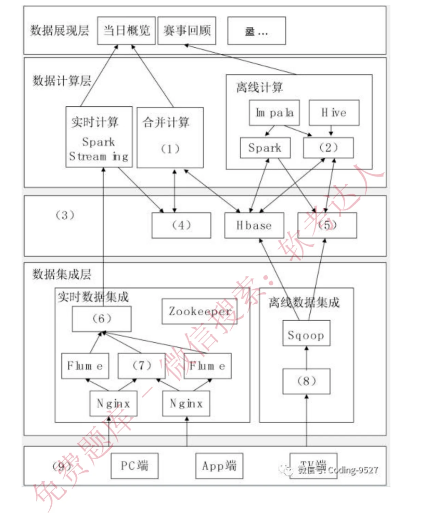
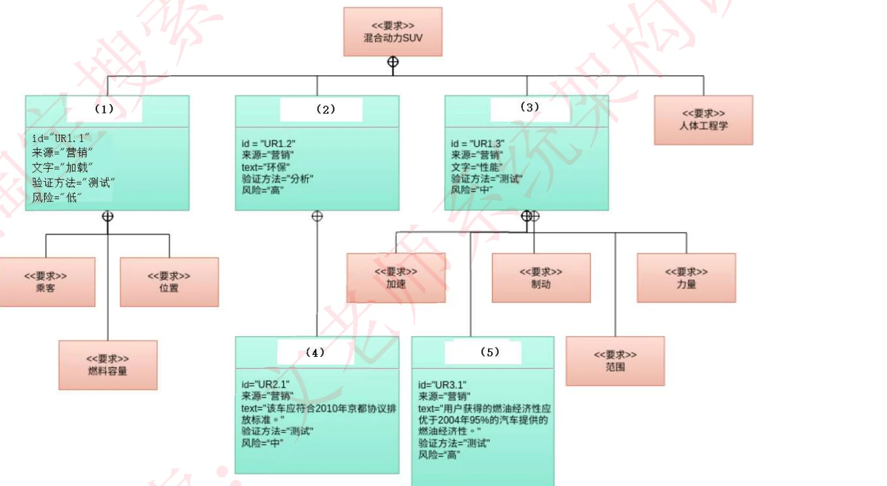

# 2023年下半年（11月）系统架构设计师 案例分析真题（回忆版）

> **考试时间**: 2023年11月  
> **考试形式**: 机考（改革首年，2023 年仅此一次考试）  
> **题目结构**: 第1题必答 + 后4题选2题，每题 25 分，共 75 分  
> **考试时长**: 90分钟  
> **来源类型**: `recalled_real`  
> **验证状态**: ⚠️ 回忆版，非官方原卷  
> **还原度**: 试题一（必答题）**题干、插图、参考答案三件齐全**，由两份相互独立的回忆稿（「软考达人」考后复盘稿、希赛「内部资料」回忆稿）逐字互证；试题二部分还原；试题三～五仅存考点线索，**无题干，不得据以出题**

---

## 试题一（必答题）：大数据架构（Lambda 与 Kappa）
> **题型**：案例 09 · 大数据 / Web 架构设计

### 题目背景

某网作为某电视台在互联网上的大型门户入口，某一年成为某奥运会中国大陆地区的特权转播商，独家全程直播了某奥运会全部的赛事，积累了庞大稳定的用户群，这些用户在使用各类服务过程中产生了大量数据，对这些海量数据进行分析与挖掘，将会对节目的传播及商业模式变现起到重要的作用。该奥运期间需要对增量数据在当日概览和赛事回顾两个层面上进行分析。

其中，当日概览模块需要秒级刷新直播在线人数、网站的综合浏览量、页面停留时间、视频的播放次数和平均播放时间等千万级数据量的实时信息，而传统的分布式架构采用重新计算的方式分析实时数据在不扩充以往集群规模的情况下，无法在几秒内分析出重要的信息。

赛事回顾模块需要展现自定义时间段内的历史最高在线人数、逐日播放走势、直播最高在线人数和点播视频排行等海量数据的统计信息，由于该奥运期间产生的数据通常不需要被经常索引、更新，因此要求采用不可变方式存储所有的历史数据，以保证历史数据的准确性。

### 【问题1】（8分）

请根据 Lambda 架构和 Kappa 架构特点，填写以下表格。

| 对比内容 | Lambda 架构 | Kappa 架构 |
|---|---|---|
| 复杂度与开发、维护成本 | 需要维护（1）套系统（引擎），复杂度（3），开发、维护成本（3） | 只需要维护（2）套系统（引擎），复杂度（4），开发、维护成本（4） |
| 计算开销 | 需要一直运行批处理和实时计算，计算开销大 | （5） |
| 实时性 | 满足实时性 | （6） |
| 历史数据处理能力 | 批量全量处理，吞吐量（7），历史数据处理能力强 | 流式全量处理，吞吐量相对较低，历史数据处理能力（8） |

#### 参考答案

| 空 | 答案 |
|---|---|
| （1） | 2 |
| （2） | 1 |
| （3） | 高 |
| （4） | 低 |
| （5） | 必要时要进行全量计算，计算开销相对较小 |
| （6） | 满足实时性 |
| （7） | 大 |
| （8） | 弱 |

> 表中（3）（4）两空在原表内各出现两次（复杂度与维护成本共用同一空位），答案相同。

### 【问题2】（9分）

下图 1 给出了某网奥运的大数据架构图，请根据下面的 (a)~(n) 的相关技术，判断这些技术属于架构图的哪个部分，补充完善下图 1 的（1）~（9）的空白处。

(a) Nginx；(b) HBase；(c) Spark Streaming；(d) Spark；(e) MapReduce；(f) ETL；(g) MemSQL；(h) HDFS；(i) Sqoop；(j) Flume；(k) 数据存储层；(l) Kafka；(m) 业务逻辑层；(n) 数据采集层

#### 参考答案

| 空 | 答案 | 所属层次 |
|---|---|---|
| （1） | d（Spark） | 数据计算层 · 合并计算 |
| （2） | e（MapReduce） | 数据计算层 · 离线计算 |
| （3） | k（数据存储层） | 数据存储层 |
| （4） | g（MemSQL） | 数据存储层 |
| （5） | h（HDFS） | 数据存储层 |
| （6） | l（Kafka） | 数据集成层 · 实时数据集成 |
| （7） | j（Flume） | 数据集成层 · 实时数据集成 |
| （8） | f（ETL） | 数据集成层 · 离线数据集成 |
| （9） | n（数据采集层） | 数据采集层 |

### 【问题3】（8分，每空2分）

大数据的架构包括了 Lambda 架构和 Kappa 架构，Lambda 架构分解为三层：即（1）、（2）和（3）；Kappa 架构不同于 Lambda 同时计算流计算和批计算并合并视图，Kappa 只会通过流计算一条的数据链路计算并产生视图。

请问该系统的大数据架构是基于哪种架构搭建的大数据平台处理奥运会大规模视频网络观看数据。

#### 参考答案

（1）批处理层；（2）加速层；（3）服务层。

该系统的大数据架构是基于 **Lambda 架构**搭建的大数据平台处理奥运会大规模视频网络观看数据。

> ⚠️ **标分疑点**：原稿标注「8 分，每空 2 分」，但本小问只有（1）（2）（3）三个空（按每空 2 分计仅 6 分）。三个小问 8+9+8=25 分与整题分值自洽，故更可能是本小问原卷有四空、回忆稿漏记一空，或「每空 2 分」为回忆误差。使用时不建议按「每空 2 分」推演。

---

## 试题二：系统设计与建模（SysML 需求图 / UML 用例图）
> **题型**：案例 04 · UML 建模与分析

### 题目背景

阅读以下关于软件系统设计与建模的叙述，在答题纸上回答问题 1 至问题 3。

> **回忆说明**：本题背景未能还原，两份回忆稿均记为「背景不详」。据考生回忆，背景为某信息系统的需求获取场景，给出两种获取需求的方案：一种使用 UML 的用例图，另一种使用 SysML 的需求图；回忆稿判断背景与各小问无关，不影响作答。
>
> **还原度**：仅【问题1】【问题2】有可用材料。原卷另有【问题3】（用例图填空），题干与配图均未还原，本文件不提供。

### 【问题1】

请分别给出 SysML 建模的需求图与 UML 建模的用例图的定义，并说明二者的区别。

#### 参考答案

**需求图（REQ 或 req）**：用于表述文字化的需求、需求间的关系，以及与之存在满足、验证等关系的其他模型元素。

**用例图**：从用户的角度提供系统或业务流程功能的概述。

**二者的主要区别**：需求图更关注系统内部的功能和流程，以及这些功能和流程如何满足用户的需求；用例图更关注用户如何使用系统，以及系统与用户的交互。简单来说，需求图更偏向于系统的功能和流程，用例图更偏向于用户的使用体验。

### 【问题2】

> ⚠️ **非原卷原题**：本小问的设问方式与配图为回忆稿整理方自拟的补全练习（原稿明确标注「非原题原图，老师自己出的」），**不是 2023 年 11 月原卷的题目与插图**。此处保留仅用于理解需求图的七种关系，不得当作原题证据或原卷还原。

请给出需求图的七种关系及其定义。某车企的混合动力 SUV 系统需求图如下图所示，请将选项中的内容填到图中（1）~（5）处。

A：质量需求　B：功能需求　C：性能要求：环保　D：性能要求：表现　E：性能要求：排放　F：性能要求：燃油经济

#### 参考答案

（1）~（5）：B、C、D、E、F

需求图的七种关系：

1. **复合关系**：复合需求可以包含需求层次结构中的子需求。复合需求可以声明系统应执行 A 和 B，可以将其分解为「系统应执行 A」和「系统应执行 B」的子需求。
2. **派生关系**：派生的需求通常对应于系统层次结构下一级的需求。例如车辆加速需求，该需求被分析以导出发动机动力等方面的需求。
3. **细化关系**：细化关系可用于描述如何使用模型元素或元素集进一步细化需求。例如可以使用用例或活动图来细化基于文本的功能需求。
4. **满足关系**：满足关系描述了设计或实现模型如何满足一个或多个需求，系统建模者可以据此指定旨在满足要求的系统设计元素。
5. **验证关系**：验证关系定义了测试用例或其他模型元素如何验证需求。在 SysML 中，测试用例或其他元素可以用作表示任何标准检验方法的通用机制：分析、演示或测试。
6. **复制关系**：用于跨产品系列和项目重用需求。典型方案是适用于产品和/或产品系列中重复使用的项目及要求的法定法规或合同要求。
7. **追溯关系**：追溯关系提供了需求和任何其他模型元素之间的通用关系，对于将需求与源文档相关联、或在规范树中的规范之间建立关系很有用。

---

## 试题三：数据库读写分离与 Redis 缓存
> **题型**：案例 02 · 数据库设计（ER + 规范化）

### 考点内容

两份相互独立的回忆稿均只记录了考点，未还原题干、小问与答案：

- 数据库主从复制、读写分离架构；
- Redis 缓存数据库。

> **注意**：该题题干与问题均未还原，**不得据以出题**。需要训练时请改用 [case-types/02-database-design.md](../case-types/02-database-design.md)（读写分离、Cache Aside、存储选型）与 [case-types/06-messaging-caching.md](../case-types/06-messaging-caching.md)（缓存穿透 / 击穿 / 雪崩）的套路题。

---

## 试题四：数据持久层与 JWT
> **题型**：案例 02 · 数据库设计（ER + 规范化）

### 考点内容

两份相互独立的回忆稿均只记录了考点，未还原题干、小问与答案：

- Hibernate 体系架构、数据持久层；
- JWT（JSON Web Token）的组成与优缺点。

回忆稿另附了整理方自行补充的要点，**属参考资料而非原题答案**：

**JWT 的优点**：无状态（服务器不需要保存会话信息，便于扩展和分布式部署）；安全（通过密钥对头部和载荷签名，保证数据完整性与安全性）；跨域支持（可在不同域名和服务器之间使用）；简单易用。

**JWT 的缺点**：载荷信息不能太多（否则 token 过长，增加网络传输负担）；安全性依赖密钥保护（密钥泄露则安全性受威胁）；无法撤销（生成后无法撤销，除非修改密钥或设置短期过期时间）。

> **注意**：该题题干与问题均未还原，**不得据以出题**；上述 JWT 要点也不是原卷参考答案。需要训练时请改用 [case-types/02-database-design.md](../case-types/02-database-design.md) 的数据访问层相关套路。

---

## 试题五：数字孪生
> **题型**：案例 16 · 数字孪生（材料未恢复）

### 考点内容

希赛回忆稿记录了本题，考点为：**数字孪生概念、技术选择、架构图填空**。

> **注意**：该题题干、小问、配图与答案均未还原，**不得据以出题**。本题未见于「软考达人」回忆稿，其存在性由希赛回忆稿与第三方考情统计两处独立记录支撑。

---

## 2023年下半年案例分析考情总结

| 题号 | 考点主题 | 分值 | 还原度 |
|---|---|---|---|
| 试题一（必答） | 大数据架构（Lambda / Kappa 对比表、大数据架构图填空、三层划分） | 25分 | ✅ 题干 + 插图 + 参考答案齐全 |
| 试题二 | SysML 需求图与 UML 用例图（定义与区别、需求图七种关系） | 25分 | ⚠️ 背景与问题3未还原；问题2为整理方自拟 |
| 试题三 | 数据库主从复制、读写分离、Redis 缓存 | 25分 | ❌ 仅考点线索 |
| 试题四 | Hibernate 体系架构、数据持久层、JWT | 25分 | ❌ 仅考点线索 |
| 试题五 | 数字孪生概念、技术选择、架构图填空 | 25分 | ❌ 仅考点线索 |

**2023年下半年变化要点**：

1. **机考改革首年**：2023 年下半年起系统架构设计师改为机考，全年仅此一次考试（2024 年起恢复为 5 月、11 月一年两次）。
2. **必答题首次落在大数据**：历年必答题多为架构评估 / 质量属性，本次必答题为大数据架构，是考纲风向变化的直接信号。
3. **教材外内容进入案例**：JWT 属教材未覆盖的超纲内容，提示案例已开始考查工程实践常识。
4. **SysML 进入考查范围**：SysML 需求图与 UML 用例图的对比，属建模板块的横向扩展。

---

## 来源与验证

| 来源 | 类型 | 提供内容 |
|---|---|---|
| 《2023年软考系统架构师考题分享.pdf》（本地，贡献者持有） | 第三方机构「软考达人」考后复盘稿（12 页扫描件，无文本层） | 试题一完整题干、图 1 架构图、三个小问与参考答案；案例考点清单 |
| [CSDN ducanwang · 2023年下半年架构案例真题及答案](https://blog.csdn.net/ducanwang/article/details/134288173) | 与上一份**同源**（正文逐字一致），仅作文字校对，不构成独立互证 | 试题一题干与问题文字 |
| [xiaomabenten/system_architect · 2023年11月真题回忆版.pdf](https://github.com/xiaomabenten/system_architect) | 第三方机构**希赛**「内部资料」回忆稿（11 页，含文本层） | 试题二完整题干与参考答案、试题一答案互证、试题三～五考点线索 |
| [CSDN DS_Watson · 2023年11月系统架构设计师真题回忆](https://blog.csdn.net/DS_Watson/article/details/138964212) | 与希赛稿**同源**，仅作文字校对 | 试题二～五考点、JWT 要点 |
| [mdnice · 软考架构师历年考点总结](https://mdnice.com/writing/aa8064a5c2234ad68aea0995fd46492a) | 第三方考情统计 | 23.11 案例五个模块划分（大数据架构 / SysML / 数据库 / web架构 / 数据建模），独立确认试题五为数字孪生 |

**互证结论**：试题一的题干与参考答案由「软考达人」与「希赛」两份独立来源逐字互证，可信度最高；试题三～五的**考点归属**由上述多源一致确认，但**题干均未还原**，按仓库准入规则留空，不猜补。

**未解决疑点**（保留待后续维护）：

1. 第一题问题 3 的「8 分 / 每空 2 分」与三空不自洽（见上）。
2. 第二题的【问题3】题干与用例图缺失。
3. 第三题至第五题的题干、小问、配图、答案全部缺失。
