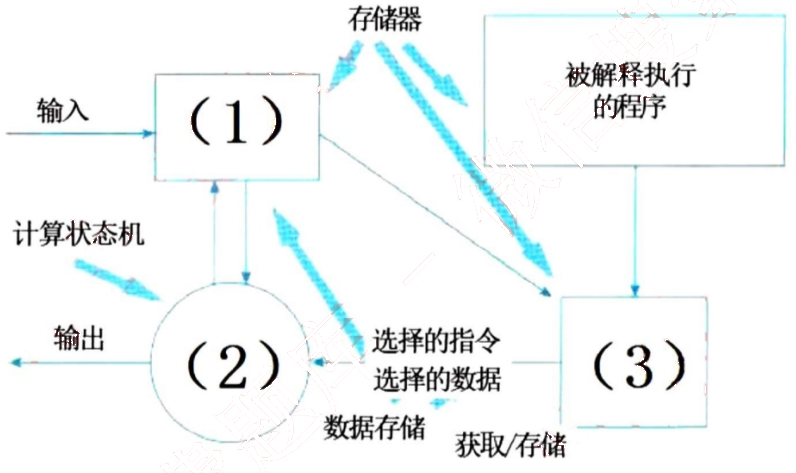
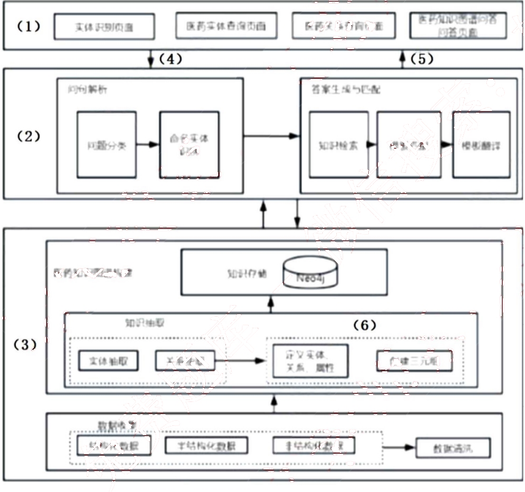
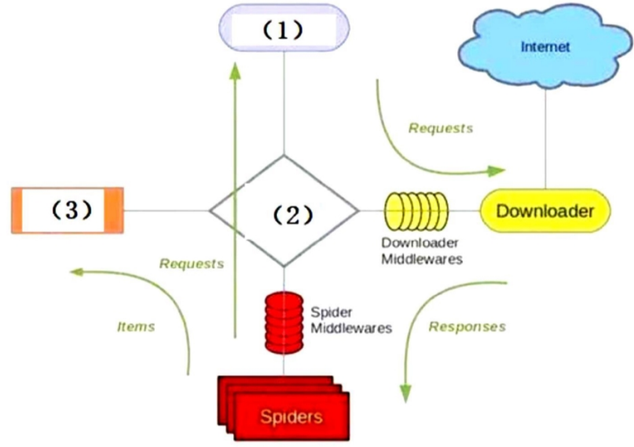
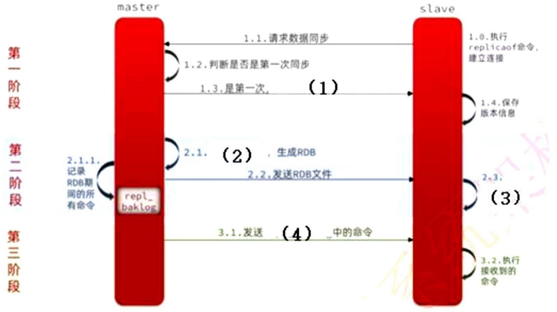

# 2025 年上半年 系统架构设计师 · 案例分析真题（回忆版）

> 试题一至五，含参考答案；回忆还原版，题面可能与官方原卷有差异
>
> **来源**：本地购买扫描件《2025 年上半年系统架构设计师真题回忆》（贡献者已购买并授权转录）
> **来源类型**：`recalled_real`
> **解析方式**：byted-las-document-parse（normal 模式）+ 机械清洗，已剔除页眉、广告条与页码
> **答案与解析**：机构整理的参考要点，非官方答案
> **使用建议**：仅用于题型趋势与练习；回忆版题面可能与官方原卷存在差异，勿作为唯一依据
> **完整性**：案例分析 5 题；机构据考生回忆整理并还原

## 试题一
> **题型**：案例 01 · 架构评估（ATAM）

某公司开发一个在线大模型训练平台, 支持 Python 代码编写、模型训练和部署, 用户通过 python 编写模型代码, 将代码交给系统进行模型代码的解析, 最终由系统匹配相应的计算机资源进行输出, 用户不需要关心底层硬件平台, 在开发该平台架构时, 设计了以下质量属性场景:

a. 当系统发生错误，在不影响正常运行时，自动发送一个错误通知给系统管理员
b. 为方便用户操作，平台设计了满足一般用户使用的快捷键设置
c. 系统界面能够适配用户自身使用的设备的屏幕尺寸比例
d. 用户提交训练任务时平台应该在一分钟内提供硬件和资源来执行任务
e. 当平台数据库发生故障时，可以在20分钟内，切换到备用库
f. 系统发生故障时，要能提供操作日志、调试日志等记录便于追踪审计
g. 系统发生故障时应在15分钟内修复
h. 系统应能提供远程测试，供远程用户进行远程修改，该功能仅提供给系统注册用户使用
I. 系统支持对某服务功能进行扩展，修改操作应该在3天内完成
j. 系统支持多个国家的语言，并且能够一键切换不同的语言
k. 系统编写有专门的接口代码来接收用户编写的模型并向计算机资源进行输出
l. 当使用平台的用户数量增加时，平台能够自动扩容以维持高质量服务

问题1（12分）：写出题目中的a-l共12个场景对应的质量属性分别是什么？

问题2：
1. 根据题目描述，完成下列解释器风格架构图的填空。6分

2. 请简要说明该平台为什么适合用解释器风格？7分

答案：

问题1：a.容错性（或健壮性或鲁棒性）。原因：出错自动通知管理员，属于容错性错误检测范围。
b.易用性；c.功能性；d.性能 e.可用性 f.安全性 g.可靠性 h.可测试性
i.可修改性 j.易用性 k.互操作性 l.可伸缩性

现在质量属性考的挺多的，不再局限于传统那四个，文老师感觉要区分可用性、可靠性、鲁棒性的描述了，从本题来看，可用性还是传统的遇到错误能切换到备用，强调有备用；可靠性遇到错误能修复，强调修复；鲁棒性按容错的描述，会强调检测错误这个角度。

问题2：1. (1) 程序执行的当前状态 (2) 解释器引擎 (3) 解释器引擎的内部状态
2. 本题主要采分点在于回答出解释器风格的优点，即：

解释器风格可以构建一个运行环境，在这个环境上，可以解释和执行自定的一些语言和规则，题目中，用户通过 python 编写模型代码，交由系统进行解析执行，正好是符合解释器模型的应用范围。

## 试题二：医疗知识图谱问答
> **题型**：案例 09 · 大数据 / Web 架构设计

某公司拟开发一个医药领域的智能问答系统，以帮助用户快速准确的获取疾病病因、治疗方式、治疗周期、常用药物、症状表现和药物企业等医药领域信息。

基于项目需求，公司召开了项目讨论会。会上，张工指出基于关键词的中心化检索技术已无法满足用户获取医药领域信息的需求，应从各种医药信息网站网页数据中爬取数据构建医药领域知识图谱，并基于知识图谱实现信息的查询和智能问答。

问题 1：医药知识图谱智能问答系统架构图填空，是一个硕士论文里的架构图，因还原不全，文老师在此图上进行了挖空，并请学员在以下选项中选择合适的选项填入图中空（1）-（6）

a.用户层　b.应用层　c.网络层　d.业务层　e.数据层　f.知识表示　g.知识创建　h.问题　i.答案

问题 2：该知识图谱的实现使用了爬虫框架 scrapy，该框架图如下所示，请填写图中空（1）-（3）

*（原图含机构广告或水印，已移除）*

问题3：请解释异步 I/O 的概念。

答案：

问题1：（1）应用层 （2）业务层 （3）数据层（4）问题（5）答案（6）知识表示

问题2：（1）scheduler （2）scrapy engine （3）Item Pipeline

问题3：异步 I/O 是一种非阻塞式的输入输出处理模型，允许程序在发起 I/O 操作后立即返回，无需等待操作完成，通过回调、事件或信号机制在 I/O 完成后获取结果。

关于爬虫框架 scrapy 的知识点：

核心引擎（Scrapy Engine）作用：中央调度器，控制数据流（如交通指挥中心）

调度器（Scheduler）功能：管理 Request 队列（优先级/去重）控制并发数

下载器（Downloader）异步引擎：实现异步 I/O

爬虫（Spiders）开发者核心区：编写解析逻辑

数据管道（Item Pipeline）数据处理流水线：清洗 → 验证 → 去重 → 存储

## 试题三：数据库 Redis
> **题型**：案例 06 · 消息中间件 / 缓存应用

问题1：在 redis 主从复制，读写分离的架构中，主从库第一次同步的架构图如下，请填写图中空缺处。

*（原图含机构广告或水印，已移除）*

问题 2: 主从库第一次同步完成之后，后面如果有数据更新是如何同步的，请填写图中空缺处

*（原图含机构广告或水印，已移除）*

问题 3: 数据持久化在系统非常重要，系统发生故障的时候需要进行数据恢复，请列举出 redis 中数据持久化的两种方式，并论述其优缺点

答案:

问题 1: (1) 返回 master 的数据版本信息 (2) 执行 bgsave
(3) 清空本地数据，加载 RDB 文件
(4) repl_baklog 中的命令

问题 2: (1) psync replid offset (2) 回复 continue (3) 获取 offset 后的数据

问题 3: Redis 提供 RDB 和 AOF 两种持久化机制，其核心区别与对比如下:

RDB (Redis Database) 原理: 定时生成内存数据的二进制快照，保存为 dump.rdb 文件。

优点
高性能 二进制压缩存储，恢复速度极快（适合大数据量场景）
低磁盘占用 RDB 文件紧凑（比 AOF 小 50%~70%）
容灾友好 单文件备份，便于传输到异地（如 SCP 到远程服务器）
最小化阻塞 BGSAVE 仅 fork 瞬间阻塞（通常毫秒级）

缺点
数据丢失风险 两次备份间的数据可能丢失（如 5 分钟备份周期宕机，丢 5 分钟数据）

Fork 内存开销：fork 子进程时内存翻倍（10GB 数据→临时占用 20GB）

实时性差：不支持秒级持久化（最低配置 save 60 10000 = 60 秒内 1 万次改动才触发）

AOF（Append Only File）原理：记录所有写操作命令（文本格式），通过重放命令恢复数据。

优点
- 数据零丢失：配置 appendfsync always 每次写命令刷盘（最高可靠性）
- 可读性强：文本格式记录操作历史（可用于审计或手动修复）
- 故障恢复灵活：支持 redis-check-aof 工具修复损坏的 AOF 文件
- 自动重写压缩：BGREWRITEAOF 重写冗余命令（如 100 次 INCR → 1 次 SET）

缺点
- 文件体积大：相同数据集 AOF 文件通常远大于 RDB（需定期重写压缩）
- 恢复速度慢：重放命令比加载 RDB 慢数倍（10GB 数据可能需要分钟级恢复）
- 写入性能开销：always 模式每次写命令刷盘，性能下降 50%+
- 潜在 Bug 风险：重放 AOF 时若命令存在逻辑错误（如依赖中间状态），可能导致数据不一致

## 试题四
> **题型**：案例 16 · 边云 AI 与资源池

近年来，AI 技术得到快速发展，其技术促使了智能终端软硬架构的全面升级。云端 AI 和端侧 AI 最大差别在于算力是在云侧，还是端侧计算的问题。某装备研制企业为了适应产品的智能化升级换代，要求研发部门开展端侧 AI 技术的研究工作，王工主要承担了智能终端的资源化设计工作，并就资源池的架构设计提出了自己的见解。在研发部门组织的讨论会上，王工的独到见解得到技术主管的认可。

针对智能终端端侧 AI 的需求，王工在讨论会上提出，应开展资源池架构设计工作。资源池可高效管理和分配计算、存储和网络等资源，其核心目标是通过集中化管理、动态调度和自动化运维，提升资源利用率、弹性和可靠性。资源池架构设计除需要兼顾计算、存储、网络等资源的动态管理与优化外，同时应满足低延迟、高能效和隐私安全等核心需求。

问题 1（6 分）：请给出云测 AI 和端侧 AI 的定义，并说明端侧 AI 相比于云测 AI 的优势是什么？

问题 2（7 分）：资源池的核心架构设计需要考虑（a）资源抽象与异构计算、（b）动态调度与能效优化、（c）安全与隔离机制等三个方面，请判断下表中空（1）-（7）分别属于哪个方面，并使用 abc 进行填空。

<table>
<thead>
<tr>
<th>序号</th>
<th>设计方法</th>
<th>类别</th>
</tr>
</thead>
<tbody>
<tr>
<td>1</td>
<td>基于任务优先级、能耗调值和硬件亲和性（如 NPU 加速）动态分配资源</td>
<td>(1)</td>
</tr>
<tr>
<td>2</td>
<td>通过虚拟化或容器技术隔离多用户任务，防止资源争抢</td>
<td>(2)</td>
</tr>
<tr>
<td>3</td>
<td>将端侧设备的 CPU、GPU、NPU 等异构算力统一抽象为虚拟资源池，屏蔽硬件差异，实现灵活调度</td>
<td>(3)</td>
</tr>
</tbody>
</table>

<table>
  <thead>
    <tr>
      <th>序号</th>
      <th>设计方法</th>
      <th>类别</th>
    </tr>
  </thead>
  <tbody>
    <tr>
      <td>4</td>
      <td>本地数据处理避免敏感信息上传云端，结合硬件级安全模块实现端到端加密</td>
      <td>(4)</td>
    </tr>
    <tr>
      <td>5</td>
      <td>根据负载自动调整算力分配</td>
      <td>(5)</td>
    </tr>
    <tr>
      <td>6</td>
      <td>运行计算优化</td>
      <td>(6)</td>
    </tr>
    <tr>
      <td>7</td>
      <td>通过模型蒸馏、重化（应为量化）和稀疏编码压缩模型体积，适配端侧资源限制</td>
      <td>(7)</td>
    </tr>
  </tbody>
</table>

问题3（12分）：关于集中式资源池、分布式资源池以及混合型资源池对比表如下，请填写表中空（1）-（6）。

<table>
  <thead>
    <tr>
      <th>特性</th>
      <th>集中式资源池</th>
      <th>分布式资源池</th>
      <th>混合型资源池</th>
    </tr>
  </thead>
  <tbody>
    <tr>
      <td>核心架构</td>
      <td>单中心化</td>
      <td>(1)</td>
      <td>融合架构</td>
    </tr>
    <tr>
      <td>资源调度与管理</td>
      <td>(2)</td>
      <td>分布式/联邦式管理</td>
      <td>统一视图，分层/分级管理</td>
    </tr>
    <tr>
      <td>数据存储</td>
      <td>中心节点存储</td>
      <td>分散存储</td>
      <td>(3)</td>
    </tr>
    <tr>
      <td>扩容能力</td>
      <td>低</td>
      <td>高</td>
      <td>(4)</td>
    </tr>
    <tr>
      <td>管理复杂性</td>
      <td>(5)</td>
      <td>高</td>
      <td>高</td>
    </tr>
    <tr>
      <td>规模</td>
      <td>高</td>
      <td>(6)</td>
      <td>高</td>
    </tr>
  </tbody>
</table>

因为集中式资源池实时性高，并且目前系统规模大，所以李工决定采用集中式资源池，但是王工指出李工的方案有三个缺陷。请你描述一下三个缺陷是什么？

答案:

问题1：云测AI AI模型部署在云端服务器，终端设备通过网络传输数据至云端处理并返回结果。

端侧AI AI模型直接部署在终端设备（手机/汽车/IoT设备），数据在本地完成计算。

端侧AI 的优势：超低延迟（实时响应）、数据隐私和安全（原始数据本地处理，仅输出结果）、离线可用、带宽和成本低、能效提升（本地运算免传输，专用芯片能效高）

问题2：

<table>
<thead>
<tr>
<th>序号</th>
<th>设计方法</th>
<th>类别</th>
<th>分类理由</th>
</tr>
</thead>
<tbody>
<tr>
<td>1</td>
<td>基于任务优先级、能耗调值和硬件亲和性（如NPU 加速）动态分配资源</td>
<td>(1) b</td>
<td>核心是动态资源分配，考虑优先级、能耗和硬件特性，属于动态调度与能效优化。</td>
</tr>
<tr>
<td>2</td>
<td>通过虚拟化或容器技术隔离多用户任务，防止资源争抢</td>
<td>(2) c</td>
<td>直接涉及任务隔离，防止争抢，属于安全与隔离机制。</td>
</tr>
<tr>
<td>3</td>
<td>将端侧设备的 CPU、GPU、NPU 等异构算力统一抽象为虚拟资源池，屏蔽硬件差异，实现灵活调度</td>
<td>(3) a</td>
<td>核心是将异构硬件抽象为统一资源池，属于资源抽象与异构计算。</td>
</tr>
<tr>
<td>4</td>
<td>本地数据处理避免敏感信息上传云端，结合硬件级安全模块实现端到端加密</td>
<td>(4) c</td>
<td>重点在数据安全和隐私保护（本地处理、加密），属于安全与隔离机制。</td>
</tr>
<tr>
<td>5</td>
<td>根据负载自动调整算力分配</td>
<td>(5) b</td>
<td>基于负载动态调整资源，属于动态调度与能效优化。</td>
</tr>
<tr>
<td>6</td>
<td>运行计算优化</td>
<td>(6) b</td>
<td>指运行时计算优化（如性能或能效优化），属于动态调度与能效优化的范畴。</td>
</tr>
<tr>
<td>7</td>
<td>通过模型蒸馏、重化（应为量化）和稀疏编码压缩模型体积，适配端侧资源限制</td>
<td>(7) b</td>
<td>模型压缩技术（如蒸馏、量化、稀疏编码）旨在减少资源使用，优化能效，属于动态调度与能效优化。</td>
</tr>
</tbody>
</table>

问题 3: (1) 多中心化或去中心化  (2) 集中管理
(3) 核心数据在中心，热数据或低延迟需求数据在边缘/本地。
(4) 高  (5) 低  (6) 低

就是指出集中式资源池的三个缺点，其缺点如下，随便挑三个即可：
- **单点故障风险**：中心故障影响全局。
- **网络延迟高**：远距离用户访问体验差。
- **带宽瓶颈**：所有流量汇聚到中心，出口带宽压力大。
- **扩展限制**：物理空间、电力、冷却可能限制单点扩展。
- **地理覆盖局限**：难以满足全球用户的低延迟需求。

## 试题五：区块链的题目
> **题型**：案例 17 · 区块链与智能合约

题目背景是农产品溯源使用区块链

问题1：区块链的六个层次分别是什么，并简单介绍（12分）

问题2：在区块链系统中，有三种人员：信息填写人员、核对人员、审核人员，请用400字以内文字说明三种不同人员的操作流程（9分）

问题3：介绍下什么是智能合约，并说明智能合约包含哪三方面（4分）

答案：

问题1：区块链技术体系可分为六个层级，通过多层协作实现去中心化特性与安全可信的运行机制：
- **数据层**封装底层数据结构与安全技术，包含区块的链式结构、哈希函数、Merkle 树、时间戳及非对称加密技术，确保数据不可篡改性和完整性。区块通过保存前序哈希值形成链式存储，交易数据采用双重加密保障隐私。
- **网络层**采用 P2P 组网技术构建分布式自治系统，节点通过传播机制同步新区块数据，依靠验证机制确认交易合法性。公有链、联盟链和私有链在该层实现不同级别的中心化控制。
- **共识层**集成 PoW、PoS、DPoS 等算法解决分布式网络记账权分配问题，通过超过 51%节点验证机制确保全网络账本一致性。共识机制直接影响系统的吞吐量与安全性。
- **激励层**设计经济模型驱动节点参与验证，如比特币的挖矿奖励和交易手续费机制。通过代币发行与分配规则维护网络生态的可持续性。
- **合约层**部署智能合约实现自动化执行，通过预编程脚本在满足条件时触发资产转移、合约清算等操作。以太坊等平台在该层扩展了图灵完备的编程能力。
- **应用层**面向具体场景开发 DApp，涵盖金融支付（跨境结算）、供应链管理（农产品溯源）、数字身份等垂直领域。该层直接承载用户交互与业务逻辑实现。

问题2：
1. 信息填写人员
① 登录区块链系统录入农产品基础数据（批次、产地、检测报告等）；② 上传原始凭证（如检测机构盖章文件）至 IPFS 分布式存储；③ 调用智能合约生成初始哈希值，将关键信息上链；④ 系统自动生成带时间戳的区块链存证编号。

2. 核对人员
① 接收系统推送的待核验数据包；② 比对上链数据与原始凭证的一致性（通过哈希值校验）；③ 实地抽查或视频核验生产环节真实性；④ 使用多重签名钱包对通过核验的数据包进行二级加密签名，触发智能合约进入审核队列。

3. 审核人员
① 调取前两级操作的全流程区块链日志；② 复核数据修改记录（需超过 2/3 节点共识）；③ 最终确认时激活时间锁功能，使该批次数据进入只读状态；④ 颁发可验证数字凭证（VC），同步至农业监管链节点。所有操作痕迹均通过非对称加密永久上链。

问题3：
智能合约是一种以代码形式编写的程序，存储在区块链上，用于自动执行合约条款，无需第三方介入。其核心作用包括自动化履约、确保交易透明性和不可篡改性。

智能合约包含以下三方面：

1. 自动化履约：智能合约可以在满足预设条件时自动执行交易或协议，减少人工干预和信任成本。例如，在预付式消费场景中，消费者预付的资金可以通过智能合约锁定，按照服务进度分阶段释放给商家，确保资金安全。

2. 透明性和不可篡改性：智能合约的代码是公开的，任何人都可以验证其内容和执行结果。此外，由于区块链的分布式账本和共识机制，一旦合约被记录在区块上，其内容就无法被篡改，保证了交易的不可篡改性。

去中心化和安全性：智能合约依赖于区块链的去中心化架构和加密技术，确保交易的安全性和可信度。合约代码部署在链上节点，满足条件时由网络节点通过共识机制验证并执行，将结果记录至区块
