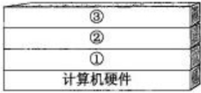
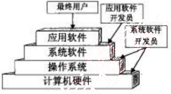
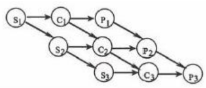
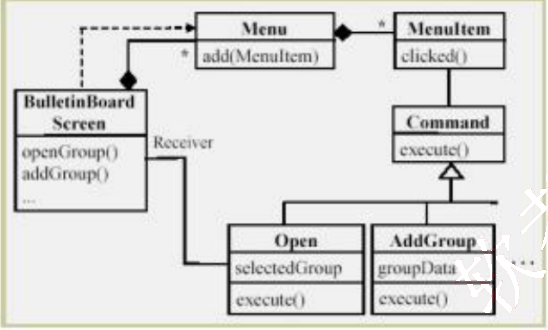
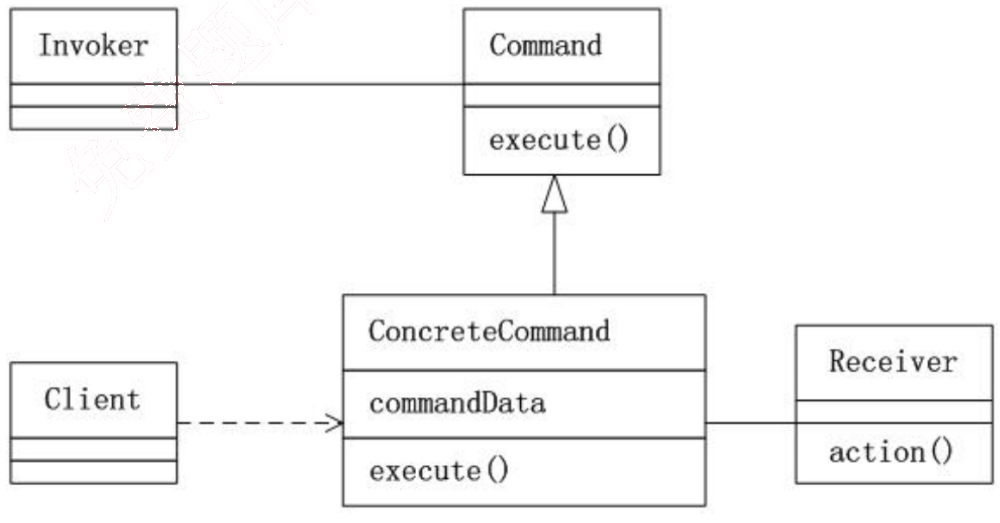

# 2009 年下半年 系统架构设计师 · 综合知识真题（75 题）

> 题干与选项取自正式试卷；答案与解析取自随卷答案详解
>
> **来源**：本地购买扫描件《2009 年下半年系统架构设计师 答案详解》（贡献者已购买并授权转录）
> **来源类型**：`real`
> **解析方式**：byted-las-document-parse（normal 模式）+ 机械清洗，已剔除页眉、广告条与页码
> **答案与解析**：取自随卷答案详解，非本仓库编写
> **使用建议**：可用于章节训练与年份模考；关键数字建议对照原始 PDF 复核
> **完整性**：综合知识 75 题、案例分析 5 题、论文 4 题齐备
> **知识点标签**：题组级 `§N` 标签，依据题干与原文解析中的考查提示标注，细分到考期题组而非逐题子编号

## 第 1 题：[§1 计算机系统—软件层次]

计算机系统中硬件层之上的软件通常按照三层来划分，如下图所示，图中①②③分别表示 (1)。

(1) A. 操作系统、应用软件和其他系统软件　B. 操作系统、其他系统软件和应用软件
C. 其他系统软件、操作系统和应用软件　D. 应用软件、其他系统软件和操作系统

【答案】B

**考点**：§1 计算机系统—软件层次

【解析】本题考查计算机系统中软件方面的基本知识。

操作系统（Operating System）的目的是为了填补人与机器之间的鸿沟，即建立用户与计算机之间的接口，而为裸机配置的一种系统软件，如下图所示。

从上图可以看出，操作系统是裸机上的第一层软件，是对硬件系统功能的首次扩充。它在计算机系统中占据重要而特殊的地位，其他系统软件属于第二层，如编辑程序、汇编程序、编译程序和数据库管理系统等系统软件；大量的应用软件属于第三层，例如银行账务查询、股市行情和机票预定系统等。其他系统软件和应用软件都是建立在操作系统基础之上的，并得到它的支持和取得它的服务。从用户角度看，当计算机配置了操作系统后，用户不再直接使用计算机系统硬件，而是利用操作系统所提供的命令和服务去操纵计算机，操作系统已成为现代计算机系统中必不可少的最重要的系统软件，因此把操作系统看作是用户与计算机之间的接口。

某计算机系统中有一个 CPU、一台扫描仪和一台打印机。现有三个图像处理任务，每个任务有三个程序段：扫描 Si，图像处理 Q 和打印 Pi (i=1, 2,3)。下图为三个任务各程序段并发执行的前驱图，其中，(2) 可并行执行，(3) 的直接制约，(4) 的间接制约。

## 第 2-4 题：[§1 操作系统—前趋图与PV操作]

*（原图含机构广告或水印，已移除）*

(2) A. "C1S2", "P1C2S3", "P2C3"
B. "C1S1", "S2C2P2", "C3P3"
C. "S1C1P1", "S2C2P2", "S3C3P3"
D. "S1S2S3", "C1C2C3", "P1P2P3"

(3) A. S1 受到 S2 和 S3、C1 受到 C2 和 C3、P1 受到 P2 和 P3
B. S2 和 S3 受到 S1、C2 和 C3 受到 C1、P2 和 P3 受到 P1
C. C1 和 P1 受到 S1、C2 和 P2 受到 S2、C3 和 P3 受到 S3
D. C1 和 S1 受到 P1、C2 和 S2 受到 P2、C3 和 S3 受到 P3

(4) A. S1 受到 S2 和 S3、C1 受到 C2 和 C3、P1 受到 P2 和 P3
B. S2 和 S3 受到 S1、C2 和 C3 受到 C1、P2 和 P3 受到 P1
C. C1 和 P1 受到 S1、C2 和 P2 受到 S2、C3 和 P3 受到 S3
D. C1 和 S1 受到 P1、C2 和 S2 受到 P2、C3 和 S3 受到 P3

【答案】A C B

**考点**：§1 操作系统—前趋图与PV操作

【解析】本题考查操作系统多道程序设计中的基础知识。

(2) 前趋图是一个有向无循环图，图由结点和结点间的有向边组成，结点代表各程序段的操作，而结点间的有向边表示两程序段操作之间存在的前趋关系（“→”）。两程序段 Pi 和 Pj 的前趋关系表示成 Pi → Pj，其中是 Pj 的前趋，Pj 是 Pi 的后继，其含义是 Pi 执行完毕才能由 Pj 执行。可见，S1 执行完毕后，计算 C1 与扫描 S2 可并行执行；C1 与 S2 执行完毕后，打印 P1、计算 C2 与扫描 S3 可并行执行；P1、C2 与 S3 执行完毕后，打印 P2 与计算 C3 可并行执行。

(3) 根据题意，系统中有三个任务，每个任务有三个程序段，从前趋图中可以看出，系统要先进行扫描 Si，然后再进行图像处理 Ci，最后进行打印 Pi，所以 C1 和 P1 受到 S1 的直接制约、C2 和 P2 受到 S2 的直接制约、C3 和 P3 受到 S3 的直接制约。

(4) 根据题意，系统中有一台扫描仪，因此 S2 和 S3 不能运行是受到了 S1 的间接制约，如果系统中有三台扫描仪，那么 S2 和 S1 能运行；同理，C2 和 C3 受到 C1 的直接制约、P2 和 P3 受到 P1 的间接制约。

## 第 5 题：[§5 数据库—需求分析文档]

在数据库设计的需求分析阶段应完成包括 (5) 在内的文档。

(5) A. E-R 图  B. 关系模式  C. 数据字典和数据流图  D. 任务书和设计方案

【答案】C

**考点**：§5 数据库—需求分析文档

【解析】本题考查数据库设计方面的相关知识。

需求分析阶段的任务是对现实世界要处理的对象（组织、部门和企业等）进行详细调查，在了解现行系统的概况，确定新系统功能的过程中收集支持系统目标的基础数据及处理方法。需求分析是在用户调查的基础上，通过分析，逐步明确用户对系统的需求，包括数据需求和围绕这些数据的业务处理需求，以及对数据安全性和完整性方面的要求。在需求分析阶段应完成的文档是数据字典和数据流图。

## 第 6 题：[§5 数据库—完整性约束]

设有职务工资关系P（职务，最低工资，最高工资），员工关系EMP（员工号，职务，工资），要求任何一名员工，其工资值必须在其职务对应的工资范围之内，实现该需求的方法是 (6)。

(6) A. 建立“EMP.职务”向“P.职务”的参照完整性约束
B. 建立“P.职务”向“EMP.职务”的参照完整性约束
C. 建立 EMP 上的触发器程序审定该需求
D. 建立 P 上的触发器程序审定该需求

【答案】C

**考点**：§5 数据库—完整性约束

【解析】本题考查对数据完整性约束方面基础知识的掌握。

完整性约束分为实体完整性约束、参照完整性约束和用户自定义完整性约束三类。其中实体完整性约束可以通过 Primary Key 指定，参照完整性约束通过 Foreign Key 指定，某些简单的约束可以通过 Check、Assertion 等实现。针对复杂的约束，系统提供了触发器机制，通过用户编程实现。本题中的约束条件只能通过编写职工表上的触发器，在对工资进行修改或插入新记录时触发，将新工资值与工资范围表中职工职务对应的工资范围比对，只有在范围内才提交，否则回滚。

## 第 7-8 题：[§5 数据库—候选关键字与模式分解]

设关系模式 R(U, F)，其中 R 上的属性集 U={A, B, C, D, E}，R 上的函数依赖集 F={A→B，DE→B，CB→E，E→A，B→D}。(7) 为关系 R 的候选关键字。分解 (8) 是无损连接，并保持函数依赖的。

(7) A. AB  B. DE  C. CE  D. DB

(8) A. ρ = { R1(AC), R2 (ED), R3 (B) }  B. ρ={R1 (AC), R2 (E), R3 (DB) }

C. p={R1 (AC), R2 (ED), R3 (AB)}
D. p = { R1 (ABC), R2 (ED), R3 (ACE) }

【答案】C D

**考点**：§5 数据库—候选关键字与模式分解

【解析】本题考查如何求解候选关键字和对模式分解知识的掌握。

给定一个关系模式 R(U, F), U = {A1, A2, …, An}, F 是 R 的函数依赖集，若 $X_F^+ = U$，则 X 必为 R 的唯一候选关键字。对于试题（7），A 选项 $(AB)_F^+ = ABD \neq U$，所以 AB 非候选关键字；$(DE)_F^+ = ABDE \neq U$ 所以 DE 非候选关键字；C 选项 $(DB)_F^+ = BD \neq U$，所以 CE 为候选关键字；D 选项所以 DB 非候选关键字。

根据无损连接的判定算法，对于选项 A 的构造初始的判定表如下：

<table>
  <tr>
    <th>分解的关系模式</th>
    <th>A</th>
    <th>B</th>
    <th>C</th>
    <th>D</th>
    <th>E</th>
  </tr>
  <tr>
    <td>R₁ (AC)</td>
    <td>a₁</td>
    <td>b₁₂</td>
    <td>a₃</td>
    <td>b₁₄</td>
    <td>b₁₅</td>
  </tr>
  <tr>
    <td>R₂ (ED)</td>
    <td>b₂₁</td>
    <td>b₂₂</td>
    <td>b₂₃</td>
    <td>a₄</td>
    <td>a₅</td>
  </tr>
  <tr>
    <td>R₃ (B)</td>
    <td>b₃₁</td>
    <td>a₂</td>
    <td>b₃₃</td>
    <td>b₃₄</td>
    <td>b₃₅</td>
  </tr>
</table>

由于 A→B，DE→B，CB→E，E→A，B→D 的决定因素中没有两行是相同的，因此选项 A 是有损连接的。

对选项 B 构造初始的判定表如下：

<table>
  <tr>
    <th>分解的关系模式</th>
    <th>A</th>
    <th>B</th>
    <th>C</th>
    <th>D</th>
    <th>E</th>
  </tr>
  <tr>
    <td>R₁ (AC)</td>
    <td>a₁</td>
    <td>b₁₂</td>
    <td>a₃</td>
    <td>b₁₄</td>
    <td>b₁₅</td>
  </tr>
  <tr>
    <td>R₂ (E)</td>
    <td>b₂₁</td>
    <td>b₂₂</td>
    <td>b₂₃</td>
    <td>b₂₄</td>
    <td>a₅</td>
  </tr>
  <tr>
    <td>R₃ (DB)</td>
    <td>b₃₁</td>
    <td>a₂</td>
    <td>b₃₃</td>
    <td>a₄</td>
    <td>b₃₅</td>
  </tr>
</table>

由于 A→B，DE→B，CB→E，E→A，B→D 的决定因素中没有两行是相同的，因此选项 B 是有损连接的。

对选项 C 构造初始的判定表如下：

<table>
  <tr>
    <th>分解的关系模式</th>
    <th>A</th>
    <th>B</th>
    <th>C</th>
    <th>D</th>
    <th>E</th>
  </tr>
  <tr>
    <td>R₁ (AC)</td>
    <td>a₁</td>
    <td>b₁₂</td>
    <td>a₃</td>
    <td>b₁₄</td>
    <td>b₁₅</td>
  </tr>
  <tr>
    <td>R₂ (ED)</td>
    <td>b₂₁</td>
    <td>b₂₂</td>
    <td>b₂₃</td>
    <td>a₄</td>
    <td>a₅</td>
  </tr>
  <tr>
    <td>R₃ (AB)</td>
    <td>a₁</td>
    <td>a₂</td>
    <td>b₃₃</td>
    <td>b₃₄</td>
    <td>b₃₅</td>
  </tr>
</table>

由于 A→B，属性 A 的第 1 行和第 3 行相同，可以将第 1 行 b12 改为 a2；又由于 B→D，属性 B 的第 1 行和第 3 行相同，而属性 D 第 1 行 b14 和第 3 行 b34 没有一行为 a4，因此改为同一符号，即取行号值最小的 b14。修改后的判定表如下：

<table>
  <thead>
    <tr>
      <th>分解的关系模式</th>
      <th>A</th>
      <th>B</th>
      <th>C</th>
      <th>D</th>
      <th>E</th>
    </tr>
  </thead>
  <tbody>
    <tr>
      <td>R₁(AC)</td>
      <td>a₁</td>
      <td>a₂</td>
      <td>a₃</td>
      <td>b₁₄</td>
      <td>b₁₅</td>
    </tr>
    <tr>
      <td>R₂(ED)</td>
      <td>b₂₁</td>
      <td>b₂₂</td>
      <td>b₂₃</td>
      <td>a₄</td>
      <td>a₅</td>
    </tr>
    <tr>
      <td>R₃(AB)</td>
      <td>a₁</td>
      <td>a₂</td>
      <td>b₃₃</td>
      <td>b₁₄</td>
      <td>b₃₅</td>
    </tr>
  </tbody>
</table>

反复检查函数依赖集F，无法修改上表，所以选项C是有损连接的。对选项D构造初始的判定表如下：

<table>
  <thead>
    <tr>
      <th>分解的关系模式</th>
      <th>A</th>
      <th>B</th>
      <th>C</th>
      <th>D</th>
      <th>E</th>
    </tr>
  </thead>
  <tbody>
    <tr>
      <td>R₁(ABC)</td>
      <td>a₁</td>
      <td>a₂</td>
      <td>a₃</td>
      <td>b₁₄</td>
      <td>b₁₅</td>
    </tr>
    <tr>
      <td>R₂(ED)</td>
      <td>b₂₁</td>
      <td>b₂₂</td>
      <td>b₂₃</td>
      <td>a₄</td>
      <td>a₅</td>
    </tr>
    <tr>
      <td>R₃(ACE)</td>
      <td>a₁</td>
      <td>b₃₂</td>
      <td>a₃</td>
      <td>b₃₄</td>
      <td>a₅</td>
    </tr>
  </tbody>
</table>

由于A→B，属性A的第1行和第3行相同，可以将第3行b32改为a2；E→A，属性E的第2行和第3行相同，可以将属性A第2行b21改为a1；AC→E，属性E的第2行和第3行相同，可以将属性E第1行b15改为a5；B→D，属性B的第1行和第3行相同，属性D第1行b14和第3行b34没有一行为a4，因此改为同一符号，即取行号值最小的b14。修改后的判定表如下：

<table>
  <thead>
    <tr>
      <th>分解的关系模式</th>
      <th>A</th>
      <th>B</th>
      <th>C</th>
      <th>D</th>
      <th>E</th>
    </tr>
  </thead>
  <tbody>
    <tr>
      <td>R₁(ABC)</td>
      <td>a₁</td>
      <td>a₂</td>
      <td>a₃</td>
      <td>b₁₄</td>
      <td>a₅</td>
    </tr>
    <tr>
      <td>R₂(ED)</td>
      <td>a₁</td>
      <td>b₂₂</td>
      <td>b₂₃</td>
      <td>a₄</td>
      <td>a₅</td>
    </tr>
    <tr>
      <td>R₃(ACE)</td>
      <td>a₁</td>
      <td>a₂</td>
      <td>a₃</td>
      <td>b₃₄</td>
      <td>a₅</td>
    </tr>
  </tbody>
</table>

由于E→D，属性E的第1~3行相同。可以将属性D第1行b14和第3行b34改为a4，修改后的判定表如下：

<table>
  <thead>
    <tr>
      <th>分解的关系模式</th>
      <th>A</th>
      <th>B</th>
      <th>C</th>
      <th>D</th>
      <th>E</th>
    </tr>
  </thead>
  <tbody>
    <tr>
      <td>R₁(ABC)</td>
      <td>a₁</td>
      <td>a₂</td>
      <td>a₃</td>
      <td>a₄</td>
      <td>a₅</td>
    </tr>
    <tr>
      <td>R₂(ED)</td>
      <td>a₁</td>
      <td>b₂₂</td>
      <td>b₂₃</td>
      <td>a₄</td>
      <td>a₅</td>
    </tr>
    <tr>
      <td>R₃(ACE)</td>
      <td>a₁</td>
      <td>a₂</td>
      <td>a₃</td>
      <td>a₄</td>
      <td>a₅</td>
    </tr>
  </tbody>
</table>

由于上表第一行全为a，故分解无损。

现在分析该分解是否保持函数依赖。若分解保持函数依赖，那么分解的子模式的函数依赖集 $F^+ = \left(\bigcup_{i=1}^n \prod_{R_i}(F^+)\right)^*$。$F_{R1}=A \rightarrow B, CB \rightarrow A$，$F_{R2}=E \rightarrow D$（根据Armstrong公理，系统传递依赖，E→A，A→B，B→D，所以E→D），$F_{R3}=E \rightarrow A$。可以求证$F^+$与$(F_{R1}+F_{R2}+F_{R3})^+$等价，即 $F^+=(F_{R1}+F_{R2}+F_{R3})^*=(A \rightarrow B, CB \rightarrow A, E \rightarrow D, E \rightarrow A)^+$，所以该分解保持函数依赖。

## 第 9-10 题：[§1 嵌入式—中断与实时系统]

嵌入式系统中采用中断方式实现输入输出的主要原因是 (9)。在中断时，CPU 断点信息一般保存到 (10)中。

(9) A. 速度最快
B. CPU 不参与操作
C. 实现起来比较容易
D. 能对突发事件做出快速响应

(10) A. 通用寄存器
B. 堆
C. 栈
D. I/O 接口

【答案】D C

**考点**：§1 嵌入式—中断与实时系统

【解析】本题主要考查嵌入式系统中断的基础知识。

嵌入式系统中采用中断方式实现输入输出的主要原因是能对突发事件做出快速响应。在中断时，CPU 断点信息一般保存到栈中。

## 第 11 题：[§1 嵌入式—存储结构]

在嵌入式系统设计时，下面几种存储结构中对程序员是透明的是 (11)。

(11) A. 高速缓存
B. 磁盘存储器
C. 内存
D. flash 存储器

【答案】A

**考点**：§1 嵌入式—存储结构

【解析】本题主要考查嵌入式系统程序设计中对存储结构的操作。

对照 4 个选项，可以立即看出高速缓存(Cache)对于程序员来说是透明的。

## 第 12 题：[§1 嵌入式—串并转换]

系统间进行异步串行通信时，数据的串/并和并/串转换一般是通过 (12)实现的。

(12) A. I/O 指令
B. 专用的数据传送指令
C. CPU 中有移位功能的数据寄存器
D. 接口中的移位寄存器

【答案】D

**考点**：§1 嵌入式—串并转换

【解析】本题主要考查嵌入式系统间进行异步串行通信时数据的串/并和并/串转换方式。

一般来说，嵌入式系统通常采用接口中的移位寄存器来实现数据的串/并和并/串转换操作。

## 第 13 题：[§1 网络—核心层]

以下关于网络核心层的叙述中，正确的是 (13)。

(13) A. 为了保障安全性，应该对分组进行尽可能多的处理
B. 在区域间高速地转发数据分组
C. 由多台二、三层交换机组成
D. 提供多条路径来缓解通信瓶颈

【答案】B

**考点**：§1 网络—核心层

【解析】

三层模型主要将网络划分为核心层、汇聚层和接入层，每一层都有着特定的作用：核心层提供不同区域或者下层的高速连接和最优传送路径；汇聚层将网络业务连接到接入层，并且实施与安全、流量负载和路由相关的策略；接入层为局域网接入广域网或者终端用户访问网络提供接入。其中核心层是互连网络的高速骨干，由于其重要性，因此在设计中应该采用冗余组件设计，使其具备高可靠性，能快速适应变化。

在设计核心层设备的功能时，应尽量避免使用数据包过滤、策略路由等降低数据包转发处理的特性，以优化核心层获得低延迟和良好的可管理性。

核心层应具有有限的和一致的范围，如果核心层覆盖的范围过大，连接的设备过多，必然引起网络的复杂度加大，导致网络管理性降低；同时，如果核心层覆盖的范围不一致，必然导致大量处理不一致情况的功能都在核心层网络设备中实现，会降低核心网络设备的性能。对于那些需要连接因特网和外部网络的网络工程来说，核心层应包括一条或多条连接到外部网络的连接，这样可以实现外部连接的可管理性和高效性。

## 第 14 题：[§1 网络—物理网络设计]

网络开发过程中，物理网络设计阶段的任务是 (14)。

(14) A. 依据逻辑网络设计的功能要求，确定设备的具体物理分布和运行环境
B. 分析现有网络和新网络的各类资源分布，掌握网络所处状态
C. 根据需求规范和通信规范，实施资源分配和安全规划
D. 理解网络应该具有的功能和性能，最终设计出符合用户需求的网络

【答案】A

**考点**：§1 网络—物理网络设计

【解析】

网络的生命周期至少包括网络系统的构思计划、分析设计、实时运行和维护的过程。对于大多数网络系统来说，由于应用的不断发展，这些网络系统需要不断重复设计、实施、维护的过程。

网络逻辑结构设计是体现网络设计核心思想的关键阶段，在这一阶段根据需求规范和通信规范，选择一种比较适宜的网络逻辑结构，并基于该逻辑结构实施后续的资源分配规划、安全规划等内容。

物理网络设计是对逻辑网络设计的物理实现，通过对设备的具体物理分布、运行环境等的确定，确保网络的物理连接符合逻辑连接的要求。在这一阶段，网络设计者需要确定具体的软硬件、连接设备、布线和服务。

现有网络体系分析的工作目的是描述资源分布，以便于在升级时尽量保护已有投资，通过该工作可以使网络设计者掌握网络现在所处的状态和情况。

需求分析阶段有助于设计者更好地理解网络应该具有什么功能和性能，最终设计出符合用户需求的网络，它为网络设计提供依据。

## 第 15 题：[§1 网络—存储方式]

某公司欲构建一个网络化的开放式数据存储系统，要求采用专用网络连接并管理存储设备和存储管理子系统。针对这种应用，采用 (15) 存储方式最为合适。

(15) A. 内置式存储
B. DAS
C. SAND
D. NAS

【答案】C

**考点**：§1 网络—存储方式

【解析】

开放系统的直连式存储（Direct-Attached Storage. DAS)在服务器上外挂了一组大容量硬盘，存储设备与服务器主机之间采用SCSI通道连接，带宽为10MB/s、20MB/S、40MB/S和80MB/S等。直连式存储直接将存储设备连接到服务器上，这种方法难以扩展存储容量，而且不支持数据容错功能，当服务器出现异常时会造成数据丢失。

网络接入存储(Network Attached Storage, NAS)是将存储设备连接到现有的网络上，提供数据存储和文件访问服务的设备。NAS服务器是在专用主机上安装简化了的瘦操作系统（只具有访问权限控制、数据保护和恢复等功能）的文件服务器。NAS服务器 内置了与网络连接所需要的协议，可以直接联网，具有权限的用户都可以通过网络访问 NAS服务器中的文件。

存储区域网络（Storage Area Network，SAN)是一种连接存储设备和存储管理子系统的专用网络，专门提供数据存储和管理功能。SAN可以被看作是负责数据传输的后端网络，而前端网络（或称为数据网络）则负责正常的TCP/IP传输。也可以把SAN看作是通过特定的互连方式连接的若干台存储服务器组成的单独的数据网络，提供企业级的数据存储服务。

## 第 16 题：[§1 计算机系统—基准测试]

以下关于基准测试的叙述中，正确的是 (16)。

(16) A. 运行某些诊断程序，加大负载，检查哪个设备会发生故障
B. 验证程序模块之间的接口是否正常起作用
C. 运行一个标准程序对多种计算机系统进行检查，以比较和评价它们的性能
D. 根据程序的内部结构和内部逻辑，测试该程序是否正确

【答案】C

**考点**：§1 计算机系统—基准测试

【解析】

各种类型的计算机都具有自己的性能指标，计算机厂商当然希望自己研制的计算机有较高的性能。同样的计算机，如果采用不同的评价方法，所获得的性能指标也会不同。因此，用户希望能有一些公正的机构采用公认的评价方法来测试计算机的性能。这样的测试称为基准测试，基准测试采用的测试程序称为基准程序(Benchmark)，基准程序就是公认的标准程序，用它能测试多种计算机系统，比较和评价它们的性能，定期公布测试结果，供用户选购计算机时参考。

对计算机进行负载测试就是运行某种诊断程序，加大负载，检查哪个设备会发生故障。

在程序模块测试后进行的集成测试，主要测试各模块之间的接口是否正常起作用。

白盒测试就是根据程序内部结构和内部逻辑，测试其功能是否正确。

## 第 17 题：[§1 计算机系统—性能改进]

以下关于计算机性能改进的叙述中，正确的是 (17)。

(17) A. 如果某计算机系统的 CPU 利用率已经接近100%，则该系统不可能再进行性能改进
B. 使用虚存的计算机系统如果主存太小，则页面交换的频率将增加，CPU 的使用效率就会降低，因此应当增加更多的内存
C. 如果磁盘存取速度低，引起排队，此时应安装更快的 CPU，以提高性能
D. 多处理机的性能正比于 CPU 的数目，增加 CPU 是改进性能的主要途径

【答案】B

**考点**：§1 计算机系统—性能改进

【解析】

计算机运行一段时间后，经常由于应用业务的扩展，发现计算机的性能需要改进。计算机性能改进应针对出现的问题，找出问题的瓶颈，再寻求适当的解决方法。

计算机的性能包括的面很广，不单是 CPU 的利用率。即使 CPU 的利用率已经接近 100%，这只说明目前计算机正在运行大型计算任务。其他方面的任务可能被外设阻塞着，而改进外设成为当前必须解决的瓶颈问题。

如果磁盘存取速度低，则应增加新的磁盘或更换使用更先进的磁盘。安装更快的 CPU 不能解决磁盘存取速度问题。

多处理机的性能并不能正比于 CPU 的数目，因为各个 CPU 之间需要协调，需要花费一定的开销。

使用虚存的计算机系统如果主存太小，则主存与磁盘之间交换页面的频率将增加，业务

处理效率就会降低，此时应当增加更多的内存。这就是说，除 CPU 主频外，内存大小对计算机实际运行的处理速度也密切相关。

## 第 18 题：[§2 信息系统—商业智能]

商业智能是指利用数据挖掘、知识发现等技术分析和挖掘结构化的、面向特定领域的存储与数据仓库的信息。它可以帮助用户认清发展趋势、获取决策支持并得出结论。以下 (18) 活动，并不属于商业智能范畴。

(18) A. 某大型企业通过对产品销售数据进行挖掘，分析客户购买偏好
B. 某大型企业查询数据仓库中某种产品的总体销售数量
C. 某大型购物网站通过分析用户的购买历史记录，为客户进行商品推荐
D. 某银行通过分析大量股票交易的历史数据，做出投资决策

【答案】B

**考点**：§2 信息系统—商业智能

【解析】本题主要考查商业智能的基本概念。

商业智能是指利用数据挖掘技术、知识发现等技术分析和挖掘结构化的、面向特定领域的存储与数据仓库的信息，它可以帮助用户认清发展趋势、识别数据模式、获取职能决策支持并得出结论。商务智能技术主要体现在“智能”上，即通过对大量数据的分析，得到趋势变化等重要知识，并为决策提供支持。选项A、C、D都是对数据进行分析，获得知识的过程；选项B仅仅是获取数据，并没有对数据进行分析，因此不属于商业智能范畴。

## 第 19 题：[§2 信息系统—企业应用集成]

企业应用集成通过采用多种集成模式构建统一标准的基础平台，将具有不同功能和目的且独立运行的企业信息系统联合起来。其中，面向 (19) 的集成模式强调处理不同应用系统之间的交互逻辑，与核心业务逻辑相分离，并通过不同应用系统之间的协作共同完成某项业务功能。

(19) A. 数据
B. 接口
C. 过程
D. 界面

【答案】C

**考点**：§2 信息系统—企业应用集成

【解析】本题考查企业应用集成的方式和特点。

企业应用集成通过采用多种集成模式，构建统一标准的基础平台，将具有不同功能和目的而又独立运行的企业信息系统联合起来。目前市场上主流的集成模式有三种，分别是面向信息的集成、面向过程的集成和面向服务的集成。其中面向过程的集成模式强调处理不同应用系统之间的交互逻辑，与核心业务逻辑相分离，并通过不同应用系统之间的协作共同完成某项业务功能。

## 第 20 题：[§2 信息系统—电子数据交换EDI]

电子数据交换(EDI)是电子商务活动中采用的一种重要的技术手段。以下关于EDI的叙述中，错误的是 (20)。

(20) A. EDI 的实施需要一个公认的标准和协议，将商务活动中涉及的文件标准化和格式化
B. EDI 的实施在技术上比较成熟，成本也较低
C. EDI 通过计算机网络，在贸易伙伴之间进行数据交换和自动处理
D. EDI 主要应用于企业与企业、企业与批发商之间的批发业务

【答案】B

**考点**：§2 信息系统—电子数据交换EDI

【解析】本题主要考查电子数据交换(EDI)的基本概念和特点。

电子数据交换是电子商务活动中采用的一种重要的技术手段。EDI 的实施需要一个公认的标准和协议，将商务活动中涉及的文件标准化和格式化；EDI 通过计算机网络，在贸易伙伴之间进行数据交换和自动处理；EDI 主要应用于企业与企业、企业与批发商之间的批发业务；EDI 的实施在技术上比较成熟，但是实施 EDI 需要统一数据格式，成本与代价较大。

## 第 21 题：[§4 软件工程—用户文档]

用户文档主要描述所交付系统的功能和使用方法。下列文档中，(21)属于用户文档。

(21) A. 需求说明书
B. 系统设计
C. 安装文档
D. 系统测试计划

【答案】C

**考点**：§4 软件工程—用户文档

【解析】

用户文档主要描述所交付系统的功能和使用方法，并不关心这些功能是怎样实现的。用户文档是了解系统的第一步，它可以让用户获得对系统准确的初步印象。

用户文档至少应该包括下述5方面的内容。

①功能描述：说明系统能做什么。

②安装文档：说明怎样安装这个系统以及怎样使系统适应特定的硬件配置。

③使用手册：简要说明如何着手使用这个系统（通过丰富的例子说明怎样使用常用的系统功能，并说明用户操作错误是怎样恢复和重新启动的）。

④参考手册：详尽描述用户可以使用的所有系统设施以及它们的使用方法，并解释系统可能产生的各种出错信息的含义（对参考手册最主要的要求是完整，因此通常使用形式化的描述技术）。

⑤操作员指南（如果需要有系统操作员的话）：说明操作员应如何处理使用中出现的各

种情况。

系统文档是从问题定义、需求说明到验收测试计划这样一系列和系统实现有关的文档。描述系统设计、实现和测试的文档对于理解程序和维护程序来说是非常重要的。

## 第 22 题：[§4 软件工程—配置项]

配置项是构成产品配置的主要元素，其中 (22) 不属于配置项。

(22) A. 设备清单  B. 项目质量报告  C. 源代码  D. 测试用例

【答案】A

**考点**：§4 软件工程—配置项

【解析】
配置项是构成产品配置的主要元素，配置项主要有以下两大类：
(1) 属于产品组成部分的工作成果：如需求文档、设计文档、源代码和测试用例等；
(2) 属于项目管理和机构支撑过程域产生的文档：如工作计划、项目质量报告和项目跟踪报告等。

这些文档虽然不是产品的组成部分，但是值得保存。所以设备清单不属于配置项。

## 第 23 题：[§4 软件工程—需求变更]

一个大型软件系统的需求通常是会发生变化的。以下关于需求变更策略的叙述中错误的是 (23)

(23) A. 所有需求变更必须遵循变更控制过程
B. 对于未获得核准的变更，不应该做变更实现工作
C. 完成了对某个需求的变更之后，就可以删除或者修改变更请求的原始文档
D. 每一个集成的需求变更必须能追溯到一个经核准的变更请求

【答案】C

**考点**：§4 软件工程—需求变更

【解析】
一个大型软件系统的需求通常是会发生变化的。在进行需求变更时，可以参考以下的需求变更策略：
(1) 所有需求变更必须遵循变更控制过程；
(2) 对于未获得批准的变更，不应该做设计和实现工作；
(3) 变更应该由项目变更控制委员会决定实现哪些变更；
(4) 项目风险承担者应该能够了解变更数据库的内容；
(5) 决不能从数据库中删除或者修改变更请求的原始文档；
(6) 每一个集成的需求变更必须能跟踪到一个经核准的变更请求。

## 第 24 题：[§4 软件工程—需求管理]

以下关于需求管理的叙述中，正确的是（24）。

(24) A. 需求管理是一个对系统需求及其变更进行了解和控制的过程
B. 为了获得项目，开发人员可以先向客户做出某些承诺
C. 需求管理的重点在于收集和分析项目需求
D. 软件开发过程是独立于需求管理的活动

【答案】A

**考点**：§4 软件工程—需求管理

【解析】
需求管理是一个对系统需求变更、了解和控制的过程。需求管理过程与需求开发过程相互关联，当初始需求导出的同时就启动了需求管理计划，一旦形成了需求文档的初稿，需求管理活动就开始了。

关于需求管理过程域内的原则和策略，可以参考：
①需求管理的关键过程领域不涉及收集和分析项目需求，而是假定已收集了软件需求，或者已由更高一级的系统给定了需求。

②开发人员在向客户以及有关部门承诺某些需求之前，应该确认需求和约束条件、风险、偶然因素、假定条件等。

③关键处理领域同样建议通过版本控制和变更控制来管理需求文档。

## 第 25 题：[§4 软件工程—原型与迭代开发]

(25)方法以原型开发思想为基础，采用迭代增量式开发，发行版本小型化，比较适合需求变化较大或者开发前期对需求不是很清晰的项目。

(25) A. 信息工程  B. 结构化  C. 面向对象  D. 敏捷

【答案】D

**考点**：§4 软件工程—原型与迭代开发

【解析】
敏捷方法以原型开发思想为基础，采用迭代增量式开发，发行版本小型化，比较适合需求变化较大或者开发前期对需求不是很清晰的项目。

## 第 26-27 题：[§4 软件工程—软件过程与工具]

项目管理工具用来辅助项目经理实施软件开发过程中的项目管理活动，它不能 (26)。(27)就是一种典型的项目管理工具。

(26) A. 覆盖整个软件生存周期
B. 确定关键路径、松弛时间、超前时间和滞后时间

C. 生成固定格式的报表和裁剪项目报告
D. 指导软件设计人员按软件生存周期各个阶段的适用技术进行设计工作

(27) A. 需求分析工具 B. 成本估算工具 C. 软件评价工具 D. 文档分析工具

【答案】D B

**考点**：§4 软件工程—软件过程与工具

【解析】
项目管理工具用来辅助软件的项目管理活动。通常项目管理活动包括项目的计划、调度、通信、成本估算、资源分配及质量控制等。一个项目管理工具通常把重点放在某一个或某几个特定的管理环节上，而不提供对管理活动包罗万象的支持。
项目管理工具具有以下特征：
(1) 覆盖整个软件生存周期；
(2) 为项目调度提供多种有效手段；
(3) 利用估算模型对软件费用和工作量进行估算；
(4) 支持多个项目和子项目的管理；
(5) 确定关键路径，松弛时间，超前时间和滞后时间；
(6) 对项目组成员和项目任务之间的通信给予辅助；
(7) 自动进行资源平衡；
(8) 跟踪资源的使用；
(9) 生成固定格式的报表和剪裁项目报告。

成本估算工具就是一种典型的项目管理工具。

## 第 28-29 题：[§4 软件工程—软件复用级别]

逆向工程导出的信息可以分为4个抽象层次，其中(28)可以抽象出程序的抽象语法树、符号表等信息；(29)可以抽象出反应程序段功能及程序段之间关系的信息。

(28) A. 实现级 B. 结构级 C. 功能级 D. 领域级

(29) A. 实现级 B. 结构级 C. 功能级 D. 领域级

【答案】A C

**考点**：§4 软件工程—软件复用级别

【解析】
逆向工程导出的信息可分为如下4个抽象层次。
①实现级：包括程序的抽象语法树、符号表等信息。
②结构级：包括反映程序分量之间相互依赖关系的信息，例如调用图、结构图等。
③功能级：包括反映程序段功能及程序段之间关系的信息。

④领域级：包括反映程序分量或程序与应用领域概念之间对应关系的信息。

## 第 30-31 题：[§4 软件工程—面向对象设计]

某软件公司欲开发一个 Windows 平台上的公告板系统。在明确用户需求后，该公司的架构师决定采用 Command 模式实现该系统的界面显示部分，并设计 UML 图如下图所示。图中与 Command 模式中的“Invoker”角色相对应的类是 (30)，与“ConcreteCommand”角色相对应的类是 (31)。

(30) A. Command  B. MenuItem  C. Open  D. BulktinBoardScreen

(31) A. Command  B. MenuItem  C. Open  D. BulktinBoardScreen

【答案】B C

**考点**：§4 软件工程—面向对象设计

【解析】
Command（命令）模式是设计模式中行为模式的一种，它将“请求”封装成对象，以便使用不同的请求、队列或者日志来参数化其他对象。Command 模式也支持可撤销的操作。Command 模式的类图也如图所示：

对于题目所给出的图，与“Invoker”角色相对应的类是 Menultem，与“Concrete Command”

角色相对应的类是 Open。

## 第 32 题：[§4 软件工程—UML用例关系]

用例（usecase）用来描述系统对事件做出响应时所采取的行动。用例之间是具有相关性的。在一个“订单输入子系统”中，创建新订单和更新订单都需要核查用户账号是否正确。用例“创建新订单“、“更新订单” 与用例“核查户账号”之间是 (32) 关系。

(32) A. 包含（include）
B. 扩展（extend）
C. 分类（classification）
D. 聚集（aggregation）

【答案】A

**考点**：§4 软件工程—UML用例关系

【解析】
用例是在系统中执行的一系列动作，这些动作将生成特定参与者可见的价值结果。它确定了一个和系统参与者进行交互，并可由系统执行的动作序列。用例模型描述的是外部执行者（Actor）所理解的系统功能。用例模型用于需求分析阶段，它的建立是系统开发者和用户反复讨论的结果，表明了开发者和用户对需求规格达成的共识。

两个用例之间的关系主要有两种情况：一种是用于重用的包含关系，用构造型 include 表示；另一种是用于分离出不同行为的扩展，用构造型 extend 表示。

① 包含关系：当可以从两个或两个以上的原始用例中提取公共行为，或者发现能够使用一个构件来实现某一个用例的部分功能是很重要的事时，应该使用包含关系来表示它们。

② 扩展关系：如果一个用例明显地混合了两种或两种以上的不同场景，即根据情况可能发生多种事情，可以断定将这个用例分为一个主用例和一个或多个辅用例描述可能更加清晰。

## 第 33-34 题：[§4 软件工程—UML图类型]

面向对象的设计模型包含以 (33) 表示的软件体系结构图，以 (34) 表示的用例实现图，完整精确的类图，针对复杂对象的状态图和用以描述流程化处理的活动图等。

(33) A. 部署图
B. 包图
C. 协同图
D. 交互图

(34) A. 部署图
B. 包图
C. 协同图
D. 交互图

【答案】B D

**考点**：§4 软件工程—UML图类型

【解析】
面向对象的设计模型包含以包图表示的软件体系结构图，以交互图表示的用例实现图，完整精确的类图，针对复杂对象的状态图和用以描述流程化处理的活动图等。

基于构件的开发模型包括软件的需求分析定义、(35)、(36)、(37)，以及测试和发布 5

## 第 35-37 题：[§4 软件工程—建模方法]

个顺序执行的阶段。

(35) A. 构件接口设计  B. 体系结构设计  C. 元数据设计  D. 集成环境设计

(36) A. 数据库建模  B. 业务过程建模  C. 对象建模  D. 构件库建立

(37) A. 应用软件构建  B. 构件配置管理  C. 构件单元测试  D. 构件编码实现

【答案】B D A

**考点**：§4 软件工程—建模方法

【解析】本题考查基于构件的软件开发模型的基础知识。

基于构件的开发模型利用模块化方法将整个系统模块化，并在一定构件模型的支持下复用构件库中的一个或多个软件构件，通过组合手段高效率、高质量地构造应用软件系统的过程。基于构件的开发模型融合了螺旋模型的许多特征，本质上是演化形的，开发过程是迭代的。基于构件的开发模型由软件的需求分析定义、体系结构设计、构件库建立、应用软件构建以及测试和发布5个阶段组成。

## 第 38 题：[§6 系统架构—构件与接口]

以下关于软件构件及其接口的叙述，错误的是 (38) .

(38) A. 构件是软件系统中相对独立且具有一定意义的构成成分

B. 构件在容器中进行管理并获取其属性或者服务

C. 构件不允许外部对所支持的接口进行动态发现或调用

D. 构件可以基于对象实现，也可以不基于对象实现试

【答案】C

**考点**：§6 系统架构—构件与接口

【解析】本题考查软件构件的基本概念。

软件构件是软件系统中具有一定意义的、相对独立的可重用单元。与对象相比，构件可以基于对象实现，也可以不作为对象实现。构件需要在容器中管理并获取容器提供的服务；客户程序可以在运行状态下利用接口动态确定构件所支持的功能并调用。

## 第 39 题：[§6 系统架构—J2EE应用架构]

在一个典型的基于 MVC (Model View Controller)的 J2EE 应用中，分发客户请求、有效组织其他构件为客户端提供服务的控制器由 (39) 实现。

(39) A. Entity Bean  B. Session Bean  C. Servlet  D. JSP

【答案】C

**考点**：§6 系统架构—J2EE应用架构

【解析】本题考查 J2EE 应用架构的基本知识。

在一个典型的基于 MVC (Model VIew Controller)的 J2EE 应用中，系统的界面由 JSP 构件实现，分发客户请求、有效组织其他构件为客户端提供服务的控制器由 Servlet 构件

实现，数据库相关操作由 Entity Bean 构件实现，系统核心业务逻辑由 Session Bean 构件实现。

## 第 40 题：[§5 数据库—数据分布]

以下关于 RDBMS 数据分布的叙述中，错误的是 (40)。

(40) A. 数据垂直分割是将不同表的数据存储到不同的服务器上
B. 数据水平分割是将不同行的数据存储到不同的服务器上
C. 数据复制是将数据的多个副本存储到不同的服务器上
D. 数据复制中由 RDBMS 维护数据的一致性

【答案】A

**考点**：§5 数据库—数据分布
【解析】本题考查数据分布方面的基本知识。

数据分割和数据复制是数据分布的两种重要方式。数据分割有垂直分割和水平分割两种模式，前者是将表中不同字段的数据存储到不同的服务器上；后者是将表中不同行的数据存储到不同的服务器上。数据复制是为了提升数据访问效率而采用的一种增加数据冗余的方法，它将数据的多个副本存储到不同的服务器上，由 RDBMS 负责维护数据的一致性。

## 第 41 题：[§6 系统架构—网络架构数据流图]

系统应用架构设计中，网络架构数据流图的主要作用是将处理器和设备分配到网络中。(41) 不属于网络架构数据流图的内容。

(41) A. 服务器、客户端及其物理位置
B. 处理器说明信息
C. 单位时间的数据流大小
D. 传输协议

【答案】C

**考点**：§6 系统架构—网络架构数据流图
【解析】本题考查网络规划与设计的基本知识。

应用架构建模中要绘制的第一个物理数据流图（PDFD）是网络架构 DFD，它们不显示单位时间的数据流量，需要显示的信息包括服务器及其物理位置；客户端及其物理位置；处理器说明；传输协议。

## 第 42 题：[§4 软件工程—输入设计]

系统输入设计中应尽可能考虑人的因素，以下关于输入设计的一般原理中，错误的是 (42)。

(42) A. 只让用户输入变化的数据
B. 使用创新的模式吸引用户的眼球
C. 表格中各个数据项应有提示信息

D. 尽可能使用选择而不是键盘输入的方式获取数据试

【答案】B

**考点**：§4 软件工程—输入设计

【解析】本题考查应用系统输入设计的基本知识。

人的因素在系统输入设计中扮演了很重要的角色。输入应该尽可能地简单，以降低错误发生的可能性，如对于范围可控的数据，使用选择的方式替代用户输入；只输入变化的数据等。输入应该尽可能使用已有含义明确的设计，需要采用模仿的方式而非创新。为了避免用户理解的二义性，应该对表格中输入的数据给出提示信息。

## 第 43 题：[§4 软件工程—系统测试]

系统测试将软件、硬件、网络等其他因素结合，对整个软件进行测试。(43)不是系统测试的内容。

(43) A. 路径测试  B. 可靠性测试  C. 安装测试  D. 安全测试

【答案】A

**考点**：§4 软件工程—系统测试

【解析】

系统测试是将已经确认的软件、计算机硬件、外设和网络等其他因素结合在一起，进行信息系统的各种集成测试和确认测试，其目的是通过与系统的需求相比较，发现所开发的系统与用户需求不符或矛盾的地方。系统测试是根据系统方案说明书来设计测试用例，常见的系统测试主要有恢复测试、安全性测试、压力测试、性能测试、可靠性测试、可用性测试、可维护性测试和安装测试。

## 第 44 题：[§4 软件工程—黑盒测试]

软件测试是为了发现错误而执行程序的过程。黑盒测试法主要根据(44)来设计测试用例。

(44) A. 程序内部逻辑  B. 程序外部功能  C. 程序数据结构  D. 程序流程图

【答案】B

**考点**：§4 软件工程—黑盒测试

【解析】

软件测试是为了发现错误而执行程序的过程。黑盒测试也称为功能测试，是根据规格说明所规定的功能来设计测试用例，它不考虑程序的内部结构和处理过程。常用的黑盒测试技术有等价类划分、边值分析、错误猜测和因果图等。

## 第 45 题：[§6 系统架构—架构与生命周期]

软件架构贯穿于软件的整个生命周期，但在不同阶段对软件架构的关注力度并不相同，在(45)阶段，对软件架构的关注最多。

(45) A. 需求分析与设计  B. 设计与实现  C. 实现与测试  D. 部署与变更

【答案】B

**考点**：§6 系统架构—架构与生命周期

【解析】本题主要考查软件架构对软件开发的影响和在生命周期中的关注力度。

软件架构贯穿于软件的整个生命周期，但在不同的阶段对软件架构的关注力度并不相同。其中需求分析阶段主要关注问题域；设计阶段主要将需求转换为软件架构模型；软件实现阶段主要关注将架构设计转换为实际的代码；软件部署阶段主要通过组装软件组件提高系统的实现效率。其中设计与实现阶段在软件架构上的工作最多，也最重要，因此关注力度最大。

## 第 46 题：[§6 系统架构—架构重要性]

软件架构设计是降低成本、改进质量、按时和按需交付产品的关键活动。以下关于软件架构重要性的叙述中，错误的是_(46)_.

(46) A. 架构设计能够满足系统的性能、可维护性等品质
B. 良好的架构设计能够更好地捕获并了解用户需求
C. 架构设计能够使得不同的利益相关人（stakeholders）达成一致的目标
D. 架构设计能够支持项目计划和项目管理等活动

【答案】B

**考点**：§6 系统架构—架构重要性

【解析】

软件架构设计是降低成本、改进质量、按时和按需交付产品的关键因素。架构设计能够满足系统的性能、可维护性等品质；能够使得不同的利益相关人（stakeholders）达成一致的目标；能够支持项目计划和项目管理等活动；能够有效地管理复杂性；等等。然而系统架构的给出必须建立在需求明确的基础上。

## 第 47 题：[§6 系统架构—架构需求过程]

软件架构需求是指用户对目标软件系统在功能、行为、性能、设计约束等方面的期望。以下活动中，不属于软件架构需求过程范畴的是_(47)。

(47) A. 设计构件
B. 需求获取
C. 标识构件
D. 架构需求评审

【答案】A

**考点**：§6 系统架构—架构需求过程

【解析】

软件架构需求是指用户对目标软件系统在功能、行为、性能和设计约束等方面的期望。需求过程主要是获取用户需求，标识系统中所要用到的构件，并进行架构需求评审。其中标识构件又详细分为生成类图、对类图进行分组和将类打包成构件三步。软件架构需求并不应该包括设计构件的过程。

基于架构的软件设计（ABSD）强调由商业、质量和功能需求的组合驱动软件架构设计。

## 第 48 题：[§6 系统架构—ABSD]

以下关于 ABSD 的叙述中，错误的是_(48)_。

(48) A. 使用 ABSD 方法，设计活动可以从项目总体功能框架明确就开始
B. ABSD 方法是一个自顶向下，递归细化的过程
C. ABSD 方法有三个基础：功能分解、选择架构风格实现质量和商业需求以及软件模板的使用
D. 使用 ABSD 方法，设计活动的开始意味着需求抽取和分析活动可以终止

【答案】D

**考点**：§6 系统架构—ABSD

【解析】
基于架构的软件设计（ABSD）强调由商业、质量和功能需求的组合驱动软件架构设计。使用 ABSD 方法，设计活动可以从项目总体功能框架明确就开始，并且设计活动的开始并不意味着需求抽取和分析活动可以终止，而是应该与设计活动并行。ABSD 方法有三个基础：第一个基础是功能分解，在功能分解中使用已有的基于模块的内聚和耦合技术。第二个基础是通过选择体系结构风格来实现质量和商业需求。第三个基础是软件模板的使用。ABSD 方法是一个自顶向下，递归细化的过程，软件系统的架构通过该方法得到细化，直到能产生软件构件的类。

## 第 49 题：[§6 系统架构—架构文档]

软件架构文档是对软件架构的正式描述，能够帮助与系统有关的开发人员更好地理解软件架构。软件架构文档的写作应该遵循一定的原则。以下关于软件架构文档写作原则的叙述中，错误的是_(49)_。

(49) A. 架构文档应该从架构设计者的角度进行编写
B. 应该保持架构文档的即时更新，但更新不要过于频繁
C. 架构文档中的描述应该尽量避免不必要的重复
D. 每次架构文档修改，都应该记录修改的原则

【答案】A

**考点**：§6 系统架构—架构文档

【解析】
软件架构文档是对软件架构的一种描述，帮助程序员使用特定的程序设计语言实现软件架构。软件架构文档的写作应该遵循一定的原则，这些原则包括：文档要从使用者的角度进行编写；必须分发给所有与系统有关的开发人员；应该保持架构文档的即时更新，但更新不要过于频繁；架构文档中描述应该尽量避免不必要的重复；每次架构文档修改都应该记录

进行修改的原则。

## 第 50 题：[§6 系统架构—架构复审]

架构复审是基于架构开发中一个重要的环节。以下关于架构复审的叙述中，错误的是__(50)__。

(50) A. 架构复审的目标是标识潜在的风险，及早发现架构设计的缺陷和错误
B. 架构复审过程中，通常会对一个可运行的最小化系统进行架构评估和测试
C. 架构复审人员由系统设计与开发人员组成
D. 架构设计、文档化和复审是一个迭代的过程

【答案】C

**考点**：§6 系统架构—架构复审

【解析】

架构复审是基于架构开发中一个重要的环节。架构设计、文档化和复审是一个迭代的过程。从这个方面来说，在一个主版本的软件架构分析之后，要安排一次由外部人员（用户代表和领域专家）参加的复审。架构复审过程中，通常会对一个可运行的最小化系统进行架构评估和测试。架构复审的目标是标识潜在的风险，及早发现架构设计的缺陷和错误。

## 第 51-52 题：[§6 系统架构—架构风格分类]

Windows 操作系统在图形用户界面处理方面采用的核心架构风格是__(51)__风格。Java 语言宣传的“一次编写，到处运行”的特性，从架构风格上看符合__(52)__风格的特点。

(51) A. 虚拟机
B. 管道-过滤器
C. 事件驱动
D. 微内核-扩展

(52) A. 虚拟机
B. 管道-过滤器
C. 事件驱动
D. 微内核-扩展

【答案】C A

**考点**：§6 系统架构—架构风格分类

【解析】

Windows 操作系统在图形用户界面处理方面采用的是典型的“事件驱动”的架构风格，首先注册事件处理的是回调函数，当某个界面事件发生时（例如键盘敲击、鼠标移动等），系统会查找并选择合适的回调函数处理该事件。Java 语言是一种解释型语言， 在 Java 虚拟机上运行，这从架构风格上看是典型的“虚拟机”风格，即通过虚拟机架构屏蔽不同的硬件环境。

## 第 53 题：[§6 系统架构—架构风格应用]

某软件开发公司负责开发一个 Web 服务器服务端处理软件，其核心部分是对客户端请求消息的解析与处理，包括 HTTP 报头分离、SOAP 报文解析等功能。该公司的架构师决定采用成熟的架构风格指导整个软件的设计，以下__(53)__架构风格，最适合该服务端处理软件。

(53) A. 虚拟机  B. 管道-过滤器  C. 黑板结构  D. 分层结构

【答案】B

**考点**：§6 系统架构—架构风格应用

【解析】
根据题干描述，Web 服务器服务端的核心功能是数据处理，由于 Web 服务在数据传输方面具有协议分层的特征，即底层协议会包装上层协议（HTTP 协议体中包含整个 SOAP 消息内容），因此需要数据内容的逐步分解与分阶段处理。比较选项中的架构风格，由于管道-过滤器的架构风格支持分阶段数据处理，因此特别适合该服务端处理软件的要求。

## 第 54 题：[§6 系统架构—架构风格应用]

某公司欲开发一个基于图形用户界面的集成调试器。该调试器的编辑器和变量监视器可以设置调试断点。当调试器在断点处暂停运行时，编辑程序可以自动卷屏到断点，变量监视器刷新变量数值。针对这样的功能描述，采用 (54) 的架构风格最为合适。

(54) A. 数据共享  B. 虚拟机  C. 隐式调用  D. 显式调用

【答案】C

**考点**：§6 系统架构—架构风格应用

【解析】
根据题干描述，调试器在设置端点时，其本质是在断点处设置一个事件监听函数，当程序执行到断点位置时，会触发并调用该事件监听函数，监听函数负责进行自动卷屏、刷新变量数值等动作。这是一个典型的回调机制，属于隐式调用的架构风格。

## 第 55 题：[§6 系统架构—架构风格对比]

某公司欲开发一种工业机器人，用来进行汽车零件的装配。公司的架构师经过分析与讨论，给出了该机器人控制软件的两种候选架构方案：闭环控制和分层结构。以下对于这两种候选架构的选择理由，错误的是 (55)。

(55) A. 应该采用闭环控制架构，因为闭环结构给出了将软件分解成几个协作构件的方法，这对于复杂任务特别适合
B. 应该采用闭环控制结构，因为闭环控制架构中机器人的主要构件（监控器、传感器、发动机等）是彼此分开的，并能够独立替换
C. 应该采用分层结构，因为分层结构很好地组织了用来协调机器人操作的构件，系统结构更加清晰
D. 应该采用分层结构，因为抽象层的存在，满足了处理不确定性的需要：在较低层次不确定的实现细节在较高层次会变得确定

【答案】A

**考点**：§6 系统架构—架构风格对比

【解析】

采用闭环结构的软件通常由几个协作构件共同构成，且其中的主要构件彼此分开，能够进行替换与重用，但闭环结构通常适用于处理简单任务（如机器装配等），并不适用于复杂任务。分层结构的特点是通过引入抽象层，在较低层次不确定的实现细节在较高层次会变得确定，并能够组织层间构件的协作，系统结构更加清晰。

## 第 56 题：[§6 系统架构—架构演化]

一个软件的架构设计是随着技术的不断进步而不断变化的。以编译器为例，其主流架构经历了管道-过滤器到数据共享为中心的转变过程。以下关于编译器架构的叙述中，错误的是 (56)。

(56) A. 早期的编译器采用管道-过滤器架构风格，以文本形式输入的代码被逐步转化为各种形式，最终生成可执行代码

B. 早期的编译器采用管道-过滤器架构风格，并且大多数编译器在词法分析时创造独立的符号表，在其后的阶段会不断修改符号表，因此符号表并不是程序数据的一部分

C. 现代的编译器采用以数据共享为中心的架构风格，主要关心编译过程中程序的中间表示

D. 现代的编译器采用以数据共享为中心的架构风格，但由于分析树是在语法分析阶段结束后才产生作为语义分析的输入，因此分析树不是数据中心的共享数据

【答案】D

**考点**：§6 系统架构—架构演化

【解析】

一个软件的架构设计是随着技术的不断进步而不断变化的。以编译器为例，其主流架构经历了管道-过滤器到数据共享为中心的转变过程。早期的编译器采用管道-过滤器架构风格，以文本形式输入的代码被逐步转化为各种形式，最终生成可执行代码。早期的编译器采用管道-过滤器架构风格，并且大多数编译器在词法分析时创造独立的符号表，在其后的阶段会不断修改符号表，因此符号表并不是程序数据的一部分。现代的编译器采用以数据共享为中心的架构风格，主要关心编译过程中程序的中间表示。现代的编译器采用以数据共享为中心的架构风格，分析树是在语法分析阶段结束后才产生作为语义分析的输入，分析树是数据中心中重要的共享数据，为后续的语义分析提供了帮助。

(57) 的选择是开发一个软件系统时的基本设计决策；(58) 是最低层的模式，关注软件系统的设计与实现，描述了如何实现构件及构件之间的关系。引用-计数是 C++ 管理动态资源

## 第 57-59 题：[§6 系统架构—模式层次]

时常用的一种 (59)。

(57) A. 架构模式  B. 惯用法  C. 设计模式  D. 分析模式

(58) A. 架构模式  B. 惯用法  C. 设计模式  D. 分析模式

(59) A. 架构模式  B. 惯用法  C. 设计模式  D. 分析模式

【答案】A B B

**考点**：§6 系统架构—模式层次

【解析】本题考查软件设计中使用的架构模式、设计模式和惯用法的基本概念。

架构模式是软件设计中的高层决策，例如 C/S 结构就属于架构模式，架构模式反映了开发软件系统过程中所作的基本设计决策；设计模式主要关注软件系统的设计，与具体的实现语言无关；惯用法则是实现时通过某种特定的程序设计语言来描述构件与构件之间的关系，例如引用-计数就是 C++ 语言中的一种惯用法。

## 第 60 题：[§6 系统架构—设计模式]

某软件公司基于面向对象技术开发了一套图形界面显示构件库 VisualComponent。在使用该库构建某图形界面时，用户要求为界面定制一些特效显示效果，如带滚动条、能够显示艺术字体的透明窗体等。针对这种需求，公司采用 (60) 最为灵活。

(60) A. 桥接模式  B. 命令模式  C. 组合模式  D. 装饰模式

【答案】D

**考点**：§6 系统架构—设计模式

【解析】

根据题干描述，可以看出其基础是一个图形界面，并要求为图形界面提供一些定制的特效，例如带滚动条的图形界面，能够显示艺术字体且透明的图形界面等。这要求能够动态地对一个对象进行功能上的扩展，也可以对其子类进行功能上的扩展。对照选项中的4种设计模式，装饰模式最符合这一要求。

## 第 61 题：[§6 系统架构—解释器风格与设计模式]

某软件公司承接了为某工作流语言开发解释器的工作。该工作流语言由多种活动节点构成，具有类 XML 的语法结构。用户要求解释器工作时，对每个活动节点进行一系列的处理，包括执行活动、日志记录、调用外部应用程序等，并且要求处理过程具有可扩展能力。针对这种需求，公司采用 (61) 最为恰当。

(61) A. 适配器模式  B. 迭代器模式  C. 访问者模式  D. 观察者模式

【答案】C

**考点**：§6 系统架构—解释器风格与设计模式

【解析】

根据题干描述，可以看出本题的核心在于对某个具有固定结构的活动节点需要多种处理

能力，且处理能力可扩展，也就是说要求在不改变原来类结构（活动节点）的基础上增加新功能。对照4个选项，发现访问者模式最符合要求。

## 第 62 题：[§7 质量属性与评估—ATAM]

Architecture Tradeoff Analysis Method (ATAM) 是一种软件架构的评估方法，以下关于该方法的叙述中，正确的是 (62)。

(62) A. ATAM 是一种代码评估方法
B. ATAM 需要评估软件的需求是否准确
C. ATAM 需要对软件系统进行测试
D. ATAM 不是一种精确的评估工具

【答案】D

**考点**：§7 质量属性与评估—ATAM

【解析】本题考查软件体系结构中的评估方法。

ATAM 是软件体系结构评估中的一种方法，主要对软件体系结构的设计结果进行评估。评估是软件系统详细设计、实现和测试之前的阶段工作，因此评估不涉及系统的实现代码和测试，因为评估是考查软件体系结构是否能够合适地解决软件系统的需求，并不对软件需求自身是否准确进行核实，而软件需求是否准确是需求评审阶段的工作。ATAM 并不是一种精确的评估方法，该方法表现的主要形式是评审会议。

## 第 63 题：[§7 质量属性与评估—ATAM四类点]

识别风险点、非风险点、敏感点和权衡点是 ATAM 方法中的关键步骤。已知针对某系统所做的架构设计中，提高其加密子系统的加密级别将对系统的安全性和性能都产生非常大的影响，则该子系统一定属于 (63)。

(63) A. 风险点和敏感点
B. 权衡点和风险点
C. 权衡点和敏感点
D. 风险点和非风险点

【答案】C

**考点**：§7 质量属性与评估—ATAM四类点

【解析】本题考查软件体系结构中的评估方法。

加密子系统的加密级别会对安全性和性能产生影响，一般而言，加密程度越高，安全性越好，但是其性能会降低；而加密程度越低，安全性越差，但性能一般会提高。因此该子系统将在安全性和性能两个方面产生冲突，所以该子系统一定属于权衡点和敏感点。

## 第 64 题：[§3 信息安全—网络安全体系]

信息安全策略应该全面地保护信息系统整体的安全，网络安全体系设计是网络逻辑设计工作的重要内容之一，可从物理线路安全、网络安全、系统安全、应用安全等方面来进行安全体系的设计与规划。其中，数据库的容灾属于 (64) 的内容。

(64) A. 物理线路安全与网络安全
B. 网络安全与系统安全
C. 物理线路安全与系统安全
D. 网络安全与应用安全

【答案】D

**考点**：§3 信息安全—网络安全体系

【解析】
网络安全体系设计是逻辑设计工作的重要内容之一，数据库容灾属于网络安全和应用安全考虑范畴。

## 第 65 题：[§3 信息安全—加密算法]

公司总部与分部之间需要传输大量数据，在保障数据安全的同时又要兼顾密钥算法效率，最合适的加密算法是 (65)。

(65) A. RC-5
B. RSA
C. ECC
D. MD5

【答案】A

**考点**：§3 信息安全—加密算法

【解析】
公司总部与分部之间通过Internet传输数据，需要采用加密方式保障数据安全。加密算法中，对称加密比非对称加密效率要高。RSA和ECC属于非对称加密算法，MD5为摘要算法，故选择RC-5。

## 第 66 题：[§11 标准化与知识产权—著作权保护期]

我国的《著作权法》对一般文字作品的保护期是作者有生之年和去世后50年，德国的《版权法》对一般文字作品的保护期是作者有生之年和去世后70年。假如某德国作者已去世60年，以下说法中正确的是 (66)。

(66) A. 我国M出版社拟在我国翻译出版该作品，需要征得德国作者继承人的许可，方可在我国出版发行
B. 我国M出版社拟在我国翻译出版该作品，不需要征得德国作者继承人的许可，就可在我国出版发行
C. 我国M出版社未征得德国作者继承人的许可，将该翻译作品销售到德国，不构成侵权
D. 我国M出版社未征得德国作者继承人的许可，将该翻译作品在我国销售，构成侵权

【答案】B

**考点**：§11 标准化与知识产权—著作权保护期

【解析】本题考查知识产权方面的基础知识。
按照《伯尔尼公约》的规定，一个成员国给予其他成员国作品的版权保护期，应按照

该成员国版权法的规定。依据我国著作权法的规定，该德国作者的作品已经超过法定版权保护期，不再受到版权保护。因此，出版社不需要征得德国作者继承人的许可，即可在我国出版发行该德国作者的作品。如果将该翻译出版作品未征得德国作者继承人的许可销售到德国，已构成侵权。这是因为德国的《版权法》规定作品的售到德国，则构成侵权。

我国的《著作权法》对一般文字作品的保护期是作者有生之年和去世后50年，该作者已去世60年，超过了我国《著作权法》对一般文字作品的保护期，在我国也不再受著作权保护。所以我国M出版社不需要征得德国作者继承人的许可，即可在我国出版发行该德国作者的作品。

## 第 67 题：[§11 标准化与知识产权—著作权保护对象]

(67) 不属于我国著作权法所保护的内容。

(67) A. 为保护其软件著作权而采取的技术措施
B. 软件权利电子信息
C. 通过信息网络传播的软件
D. 采用反编译技术获得的软件

【答案】D

**考点**：§11 标准化与知识产权—著作权保护对象

【解析】本题考查知识产权方面的基础知识。

我国著作权法采取列举方法，规定了侵权行为的表现形式。其中包括未经著作权人许可，复制、发行、表演、放映、广播、汇编、通过信息网络向公众传播其作品的行为；未经著作权人或者与著作权有关的权利人许可，故意避开或者破坏权利人为其作品、录音录像制品等采取的保护著作权或者与著作权有关的权利的技术措施的行为；未经著作权人或者与著作权有关的权利人许可，故意删除或者改变作品、录音录像制品等的权利管理电子信息的行为。这三种表现形式分别涵盖了试题中A、B、C选项。虽然利用反向编译技术、净室技术和反向工程技术等获得他人软件技术构思、技术方案并直接用于其软件产品中的行为是一种“复制”软件技术构思、技术方案的行为，但是对于这些行为在法律上不会受到制止。目前，我国对软件实施反编译是否合法还没有相应的法律规定。

由于著作权不保护思想，软件开发设计人员对体现在软件中的创造性的构思和技术方案不能得到保护。任何人都可以利用反向编译技术、净室技术和反向工程技术等获得他人软件所使用的思路、原理、结构、算法、处理过程和运行方法等设计要素，直接用于自己的软件产品中，这在著作权法上并不构成侵权。

## 第 68 题：[§11 标准化与知识产权—商业秘密]

王某原是X公司的项目经理，在X公司任职期间主持开发了某软件，但未与X公司签定劳动合同及相应的保密协议。X公司对该软件进行了软件著作权登记并获准。王某随后离职，并将其在 X 公司任职期间掌握的该软件技术信息、客户需求及部分源程序等秘密信息提供给另一软件公司。王某的行为 (68)

(68) A. 既侵犯了科技公司的商业秘密权，又侵犯了科技公司的软件著作权

B. 既未侵犯科技公司的商业秘密权，又未侵犯科技公司的软件著作权

C. 侵犯了科技公司的商业秘密权

D. 侵犯了科技公司的软件著作权

【答案】D

**考点**：§11 标准化与知识产权—商业秘密

【解析】本题考查知识产权方面的基础知识，涉及软件著作权和商业秘密权的相关概念。

王某作为公司的职员，在任职期间主持开发的软件为职务软件，公司对该软件享有软件著作权。王某将该软件源程序擅自提供给其他公司的行为已构成对公司软件著作权的侵犯。王某的行为将使得另一软件公司很快就会开发出类似的产品，在市场上与科技公司竞争，这样无疑会损害科技公司的利益。软件商业秘密包括软件技术秘密，如源程序、设计方法、技术方案、功能规划、开发情况和测试结果等；软件经营秘密，如经营方法、产销策略、客户情报（客户名单、客户需求）和软件市场分析等。商业秘密受到法律保护的依据是必须具备构成商业秘密的三个条件，即不为公众所知悉、具有实用性、采取了保密措施，缺少三个条件之一都会造成商业秘密丧失法律保护。公司未与王某签定劳动合同及相应的保密协议，可以认为科技公司主观上没有保守商业秘密的意愿，客观上没有采取相应的保密措施，那么公司的软件技术秘密和软件经营秘密就不具有保密性。所以，不认为王某侵犯了公司的商业秘密权。

## 第 69 题：[§12 应用数学—模型检验]

对实际应用问题建立了数学模型后，一般还需要对该模型进行检验。通过检验尽可能找出模型中的问题，以利于改进模型，有时还可能会否定该模型。检验模型的做法有多种，但一般不会 (69)。

(69) A. 利用实际案例数据对模型进行检验

B. 进行逻辑检验，分析该模型是否会出现矛盾

C. 用计算机模拟实际问题来检验模型

D. 检验该模型所采用的技术能否被企业主管理解

【答案】D

**考点**：§12 应用数学—模型检验

【解析】

针对实际问题建立的数学模型往往是近似的，往往忽略了许多复杂因素。这种'模型能

否解决实际问题还需要检验。检验的方法有多种。

利用实际案例数据对模型进行检验是很常见的。将模型作为一个黑盒，通过案例数据的输入，检查其输出是否合理。这是应用人员常用的方法。

有时可以请专家来分析模型是否合理。经验丰富的专家一般会根据模型自身的逻辑，再结合实际情况，分析是否会出现矛盾或问题。

有时很难用实际案例或聘请专家来检验模型，例如，试验或实验的代价太大，难以取得实际案例，有的项目技术比较新，缺乏有经验的专家。这时，如果能利用计算机来模拟实际问题，再在计算机上检验该数学模型，这往往是一种有效的办法。例如，对某种核辐射防护建立的数学模型，采用计算机模拟方法来检验就十分有效。

企业负责人需要提供一切必要的支持来解决实际问题。至于解决过程中采用的技术问题，则需要由技术人员研究决定。企业负责人只需要听取汇报，从宏观上认可就可以，不需要理解其中的技术细节。

某类产品《种品牌在某地区的市场占有率常用概率向量 u=(u1, u2, …, un) 表示(各分量分别表示各品牌的市场占有率，值非负，且总和为1)。市场占有率每隔一定时间的变化常用转移矩阵 Pn*n 表示。如果在相当长时期内，该转移矩阵的元素均是常数，又设初始时刻的市场占有率为向量 u，则下一时刻的市场占有率就是 uP，再下一时刻的市场占有率就是uP2，…，而且，市场占有率会逐步稳定到某个概率向量 Z，即出现 ZP=Z。这种稳定的市场占有率体现了转移矩阵的特征，与初始时刻的市场占有率无关。

## 第 70 题：[§12 应用数学—马尔可夫预测]

假设占领某地区市场的冰箱品牌 A 与 B，每月市场占有率的变化可用如下常数转移矩阵来描述：

$$
P = \begin{bmatrix}
0.8 & 0.2 \\
0.4 & 0.6
\end{bmatrix}
$$

则冰箱品牌 A 与 B 在该地区最终将逐步稳定到市场占有率 (70)。

(70) A. (1/4, 3/4)  B. (1/3, 2/3)  C. (1/2, 1/2)  D. (2/3, 1/3)

【答案】D

**考点**：§12 应用数学—马尔可夫预测

【解析】

根据题意，该地区冰箱品牌 A 与 B 每月占有率的变化描述为常数转移矩阵 P。不管初始时刻这两种品牌的市场占有率（以概率向量来描述）如何，最终将稳定到概率向量 Z，而且有关系式 ZP=Z。这表明，Z 的下一时刻仍然是 Z。

设 $Z=(Z_1, Z_2)$，其中 $Z_1 \ge 0$，$Z_2 \ge 0$，$Z_1+Z_2=1$，从 $ZP=Z$ 可以列出方程：
$$0.8Z_1 + 0.4Z_2 = Z_1$$
$$0.2Z_1 + 0.6Z_2 = Z_2$$
根据上述条件，求解该方程，得到 $Z_1=2/3$，$Z_2=1/3$。

因此，冰箱品牌A与B在该地区最终将逐步稳定到市场占有率（2/3，1/3）。品牌A将占有2/3的市场，品牌B将占有1/3的市场。

## 第 71-75 题：[§13 专业英语—阅读]

An architectural style defines as a family of such systems in terms of a (71) of structural organization. More specifically, an architectural style defines a vocabulary of (72) and connector types, and a set of (73) on how they can be combined. For many styles there may also exist one or more (74) that specify how to determine a system’s overall properties from the properties of its parts. Many of architectural styles have been developed over the years. The best-known examples of (75) architectures are programs written in the Unix shell.

(71) A. pattern
B. data flow
C. business process
D. position level

(72) A. metadata
B. components
C. models
D. entities

(73) A. functions
B. code segments
C. interfaces
D. constraints

(74) A. semantic models
B. weak entities
C. data schemas
D. business models

(75) A. event-based
B. object-oriented
C. pipe-and-filter
D. layered

【答案】A B D A C

**考点**：§13 专业英语—阅读

【解析】
一种架构风格以一种结构化组织模式定义一组这样的系统。具体来说，一种架构风格定义了一个构件及连接器类型的词汇表，以及一组关于它们如何能够被关联的约束。对于许多风格来说，可能也存在一个或多个语义模型，从系统部件的特性来确定系统的整体特性。许多架构风格已经发展了很多年，众所周知的管道-过滤器架构的例子就是用UNIX shell编写的程序。
