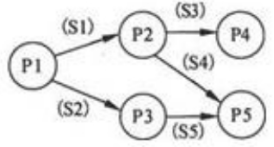
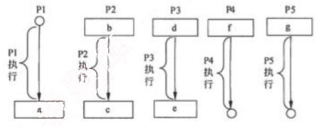
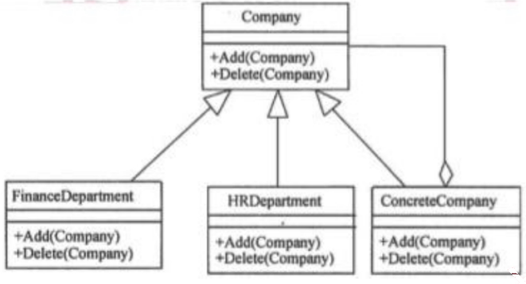
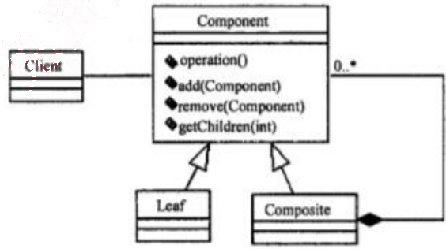
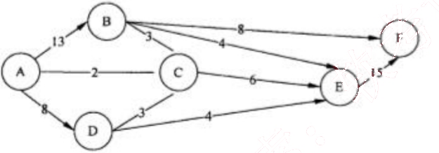

# 2011 年下半年 系统架构设计师 · 综合知识真题（75 题）

> 题干与选项取自正式试卷；答案与解析取自随卷答案详解
>
> **来源**：本地购买扫描件《2011 年下半年系统架构设计师 答案详解》（贡献者已购买并授权转录）
> **来源类型**：`real`
> **解析方式**：byted-las-document-parse（normal 模式）+ 机械清洗，已剔除页眉、广告条与页码
> **答案与解析**：取自随卷答案详解，非本仓库编写
> **使用建议**：可用于章节训练与年份模考；关键数字建议对照原始 PDF 复核
> **完整性**：综合知识 75 题、案例分析 5 题、论文 4 题齐备
> **知识点标签**：题组级 `§N` 标签，依据题干与原文解析中的考查提示标注，细分到考期题组而非逐题子编号

## 第 1 题：[§1 操作系统—用户接口]

操作系统为用户提供了两类接口：操作一级和程序控制一级的接口，以下不属于操作一级的接口是 (1)。

(1) A. 操作控制命令  B. 系统调用  C. 菜单  D. 窗口

【答案】B

**考点**：§1 操作系统—用户接口

【解析】本题考查操作系统基本概念。

操作系统为用户提供了两类接口：操作一级的接口和程序控制一级的接口。其中，操作一级的接口包括操作控制命令、菜单命令等；程序控制一级的接口包括系统调用。

进程 P1、P2、P3、P4 和 P5 的前趋图如下：

## 第 2-4 题：[§1 操作系统—PV操作]

若用 PV 操作控制进程 P1～P5 并发执行的过程，则需要设置 5 个信号量 S1、S2、S3、S4 和 S5，进程间同步所使用的信号量标注在上图中的边上，且信号量 S1～S5 的初值都等于零，初始状态下进程 P1 开始执行。下图中 a、b 和 c 处应分别填写 (2)；d 和 e 处应分别填写 (3)，f 和 g 处应分别填写 (4)。

(2) A. V(S1) V(S2)、P(S1) 和 V(S3) V(S4)
B. P(S1) V(S2)、P(S1) S1 P(S2) V(S1)
C. V(S1) V(S2)、P(S1) 和 P(S3) P(S4)
D. P(S1) P(S2)、V(S1) 和 P(S3) V(S2)

(3) A. P(S1) 和 V(S5)
B. V(S1) 和 P(S5)
C. P(S2) 和 V(S5)
D. V(S2) 和 P(S5)

(4) A. P(S3) 和 V(S4) V(S5)
B. P(S3) 和 P(S4) P(S5)
C. V(S3) 和 V(S4) V(S5)
D. V(S3) 和 P(S4) P(S5)

【答案】A C B

**考点**：§1 操作系统—PV操作

【解析】本题考查 PV 操作方面的基本知识。

因为 P1 是 P2 和 P3 的前驱，当 P1 执行完应通知 P2 和 P3，应采用 V(S1) V(S2) 操作分别

通知 P2 和 P3, 故图中的 a 处应填写 V(S1)V(S2)；又因为 P2 是 P1 的后继，当 P2 执行前应测试 P1 是否执行完，应采用 P(S1) 操作测试 P1 是否执行完，故 b 处应填写 P(S1)；同理，P2 是 P4 和 P5 的前驱，当 P2 执行完应通知 P4 和 P5, 应使用 V(S3) V(S4) 操作分别通知 P4 和 P5, 故 c 处应填写 V(S3)V(S4)。

因为 P3 是 P1 的后继，当 P3 执行前应测试 P1 是否执行完，应采用 P(S2) 操作测试 P1 是否执行完，故 d 应填写 P(S2)；又因为 P3 是 P5 的前驱，当 P3 执行完应通知 P5, 应采用 V(S5) 操作通知 P5, 故 e 处应填写 V(S5)。

因为 P4 是 P2 的后继，当 P4 执行前应测试 P2 是否执行完，应采用 P(S3) 操作分别测试 P2 是否执行完，故 f 处应填写 P(S3)；又因为 P5 是 P2 和 P3 的前驱，当 P5 执行前应测试 P2 和 P3 是否执行完，应采用 P(S4)P(S5) 操作分别测试 P2 和 P3 是否执行完，故 g 处应填写 P(S4)P(S5)。

某企业工程项目管理数据库的部分关系模式如下所示，其中带实下划线的表示主键，虚下划线的表示外键。

供应商(供应商号，名称，地址，电话，账号)

项目(项目号，负责人，开工日期)

零件(零件号，厂规格，单价)

供应(项目号,零件号,供应商号，供应量)

员工（员工号，姓名，性别出生日期，职位，联系方式）

## 第 5-7 题：[§5 数据库—E-R模型与关系模式]

其中供应关系是 (5) 的联系。若一个工程项目可以有多个员工参加，每个员工可以参加多个项目，则项目和员工之间是 (6) 联系。对项目和员工关系进行设计时，(7) 设计成一个独立的关系模式。

(5) A. 2 个实体之间的 1:n
B. 2 个实体之间的 n:m
C. 3 个实体之间的 1:n:m
D. 3 个实体之间的 k:n:m

(6) A. 1:1
B. 1:n
C. n:m
D. n:1

(7) A. 多对多的联系在向关系模型转换时必须
B. 多对多的联系在向关系模型转换时无须
C. 只需要将一端的码并入多端，所以无须
D. 不仅需要将一端的码并入多端，而且必须

【答案】D C A

**考点**：§5 数据库—E-R模型与关系模式

【解析】本题考查关系模式和 E-R 图的概念和性质。

对于试题（6）、（7），多对多的联系必须转换为一个独立的关系模式。下面分析诊疗科和医师之间的联系：根据 E-R 模型中一对多联系向关系模式转换规则可知，一个一对多的联系既可以转换为一个独立的关系模式，也可以与多端的关系模式合并。如果与多端的关系模式合并的话，需要将一端的码和联系上的属性合并到多端的关系模式中。由于本题将诊疗科的主键合并到了医师关系模式中，因此诊疗科和医师之间应该是一个一对多的联系。

## 第 8 题：[§5 数据库—关系代数]

给定学生 S（学号，姓名，年龄，入学时间，联系方式）和选课 SC（学号，课程号，成绩）关系，若要查询选修了 1 号课程的学生学号、姓名和成绩，则该查询与关系代数表达式__(8)__等价。

(8) A. $\pi_{1,2,8}(\sigma_{1=6 \land 7='1'}(S \bowtie SC))$
B. $\pi_{1,2,7}(\sigma_{6='1'}(S \bowtie SC))$
C. $\pi_{1,2,7}(\sigma_{1=6}(S \bowtie SC))$
D. $\pi_{1,2,8}(\sigma_{7='1'}(S \bowtie SC))$

【答案】B

**考点**：§5 数据库—关系代数

【解析】本题考查关系代数运算方面的基础知识。

对于试题（8），题目要求“查询选修了 1 号课程的学生学号和姓名”，因此先进行 S 与 SC 关系的自然连接，即选取 S.学号=SC.学号的元组并去掉右边的重复属性“学号”，生成的新关系为（学号，姓名，年龄，入学时间，联系方式，课程号，成绩），共有 7 个属性列。选项 A $\pi_{1,2,8}(\sigma_{1=6 \land 7='1'}(S \bowtie SC))$ 是错误的，因为自然连接后的第 6 个属性为课程号，其选取运算 $\sigma_{1=6 \land 7='1'}$ 的实际含义为“学号=课程号”同时“成绩=1”，与题意不符。

选项 B $\pi_{1,2,7}(\sigma_{6='1'}(S \bowtie SC))$ 是正确的，因为该关系表达式的含义为：进行 S 与 SC 关系的自然连接，选取 S.学号=sc.学号的元组并去掉右边的重复属性“学号”，再选取“课程号=1”的元组，最后进行学号、姓名和成绩的投影运算。

同理可以分析选项 C 和 D 都是错误的。

## 第 9 题：[§1 计算机系统—CISC与RISC]

以下关于 CISC（Complex Instruction Set Computer，复杂指令集计算机）和 RISC（Reduced Instruction Set Computer，精简指令集计算机）的叙述中，错误的是__(9)__。

(9) A. 在 CISC 中，复杂指令都采用硬布线逻辑来执行
B. 一般而言，采用 CISC 技术的 CPU，其芯片设计复杂度更高

C. 在 RISC 中，更适合采用硬布线逻辑执行指令

D. 采用 RISC 技术，指令系统中的指令种类和寻址方式更少

【答案】A

**考点**：§1 计算机系统—CISC与RISC

【解析】本题考查计算机指令体系基础知识。

CISC（Complex Instruction Set Computer，复杂指令集计算机）的基本思想是进一步增强原有指令的功能，用更为复杂的新指令取代原先由软件子程序完成的功能，实现软件功能的硬件化，导致机器的指令系统越来越庞大而复杂。CISC 计算机一般所含的指令数目至少 300 条以上，有的甚至超过 500 条。

CISC 的主要缺点如下：①微程序技术是 CISC 的重要支柱，每条复杂指令都要通过执行一段解释性微程序才能完成，这就需要多个 CPU 周期，从而降低了机器的处理速度；②指令系统过分庞大，从而使高级语言编译程序选择目标指令的范围很大，并使编译程序本身冗长而复杂，从而难以优化编译使之生成真正高效的目标代码；③CISC 强调完善的中断控制，势必导致动作繁多，设计复杂，研制周期长；④CISC 给芯片设计带来很多困难，使芯片种类增多，出错几率增大，成本提高而成品率降低。

RISC（Reduced Instruction Set Computer，精简指令集计算机）的基本思想是通过减少指令总数和简化指令功能，降低硬件设计的复杂度，使指令能单周期执行，并通过优化编译，提高指令的执行速度，采用硬线控制逻辑，优化编译程序。

实现 RISC 的关键技术有：①重叠寄存器窗口（overlapping register windows）技术，首先应用在伯克利的 RISC 项目中；②优化编译技术，RISC 使用了大量的寄存器，如何合理分配寄存器、提高寄存器的使用效率，减少访存次数等，都应通过编译技术的优化来实现；③超流水及超标量技术，这是 RISC 为了进一步提高流水线速度而采用的新技术；④硬线逻辑与微程序相结合在微程序技术中。

## 第 10 题：[§1 存储系统—Cache]

以下关于 Cache 的叙述中，正确的是 (10)。

(10) A. 在容量确定的情况下，替换算法的时间复杂度是影响 Cache 命中率的关键因素

B. Cache 的设计思想是在合理的成本下提高命中率

C. Cache 的设计目标是容量尽可能与主存容量相等

D. CPU 中的 Cache 容量应大于 CPU 之外的 Cache 容量

【答案】B

**考点**：§1 存储系统—Cache

【解析】本题考查存储系统基础知识。

在计算机系统中，常选用生产与运行成本、存储容量和读写速度各不相同的多种存储介质，组成一个统一管理的存储器系统，使每种介质充分发挥各自在速度、容量、成本方面的优势，从而达到最优性能价格比，满足使用要求。

高速缓存 Cache 用来存放当前最活跃的程序和数据，作为主存局部域的副本，其特点是：容量一般在几 KB 到几 MB 之间；速度一般比主存快 5 到 10 倍，由快速半导体存储器构成；其内容是主存局部域的副本，对程序员来说是透明的。

替换算法的目标就是使 Cache 获得最高的命中率。常用算法有随机替换算法、先进先出算法、近期最少使用算法和优化替换算法。

Cache 的性能是计算机系统性能的重要方面。命中率是 Cache 的一个重要指标，但不是最主要的指标。Cache 设计的目标是在成本允许的条件下达到较高的命中率，使存储系统具有最短的平均访问时间。

Cache 的命中率与 Cache 容量的关系是：Cache 容量越大，则命中率越高，随着 Cache 容量的增加，其命中率逐渐接近 100%。但是增加 Cache 容量意味着增加 Cache 的成本和增加 Cache 的命中时间。

## 第 11 题：[§1 存储系统—虚拟存储器]

虚拟存储器发生页面失效时，需要进行外部地址变换，即实现 (11) 的变换。

(11) A. 虚地址到主存地址
B. 主存地址到 Cache 地址
C. 主存地址到辅存物理地址
D. 虚地址到辅存物理地址

【答案】D

**考点**：§1 存储系统—虚拟存储器

【解析】本题考查存储系统基础知识。

虚拟存储器是一个容量非常大的存储器的逻辑模型，不是任何实际的物理存储器。

它借助于磁盘等辅助存储器来扩大主存容量，使之为更大或更多的程序所使用。虚拟存储器管理方式分为页式虚拟存储器、段式虚拟存储器和段页式虚拟存储器。

虚拟存储器是由硬件和操作系统自动实现存储信息调度和管理的。它的工作过程包括 6 个步骤：

① 中央处理器访问主存的逻辑地址分解成组号 a 和组内地址 b，并对组号 a 进行地址变换，即将逻辑组号 a 作为索引，查地址变换表，以确定该组信息是否存放在主存内。

② 如该组号已在主存内，则转而执行④；如果该组号不在主存内，则检查主存中是否有空闲区，如果没有，便将某个暂时不用的组调出送往辅存，以便将需要访问的信息调入主存。

③ 从辅存读出所要的组，并送到主存空闲区，然后将那个空闲的物理组号 a 和逻辑组号

a 登录在地址变换表中。

④从地址变换表读出与逻辑组号 a 对应的物理组号 a。

⑤从物理组号 a 和组内字节地址 b 得到物理地址。

⑥根据物理地址从主存中存取必要的信息。

页式调度是将逻辑和物理地址空间都分成固定大小的页。主存按页顺序编号，而每个独立编址的程序空间有自己的页号顺序，通过调度，辅存中程序的各页可以离散装入主存中不同的页面位置，并可据页表一一对应检索。

## 第 12 题：[§1 计算机系统—总线结构]

挂接在总线上的多个部件(12)。

(12) A. 只能分时向总线发送数据，并只能分时从总线接收数据
B. 只能分时向总线发送数据，但可同时从总线接收数据
C. 可同时向总线发送数据，并同时从总线接收数据
D. 可同时向总线发送数据，但只能分时从总线接收数据试

【答案】B

**考点**：§1 计算机系统—总线结构

【解析】本题考查计算机系统总线结构基础知识。

总线是一组能为多个部件分时共享的信息传送线，用来连接多个部件并为之提供信息交换通路。所谓共享，指连接到总线上的所有部件都可通过它传递信息；分时性指某一时刻只允许一个部件将数据发送到总线上。因此，共享是通过分时实现的。

## 第 13 题：[§1 网络—核心层交换机]

核心层交换机应该实现多种功能，下面选项中，不属于核心层特性的是 (13)。

(13) A. 高速连接
B. 冗余设计
C. 策略路由
D. 较少的设备连接

【答案】C

**考点**：§1 网络—核心层交换机

【解析】

核心层交换机一般都是三层或者三层以上的交换机，采用机箱式的外观，具有很多冗余的部件。在进行网络规划设计时，核心层的设备通常要占大部分投资，因为核心层是网络的高速主干，需要转发非常庞大的流量，对于冗余能力、可靠性和传输速度方面要求较高。核心层交换机还需要支持链路聚合功能，以确保为分布层交换机发送到核心层交换机的流量提供足够的带宽。核心层交换机还应支持聚合万兆链接。这样可以让对应的分布层交换机尽可能高效的向核心层传送流量。QoS 是核心层交换机提供的重要服务之一。

策略路由是一种比基于目标网络进行路由更加灵活的数据包路由转发机制。应用了策略

路由，路由器将通过路由图决定如何对需要路由的数据包进行处理，路由图决定了一个数据包的下一跳转发路由器。

## 第 14 题：[§1 网络—综合布线]

建筑物综合布线系统中的垂直子系统是指 (14)。

(14) A. 由终端到信叙插座之间的连线系统
B. 楼层接线间的配线架和线缆系统
C. 各楼层设备之间的互连系统
D. 连接各个建筑物的通信系统

【答案】C

**考点**：§1 网络—综合布线

【解析】
结构化布线系统分为六个子系统：工作区子系统、水平子系统、干线（垂直）子系统、设备间子系统、管理子系统和建筑群子系统。

干线（垂直）子系统是由主设备间（如计算机房、程控交换机房等）提供建筑中最重要的铜线或光纤线主干线路构成，是整个建筑的信息交通枢纽。一般它提供位于不同楼层的设备间和布线框间的多条连接路径，也可以连接单层楼的大片地区。

## 第 15 题：[§1 网络—逻辑网络设计]

网络设计过程包括逻辑网络设计和物理网络设计两个阶段，下面的选项中，(15)应该属于逻辑网络设计阶段的任务。

(15) A. 选择路由协议
B. 设备选型
C. 结构化布线
D. 机房设计

【答案】A

**考点**：§1 网络—逻辑网络设计

【解析】
一个网络系统从构思开始，到最后被淘汰的过程称为网络生命周期。一般来说，网络生命周期应包括系统的构思和计划、分析和设计、以及运行和维护的全过程。网络系统的生命周期是一个循环迭代的过程，每次迭代的动力都来自于网络应用需求的变更。每一个迭代周期都是网络重构的过程。常见的迭代周期可分为以下五个阶段：需求规范、通信规范、逻辑网络设计、物理网络设计、实施阶段。

逻辑网络设计是指根据用户需要确定网络建设的方案，包括拓扑结构规划、地址分配等、网络技术和服务器的选择等。物理网络设计的任务是选择符合逻辑性能要求的传输介质、设备、部件、部件和场所等，并将它们搭建成一个可以正常运行的网络。

## 第 16 题：[§6 系统架构—负载均衡]

随着业务的增长，信息系统的访问量和数据流量快速增加，采用负载均衡（Load Balance）方法可避免由此导致的系统性能下降甚至崩溃。以下关于负载均衡的叙述中，错误的是(16)。

(16) A. 负载均衡通常由服务器端安装的附加软件来实现
B. 负载均衡并不会增加系统的吞吐量
C. 负载均衡可在不同地理位置、不同网络结构的服务器群之间进行
D. 负载均衡可使用户只通过一个 IP 地址或域名就能访问相应的服务器

【答案】B

**考点**：§6 系统架构—负载均衡

【解析】本题主要考查考生对负载均衡方法的理解和掌握。

负载均衡一般由服务器端安装的附加软件来实现，通过采用负载均衡技术，系统的吞吐量会得到增加。负载均衡可以在不同地理位置、不同网络结构的服务器集群之间进行，采用负载均衡技术，用户可以仅通过 IP 地址或域名访问相应的服务器。

## 第 17 题：[§1 计算机系统—数据备份]

数据备份是信息系统运行管理时保护数据的重要措施。(17)可针对上次任何一种备份进行，将上次备份后所有发生变化的数据进行备份，并将备份后的数据进行标记。

(17) A. 增量备份
B. 差异备份
C. 完全备份
D. 按需备份

【答案】A

**考点**：§1 计算机系统—数据备份

【解析】本题主要考查对各种数据备份机制的理解。

根据题干描述，可以看出增量备份可针对上次任何一种备份进行，将上次备份后所有发生变化的数据进行备份，并将备份后的数据进行标记。

## 第 18-19 题：[§2 信息系统—数据集成]

某企业欲对内部的数据库进行数据集成。如果集成系统的业务逻辑较为简单，仅使用数据库中的单表数据即可实现业务功能，这时采用 (18) 方式进行数据交换与处理较为合适；如果集成系统的业务逻辑较为复杂，并需要通过数据库中不同表的连接操作获取数据才能实现业务功能，这时采用 (19) 方式进行数据交换与处理较为合适。

(18) A. 数据网关
B. 主动记录
C. 包装器
D. 数据映射

(19) A. 数据网关
B. 主动记录
C. 包装器
D. 数据映射

【答案】B D

**考点**：§2 信息系统—数据集成

【解析】本题主要考查数据集成的相关知识。

关键要判断在进行集成时，需要数据库中的单表还是多表进行数据整合。如果是单表即可完成整合，则可以将该表包装为记录，采用主动记录的方式进行集成；如果需要多张表进行数据整合，则需要采用数据映射的方式完成数据集成与处理。

## 第 20-21 题：[§2 信息系统—企业应用集成]

某大型商业公司欲集成其内部的多个业务系统，这些业务系统的运行平台和开发语言差异较大，而且系统所使用的通信协议和数据格式各不相同，针对这种情况，采用基于 (20) 的集成框架较为合适。除此以外，集成系统还需要根据公司的新业务需要，灵活、动态地定制系统之间的功能协作关系，针对这一需求，应该选择基于 (21) 技术的实现方式更为合适。

(20) A. 数据库
B. 文件系统
C. 总线
D. 点对点

(21) A. 分布式对象
B. 远程过程调用
C. 进程间通信
D. 工作流

【答案】C D

**考点**：§2 信息系统—企业应用集成

【解析】本题主要考查企业应用集成的理解和掌握。

针对题干描述，该企业进行系统集成时，“业务系统的运行平台和开发语言差异较大，而且系统所使用的通信协议和数据格式各不相同”。在这种情况下，需要采用总线技术对传输协议和数据格式进行转换与适配。当需要集成并灵活定义系统功能之间的协作关系时，应该采用基于工作流的功能关系定义方式。

## 第 22 题：[§4 软件工程—配置管理]

软件产品配置是指一个软件产品在生存周期各个阶段所产生的各种形式和各种版本的文档、计算机程序、部件及数据的集合。该集合的每一个元素称为该产品配置中的一个配置项。下列不应该属于配置项的是 (22)。

(22) A. 源代码清单
B. 设计规格说明书
C. 软件项目实施计划
D. CASE 工具操作手册

【答案】D

**考点**：§4 软件工程—配置管理

【解析】本题考查软件配置管理方面的基础知识。

软件产品配置是指一个软件产品在生存周期各个阶段所产生的各种形式和各种版本的文档、计算机程序、部件及数据的集合。该集合的每一个元素称为该产品配置中的一个配置项。配置项主要有以下两大类。

属于产品组成部分的工作成果，如需求文档、设计文档、源代码和测试用例等。

属于项目管理和机构支撑过程域产生的文档，如工作计划、项目质量报、项目跟踪报告等。这些文档虽然不是产品的组成部分，但是值得保存。

在题目的选项中，CASE 工具操作手册不属于上述两类，所以它不属于配置项。

## 第 23 题：[§4 软件工程—质量保证]

软件质量保证是软件项目控制的重要手段，(23) 是软件质量保证的主要活动之一。

(23) A. 风险评估
B. 软件评审
C. 需求分析
D. 架构设计

【答案】B

**考点**：§4 软件工程—质量保证

【解析】本题考查软件质量管理方面的基础知识。

软件质量是指反映软件系统或软件产品满足规定或隐含需求的能力的特征和特性全体。软件质量管理是指对软件开发过程进行的独立的检查活动，由质童保证、质量规划和质量控制三个主要活动构成。软件质量保证是指为保证软件系统或软件产品充分满足用户要求的质量而进行的有计划、有组织的活动，其目的是生产高质量的软件。软件评审是软件质量保证的主要活动之一。

## 第 24 题：[§4 软件工程—需求管理]

利用需求跟踪能力链（traceabilitylink）可以跟踪一个需求使用的全过程，也就是从初始需求到实现的前后生存期。需求跟踪能力链有4类，如下图所示：

其中的①和②分别是(24).

(24) A. 客户需求、软件需求
B. 软件需求、客户需求
C. 客户需求、当前工作产品
D. 软件需求、当前工作产品

【答案】A

**考点**：§4 软件工程—需求管理

【解析】本题考查需求管理方面的基础知识。

需求跟踪包括编制每个需求与系统元素之间的联系文档，这些元素包括别的需求、体系结构、其他设计部件、源代码模块、测试、帮助文件和文档等。跟踪能力信息使变更影响分析十分便利，有利于确认和评估实现某个建议的需求变更所必须的工作。

利用需求跟踪能力链（traceabilitylink）可以跟踪一个需求使用的全过程，也就是从初始需求到实现的前后生存期。跟踪能力是优秀需求规格说明书的一个特征，为了实现跟踪能力，必须统一地标识出每一个需求，以便能明确地进行查阅。

客户需求向前追溯到软件需求。这样就能区分出开发过程中或者开发结束后，由于客户需求变更受到影响的软件需求，这也就可以确保软件需求规格说明包括了所有客户需求。从软件需求回溯响应的客户需求。这也就是确认每个软件需求的源头。如果使用实例的形式来描述客户需求，那么客户需求与软件需求之间的跟踪情况就是使用实例和功能性需求。

从软件需求向前追溯到下一级工作产品。由于开发过程中系统需求转变为软件需求、设计、

编码等，所以通过定义单个需求和特定的产品元素之间的（联系）链，可以从需求向前追溯到下一级工作产品。这种联系链告诉我们每个需求对应的产品部件，从而确保产品部件满足每个需求。

从产品部件回溯到软件需求。说明了每个部件存在的原因。如果不能把设计元素、代码段或测试回溯到一个需求，可能存在“画蛇添足”的程序。然而，如果这些孤立的元素表明了一个正当的功能，则说明需求规格说明书漏掉了一项需求。

## 第 25 题：[§4 软件工程—需求定义方法]

通常有两种常用的需求定义方法：严格定义方法和原型方法。下述的各种假设条件中，“(25)”不适合使用严格定义方法进行需求定义。

(25) A. 所有需求都能够被预先定义
B. 开发人员与用户之间能够准确而清晰地交流
C. 需求不能在系统开发前被完全准确地说明
D. 采用图形（或文字）充分体现最终系统

【答案】C

**考点**：§4 软件工程—需求定义方法

【解析】

需求定义的过程也就是形成需求规格说明书的过程，通常有两种需求定义的方法：严格定义方法和原型方法。

严格定义方法也称为预先定义，需求的严格定义建立在以下基本假设之上：
①所有需求都能够被预先定义。这意味着在没有实际系统运行经验的情况下，全部的系统需求均可通过逻辑推断得到。但这种假设在许多场合是不能成立的。
②开发人员与用户之间能够准确而清晰地交流。
③采用图形（或文字）可以充分体现最终系统。在使用严格定义需求的开发过程中，开发人员与用户之间交流与沟通的主要工具是定义报告，包括文字、图形、逻辑规则和数据字典等技术工具。

原型化的需求定义过程是一个开发人员与用户通力合作的反复过程。从一个能满足用户基本需求的原型系统开始，允许在开发过程中提出更好的要求，根据用户的要求不断地对系统进行完善，它实质上是一种迭代的循环型的开发方式。采用原型方法时需注意一下几个问题：
①并非所有的需求都能在系统开发前被准确地说明。
②项目干系人之间通常都存在交流上的困难。

③需要实际的、可供用户参与的系统模型。
④有合适的系统开发环境。
⑤反复是完全需要和值得提倡的。需求一旦确定，就应该遵从严格定义的方法。

## 第 26 题：[§4 软件工程—需求工程]

下列关于软件需求管理或需求开发的叙述中，正确的是 (26)。

(26) A. 所谓需求管理是指对需求开发的管理
B. 需求管理包括：需求获取、需求分析、需求定义和需求验证
C. 需求开发是将用户需求转化为应用系统成果的过程
D. 在需求管理中，要求维持对用户原始需求和所有产品构件需求的双向跟踪

【答案】D

**考点**：§4 软件工程—需求工程

【解析】本题考查软件需求工程方面的基础知识。
软件需求工程是包括创建和维护软件需求文档所必须的一切活动的过程，可以分为需求开发和需求管理两大工作。需求开发包括需求获取、需求分析、编写需求规格说明书（需求定义）和需求验证4个阶段。在需求开发阶段需要确定软件所期望的用户类型， 获取各种用户类型的需求，了解实际的用户任务和目标，以及这些任务所支持的业务需求。
需求管理是一个对系统需求变更、了解和控制的过程，通常包括定义需求基线、处理需求变更和需求跟踪方面的工作。需求管理强调：控制对需求基线的变动；保持项目计划与需求的一致；控制单个需求和需求文档的版本情况；管理需求和联系链，或者管理单个需求和其他项目可交付产品之间的依赖关系；跟踪基线中的需求状态。
需求开发与需求管理是相辅相成的，需求开发是主线、目标；需求管理是支持、保障。

## 第 27-28 题：[§4 软件工程—开发方法驱动]

RUP 是一个二维的软件开发模型，其核心特点之一是 (27)。RUP 将软件开发生存周期划分为多个循环（cycle），每个循环由4个连续的阶段组成，每个阶段完成确定的任务。设计及确定系统的体系结构，制定工作计划及资源要求是在 (28) 阶段完成的。

(27) A. 数据驱动
B. 模型驱动
C. 用例驱动
D. 状态驱动

(28) A. 初始（inception）
B. 细化（elaboration）
C. 构造（construction）
D. 移交（transition）

【答案】C B

**考点**：§4 软件工程—开发方法驱动

【解析】
RUP 软件开发生命周期是一个二维的软件开发模型，其中有9个核心工作流，分别为：

业务建模、需求、分析与设计、实现、测试部署、配置与变更管理、项目管理以及环境。

RUP 把软件开发生存周期划分为多个循环，每个循环生成产品的一个新的版本，每个循环依次由4个连续的阶段组成，每个阶段完成确定的任务。这4个阶段分别为：
初始阶段：定义最终产品视图和业务模型，并确定系统范围。

细化阶段：设计及确定系统的体系结构，制定工作计划及资源要求。

构造阶段：构造产品并继续演进需求、体系结构、计划直至产品提交。

移交阶段：把产品提交给用户使用。

每个阶段都有一个或多个连续的迭代组成。迭代并不是重复地做相同的事，而是针对不同用例的细化和实现。每一个迭代都是一个完整的开发过程，它需要项目经理根据当前迭代所处的阶段以及上次迭代的结果，适当地对工作流中的行为进行裁剪。在每个阶段结束前有一个里程碑评估该阶段的工作。如果未能通过该里程碑的评估，则决策者应该做出决定，是取消该项目还是继续该阶段的工作。

与其他软件开发过程相比，RUP 具有自己的特点，即 RUP 是用例驱动的、以体系结构为中心的、迭代和增量的软件开发过程。

## 第 29-30 题：[§4 软件工程—面向对象分析]

在面向对象设计中，用于描述目标软件与外部环境之间交互的类被称为 (29)，它可以 (30)。

(29) A. 实体类
B. 边界类
C. 模型类
D. 控制类

(30) A. 表示目标软件系统中具有持久意义的信息项及其操作
B. 协调、控制其他类完成用例规定的功能或行为
C. 实现目标软件系统与外部系统或外部设备之间的信息交流和互操作
D. 分解任务并把子任务分派给适当的辅助类

【答案】B C

**考点**：§4 软件工程—面向对象分析

【解析】本题考查面向对象开发方法的基础知识。

类封装了信息和行为，是面向对象的重要组成部分。设计类是面向对象设计过程中最重要的组成部分，也是最复杂和最耗时的部分。在面向对象设计过程中，类可以分为三种类型：实体类、边界类和控制类。

实体类映射需求中的每个实体。实体类保存需要存储在永久存储体中的信息。实体类是对用户来说最有意义的类，通常采用业务领域术语命名，一般来说是一个名词，在用例模型向领域模型的转化中，参与者一般对应于实体类。

控制类是用于控制用例工作的类，一般是由动宾结构的短语（“动词+名词”或“名词+动词”）转化而来的名词。控制类用于对一个或几个用例所特有的控制行为进行建模，控制对象（控制类的实例）通常控制其他对象。因此它们的行为具有协调性。

边界类用于封装在用例内、外流动的信息或数据流。边界类是一种用于对系统外部环境与其内部运作之间的交互进行建模的类，用于实现目标软件系统与外部系统或外部设备之间的信息交流和互操作。

## 第 31 题：[§4 软件工程—设计原则（迪米特法则）]

最少知识原则（也称为迪米特法则）是面向对象设计原则之一，指一个软件实体应当尽可能少地与其他实体发生相互作用。这样，当一个实体被修改时，就会尽可能少地影响其他的实体。下列叙述中，“(31)”不符合最少知识原则。

(31) A. 在类的划分上，应当尽量创建松耦合的类
B. 在类的设计上，只要有可能，一个类型应当设计成不变类
C. 在类的结构设计上，每个类都应当尽可能提高对其属性和方法的访问权限
D. 在对其他类的引用上，一个对象对其他对象的引用应当降到最低

【答案】C

**考点**：§4 软件工程—设计原则（迪米特法则）

【解析】

常用的面向对象设计原则包括开闭原则、里氏替换原则、依赖倒置原则、组合/聚合复用原则、接口隔离原则和最少知识原则等。这些设计原则首先都是面向复用的原则，遵循这些设计原则可以有效地提高系统的复用性，同时提高系统的可维护性。

最少知识原则（也称为迪米特法则）是面向对象设计原则之一，指一个软件实体应当尽可能少地与其他实体发生相互作用。这样，当一个实体被修改时，就会尽可能少地影响其他的实体。

最少知识原则主要用于控制信息的过载。在将最少知识原则运用到系统设计中时，要注意以下几点：

①在类的划分上，应当尽量创建松耦合的类，类之间的耦合度越低，就越有利于复用。一个处在松耦合中的类一旦被修改，不会对关联的类造成太大波动。

②在类的结构设计上，每个类都应当尽量降低其属性和方法的访问权限。

③在类的设计上，只要有可能，一个类型应当设计成不变类。

④在对其他类的引用上，一个对象对其他对象的引用应当降到最低。

## 第 32 题：[§4 软件工程—软件开发方法]

下列关于各种软件开发方法的叙述中，错误的是 (32)。

(32) A. 结构化开发方法的缺点是开发周期较长，难以适应需求变化

B. 可以把结构化方法和面向对象方法结合起来进行系统开发，使用面向对象方法进行自顶向下的划分，自底向上地使用结构化方法开发系统

C. 与传统方法相比，敏捷开发方法比较适合需求变化较大或者开发前期需求不是很清晰的项目，以它的灵活性来适应需求的变化

D. 面向服务的方法以粗粒度、松散耦合和基于标准的服务为基础，增强了系统的灵活性、可复用性和可演化性

【答案】B

**考点**：§4 软件工程—软件开发方法

【解析】

结构化方法也称为生命周期法，是一种传统的信息系统开发方法，由结构化分析、结构化设计和结构化程序设计三部分组成，其精髓是自顶向下、逐步求精和模块化设计。结构化方法的主要特点是：开发目标清晰化、开发工作阶段化、开发文档规范化和设计方法结构化。结构化方法特别适合于数据处理领域的问题，但是不适应于规模较大、比较复杂的系统开发。结构化方法的缺点是开发周期长、难以适应需求的变化、很少考虑数据结构。面向对象方法是目前比较主流的开发方法。面向对象方法是系统的描述及信息模型的表示与客观实体相对应，符合人们的思维习惯，有利于系统开发过程中用户与开发人员的交流和沟通，缩短开发周期，提高系统开发的正确性和效率。可以把结构化方法和面向对象方法结合起来进行系统开发。首先使用结构化方法进行自顶向下的整体划分； 然后再自底向上地采用面向对象方法开发系统。

敏捷方法是从 20 世纪 90 年代开始逐渐引起广泛关注的一种新型软件开发方法，以应对快速变化的需求。敏捷方法是一种以人为核心、迭代、循序渐进的开发方法。敏捷方法强调，让客户满意和软件尽早增量发布；小而高度自主的项目团队；非正式方法；最小化软件工程工作产品以及整体精简开发。与传统方法相比，敏捷开发方法比较适合需求变化较大或者开发前期需求不是很清晰的项目，以它的灵活性来适应需求的变化。

面向服务的方法以粗粒度、松散耦合和基于标准的服务为基础，增强了系统的灵活性、可复用性和可演化性。

某公司欲开发一门户网站，将公司的各个分公司及办事处信息进行整合。决定采用Composite 设计模式来实现公司的组织结构关系，并设计了如下图所示的 UML 类图。图中与

## 第 33-34 题：[§4 软件工程—面向对象设计]

Composite 模式中的“(Component)”角色相对应的类是 (33), 与“Composite”角色相对应的类是 (34)。

(33) A. Company  B. Finance  C. HRDepartment  D. Department

(34) A. Company  B. FinanceDepartment  C. HRDepartment  D. ConcreteCompany

【答案】A D

**考点**：§4 软件工程—面向对象设计

【解析】
组合（Composite）模式又称为整体-部分（Part-whole）模式，属于对象的结构模式。在组合模式中，通过组合多个对象形成树形结构以表示整体-部分的结构层次。组合模式对单个对象（即叶子对象）和组合对象（即容器对象）的使用具有一致性。Composite 模式的结构如下图所示。
- 类 Component 为组合中的对象声明接口，在适当的情况下，实现所有类共有接口的缺省行为，声明一个接口用于访问和管理 Component 的子部件；
- 类 Leaf 在组合中表示叶结点对象，叶结点没有子结点；并在组合中定义图元对象的行为：

- 类 Composite 定义有子部件的那些部件的行为，存储子部件，并在 Component 接口中实现与子部件有关的操作；
- 类 Client 通过 Component 接口操纵组合部件的对象。

根据上述描述可知，与 Composite 模式中的“Component”角色相对应的类是 Company，与“Composite” 角色相对应的类是 ConcreteCompany。

## 第 35-36 题：[§2 信息系统—企业信息化规划]

企业战略数据模型可分为两种类型：(35) 描述日常事务处理中的数据及其关系；(36) 描述企业管理决策者所需信息及其关系。

(35) A. 元数据模型  B. 数据库模型  C. 数据仓库模型  D. 组织架构模型

(36) A. 元数据模型  B. 数据库模型  C. 数据仓库模型  D. 组织架构模型

【答案】B C

**考点**：§2 信息系统—企业信息化规划

【解析】本题考查企业信息化规划的基础知识。

企业战略数据模型可分为数据库模型和数据仓库模型，数据库模型用来描述日常事务处理中的数据及其关系；数据仓库模型则描述企业高层管理决策者所需信息及其关系。在企业信息化过程中，数据库模型是基础，一个好的数据库模型应该客观地反映企业生产经营的内在联系。

## 第 37 题：[§2 信息系统—知识管理]

运用信息技术进行知识的挖掘和 (37) 的管理是企业信息化建设的重要活动。

(37) A. 业务流程  B. IT 基础设施  C. 数据架构  D. 规章制度

【答案】A

**考点**：§2 信息系统—知识管理

【解析】本题考查企业信息化概念的基础知识。

企业信息化建设的核心和本质是企业运用信息技术，进行知识的挖掘，对业务流程进行管理。企业信息化的实施，可以沿两个方向进行，自上而下方法必须与企业的制度创新、组织创新和管理创新相结合；自下而上方法必须以作为企业主体的业务人员的直接收益和使用水平逐步提高为基础。

## 第 38 题：[§2 信息系统—企业信息化方法]

以下关于企业信息化方法的叙述中，正确的是 (38)。

(38) A. 业务流程重构是对企业的组织结构和工作方法进行重新设计，SCM（供应链管理）是一种重要的实现手段

B. 在业务数量浩繁且流程错综复杂的大型企业里，主题数据库方法往往形成许多“信息孤岛”，造成大量的无效或低效投资

C. 人力资源管理把企业的部分优秀员工看作是一种资本，能够取得投资收益

D. 围绕核心业务应用计算机和网络技术是企业信息化建设的有效途径

【答案】D

**考点**：§2 信息系统—企业信息化方法

【解析】本题考查企业信息化方法的基础知识。

企业业务流程重构是利用信息和网络技术，对企业的组织结构和工作方法进行“彻底的、根本性的”重新设计，以适应当今市场发展和信息社会的需求。核心业务应用方法是围绕核心业务应用计算机和网络技术，这是很多企业信息化成功的秘诀和有效途径。在业务数量浩繁且流程错综复杂的大型企业里，建设覆盖整个企业的信息系统往往很难成功，各个部门的局部开发和应用又有很大的弊端，会造成系统严重分割，形成许多“信息孤岛”，造成大量的无效或低效投资。常见的资源管理方法有 ERP（企业资源规划）和 SCM（供应链管理）。人力资本与人力资源的主要区别是人力资本理论把一部分企业的优秀员工看作是一种投资，能够取得投资收益。

## 第 39 题：[§4 软件工程—系统设计]

系统设计是软件开发的重要阶段，(39) 主要是按系统需求说明来确定此系统的软件结构，并设计出各个部分的功能和接口。

(39) A. 外部设计
B. 内部设计
C. 程序设计
D. 输入/输出设计

【答案】A

**考点**：§4 软件工程—系统设计

【解析】
外部设计处于软件设计的开始阶段，主要是按系统需求说明来确定此系统的软件结构和对应于系统需求说明，设计出各个功能部分的功能和接口。内部设计处于软件工程中的概要设计阶段，按照外部设计中确立的系统软件结构，来细化此系统各个功能部件以及各个部件接口的设计，并且详细给出各个功能部件详细的数据输入、输出设计。内部设计细化外部设计中的各种功能。

## 第 40 题：[§4 软件工程—原型开发]

快速迭代式的原型开发能够有效控制成本，(40) 是指在开发过程中逐步改进和细化原型直至产生出目标系统。

(40) A. 可视化原型开发
B. 抛弃式原型开发
C. 演化式原型开发
D. 量式原型开发

【答案】C

**考点**：§4 软件工程—原型开发

【解析】本题考查应用系统开发方法的基础知识。

原型是软件系统的初始版本，用来演示概念并尝试设计选择，通常用来发现更多的问题和可能的解决方案。快速迭代式的原型开发能够有效控制成本，根据原型与最终产品之间的

关系，原型开发分为三类：抛弃式原型开发利用原型验证和澄清系统的需求描述，重新构造系统；演化式原型开发逐步改进和细化原型，将原型进化直至产生出目标系统；增量式原型开发在建立软件总体设计的基础上，采用增量开发方法，使原型成为最终系统。

## 第 41 题：[§4 软件工程—静态分析]

静态分析通过解析程序文本从而识别出程序语句中可能存在的缺陷和异常之处；静态分析所包含的阶段中，(41)的主要工作是找出输入变量和输出变量之间的依赖关系。

(41) A. 控制流分析
B. 数据使用分析
C. 接口分析
D. 信息流分析

【答案】D

**考点**：§4 软件工程—静态分析

【解析】本题考查应用系统测试的基础知识。

静态分析通过解析程序文本从而识别出程序语句的各个部分，审查可能的缺陷和异常之处，静态分析包括五个阶段：控制流分析阶段找出并突出显示那些带有多重出口或入口的循环以及不可达到的代码段；数据使用分析阶段突出程序中变量的使用情况；接口分析阶段检查子程序和过程声明及它们使用的一致性；信息流分析阶段找出输入变量和输出变量之间的依赖关系：路径分析阶段找出程序中所有可能的路径并画出在此路径中执行的语句。

## 第 42 题：[§4 软件工程—确认测试]

确认测试主要用于验证软件的功能、性能和其他特性是否与用户需求一致。下述各种测试中，(42)为确认测试。

(42) A. 负载测试和压力测试
B. α测试和β测试
C. 畴机测试和功能测试
D. 可靠性测试和性能测试

【答案】B

**考点**：§4 软件工程—确认测试

【解析】本题考查软件测试方面的基础知识。

确认测试主要用于验证软件的功能、性能和其他特性是否与用户需求一致。根据用户的参与程度，通常包括以下4种类型。

①内部确认测试。内部确认测试主要由软件开发组织内部按照软件需求规格说明书进行测试。

②α测试和β测试。对于通用产品型的软件开发而言，α测试是指由用户在开发环境下进行测试，通过α测试以后的产品通常称为α版；β测试是指由用户在实际使用环境下进行测试，通过β测试的产品通常称为β版。一般在通过β测试后，才能把产品发布或交付给用户。

③验收测试。验收测试是指针对软件需求规格说明书，在交付前以用户为主进行的测试。

其测试对象为完整的、集成的计算机系统。验收测试的目的是，在真实的用户工作环境下，检验软件系统是否满足开发技术合同或软件需求规格说明书。验收测试的结论是用户确定是否接收该软件的主要依据。

系统测试的目的是在真实系统工作环境下，验证完整的软件配置项能否和系统正确连接，并满足系统/子系统设计文档和软件开发合同规定的要求。系统测试的主要内容包括功能测试、健壮性测试、性能测试、用户界面测试、安全性测试、安装与反安装测试等。其中性能测试包括负载测试、压力测试、可靠性测试和并发测试。

## 第 43 题：[§4 软件工程—软件维护]

软件 (43) 是指改正产生于系统开发阶段而在系统测试阶段尚未发现的错误。

(43) A. 完善性维护  B. 适应性维护  C. 正确性维护  D. 预防性维护

【答案】C

**考点**：§4 软件工程—软件维护

【解析】本题考查软件维护方面的基础知识。

在系统交付使用后，改变系统的任何工作，都可以被称为维护。在系统运行过程中，软件需要维护的原因是多样的，根据维护的原因不同，可以将软件维护分为以下4种：

①正确性（改正性）维护。改正在系统开发阶段已发生而系统测试阶段尚未发现的错误。

②适应性维护。在使用过程中，外部环境（新的硬、软件配置）、数据环境（数据库、数据格式、数据输入/输出方式、数据存储介质）可能发生变化。为使软件适应这种变化，而去修改软件的过程就称为适应性维护。

③完善性维护。在软件的使用过程中，用户往往会对软件提出新的功能与性能要求。为了满足这些要求，需要修改或再开发软件，以扩充软件功能、增强软件性能、改进加工效率、提高软件的可维护性。这种情况下进行的维护活动称为完善性维护。

④预防性维护。这是指为了适应未来的软硬件环境的变化，应主动增加预防性的新的功能，以使应用系统适应各类变化而不被淘汰。

## 第 44-45 题：[§6 系统架构—架构风格与设计模式]

(44) 描述了一类软件架构的特征，它独立于实际问题，强调软件系统中通用的组织结构选择。垃圾回收机制是Java语言管理内存资源时常用的一种 (45)。

(44) A. 架构风格  B. 开发方法  C. 设计模式  D. 分析模式

(45) A. 架构风格  B. 开发方法  C. 设计模式  D. 分析模式

【答案】A C

**考点**：§6 系统架构—架构风格与设计模式

【解析】本题主要考查对软件架构风格和设计模式两个概念的掌握与区分。

架构风格描述了一类软件架构的特征，它独立于实际问题，强调软件系统中通用的组织结构选择。垃圾回收机制是 Java 语言管理内存资源时常用的一种设计模式。

## 第 46-48 题：[§6 系统架构—4+1视图]

1995 年 Kruchten 提出了著名的 “4+1” 视图，用来描述软件系统的架构。在 “4+1” 视图中，(46)用来描述设计的对象模型和对象之间的关系；(47)描述了软件模块的组织与管理；(48)描述设计的并发和同步特征。

(46) A. 逻辑视图
B. 用例视图
C. 过程视图
D. 开发视图

(47) A. 逻辑视图
B. 用例视图
C. 过程视图
D. 开发视图

(48) A. 逻辑视图
B. 用例视图
C. 过程视图
D. 开发视图

【答案】A D C

**考点**：§6 系统架构—4+1视图

【解析】本题主要考查对 “4+1” 视图概念的掌握。

1995 年 Kruchten 提出了著名的 “4+1” 视图，用来描述软件系统的架构。在 “4+1” 视图中，逻辑视图用来描述设计的对象模型和对象之间的关系；开发视图描述了软件模块的组织与管理；过程视图描述设计的并发和同步特征。

## 第 49 题：[§6 系统架构—ABSD]

基于架构的软件设计（ABSD）强调由商业、质量和功能需求的组合驱动软件架构设计。ABSD 方法有三个基础：功能分解、(49)和软件模板的使用。

(49) A. 对需求进行优先级排列
B. 根据需求自行设计系统的总体架构
C. 选择架构风格实现质量及商业需求
D. 开发系统原型用于测试

【答案】C

**考点**：§6 系统架构—ABSD

【解析】本题主要考查考生对基于架构的软件设计（ABSD）的理解与掌握

ABSD 以架构风格和质量属性为中心，强调由商业、质量和功能需求的组合驱动软件架构设计。ABSD 方法有三个基础：功能分解、选择架构风格实现质量及商业需求和软件模板的使用。

## 第 50 题：[§6 系统架构—架构风格选择]

某公司研发一种语音识别软件系统，需要对用户的语音指令进行音节分割、重音判断、语法分析和语义分析，最终对用户的意图进行推断。针对上述功能需求，该语音识别软件应该采用 (50) 架构风格最为合适。

(50) A. 隐式调用
B. 管道-过滤器
C. 解释器
D. 黑板

【答案】C

**考点**：§6 系统架构—架构风格选择

【解析】本题主要考查对架构风格的理解和掌握。

根据题干描述，语音识别软件需要对用户的语音指令进行音节分割、重音判断、语法分析和语义分析，最终对用户的意图进行推断。由于语音识别具有不确定性，需要人工智能技术的支持和专家意见的汇总和决策，并且需要支持识别过程中的推理和决策。根据上述分析，选项中列举的架构风格中，黑板风格最符合要求。

## 第 51 题：[§6 系统架构—架构风格选择]

某企业内部现有的主要业务功能已经封装为Web服务。为了拓展业务范围，需要将现有的业务功能进行多种组合，形成新的业务功能。针对业务灵活组合这一要求，采用 (51) 架构风格最为合适。

(51) A. 管道-过滤器  B. 解释器  C. 显式调用  D. 黑板

【答案】B

**考点**：§6 系统架构—架构风格选择

【解析】本题主要考查对架构风格的理解和掌握。

根据题干描述，需要将现有的业务功能进行多种组合，形成新的业务功能。这种情况下，可以将业务功能封装成服务，并通过某种语言对业务流程进行描述，通过一个解释引擎对流程描述进行解释和执行。根据上述分析，选项中列举的架构风格中，解释器风格最符合要求。

## 第 52 题：[§6 系统架构—架构风格选择]

编译器的主要工作过程是将以文本形式输入的代码逐步转化为各种形式，最终生成可执行代码。现代编译器主要关注编译过程和程序的中间表示，围绕程序的各种形态进行转化与处理。针对这种特征，现代编译器应该采用 (52) 架构风格最为合适。

(52) A. 数据共享  B. 虚拟机  C. 隐式调用  D. 管道-过滤器

【答案】A

**考点**：§6 系统架构—架构风格选择

【解析】本题主要考查对架构风格的理解和掌握。

根据题干描述，现代编译器主要关注编译过程和程序的中间表示，围绕程序的各种形态进行转化与处理。这种情况下，可以针对程序的各种形态构建数据库，通过中心数据库进行转换与处理。根据上述分析，选项中列举的架构风格中，数据共享风格最符合要求。

## 第 53 题：[§6 系统架构—设计模式]

某软件公司正在设计一个通用的嵌入式数据处理平台，需要支持多种数据处理芯片之间的数据传递与交换。该平台的核心功能之一要求能够屏蔽芯片之间的数据交互，使其耦合松散，并且可以独立改变芯片之间的交互过程。针对上述需求，采用 (53) 最为合适。

(53) A. 抽象工厂模式  B. 中介者模式  C. 策略模式  D. 状态模式

【答案】B

**考点**：§6 系统架构—设计模式

【解析】本题主要考查对设计模式的理解和掌握。

根据题干描述，该系统需要能够支持不同芯片之间的数据交互，并能够独立改变芯片之间的数据交互过程。这种情况下，可以引入一个中介层，通过中介层屏蔽不同芯片之间的两两交互。根据上述分析，选项中列举的设计模式中，中介者模式最符合要求。

## 第 54 题：[§6 系统架构—设计模式]

某软件公司正在设计一个图像处理软件，该软件需要支持用户在图像处理过程中的撤销和重做等动作，为了实现该功能，采用 (54) 最为合适。

(54) A. 单例模式  B. 命令模式  C. 访问者模式  D. 适配器模式

【答案】B

**考点**：§6 系统架构—设计模式

【解析】本题主要考查对设计模式的理解和掌握。

根据题干描述，系统需要支持用户在图像处理过程中的撤销和重做的动作，因此可以将用户动作封装成对象，通过对象之间的传递和转换实现撤销和重做等动作。根据上述分析，选项中列举的设计模式中，命令模式最符合要求。

## 第 55 题：[§6 系统架构—设计模式]

某互联网公司正在设计一套网络聊天系统，为了限制用户在使用该系统时发表不恰当言论，需要对聊天内容进行特定敏感词的过滤。针对上述功能需求，采用 (55) 能够灵活配置敏感词的过滤过程。

(55) A. 责任链模式  B. 工厂模式  C. 组合模式  D. 装饰模式

【答案】A

**考点**：§6 系统架构—设计模式

【解析】本题主要考查对设计模式的理解和掌握。

根据题干描述，系统需要对不同的敏感词进行过滤，针对每一个词需要对内容进行分析与过滤，而且需要支持敏感词处理的灵活添加。根据上述分析，选项中列举的设计模式中，责任链模式最符合要求。

## 第 56-57 题：[§7 质量属性与评估—质量属性]

某公司在对一家用车库门嵌入式软件系统进行架构设计时，识别出两个关键的质量属性场景，其中“当车库门正常下降时，如果发现下面有障碍物，则系统停止下降的时间需要控制在0.1秒内”与 (56) 质量属性相关；“系统需要为部署在远程PC机上的智能家居系统留有控制接口，并支持在智能家居系统中对该系统进行远程错误诊断与调试”与 (57) 质量属性相关。

(56) A. 可用性  B. 性能  C. 可修改性  D. 可测试性

(57) A. 可用性  B. 性能  C. 可修改性  D. 可测试性

【答案】B D

**考点**：§7 质量属性与评估—质量属性

【解析】本题主要考查对质量属性的理解。
题干中描述“当车库门正常下降时，如果发现下面有障碍物，则系统停止下降的时间需要控制在 0.1 秒内”这是对系统响应时间的要求，属于性能质量属性；“系统需要为部署在远程 PC 机上的智能家居系统留有控制接口，并支持在智能家居系统中对该系统进行远程错误诊断与调试”，这是对系统测试和调试方面的描述，属于系统的可测试性质量属性。

## 第 58-60 题：[§7 质量属性与评估—架构设计策略]

软件质量属性通常需要采用特定的设计策略实现。例如，(58) 设计策略能提高该系统的可用性，(59) 设计策略能够提高该系统的性能，(60) 设计策略能够提高该系统的安全性。

(58) A. 心跳机制  B. 数据驱动  C. 关注点分离  D. 信息隐藏

(59) A. 引入中间层  B. 事务机制  C. 主动冗余  D. 优先级队列

(60) A. 信息隐藏  B. 内置监控器  C. 限制访问  D. 检查点

【答案】A D C

**考点**：§7 质量属性与评估—架构设计策略

【解析】本题主要考查对架构设计策略和质量属性的理解。
软件质量属性通常需要采用特定的设计策略实现，并且设计策略会对其他的质量属性产生影响。例如，心跳机制策略能提高该系统的可用性，优先级队列策略能够提高该系统的性能，限制访问策略能够提高该系统的安全性。

## 第 61 题：[§7 质量属性与评估—ATAM]

架构权衡分析方法（ATAM）是一种常用的软件架构评估方法，下列关于该方法的叙述中，正确的是 (61)。

(61) A. ATAM 需要对代码的质量进行评估
B. ATAM 需要对软件系统需求的正确性进行评价
C. ATAM 需要对软件系统进行集成测试
D. ATAM 需要对软件质量属性进行优先级排序

【答案】D

**考点**：§7 质量属性与评估—ATAM

【解析】
ATAM 是一种常用的软件架构评估方法，该方法强调对软件的质量属性进行分析、分类和优先级排序等工作，在此基础上构建质量属性效用树，并对风险点、非风险点、敏感点和

权衡点进行识别和分析。

## 第 62-63 题：[§7 质量属性与评估—评估四类点]

识别风险点、非风险点、敏感点和权衡点是软件架构评估过程中的关键步骤。针对某系统所作的架构设计中，“系统需要支持的最大并发用户数量直接影响传输协议和数据格式”描述了系统架构设计中的一个 (62)：“由于系统的业务逻辑目前尚不清楚， 因此现有系统三层架构中的第二层可能会出现功能重复，这会影响系统的可修改性”描述了系统架构设计中的一个 (63)。

(62) A. 敏感点
B. 风险点
C. 非风险点
D. 权衡点

(63) A. 敏感点
B. 风险点
C. 非风险点
D. 权衡点

【答案】A B

**考点**：§7 质量属性与评估—评估四类点

【解析】本题考查对系统风险点、非风险点、敏感点和权衡点这些架构评估概念的理解和掌握。

根据题干描述“系统需要支持的最大并发用户数量直接影响传输协议和数据格式”，“最大并发用户数量”这一个质量属性会同时影响“传输协议和数据格式”这两个质量属性，因此其描述的是一个敏感点；“由于系统的业务逻辑目前尚不清楚，因此现有系统三层架构中的第二层可能会出现功能重复，这会影响系统的可修改性”这段话描述了由于某种问题会影响系统的某种质量属性，这是一个系统的风险。

## 第 64 题：[§3 信息安全—SNMP安全威胁]

在网络管理中要防止各种安全威胁。在SNMPV3 中，无法预防的安全威胁是 (64)。

(64) A. 篡改管理信息：通过改变传输中的 SNMP 报文实施未经授权的管理操作
B. 通信分析：第三者分析管理实体之间的通信规律，从而获取管理信息
C. 假冒合法用户：未经授权的用户冒充授权用户，企图实施管理操作
D. 消息泄露：SNMP 引擎之间交换的信息被第三者偷听

【答案】B

**考点**：§3 信息安全—SNMP安全威胁

【解析】
SNMPv3 把对网络协议的安全威胁分为主要的和次要的两类。标准规定安全模块必须提供防护的两种主要威胁是：
①修改信息（Modification of Information）：就是某些未经授权的实体改变了进来的 SNMP 报文，企图实施未经授权的管理操作，或者提供虚假的管理对象。
②假冒（Masquerade）：即未经授权的用户冒充授权用户的标识，企图实施管理操作。

SNMPv3 标准还规定安全模块必须对两种次要威胁提供防护：

①修改报文流（Message Stream Modification）：由于 SNMP 协议通常是基于无连接的传输服务，重新排序报文流、延迟或重放报文的威胁都可能出现。这种威胁的危害性在于通过报文流的修改可能实施非法的管理操作。

②消息泄露（Disclosure）：SNMP 引擎之间交换的信息可能被偷听，对这种威胁的防护应采取局部的策略。

有两种威胁是安全体系结构不必防护的，因为它们不是很重要，或者这种防护没有多大作用：

①拒绝服务（Denial of Service）：因为在很多情况下拒绝服务和网络失效是无法区别的，所以可以由网络管理协议来处理，安全子系统不必采取措施。

②通信分析（Traffic Analysis）：即由第三者分析管理实体之间的通信规律，从而获取需要的信息。由于通常都是由少数管理站来管理整个网络的，所以管理系统的通信模式是可预见的，防护通信分析就没有多大作用了。

## 第 65 题：[§3 信息安全—安全电子邮件协议]

下面安全协议中，用来实现安全电子邮件的协议是 (65)。

(65) A. IPSec
B. L2TP
C. PGP
D. PPTP

【答案】C

**考点**：§3 信息安全—安全电子邮件协议

【解析】
PGP（Pretty Good Privacy）是 Philip R. Zimmermann 在 1991 年开发的电子邮件加密软件包。PGP 已经成为使用最广泛的电子邮件加密软件。

## 第 66 题：[§11 标准化与知识产权—商标与著作权]

甲公司的某个注册商标是乙画家创作的绘画作品，甲申请该商标注册时未经乙的许可，乙认为其著作权受到侵害。在乙可采取的以下做法中，错误的是 (66)。

(66) A. 向甲公司所在地人民法院提起著作权侵权诉讼
B. 请求商标评审委员会裁定撤销甲的注册商标
C. 首先提起诉讼，如对法院判决不服再请求商标评审委员会进行裁定
D. 与甲交涉，采取许可方式让甲继续使用该注册商标

【答案】C

**考点**：§11 标准化与知识产权—商标与著作权

【解析】本题考查注册商标与在先权利的冲突及其解决方式。

在先权利是指在申请商标注册之前已有的合法权利，包括著作权、地理标志权、商号权、外观设计专利权、姓名权、肖像权等。本题涉及的注册商标是享有著作权的绘画作品，商标

注册人应当经许可后才能作为商标注册，否则将侵害他人的在先著作权。

甲公司的注册行为正是侵犯了乙画家的著作权。侵犯著作权属于民事纠纷，当事人可向法院起诉。

侵犯他人在先权利取得商标注册的属于注册不当的商标，当事人应请求商标评审委员会受理。

已经注册的商标，违反商标法规定的，利害关系人可请求商标评审委员会受理，对商标评审委员会的裁定，当事人不服可以向法院起诉。

至于双方当事人之间的协商，只要不损害国家和社会公共利益，法律是允许的。

## 第 67 题：[§11 标准化与知识产权—软件保护]

利用 (67) 可以对软件的技术信息、经营信息提供保护。

(67) A. 著作权  B. 专利权  C. 商业秘密权  D. 商标权

【答案】C

**考点**：§11 标准化与知识产权—软件保护

【解析】
著作权从软件作品性的角度保护其表现形式，源代码（程序）、目标代码（程序）、软件文档是计算机软件的基本表达方式（表现形式），受著作权保护；专利权从软件功能性的角度保护软件的思想内涵，即软件的技术构思、程序的逻辑和算法等的思想内涵，当计算机软件同硬件设备是一个整体，涉及计算机程序的发明专利，可以申请方法专利，取得专利权保护；商标权是为商业化的软件从商品、商誉的角度为软件提供保护，利用商标权可以禁止他人使用相同或者近似的商标，生产（制作）或销售假冒软件产品，商标权受保护的力度大于其他知识产权，对软件的侵权行为更容易受到行政查处。而商业秘密权是商业秘密的合法控制人采取了保密措施，依法对其经营信息和技术信息享有的专有使用权，我国《反不正当竞争法》中对商业秘密的定义为“不为公众所知悉、能为权利人带来经济利益、具有实用性并经权利人采取保密措施的技术信息和经营信息”。软件技术秘密是指软件中适用的技术情报、数据或知识等，包括：程序、设计方法、技术方案、功能规划、开发情况、测试结果及使用方法的文字资料和图表，如程序设计说明书、流程图、用户手册等。软件经营秘密指具有软件秘密性质的经营管理方法以及与经营管理方法密切相关的信息和情报，其中包括管理方法、经营方法、产销策略、客户情报（客户名单、客户需求）、以及对软件市场的分析、预测报告和未来的发展规划、招投标中的标底及标书内容等。

## 第 68 题：[§11 标准化与知识产权—软件著作权归属]

M 公司的程序员在不影响本职工作的情况下，在 L 公司兼职并根据公司项目开发出一项
与 M 公司业务无关的应用软件。该应用软件的著作权应由 (68)享有。

(68) A. M 公司
B. L 公司
C. L 公司与 M 公司共同
D. L 公司与程序员共同

【答案】B

**考点**：§11 标准化与知识产权—软件著作权归属

【解析】

职工在单位任职期间为执行本单位工作任务所开发的软件属于职务软件，职务软件的著作权由单位享有。所谓执行本单位工作任务的含义，一是指该软件系为其本职工作明确指定的目标而开发；二是指该软件的开发系其从事本职工作完成工作任务能够预见或必然的结果。

《计算机软件保护条例》第十三条规定：“自然人在法人或者其他组织中任职期间所开发的软件有下列情形之一的，该软件著作权由该法人或者其他组织享有，该法人或者其他组织可以对开发软件的自然人进行奖励：

（一）针对本职工作中明确指定的开发目标所开发的软件；

（二）开发的软件是从事本职工作活动所预见的结果或者自然的结果；

（三）主要使用了法人或者其他组织的资金、专用设备、未公开的专门信息等物质技术条件所开发并由法人或者其他组织承担责任的软件。”

根据上述规定，可以得出这样的结论，当公民作为某单位的雇员时，如其开发的软件属于执行本职工作的结果，该软件著作权应当归单位享有。所开发的软件如不是执行本职工作的结果，其著作权就不属单位享有。

但是在此种情况下，如果该职工曾使用（或部分使用）了单位的物质技术条件，按照《计算机软件保护条例》第十三条第三款的规定，就不能属于该职工个人享有。这种情况包含两个要件，缺一不可。

一是在软件开发过程中，主要使用了开发该软件所必需的资金、软硬件环境、未公开的专门信息等物质技术条件，如计算机、软件环境、网络环境、专用设备、技术资料、相关文档、开发信息等。需要说明的是，利用单位的专用设备和专门信息应该是指无偿利用。如果职工自己开发软件时使用了上述设备和信息，但是支付了使用费，则不满足上述要件。

二是权利和义务在任何情况下是对等的。如果单位只享有权利而不愿意承担义务，则对社会公众和开发者是不公平的，因此单位享有著作权的前提是必须承担责任。一个软件完成之后，无论是否发表，软件著作权人都应对该软件承担以下责任：

应该保证该软件没有侵犯任何第三人（方）的知识产权，否则该软件可能构成侵权，如未经许可在软件界面中使用了他人享有著作权的照片就构成侵权。

应该对软件的缺陷修改、技术支持和售后服务承担责任。软件作为一个使用工具，大多数是在市场上进行销售。当用户购买到软件产品时，需要有人就软件的质量、使用和技术支持承担责任。如果没有人承担责任，软件可能无法正常使用，这样对用户是不公平的，因此软件的权利人应该对软件的质量提供保证。如果职工虽然利用了单位物质技术条件开发了软件，但是该单位不愿意对该软件承担责任，则该软件的著作权仍不能归属于单位，而是属于个人。此种情况下，应该取得单位明确表示不承担责任的书面文件，否则一旦引起纠纷，很难说的清。

在军事演习中，张司令希望将部队尽快从A地通过公路网（见下图）运送到F地：

## 第 69 题：[§12 应用数学—最大流]

图中标出了各路段上的最大运量（单位：千人/小时）。根据该图可以算出，从A地到F地的最大运量是(69)千人/小时。

(69) A. 20
B. 21
C. 22
D. 23

【答案】C

**考点**：§12 应用数学—最大流

【解析】
从A到F有多条路径，总的最大运量应等于每条路径上的最大运量之和。
每条路径上有多段，每条路径上的最大运量应是各路段最大运量的最小值。
多条路径可以共享同一路段，该路段上的流量等于所有各条路径上的流量之和。
计算步骤如下（步骤并不唯一，但计算结果最大流量值应该是一致的）
ABF 最大流量 8（AB剩余流量5，BF断开）
ABEF 最大流量4（AB剩余流量1，BE断开，EF剩余流量11）
ABCEF 最大流量1（AB断开，BC剩余流量2，CE剩余流量5，EF剩余流量10）
ACEF 最大流量2（AC断开，CE剩余流量3，EF剩余流量8）
ADCEF 最大流量3（AD剩余流量5，DC和CE断开，EF剩余流量5）
ADEF 最大流量4（AD剩余流量1，DE断开，EF剩余流量1）
AF 总的最大流量等于 8+4+1+2+3+4=22（千人/小时）。

## 第 70 题：[§12 应用数学—线性规划]

某公司需要将4吨贵金属材料分配给下属的甲、乙、丙三个子公司（单位：吨）。据测算，各子公司得到这些材料后所能获得的利润（单位：万元）如下表：

| 子公司 \ 材料 | 1 吨 | 2 吨 | 3 吨 | 4 吨 |
| --- | ---: | ---: | ---: | ---: |
| 甲 | 4 | 7 | 10 | 13 |
| 乙 | 5 | 9 | 11 | 13 |
| 丙 | 4 | 6 | 11 | 14 |

根据此表，只要材料分配适当，该公司最多可以获得利润 (70) 万元。

(70) A. 14 B. 16 C. 17 D. 18

【答案】C

**考点**：§12 应用数学—线性规划

【解析】

由于各个子公司得到同样多的材料后获得的利润不尽相同，分配时总是应优先考虑获得利润多的子公司。4吨材料分配给三个子公司的方案有以下几种：

（一）4吨都分配给一个子公司。当然应分配给丙，获利14万元；

（二）3吨分配给一个子公司，另1吨分配给另一子公司。显然，最好是3吨分配给丙，另1吨分配给乙，获利11+5=16万元；

（三）2吨分配给一个子公司，另2吨分配给另一个子公司。显然，乙甲两子公司各分配2吨最好，获利9+7=16万元；

（四）2吨分配给一个子公司，其他两个子公司各分配1吨。此时，共有3种方案。获利最高的方案是：2吨分配给乙，甲丙各得到1吨，获利9+4+4=17万元。

为获得最大利润17万元，应分配2吨给乙，1吨给甲，1吨给丙。

Information systems design is defined as those tasks that focus on the specification of a detailed computer-based solution. Typically, there are four systems design tasks for in-house development.

1) The first task is to specify (71), which defines the technologies to be used by one, more, or all information systems in terms of their data, processes, interfaces, and network components. This task is accomplished by analyzing the data models and process models that are initially created during requirements analysis.

2) The next systems design task is to develop the (72). The purpose of this task is to prepare technical design specifications for a database that will be adaptable

to future requirements and expansion.

3) Once the database prototype has been built, the systems designer can work closely with system users to develop input, output and dialogue specifications. The (73) must be specified to ensure that the outputs are not lost, misrouted, misused, or incomplete.

## 第 71-75 题：[§13 专业英语—阅读]

4) The fourth design task involves packaging all the specifications from the previous design tasks into a set of specifications that will guide the (74) activities during the following phases of the systems development methodology. Finally, we should (75) and update the project plan accordingly. The key deliverable should include a detailed plan for the construction phase that should follow.

(71) A. an application architecture
B. a distributed system
C. a system scope
D. a system physical model

(72) A. database design specifications
B. database organization decisions
C. data structure specifications
D. data distribution decisions

(73) A. format and layout
B. transaction details
C. additional instructions
D. internal controls

(74) A. system administrator's
B. system analyst's
C. computer programmer's
D. system designer's

(75) A. adjust the project schedule
B. reevaluate project feasibility
C. evaluate vendor proposals
D. select the best vendor proposal

【答案】A A D C B

**考点**：§13 专业英语—阅读

【解析】
信息系统设计被定义为一些任务，它们主要关注一个详细的计算机解决方案的规格说明。通常来说，内部开发有四种系统设计任务。

1) 第一项任务是确定一个应用程序架构，它以数据、过程、接口和网络组件的方式定义一个、多个或所有信息系统要使用的技术。完成这项任务需要分析最初创建于需求分析期间的数据模型和过程模型。

2) 下一项系统设计任务是开发数据库设计的规格说明。该任务的目的是准备一个数据库技术设计规格说明，以适应将来的需求和扩展。

3) 一旦建成了数据库原型，系统设计人员能够和系统用户密切合作开发输入、输出和对话

框规格说明。必须指定内部控件来确保输出不会丢失、误传、滥用或不完整。

4）第四项设计任务包括把之前所有设计任务的规格说明打包为一套规格说明，将在系统开发方法的后续阶段中指导计算机程序员的活动。

最后，我们应该重新评估项目的可行性并相应地更新项目计划。主要交付成果将包括构建阶段应该遵循的一个详细计划。

*（原图含机构广告或水印，已移除）*
