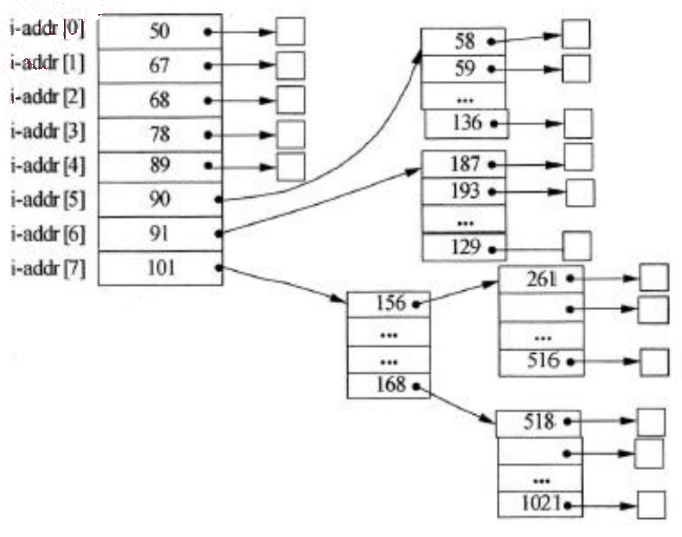
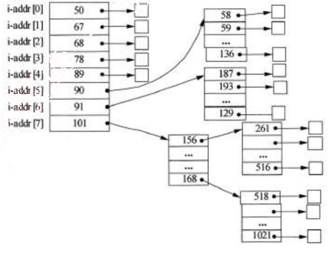
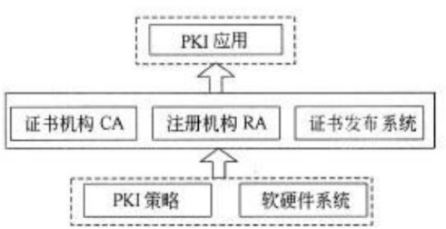
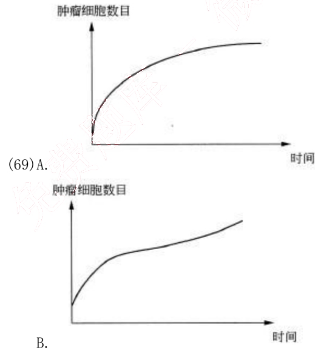
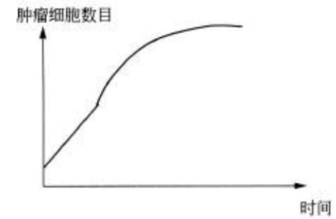
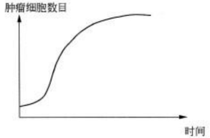
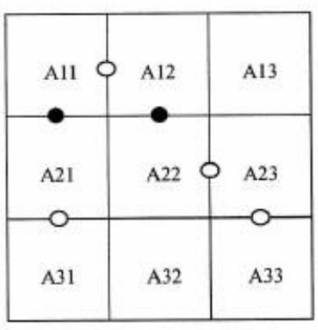

# 2012 年下半年 系统架构设计师 · 综合知识真题（75 题）

> 题干与选项取自正式试卷；答案与解析取自随卷答案详解
>
> **来源**：本地购买扫描件《2012 年下半年系统架构设计师 答案详解》（贡献者已购买并授权转录）
> **来源类型**：`real`
> **解析方式**：byted-las-document-parse（normal 模式）+ 机械清洗，已剔除页眉、广告条与页码
> **答案与解析**：取自随卷答案详解，非本仓库编写
> **使用建议**：可用于章节训练与年份模考；关键数字建议对照原始 PDF 复核
> **完整性**：综合知识 75 题、案例分析 5 题、论文 4 题齐备
> **知识点标签**：题组级 `§N` 标签，依据题干与原文解析中的考查提示标注，细分到考期题组而非逐题子编号

### 1-2.

假设系统中有n个进程共享3台打印机，任一进程在任一时刻最多只能使用1台打印机。若用PV操作控制n个进程使用打印机，则相应信号量S的取值范围为_(1)_；若信号量S的值为-3，则系统中有_(2)_个进程等待使用打印机。

(1)
A. 0，-1，…，-(n-1)
B. 3，2，1，0，-1，…，-(n-3)
C. 1，0，-1，…，-(n-1)
D. 2，1，0，-1，…，-(n-2)

(2)
A. 0
B. 1
C. 2
D. 3

**答案**：B  D

**考点**：§1 操作系统—进程管理

**解析**：本题考查操作系统进程管理方面的基础知识。

试题（1）的正确答案为选项B。根据题意，假设系统中有n个进程共享3台打印机，意味着每次只允许3个进程进入互斥段，那么信号量的初值应为3。可见，根据排除法只有选项B中含有3。

试题（2）的正确答案为选项D。信号量S的物理意义为：当S≥0时，表示资源的可用数；当S<0时，其绝对值表示等待资源的进程数。

### 3-4.

假设文件系统采用索引节点管理，且索引节点有8个地址项iaddr[0]～iaddr[7]，每个地址项大小为4B，iaddr[0]～iaddr[4]采用直接地址索引，iaddr[5]和iaddr[6]采用一级间接地址索引，iaddr[7]采用二级间接地址索引。假设磁盘索引块和磁盘数据块大小均为1KB字节，文件File1的索引节点如下图所示。若用户访问文件File1中逻辑块号为5和261的信息，则对应的物理块号分别为_(3)_；101号物理块存放的是_(4)_。

(3)
A. 89 和 90
B. 89 和 136
C. 58 和 187
D. 90 和 136

(4)
A. File1 的信息
B. 直接地址索引表
C. 一级地址索引表
D. 二级地址索引表

**答案**：C D

**考点**：§1 操作系统—文件管理

**解析**：本题考查操作系统文件管理方面的基础知识。

根据题意，磁盘索引块为 1KB，每个地址项大小为 4B，故每个磁盘索引块可存放 1024/4=256 个物理块地址。又因为文件索引节点中有 8 个地址项，其中 5 个地址项为直接地址索引，这意味着逻辑块号为 0～4 的为直接地址索引；2 个地址项是一级间接地址索引，其中第一个地址项指出的物理块中是一张一级间接地址索引表，存放逻辑块号为 5～260 对应的物理块号，第二个地址项指出的物理块中是另一张一级间接地址索引表，存放逻辑块号为 261～516 对应的物理块号。经上分析，从题图不难看出，逻辑块号为 5 的信息应该存放在 58 号物理块中，逻辑块号为 261 的信息应该存放在 187 号物理块中。

由题中可知，iaddr[7]采用二级间接地址索引，且 iaddr[7]中存放的物理块号为 101。1 个地址项是二级间接地址索引，这意味着该地址项指出的物理块中存放的是 256 个一级间接地址索引表，故 101 号物理块存放的是二级间接地址索引表。

### 5-6.

在数据库设计的需求分析阶段应当形成 (5)，这些文档可以作为 (6) 阶段的设计依据。

(5)
A. 程序文档、数据字典和数据流图
B. 需求说明文档、 程序文档和数据流图
C. 需求说明文档、 数据字典和数据流图
D. 需求说明文档、 数据字典和程序文档

(6)
A. 逻辑结构设计
B. 概念结构设计
C. 物理结构设计
D. 数据库运行和维护

**答案**：C B

**考点**：§5 数据库—需求分析文档

**解析**：本题考查数据库系统基本概念方面的基础知识。

数据库设计主要分为用户需求分析、概念结构、逻辑结构和物理结构设计四个阶段。其中，在用户需求分析阶段中，数据库设计人员采用一定的辅助工具对应用对象的功能、性能、限制等要求所进行的科学分析，并形成需求说明文档、数据字典和数据流程图。用户需求分析阶段形成的相关文档用以作为概念结构设计的设计依据。

### 7-8.

某商场商品数据库的商品关系模式P（商品代码，商品名称，供应商，联系方式，库存量），函数依赖集F={商品代码→商品名称，（商品代码，供应商）→库存量，供应商→联系方式。商品关系模式P达到 (7)；该关系模式分解成 (8) 后，具有无损连接的特性，并能够保持函数依赖。

(7)
A. 1NF
B. 2NF
C. 3NF
D. BCNF

(8)
A. P1（商品代码，联系方式），P2（商品名称，供应商，库存量）
B. P1（商品名称，联系方式），P2（商品代码，供应商，库存量）
C. P1（商品代码，商品名称，联系方式），P2（供应商，库存量）
D. P1（商品代码，商品名称），P2（商品代码，供应商，库存量），P3（供应商，联系方式）

**答案**：A D

**考点**：§5 数据库—范式

**解析**：本题考查的是应试者关系数据库方面的基础知识。

根据题意，零件P关系中的（商品代码，供应商）可决定的零件P关系的所有属性，所以零件P关系的主键为（商品代码，供应商）；又因为，根据题意（商品代码，供应商）→商品名称，而商品代码→商品名称，供应商→联系方式，可以得出商品名称和联系方式都部分依赖于码，所以，该关系模式属于1NF。

关系模式P属于1NF，1NF存在冗余度大、修改操作的不一致性、插入异常和删除异常四个问题。所以需要对模式分解，其中选项A、选项B和选项C的分解是有损且不保持函数依赖。例如，选项A中的分解P1的函数依赖集F1=∅，分解P2的函数依赖集F2=∅，丢失了F中的函数依赖，即不保持函数依赖。

### 9.

以下关于软件中间件的叙述，错误的是 (9)。

A. 中间件通过标准接口实现与应用程序的关联，提供特定功能的服务
B. 使用中间件可以提高应用软件可移植性
C. 使用中间件将增加应用软件设计的复杂度
D. 使用中间件有助于提高开发效率

**答案**：C

**考点**：§1 中间件—软件中间件

**解析**：
中间件是一种独立的系统软件或服务程序，分布式应用软件借助这种软件在不同的技术之间共享资源，中间件位于客户机服务器的操作系统之上，管理计算资源和网络通信。软件中间件的作用是为处于自己上层的应用软件提供运行与开发的环境，帮助用户开发和集成应用软件。它不仅仅要实现互连，还要实现应用之间的互操作。

### 10.

以下关于嵌入式系统开发的叙述，正确的是 (10)。

A. 宿主机与目标机之间只需要建立逻辑连接
B. 宿主机与目标机之间只能采用串口通信方式
C. 在宿主机上必须采用交叉编译器来生成目标机的可执行代码
D. 调试器与被调试程序必须安装在同一台机器上

**答案**：C

**考点**：§1 嵌入式—系统开发

**解析**：
在嵌入式系统开发中，由于嵌入式设备不具备足够的处理器能力和存储空间，程序开发一般用PC（宿主机）来完成，然后将可执行文件下载到嵌入式系统（目标机）中运行。当宿主机与目标机的机器指令不同时，就需要交叉工具链（指编译、汇编、链接等一整套工具）。

### 11.

以下关于嵌入式系统硬件抽象层的叙述，错误的是 (11)。

A. 硬件抽象层与硬件密切相关，可对操作系统隐藏硬件的多样性
B. 硬件抽象层将操作系统与硬件平台隔开
C. 硬件抽象层使软硬件的设计与调试可以并行
D. 硬件抽象层应包括设备驱动程序和任务调度

**答案**：D

**考点**：§1 嵌入式—硬件抽象层

**解析**：

硬件抽象层是位于操作系统内核与硬件电路之间的接口层，其目的在于将硬件抽象化。它隐藏了特定平台的硬件接口细节，为操作系统提供虚拟硬件平台，使其具有硬件无关性，可在多种平台上进行移植。

### 12.

(12) 不是反映嵌入式实时操作系统实时性的评价指标。

A. 任务执行时间
B. 中断响应和延迟时间
C. 任务切换时间
D. 信号量混洗时间

**答案**：A

**考点**：§1 嵌入式—实时操作系统指标

**解析**：
一个嵌入式实时操作系统（RTOS）的评价要从很多角度进行，如体系结构、API 的丰富程度、网络支持、可靠性等。其中，实时性是 RTOS 评价的最重要的指标之一，实时性的优劣是用户选择操作系统的一个重要参考。

严格地说，影响嵌入式操作系统实时性的因素有很多，如常用系统调用平均运行时间、任务切换时间、线程切换时间、信号量混洗时间（指从一个任务释放信号量到另一个等待该信号量的任务被激活的时间延迟）、中断响应时间等。

任务执行时间不是反映 RTOS 实时性的评价指标。

### 13.

以下关于网络控制的叙述，正确的是 (13)。

A. 由于 TCP 的窗口大小是固定的，所以防止拥塞的方法只能是超时重发
B. 在前向纠错系统中，当接收端检测到错误后就要请求发送端重发出错分组
C. 在滑动窗口协议中，窗口的大小以及确认应答使得可以连续发送多个数据
D. 在数据报系统中，所有连续发送的数据都可以沿着预先建立的虚通路传送

**答案**：C

**考点**：§1 网络—网络控制

**解析**：
TCP 采用可变大小的滑动窗口协议进行流量控制。在前向纠错系统中，当接收端检测到错误后就根据纠错编码的规律自行纠错；在后向纠错系统中，接收方会请求发送方重发出错分组。IP 协议不预先建立虚电路，而是对每个数据报独立地选择路由并一站一站地进行转发，直到送达目标地。

### 14.

以下关于域名服务器的叙述，错误的是 (14)。

A. 本地缓存域名服务不需要域名数据库
B. 顶级域名服务器是最高层次的域名服务器
C. 本地域名服务器可以采用递归查询和迭代查询两种查询方式
D. 权限服务器负责将其管辖区内的主机域名转换为该主机的 IP 地址

**答案**：B

**考点**：§1 网络—域名服务器

**解析**：
可提供域名服务的包括本地缓存、本地域名服务器、权限域名服务器、顶级域名服务器以及根域名服务器。DNS 主机名解析的查找顺序是，先查找客户端本地缓存，如果没有成功，则向 DNS 服务器发出解析请求。

本地缓存是内存中的一块区域，保存着最近被解析的主机名及其 IP 地址映像。由于解析程序缓存常驻内存中，所以比其他解析方法速度快。

当一个主机发出 DNS 查询报文时，这个查询报文就首先被送往该主机的本地域名服务器。本地域名服务器离用户较近，当所要查询的主机也属于同一个本地 ISP 时，该本地域名服务器立即就能将所查询的主机名转换为它的 IP 地址，而不需要再去询问其他的域名服务器。每一个区都设置有域名服务器，即权限服务器，它负责将其管辖区内的主机域名转换为该主机的 IP 地址。在其上保存有所管辖区内的所有主机域名到 IP 地址的映射。

顶级域名服务器负责管理在本顶级域名服务器上注册的所有二级域名。当收到 DNS 查询请求时，能够将其管辖的二级域名转换为该二级域名的 IP 地址。或者是下一步应该找寻的域名服务器的 IP 地址。

根域名服务器是最高层次的域名服务器。每一个根域名服务器都要存有所有顶级域名服务器的 IP 地址和域名。当一个本地域名服务器对一个域名无法解析时，就会直接找到根域名服务器，然后根域名服务器会告知它应该去找哪一个顶级域名服务器进行查询。

### 15.

以下关于网络存储的叙述，正确的是 (15)。

A. DAS 支持完全跨平台文件共享，支持所有的操作系统
B. NAS 通过 SCSI 连接至服务器，通过服务器网卡在网络上传输数据
C. FCSAN 的网络介质为光纤通道，而 IP SAN 使用标准的以太网
D. SAN 设备有自己的文件管理系统，NAS 中的存储设备没有文件管理系统

**答案**：C

**考点**：§1 网络—网络存储

**解析**：本题考查网络存储的基础知识。

DAS（Direct Attached Storage，直接附加存储）即直连方式存储。在这种方式中，存储设备是通过电缆（通常是SCSI接口电缆）直接连接服务器。I/O（输入/输入）请求直接发送到存储设备。DAS也可称为SAS （Server-Attached Storage，服务器附加存储）。它依赖于服务器，其本身是硬件的堆叠，不带有任何存储操作系统，DAS不能提供跨平台文件共享功能，各系统平台下文件需分别存储。

NAS是（Network Attached Storage）的简称，中文称为网络附加存储。在NAS存储结构中，存储系统不再通过I/O总线附属于某个特定的服务器或客户机，而是直接通过网络接口与网络直接相连，由用户通过网络来访问。

NAS设备有自己的OS，实际上是一个带有瘦服务的存储设备，其作用类似于一个专用的文件服务器，不过把显示器，键盘，鼠标等设备省去，NAS用于存储服务，可以大大降低了存储设备的成本，另外NAS中的存储信息都是采用RAID方式进行管理的， 从而有效的保护了数据。

SAN是通过专用高速网将一个或多个网络存储设备和服务器连接起来的专用存储系统，未来的信息存储将以SAN存储方式为主。SAN主要采取数据块的方式进行数据和信息的存储，目前主要使用于以太网（IPSAN）和光纤通道（FCSAN）两类环境中。

### 16.

以下关于软件架构风格与系统性能关系的叙述，错误的是（16）。

A. 对于采用层次化架构风格的系统，划分的层次越多，系统的性能越差
B. 对于采用管道-过滤器架构风格的系统，可以通过引入过滤器的数据并发处理提高系统性能
C. 对于采用面向对象架构风格的系统，可以通过减少功能调用层次提高系统性能
D. 对于采用过程调用架构风格的系统，可以通过将显式调用策略替换为隐式调用策略提高系统性能

**答案**：D

**考点**：§6 系统架构—架构风格与性能

**解析**：本题主要考查对软件架构风格与系统性能之间关系的理解。

对于采用层次化架构风格的系统，划分的层次越多，系统完成某项功能需要的中间调用操作越多，其性能越差。对于采用管道-过滤器架构风格的系统，可以通过引入过滤器的数据并发处理可以有效提高系统性能。对于采用面向对象架构风格的系统，可以通过减少功能调用层次提高系统性能。对于采用过程调用架构风格的系统，将显式调用策略替换为隐式调用策略能够提高系统的灵活性，但会降低系统的性能。

### 17.

峰值MIPS（每秒百万次指令数）用来描述计算机的定点运算速度，通过对计算机指令集中基本指令的执行速度计算得到。假设某计算机中基本指令的执行需要5个机器周期，每个机器周期为3微秒，则该计算机的定点运算速度为 (17) MIPS。

A. 8
B. 15
C. 0.125
D. 0.067

**答案**：D

**考点**：§1 计算机系统—MIPS性能计算

**解析**：
每完成一个基本指令需要 5*3=15 微秒，根据峰值MIPS的定义，其定点运算速度为1/15=0.067MIPS，特别需要注意单位“微秒”和“百万指令数”，在计算过程中恰好抵消。

### 18.

ERP 中的企业资源包括 (18)。

A. 物流、资金流和信息流
B. 物流、工作流和信息流
C. 物流、资金流和工作流
D. 资金流、工作流和信息流

**答案**：A

**考点**：§2 信息系统—ERP资源

**解析**：本题考查企业资源的基本概念。
ERP 中的企业资源包括企业的“三流”资源，即物流资源、资金流资源和信息流资源。ERP 实际上就是对这“三流”资源进行全面集成管理的管理信息系统。

### 19-20.

CRM 是一套先进的管理思想及技术手段，它通过将 (19) 进行有效的整合，最终为企业涉及到的各个领域提供了集成环境。CRM 系统的四个主要模块包括 (20)。

(19)
A. 员工资源、客户资源与管理技术
B. 销售资源、信息资源与商业智能
C. 销售管理、市场管理与服务管理
D. 人力资源、业务流程与专业技术

(20)
A. 电子商务支持、呼叫中心、移动设备支持、数据分析
B. 信息分析、网络应用支持、客户信息仓库、工作流集成
C. 销售自动化、营销自动化、客户服务与支持、商业智能
D. 销售管理、市场管理、服务管理、现场服务管理

**答案**：D C

**考点**：§2 信息系统—企业信息化

**解析**：本题考查企业信息化的基本知识。
CRM 是一套先进的管理思想及技术手段，它通过将人力资源、业务流程与专业技术进行有效的整合，最终为企业涉及到客户或者消费者的各个领域提供了完美的集成，使得企业可

以更低成本、更高效率地满足客户的需求，并与客户建立起基于学习性关系基础上的一对一营销模式，从而让企业可以最大程度提高客户满意度和忠诚度。CRM 系统的主要模块包括销售自动化、营销自动化、客户服务与支持、商业智能。

### 21.

企业信息化程度是国家信息化建设的基础和关键，企业信息化方法不包括 (21)。

A. 业务流程重组
B. 组织机构变革
C. 供应链管理
D. 人力资本投资

**答案**：B

**考点**：§2 信息系统—企业信息化方法

**解析**：本题考查企业信息化的基本方法。

企业信息化程度是国家信息化建设的基础和关键，企业信息化就是企业利用现代信息技术，通过信息资源的深入开发和广泛利用，实现企业生产过程的自动化、管理方式的网络化、决策支持的智能化和商务运营的电子化，不断提高生产、经营、管理、决策的效率和水平，进而提高企业经济效益和企业竞争力的过程。企业信息化方法主要包括 业务流程重构、核心业务应用、信息系统建设、主题数据库、资源管理和人力资本投资方法。企业战略规划是指依据企业外部环境和自身条件的状况及其变化来制定和实施战略，并根据对实施过程与结果的评价和反馈来调整，制定新战略的过程。

### 22-23.

企业信息资源集成管理的前提是对企业 (22)的集成，其核心是对企业 (23)的集成。

(22)
A. 信息功能
B. 信息设施
C. 信息活动
D. 信息处理

(23)
A. 业务流
B. 内部信息流
C. 外部信息流
D. 内部和外部信息流

**答案**：A D

**考点**：§2 信息系统—信息资源管理

**解析**：本题考查信息资源管理的基本知识。

集成管理是企业信息资源管理的主要内容之一。实行企业信息资源集成的前提是对企业历史上形成的企业信息功能的集成，其核心是对企业内部和外部信息流的集成，其实施的基础是各种信息手段的集成。通过集成管理实现企业信息系统各要素的优化组合，使信息系统各要素之间形成强大的协同作用，从而最大限度地放大企业信息的功能，实现企业可持续发展的目的。

### 24.

为了加强对企业信息资源的管理，企业应按照信息化和现代化企业管理要求设置信息管理机构，建立信息中心。信息中心的主要职能不包括 (24)。

A. 处理信息，确定信息处理的方法
B. 用先进的信息技术提高业务管理水平

C. 组织招聘信息资源管理员
D. 建立业务部门期望的信息系统和网络

**答案**：C

**考点**：§2 信息系统—信息中心职能

**解析**：本题考查企业信息中心的主要职能。

为了加强对企业信息资源的管理，企业应按照信息化和现代化企业管理要求设置信息管理机构，建立信息中心，确定信息主管，统一管理和协调企业信息资源的开发、收集和使用。信息中心是企业的独立机构，直接由最高层领导并为企业最高管理者提供服务。其主要职能是处理信息，确定信息处理的方法，用先进的信息技术提高业务管理水平，建立业务部门期望的信息系统和网络并预测未来的信息系统和网络，培养信息资源的管理人员等。

### 25.

以下关于软件生存周期模型的叙述，正确的是(25)。

A. 在瀑布模型中/前一个阶段的错误和疏漏会隐蔽地带到后一个阶段
B. 在任何情况下使用演化模型，都能在一定周期内由原型演化到最终产品
C. 软件生存周期模型的主要目标是为了加快软件开发的速度
D. 当一个软件系统的生存周期结束之后，它就进入到一个新的生存周期模型

**答案**：A

**考点**：§4 软件工程—生存周期模型

**解析**：

软件产品从形成概念开始，经过开发、使用和维护，直到最后退役的全过程成为软件生存周期。一个完整的软件生存周期是以需求为出发点，从提出软件开发计划的那一刻开始，直到软件在实际应用中完全报废为止。软件生存周期的提出是为了更好地管理、维护和升级软件，其中更大的意义在于管理软件开发的步骤和方法。

软件生存周期模型又称软件开发模型（software develop model）或软件过程模型（software process model），它是从某个特定角度提出的软件过程的简化描述。软件生存周期模型主要有瀑布模型、演化模型、原型模型、螺旋模型喷泉模型和基于可重用构件的模型等。

瀑布模型是最早使用的软件生存周期模型之一。瀑布模型的特点是因果关系紧密相连，前一个阶段工作的结果是后一个阶段工作的输入。或者说，每一个阶段都是建立在前一个阶段的正确结果之上，前一个阶段的错误和疏漏会隐蔽地带入后一个阶段。这种错误有时甚至可能是灾难性的，因此每一个阶段工作完成后，都要进行审查和确认。

演化模型主要针对事先不能完整定义需求的软件开发，是在快速开发一个原型的基础上，根据用户在调用原型的过程中提出的反馈意见和建议，对原型进行改进，获得原型的新版本，

重复这一过程，直到演化成最终的软件产品。演化模型的主要优点是，任何功能一经开发就能进入测试，以便验证是否符合产品需求，可以帮助引导出高质量的产品要求。其主要缺点是，如果不控制地让用户接触开发中尚未稳定的功能，可能对开发人员及永固都会产生负面的影响。

### 26.

螺旋模型将整个软件开发过程分为多个阶段，每个阶段都由目标设定、(26)、开发和有效性验证以及评审4个部分组成。

A. 需求分析
B. 风险分析
C. 系统设计
D. 架构设计

**答案**：B

**考点**：§4 软件工程—螺旋模型

**解析**：

螺旋模型是在快速原型的基础上扩展而成的一种生存周期模型。这种模型将整个软件开发流程分成多个阶段，每个阶段都由4部分组成，它们是：
①目标设定。为该项目进行需求分析，定义和确定这一个阶段的专门目标，指定对过程和产品的约束，并且制定详细的管理计划。
②风险分析。对可选方案进行风险识别和详细分析，制定解决办法，采取有效的措施避免这些风险。
③开发和有效性验证。风险评估后，可以为系统选择开发模型，并且进行原型开发，即开发软件产品。
④评审。对项目进行评审，以确定是否需要进入螺旋线的下一次回路，如果决定继续，就要制定下一阶段计划。

螺旋模型的软件开发过程实际是上述4个部分的迭代过程，每迭代一次，螺旋线就增加一周，软件系统就生成一个新版本，这个新版本实际上是对目标系统的一个逼近。经过若干次的迭代后，系统应该尽快地收敛到用户允许或可以接受的目标范围内，否则也可能中途夭折。

### 27-28.

基于 UML 的需求分析过程的基本步骤为：利用 (27) 表示需求；利用 (28) 表示目标软件系统的总体架构。

(27)
A. 用例及用例图
B. 包图及类图
C. 剧情及序列图
D. 组件图及部署图

(28)
A. 用例及用例图
B. 包图及类图
C. 剧情及序列图
D. 组件图及部署图

**答案**：A B

**考点**：§4 软件工程—UML图

**解析**：
基于UML的需求分析过程大致可分为以下步骤：
①利用用例及用例图表示需求。从业务需求描述出发获取执行者和场景；对场景进行汇总、分类、抽象，形成用例；确定执行者与用例、用例与用例图之间的关系，生成用例图。
②利用包图和类图表示目标软件系统的总体框架结构。根据领域知识、业务需求描述和既往经验设计目标软件系统的顶层架构；从业务需求描述中提取“关键概念”，形成领域概念模型；从概念模型和用例出发，研究系统中主要的类之间的关系，生成类图。

### 29-30.

快速应用开发（Rapid Application Development，RAD）通过使用基于 (29) 的开发方法获得快速开发。当(30)时，最适合于采用RAD方法。

(29)
A. 用例
B. 数据结构
C. 剧情
D. 构件

(30)
A. 一个新系统要采用很多新技术
B. 新系统与现有系统有较高的互操作性
C. 系统模块化程度较高
D. 用户不能很好地参与到需求分析中

**答案**：D  C

**考点**：§4 软件工程—面向对象要素

**解析**：
快速应用开发（Rapid Application Development，RAD）是一种比传统生存周期法快得多的开发方法，它强调极短的开发周期。RAD模型是瀑布模型的一个高速变种，通过使用基于构件的开发方法获得快速开发。如果需求理解得很好，且约束了项目范围，利用这种模型可以很快地开发出功能完善的信息系统。但是RAD也具有以下局限性：
①并非所有应用都适合RAD。RAD对模块化要求比较高，如果有哪一项功能不能被模块化，那么RAD所需要的构建就会有问题；如果高性能是一个指标，且该指标必须通过调整接口使其适应系统构件才能获得，则RAD也有可能不能奏效。
②开发者和客户必须在很短的时间完成一系列的需求分析，任何一方配合不当，都会导致RAD项目失败。
③RAD只能用于管理信息系统的开发，不适合技术风险很高的情况。例如，当一个新系统要采用很多新技术，或当新系统与现有系统有较高的互操作性时，就不适合使用RAD。

### 31.

以下关于软件开发方法的叙述，错误的是 (31)。

A. 对于较为复杂的应用问题，适合采用形式化方法进行需求分析
B. 形式化方法的优势在于能够精确地表述和研究应用问题及其软件实现

C. 净室软件工程将正确性验证作为发现和排除错误的主要机制
D. 净室软件工程强调统计质量控制技术，包括对客户软件使用预期的测试

**答案**：A

**考点**：§4 软件工程—软件开发方法

**解析**：
软件开发方法是指软件开发过程所遵循的办法和步骤，从不同的角度可以对软件开发方法进行不同的分类。

形式化方法是一种具有坚实数学基础的方法，从而允许对系统和开发过程做严格处理和论证，适用于那些系统安全级别要求极高的软件的开发。形式化方法的主要优越性在于它能够数学地表述和研究应用问题及软件实现。但是它要求开发人员具备良好的数学基础。用形式化语言书写的大型应用问题的软件规格说明往往过于细节化，并且难为用户和软件设计人员所理解。由于这些缺陷，形式化方法在目前的软件开发实践中并未得到普遍应用。

净室软件工程（Cleanroom Software Engineering, CSE）是软件开发的一种形式化方法，可以开发较高质量的软件。它使用盒结构规约进行分析和建模，并且将正确性验证作为发现和排除错误的主要机制，使用统计测试来获取认证软件可靠性所需要的信息。CSE 强调在规约和设计上的严格性，还强调统计质量控制技术，包括基于客户对软件的预期使用测试。

### 32-34.

软件开发环境应支持多种集成机制。根据功能不同，可以将集成机制分为三个部分：(32)，用以存储与系统开发有关的信息，并支持信息的交流与共享；(33)，是实现过程集成和控制集成的基础；(34)，它的统一性和一致性是软件开发环境的重要特征。

(32)
A. 算法模型库
B. 环境信息库
C. 信息模型库
D. 用户界面库

(33)
A. 工作流与日志服务器
B. 进程通信与数据共享服务器
C. 过程控制与消息服务器
D. 同步控制与恢复服务器

(34)
A. 底层数据结构
B. 数据处理方法
C. 业务过程模型
D. 环境用户界面

**答案**：B C D

**考点**：§4 软件工程—工作流与中间件

**解析**：
软件开发环境（Software Development Environment, SDE）是指支持软件的工程化开发和维护而使用的一组软件，由软件工具集和环境集成机制构成。

软件开发环境应支持多种集成机制，根据功能的不同，集成机制可以划分为环境信息库、过程控制与消息服务器、环境用户界面三个部分。

①环境信息库。环境信息库是软件开发环境的核心，用以存储与系统开发有关的信息，

并支持信息的交流与共享。环境信息库中主要存储两类信息，一类是开发过程中产生的有关被开发系统的信息，例如分析文档、设计文档和测试报告等；另一类是环境 提供的支持信息，如文档模板、系统配置、过程模型和可复用构件等。

②过程控制与消息服务器。过程控制与消息服务器是实现过程集成和控制集成的基础。过程集成时按照具体软件开发过程的要求进行工具的选择与组合，控制集成使各工具之间进行并行通信和协同工作。

③环境用户界面。环境用户界面包括环境总界面和由它实行统一控制的各环境部件及工具的界面。统一的、具有一致性的用户界面是软件开发环境的重要特征，是充分发挥环境的优越性、高效地使用工具并减轻用户的学习负担的保证。

### 35.

对于违反里氏替换原则的两个类 A 和 B，可以采用的候选解决方案中，正确的是 (35).

A. 尽量将一些需要扩展的类或者存在变化的类设计为抽象类或者接口，并将其作为基类，在程序中尽量使用基类对象进行编程

B. 创建一个新的抽象类 C，作为两个具体类的超类，将 A 和 B 共同的行为移动到 C中，从而解决 A 和 B 行为不完全一致的问题

C. 将 B 到 A 的继承关系改成组合关系

D. 区分是“Is-a”还是“Has-a”。如果是 Is-a，可以使用继承关系，如果是 Has-a，应该改成组合或聚合关系

**答案**：A

**考点**：§4 软件工程—里氏替换原则

**解析**：

里氏替换原则是面向对象设计原则之一，由Barbara liskov提出，其基本思想是，一个软件实体如果使用的是一个基类对象，那么一定适用于其子类对象，而且觉察不出基类对象和子类对象的区别，即把基类都替换成它的子类，程序的行为没有变化。反过来则不一定成立，如果一个软件实体使用的是一个子类对象，那么它不一定适用于基类对象。

在运用里氏替换原则时，尽量将一些需要扩展的类或者存在变化的类设计为抽象类 或者接口，并将其作为基类，在程序中尽量使用基类对象进行编程。由于子类继承基类并实现其中的方法，程序运行时，子类对象可以替换基类对象，如果需要对类的行为进行修改，可以扩展基类，增加新的子类，而无需修改调用该基类对象的代码。

### 36.

以下关于黑盒测试用例设计方法的叙述，错误的是 (36)。

A. 边界值分析通过选择等价类边界作为测试用例，不仅重视输入条件边界，而且也必须考虑输出域边界

B. 因果图方法是从用自然语言书写的程序规格说明的描述中找出因（输入条件）和果（输出或程序状态的改变），可以通过因果图转换为判定表

C. 正交试验设计法，就是使用已经造好了的正交表格来安排试验并进行数据分析的一种方法，目的是用最少的测试用例达到最高的测试覆盖率

D. 等价类划分法根据软件的功能说明，对每一个输入条件确定若干个有效等价类和无效等价类，但只能为有效等价类设计测试用例

**答案**：D

**考点**：§4 软件工程—黑盒测试用例

**解析**：

黑盒测试也称为功能测试，主要用于集成测试，确认测试和系统测试阶段。黑盒测试根据软件需求规格说明所规定的功能来设计试用例，一般包括功能分解、等价类划分、边界值分析、判定表、因果图、状态图、随机测试、错误推测和正交试验法等。

在设计测试用例时，等价类划分是用得最多的一种黑盒测试方法。所谓等价类就是某个输入域的集合，对每一个输入条件确定若干个有效等价类和若干个无效等价类，分别设计覆盖有效等价类和无效等价类的测试用例。无效等价类是用来测试非正常的输入数据的，所以要为每个无效等价类设计一个测试用例。

边界值分析通过选择等价类边界作为测试用例，不仅重视输入条件边界，而且也必须考虑输出域边界。在实际测试工作中，将等价类划分法和边界值分析结合使用，能更有效地发现软件中的错误。

因果图方法是从用自然语言书写的程序规格说明的描述中找出因（输入条件）和果（输出或程序状态的改变），可以通过因果图转换为判定表。

正交试验设计法，就是使用已经造好了的正交表格来安排试验并进行数据分析的一种方法，目的是用最少的测试用例达到最高的测试覆盖率。

### 37.

以下关于软件测试工具的叙述，错误的是 (37)。

A. 静态测试工具可用于对软件需求、结构设计、详细设计和代码进行评审、走查和审查

B. 静态测试工具可对软件的复杂度分析、数据流分析、控制流分析和接口分析提供支持

C. 动态测试工具可用于软件的覆盖分析和性能分析
D. 动态测试工具不支持软件的仿真测试和变异测试

**答案**：D

**考点**：§4 软件工程—测试工具

**解析**：
测试工具根据工作原理不同可分为静态测试工具和动态测试工具。其中静态测试工具是对代码进行语法扫描，找到不符合编码规范的地方，根据某种质量模型评价代码的质量，生成系统的调用关系图等。它直接对代码进行分析，不需要运行代码，也不需要对代码编译链接和生成可执行文件，静态测试工具可用于对软件需求、结构设计、详细设计和代码进行评审、走审和审查，也可用于对软件的复杂度分析、数据流分析、控制流分析和接口分析提供支持；动态测试工具与静态测试工具不同，它需要运行被测试系统，并设置探针，向代码生成的可执行文件中插入检测代码，可用于软件的覆盖分析和性能分析，也可用于软件的模拟、建模、仿真测试和变异测试等。

### 38.

架构描述语言（Architecture Description Language，ADL）是一种为明确说明软件系统的概念架构和对这些概念架构建模提供功能的语言。ADL 主要包括以下组成部分：组件、组件接口、(38)和架构配置。

A. 架构风格
B. 架构实现
C. 连接件
D. 组件实现

**答案**：C

**考点**：§6 系统架构—架构描述语言ADL

**解析**：本题主要考查架构描述语言的知识。
架构描述语言（Architecture Description Language，ADL）是一种为明确说明软件系统的概念架构和对这些概念架构建模提供功能的语言。ADL 主要包括以下组成部分：组件、组件接口、连接件和架构配置。ADL 对连接件的重视成为区分 ADL 和其他建模语言的重要特征之一。

### 39-41.

ANSI/IEEE 1471-2000 是对软件密集型系统的架构进行描述的标准。在该标准中，(39)这一概念主要用于描述软件架构模型。在此基础上，通常采用(40)描述某个利益相关人（Stakeholder）所关注架构模型的某一方面。(41)则是对所有利益相关人关注点的响应和回答。

(39)
A. 上下文
B. 架构风格
C. 组件
D. 视图

(40)
A. 环境
B. 资源
C. 视角
D. 场景

(41)
A. 架构
B. 系统
C. 模型
D. 使命

**答案**：D C A

**考点**：§6 系统架构—ANSI/IEEE 1471视图

**解析**：本题主要考查 ANSI/IEEE 1471-2000 标准的相关知识。

在 ANSI/IEEE 1471-2000 标准中，系统是为了达成利益相关人（Stakeholder）的某些使命（Mission），在特定环境（Enviroment）中构建的。每一个系统都有一个架构（Architecture）。架构是对所有利益相关人的关注点（Concern）的响应和回答，通过架构描述（Architecture Description）来说明。每一个利益相关人都有各自的关注点。这些关注点是指对其重要的，与系统的开发、运营或其他方面相关的利益。架构描述（Architecture Description）本质上是多视图的。每一个视图（View）是从一个特定的视角（Viewpoint）来表述架构的某一个独立的方面。试图用一个单一的视图来覆盖所有的关注点当然是最好的，但实际上这种表述方式将很难理解。视角（Viewpoint）的选择，基于要解决哪些利益相关人的哪些关注点。它决定了用来创建视图的语言、符号和模型等，以及任何与创建视图相关的建模方法或者分析技术。一个视图（View）包括一个或者多个架构模型（Model），一个模型也可能参与多个视图。模型较文本的表述的好处在于，可以更容易的可视化、检查、分析、管理和集成。

### 42-43.

采用以架构为核心的软件开发方法，在建立软件架构的初期，首要任务是选择一个合适的 (42)，在此基础上，开发人员通过架构模型，可以获得关于 (43) 的理解，为将来的架构实现与演化过程建立了目标。

(42)
A. 分析模式
B. 设计模式
C. 架构风格
D. 架构标准
(43)
A. 架构需求
B. 架构属性
C. 架构优先级
D. 架构约束

**答案**：C B

**考点**：§6 系统架构—架构风格与模式

**解析**：本题主要考查以架构为核心的软件系统开发方法。

在该方法中，架构用来激发和调整设计策略，不同的视图用来表达与质量目标有关的信息。架构设计是一个迭代过程，在建立软件架构的初期，选择一个合适的架构风格是首要的，在此基础上，开发人员通过架构模型，可以获得关于软件架构属性的理解，为将来的架构实现与演化过程建立了目标。

在数据库系统中，“事务”是访问数据库并可能更新各种数据项的一个程序执行单元。为了保证数据完整性，要求数据库系统维护事务的原子性、一致性、隔离性和持久性。针对

事务的这4种特性，考虑以下的架构设计场景：

### 44-48.

假设在某一个时刻只有一个活动的事务，为了保证事务的原子性，对于要执行写操作的数据项，数据库系统在磁盘上维护数据库的一个副本，所有的写操作都在数据库副本上执行，而保持原始数据库不变，如果在任一时刻操作不得不中止，系统仅需要删除副本，原数据库没有受到任何影响。这种设计策略称为 (44)。

持久性保证一旦事务完成，该事务对数据库所做的所有更新都是永久的，如果事务完成后系统出现故障，则需要通过恢复机制保证事务的持久性。假设在日志中记录所有对数据库的修改操作，将一个事务的所有写操作延迟到事务提交后才执行，则在日志中 (47)，当系统发生故障时，如果某个事务已经开始，但没有提交，则该事务应该 (48)。

(44)
A. 主动冗余
B. 影子拷贝
C. 热备份
D. 多版本编程

(45)
A. 逻辑正确性检查
B. 物理正确性检查
C. 完整性约束检查
D. 唯一性检查

(46)
A. 能够保证事务的可串行化执行，可能发生死锁
B. 不能保证事务的可串行化执行，不会发生死锁
C. 不能保证事务的可串行化执行，可能发生死锁
D. 能够保证事务的可串行化执行，不会发生死锁

(47)
A. 无需记录“事务开始执行”这一事件
B. 无需记录“事务已经提交”这一事件
C. 无需记录数据项被事务修改后的新值
D. 无需记录数据项被事务修改前的原始值

(48)
A. 重做
B. 撤销
C. 什么都不做
D. 抛出异常后退出

**答案**：B C A D C

事务的一致性要求在没有其他事务并发执行的情况下，事务的执行应该保证数据库的一致性。数据库系统通常采用 (45) 机制保证单个事务的一致性。

事务的隔离性保证操作并发执行后的系统状态与这些操作以某种次序顺序执行（即可串行化执行）后的状态是等价的。两阶段锁协议是实现隔离性的常见方案，该协议 (46)。

**考点**：§5 数据库—事务与日志

**解析**：本题主要考查数据库系统架构设计知识。

在数据库系统中，“事务”是访问并可能更新各种数据项的一个程序执行单元。为了保证数据完整性，要求数据库系统维护事务的原子性、一致性、隔离性和持久性。

题干中第1个架构设计场景描述了数据库设计中为了实现原子性和持久性的最为简单的策略：“影子拷贝”。该策略假设在某一个时刻只有一个活动的事务，首先对数据库做副本（称为影子副本），并在磁盘上维护一个 dp_pointer 指针，指向数据库的当前副本。对于要执行写操作的数据项，数据库系统在磁盘上维护数据库的一个副本，所有的写操作都在数据

库副本上执行，而保持原始数据库不变，如果在任一时刻操作不得不中止，系统仅需要删除新副本，原数据库副本没有受到任何影响。

题干中的第2个架构设计场景主要考查考生对事务一致性实现机制的理解。事务的一致性要求在没有其他事务并发执行的情况下，事务的执行应该保证数据库的一致性。数据库系统通常采用完整性约束检查机制保证单个事务的一致性。

题干中的第3个架构设计场景主要考查数据库的锁协议。两阶段锁协议是实现事务隔离性的常见方案，该协议通过定义锁的增长和收缩两个阶段约束事务的加锁和解锁过程，能够保证事务的串行化执行，但由于事务不能一次得到所有需要的锁，因此该协议会可能会导致死锁。

题干中的第4个架构设计场景主要考查数据库的恢复机制，主要描述了基于日志的延迟修改技术（deferred-modification technique）的设计与恢复过程。该技术通过在日志中记录所有对数据库的修改操作，将一个事务的所有写操作延迟到事务提交后才执行，

日志中需要记录“事务开始”和“事务提交”时间，还需要记录数据项被事务修改后的新值，无需记录数据项被事务修改前的原始值。当系统发生故障时，如果某个事务已经开始，但没有提交，则该事务对数据项的修改尚未体现在数据库中，因此无需做任何恢复动作。

### 49-50.

若系统中的某子模块需要为其他模块提供访问不同数据库系统的功能，这些数据库系统提供的访问接口有一定的差异，但访问过程却都是相同的，例如，先连接数据库，再打开数据库，最后对数据进行查询。针对上述需求，可以采用 (49) 设计模式抽象出相同的数据库访问过程，该设计模式 (50)。

(49)
A. 外观
B. 装饰
C. 桥接
D. 享元

(50)
A. 可以动态、透明地给单个对象添加职责
B. 为子系统定义了一个高层接口，这个接口使得这一子系统更加容易使用
C. 通过运用共享技术，有效支持大量细粒度的对象
D. 将抽象部分与它的实现部分分离，使它们都可以独立地变化

**答案**：A B

**考点**：§6 系统架构—设计模式

**解析**：

外观（façade）模式是对象的结构模式，要求外部与一个子系统的通信必须通过一个统一的外观对象进行，为子系统中的一组接口提供一个一致的界面，外观模式定义了一个高层接口，这个接口使得这一子系统更加容易使用。

某软件公司欲设计一款图像处理软件，帮助用户对拍摄的照片进行后期处理。在软件需求分析阶段，公司的系统分析师识别出了如下3个关键需求：

图像处理软件需要记录用户在处理照片时所有动作，并能够支持用户动作的撤销与重做等行为。

图像处理软件需要根据当前正在处理的照片的不同特征选择合适的处理操作，处理操作与照片特征之间具有较为复杂的逻辑关系。

图像处理软件需要封装各种图像处理算法，用户能够根据需要灵活选择合适的处理算法；软件还要支持高级用户根据一定的规则添加自定义处理算法。

### 51-53.

在系统设计阶段，公司的架构师决定采用设计模式满足上述关键需求中对系统灵活性与扩展性的要求。具体来说，为了支持灵活的撤销与重做等行为，采用 (51) 最为合适；为了封装图像操作与照片特征之间的复杂逻辑关系，采用 (52) 最为合适；为了实现图像处理算法的灵活选择与替换，采用 (53) 最为合适。

(51)
A. 工厂模式
B. 责任链模式
C. 中介者模式
D. 命令模式

(52)
A. 状态模式
B. 适配器模式
C. 组合模式
D. 单例模式

(53)
A. 模板方法模式
B. 访问者模式
C. 策略模式
D. 观察者模式

**答案**：D A C

**考点**：§6 系统架构—设计模式

**解析**：本题主要考查设计模式知识。

题干描述了某软件公司一款图像处理软件的需求分析与设计过程，并明确指出采用设计模式实现关键需求对系统灵活性与扩展性的要求。针对需求1，为了支持灵活的撤销与重做等行为，采用命令模式最为合适，因为命令模式可以将一个请求封装为一个对象，从而使你可用不同的请求对客户进行参数化，还可以对请求排队，或记录请求日志，以及支持可撤销的操作。针对需求2，为了封装图像操作与照片特征之间的复杂逻辑关系，采用状态模式最为合适，因为状态模式将每一个条件分支放入一个独立的类中，这样就可以根据对象自身的情况将对象的状态作为一个对象，这一对象可以不依赖于其他对象而独立变化；针对需求3，为了实现图像处理算法的灵活选择与替换，采用策略模式最为合适，因为策略模式定义一系列的算法，把它们封装起来，并且使它们可相互替换，使得算法可独立于使用它的客户而变化。

特定领域软件架构（Domain Specific Software Architecture, DSSA）是在一个特定应

### 54-55.

用领域中，为一组应用提供组织结构参考的标准软件体系结构。DSSA 的基本活动包括领域分析、领域设计和领域实现。其中领域分析的主要目的是获得 (54)，从而描述领域中系统之间共同的需求，即领域需求；领域设计的主要目标是获得 (55)，从而描述领域模型中表示需求的解决方案；领域实现的主要目标是开发和组织可重用信息，并对基础软件架构进行实现。

(54)
A. 领域边界
B. 领域信息
C. 领域对象
D. 领域模型

(55)
A. 特定领域软件需求
B. 特定领域软件架构
C. 特定领域软件设计模型
D. 特定领域软件重用模型

**答案**：D B

**考点**：§6 系统架构—领域模型

**解析**：
特定领域软件架构（Domain Specific Software Architecture，DSSA）以一个特定问题领域为对象，形成由领域参考模型、参考需求、参考架构等组成的开发基础架构，其目标是支持一个特定领域中多个应用的生成。DSSA 的基本活动包括领域分析、领域设计和领域实现。其中领域分析的主要目的是获得领域模型，领域模型描述领域中系统之间共同的需求，即领域需求；领域设计的主要目标是获得 DSSA，DSSA 描述领域模型中表示需求的解决方案；领域实现的主要目标是依据领域模型和 DSSA 开发和组织可重用信息，并对基础软件架构进行实现。

### 56-61.

某公司欲开发一个在线交易系统，在架构设计阶段，公司的架构师识别出3个核心质量属性场景。其中“在并发用户数量为1000人时，用户的交易请求需要在0.5秒内得到响应”主要与 (56)质量属性相关，通常可采用 (57)架构策略实现该属性；“当系统由于软件故障意外崩溃后，需要在0.5小时内恢复正常运行”主要与 (58)质量属性相关，通常可采用 (59)架构策略实现该属性；“系统应该能够抵挡恶意用户的入侵行为，并进行报警和记录”主要与 (60)质量属性相关，通常可采用 (61)架构策略实现该属性。

(56)
A. 性能
B. 吞吐量
C. 可靠性
D. 可修改性

(57)
A. 操作串行化
B. 资源调度
C. 心跳
D. 内置监控器

(58)
A. 可测试性
B. 易用性
C. 可用性
D. 互操作性

(59)
A. 主动冗余
B. 信息隐藏
C. 抽象接口
D. 记录/回放

(60)
A. 可用性
B. 安全性
C. 可测试性
D. 可修改性

(61)
A. 内置监控器
B. 记录/回放
C. 追踪审计
D. 维护现有接口

**答案**：A B C A B C

**考点**：§7 质量属性与评估—质量属性与策略

**解析**：本题主要考查考生对质量属性的理解和质量属性实现策略的掌握。

对于题干描述：“在并发用户数量为1000人时，用户的交易请求需要在0.5秒内得到响应”，主要与性能这一质量属性相关，实现该属性的常见架构策略包括：增加计算资源、减少计算开销、引入并发机制、采用资源调度等。“当系统由于软件故障意外崩溃后，需要在0.5小时内恢复正常运行”主要与可用性质量属性相关，通常可采用心跳、Ping/Echo、主动冗余、被动冗余、选举等架构策略实现该属性；“系统应该能够抵挡恶意用户的入侵行为，并进行报警和记录”主要与安全性质量属性相关，通常可采用入侵检测、用户认证、用户授权、追踪审计等架构策略实现该属性。

### 62-63.

基于场景的架构分析方法（Scenarios-based Architecture Analysis Method，SAAM）是卡耐基梅隆大学软件工程研究所的Kazman等人于1983年提出的一种非功能质量属性的架构分析方法，是最早形成文档并得到广泛应用的软件架构分析方法。SAAM的主要输入是问题描述、(62)和架构描述文档，其分析过程主要包括场景开发、(63)、单个场景评估、场景交互和总体评估。

(62)
A. 问题说明
B. 问题建模
C. 需求说明
D. 需求建模

(63)
A. 架构需求
B. 架构描述
C. 架构设计
D. 架构实现

**答案**：C B

**考点**：§7 质量属性与评估—SAAM

**解析**：本题主要考查考生对基于场景的架构分析方法（Scenarios-based Architecture Analysis Method, SAAM）的掌握和理解。

SAAM 是卡耐基梅隆大学软件工程研究所的 Kazman 等人于 1983 年提出的一种非功能质量属性的架构分析方法，是最早形成文档并得到广泛应用的软件架构分析方法。SAAM 的主要输入是问题描述、需求说明和架构描述，其分析过程主要包括场景开发、架构描述、单个场景评估、场景交互和总体评估。

### 64-65.

下图所示 PKI 系统结构中，负责生成和签署数字证书的是(64)，负责验证用户身份的是(65)。

(64)
A. 证书机构 CA
B. 注册机构 RA
C. 证书发布系统
D. PKI 策略

(65)
A. 证书机构 CA
B. 注册机构 RA
C. 证书发布系统
D. PKI 策略

**答案**：A B

**考点**：§3 信息安全—PKI

**解析**：本题考查网络安全方面关于 PKI 的基础知识。

在 PKI 系统体系中，证书机构 CA 负责生成和签署数字证书，注册机构 RA 负责验证申请数字证书用户的身份。

### 66.

中国 M 公司与美国 L 公司分别在各自生产的平板电脑产品上使用 iPad 商标，且分别享有各自国家批准的商标专用权。中国 Y 手电筒经销商，在其经销的手电筒高端产品上也使用 iPad 商标，并取得了注册商标。以下说法正确的是 (66)。

A. L 公司未经 M 公司许可在中国市场销售其产品不属于侵权行为
B. L 公司在中国市场销售其产品需要取得 M 公司和 Y 经销商的许可
C. L 公司在中国市场销售其产品需要向 M 公司支付注册商标许可使用费
D. Y 经销商在其经销的手电筒高端产品上使用 iPad 商标属于侵权行为

**答案**：C

**考点**：§11 标准化与知识产权—商标权

**解析**：本题考查知识产权知识，涉及商标权的相关概念。

知识产权具有地域性的特征，按照一国法律获得承认和保护的知识产权，只能在该国发生法律效力，即知识产权受地域限制，只有在一定地域内知识产权才具有独占性（专用性）。或者说，各国依照其本国法律授予的知识产权，只能在其本国领域内受其国家的法律保护，而其他国家对这种权利没有保护的义务，任何人均可在自己的国家内自由使用外国人的知识产品，既无须取得权利人的许可，也不必向权利人支付报酬。

通过缔结有关知识产权的国际公约的形式，某一国家的国民（自然人或法人）的知识产权在其他国家也能取得权益。参加知识产权国际公约的国家，会相互给予成员国国民的知识产权保护。虽然众多知识产权国际条约等的订立，使地域性有时会变得模糊，但地域性的特征不但是知识产权最“古老”的特征，也是最基本的特征之一。目前知识产权的地域性仍然

存在，如是否授予权利、如何保护权利，仍须由各成员国按照其国内法来决定。依据我国商标法 52 条规定，未注册商标不得与他人在同一种或类似商品上已经注册的商标相同或近似。若未经商标注册人的许可，在同一种商品或者类似商品上使用与他人注册商标相同或者近似的商标的，属于侵犯专用权的行为，应当承担相应的法律责任。

知识产权的利用（行使）有多种方式，许可使用是其之一，它是指知识产权人将自己的权利以一定的方式，在一定的地域和期限内许可他人利用，并由此获得报酬（即向被许可人收取一定数额的使用费）的法律行为。对于注册商标许可而言是指注册商标所有人通过订立许可使用合同，许可他人使用其注册商标的法律行为。

依据我国商标法规定，不同类别商品（产品）是可以使用相同或类似商标的，如在水泥产品和化肥产品都可以使用“秦岭”商标，因为水泥产品和化肥产品是不同类别的产品。但对于驰名商标来说，不能在任何商品（产品），使用与驰名商标相同或类似的标识。

### 67.

M 画家将自己创作的一幅美术作品原件赠与了 L 公司。L 公司未经该画家的许可， 擅自将这幅美术作品作为商标注册，且取得商标权，并大量复制用于该公司的产品上。L 公司的行为侵犯了 M 画家的 (67)。

A. 著作权
B. 发表权
C. 商标权
D. 展览权

**答案**：A

**考点**：§11 标准化与知识产权—著作权侵权

**解析**：本题考查知识产权基础知识，涉及侵权的相关概念。

绘画、书法、雕塑等美术作品的原件可以买卖、赠与。但是，获得一件美术作品并不意味着获得该作品的著作权。我国著作权法第 18 条规定：“美术等作品原件所有权的转移。不视为作品著作权的转移，但美术作品原件的展览权由原件所有人享有”。这就是说，艺术类作品转移的事实并不引起美术作品著作权的转移，受让人只是取得物的所有权和作品原件的展览权，作品的著作权仍然由作者等著作权人享有。除了艺术类作品之外，对任何原件所有权可能转移的作品，如书籍、软件等都要注意区分作品物质载体的财产权和作品的著作权这两种不同的权利。

发表权是指作者决定作品是否公之于众和以何种方式公之于众的权利。发表权作为著作权人的一种权利，其包含两种含义：一是权利人有权决定是否发表，或许可他人发表；二是权利人有权以某种方式发表，如出版、发行、展览、销售等，以及确定在什么时间、地点发表。在一些情况下，作者虽未将作品公之于众，但可推定作者同意发表其作品。例如，作者许可他人使用其未发表的作品意味着作者同意发表其作品， 认为作者已经行使发表权。又

如，作者将其未发表的作品原件所有权转让给他人，意味着发表权与著作财产权的一起行使，即作者的发表权也已行使完毕，已随着财产权转移。再如，展览尚未发表的作品即为作品的发表，展览行为必然附带着发表，所以推定已经行使了发表权。发表权是一次性权利，即发表权行使一次后，不再享有发表权。例如，第一次出版、第一次表演、上网公布等都属于行使发表权。以后再次使用作品与发表权无关，而是行使作品的使用权。发表权须借助一定的作品使用方式行使，即作品的公之于众要以某种确定的方式实现。也就是说，发表权难以孤立地行使，要以某种确定的方式实现，如书籍的出版、剧本的上演、绘画的展出等，既是作品的发表，同时也是作品的使用。

在我国商标权的取得实行的是注册原则，即商标所有人只有依法将自己的商标注册后，商标注册人才能取得商标权，其商标才能得到法律的保护。M画家并未将其美术作品实施商标注册，不享有其美术作品的商标权，因此L公司的行为未侵犯M画家的商标权，而是侵犯了M画家的在先权利。在先权利包括著作权、外观设计专利权、商号权、地理标志权、姓名权等。

展览权是将作品原件或复制件公开陈列的权利。公开陈列的作品既可以是已经发表的作品，也可以是尚未发表的作品。画展、书法展、摄影展等都是公开陈列。

### 68.

以下我国的标准代号中，(68)表示行业标准。

A. GB
B. SJ
C. DB11
D. Q

**答案**：B

**考点**：§11 标准化与知识产权—标准代号

**解析**：本题考查标准与标准化基本知识。

我国标准分为国家标准、行业标准、地方标准和企业标准四类。

国家标准是由国务院标准化行政主管部门制定的标准。国家标准的编号由标准代号、标准发布顺序号和标准发布年代号构成。国家标准的代号由大写汉字拼音字母构成，强制性国家标准代号为GB，推荐性国家标准的代号为GB/T。例如，“GB 8567-1988 软件产品开发文件编制指南”为强制性国家标准。

行业标准代号由国务院各有关行政主管部门提出其所管理的行业标准范围的申请报告，国务院标准化行政主管部门审查确定并正式公布该行业标准代号。已正式公布的行业代号：QJ（航天）、SJ（电子）、JB（机械）、JR（金融）、HB（航空）等等。行业标准代号由汉字拼音大写字母组成，再加上斜线T组成推荐性行业标准。行业标准的编号由行业标准代号、标准发布顺序及标准发布年代号组成。例如，“HB 6698-1993 软件工具评价与选择的分类特性

体系”为强制性行业标准编号。GJB 为中华人民共和国国家军用标准代号。

地方标准是由省、自治区、直辖市标准化行政主管部门制定并报国务院标准化行政主管部门和国务院有关行业行政主管部门备案的标准。地方标准代号由大写汉字拼音 DB 加上省、自治区、直辖市行政区划代码的前两位数字子（北京市 11、天津市 12），再加上斜线 T 组成推荐性地方标准（DBXX / T），不加斜线 T 为强制性地方标准（DBXX）。地方标准的编号由地方标准代号、发布顺序号、发布年三部分组成，即 DBXX XXX—XXXX。

企业标准是由企业自行组织制定、作为组织生产依据的相应标准。企业标准一经制定颁布，即对整个企业具有约束性，是企业法规性文件，没有强制性企业标准和推荐企业标准之分。企业代号可用大写拼音字母或阿拉数字或两者兼用所组成（Q/XXX），按中央所属企业和地方企业分别由国务院有关行政主管部门或省、自治区、直辖市政府标准化行政主管部门会同同级有关行政主管部门加以规定。企业标准的编号由企业标准代号，发布顺序号和发布年代号组成，S/Q/XXX XXXX—XXXX。

### 69.

研究表明，肿瘤的生长有以下规律：当肿瘤细胞数目超过 $10^{11}$ 时才是临床可观察的；在肿瘤生长初期，几乎每隔一定时间就会观测到肿瘤细胞数量翻一番；在肿瘤生长后期，肿瘤细胞的数目趋向某个稳定值。为此，图(69)反映了肿瘤的生长趋势。

C.

D.

**答案**：D

**考点**：§12 应用数学—成本分配

**解析**：本题考查应用数学基础知识。

用函数曲线来表示事物随时间变化的规律十分常见。我们可以用函数 f(t)表示肿瘤细胞数量随时间变化的函数。那么，当肿瘤细胞数目超过 10¹¹时才是临床可观察的，可以表示为 f(0)=10u。在肿瘤生长初期，几乎每隔一定时间就会观测到肿瘤细胞数量翻一番，可以表示为 t<t₀ 时，f(t+c)=2f(t)。符合这种规律的函数是指数函数：$f(t)=a^t$，其曲线段呈凹形上升态。在肿瘤生长后期，肿瘤细胞的数目趋向某个稳定值，表示当 t>T 时， f(t)逐渐逼近某个常数，即函数曲线从下往上逐渐靠近直线 y=L。

### 70.

九个项目 A11, A12, A13, A21, A22, A23, A31, A32, A33 的成本从 1 百万，2 百万，……，9 百万各不相同，但并不顺序对应。已知 A11 与 A21、A12 与 A22 的成本都有一倍关系，A11与 A12、A21 与 A31、A22 与 A23、A23 与 A33 的成本都相差 1 百万。由此可以推断，项目 A22的成本是 (70) 百万。

A. 2
B. 4
C. 6
D. 8

**答案**：C

**考点**：§12 应用数学—成本分配

**解析**：本题考查应用数学基础知识。

为便于直观分析，题中的叙述可以用下图来表示：

九个项目 Aij（i=1，2，3； j=1，2，3）的成本值（单位为百万，从1到9各不相同）将分别填入i行j列对应的格中。格间的黑点表示相邻格有一倍关系，白点表示相邻格相差1。

已知 A22 与 A12 的值有一倍关系，那就只可能是 1-2，2-4，3-6 或 4-8，因此 A22 的值只可能是 1，2，3，4，6，8。

如果 A22=1，则 A23=A12=2，出现相同值，不符合题意。

如果 A22=2，则 A12 只能是 4（A12=1 将导致 A11=A22=2 矛盾），A23 只能为 3（A23=1 将导致 A33=A22=2 矛盾），A33 出现矛盾。

如果 A22=3，则 A12=6，A11=5 或 7，不可能与 A21 有一倍关系。

如果 A22=4，则 A12=2 或 8。A12=8 将导致 A11=7 或 9，不可能与 A21 有成倍关系。因此 A12=2，A23 只能是 5（A23=3 将导致 A33 矛盾），A33=6，而 A11=1 或 3 都将导致 A21 矛盾。

如果 A22=8，则 A12=4，A23 只能是 7（A23=9 将导致 A33=8 矛盾），A33 只能是 6，A11 只能是3（A11=5 将导致 A21 矛盾），A21=6 矛盾。

因此，A22 只可能为 6。

实际上，当 A22=6 时，A12=3，A23 只能为 7（A23=5 将最终导致矛盾），A33=8。此时，A11、A21、A31 可能分别是 2、4、5，也可能是 4、2、1。

### 71-75.

An application architecture specifies the technologies to be used to implement one or more information systems. It serves as an outline for detailed design, construction, and implementation. Given the models and details, include (71) , we can distribute data and processes to create a general design of application architecture. The design will normally be constrained by architecture standards, project objectives, and (72) • The first physical DFD, to be drawn is the (73) . The

next step is to distribute data stores to different processors. Data (74) are two types of distributed data which most RDBMSs support. There are many distribution options used in data distribution. In the case of (75), we should record each table as a data store on the physical DFD and connect each to the appropriate server.

(71)
A. logical DFDs and ERD
B. ideal object model and analysis class model
C. use case models and interface prototypes
D. physical DFDs and database schema

(72)
A. the database management system
B. the feasibility of techniques
C. the network topology and technology
D. the user interface and process methods

(73)
A. context DFD
B.
B. system DFD
C. network architecture DFD
D. event-response DFD

(74)
A. vertical partitioning and horizontal replication
B. vertical replication and horizontal partitioning
C. integration and distribution
D. partitioning and replication

(75)
A. storing all data on a single server
B. storing specific tables on different servers
C. storing subsets of specific tables on different servers
D. duplicating specific tables or subsets on different servers

**答案**：A B C D B

**考点**：§13 专业英语—阅读

**解析**：
应用架构说明了实现一个或多个信息系统所使用的技术，它作为详细设计、构造和实现的一个大纲。给定了包括逻辑数据流图和实体联系图在内的模型和详细资料，我们可以分配数据和过程以创建应用架构的一个概要设计。概要设计通常会受到架构标准、项目目标和所使用技术的可行性的制约。需要绘制的第一个物理数据流图是网络架构数据流图。接下来是分配数据存储到不同的处理器。数据分区和复制是大多数关系型数据库支持的两种分布式数据形式。有许多分配方法用于数据分布。在不同服务器上存储特定表的情况下，我们应该将

每个表记为物理数据流图中的一个数据存储，并将其连接到相应的服务器。
