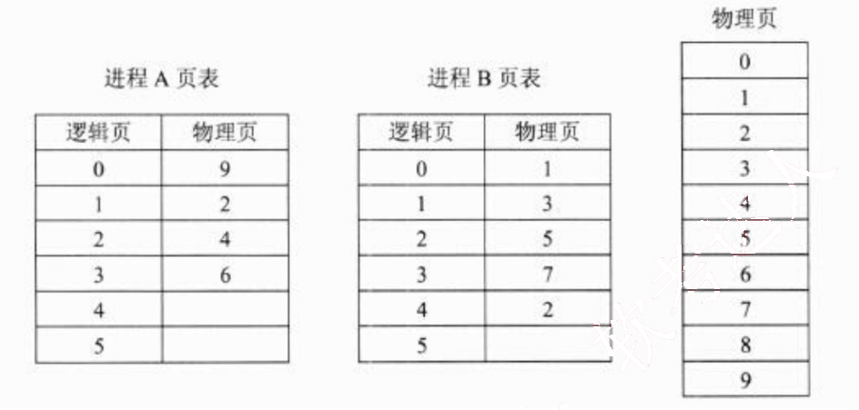
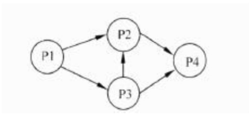
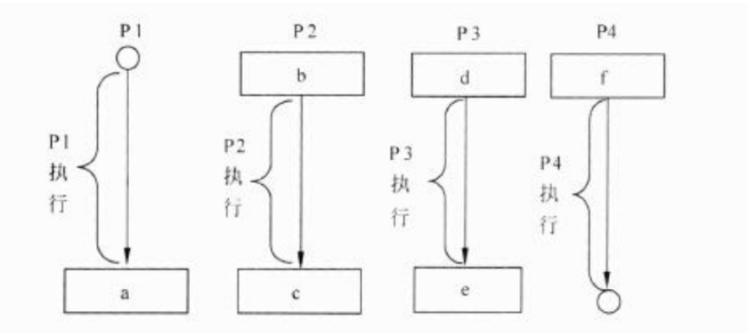
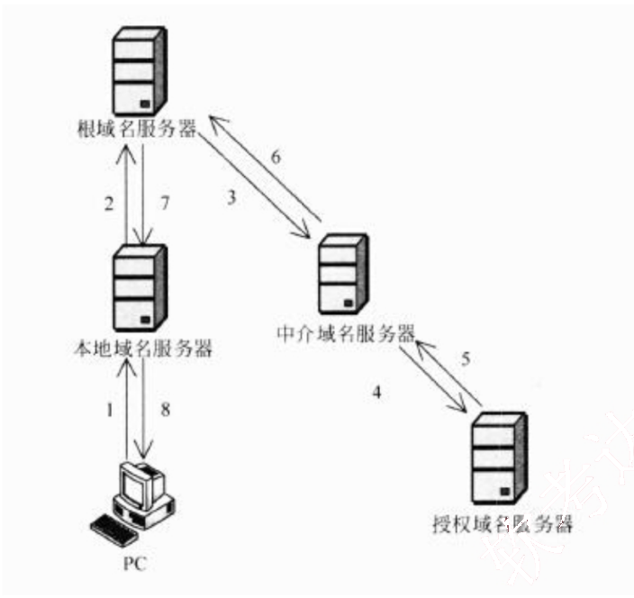
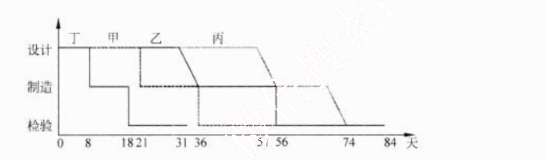
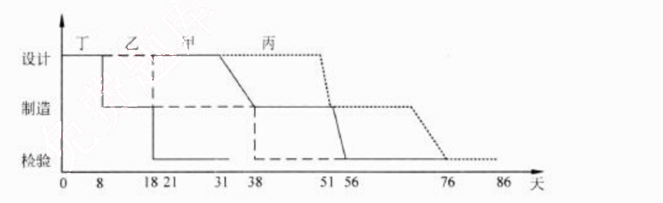
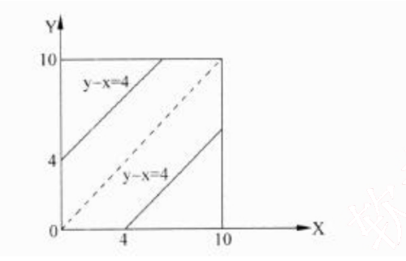

# 2013 年下半年 系统架构设计师 · 综合知识真题（75 题）

> 题干与选项取自正式试卷；答案与解析取自随卷答案详解
>
> **来源**：本地购买扫描件《2013 年下半年系统架构设计师 答案详解》（贡献者已购买并授权转录）
> **来源类型**：`real`
> **解析方式**：byted-las-document-parse（normal 模式）+ 机械清洗，已剔除页眉、广告条与页码
> **答案与解析**：取自随卷答案详解，非本仓库编写
> **使用建议**：可用于章节训练与年份模考；关键数字建议对照原始 PDF 复核
> **完整性**：综合知识 75 题、案例分析 5 题、论文 4 题齐备
> **知识点标签**：题组级 `§N` 标签，依据题干与原文解析中的考查提示标注，细分到考期题组而非逐题子编号

## 第 1-2 题：[§1 操作系统—存储管理]

### 1-2.

某操作系统采用分页存储管理方式，下图给出了进程 A 和进程 B 的页表结构，如果物理页的大小为 512 字节，那么进程 A 逻辑地址为 1111（十进制）的变量存放在 (1) 号物理内存页中。假设进程 A 的逻辑页 4 与进程 B 的逻辑页 5 要共享物理页 8，那么应该在进程 A 页表的逻辑页 4 和进程 B 页表的逻辑页 5 对应的物理页处分别填 (2)。

(1)
A. 9
B. 2
C. 4
D. 6

(2)
A. 4、5
B. 5、4
C. 5、8
D. 8、8

**答案**：C  D

**考点**：§1 操作系统—存储管理

**解析**：本题考查操作系统存储管理方面的基础知识。

(1) 物理页的大小为 512 字节，进程 A 逻辑地址为 1111 的变量的逻辑页号为 2，对应的物理页号为 4。

(2) 根据题意进程 A 的逻辑页 4 与进程 B 的逻辑页 5 要共享的物理页 8，那么应该在进程A 页表的逻辑页 4 对应的物理页处填 8，进程 B 页表的逻辑页 5 对应的物理页处也填 8。

进程 P1、P2、P3 和 P4 的前趋图如下所示：

## 第 3-4 题：[§1 操作系统—PV操作]

### 3-4.

 ** **

若用 PV 操作控制进程 P1~P4 并发执行的过程，则需要设置 5 个信号量 S1、S2、S3、S4 和 S5，且信号量 S1~S5 的初值都等于 0。下图中 a、b 和 c 处应分别填写 (3)，d、e 和 f处应分别填写 (4)。

(3)
A. V(S1)V(S2)、P(S1)V(S3) 和 V(S4)
B. P(S1)V(S2)、P(S1)P(S2) 和 V(S1)
C. V(S1)V(S2)、P(S1)P(S3) 和 V(S4)
D. P(S1)P(S2)、V(S1)P(S3) 和 V(S2)

(4)
A. P(S2)、V(S3)V(S5) 和 P(S4)P(S5)
B. V(S2)、P(S3)V(S5) 和 V(S4)P(S5)
C. P(S2)、V(S3)P(S5) 和 P(S4)V(S5)
D. V(S2)、V(S3)V(S5) 和 P(S4)V(S5)

**答案**：C A

**考点**：§1 操作系统—PV操作

**解析**：本题考查 PV 操作方面的基本知识。

因为 P1 是 P2 和 P3 的前驱，当 P1 执行完通知 P2 和 P3，应采用 V(S.1)V(S2) 操作分别通知 P2 和 P3，故 a 处应填写 V(S1)V(S2); 又因为 P2 是 P1 和 P3 的后继，当 P2 执行前应测试 P1 和 P3 是否执行完，应采用 P(S1)P(S3) 操作测试 P1 和 P3 是否执行完，故 b 处应填写 P(S1)P(S3); 同理，P2 是 P4 的前驱，当 P2 执行完应通知 P4, 应采用 V(S4) 操作分别通知 P4，故 c 处应填写 V(S4)。

因为 P3 是 P1 的后继，当 P3 执行前应测试 P1 是否执行完，应采用 I_(S2) 操作测试 P1 是否执行完，故 d 处应填写 P(S2); 又因为 P3 是 P2 和 P4 的前驱，当 P3 执行完应通知 P2 和 P4, 应采用 V(S3)V(S5) 操作通知 P5, 故 e 处应填写 V(S3)V(S5); P4 是 P2 和 P3 的后继，当 P4 执行前应测试 P2 和 P3 是否执行完，应采用 P(S4)P(S5) 操作测试 P2 和 P3 是否执行完，故 f 处应填写 P(S4)P(S5)。

## 第 5-6 题：[§5 数据库—范式]

### 5-6.

假设关系模式 R(U, F), 属性集 U={A, B, C}，函数依赖集 F={A→B, B→C}。若将其分解为 p={R1(U1, F1), R2(U2, F2)}，其中 U1={A, B}, U2={A, C}。那么，关系模式 R、R1、R2 分别达到了 (5)；分解 D(6)。

(5)
A. 1NF、2NF、3NF
B. INF、3NF、3NF
C. 2NF、2NF、3NF
D. 2NF、3NF、3NF

(6)
A. 有损连接但保持函数依赖
B. 既无损连接又保持函数依赖
C. 有损连接且不保持函数依赖
D. 无损连接但不保持函数依赖

**答案**：D B

**考点**：§5 数据库—范式

**解析**：本题考查关系数据库方面的基本知识。

(5) 由关系模式 R 的函数依赖集 F={A→B, B→C} 可以得出 A→C，存在传递依赖，但不存在非主属性对码的部分函数依赖，故 R 为 2NF。又由于分解后的关系模式 R1 的函数依赖集 F1={A→B}，关系模式 R2 的函数依赖集 F2={A→C}，因此 R1、R2 分别达到了 3NF。

(6) 因为 F=F1∪F2，所以分解 p 保持函数依赖。又由于关系模式 R(U, F) 的一个分解 p={R1(U1,F1), R2(U2,F2)} 具有无损连接的充分必要的条件是：U1∩U2→U1-U2∈F+ 或 U1∩U2→U2-U1∈F+。分解 p 是否无损连接分析如下：

$$\because AB \cap AC = A,\ AB - AC = B,\ AC - AB = C$$
$$\therefore A \to B \in F+,\ A \to C \in F+$$
$$\therefore \text{根据无损连接的充分必要的条件可知 } p \text{ 为无损连接。}$$

## 第 7-8 题：[§5 数据库—关系代数与SQL]

### 7-8.

给定员工关系 EMP(EmpID, Ename, sex, age, tel, DepID)，其属性含义分别为：员工号、姓名、性别、年龄、电话、部门号；部门关系 DEP(DepID, Dname, Dtel, DEmpID)，其属性含义分别为：部门号、部门名、电话、负责人号。若要求 DepID 参照部门关系 DEP 的主码 DepID，则可以在定义 EMP 时用 (7) 进行约束。若要查询开发部的负责人姓名、年龄，则正确的关系代数表达式为 (8)。

(7)
A. Primary Key (DepID) On DEP (DepID)
B. Primary Key (DepID) On EMP (DepID)
C. Foreign Key (DepID) References DEP (DepID)
D. Foreign Key (DepID) References EMP (DepID)

(8)
A. $\pi 2,4$ ($\sigma$ 8 '开发部' (EMP×DEP ))
B. $\pi 2, 4$ ( $\sigma$ 1=9 (EMP $\sigma$ 2='开发部' DEP))
C. $\pi 2, 3$ (EMP× $\sigma$ 2='开发部'(DEP))
D. $\pi 2,3$ ( $\pi$ 1,2,4,6 (EMP ) $\sigma$ 2='开发部 (DEP)' )

**答案**：C B

**考点**：§5 数据库—关系代数与SQL

**解析**：本题考查关系代数运算方面的基础知识。

(7) 员工关系中的 DepID 是一个外键，为了保证数据的正确性，通过参照完整性加以约束。SQL 语言通过使用保留字 Foreign Key 定义外键，References 指明外码对应于哪个表的主码。参照完整性定义格式如下：

Foreign Key(属性名) References 表名(属性名)

可见，若要求 DepID 参照部门关系 DEP 的主码 DepID，则可以在定义 EMP 时用“Foreign Key (DepID) References DEP (DepID)”进行约束。

(8) 试题(8)要求“查询开发部的负责人姓名、年龄”的关系代数表达式，选项 B 是先进行 $\delta$ 2='开发部'(DEP) 运算，即在 DEP 关系中选择部门名 Dname=‘开发部’的元组；然后将 EMP 关系与其进行 EMP.DepID=DEP.DepID 的自然连接，并去掉右边的重复属性“DEP.DepID”，自然连接后的属性列为(EmpID, Ename, sex, age, tel, DepID, Dname, Dtel, DEmpID)；再此基础上进行 $\delta$ 1=9运算，即进行员工号 EmpID 等于部门负责人号 DEmpID 的选取运算；最后进行属性列 2(Ename)和属性列 4(age)的投影运算。

## 第 9 题：[§1 嵌入式—实时操作系统任务]

### 9.

在实时操作系统中，两个任务并发执行，一个任务要等待另一个任务发来消息，或建立某个条件后再向前执行，这种制约性合作关系被称为任务的 (9)。

(9)
A. 同步
B. 互斥
C. 调度
D. 执行

**答案**：A

**考点**：§1 嵌入式—实时操作系统任务

**解析**：本题考查实时操作系统基础知识。

由于资源共享与进程合作，并发执行的任务（进程）之间可能产生相互制约关系，这些制约关系可分为两类：竞争与协作。并发进程之间的竞争关系为互斥，并发进程之间的协作关系体现为同步。

同步是因合作进程之间协调彼此的工作而控制自己的执行速度，即因相互合作，相互等待而产生的制约关系。而互斥是进程之间竞争临界资源而禁止两个以上的进程同时进入临界区所发生的制约关系。

题目中一个任务要等待另一个任务发来消息，或建立某个条件后再向前执行，显然体现的制约关系是任务的同步。

## 第 10 题：[§1 嵌入式—CPU调试接口]

### 10.

在嵌入式系统设计中，用来进行 CPU 调试的常用接口是 (10)。

(10)
A. PCI 接口
B. USB 接口
C. 网络接口
D. JTAG 接口

**答案**：D

**考点**：§1 嵌入式—CPU调试接口

**解析**：本题考查嵌入式系统应用基础知识。

PCI 是一种局部总线标准，它是在 CPU 和原来的系统总线之间插入的一级总线，具体由

一个桥接电路实现对这一层的管理，并实现上下之间的接口以协调数据的传送。

JTAG 是一个调试接口，用来供开发人员调试 CPU 的工作状态。JTAG 软件通过该接口控制 CPU 来调试 CPU 以及读写 Flash。

## 第 11 题：[§1 嵌入式—看门狗]

### 11.

看门狗（WatchDog）是嵌入式系统中一种常用的保证系统可靠性的技术，(11)会产生看门狗中断。

(11)
A. 软件喂狗
B. 处理器温度过高
C. 外部中断
D. 看门狗定时器超时

**答案**：D

**考点**：§1 嵌入式—看门狗

**解析**：本题考查嵌入式系统应用基础知识。

看门狗（Watch Dog）是一个独立的定时器电路，有一个定时器控制寄存器，可以设定时间（开狗），到达时间后要置位（喂狗），如果没有的话，就认为是程序跑飞，就会发出 RESET 指令。当系统工作正常时，CPU 将每隔一定时间输出一个脉冲给看门狗，即“喂狗”，若程序运行出现问题或硬件出现故障时而无法按时“喂狗”时，看门狗电路将迫使系统自动复位而重新运行程序。

## 第 12 题：[§1 嵌入式—RTOS任务调度]

### 12.

以下关于实时操作系统（RTOS）任务调度器的叙述中，正确的是 (12)。

(12)
A. 任务之间的公平性是最重要的调度目标
B. 大多数 RTOS 调度算法都是抢占方式（可剥夺方式）
C. RTOS 调度器都采用了基于时间片轮转的调度算法
D. 大多数 RTOS 调度算法只采用一种静态优先级调度算法

**答案**：B

**考点**：§1 嵌入式—RTOS任务调度

**解析**：本题考查实时操作系统基础知识。

任务是 RTOS 中最重要的操作对象，每个任务在 RTOS 的调度下由 CPU 分时执行。任务的调度目前主要有时间分片式、轮流查询式和优先抢占式三种，不同的 RTOS 可能支持其中一种或几种，其中优先抢占式对实时性的支持最好。

在非实时系统中，调度的主要目的是缩短系统平均响应时间，提高系统资源的利用率，或优化某一项指标；而实时系统中调度的目的则是要尽可能地保证每个任务满足他们的时间约束，及时对外部请求做出响应。

## 第 13 题：[§1 网络—层次化网络设计]

### 13.

以下关于层次化网络设计原则的叙述中，错误的是 (13)。

(13)
A. 一般将网络划分为核心层、汇聚层、接入层三个层次
B. 应当首先设计核心层，再根据必要的分析完成其他层次设计
C. 为了保证网络的层次性，不能在设计中随意加入额外连接
D. 除去接入层，其他层次应尽量采用模块化方式，模块间边界应非常清晰

**答案**：B

**考点**：§1 网络—层次化网络设计

**解析**：本题考查层次化网络设计原则的基础知识。

层次化网络设计应该遵循一些简单的原则，这些原则可以保证设计出来的网络更加具有层次的特性：

① 在设计时，设计者应该尽量控制层次化的程度，一般情况下，由核心层、汇聚层、接入层三个层次就足够了，过多的层次会导致整体网络性能的下降，并且会提高网络的延迟，但是方便网络故障排查和文档编写。

② 在接入层应当保持对网络结构的严格控制，接入层的用户总是为了获得更大的外部网络访问带宽，而随意申请其他的渠道访问外部网络是不允许的。

③ 为了保证网络的层次性，不能在设计中随意加入额外连接，额外连接是指打破层次性，在不相邻层次间的连接，这些连接会导致网络中的各种问题，例如缺乏汇聚层的访问控制和数据报过滤等。

④ 在进行设计时，应当首先设计接入层，根据流量负载、流量和行为的分析，对上层进行更精细的容量规划，再依次完成各上层的设计。

⑤ 除去接入层的其他层次，应尽量采用模块化方式，每个层次由多个模块或者设备集合构成，每个模块间的边界应非常清晰。

## 第 14 题：[§1 网络—网络需求分析]

### 14.

网络需求分析包括网络总体需求分析、综合布线需求分析、网络可用性与可靠性分析、网络安全性需求分析，此外还需要进行 (14)。

(14)
A. 工程造价估算
B. 工程进度安排
C. 硬件设备选型
D. IP 地址分配分析

**答案**：A

**考点**：§1 网络—网络需求分析

**解析**：本试题考查网络需求分析。

工程造价估算是网络需求分析中的一个重要环节。

## 第 15 题：[§1 网络—域名解析]

### 15.

主机 PC 对某个域名进行查询，最终由该域名的授权域名服务器解析并返回结果，查询过程如下图所示。这种查询方式中不合理的是 (15)。

(15)
A. 根域名服务器采用递归查询，影响了性能
B. 根域名服务器采用迭代查询，影响了性能
C. 中介域名服务器采用迭代查询，加重了根域名服务器负担
D. 中介域名服务器采用递归查询，加重了根域名服务器负担

**答案**：A

**考点**：§1 网络—域名解析

**解析**：本试题考查DNS服务器及其原理。

DNS查询过程分为两种查询方式：递归查询和迭代查询。

递归查询的查询方式为：当用户发出查询请求时，本地服务器要进行递归查询。这种查询方式要求服务器彻底地进行名字解析，并返回最后的结果——IP地址或错误信息。如果查询请求在本地服务器中不能完成，那么服务器就根据它的配置向域名树中的上级服务器进行查询，在最坏的情况下可能要查询到根服务器。每次查询返回的结果如果是其他名字服务器的IP地址，则本地服务器要把查询请求发送给这些服务器，做进一步的查询。

迭代查询的查询方式为：服务器与服务器之间的查询采用迭代的方式进行，发出查询请求的服务器得到的响应可能不是目标的IP地址，而是其他服务器的引用（名字和地址），那么本地服务器就要访问被引用的服务器，做进一步的查询。如此反复多次，每次都更接近目标的授权服务器，直至得到最后的结果——目标的IP地址或错误信息。

根域名服务器为众多请求提供域名解析，若采用递归方式会大大影响性能。

## 第 16-17 题：[§1 计算机系统—性能评估]

### 16-17.

把应用程序中应用最频繁的那部分核心程序作为评价计算机性能的标准程序，称为(16)程序。(17)不是对 Web 服务器进行性能评估的主要指标。

(16)
A. 仿真测试
B. 核心测试
C. 基准测试
D. 标准测试

(17)
A. 丢包率
B. 最大并发连接数
C. 响应延迟
D. 吞吐量

**答案**：C A

**考点**：§1 计算机系统—性能评估

**解析**：本题考查性能评估的基础知识。

把应用程序中应用最频繁的那部分核心程序作为评价计算机性能的标准程序，称为基准测试程序。作为承载 Web 应用的 Web 服务器，对其进行性能评估时，主要关注最大并发连接数、响应延迟、吞吐量等指标。相对来说，对个别数据的丢包率并不是很关心。

## 第 18 题：[§2 信息系统—电子政务]

### 18.

与电子政务相关的行为主体主要有三个，即(18)，政府的业务活动也主要围绕着这三个行为主体展开。

(18)
A. 政府、数据及电子政务系统
B. 政府、企（事）业单位及中介
C. 政府、服务机构及企事业单位
D. 政府、企（事）业单位及公民

**答案**：D

**考点**：§2 信息系统—电子政务

**解析**：

本题考查电子政务的基础知识。在社会中，与电子政务相关的行为主体主要有三个，即政府、企（事）业单位及公民。因此，政府的业务活动也主要围绕着这三个行为主体展开。政府与政府，政府与企（事）业，以及政府与公民之间的互动构成了不同却又相互关联的领域。

## 第 19-21 题：[§2 信息系统—企业信息化与电子商务]

### 19-21.

企业信息化涉及对企业管理理念的创新，按照市场发展的要求，对企业现有的管理流程重新整合，管理核心从对 (19) 的管理，转向对 (20) 的管理，并延伸到对企业技术创新、工艺设计、产品设计、生产制造过程的管理，进而还要扩展到对 (21) 的管理乃至发展到电子商务。

(19)
A. 人力资源和物资
B. 信息技术和知识
C. 财务和物料
D. 业务流程和数据

(20)
A. 业务流程和数据
B. 企业信息系统和技术
C. 业务流程、数据和接口
D. 技术、物资和人力资源

(21)
A. 客户关系和供应链
B. 信息技术和知识
C. 生产技术和信息技术
D. 信息采集、存储和共享

**答案**：C D A

**考点**：§2 信息系统—企业信息化与电子商务

**解析**：本题考查企业信息化与电子商务的基础知识。

企业信息化涉及对企业管理理念的创新，管理流程的优化，管理团队的重组和管理手段的革新。管理创新是按照市场发展的要求，对企业现有的管理流程重新整合，从作为管理核心的财务、物料管理，转向技术、物资、人力资源的管理，并延伸到企业技术创新、工艺设计、产品设计、生产制造过程的管理，进而还要扩展到客户关系管理、供应链管理乃至发展到电子商务。

## 第 22-23 题：[§2 信息系统—企业信息集成]

### 22-23.

企业信息集成按照组织范围分为企业内部的信息集成和外部的信息集成。在企业内部的信息集成中，(22)实现了不同系统之间的互操作，使得不同系统之间能够实现数据和方法的共享；(23)实现了不同应用系统之间的连接、协调运作和信息共享。

(22)
A. 技术平台集成
B. 数据集成
C. 应用系统集成
D. 业务过程集成

(23)
A. 技术平台集成
B. 数据集成
C. 应用系统集成
D. 业务过程集成

**答案**：C D

**考点**：§2 信息系统—企业信息集成

**解析**：本题考查企业信息集成的基础知识。

企业信息集成是指企业在不同应用系统之间实现数据共享，即实现数据在不同数据格式和存储方式之间的转换、来源不同、形态不一、内容不等的信息资源进行系统分析、辨清正误、消除冗余、合并同类，进而产生具有统一数据形式的有价值信息的过程。企业信息集成是一个十分复杂的问题，按照组织范围来分，分为企业内部的信息集成和外部的信息集成两个方面。按集成内容，企业内部的信息集成一般可分为以下四个方面：技术平台集成，数据集成，应用系统集成和业务过程集成。其中，应用系统集成是实现不同系统之间的互操作，使得不同应用系统之间能够实现数据和方法的共享；业务过程集成使得在不同应用系统中的流程能够无缝连接，实现流程的协调运作和流程信息的充分共享。

## 第 24 题：[§2 信息系统—数据挖掘]

### 24.

数据挖掘是从数据库的大量数据中揭示出隐含的、先前未知的并有潜在价值的信息的非凡过程，主要任务有 (24)。

(24)
A. 聚类分析、 联机分析、 信息检索等
B. 信息检索、 聚类分析、 分类分析等
C. 聚类分析、 分类分析、 关联规则挖掘等
D. 分类分析、 联机分析、 关联规则挖掘等

**答案**：C

**考点**：§2 信息系统—数据挖掘

**解析**：本题考查数据挖掘方面的基础知识。

数据挖掘是从数据库的大量数据中揭示出隐含的、先前未知的并有潜在价值的信息的非平凡过程，数据挖掘的任务有关联分析、聚类分析、分类分析、异常分析、特异群组分析和演变分析等等。并非所有的信息发现任务都被视为数据挖掘。例如，使用数据库管理系统查找个别的记录，或通过因特网的搜索引擎查找特定的 Web 页面，则是信息检索领域的任务。虽然这些任务是重要的，可能涉及使用复杂的算法和数据结构，但是它们主要依赖传统的计算机科学技术和数据的明显特征来创建索引结构，从而有效地组织和检索信息。

## 第 25 题：[§4 软件工程—项目范围定义]

### 25.

详细的项目范围说明书是项目成功的关键，(25)不属于项目范围定义的输入。

(25)
A. 项目章程
B. 项目范围管理计划
C. 批准的变更申请
D. 项目文档管理方法

**答案**：D

**考点**：§4 软件工程—项目范围定义

**解析**：

本题考查软件项目开发管理方面的基础知识。在初始项目范围说明书&已文档化的主要的可交付物、假设和约束条件的基础上准备详细的项目范围说明书，是项目成功的关键。范围定义的输入包括以下内容：

①项目章程。如果项目章程或初始的范围说明书没有在项目执行组织中使用，同样的信息需要进一步收集和开发，以产生详细的项目范围说明书。

②项目范围管理计划。

③组织过程资产。

④批准的变更申请。

## 第 26 题：[§4 软件工程—活动定义工具]

### 26.

活动定义是项目时间管理中的过程之一，(26)是进行活动定义时通常使用的一种工具。

(26)
A. Gantt 图
B. 活动图
C. 工作分解结构（WBS）
D. PERT 图

**答案**：C

**考点**：§4 软件工程—活动定义工具

**解析**：

项目时间管理包括使项目按时完成所必须的管理过程。项目时间管理中的过程包括：活动定义、活动排序、活动的资源估算、活动历时估算、制定进度计划以及进度控制。为了得到工作分解结构（Work Break down Structure, WBS）中最底层的交付物，必须执行一系列的活动，对这些活动的识别以及归档的过程就叫做活动定义。

## 第 27 题：[§4 软件工程—可行性分析]

### 27.

以下叙述中，(27)不属于可行性分析的范畴。

(27)
A. 对系统开发的各种候选方案进行成本/效益分析
B. 分析现有系统存在的运行问题
C. 评价该项目实施后可能取得的无形收益
D. 评估现有技术能力和信息技术是否足以支持系统目标的实现

**答案**：B

**考点**：§4 软件工程—可行性分析

**解析**：
可行性分析是所有项目投资、工程建设或重大改革在开始阶段必须进行的一项工作。项目的可行性分析是对多因素、多目标系统进行的分析、评价和决策的过程。可行性研究通常从经济可行性、技术可行性、法律可行性和用户使用可行性4个方面来进行分析。

经济可行性也称为投资收益分析或成本效益分析，主要评价项目的建设成本、运行成本和项目建成后可能的经济收益。经济收益可以分为直接收益、间接收益、有形收益和无形收益等。

技术可行性也称为技术风险分析，研究的对象是信息系统需要实现的功能和性能，以及技术能力约束。

法律可行性也称为社会可行性，具有比较广泛的内容，它需要从政策、法律、道德、制度等社会因素来论证信息系统建设的现实性。

用户使用可行性也称为执行可行性，是从信息系统用户的角度来评估系统的可行性，包括企业的行政管理和工作制度、使用人员的素质和培训要求等。

## 第 28 题：[§9 架构演化—遗留系统演化策略]

### 28.

遗留系统的演化可以采用淘汰、继承、改造和集成四种策略。若企业中的遗留系统技术含量较高，业务价值较低，在局部领域中工作良好，形成了一个个信息孤岛时，适合于采用(28)演化策略。

(28)
A. 淘汰
B. 继承
C. 改造
D. 集成

**答案**：D

**考点**：§9 架构演化—遗留系统演化策略

**解析**：
遗留系统的演化可以采用淘汰、继承、改造和集成四种策略。
淘汰策略适用于技术含量较低，且具有较低的业务价值的遗留系统，即通过全面重新开发新的系统以代替遗留系统。

若遗留系统的技术含量较低，能满足企业运作的功能或性能要求，但具布较高的商业机制，目前企业的业务上紧密依赖该系统，这种遗留系统的演化策略为继承。在开发新系统时，需要完全兼容遗留系统的功能模型和数据模型。为了保证业务的连续性，新老系统必须并行运行一段时间。

对于技术含量较高，本身还有极大的生命力，又具有较高的业务价值，基本上能够满足企业业务运作和决策支持需要的遗留系统，采用改造策略进行演化。改造包括系统功能的增强和数据模型的改造两个方面。

遗留系统的技术含量较高，但其业务价值较低，可能只完成某个部门（或子公司）的业务管理。这种系统在各自局部领域里工作良好，但对于整个企业来说，存在多个这样的系统，不同的系统基于不同的平台、不同的数据模型，形成了一个个信息孤岛。对于这种遗留系统的演化策略为集成。

## 第 29-30 题：[§4 软件工程—软件复用级别]

### 29-30.

逆向工程导出的信息可以分为实现级、结构级、功能级和领域级四个抽象层次。程序的抽象语法树属于 (29)；反映程序分量之间相互依赖关系的信息属于 (30)。

(29)
A. 实现级
B. 结构级
C. 功能级
D. 领域级

(30)
A. 实现级
B. 结构级
C. 功能级
D. 领域级

**答案**：A B

**考点**：§4 软件工程—软件复用级别

**解析**：

逆向工程与重构工程是目前预防性维护采用的主要技术。所谓软件的逆向工程就是分析已有的程序，寻求比源代码更高级的抽象表现形式。一般认为，凡是在软件生命周期内将软件某种形式的描述转换成更为抽象形式的活动都可称为逆向工程。逆向工程导出的信息可以分为如下4个抽象层次。

①实现级：包括程序的抽象语法树、符号表等信息。

②结构级：包括反映程序分量之间相互依赖关系的信息，例如调用图、结构图等。

③功能级：包括反映程序段功能及程序段之间关系的信息。

④领域级：包括反映程序分量或程序诸实体与应用领域概念之间对应关系的信息。显然，上述信息的抽象级别越高，它与代码的距离就越远，通过逆向工程恢复的难度亦越大，而自动工具支持的可能性相对变小，要求人参与判断和推理的工作增多。

## 第 31-32 题：[§4 软件工程—面向对象类]

### 31-32.

在面向对象设计中，(31)可以实现界面控制、外部接口和环境隔离。(32)作为完成用例业务的责任承担者，协调、控制其他类共同完成用例规定的功能或行为。

(31)
A. 实体类
B. 控制类
C. 边界类
D. 交互类

(32)
A. 实体类
B. 控制类
C. 边界类
D. 交互类

**答案**：C B

**考点**：§4 软件工程—面向对象类

**解析**：
类封装了信息和行为，是面向对象的重要组成部分。在面向对象设计中，类可以分为三种类型：实体类、边界类和控制类。

①实体类映射需求中的每个实体，实体类保存需要存储在永久存储体中的信息。实体类是对用户来说最有意义的类，通常采用业务领域术语命名，一般来说是一个名词，在用例模型向领域模型转化中，一个参与者一般对应于实体类。

②控制类是用于控制用例工作的类，一般是由动宾结构的短语（“动词+名词”或“名词+动词”）转化来的名词。控制类用于对一个或几个用例所特有的控制行为进行建模，控制对象通常控制其他对象，因此它们的行为具有协调性。

③边界类用于封装在用例内、外流动的信息或数据流。边界类是一种用于对系统外部环境与其内部运作之间的交互进行建模的类。边界对象将系统与其外部环境的变更隔离开，使这些变更不会对系统其他部分造成影响。

## 第 33-34 题：[§4 软件工程—RUP阶段]

### 33-34.

基于RUP的软件过程是一个迭代过程。一个开发周期包括初始、细化、构建和移交四个阶段，每次通过这四个阶段就会产生一代软件，其中建立完善的架构是 (33) 阶段的任务。采用迭代式开发，(34)。

(33)
A. 初始
B. 细化
C. 构建
D. 移交

(34)
A. 在每一轮迭代中都要进行测试与集成
B. 每一轮迭代的重点是对特定的用例进行部分实现
C. 在后续迭代中强调用户的主动参与
D. 通常以功能分解为基础

**答案**：B A

**考点**：§4 软件工程—RUP阶段

**解析**：
RUP 中的软件过程在时间上被分解为 4 个顺序的阶段，分别是初始阶段、细化阶段、构建阶段和移交阶段。

初始阶段的任务是为系统建立业务模型并确定项目的边界。细化阶段的任务是分析问题领域，建立完善的架构，淘汰项目中最高风险的元素。在构建阶段，要开发所有剩余的构件和应用程序功能，把这些构件集成为产品。移交阶段的重点是确保软件对最终用户是可用的。基于RUP的软件过程是一个迭代过程，通过初始、细化、构建和移交4个阶段就是一个开发周期，每次经过这4个阶段就会产生一代产品，在每一轮迭代中都要进行测试与集成。

## 第 35-36 题：[§6 系统架构—设计模式]

### 35-36.

某系统中的文本显示类（TextView）和图片显示类（PictureView）都继承了组件类（Component），分别显示文本和图片内容，现需要构造带有滚动条或者带有黑色边框，或者既有滚动条又有黑色边框的文本显示控件和图片显示控件，但希望最多只增加3个类。那么采用设计模式 (35) 可实现该需求，其优点是 (36)。

(35)
A. 外观
B. 单体
C. 装饰
D. 模板

(36)
A. 比静态继承具有更大的灵活性
B. 提高已有功能的重复使用性
C. 可以将接口与实现相分离
D. 为复杂系统提供了简单接口

**答案**：C A

**考点**：§6 系统架构—设计模式

**解析**：

装饰（Decorator）模式可以再不修改对象外观和功能的情况下添加或删除对象功能。它可以使用一种对客户端来说是透明的方法来修改对象的功能，也就是使用初始类的子类实例对初始对象进行授权。装饰模式还为对象动态地添加了额外的重任，这样就在不使用静态继承的情况下，为修改对象功能提供了灵活的选择。

在以下情况中，应该使用装饰模式：
- 想要在单个对象中动态并且透明地添加责任，而这样并不会影响其他对象；
- 想要在以后可能要修改的对象中添加责任；
- 当无法通过静态子类化实现扩展时。

## 第 37 题：[§4 软件工程—自顶向下开发方法]

### 37.

以下关于自顶向下开发方法的叙述中，正确的是 (37)

(37)
A. 自顶向下过程因为单元测试而比较耗费时间
B. 自顶向下过程可以更快地发现系统性能方面的问题
C. 相对于自底向上方法，自顶向下方法可以更快地得到系统的演示原型
D. 在自顶向下的设计中，如发现了一个错误，通常是因为底层模块没有满足其规格说明（因为高层模块已经被测试过了）

**答案**：C

**考点**：§4 软件工程—自顶向下开发方法

**解析**：
自顶向下方法是一种决策策略。软件开发涉及作什么决策、如何决策和决策顺序等决策问题。

自顶向下方法在任何时刻所作的决定都是当时对整个设计影响最大的那些决定。如果把所有决定分组或者分级，那么决策顺序是首先作最高级的决定，然后依次地作较低级的决定。同级的决定则按照随机的顺序或者按别的方法。一个决策的级别是看它距离要达到的最终目的（因此是软件的实际实现）的远近程度。从问题本身来看，或是由外（用户所见的）向内（系统的实现）看，以距离实现近的决定为低级决定，远的为高级决定。

在这个自顶向下的过程中，一个复杂的问题（任务）被分解成若干个较小较简单的问题（子任务），并且一直继续下去，直到每个小问题（子任务）都简单到能够 i：接解决（实现）为止。

自顶向下方法的优点是：
- 可为企业或机构的重要决策和任务实现提供信息。
- 支持企业信息系统的整体性规划，并对系统的各子系统的协调和通信提供保证。
- 方法的实践有利于提高企业人员整体观察问题的能力，从而有利于寻找到改进企业组织的途径。

自顶向下方法的缺点是：
- 对系统分析和设计人员的要求较高。
- 开发周期长，系统复杂，一般属于一种高成本、大投资的工程。
- 对于大系统而言，自上而下的规划对于下层系统的实施往往缺乏约束力，
- 从经济角度来看，很难说自顶向下的做法在经济上市合算的。

## 第 38 题：[§4 软件工程—白盒测试]

### 38.

以下关于白盒测试方法的叙述中，错误的是 (38)。

(38)
A. 语句覆盖要求设计足够多的测试用例，使程序中每条语句至少被执行一次
B. 与判定覆盖相比，条件覆盖增加对符合判定情况的测试，增加了测试路径
C. 判定/条件覆盖准则的缺点是未考虑条件的组合情况
D. 组合覆盖要求设计足够多的测试用例，使得每个判定中条件结果的所有可能组合最多出现一次

**答案**：D

**考点**：§4 软件工程—白盒测试

**解析**：

白盒测试也称为结构测试，主要用于软件单元测试阶段，测试人员按照程序内部逻辑结构设计测试用例，检测程序中的主要执行通路是否都能按预定要求正确工作。白盒测试方法主要有控制流测试、数据流测试和程序变异测试等。

控制流测试根据程序的内部逻辑结构设计测试用例，常用的技术是逻辑覆盖。主要的覆盖标准有语句覆盖、判定覆盖、条件覆盖、条件/判定覆盖、条件组合覆盖、修正的条件/判定覆盖和路径覆盖等。

语句覆盖是指选择足够多的测试用例，使得运行这些测试用例时，被测程序的每个语句至少执行一次。

判定覆盖也称为分支覆盖，它是指不仅每个语句至少执行一次，而且每个判定的每种可能的结果（分支）都至少执行一次。

条件覆盖是指不仅每个语句至少执行一次，而且使判定表达式中的每个条件都取得各种可能的结果。

条件/判定覆盖同时满足判定覆盖和条件覆盖。它的含义是选取足够的测试用例，使得判定表达式中每个条件的所有可能结果至少出现一次，而且每个判定本身的所有可能结果也至少出现一次。

条件组合覆盖是指选取足够的测试用例，使得每个判定表达式中条件结果的所有可能组合至少出现一次。

修正的条件/判定覆盖。需要足够的测试用例来确定各个条件能够影响到包含的判定结果。

路径覆盖是指选取足够的测试用例，使得程序的每条可能执行到的路栏都至少经过一次（如果程序中有环路，则要求每条环路路径至少经过一次）。

## 第 39 题：[§4 软件工程—面向对象测试]

### 39.

以下关于面向对象软件测试的叙述中，正确的是_(39)_。

(39)
A. 在测试一个类时，只要对该类的每个成员方法都进行充分的测试就完成了对该类充分的测试

B. 存在多态的情况下，为了达到较高的测试充分性，应对所有可能的绑定都进行测试

C. 假设类B是类A的子类，如果类A已经进行了充分的测试，那么在测试类B时不必测试任何类B继承自类A的成员方法

D. 对于一棵继承树上的多个类，只有处于叶子节点的类需要测试

**答案**：B

**考点**：§4 软件工程—面向对象测试

**解析**：
面向对象系统的测试目标与传统信息系统的测试目标是一致的，但面向对象系统的测试策略与传统结构化系统的测试策略有很大的不同，这主要体现在两个方面，分别是测试的焦点从模块移向了类，以及测试的视角扩大到了分析和设计模型。

与传统的结构化系统相比，面向对象系统具有三个明显特征，即封装性、继承性与多态性。封装性决定了面向对象系统的测试必须考虑到信息隐蔽原则对测试的影响，以及对象状态与类的测试序列，因此在测试一个类时，仅对该类的每个方法进行测试是不够的；继承性决定了面向对象系统的测试必须考虑到继承对测试充分性的影响，以及误用引起的错误；多态性决定了面向对象系统的测试必须考虑到动态绑定对测试充分性的影响、抽象类的测试以及误用对测试的影响。

## 第 40-42 题：[§6 系统架构—架构与关系]

### 40-42.

软件系统架构是关于软件系统的结构、(40) 和属性的高级抽象。在描述阶段，主要描述直接构成系统的抽象组件以及各个组件之间的连接规则，特别是相对细致地描述组件的(41)。在实现阶段，这些抽象组件被细化为实际的组件，比如具体类或者对象。软件系统架构不仅指定了软件系统的组织和 (42) 结构，而且显示了系统需求和组件之间的对应关系，包括设计决策的基本方法和基本原理。

**考点**：§6 系统架构—架构与关系

**解析**：本题主要考查软件系统架构的基础知识。

软件系统架构是关于软件系统的结构、行为和属性的高级抽象。在描述阶段，主要描述直接构成系统的抽象组件以及各个组件之间的连接规则，特别是相对细致地描述组件的交互关系。在实现阶段，这些抽象组件被细化为实际的组件，比如具体类或者对象。软件系统架构不仅指定了软件系统的组织和拓扑结构，而且显示了系统需求和组件之间的对应关系，包括设计决策的基本方法和基本原理。

### 40.
（40）处应填入（  ）。
A. 行为
B. 组织
C. 性能
D. 功能
**答案**：A
**考点**：§6 系统架构—架构与关系
**解析**：本题主要考查软件系统架构的基础知识。

软件系统架构是关于软件系统的结构、行为和属性的高级抽象。在描述阶段，主要描述直接构成系统的抽象组件以及各个组件之间的连接规则，特别是相对细致地描述组件的交互关系。在实现阶段，这些抽象组件被细化为实际的组件，比如具体类或者对象。软件系统架构不仅指定了软件系统的组织和拓扑结构，而且显示了系统需求和组件之间的对应关系，包括设计决策的基本方法和基本原理。

### 41.
（41）处应填入（  ）。
A. 交互关系
B. 实现关系
C. 数据依赖
D. 功能依赖
**答案**：A
**考点**：§6 系统架构—架构与关系
**解析**：本题主要考查软件系统架构的基础知识。

软件系统架构是关于软件系统的结构、行为和属性的高级抽象。在描述阶段，主要描述直接构成系统的抽象组件以及各个组件之间的连接规则，特别是相对细致地描述组件的交互关系。在实现阶段，这些抽象组件被细化为实际的组件，比如具体类或者对象。软件系统架构不仅指定了软件系统的组织和拓扑结构，而且显示了系统需求和组件之间的对应关系，包括设计决策的基本方法和基本原理。

### 42.
（42）处应填入（  ）。
A. 进程
B. 拓扑
C. 处理
D. 数据
**答案**：B
**考点**：§6 系统架构—架构与关系
**解析**：本题主要考查软件系统架构的基础知识。

软件系统架构是关于软件系统的结构、行为和属性的高级抽象。在描述阶段，主要描述直接构成系统的抽象组件以及各个组件之间的连接规则，特别是相对细致地描述组件的交互关系。在实现阶段，这些抽象组件被细化为实际的组件，比如具体类或者对象。软件系统架构不仅指定了软件系统的组织和拓扑结构，而且显示了系统需求和组件之间的对应关系，包括设计决策的基本方法和基本原理。
## 第 43 题：[§6 系统架构—架构定义]

### 43.

软件架构风格是描述某一特定应用领域中系统组织方式的惯用模式。架构风格定义了一
类架构所共有的特征，主要包括架构定义、架构词汇表和架构 (43).

(43)
A. 描述
B. 组织
C. 约束
D. 接口

**答案**：C

**考点**：§6 系统架构—架构定义

**解析**：本题主要考查软件架构风格的定义。

软件架构风格是描述某一特定应用领域中系统组织方式的惯用模式。架构风格定义了一类架构所共有的特征，主要包括架构定义、架构词汇表和架构约束。

## 第 44 题：[§6 系统架构—软件架构作用]

### 44.

以下叙述，(44) 不是软件架构的主要作用。

(44)
A. 在设计变更相对容易的阶段，考虑系统结构的可选方案
B. 便于技术人员与非技术人员就软件设计进行交互
C. 展现软件的结构、属性与内部交互关系
D. 表达系统是否满足用户的功能性需求

**答案**：D

**考点**：§6 系统架构—软件架构作用

**解析**：本题主要考查软件架构基础知识。

软件架构能够在设计变更相对容易的阶段，考虑系统结构的可选方案，便于技术人员与非技术人员就软件设计进行交互，能够展现软件的结构、属性与内部交互关系。但是软件架构与用户对系统的功能性需求没有直接的对应关系。

## 第 45-46 题：[§6 系统架构—DSSA]

### 45-46.

特定领域软件架构（Domain Specific Software Architecture，DSSA）是在一个特定应用领域中，为一组应用提供组织结构参考的标准软件体系结构。DSSA通常是一个具有三个层次的系统模型，包括 (45) 环境、领域特定应用开发环境和应用执行环境，其中 (46) 主要在领域特定应用开发环境中工作。

(45)
A. 领域需求
B. 领域开发
C. 领域执行
D. 领域应用

(46)
A. 操作员
B. 领域架构师
C. 应用工程师
D. 程序员

**答案**：B C

**考点**：§6 系统架构—DSSA

**解析**：本题主要考查特定领域软件架构的基础知识。

特定领域软件架构（Domain Specific Software Architecture, DSSA）是在一个特定应用领域中，为一组应用提供组织结构参考的标准软件体系结构。DSSA通常是一个具有三个层次的系统模型，包括领域开发环境、领域特定应用开发环境和应用执行环境，其中应用工程师主要在领域特定应用开发环境中工作。

## 第 47-51 题：[§6 系统架构—ABSD]

### 47-51.

“编译器”是一种非常重要的基础软件，其核心功能是对源代码形态的单个或一组源程序依次进行预处理、词法分析、语法分析、语义分析、代码生成、代码优化等处理，最终生成目标机器的可执行代码。考虑以下与编译器相关的软件架构设计场景：

传统的编译器设计中，上述处理过程都以独立功能模块的形式存在，程序源代码作为一个整体，依次在不同模块中进行传递，最终完成编译过程。针对这种设计思路，传统的编译器采用_(47)_架构风格比较合适。

随着编译、链接、调试、执行等开发过程的一体化趋势发展，集成开发环境（IDE）随之出现。IDE 集成了编译器、连接器、调试器等多种工具，支持代码的增量修改与处理，能够实现不同工具之间的信息交互，覆盖整个软件开发生命周期。针对这种需求，IDE 采用_(48)_架构风格比较合适。IDE 强调交互式编程，用户在修改程序代码后，会同时触发语法高亮显示、语法错误提示、程序结构更新等多种功能的调用与结果呈现，针对这种需求，通常采用_(49)_架构风格比较合适。

某公司已经开发了一款针对某种嵌入式操作系统专用编程语言的 IDE，随着一种新的嵌入式操作系统上市并迅速占领市场，公司决定对 IDE 进行适应性改造，支持采用现有编程语言进行编程，生成符合新操作系统要求的运行代码，并能够在现有操作系统上模拟出新操作系统的运行环境，以支持代码调试工作。针对上述要求，为了使 IDE 能够生成符合新操作系统要求的运行代码，采用基于_(50)_的架构设计策略比较合适；为了模拟新操作系统的运行环境，通常采用_(51)_架构风格比较合适。

**考点**：§6 系统架构—ABSD

**解析**：本题主要考查软件架构风格的理解和掌握。

根据题干描述，传统的编译器设计中，编译处理过程都以独立功能模块的形式存在，程序源代码作为一个整体，依次在不同模块中进行传递，最终完成编译过程。针对这种设计思路，传统的编译器采用顺序批处理架构风格比较合适，因为在顺序批处理架构风格中，数据以整体的方式在不同的处理模块之间传递，符合题目要求。

集成开发环境（IDE）需要面对不同的数据结构，不同的数据类型与形态，在这种以数据为核心的系统中，采用数据共享机制显然是最为合适的。IDE 强调交互式编程，用户在修改程序代码后，会同时触发语法高亮显示、语法错误提示、程序结构更新等多种功能的调用与结果呈现，这一需求的核心在于根据事件进行动作响应，采用隐式调用的架构风格最为合适。根据题干描述，公司需要对 IDE 进行适应性改造，支持采用现有编程语言进行编程，生成符合新操作系统要求的运行代码，并能够在现有操作系统上模拟出新操作系统的运行环境，以支持代码调试工作。针对上述要求，为了使 IDE 能够生成符合新操作系统要求的运行代码，应该是现有操作系统对新系统的一个适配过程，因此应该采用适配器架构设计策略比较合适，模拟新操作系统的运行模式通常会采用虚拟机架构风格。

### 47.
（47）处应填入（  ）。
A. 管道—过滤器
B. 顺序批处理
C. 过程控制
D. 独立进程
**答案**：B
**考点**：§6 系统架构—ABSD
**解析**：本题主要考查软件架构风格的理解和掌握。

根据题干描述，传统的编译器设计中，编译处理过程都以独立功能模块的形式存在，程序源代码作为一个整体，依次在不同模块中进行传递，最终完成编译过程。针对这种设计思路，传统的编译器采用顺序批处理架构风格比较合适，因为在顺序批处理架构风格中，数据以整体的方式在不同的处理模块之间传递，符合题目要求。

集成开发环境（IDE）需要面对不同的数据结构，不同的数据类型与形态，在这种以数据为核心的系统中，采用数据共享机制显然是最为合适的。IDE 强调交互式编程，用户在修改程序代码后，会同时触发语法高亮显示、语法错误提示、程序结构更新等多种功能的调用与结果呈现，这一需求的核心在于根据事件进行动作响应，采用隐式调用的架构风格最为合适。根据题干描述，公司需要对 IDE 进行适应性改造，支持采用现有编程语言进行编程，生成符合新操作系统要求的运行代码，并能够在现有操作系统上模拟出新操作系统的运行环境，以支持代码调试工作。针对上述要求，为了使 IDE 能够生成符合新操作系统要求的运行代码，应该是现有操作系统对新系统的一个适配过程，因此应该采用适配器架构设计策略比较合适，模拟新操作系统的运行模式通常会采用虚拟机架构风格。

### 48.
（48）处应填入（  ）。
A. 规则引擎
B. 解释器
C. 数据共享
D. 黑板
**答案**：C
**考点**：§6 系统架构—ABSD
**解析**：本题主要考查软件架构风格的理解和掌握。

根据题干描述，传统的编译器设计中，编译处理过程都以独立功能模块的形式存在，程序源代码作为一个整体，依次在不同模块中进行传递，最终完成编译过程。针对这种设计思路，传统的编译器采用顺序批处理架构风格比较合适，因为在顺序批处理架构风格中，数据以整体的方式在不同的处理模块之间传递，符合题目要求。

集成开发环境（IDE）需要面对不同的数据结构，不同的数据类型与形态，在这种以数据为核心的系统中，采用数据共享机制显然是最为合适的。IDE 强调交互式编程，用户在修改程序代码后，会同时触发语法高亮显示、语法错误提示、程序结构更新等多种功能的调用与结果呈现，这一需求的核心在于根据事件进行动作响应，采用隐式调用的架构风格最为合适。根据题干描述，公司需要对 IDE 进行适应性改造，支持采用现有编程语言进行编程，生成符合新操作系统要求的运行代码，并能够在现有操作系统上模拟出新操作系统的运行环境，以支持代码调试工作。针对上述要求，为了使 IDE 能够生成符合新操作系统要求的运行代码，应该是现有操作系统对新系统的一个适配过程，因此应该采用适配器架构设计策略比较合适，模拟新操作系统的运行模式通常会采用虚拟机架构风格。

### 49.
（49）处应填入（  ）。
A. 隐式调用
B. 显式调用
C. 主程序—子程序
D. 层次结构
**答案**：A
**考点**：§6 系统架构—ABSD
**解析**：本题主要考查软件架构风格的理解和掌握。

根据题干描述，传统的编译器设计中，编译处理过程都以独立功能模块的形式存在，程序源代码作为一个整体，依次在不同模块中进行传递，最终完成编译过程。针对这种设计思路，传统的编译器采用顺序批处理架构风格比较合适，因为在顺序批处理架构风格中，数据以整体的方式在不同的处理模块之间传递，符合题目要求。

集成开发环境（IDE）需要面对不同的数据结构，不同的数据类型与形态，在这种以数据为核心的系统中，采用数据共享机制显然是最为合适的。IDE 强调交互式编程，用户在修改程序代码后，会同时触发语法高亮显示、语法错误提示、程序结构更新等多种功能的调用与结果呈现，这一需求的核心在于根据事件进行动作响应，采用隐式调用的架构风格最为合适。根据题干描述，公司需要对 IDE 进行适应性改造，支持采用现有编程语言进行编程，生成符合新操作系统要求的运行代码，并能够在现有操作系统上模拟出新操作系统的运行环境，以支持代码调试工作。针对上述要求，为了使 IDE 能够生成符合新操作系统要求的运行代码，应该是现有操作系统对新系统的一个适配过程，因此应该采用适配器架构设计策略比较合适，模拟新操作系统的运行模式通常会采用虚拟机架构风格。

### 50.
（50）处应填入（  ）。
A. 代理
B. 适配
C. 包装
D. 模拟
**答案**：B
**考点**：§6 系统架构—ABSD
**解析**：本题主要考查软件架构风格的理解和掌握。

根据题干描述，传统的编译器设计中，编译处理过程都以独立功能模块的形式存在，程序源代码作为一个整体，依次在不同模块中进行传递，最终完成编译过程。针对这种设计思路，传统的编译器采用顺序批处理架构风格比较合适，因为在顺序批处理架构风格中，数据以整体的方式在不同的处理模块之间传递，符合题目要求。

集成开发环境（IDE）需要面对不同的数据结构，不同的数据类型与形态，在这种以数据为核心的系统中，采用数据共享机制显然是最为合适的。IDE 强调交互式编程，用户在修改程序代码后，会同时触发语法高亮显示、语法错误提示、程序结构更新等多种功能的调用与结果呈现，这一需求的核心在于根据事件进行动作响应，采用隐式调用的架构风格最为合适。根据题干描述，公司需要对 IDE 进行适应性改造，支持采用现有编程语言进行编程，生成符合新操作系统要求的运行代码，并能够在现有操作系统上模拟出新操作系统的运行环境，以支持代码调试工作。针对上述要求，为了使 IDE 能够生成符合新操作系统要求的运行代码，应该是现有操作系统对新系统的一个适配过程，因此应该采用适配器架构设计策略比较合适，模拟新操作系统的运行模式通常会采用虚拟机架构风格。

### 51.
（51）处应填入（  ）。
A. 隐式调用
B. 仓库结构
C. 基于规则
D. 虚拟机
**答案**：D
**考点**：§6 系统架构—ABSD
**解析**：本题主要考查软件架构风格的理解和掌握。

根据题干描述，传统的编译器设计中，编译处理过程都以独立功能模块的形式存在，程序源代码作为一个整体，依次在不同模块中进行传递，最终完成编译过程。针对这种设计思路，传统的编译器采用顺序批处理架构风格比较合适，因为在顺序批处理架构风格中，数据以整体的方式在不同的处理模块之间传递，符合题目要求。

集成开发环境（IDE）需要面对不同的数据结构，不同的数据类型与形态，在这种以数据为核心的系统中，采用数据共享机制显然是最为合适的。IDE 强调交互式编程，用户在修改程序代码后，会同时触发语法高亮显示、语法错误提示、程序结构更新等多种功能的调用与结果呈现，这一需求的核心在于根据事件进行动作响应，采用隐式调用的架构风格最为合适。根据题干描述，公司需要对 IDE 进行适应性改造，支持采用现有编程语言进行编程，生成符合新操作系统要求的运行代码，并能够在现有操作系统上模拟出新操作系统的运行环境，以支持代码调试工作。针对上述要求，为了使 IDE 能够生成符合新操作系统要求的运行代码，应该是现有操作系统对新系统的一个适配过程，因此应该采用适配器架构设计策略比较合适，模拟新操作系统的运行模式通常会采用虚拟机架构风格。

## 第 52-56 题：[§6 系统架构—ABSD]

### 52-56.

某公司采用基于架构的软件设计（Architecture-Based Software Design, ABSD）方法进行软件设计与开发。ABSD 方法有三个基础，分别是对系统进行功能分解、采用(52)实现质量属性与商业需求、采用软件模板设计软件结构。ABSD 方法主要包括架构需求等 6 个主要活动，其中 (53) 活动的目标是标识潜在的风险，及早发现架构设计中的缺陷和错误；(54)活动针对用户的需求变化，修改应用架构，满足新的需求。

小王是该公司的一位新任架构师，在某项目中主要负责架构文档化方面的工作。小王(55)的做法不符合架构文档化的原则。架构文档化的主要输出结果是架构规格说明书和 (56)。

**考点**：§6 系统架构—ABSD

**解析**：本题主要考查采用基于架构的软件设计的基础知识与应用。

基于架构的软件设计（Architecture-Based Software Design, ABSD）方法有三个基础，分别是对系统进行功能分解、采用架构风格实现质量属性与商业需求、采用软件模板设计软件结构。ABSD 方法主要包括架构需求等 6 个主要活动，其中架构复审活动的目标是标识潜在的风险，及早发现架构设计中的缺陷和错误；架构演化活动针对用户的需求变化，修改应

用架构，满足新的需求。

软件架构文档应该从使用者的角度进行书写，针对不同背景的人员采用不同的书写方式，并将文档分发给相关人员。架构文档要保持较新，但不要随时保证文档最新，要保持文档的稳定性。架构文档化的主要输出结果是架构规格说明书和架构质量说明书。

## 第 57-63 题：[§7 质量属性与评估—ATAM]

### 52.
（52）处应填入（  ）。
A. 架构风格
B. 设计模式
C. 架构策略
D. 架构描述
**答案**：A
**考点**：§6 系统架构—ABSD
**解析**：本题主要考查采用基于架构的软件设计的基础知识与应用。

基于架构的软件设计（Architecture-Based Software Design, ABSD）方法有三个基础，分别是对系统进行功能分解、采用架构风格实现质量属性与商业需求、采用软件模板设计软件结构。ABSD 方法主要包括架构需求等 6 个主要活动，其中架构复审活动的目标是标识潜在的风险，及早发现架构设计中的缺陷和错误；架构演化活动针对用户的需求变化，修改应

用架构，满足新的需求。

软件架构文档应该从使用者的角度进行书写，针对不同背景的人员采用不同的书写方式，并将文档分发给相关人员。架构文档要保持较新，但不要随时保证文档最新，要保持文档的稳定性。架构文档化的主要输出结果是架构规格说明书和架构质量说明书。

## 第 57-63 题：[§7 质量属性与评估—ATAM]

### 53.
（53）处应填入（  ）。
A. 架构设计
B. 架构实现
C. 架构复审
D. 架构演化
**答案**：C
**考点**：§6 系统架构—ABSD
**解析**：本题主要考查采用基于架构的软件设计的基础知识与应用。

基于架构的软件设计（Architecture-Based Software Design, ABSD）方法有三个基础，分别是对系统进行功能分解、采用架构风格实现质量属性与商业需求、采用软件模板设计软件结构。ABSD 方法主要包括架构需求等 6 个主要活动，其中架构复审活动的目标是标识潜在的风险，及早发现架构设计中的缺陷和错误；架构演化活动针对用户的需求变化，修改应

用架构，满足新的需求。

软件架构文档应该从使用者的角度进行书写，针对不同背景的人员采用不同的书写方式，并将文档分发给相关人员。架构文档要保持较新，但不要随时保证文档最新，要保持文档的稳定性。架构文档化的主要输出结果是架构规格说明书和架构质量说明书。

## 第 57-63 题：[§7 质量属性与评估—ATAM]

### 54.
（54）处应填入（  ）。
A. 架构设计
B. 架构实现
C. 架构复审
D. 架构演化
**答案**：D
**考点**：§6 系统架构—ABSD
**解析**：本题主要考查采用基于架构的软件设计的基础知识与应用。

基于架构的软件设计（Architecture-Based Software Design, ABSD）方法有三个基础，分别是对系统进行功能分解、采用架构风格实现质量属性与商业需求、采用软件模板设计软件结构。ABSD 方法主要包括架构需求等 6 个主要活动，其中架构复审活动的目标是标识潜在的风险，及早发现架构设计中的缺陷和错误；架构演化活动针对用户的需求变化，修改应

用架构，满足新的需求。

软件架构文档应该从使用者的角度进行书写，针对不同背景的人员采用不同的书写方式，并将文档分发给相关人员。架构文档要保持较新，但不要随时保证文档最新，要保持文档的稳定性。架构文档化的主要输出结果是架构规格说明书和架构质量说明书。

## 第 57-63 题：[§7 质量属性与评估—ATAM]

### 55.
（55）处应填入（  ）。
A. 从使用者的角度书写文档
B. 随时保证文档都是最新的
C. 将文档分发给相关人员
D. 针对不同背景的人员书写文档的方式不同
**答案**：B
**考点**：§6 系统架构—ABSD
**解析**：本题主要考查采用基于架构的软件设计的基础知识与应用。

基于架构的软件设计（Architecture-Based Software Design, ABSD）方法有三个基础，分别是对系统进行功能分解、采用架构风格实现质量属性与商业需求、采用软件模板设计软件结构。ABSD 方法主要包括架构需求等 6 个主要活动，其中架构复审活动的目标是标识潜在的风险，及早发现架构设计中的缺陷和错误；架构演化活动针对用户的需求变化，修改应

用架构，满足新的需求。

软件架构文档应该从使用者的角度进行书写，针对不同背景的人员采用不同的书写方式，并将文档分发给相关人员。架构文档要保持较新，但不要随时保证文档最新，要保持文档的稳定性。架构文档化的主要输出结果是架构规格说明书和架构质量说明书。

## 第 57-63 题：[§7 质量属性与评估—ATAM]

### 56.
（56）处应填入（  ）。
A. 架构需求说明书
B. 架构实现说明书
C. 架构质量说明书
D. 架构评审说明书
**答案**：C
**考点**：§6 系统架构—ABSD
**解析**：本题主要考查采用基于架构的软件设计的基础知识与应用。

基于架构的软件设计（Architecture-Based Software Design, ABSD）方法有三个基础，分别是对系统进行功能分解、采用架构风格实现质量属性与商业需求、采用软件模板设计软件结构。ABSD 方法主要包括架构需求等 6 个主要活动，其中架构复审活动的目标是标识潜在的风险，及早发现架构设计中的缺陷和错误；架构演化活动针对用户的需求变化，修改应

用架构，满足新的需求。

软件架构文档应该从使用者的角度进行书写，针对不同背景的人员采用不同的书写方式，并将文档分发给相关人员。架构文档要保持较新，但不要随时保证文档最新，要保持文档的稳定性。架构文档化的主要输出结果是架构规格说明书和架构质量说明书。

## 第 57-63 题：[§7 质量属性与评估—ATAM]
### 57-63.

架构权衡分析方法（Architecture Tradeoff Analysis Method, ATAM）是一种系统架构评估方法，主要在系统开发之前，针对性能、(57)、安全性和可修改性等质量属性进行评价和折中。ATAM 可以分为 4 个主要的活动阶段，包括需求收集、(58)描述、属性模型构造和分析、架构决策与折中，整个评估过程强调以 (59) 作为架构评估的核心概念。

某软件公司采用 ATAM 进行软件架构评估，在评估过程中识别出了多个关于质量属性的描述。其中，“系统在进行文件保存操作时，应该与 Windows 系统的操作方式保持一致”主要与 (60) 质量属性相关；“系统应该提供一个开放的 API 接口，支持远程对系统的行为进行控制与调试”主要与 (61) 质量属性相关。在识别出上述描述后，通常采用 (62) 对质量属性的描述进行刻画与排序。在评估过程中，(63) 是一个会影响多个质量属性的架构设计决策。

**考点**：§7 质量属性与评估—ATAM

**解析**：本题主要考查架构权衡分析方法（Architecture Tradeoff AnalysisMethod, ATAM）的基础知识与应用。

架构权衡分析方法（Architecture Tradeoff Analysis Method, ATAM）是一种系统架构评估方法，主要在系统开发之前，针对性能、可用性、安全性和可修改性等质量属性进行评价和折中。ATAM 可以分为 4 个主要的活动阶段，包括需求收集、架构视图描述、属性模型构造和分析、架构决策与折中，整个评估过程强调以属性作为架构评估的核心概念。题干描述中，“系统在进行文件保存操作时，应该与 Windows 系统的操作方式保持一致”，讨论的是针对使用系统的用户的习惯问题，这与易用性相关。“系统应该提供一个开放的 API 接口，

支持远程对系统的行为进行控制与调试”这个描述与系统的可测试性相关。在识别出质量属性描述后，通常采用效用树对质量属性的描述进行刻画与排序。在评估过程中，权衡点是一个会影响多个质量属性的架构设计决策。

## 第 64 题：[§3 信息安全—第三方认证服务]

### 57.
（57）处应填入（  ）。
A. 可测试性
B. 可移植性
C. 可用性
D. 易用性
**答案**：C
**考点**：§7 质量属性与评估—ATAM
**解析**：本题主要考查架构权衡分析方法（Architecture Tradeoff AnalysisMethod, ATAM）的基础知识与应用。

架构权衡分析方法（Architecture Tradeoff Analysis Method, ATAM）是一种系统架构评估方法，主要在系统开发之前，针对性能、可用性、安全性和可修改性等质量属性进行评价和折中。ATAM 可以分为 4 个主要的活动阶段，包括需求收集、架构视图描述、属性模型构造和分析、架构决策与折中，整个评估过程强调以属性作为架构评估的核心概念。题干描述中，“系统在进行文件保存操作时，应该与 Windows 系统的操作方式保持一致”，讨论的是针对使用系统的用户的习惯问题，这与易用性相关。“系统应该提供一个开放的 API 接口，

支持远程对系统的行为进行控制与调试”这个描述与系统的可测试性相关。在识别出质量属性描述后，通常采用效用树对质量属性的描述进行刻画与排序。在评估过程中，权衡点是一个会影响多个质量属性的架构设计决策。

## 第 64 题：[§3 信息安全—第三方认证服务]

### 58.
（58）处应填入（  ）。
A. 架构视图
B. 架构排序
C. 架构风格
D. 架构策略
**答案**：A
**考点**：§7 质量属性与评估—ATAM
**解析**：本题主要考查架构权衡分析方法（Architecture Tradeoff AnalysisMethod, ATAM）的基础知识与应用。

架构权衡分析方法（Architecture Tradeoff Analysis Method, ATAM）是一种系统架构评估方法，主要在系统开发之前，针对性能、可用性、安全性和可修改性等质量属性进行评价和折中。ATAM 可以分为 4 个主要的活动阶段，包括需求收集、架构视图描述、属性模型构造和分析、架构决策与折中，整个评估过程强调以属性作为架构评估的核心概念。题干描述中，“系统在进行文件保存操作时，应该与 Windows 系统的操作方式保持一致”，讨论的是针对使用系统的用户的习惯问题，这与易用性相关。“系统应该提供一个开放的 API 接口，

支持远程对系统的行为进行控制与调试”这个描述与系统的可测试性相关。在识别出质量属性描述后，通常采用效用树对质量属性的描述进行刻画与排序。在评估过程中，权衡点是一个会影响多个质量属性的架构设计决策。

## 第 64 题：[§3 信息安全—第三方认证服务]

### 59.
（59）处应填入（  ）。
A. 用例
B. 视图
C. 属性
D. 模型
**答案**：C
**考点**：§7 质量属性与评估—ATAM
**解析**：本题主要考查架构权衡分析方法（Architecture Tradeoff AnalysisMethod, ATAM）的基础知识与应用。

架构权衡分析方法（Architecture Tradeoff Analysis Method, ATAM）是一种系统架构评估方法，主要在系统开发之前，针对性能、可用性、安全性和可修改性等质量属性进行评价和折中。ATAM 可以分为 4 个主要的活动阶段，包括需求收集、架构视图描述、属性模型构造和分析、架构决策与折中，整个评估过程强调以属性作为架构评估的核心概念。题干描述中，“系统在进行文件保存操作时，应该与 Windows 系统的操作方式保持一致”，讨论的是针对使用系统的用户的习惯问题，这与易用性相关。“系统应该提供一个开放的 API 接口，

支持远程对系统的行为进行控制与调试”这个描述与系统的可测试性相关。在识别出质量属性描述后，通常采用效用树对质量属性的描述进行刻画与排序。在评估过程中，权衡点是一个会影响多个质量属性的架构设计决策。

## 第 64 题：[§3 信息安全—第三方认证服务]

### 60.
（60）处应填入（  ）。
A. 可测试性
B. 互操作性
C. 可移植性
D. 易用性
**答案**：D
**考点**：§7 质量属性与评估—ATAM
**解析**：本题主要考查架构权衡分析方法（Architecture Tradeoff AnalysisMethod, ATAM）的基础知识与应用。

架构权衡分析方法（Architecture Tradeoff Analysis Method, ATAM）是一种系统架构评估方法，主要在系统开发之前，针对性能、可用性、安全性和可修改性等质量属性进行评价和折中。ATAM 可以分为 4 个主要的活动阶段，包括需求收集、架构视图描述、属性模型构造和分析、架构决策与折中，整个评估过程强调以属性作为架构评估的核心概念。题干描述中，“系统在进行文件保存操作时，应该与 Windows 系统的操作方式保持一致”，讨论的是针对使用系统的用户的习惯问题，这与易用性相关。“系统应该提供一个开放的 API 接口，

支持远程对系统的行为进行控制与调试”这个描述与系统的可测试性相关。在识别出质量属性描述后，通常采用效用树对质量属性的描述进行刻画与排序。在评估过程中，权衡点是一个会影响多个质量属性的架构设计决策。

## 第 64 题：[§3 信息安全—第三方认证服务]

### 61.
（61）处应填入（  ）。
A. 可测试性
B. 互操作性
C. 可移植性
D. 易用性
**答案**：A
**考点**：§7 质量属性与评估—ATAM
**解析**：本题主要考查架构权衡分析方法（Architecture Tradeoff AnalysisMethod, ATAM）的基础知识与应用。

架构权衡分析方法（Architecture Tradeoff Analysis Method, ATAM）是一种系统架构评估方法，主要在系统开发之前，针对性能、可用性、安全性和可修改性等质量属性进行评价和折中。ATAM 可以分为 4 个主要的活动阶段，包括需求收集、架构视图描述、属性模型构造和分析、架构决策与折中，整个评估过程强调以属性作为架构评估的核心概念。题干描述中，“系统在进行文件保存操作时，应该与 Windows 系统的操作方式保持一致”，讨论的是针对使用系统的用户的习惯问题，这与易用性相关。“系统应该提供一个开放的 API 接口，

支持远程对系统的行为进行控制与调试”这个描述与系统的可测试性相关。在识别出质量属性描述后，通常采用效用树对质量属性的描述进行刻画与排序。在评估过程中，权衡点是一个会影响多个质量属性的架构设计决策。

## 第 64 题：[§3 信息安全—第三方认证服务]

### 62.
（62）处应填入（  ）。
A. 期望管理矩阵
B. 决策表
C. 有限队列
D. 效用树
**答案**：D
**考点**：§7 质量属性与评估—ATAM
**解析**：本题主要考查架构权衡分析方法（Architecture Tradeoff AnalysisMethod, ATAM）的基础知识与应用。

架构权衡分析方法（Architecture Tradeoff Analysis Method, ATAM）是一种系统架构评估方法，主要在系统开发之前，针对性能、可用性、安全性和可修改性等质量属性进行评价和折中。ATAM 可以分为 4 个主要的活动阶段，包括需求收集、架构视图描述、属性模型构造和分析、架构决策与折中，整个评估过程强调以属性作为架构评估的核心概念。题干描述中，“系统在进行文件保存操作时，应该与 Windows 系统的操作方式保持一致”，讨论的是针对使用系统的用户的习惯问题，这与易用性相关。“系统应该提供一个开放的 API 接口，

支持远程对系统的行为进行控制与调试”这个描述与系统的可测试性相关。在识别出质量属性描述后，通常采用效用树对质量属性的描述进行刻画与排序。在评估过程中，权衡点是一个会影响多个质量属性的架构设计决策。

## 第 64 题：[§3 信息安全—第三方认证服务]

### 63.
（63）处应填入（  ）。
A. 风向点
B. 决策点
C. 权衡点
D. 敏感点
**答案**：C
**考点**：§7 质量属性与评估—ATAM
**解析**：本题主要考查架构权衡分析方法（Architecture Tradeoff AnalysisMethod, ATAM）的基础知识与应用。

架构权衡分析方法（Architecture Tradeoff Analysis Method, ATAM）是一种系统架构评估方法，主要在系统开发之前，针对性能、可用性、安全性和可修改性等质量属性进行评价和折中。ATAM 可以分为 4 个主要的活动阶段，包括需求收集、架构视图描述、属性模型构造和分析、架构决策与折中，整个评估过程强调以属性作为架构评估的核心概念。题干描述中，“系统在进行文件保存操作时，应该与 Windows 系统的操作方式保持一致”，讨论的是针对使用系统的用户的习惯问题，这与易用性相关。“系统应该提供一个开放的 API 接口，

支持远程对系统的行为进行控制与调试”这个描述与系统的可测试性相关。在识别出质量属性描述后，通常采用效用树对质量属性的描述进行刻画与排序。在评估过程中，权衡点是一个会影响多个质量属性的架构设计决策。

## 第 64 题：[§3 信息安全—第三方认证服务]
### 64.

以下关于第三方认证服务的叙述中，正确的是_(64)_。

(64)
A. Kerberos 认证服务中保存数字证书的服务器叫 CA
B. 第三方认证服务的两种体制分别是 Kerberos 和 PKI
C. PKI 体制中保存数字证书的服务器叫 KDC
D. Kerberos 的中文全称是“公钥基础设施”

**答案**：B

**考点**：§3 信息安全—Kerberos认证

**解析**：本试题考查认证服务。

Kerberos 可以防止偷听和重放攻击，保护数据的完整性。Kerberos 的安全机制如下。
- AS(Authentication Server)：认证服务器，是为用户发放 TGT 的服务器。
- TGS(Ticket Granting Server)：票据授予服务器，负责发放访问应用服务器时需要的票证。认证服务器和票据授予服务器组成密钥分发中心（Key DistributionCenter, KDC)。
- V：用户请求访问的应用服务器。
- TGT(Ticket Granting Ticket)：用户向 TGS 证明自己身份的初始票据，即 KTGS(A, Ks)。

公钥基础结构（Public Key Infrastructure, PKI)是运用公钥的概念和技术来提供安全服务的、普遍适用的网络安全基础设施，包括由 PKI 策略、软硬件系统、认证中心、注册机构（Registration Authority, RA)、证书签发系统和 PKI 应用等构成的安全体系。

## 第 65 题：[§3 信息安全—Kerberos认证]

### 65.

采用 Kerberos 系统进行认证时，可以在报文中加入_(65)_来防止重放攻击。

(65)
A. 会话密钥
B. 时间戳
C. 用户
D. 私有密钥

**答案**：B

**考点**：§3 信息安全—Kerberos认证

**解析**：本试题考查 Kerberos 系统认证。

时间戳可用来进行防重放攻击。

## 第 66 题：[§11 标准化与知识产权—学术引用规范]

### 66.

以下关于为撰写学术论文引用他人资料的叙述中，错误的是_(66)_

(66)
A. 既可引用发表的作品，也可引用未发表的作品
B. 只能限于介绍、评论或为了说明某个问题引用作品

C. 只要不构成自己作品的主要部分，可引用资料的部分或全部

D. 不必征得著作权人的同意，不向原作者支付合理的报酬

**答案**：A

**考点**：§11 标准化与知识产权—著作权法保护对象

**解析**：
作品实际上是在吸纳和借鉴前人的多种智力成果的基础上而逐渐创作出来的。为了让作品能被更多的人所传播、利用与掌握，以有利于技术和文化的进步、发展，著作权法一方面向著作人授予精神、经济专有权利并保护这些权利所带来的利益，同时又对权利人行使其专有权利给予了一定的限制，便于公众接触、使用作品，为进一步提高技术和文化提供条件。

著作权的限制主要体现在合理使用、法定许可使用两个方面。合理使用是指在特定的条件下，法律允许他人自由使用享有著作权的作品而不必征得著作权人的同意，也不必向著作权人支付报酬的行为，但应当指明作者姓名、作品名称，并且不得侵犯著作权人依照本法享有的其他权利。法定许可使用是指除著作权人声明不得使用外，使用人在未经著作权人许可的情况下，在向著作权人支付报酬时，指明著作权人姓名、作品名称，并且不侵犯著作权人依法享有的合法权利的情况下进行使用的行为。法定许可使用与合理使用的相同处在于：以促进社会公共利益、限制著作权人权利为目的；使用的作品限于已发表作品；无须征得著作权人的同意，但必须注明作者姓名、作品名称。我国著作权法第二十二条具体规定了合理使用的12种情形，一种情形是“为介绍、评论某一作品或者说明某一问题，在作品中适当引用他人已经发表的作品。”题千所述“引用”是合理使用的一种，引用目的仅限于介绍、评论某一作品或者说明某一问题，所引用部分不能构成引用人作品的主要部分或者实质部分。

## 第 67 题：[§11 标准化与知识产权—著作权法保护对象]

### 67.

以下作品中，不适用或不受著作权法保护的作品是(67)。

(67)
A. 国务院颁布的《计算机软件保护条例》

B. 某作家的作品《绿化树》

C. 最高人民法院组织编写的《行政诉讼案例选编》

D. 某人在公共场所的即兴演说

**答案**：A

**考点**：§11 标准化与知识产权—著作权保护期

**解析**：
著作权客体的排除领域分为不受著作权法保护的作品和不适用著作权法的作品。不受著作权法保护的作品是指违禁作品，即因内容违反法律而被禁止出版、传播的作品。我国著作权法第4条规定：“依法禁止出版、传播的作品，不受本法保护。”如果作品的思想倾向和情

感表达的内容与形式违反法律、危害公众或破坏社会的善良风俗，将被依法禁止出版传播，不受著作权法保护，如计算机病毒程序、淫秽的美术作品等。对于依法禁止出版、传播的作品，不仅不给予保护，如果出版和传播了这类作品还要视其情节轻重，依法追究行为人的行政责任，甚至是刑事的责任。我国著作权法第5条列举了三类不适用著作权法的作品，即时事新闻；历法、通用数表、通用表格和公式；法律、法规、国家机关的决议、决定、命令和其他具有立法、行政、司法性质的文件，及其官方正式译文。

我国著作权法第3条、第6条规定了各类受著作权法保护的作品类型，包括文字作品（如小说、论文、剧本）、口述作品（如即兴演说、法庭辩论）、艺术作品（如音乐、戏剧、曲艺、舞蹈）、美术作品（如绘画、书法、雕塑），以及摄影作品、电影作品、图形作品、模型作品、计算机软件、民间艺术作品等。

## 第 68 题：[§11 标准化与知识产权—著作权保护期]

### 68.

以下著作权权利中，(68) 的保护期受时间限制。

(68)
A. 署名权
B. 发表权
C. 修改权
D. 保护作品完整权

**答案**：B

**考点**：§11 标准化与知识产权—著作权保护期

**解析**：
我国著作权法在第10条对权利内容作了较为详尽而具体的规定，指明著作权的内容包括人身权利和财产权利。著作人身权是指作者享有的与其作品有关的以人格利益为内容的权利，也称为精神权利，包括发表权、署名权、修改权和保护作品完整权。著作人身权与作者的身份紧密联系，永远属于作者本人，即使作者死亡，其他任何人不能再拥有它。所以，我国著作权法第20条规定“作者的署名权；修改权、保护作品完整权的保护期不受限制”。发表权是属于人身权利，但发表权是一次性权利，即发表权行使一次后，不再享有发表权。发表权是指决定作品是否公之于众的权利，作品一经发表，就处于公知状态，对处于公知状态的作品，作者不再享有发表权，以后再次使用作品与发表权无关，而是行使作品的使用权。

## 第 69 题：[§12 应用数学—优化运筹]

### 69.

某企业拟生产甲、乙、丙、丁四个产品。每个产品必须依次由设计部门、制造部门和检验部门进行设计、制造和检验，每个部门生产产品的顺序是相同的。各产品各工序所需的时间如下表所示：
** **
| 产品 | 设计（天） | 制造（天） | 检验（天） |
| --- | ---: | ---: | ---: |
| 甲 | 13 | 15 | 20 |
| 乙 | 10 | 20 | 18 |
| 丙 | 20 | 16 | 10 |
| 丁 | 8 | 10 | 15 |
** **
只要适当安排好产品生产顺序，企业最快可以在 (69) 天全部完成这四个产品。

(69)
A. 84
B. 86
C. 91
D. 93

**答案**：A

**考点**：§12 应用数学—优化运筹

**解析**：本题考查数学应用的能力（优化运筹）。

节省时间的安排方法必然是紧随衔接和尽可能并行安排生产。

第1个产品的设计和最后1个产品的检验是无法与其他工作并行进行的，因此，应安排“首个设计时间+末个检验时间”尽可能短。为此，应先安排生产丁，最后安排生产丙。

如果按丁、甲、乙、丙顺序实施，则共需 84 天，如下图所示。

如果按丁、乙、甲、丙顺序实施，则共需 86 天，如下图所示。

## 第 70 题：[§12 应用数学—概率]

### 70.

1 路和 2 路公交车都将在 10 分钟内均匀随机地到达同一车站，则它们相隔 4 分钟内到达该站的概率为 (70)。

(70)
A. 0.36
B. 0.48
C. 0.64
D. 0.76

**答案**：C

**考点**：§12 应用数学—概率

**解析**：本题考查数学应用能力（概率）。

设1路和2路公交车将分别在x和y分钟内到达该站，则x和y是在[0,10]内独立均匀分布的随机变量。本题需要计算 $|x-y| \leqslant 4$ 的概率。

平面上的点 (x,y) 必然在正方形[0, 10: 0, 10]内均匀分布。$|x-y| \leqslant 4$ 的概率应当等于该正方形中 $|x-y| \leqslant 4$ 的部分面积的比例。

该正方形的面积为100, 其中 $|x-y| \leqslant 4$ 部分的面积为64 (如下图), 因此, $|x-y| \leqslant 4$ 的概率为0.64。

## 第 71-75 题：[§13 专业英语—阅读]

### 71-75.

A system’s architecture is a representation of a system in which there is ;i mapping of (71) onto hardware and software components, a mapping of the (72) onto the hardware architecture, and a concern for the human interaction with these components. That is, system architecture is concerned with a total system, including hardware, soitware, and humans. Software architectural structures can be divided into three major categories, depending on the broad nature of the elements they show. 1) (73) embody decisions as a set of code or data units that have to be constructed or procured. 2) (74) embody decisions as to how the system is to be structured as set of elements that have runtime behavior and interactions. 3) (75) embody decisions as to how the system will relate to nonsoftware structures in its environment (such as CPUs, file systems, networks, development teams, etc.).

**考点**：§13 专业英语—阅读

**解析**：
系统架构是一个系统的一种表示，包含了功能到软硬件构件的映射、软件架构到硬件架构的映射以及对于这些组件人机交互的关注。也就是说，系统架构关注于整个系统， 包括硬件、软件和使用者。软件架构结构根据其所展示元素的广义性质，可以被分为三个主要类别。①模块结构将决策体现为一组需要被构建或采购的代码或数据单元。②构件连接器结构将决策体现为系统如何被结构化为一组具有运行时行为和交互的元素。③分配结构将决策体现为系统如何在其环境中关联到非软件结构，如 CPU、文件系统、网络、开发团队等。

*（原图含机构广告或水印，已移除）*

### 71.
（71）处应填入（  ）。
A.attributes
B.constrains
C.functionality
D.requirements
**答案**：C
**考点**：§13 专业英语—阅读
**解析**：
系统架构是一个系统的一种表示，包含了功能到软硬件构件的映射、软件架构到硬件架构的映射以及对于这些组件人机交互的关注。也就是说，系统架构关注于整个系统， 包括硬件、软件和使用者。软件架构结构根据其所展示元素的广义性质，可以被分为三个主要类别。①模块结构将决策体现为一组需要被构建或采购的代码或数据单元。②构件连接器结构将决策体现为系统如何被结构化为一组具有运行时行为和交互的元素。③分配结构将决策体现为系统如何在其环境中关联到非软件结构，如 CPU、文件系统、网络、开发团队等。

*（原图含机构广告或水印，已移除）*

### 72.
（72）处应填入（  ）。
A.physical components
B.network architecture
C.software architecture
D.interface architecture
**答案**：C
**考点**：§13 专业英语—阅读
**解析**：
系统架构是一个系统的一种表示，包含了功能到软硬件构件的映射、软件架构到硬件架构的映射以及对于这些组件人机交互的关注。也就是说，系统架构关注于整个系统， 包括硬件、软件和使用者。软件架构结构根据其所展示元素的广义性质，可以被分为三个主要类别。①模块结构将决策体现为一组需要被构建或采购的代码或数据单元。②构件连接器结构将决策体现为系统如何被结构化为一组具有运行时行为和交互的元素。③分配结构将决策体现为系统如何在其环境中关联到非软件结构，如 CPU、文件系统、网络、开发团队等。

*（原图含机构广告或水印，已移除）*

### 73.
（73）处应填入（  ）。
A.Service structures
B.Module structures
C.Deployment structures
D.Work assignment structures
**答案**：B
**考点**：§13 专业英语—阅读
**解析**：
系统架构是一个系统的一种表示，包含了功能到软硬件构件的映射、软件架构到硬件架构的映射以及对于这些组件人机交互的关注。也就是说，系统架构关注于整个系统， 包括硬件、软件和使用者。软件架构结构根据其所展示元素的广义性质，可以被分为三个主要类别。①模块结构将决策体现为一组需要被构建或采购的代码或数据单元。②构件连接器结构将决策体现为系统如何被结构化为一组具有运行时行为和交互的元素。③分配结构将决策体现为系统如何在其环境中关联到非软件结构，如 CPU、文件系统、网络、开发团队等。

*（原图含机构广告或水印，已移除）*

### 74.
（74）处应填入（  ）。
A.Decompostion structures
B.Layer structures
C. Implementation structure
D. Component-and-connector structures
**答案**：D
**考点**：§13 专业英语—阅读
**解析**：
系统架构是一个系统的一种表示，包含了功能到软硬件构件的映射、软件架构到硬件架构的映射以及对于这些组件人机交互的关注。也就是说，系统架构关注于整个系统， 包括硬件、软件和使用者。软件架构结构根据其所展示元素的广义性质，可以被分为三个主要类别。①模块结构将决策体现为一组需要被构建或采购的代码或数据单元。②构件连接器结构将决策体现为系统如何被结构化为一组具有运行时行为和交互的元素。③分配结构将决策体现为系统如何在其环境中关联到非软件结构，如 CPU、文件系统、网络、开发团队等。

*（原图含机构广告或水印，已移除）*

### 75.
（75）处应填入（  ）。
A. Allocation structures
B. Class structures
C. Concurrency structure
D. Uses structures
**答案**：A
**考点**：§13 专业英语—阅读
**解析**：
系统架构是一个系统的一种表示，包含了功能到软硬件构件的映射、软件架构到硬件架构的映射以及对于这些组件人机交互的关注。也就是说，系统架构关注于整个系统， 包括硬件、软件和使用者。软件架构结构根据其所展示元素的广义性质，可以被分为三个主要类别。①模块结构将决策体现为一组需要被构建或采购的代码或数据单元。②构件连接器结构将决策体现为系统如何被结构化为一组具有运行时行为和交互的元素。③分配结构将决策体现为系统如何在其环境中关联到非软件结构，如 CPU、文件系统、网络、开发团队等。

*（原图含机构广告或水印，已移除）*
