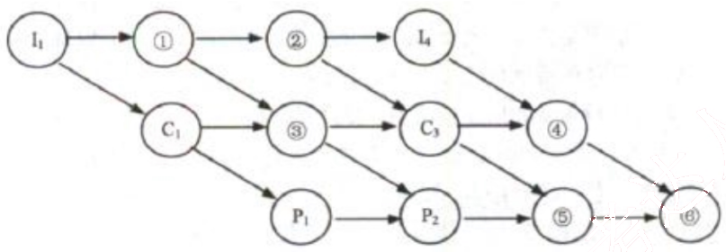
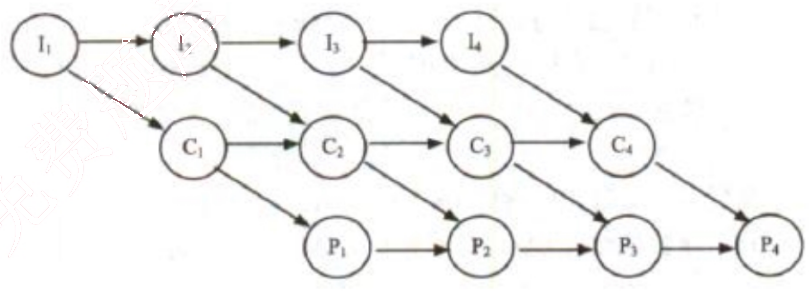
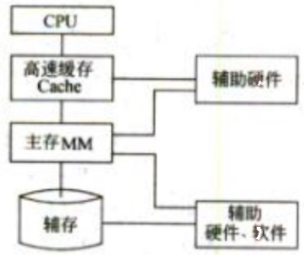
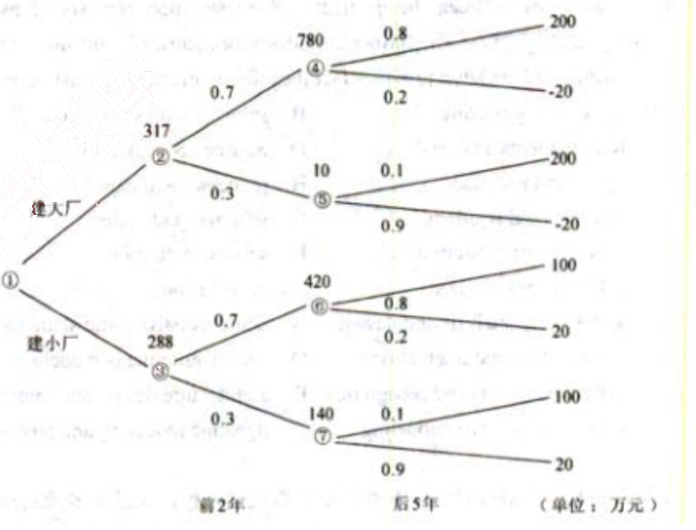

# 2014 年下半年 系统架构设计师 · 综合知识真题（75 题）

> 题干与选项取自正式试卷；答案与解析取自随卷答案详解
>
> **来源**：本地购买扫描件《2014 年下半年系统架构设计师 答案详解》（贡献者已购买并授权转录）
> **来源类型**：`real`
> **解析方式**：byted-las-document-parse（normal 模式）+ 机械清洗，已剔除页眉、广告条与页码
> **答案与解析**：取自随卷答案详解，非本仓库编写
> **使用建议**：可用于章节训练与年份模考；关键数字建议对照原始 PDF 复核
> **完整性**：综合知识 75 题、案例分析 5 题、论文 4 题齐备
> **知识点标签**：题组级 `§N` 标签，依据题干与原文解析中的考查提示标注，细分到考期题组而非逐题子编号

### 1-2.

## 第 1-2 题：[§1 操作系统—前趋图]

某计算机系统中有一个CPU、一台输入设备和一台输出设备，假设系统中有四个作业T1、T2、T3和T4，系统采用优先级调度，且T1的优先级>T2的优先级>T3的优先级>T4的优先级。每个作业具有三个程序段：输入Ii、计算Ci和输出Pi（i=1,2,3,4），其执行顺序为Ii→Ci→Pi。这四个作业各程序段并发执行的前驱图如下所示。图中①、②、③分别为 (1)，④、⑤、⑥分别为 (2)。

(1) A. I2、C2、C4
B. I2、I3、C2
C. C2、P3、C4
D. C2、P3、P4

(2) A. C2、C4、P4
B. I2、I3、C4
C. I3、P3、P4
D. C4、P3、P4

【答案】B D

**考点**：§1 操作系统—前趋图

【解析】本题考查操作系统前驱图方面的基础知识。

(1) 前驱图是一个有向无循环图，由节点和有向边组成，节点代表各程序段的操作，而节点间的有向边表示两个程序段操作之间存在的前驱关系（“→”）。程序段Pi和Pj的前驱关系可表示成Pi→Pj，其中Pi是Pj的前驱，Pj是Pi的后继，其含义是Pi执行结束后Pj才能执行。本题完整的前驱图如下图所示，具体分析如下。

根据题意，I1执行结束后C1才能执行，Ci执行结束后Pi才能执行，因此I1是C1、P1的前驱，C1是P1的前驱。可见，图中③应为C1。又因为计算机系统中只有一台输入设备，所以I1执行结束后I2和I3才能执行，故I1是I2和I3的前驱，I2是I3的前驱。可见，图中①、②分别为I2、I3。

(2) 试题（2）的正确答案是D。根据题意，I4、C3执行结束后C4才能执行，即I4、C3是C4的前驱，所以④应为C4。又因为计算机系统中只有一个CPU和一台输出设备，所以C3、

P2 执行结束后 P3 才能执行，C3、P2 是 P3 的前趋；同理 C4、P3 执行结束后 P4 才能执行，C4、P3 是 P4 的前趋。经分析可知图中⑤、⑥分别为 P3、P4。计算机系统中只有一个 CPU，而且系统采用优先级调度，所以 C1 是 C2 的前趋，C2 是 C3 的前趋。可见，图中④应为 C2。

### 3-4.

## 第 3-4 题：[§1 操作系统—文件索引]

某文件系统文件存储采用文件索引节点法。假设磁盘索引块和磁盘数据块大小均为 1KB，每个文件的索引节点中有 8 个地址项 iaddr[0]～iaddr[7]，每个地址项大小为 4 字节，其中 iaddr[0]～iaddr[5]为直接地址索引，iaddr[6]是一级间接地址索引，iaddr[7]是二级间接地址索引。如果要访问 icwutil.dll 文件的逻辑块号分别为 0、260 和 518，则系统应分别采用（3）。该文件系统可表示的单个文件最大长度是（4）KB。

(3) A. 直接地址索引、一级间接地址索引和二级间接地址索引
B. 直接地址索引、二级间接地址索引和二级间接地址索引
C. 一级间接地址索引、一级间接地址索引和二级间接地址索引
D. 一级间接地址索引、二级间接地址索引和二级间接地址索引

(4) A. 518
B. 1030
C. 16514
D. 65798

【答案】A D

**考点**：§1 操作系统—文件索引

【解析】本题考查操作系统文件管理方面的基础知识。

(3) 根据题意，磁盘索引块为 1KB，每个地址项大小为 4B，故每个磁盘索引块可存放 1024/4=256 个物理块地址。又因为文件索引节点中有 8 个地址项，其中 iaddr[0]、iaddr[1]、iaddr[12]、iaddr[3]、iaddr[4]、iaddr[5]地址项为直接地址索引，分别存放逻辑块号为 0～5 的物理块地址；iaddr[6]是一级间接地址索引，这意味着 iaddr[6]地址项指出的物理块中存放逻辑块号为 6～261 的物理块号；iaddr[7]是二级间接地址索引，该地址项指出的物理块存放了 256 个间接索引表的地址，这 256 个间接索引表存放逻辑块号为 262～65795 的物理块号。

经上分析不难得出，试题（3）的正确答案是 A。因为若要访问文件的逻辑块号分别为 0、260 和 518，分别对应系统管理的直接地址索引、一级间接地址索引和二级间接地址索引范围内。

(4) 试题（4）的正确答案是 D。因为单个文件的逻辑块号可以从 0～65795，共 65796 个物理块，而磁盘数据块大小为 1KB，所以单个文件最大长度是 65796KB。

### 5.

## 第 5 题：[§5 数据库—函数依赖公理]

设关系模式 R(U, F)，其中 U 为属性集，F 是 U 上的一组函数依赖，那么函数依赖的公理系统（Armstrong 公理系统）中的合并规则是指 (5) 为 F 所蕴涵。

(5) A. 若 A→B，B→C，则 A→C
B. 若 $Y \subseteq X \subseteq U$，则 X→Y
C. 若 A→B，A→C，则 A→BC
D. 若 A→B，CB，则 A→C

【答案】C

**考点**：§5 数据库—函数依赖公理

【解析】本题考查函数依赖推理规则。

函数依赖的公理系统（即 Armstrong 公理系统）为：设关系模式 R(U, F)，其中 U 为属性集，F 是 U 上的一组函数依赖，那么有如下推理规则：
A1 自反律：若 $Y \subseteq X \subseteq U$，则 X→Y 为 F 所蕴涵。
A2 增广律：若 X→Y 为 F 所蕴涵，且 $Z \subseteq U$，则 XZ→YZ 为 F 所蕴涵。
A3 传递律：若 X→Y，Y→Z 为 F 所蕴涵，则 X→Z 为 F 所蕴涵。

根据上述三条推理规则又可推出下述三条推理规则：
A4 合并规则：若 X→Y，X→Z，则 X→YZ 为 F 所蕴涵。
A5 伪传递率：若 X→Y，WY→Z，则 XW4Z 为 F 所蕴涵。
A6 分解规则：若 X→Y，$Z \subseteq Y$，则 X→Z 为 F 所蕴涵。

选项 A 符合规则为 A3，即传递规则；选项 B 符合规则为 A1，即为自反规则；选项 C 符合规则为 A4，即为合并规则；选项 D 符合规则为 A6，即为分解规则。

### 6-8.

## 第 6-8 题：[§5 数据库—关系代数与SQL]

若关系模式 R 和 S 分别为：R(A, B, C, D)、S(B, C, E, F)，则关系 R 与 S 自然联结运算后的属性列有 (6) 个，与表达式 $\pi\ 1, 3, 5, 6\ (\sigma\ 3<6\ (R \bowtie S))$ 等价的 SQL 语句为：
SELECT (7) FROM R, S WHERE (8)

(6) A. 4
B. 6
C. 7
D. 8

(7) A. A, R.C, E, F
B. A, C, S.B, S.E
C. A, C, S.B, S.C
D. R.A, R.C, S.B, S.C

(8) A. R.B=S.B AND R.C=S.C AND RC<S.B
B. R.B=S.B AND R.C=S.C AND R.C<S.F
C. R.B=S.B OR R.C=S.C OR R.C<S.B
D. R.B=S.B OR R.C=S.C OR R.C<S.F

【答案】B A B

**考点**：§5 数据库—关系代数与SQL

【解析】本题考查关系代数运算与 SQL 查询方面的基础知识。

试题（6）的正确答案为选项 B。自然连接 $R \bowtie S$ 是指 R 与 S 关系中相同属性列名的等值连接运算后，再去掉右边重复的属性列名 S.B、S.C，所以经 $R \bowtie S$ 运算后的属性列名为：R.A、R.B、R.C、R.D、S.E 和 S.F，共有 6 个属性列。

试题（7）的正确答案为选项 A。$\pi\ 1,3,5,6(\sigma\ 3{<}6(RS))$ 的含义是从 RS 结果集中选取 R.C<S.F 的元组，再进行 R.A、R.C、S.E 和 S.F 投影，故选项 A 是正确的。

试题（8）的正确答案为选项 B。由于自然连接 $R \bowtie S$ 是指 R 与 S 关系中相同属性列名的等值连接，故需要用条件 “WHERE R.B=S.B AND R.C=S.C” 来限定；又由于经自然连接 $R \bowtie S$ 运算后，去掉了右边重复的属性列名 S.B、S.C，使得第三列属性列名和第六列属性列名分别为 R.C、S.F，所以选取运算 $\sigma\ 3{<}6$ 需要用条件 “WHERE R.C<S.F” 来限定。

### 9.

## 第 9 题：[§1 存储系统—分级存储]

计算机采用分级存储体系的主要目的是为了 (9)。

(9) A. 解决主存容量不足的问题
B. 提高存储器读写可靠性
C. 提高外设访问效率
D. 解决存储的容量、价格和速度之间的矛盾

【答案】D

**考点**：§1 存储系统—分级存储

【解析】本题考查计算机系统基础知识。

存储体系结构包括不同层次上的存储器，通过适当的硬件、软件有机地组合在一起形成计算机的存储体系结构。例如，由高速缓存（Cache）、主存储器（MM）和辅助存储器构成的3 层存储器层次结构存如下图所示。

接近 CPU 的存储器容量更小、速度更快、成本更高，辅存容量大、速度慢，价格低。采用分级存储体系的目的是解决存储的容量、价格和速度之间的矛盾。

### 10-11.

## 第 10-11 题：[§1 嵌入式—嵌入式处理器]

以下嵌入式处理器类型中不具备内存管理单元(MMU)的是 (10)，嵌入式操作系统 (11) 可以运行在它上面。

(10) A. PowerPC750  B. ARM920T  C. Cortex-M3  D. MIPS32 24K

(11) A. Linux  B. VxWorks653  C. uC/OS-II  D. Windows CE

【答案】C C

**考点**：§1 嵌入式—嵌入式处理器

【解析】本题考查嵌入式处理器知识。

MMU是存储器管理单元的缩写，是用来管理虚拟内存系统的器件。MMU通常是CPU的一部分，本身有少量存储空间存放从虚拟地址到物理地址的匹配表。此表称作TLB(转换旁置缓冲区)。所有数据请求都送往MMU，由MMU决定数据是在RAM内还是在大容量存储器设备内。如果数据不在存储空间内，MMU将产生页面错误中断。

MMU的两个主要功能是将虚地址转换成物理地址，控制存储器存取允许。MMU关掉时，虚地址直接输出到物理地址总线。

Cortex-M3处理器采用ARMv7-M架构，它包括所有的16位Thumb指令集和基本的32位Thumb-2指令集架构。Cortex-M3支持线程模式和处理模式。在复位时处理器进入“线程模式”，异常返回时也会进入该模式，特权和用户（非特权）模式代码能够在“线程模式”下运行。出现异常模式时处理器进入“处理模式”，在处理模式下，所有代码都是特权访问的。μC/OS-II可以运行在Cortex-M3处理器上。

### 12.

## 第 12 题：[§5 数据库—嵌入式数据库]

以下关于嵌入式数据库管理系统的描述不正确的是 (12)。

(12) A. 嵌入式数据库管理系统一般只为前端应用提供基本的数据支持
B. 嵌入式数据库管理系统一般支持实时数据的管理
C. 嵌入式数据库管理系统一般不支持多线程并发操作
D. 嵌入式数据库管理系统一般只提供本机服务接口

【答案】C

**考点**：§5 数据库—嵌入式数据库

【解析】本题考查嵌入式系统数据库知识。

嵌入式系统的数据库系统称为嵌入式数据库系统或嵌入式实时数据库系统。嵌入式系统必须能够在没有人工干预的情况下，长时间不间断地运行，因此要求高的可靠性。同时要求数据库操作具备可预知性，而且系统的大小和性能也都必须是可预知的，以保证系统的性能。嵌入式系统需要与底层硬件打交道，因此在数据管理时，也要有底层控制的能力，如什么时候会发生磁盘操作，磁盘操作的次数，如何控制等。底层控制的能力是决定数据库管理操作

的关键。

嵌入式数据库管理系统一般只提供本机服务接口，为前端应用提供基本的数据支持。

### 13.

## 第 13 题：[§1 网络—集成服务IntServ]

IETF 定义的集成服务(IntServ)把 Internet 服务分成了三种服务质量不同的类型，这三种服务不包括_(13)_。

(13) A. 保证质量的服务：对带宽、时延、抖动和丢包率提供定量的保证
B. 尽力而为的服务：这是一般的 Internet 服务，不保证服务质量
C. 负载受控的服务：提供类似于网络欠载时的服务，定性地提供
D. 突发式服务：如果有富余的带宽，网络保证满足服务质量的需求

【答案】D

**考点**：§1 网络—集成服务IntServ

【解析】
IETF 集成服务（IntServ）工作组根据服务质量的不同，把 Internet 服务分成了三种类型：
①保证质量的服务（Guranteed Services)：对带宽、时延、抖动和丢包率提供定量的保证；
②负载受控的服务（Comrolled-load Services)：提供一种类似于网络欠载情况下的服务，这是一种定性的指标；
③尽力而为的服务（Best-Effort)：这是 Internet 提供的一般服务，基本上无任何质量保证。

### 14.

## 第 14 题：[§1 网络—分层网络设计]

按照网络分层设计模型，通常把局域网设计为3层，即核心层、汇聚层和接入层，以下关于分层网络功能的描述中，不正确的是_(14)_。

(14) A. 核心层设备负责数据包过滤、策略路由等功能
B. 汇聚层完成路由汇总和协议转换功能
C. 接入层应提供一部分管理功能，例如 MAC 地址认证、计费管理等
D. 接入层负责收集用户信息，例如用户 IP 地址、MAC 地址、访问日志等

【答案】A

**考点**：§1 网络—分层网络设计

【解析】
三层模型将大型局域网划分为核心层、汇聚层和接入层，每一层都有特定的作用。
①核心层是因特网络的高速骨干网，由于其重要性，因此在设计中应该采用冗余组件设计。在设计核心层设备的功能时，应尽量避免使用数据包过滤和策略路由等降低数据包转发

速率的功能。如果需要连接因特网和外部网络，核心层还应包括一条或多条连接到外部网络的连接。

②汇聚层是核心层和接入层之间的分界点，应尽量将资源访问控制、流量的控制等在汇聚层实现。为保证层次化的特性，汇聚层应该向核心层隐藏接入层的细节，例如不管接入层划分了多少个子网，汇聚层向核心层路由器进行路由宣告时，仅宣告由多个子网地址汇聚而成的网络。为保证核心层能够连接运行不同协议的区域网络，各种协议的转换都应在汇聚层完成。

③接入层为用户提供在本地网段 i 方向应用系统的能力，也要为相邻用户之间的互访需求提供足够的带宽。接入层还应该负责一些用户管理功能，以及户信息的收集工作。

### 15.

## 第 15 题：[§1 网络—综合布线]

结构化布线系统分为六个子系统，其中水平子系统 (15)。

(15) A. 由各种交叉连接设备以及集线器和交换机等设备组成
B. 连接了干线子系统和工作区子系统
C. 由终端设备到信息插座的整个区域组成
D. 实现各楼层设备间子系统之间的互连

【答案】B

**考点**：§1 网络—综合布线

【解析】
结构化布线系统分为6个子系统：工作区子系统、水平子系统、管理子系统、干线(或垂直)子系统、设备间子系统和建筑群7系统。其中水平子系统是指各个楼层接线间的配线架到工作区信息插座之间所安装的线缆系统，其作用是将干线子系统与用户工作区连接起来。

### 16-17.

## 第 16-17 题：[§1 计算机系统—性能评估]

在实际应用中，用户通常依靠评价程序来测试系统的性能。以下评价程序中，(16) 的评测准确程度最低。事务处理性能委员会(Transaction Processing Performance Council, TPC)是制定商务应用基准程序(benchmark)标准规范、性能和价格度量，并管理测试结果发布的非营利组织，其发布的 TPC-C 是 (17) 的基准程序。

(16) A. 核心程序
B. 真实程序
C. 合成基准程序
D. 小型基准程序

(17) A. 决策支持
B. 在线事务处理
C. 企业信息服务
D. 联机分析处理

【答案】C B

**考点**：§1 计算机系统—性能评估

【解析】本题主要考查性能评估知识。
在大多数情况下，为测试新系统的性能，用户必须依靠评价程序来评价机器的性能。对

于真实程序、核心程序、小型基准程序和合成基准程序来说，其评测程度依次递减。把应用程序中用的最多、最频繁的那部分核心程序作为评价计算机性能的标准程序，称为基准测试程序（Benchmark)。事务处理性能委员会（Transaction Processing Performance Council, TPC)是制定商务应用基准程序（Benchmark)标准规范、性能和价格度量，并管理测试结果发布的非营利组织，其发布的 TPC-C 是在线事务处理的基准程序，TPC-D 是决策支持的基准程序。

### 18.

## 第 18 题：[§2 信息系统—企业信息化]

企业信息化肯定要建立在企业战略规划基础之上，以企业战略规划为基础建立的企业管理模式是建立（18）的依据。

(18) A. 企业战略数据模型
B. 企业业务运作模型
C. 企业信息系统架构
D. 企业决策支持

【答案】A

**考点**：§2 信息系统—企业信息化

【解析】本题考查企业信息化基础知识。

企业信息化是指企业以业务流程的优化和重构为基础，在一定的深度和广度上利用计算机技术、网络技术和数据库技术，控制和集成化管理企业生产经营活动中的各种信息，实现企业内外部信息的共享和有效利用，以提高企业的经济效益和市场竞争力，这将涉及到企业的管理理念的创新，管理流程的优化，管理团队的重组和管理手段的革新。企业信息化一定要建立在企业战略规划的基础之上，以企业战略规划为基础建立的企业管理模式是建立企业战略数据模型的依据。

### 19-21.

## 第 19-21 题：[§2 信息系统—ERP]

ERP 是对企业物流资源，资金流资源和信息流资源进行全面集成管理的管理信息系统。在 ERP 五个层次的计划中，（19）根据经营计划的生产目标制定，是对企业经营计划的细化；（20）说明了在一定时期内生产什么，生产多少和什么时候交货，它的编制是 ERP 的主要工作内容；（21）能够帮助企业尽早发现企业生产能力的瓶颈，为实现企业的生产任务提供能力方面的保障。

(19) A. 销售管理计划
B. 生产预测计划
C. 生产计划大纲
D. 主生产计划

(20) A. 经营计划
B. 车间作业计划
C. 物料需求计划
D. 主生产计划

(21) A. 采购与库存计划
B. 能力需求计划
C. 物料需求计划
D. 质量管理计划

【答案】C D B

**考点**：§2 信息系统—ERP

【解析】本题考查企业资源规划的基础知识。

ERP 是对企业物流、资金流和信息流资源进行全面集成管理的管理信息系统。在 ERP 五个层次的计划中，生产预测计划是对市场需求进行比较准确的预测，是经营计划、生产计划大纲和主生产计划编制的基础；销售管理计划是针对企业的销售部门的相关业务进行管理，属于最高层计划的范畴，是企业最重要的决策层计划之一；生产计划大纲根据经营计划的生产目标制定，是对企业经营计划的细化；主生产计划说明了在一定时期内生产什么，生产多少和什么时候交货，它的编制是 ERP 的主要工作内容；物料需求计划是对主生产计划的各个项 0 所需的全部制造件和全部采购件的网络支持计划和时间进度计划；能力需求计划是对物料需求计划所需能力进行核算的一种计划管理方法，能够帮助企业尽早发现企业生产能力的瓶颈，为实现企业的生产任务提供能力帮面的保障。

### 22-23.

## 第 22-23 题：[§2 信息系统—企业信息集成]

集成平台是支持企业信息集成的支撑环境，包括硬件、软件、软件工具和系统。集成平台的基本功能中，（22）实现不同数据库系统之间的数据交换、互操作、分布数据管理和共享信息模型定义；（23）能够为应用提供数据交换和访问操作，使各种不同的系统能够相互协作。

(22) A. 数据通信服务  B. 信息集成服务  C. 应用集成服务  D. 操作集成服务

(23) A. 数据通信服务  B. 信息集成服务  C. 应用集成服务  D. 操作集成服务

【答案】B  C

**考点**：§2 信息系统—企业信息集成

【解析】本题考查企业信息集成的基础知识。

企业集成平台是一个支持复杂信息环境下信息系统开发、集成、协同运行的软件支撑环境，包括硬件、软件、软件工具和系统。基本功能包括：①通信服务：提供分布环境下透明的同步/异步通信服务功能；②信息集成服务：为应用提供透明的信息访问服务，实现异种数据库系统之间数据的交换、互操作、分布数据管理和共享信息模型定义：③应用集成服务：通过高层应用编程接口来实现对相应应用程序的访问，能够为应用提供数据交换和访问操作，使各种不同的系统能够相互协作；④二次开发工具：是集成平台提供的一组帮助用户开发特定应用程序的支持工具；⑤平台运行管理工具：是企业集成平台的运行管理和控制模块。

### 24.

## 第 24 题：[§2 信息系统—商业智能]

商业智能是企业对商业数据的搜集、管理和分析的系统过程，主要技术包括（24）。

(24) A. 数据仓库、联机分析和数据挖掘  B. 数据采集、数据清洗和数据挖掘
C. 联机分析、多维度分析和跨维度分析  D. 数据仓库、数据挖掘和业务优化重组

【答案】A

**考点**：§2 信息系统—商业智能

【解析】本题考查商业智能的基础知识。

商业智能通常被理解为将组织中现有的数据转化为知识，帮助组织做出明智的业务经营决策。商业智能的实现涉及到软件、硬件、咨询服务及应用，是对商业信息的搜集、管理和分析过程，目的是使企业的各级决策者获得知识或洞察力，促使他们做出对企业更有利的决策。商业智能一般由数据仓库、联机分析处理、数据挖掘、数据备份和恢复等部分组成。

### 25.

## 第 25 题：[§4 软件工程—系统建议方案]

系统建议方案中不应该包含的内容是 (25)。

(25) A. 问题陈述
B. 项目范围
C. 候选方案及其可行性分析
D. 系统详细设计方案

【答案】D

**考点**：§4 软件工程—系统建议方案

【解析】

作为一份正式文档，系统建议方案至少应该包含以下内容：

①前羿部分。包括标题、目录和摘要。摘要部分以1～2页的篇幅总结整个系统建议方案报告，提供系统方案中的重要事件、地点、任务和原因，以及系统方案是如何实现的等信息。

②系统概述。包括系统建议方案报告的目的、对问题的陈述、项目范围和报告内容的叙述性解释。

③系统研究方法。简要地解释系统建议方案报告中包含的信息是如何得到的，研究工作是如何进行的。

④候选系统方案及其可行性分析。系统阐述每个候选系统方案，并对每个方案进行可行性评价。

⑤建议方案。在对各个候选系统方案进行可行性评价之后，通常会推荐一个解决方案，并且要给出推荐该解决方案的理由。

⑥结论。简要地描述摘要的内容，再次指出系统开发的目标和所建议的系统方案。同时，需要再次强调项目的必要性和可行性，以及系统建议方案报告的价值。

⑦附录。系统分析师认为阅读者可能会感兴趣的所有信息，但这些信息对于理解系统建议方案报告的内容来说不是必要的。

### 26.

## 第 26 题：[§4 软件工程—联合需求计划JRP]

下列关于联合需求计划(Joint Requirement Planning, JRP)的叙述中，不正确的是_(26)_。

(26) A. 在 JRP 实施之前，应制定详细的议程，并严格遵照议程进行
B. 在讨论期间尽量避免使用专业术语
C. JRP 是一种相对来说成本较高但十分有效的需求获取方法
D. JRP 的主要目的是对需求进行分析和验证

【答案】D

**考点**：§4 软件工程—联合需求计划JRP

【解析】本题考查联合需求计划(JRP)的相关概念。

JRP 是一个通过高度组织的群体会议来分析企业内的问题并获取需求的过程，它是联合应用开发（JAD)的一部分。

JRP 的主要意图是收集需求，而不是对需求进行分析和验证。实施 JRP 时应把握以下主要原则：在 JRP 实施之前，应制定详细的议程，并严格遵照议程进行；按照既定的时间安排进行；尽量完整地记录会议期间的内容；在讨论期间尽量避免使用专业术语；充分运用解决冲突的技能；会议期间应设置充分的间歇时间；鼓励团队取得一致意见；保证参加 JRP 的所有人员能够遵守实现约定的规则。

### 27-28.

## 第 27-28 题：[§4 软件工程—需求建模]

在结构化分析方法中，用_(27)_表示功能模型，用_(28)_表示行为模型。

(27) A. ER 图
B. 用例图
C. DFD
D. 对象图

(28) A. 通信图
B. 顺序图
C. 活动图
D. 状态转换图

【答案】C D

**考点**：§4 软件工程—需求建模

【解析】

结构化分析方法的基本思想是自顶向下，逐层分解，把一个大问题分解成若干个小问题，每个小问题再分解成若干个更小的问题。经过逐层分解，每个最低层的问题都是足够简单、容易解决的。结构化方法分析模型的核心是数据字典，围绕这个核心，有三个层次的模型，分别是数据模型、功能模型和行为模型（也称为状态模型）。在实际工作中，一般使用 E-R 图表示数据模型，用 DFD 表示功能模型，用状态转换图表示行为模型。这三个模型有着密切的关系，它们的建立不具有严格的时序性，而是一个迭代的过程。

### 29.

## 第 29 题：[§4 软件工程—敏捷方法]

下列关于敏捷方法的叙述中，错误的是_(29)_。

(29) A. 与传统方法相比，敏捷方法比较适合需求变化大或者开发前期对需求不是很清晰的项目

B. 敏捷方法尤其适合于开发团队比较庞大的项目

C. 敏捷方法的思想是适应性，而不是预设性

D. 敏捷方法以原型开发思想为基础，采用迭代式增量开发

【答案】B

**考点**：§4 软件工程—敏捷方法

【解析】本题考查敏捷方法的相关概念。

敏捷方法是从20世纪90年代开始逐渐引起广泛关注的一些新型软件开发方法，以应对快速变化的需求。敏捷方法的核心思想主要有以下三点。

①敏捷方法是“适应性”而非“预设性”的。传统方法试图对一个软件开发项目在很长的时间跨度内做出详细的计划，然后依计划进行开发。这类方法在计划制定完成后拒绝变化。而敏捷方法则欢迎变化，其实它的目的就是成为适应变化的过程，甚至能允许改变自身来适应变化。

②敏捷方法是以人为本，而不是以过程为本。传统方法以过程为本，强调充分发挥人的特性，不去限制它，并且软件开发在无过程控制和过于严格繁琐的过程控制中取得一种平衡，以保证软件的质量。

③迭代增量式的开发过程。敏捷方法以原型开发思想为基础，采用迭代增量式开发，发行版本小型化。

与RUP相比，敏捷方法的周期可能更短。敏捷方法在几周或者几个月的时间内完成相对较小的功能，强调的是能尽早将尽量小的可用的功能交付使用，并在整个项目周期中持续改善和增强，并且更加强调团队中的高度协作。相对而言，敏捷方法主要适合于以下场合：

①项目团队的人数不能太多，适合于规模较小的项目。

②项目经常发生变更。敏捷方法适用于需求萌动并且快速改变的情况，如果系统有比较高的关键性、可靠性、安全性方面的要求，则可能不完全适合。

③高风险项目的实施。

④从组织结构的角度看，组织结构的文化、人员、沟通性决定了敏捷方法是否使用。

### 30.

## 第 30 题：[§4 软件工程—用户界面设计]

下列关于用户界面设计的叙述中，错误的是（30）。

(30) A. 界面交互模型应经常进行修改

B. 界面的视觉布局应该尽量与真实世界保持一致

C. 所有可视信息的组织需要按照统一的设计标准

D. 确保用户界面操作和使用的一致性

【答案】A

**考点**：§4 软件工程—用户界面设计

【解析】
户界面设计的基本原则是从实践中总结出来的一些设计规则。Theo Maiidel 在他的界面设计著作中提出 3 条“黄金规则”：

①让用户拥有控制权
用户希望控制计算机，而不是被计算机控制，因此在设计人机界面时应遵循以下原则：交互模式的定义不能强迫用户进入不必要的或不希望的动作的方式；提供灵活的交互；允许用户交互可以被中断和撤销；当技能级别增长时可以使交互流水化并允许定制交互；使用户隔离内部技术细节。

②减少用户的记忆负担
要求用户记住的东西越多，与系统交互时出错的可能也越大，因此好的用户界面设计不应加重用户的记忆负担。减少用户记忆负担的设计原则为：减少对短期记忆的要求；建立有意义的默认值；定义直觉性的捷径；界面的视觉布局应该基于真实世界的隐喻；以不断进展的方式揭示信息。

③保持界面一致
用户应该以一致的方式展示和获取信息，这意味着：所有可视信息的组织遵循统一的设计标准，所有屏幕显示都遵守该标准。输入机制被约束到有限的集合内，在整个软件系统中被一致地使用，同时从任务到任务的导航机制也被一致地定义和实现。保持界面一致性的设计原则包括以下内容：允许用户将当前任务放在有意义的语境中；在应用系列内保持一致性；不要改变用户已经熟悉的用户交互模型。

### 31.

## 第 31 题：[§4 软件工程—软件维护类型]

在软件的使用过程中，用户往往会对软件提出新的功能与性能要求。为了满足这些要求，需要修改或再开发软件。在这种情况下进行的维护活动称为 (31)。

(31) A. 改正性维护  B. 适应性维护  C. 完善性维护  D. 预防性维护

【答案】C

**考点**：§4 软件工程—软件维护类型

【解析】
在系统运行过程中，软件需要维护的原因是多样的。根据维护的原因不同，可以将软件维护分为以下 4 种：

①改正性维护。为了识别和纠正软件错误、改正软件性能上的缺陷、排除实施中的误使用，应当进行的诊断和改正错误的过程称为改正性维护。

②适应性维护。在使用过程中，外部环境（新的硬、软件配置）、数据环境（数据库、数据格式、数据输入/输出方法、数据存储介质）可能发生变化。为使软件适应这种变化而修改软件的过程称为适用性维护。

③完善性维护。在软件的使用过程中，用户往往会对软件提出新的功能与性能要求。为了满足这些要求，需要修改或再开发软件，以扩充软件功能、增强软件性能、改进加工效率、提高软件的可维护性。这种情况下进行的维护活动成为完善性维护。

④预防性维护。指预先提高软件的可维护性、可靠性等，为以后进一步改进软件打下良好基础。采用先进的软件工程方法对需要维护的软件或软件中的某一部分（重新）进行设计、编码和测试。

### 32.

## 第 32 题：[§6 系统架构—设计模式]

一组对象以定义良好但是复杂的方式进行通信，产生的相互依赖关系结构混乱且难以理解。采用 (32) 模式，用一个特定对象来封装一系列的对象交互，从而使各对象不需要显式地相互引用，使其耦合松散，而且可以独立地改变它们之间的交互。

(32) A. 解释器(Interpreter)
B. 策略(Strategy)
C. 中介者(Mediator)
D. 迭代器(Iterator)

【答案】C

**考点**：§6 系统架构—设计模式

【解析】
解释器模式属于类的行为模式，描述了如何为语言定义一个文法，如何在该语言中表示一个句子，以及如何解释这些句子，这里的“语言”是使用规定格式和语法的代码。

策略模式是一种对象的行为型模式，定义一系列算法，并将每个算法封装起来，并让它们可以相互替换。策略模式让算法独立于使用它的客户而变化，其目的是将行为和环境分隔，当出现新的行为时，只需要实现新的策略类。

中介者模式是一种对象的行为行模式，通过一个中介对象来封装一系列的对象交互。中介者使得各对象不需要现实地相互引用，从而使其耦合松散，而且可以独立地改变它们之间的交互。中介者对象的存在保证了对象结构上的稳定，也就说说系统的结构不会因为新对象的引入带来大量的修改工作。

迭代器模式是一种对象的行为型模式，提供了一种方法来访问聚合对象，而不用暴露这个对象的内部表示。迭代器模式支持以不同的方式遍历一个聚合对象。

由上述可知，与题目所描述场景符合的是中介者模式。

### 33-34.

## 第 33-34 题：[§6 系统架构—设计模式]

某广告公司的宣传产品有宣传册、文章、传单等多种形式，宣传产品的出版方式包括纸质方式、CD、DVD、在线发布等。现要求为该广告公司设计一个管理这些宣传产品的应用，采用（33）设计模式较为合适，该模式（34）。

(33) A. Decorator  B. Adapter  C. Bridge  D. Façade

(34) A. 将一系列复杂的类包装成一个简单的封闭接口
B. 将抽象部分与它的实现部分分离，使它们都可以独立地变化
C. 可在不影响其他对象的情况下，以动态、透明的方式给单个对象添加职责
D. 将一个接口转换为客户希望的另一个接口

【答案】C  B

**考点**：§6 系统架构—设计模式

【解析】本题考查设计模式的概念及应用。

题目所给出的应用中，不希望在不同的宣传产品与具体所采用的出版方式之间建立一个固定的绑定关系，以避免这两者之间的紧耦合关系。这种情形适合于采用Bridge(桥接)模式。桥接模式属于结构型设计模式的一种。结构型模式描述如何将类或对象合在一起形成更大的结构。桥接模式将抽象部分与它的实现部分分离，使它们都可以独立地变化。

在以下情况可以使用Bridge模式：
① 不希望在抽象以及抽象的实现部分之间有一个固定的绑定关系。例如这种情况可能是因为，在程序运行时刻可以选择或切换实现部分；
② 类的抽象以及它的实现都应该可以通过生成子类的方法加以扩充，使用Bridge模式可以对不同的抽象接口和实现部分进行组合，并分别对它们进行扩充。
③ 对一个抽象的实现部分的修改应该对用户不产生影响，即客户的代码不必重新编译。

### 35-36.

## 第 35-36 题：[§6 系统架构—4+1视图]

在UML提供的系统视图中，（35）是逻辑视图的一次执行实例，描述了并发与同步结构；（36）是最基本的需求分析模型。

(35) A. 进程视图  B. 实现视图  C. 部署视图  D. 用例视图

(36) A. 进程视图  B. 实现视图  C. 部署视图  D. 用例视图

【答案】A  D

**考点**：§6 系统架构—4+1视图

【解析】

UML对系统架构的定义是系统的组织结构，包括系统分解的组成部分，以及它们的关联性、交互机制和指导原则等提供系统设计的信息。具体来说，就是指以下5个系统视图：
① 逻辑视图。逻辑视图也称为设计视图，它表示了设计模型中在架构方面具有重要意义

的部分，即类、子系统、包和用例实现的子集。

②进程视图。进程视图是可执行线程和进程作为活动类的建模，它是逻辑视图的一次执行实例，描述了并发与同步结构。

③实现视图。实现视图对组成基于系统的物理代码的文件和构件进行建模。

④部署视图。部署视图把构件部署到一组物理节点上，表示软件到硬件的映射和分布结构。

⑤用例视图。用例视图是最基本的需求分析模型。

### 37.

## 第 37 题：[§4 软件工程—静态测试]

在静态测试中，主要是对程序代码进行静态分析。“数据初始化、赋值或引用过程中的异常”属于静态分析中的 (37)。

(37) A. 控制流分析  B. 数据流分析  C. 接口分析  D. 表达式分析

【答案】B

**考点**：§4 软件工程—静态测试

【解析】本题考查静态测试方法的知识点。

静态测试是指被测试程序不在机器上运行，而采用人工检测和计算机辅助静态分析的手段对程序进行检测。静态测试包括对文档的静态测试和对代码的静态测试。对代码的静态测试包括

控制流分析、数据流分析、接口分析和表达式分析。

①控制流分析。控制流分析是指使用控制流程图检查被测程序控制结构的过程。例如，可检查被测程序是否存在没有使用的语句或子程序、是否调用并不存在的子程序,以及是否存在无法达到的语句等。

②数据流分析。数据流分析是指使用控制流程图分析数据各种异常情况的过程，包括数据初始化、赋值或引用过程中的异常。例如，引用未定义的变量、对以前未使用的变量再次赋值等程序差错或异常情况。

③接口分析。接口分析主要包括模块之间接口的一致性分析、模块与外部数据库及其他软件配置项之间的一致性分析、子程序和函数之间的接口一致性分析等。例如可以检查函数形参与实现的数量、顺序、类型和使用的一致性。

④表达式分析。表达式分析用于检查程序代码中的表达式错误。例如，括号不配对、数组引用越界、除数为零，以及浮点数变量比较时的误差等错误。

### 38.

## 第 38 题：[§4 软件工程—软件调试与测试]

下列关于软件调试与软件测试的叙述中，正确的是 (38)。

(38) A. 软件测试的目的是找出存在的错误，软件调试的目的是定位并修正错误
B. 软件测试的结束过程不可预计，软件调试使用预先定义的过程
C. 软件调试的过程可以实现设计
D. 软件测试不能描述过程或持续时间

【答案】A

**考点**：§4 软件工程—软件调试与测试

【解析】本题考查软件测试与调试之间的区别。

软件测试在将软件交付给客户之前所必须完成的重要步骤。软件调试（排错）与成功的测试形影相随。测试成功的标志是发现了错误，根据错误迹象确定错误的原因和准确位置，并加以改正，主要依靠软件调试技术。

软件调试与软件测试区别主要体现在以下几个方面：
① 测试的目的是找出存在的错误，而调试的目的是定位错误并修改程序以修正错误；
② 调试是测试之后的活动，测试和调试在目标、方法和思路上都有所不同；
③ 测试从一个已知的条件开始，使用预先定义的过程，有预知的结果；调试从一个未知的条件开始，结束的过程不可预计；
④ 测试过程可以实现设计，进度可以实现确定；而调试不能描述过程或持续时间。

### 39.

## 第 39 题：[§4 软件工程—单元测试]

在单元测试中，(39)。

(39) A. 驱动模块用来调用被测模块，自顶向下的单元测试中不需要另外编写驱动模块
B. 桩模块用来模拟被测模块所调用的子模块，自顶向下的单元测试中不需要另外编写桩模块
C. 驱动模块用来模拟被测模块所调用的子模块，自底向上的单元测试中不需要另外编写驱动模块
D. 桩模块用来调用被测模块，自底向上的单元测试中不需要另外编写桩模块

【答案】A

**考点**：§4 软件工程—单元测试

【解析】本题考查单元测试的基本概念。

单元测试也称为模块测试，测试的对象是可独立编译或汇编的程序模块、软件构件或面向对象软件中的类（统称为模块），其目的是检查每个模块能否正确地实现设计说明中的功能、性能、接口和其他设计约束等条件，发现模块内可能存在的各种差错。单元测试的技术依据是软件详细设计说明书。

测试一个模块时，可能需要为该模块编写一个驱动模块和若干个桩模块。驱动模块用来

调用被测模块，它接收测试者提供的测试数据，并把这些数据传送给被测模块，然后从被测模块接收测试结果，并以某种可见的方式将测试结果返回给测试人员；桩模块用来模拟被测模块所调用的子模块，它接受被测模块的调用，检验调用参数，并以尽可能简单的操作模拟被调用的子程序模块功能，把结果送回被测模块。顶层模块测试时不需要驱动模块，底层模块测试时不要桩模块。

单元测试策略主要包括自顶向下的单元测试、自底向上的单元测试、孤立测试和综合测试策略。

①自顶向下的单元测试先测试上层模块，再测试下层模块。测试下层模块时由于它的上层模块已测试过，所以不必另外编写驱动模块。

②自底向上的单元测试。自底向上的单元测试先测试下层模块，再测试上层模块。测试上层模块由于它的下层模块已经测试过，所以不必另外编写桩模块。

③孤立测试不需要考虑每个模块与其他模块之间的关系，逐一完成所有模块的测试。由于各模块之间不存在依赖性，单元测试可以并行进行，但因为需要为每个模块单独设计驱动模块和桩模块，增加了额外的测试成本。

④综合测试。上述三种单元测试策略各有利弊，实际测试时可以根据软件特点和进度安排情况，将几种测试方法混合使用。

### 40.

## 第 40 题：[§6 系统架构—架构设计重要性]

以下关于软件架构设计重要性的描述，(40) 是错误的。

(40) A. 软件架构设计能够满足系统的性能、安全性、可维护性等品质
B. 软件架构设计能够帮助项目干系入(Stakeholder)更好地理解软件结构
C. 软件架构设计能够帮助架构师更好地捕获和细化系统需求
D. 软件架构设计能够有效地管理系统的复杂性，并降低系统维护费用

【答案】C

**考点**：§6 系统架构—架构设计重要性

【解析】本题主要考查软件架构设计的重要性。

软件架构设计是降低成本、改进质量、按时和按需交付产品的关键因素。软件架构设计能够满足系统的性能、安全性、可维护性等品质；软件架构设计能够帮助项目干系人(Stakeholder)更好地理解软件结构；软件架构设计能够有效地管理系统的复杂性，并降低系统维护费用；软件架构设计对系统开发具有指导性；软件架构设计为系统复用奠定的基础；软件架构设计能够支持冲突分析。需要注意的是，软件架构设计与系统需求是直交的，两者并无必然联系。

### 41.

## 第 41 题：[§6 系统架构—需求模型转架构模型]

将系统需求模型转换为架构模型是软件系统需求分析阶段的一项重要工作，以下描述中，__(41)__是在转换过程中需要关注的问题。

(41) A. 如何通过多视图模型描述软件系统的架构
B. 如何确定架构模型中有哪些元素构成
C. 如何采用表格或用例映射保证转换的可追踪性
D. 如何通过模型转换技术，将高层架构模型逐步细化为细粒度架构模型

【答案】C

**考点**：§6 系统架构—需求模型转架构模型

【解析】本题主要考查软件架构设计与生命周期的关系。

从本质上看，需求和软件架构设计面临的是不同的对象：一个是问题空间；另一个是解空间。保持两者的可追踪性和转换，一直是软件工程领域追求的目标。从软件需求模型向SA 模型的转换主要关注两个问题：①如何根据需求模型构建软件架构模型；②如何保证模型转换的可追踪性。本题答案中A、B 是软件架构设计阶段需要考虑的问题，D 是软件架构实现阶段中需要考虑的问题。

### 42-43.

## 第 42-43 题：[§6 系统架构—构件组装]

在构件组装过程中需要检测并解决架构失配问题。其中__(42)__失配主要包括由于系统对构件基础设施、控制模型和数据模型的假设存在冲突引起的失配。__(43)__失配包括由于系统对构件交互协议、构件连接时数据格式的假设存在冲突引起的失配。

(42) A. 构件
B. 模型
C. 协议
D. 连接子

(43) A. 构件
B. 模型
C. 协议
D. 连接子

【答案】A D

**考点**：§6 系统架构—构件组装

【解析】本题主要考查构件组装过程知识。

在架构模型的指导下，可复用构件可以通过组装的方式在较高层次上实现系统，并能够提高系统实现的效率。在构件组装过程中需要检测并解决架构失配问题。其中构件失配主要包括由于系统对构件基础设施、控制模型和数据模型的假设存在冲突引起的失配。连接子失配包括由于系统对构件交互协议、构件连接时数据格式的假设存在冲突引起的失配。

“4+1”视图主要用于描述系统逻辑架构，最早由Philippe Kruchten 于1995 年提出。其中__(44)__视图用于描述对象模型，并说明系统应该为用户提供哪些服务。当采用面向对象的设计方法描述对象模型时，通常使用__(45)__表达类的内部属性和行为，以及类集合之间的

### 44-46.

## 第 44-46 题：[§6 系统架构—4+1视图]

交互关系；采用__(46)__定义对象的内部行为。

(44) A. 逻辑
B. 过程
C. 开发
D. 物理

(45) A. 对象图
B. 活动图
C. 状态图
D. 类图

(46) A. 对象图
B. 活动图
C. 状态图
D. 类图

【答案】A D C

**考点**：§6 系统架构—4+1视图

【解析】本题主要考查考生对“4+1”视图的即解与掌握。

“4+1”视图是对逻辑架构进行描述，最早由Philippe Kruchten提出，他在1995年的IEEE Software上发表了题为The 4+1 View Model of Architecture 的论文，引起了业界的极大关注，并最终被RUP采纳，现在已经成为架构设计的结构标准。“4+1”视图主要包括：
①逻辑视图（Logical View），设计的对象模型（使用面向对象的设计方法时）。
②过程视图（Pmocess View），捕捉设计的并发和同步特征。
③物理视图（Physical View），描述了软件到硬件的映射，反映了分布式特性。
④开发视图（Development View），描述了在开发环境中软件的静态组织结构。
⑤架构的描述，即所做的各种决定，可以围绕着这四个视图来组织，然后由一些用例（Use Cases）或场景（Scenarios）来说明，从而形成了第五个视图。

当采用面向对象的设计方法描述对象模型时，通常使用类图表达类的内部属性和行为，以及类集合之间的交互关系；采用状态图定义对象的内部行为。

### 47-48.

## 第 47-48 题：[§6 系统架构—DSSA角色]

特定领域软件架构（Domain Specific Software Architecture, DSSA）是在一个特定应用领域中，为一组应用提供组织结构参考的标准软件体系结构。参加DSSA的人员可以划分为多种角色，其中__(47)__的任务是控制整个领域分析过程，进行知识获取，将获取的知识组织到领域模型中；__(48)__的任务是根据领域模型和现有系统开发出DSSA，并对DSSA的准确性和一致性进行验证。

(47) A. 领域专家
B. 领域分析者
C. 领域设计者
D. 领域实现者

(48) A. 领域专家
B. 领域分析者
C. 领域设计者
D. 领域实现者

【答案】B C

**考点**：§6 系统架构—DSSA角色

【解析】

特定领域软件架构（Domain Specific Software Architecture, DSSA）以一个特定问题领域为对象，形成由领域参考模型、参考需求、参考架构等组成的开发基础架构，其目标是支持一个特定领域中多个应用的生成。DSSA的基本活动包括领域分析、领域设计和领域实

现。其中领域分析的主要目的是获得领域模型，领域模型描述领域中系统之间共同的需求，即领域需求；领域设计的主要目标是获得 DSSA，DSSA 描述领域模型中表示需求的解决方案；领域实现的主要目标是依据领域模型和 DSSA 开发和组织可重用信息，并对基础软件架构进行实现。参加 DSSA 的人员可以划分为多种角色，其中领域分析者的任务是控制整个领域分析过程，进行知识获取，将获取的知识组织到领域模型中；领域设计者的任务是根据领域模型和现有系统开发出 DSSA，并对 DSSA 的准确性和一致性进行验证。

### 49-50.

## 第 49-50 题：[§6 系统架构—设计模式应用]

某公司欲开发一个用于分布式登录的服务端程序，使用面向连接的 TCP 协议并发地处理多客户端登录请求。用户要求该服务端程序运行在 Linux、Solaris 和 WindowsNT 等多种操作系统平台之上，而不同的操作系统的相关 API 函数和数据都有所不同。针对这种情况，公司的架构师决定采用“包装器外观（Wrapper Facade）”架构模式解决操作系统的差异问题。具体来说，服务端程序应该在包装器外观的实例上调用需要的方法，然后将请求和请求的参数发送给 (49)，调用成功后将结果返回。使用该模式 (50)。

(49) A. 客户端程序
B. 操作系统 API 函数
C. TCP 协议 API 函数
D. 登录连接程序

(50) A. 提高了底层代码访问的一致性，但降低了服务端程序的调用性能
B. 降低了服务端程序功能调用的灵活性，但提高了服务端程序的调用性能
C. 降低了服务端程序的可移植性，但提高了服务端程序的可维护性
D. 提高了系统的可复用性，但降低了系统的可配置性

【答案】B A

**考点**：§6 系统架构—设计模式应用

【解析】本题主要考查考生对设计模式的理解与应用。

针对题目给出的情况，公司的架构师决定采用“包装器外观（Wrapper Facade）”架构模式解决操作系统的差异问题。具体来说，服务端程序应该在包装器外观的实例上调用需要的方法，然后将请求和请求的参数发送给操作系统 API 函数，调用成功后将结果返回。使用该模式提高了底层代码访问的一致性，但降低了服务端程序的调用性能。

### 51-52.

## 第 51-52 题：[§6 系统架构—架构描述语言]

软件架构风格描述某一特定领域中的系统组织方式和惯用模式，反映了领域中众多系统所共有的 (51) 特征。对于语音识别、知识推理等问题复杂、解空间很大、求解过程不确定的这一类软件系统。通常会采用 (52) 架构风格。

(51) A. 语法和语义
B. 结构和语义
C. 静态和动态
D. 行为和约束

(52) A. 管道-过滤器 B. 解释器 C. 黑板 D. 过程控制

【答案】B C

**考点**：§6 系统架构—架构描述语言

【解析】
软件架构风格描述某一特定领域中的系统组织方式和惯用模式，反映了领域中众多系统所共有的结构和语义两个方面的特征。对于语音识别、知识推理等问题复杂、解空间很大、求解过程不确定的这一类软件系统，通常会采用黑板架构风格，以知识为中心进行分析与推理。

### 53.

## 第 53 题：[§6 系统架构—架构复审]

在对一个软件系统的架构进行设计与确认之后，需要进行架构复审。架构复审的目的是为了标识潜在的风险，及早发现架构设计中的缺陷和错误。在架构复审过程中，主要由(53)决定架构是否满足需求、质量需求是否在设计中得到体现。

(53) A. 系统分析师与架构师 B. 用户代表与领域专家
C. 系统拥有者与项目经理 D. 系统开发与测试人员

【答案】B

**考点**：§6 系统架构—架构复审

【解析】
在对一个软件系统的架构进行设计与确认之后，需要进行架构复审。架构复审的目的是为了标识潜在的风险，及早发现架构设计中的缺陷和错误。在架构复审过程中，主要由用户代表与领域专家决定架构是否满足需求、质量需求是否在设计中得到体现。

### 54-59.

## 第 54-59 题：[§7 质量属性与评估—质量属性与策略]

某公司欲开发一个在线交易系统，在架构设计阶段，公司的架构师识别出3个核心质量属性场景。其中“当系统面临断电故障后，需要在1小时内切换至备份站点并恢复正常运行”主要与(54)质量属性相关，通常可采用(55)架构策略实现该属性；“在并发用户数量为1000人时，用户的交易请求需要在0.5秒内得到响应”主要与(56)质量属性相关，通常可采用(57)架构策略实现该属性；“对系统的消息中间件进行替换时，替换工作需要在5人/月内完成”主要与(58)质量属性相关，通常可采用(59)架构策略实现该属性。

(54) A. 性能 B. 安全性 C. 可用性 D. 可修改性

(55) A. 操作隔离 B. 资源调度 C. 心跳 D. 内置监控器

(56) A. 性能 B. 易用性 C. 可用性 D. 互操作性

(57) A. 主动冗余 B. 资源调度 C. 抽象接口 D. 记录/回放

(58) A. 可用性 B. 安全性 C. 可测试性 D. 可修改性

(59) A. 接口-实现分离  B. 记录/回放  C. 内置监控器  D. 追踪审计

【答案】C C A B D A

**考点**：§7 质量属性与评估—质量属性与策略

【解析】本题主要考查考生对质量属性的理解和质量属性实现策略的掌握。

对于题干描述：“当系统面临断电故障后，需要在1小时内切换至备份站点并恢复正常运行”主要与可用性质量属性相关，通常可采用心跳、Ping/Echo、主动冗余、被动冗余、选举等架构策略实现该属性；“在并发用户数量为1000人时，用户的交易请求需要在0.5秒内得到响应”，主要与性能这一质量属性相关，实现该属性的常见架构策略包括：增加计算资源、减少计算开销、引入并发机制、采用资源调度等。“对系统的消息中间件进行替换时，替换工作需要在5人/月内完成”主要与可修改性质量属性相关，通常可采用接口-实现分类、抽象、信息隐藏等架构策略实现该属性。

### 60-61.

## 第 60-61 题：[§7 质量属性与评估—评估四类点]

识别风险、非风险、敏感点和权衡点是进行软件架构评估的重要过程。“改变业务数据编码方式会对系统的性能和安全性产生影响”是对 (60) 的描述，“假设用户请求的频率为每秒1个，业务处理时间小于30毫秒，则将请求响应时间设定为1秒钟是可以接受的”是对 (61) 的描述。

(60) A. 风险点  B. 非风险  C. 敏感点  D. 权衡点

(61) A. 风险点  B. 非风险  C. 敏感点  D. 权衡点

【答案】D B

**考点**：§7 质量属性与评估—评估四类点

【解析】本题主要考查考生对风险、非风险、敏感点和权衡点等重要评估概念的掌握和理解。

风险是某个存在问题的架构设计决策，可能会导致问题：非风险与风险相对，是良好的架构设计决策；

敏感点是一个或多个构件的特性；权衡点是影响多个质量属性的特性，是多个质量属性的敏感点。根据上述定义，可以看出“改变业务数据编码方式会对系统的性能和安全性产生影响”是对权衡点的描述，“假设用户请求的频率为每秒1个，业务处理时间小于30毫秒，则将请求响应时间设定为1秒钟是可以接受的”是对非风险的描述。

### 62-63.

## 第 62-63 题：[§6 系统架构—架构视图与描述]

体系结构权衡分析方法(Architecture Tradeoff Analysis Method, ATAM)是一种常见的系统架构评估框架，该框架主要关注系统的 (62)，针对性能 (63) 安全性和可修改性，在系统开发之前进行分析、评价与折中。

(62) A. 架构视图  B. 架构描述  C. 需求说明  D. 需求建模

(63) A. 架构视图  B. 架构描述  C. 架构设计  D. 架构实现

【答案】C  B

**考点**：§6 系统架构—架构视图与描述

【解析】
架构权衡分析方法是一种系统架构评估方法，主要在系统开发之前，针对性能、可用性、安全性和可修改性等质量属性进行评价和折中。ATAM可以分为4个主要的活动阶段，包括需求收集、架构视图描述、属性模型构造和分析、架构决策与折中，整个评估过程强调以属性作为架构评估的核心概念。题目中提到“某软件公司采用ATAM进行软件架构评估，在评估过程中识别出了多个关于质量属性的描述。其中，系统在进行文件保存操作时，应该与Windows 系统的操作方式保持一致。”与用户所熟悉的操作方式，操作界面保持一致，这是一种减轻用户记忆负担，降低学习成本的做法，这有利于提高系统的易用性。“系统应该提供一个开放的API接口，支持远程对系统的行为进行控制与调试”，在此处，我们注意到描述的核心落在“支持远程对系统的行为进行控制与调试”上了，而调试是在测试之后精确定位系统错误的一种机制，所以这种做法有利于提高系统的可测试性。最后的两空也是考概念：在识别出上述描述后，通常采用效用树对质量属性的描述进行刻画与排序。在评估过程中，权衡点是一个会影响多个质量属性的架构设计决策。

### 64.

## 第 64 题：[§11 标准化与知识产权—软件著作权产生时间]

以下关于软件著作权产生时间的表述中，正确的是 (64)。

(64) A. 自软件首次公开发表时  B. 自开发者有开发意图时
C. 自软件开发完成之日时  D. 自获得软件著作权登记证书时

【答案】C

**考点**：§11 标准化与知识产权—软件著作权产生时间

【解析】
在我国，著作权采用“自动保护”原则，即软件著作权是自动获得的。《计算机软件保护条例》第十四条规定：“软件著作权自软件开发完成之日起产生。”，即软件著作权自软件开发完成之日起自动产生，不论整体还是局部，只要具备了软件的属性即产生软件著作权，既不要求履行任何形式的登记或注册手续，也无须加注著作权标记，且不论其是否已经发表都依法享有软件著作权。开发完成是指以计算机能够识别并进行处理以实现一定功能的语句或指令的形式，并存储在一定的有形介质中，如内存、硬盘、光盘等。

我国实施了计算机软件登记制度，于1992年颁布了《计算机软件著作权登记办法》。实施计算机软件登记制度的目的是为促进我国软件产业发展，增强我国软件产业的创新能力和

竞争能力。国家鼓励计算机软件著作权登记并对登记的软件予以重点保护的办法，而不是强制软件登记。计算机软件著作权登记可以分为软件著作权登记、软件著作权专有许可合同和转让合同的登记。计算机软件著作权登记只是证明登记主体享有软件著作权以及订立许可合同、转让合同的重要的书面证据，并不是软件著作权产生的依据。因为软件著作权是自软件开发完成之日起产生的，未经登记的软件著作权或软件著作权专有许可合同和转让合同仍受法律保护。

### 65.

## 第 65 题：[§11 标准化与知识产权—委托开发著作权]

甲公司接受乙公司委托开发了一项应用软件，双方没有订立任何书面合同。在此情况下，__(65)__享有该软件的著作权。

(65) A. 甲公司  B. 甲、乙共用  C. 乙公司  D. 甲、乙均不

【答案】A

**考点**：§11 标准化与知识产权—委托开发著作权

【解析】

委托开发软件著作权关系的建立，通常由委托方与受委托方订立合同而成立。委托开发软件关系中，委托方的责任主要是提供资金、设备等物质条件，并不直接参与开发软件的创作开发活动。受托方的主要责任是根据委托合同规定的目标开发出符合条件的软件。关于委托开发软件著作权的归属，《计算机软件保护条例》第十二条规定：“受他人委托开发的软件，其著作权的归属由委托者与受委托者签定书面协议约定，如无书面协议或者在协议中未作明确约定，其著作权属于受委托者。”根据该条的规定，确定委托开发的软件著作权的归属应当掌握两条标准：

①委托开发软件系根据委托方的要求，由委托方与受托方以合同确定的权利和义务的关系而进行开发的软件，因此软件著作权归属应当作为合同的重要条款予以明确约定。对于当事人已经在合同中约定软件著作权归属关系的，如事后发生纠纷，软件著作权的归属仍应当根据委托开发软件的合同来确定。

②对于在委托开发软件活动中，委托者与受委托者没有签定书面协议，或者在协议中未对软件著作权归属作出明确的约定，其软件著作权属于受委托者，即属于实际完成软件的开发者。

### 66.

## 第 66 题：[§11 标准化与知识产权—商标权保护对象]

软件商标权的保护对象是指__(66)__。

(66) A. 商业软件  B. 软件商标  C. 软件注册商标  D. 已使用的软件商标

【答案】C

**考点**：§11 标准化与知识产权—商标权保护对象

【解析】

软件商标权是软件商标所有人依法对其商标（软件产品专用标识）所享有的专有使用权。在我国，商标权的取得实行的是注册原则，即商标所有人只有依法将自己的商标注册后，商标注册人才能取得商标权，其商标才能得到法律的保护。对其软件产品已经冠以商品专用标识，但未进行商标注册，没有取得商标专用权，此时该软件产品专用标识就不能得到商标法的保护，即不属于软件商标权的保护对象。未注册商标可以自行在商业经营活动中使用，但不受法律保护。未注册商标不受法律保护，不等于对使用未注册商标行为放任自流。为了更好地保护注册商标的专用权和维护商标使用的秩序，需要对未注册商标的使用加以规范。所以《商标法》第四十八条专门对使用未注册商标行为做了规定。未注册商标使用人不能违反此条规定，否则商标行政主管机关将依法予以查处。

### 67.

## 第 67 题：[§3 信息安全—TCP/IP攻击]

下列攻击方式中，(67) 不是利用 TCP/IP 漏洞发起的攻击。

(67) A. SQL 注入攻击  B. Land 攻击  C. Ping of Death  D. Teardrop 攻击

【答案】A

**考点**：§3 信息安全—TCP/IP攻击

【解析】本题考查网络安全攻击的基础知识。

SQL 注入攻击是指用户通过提交一段数据库查询代码，根据程序返回的结果，获得攻击者想要的数据，这就是所谓的 SQL Injection，即 SQL 注入攻击。这种攻击方式是通过对数据库查询代码和返回结果的分析而实现的。

Land 攻击是指攻击者将一个包的源地址和目的地址都设置为目标主机的地址，然后将该包通过 IP 欺骗的方式发送给被攻击主机，这种包可以造成被攻击主机因试图与自己建立连接而陷入死循环，从而很大程度地降低了系统性能。

Ping of Death 攻击是攻击者向被攻击者发送一个超过 65536 字节的数据包 ping 包，由于接收者无法处理这么大的 ping 包而造成被攻击者系统崩溃、挂机或重启。Teardrop 攻击就是利用 IP 包的分段/重组技术在系统实现中的一个错误，即在组装 IP 包时只检查了每段数据是否过长，而没有检查包中有效数据的长度是否过小，当数据包中有效数据长度为负值时，系统会分配一个巨大的存储空间，这样的分配会导致系统资源大量消耗，直至重新启动。

通过以上分析，可知 Land 攻击、Ping of Death 攻击和 Teardrop 攻击均是利用 TCP/IP 的漏洞所发起的攻击。

### 68.

## 第 68 题：[§3 信息安全—应用层安全协议]

下列安全协议中 (68) 是应用层安全协议。

(68) A. IPSec  B. L2TP  C. PAP  D. HTTPS

【答案】D

**考点**：§3 信息安全—应用层安全协议

【解析】本题考查网络安全协议的基础知识。

IPSec 是 IETF 制定的 IP 层加密协议，PKI 技术为其提供了加密和认证过程的密钥管理功能。IPSec 主要用于开发新一代的 VPN。

L2TP 是一种二层协议主要是对传统拨号协议 PPP 的扩展，通过定义多协议跨越第二层点对点链接的一个封装机制，来整合多协议拨号服务至现有的因特网服务提供商点，保证分散的远程客户端通过隧道方式经由 Internet 等网络访问企业内部网络。

PAP 协议是二层协议 PPP 协议的一种握手协议，以保证 PPP 链接安全性。

HTTPS 是一个安全通信通道，用于在客户计算机和服务器之间交换信息。它使用安全套接字层（SSL）进行信息交换，所有的数据在传输过程中都是加密的。

### 69.

## 第 69 题：[§12 应用数学—线性规划]

某服装店有甲、乙、丙、丁四个缝制小组。甲组每天能缝制5件上衣或6条裤子：乙组每天能缝制6件上衣或7条裤子；丙组每天能缝制7件上衣或8条裤子；丁组每天能缝制8件上衣或9条裤子。每组每天要么缝制上衣，要么缝制裤子，不能弄混。订单要求上衣和裤子必须配套（每套衣服包括一件上衣和一条裤子）。只要做好合理安排，该服装店15天最多能缝制 (69) 套衣服。

(69) A. 208  B. 209  C. 210  D. 211

【答案】D

**考点**：§12 应用数学—线性规划

【解析】本题考查数学应用能力

根据题意，甲、乙、丙、丁四组做上衣和裤子的效率之比分别为5/6、6/7、7/8、8/9，并且依次增加。因此，丁组做上衣效率更高，甲组做裤子效率更高。为此，安排甲组15天全做裤子，丁组15天全做上衣。

设乙组用 x 天做上衣，15-x 天做裤子；丙组用 y 天做上衣，15-y 天做裤子，为使上衣和裤子配套，则有
$$0+6x+7y+8\times15 = 6\times15+7(15-x)+8(15-y)+0$$
所以，$13x+15y=13\times15$，$y=13-13x/15$
15 天共做套数 $6x+7y+8\times15 = 6x+7(13-13x/15)+120 = 211-x/15$
只有在 $x=0$ 时，最多可做 211 套。

此时，y=13，即甲乙丙丁四组分别用0、0、13、15天做上衣，用15、15、2、0天做裤子。

生产某种产品有两个建厂方案：（1）建大厂，需要初期投资500万元。如果产品销路好，每年可以获利200万元；如果销路不好，每年会亏损20万元。（2）建小厂，需要初期投资200万元。如果产品销路好，每年可以获利100万元；如果销路不好，每年只能获利20万元。

### 70.

## 第 70 题：[§12 应用数学—决策树]

市场调研表明，未来2年这种产品销路好的概率为70%。如果这2年销路好，则后续5年销路好的概率上升为80%；如果这2年销路不好，则后续5年销路好的概率仅为10%。为取得7年最大总收益，决策者应_(70)_。

(70) A. 建大厂，总收益超500万元
B. 建大厂，总收益略多于300万元
C. 建小厂，总收益超500万元
D. 建小厂，总收益略多于300万元

【答案】B

**考点**：§12 应用数学—决策树

【解析】本题考查数学应用能力。

采用决策树分析方法解答如下：

先画决策树，从左至右逐步画出各个决策分支，并在各分支上标出概率值，再在最右端分别标出年获利值。然后，从右至左，计算并填写各节点处的期望收益。

在右面四个节点处依次按下列算式计算5年的期望值，并将结果分别写在节点处。
节点④: {200*0.8+(-20)*0.2}*5=780

节点⑤: $\{200*0.1+(-20)*0.9\}*5=10$

节点⑥: $\{100*0.8+20*0.2\}*5=420$

接点⑦: $\{100*0.1+20*0.9\}*5=140$

再在②、③节点处按如下算式计算2年的期望值（扣除投资额），并将结果（7年总收益）写在节点处。

节点②: $\{200*0.7+(-20)*0.3\}*2+\{780*0.7+10*0.3\}-500=317$

节点③: $\{100*0.7+20*0.3\}*2+\{420*0.7+140*0.3\}-200=288$

由于节点②处的总收益值大于节点③处的总收益值。因此决定建大厂。

### 71-75.

## 第 71-75 题：[§13 专业英语—阅读]

Software architecture reconstruction is an interpretive, interactive, and iterative process including many activities. (71) involves analyzing a system's existing design and implementation artifacts to construct a model of it. The result is used in the following activities to construct a view of the system. The database construction activity converts the (72) contained in the view into a standard format for storage in a database. The (73) activity involves defining and manipulating the information stored in database to reconcile, augment, and establish connections between the elements. Reconstruction consists of two primary activities: (74) and (75). The former provides a mechanism for the user to manipulate architectural elements, and the latter provides facilities for architecture reconstruction.

(71) A. Reverse engineering
B. Information extraction
C. Requirements analysis
D. Source code analysis

(72) A. Actors and use cases
B. processes and data
C. elements and relations
D. schemas and tables

(73) A. database normalization
B. schema definition
C. database optimization
D. view fusion

(74) A. architecture analysis and design
B. domain analysis and static modeling
C. visualization and interaction
D. user requirements modeling

(75) A. pattern definition and recognition
B. architecture design and implementation
C. system architecture modeling

D. dynamic modeling and reconstruction

【答案】B C D C A

**考点**：§13 专业英语—阅读

【解析】
软件架构重构是一个解释性、交互式和反复迭代的过程，包括了多项活动。信息提取通过分析系统现有设计和实现工件来构造它的模型。其结果用于在后续活动中构造系统的视图。数据库构建活动把模型中包含的元素和关系转换为数据库中的标准存储格式。视图融合活动包括定义和操作数据库中存储的信息，理顺、加强并建立起元素之间的连接。重构由两个主要活动组成：可视化和交互记及模式定义和识别。前者提供了一种让用户操作架构元素的机制，后者则提供了用于架构重构的设施。

*（原图含机构广告或水印，已移除）*
