# 2015 年下半年 系统架构设计师 · 综合知识真题（75 题）

> 题干与选项取自正式试卷；答案与解析取自随卷答案详解
>
> **来源**：本地购买扫描件《2015 年下半年系统架构设计师 答案详解》（贡献者已购买并授权转录）
> **来源类型**：`real`
> **解析方式**：byted-las-document-parse（normal 模式）+ 机械清洗，已剔除页眉、广告条与页码
> **答案与解析**：取自随卷答案详解，非本仓库编写
> **使用建议**：可用于章节训练与年份模考；关键数字建议对照原始 PDF 复核
> **完整性**：综合知识 75 题、案例分析 5 题、论文 4 题齐备
> **知识点标签**：题组级 `§N` 标签，依据题干与原文解析中的考查提示标注，细分到考期题组而非逐题子编号

### 1-2.

## 第 1-2 题：[§1 操作系统—PV操作]

某航空公司机票销售系统有 n 个售票点，该系统为每个售票点创建一个进程 Pi（i=1，2，…，n）管理机票销售。假设 Tj（j=1，2，…，m）单元存放某日某航班的机票剩余票数，Temp 为 Pi 进程的临时工作单元，x 为某用户的订票张数。初始化时系统应将信号量 S 赋值为 (1)。Pi 进程的工作流程如下图所示，若用 P 操作和 V 操作实现进程间的同步与互斥，则图中空(a)，空(b)和空(c)处应分别填入 (2)。

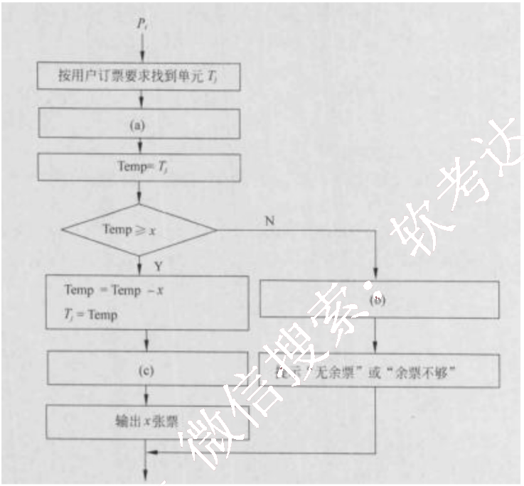

(1) A. 0
B. 1
C. 2
D. 3

(2) A. P(S) , V(S) 和 V(S)
B. P(S) , P(S) 和 V(S)
C. V(S) , P(S) 和 P(S)
D. V(S) , V(S) 和 P(S)

【答案】B A

**考点**：§1 操作系统—PV操作

【解析】本题考查 PV 操作方面的基本知识。

试题(1)的正确答案是 B，因为公共数据单元是一个临界资源，最多允许 1 个终端进程使用，因此需要设置一个互斥信号量 S，初值等于 1。

试题(2)的正确答案是 A，因为进入临界区时执行 P 操作，退出临界区时执行 V 操作。

### 3-4.

## 第 3-4 题：[§1 操作系统—存储管理]

假设系统采用段式存储管理方法，进程 P 的段表如下所示。逻辑地址 (3) 不能转换为对应的物理地址；不能转换为对应的物理地址的原因是进行 (4)。

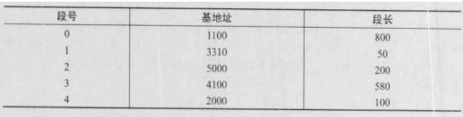

(3) A. (0, 790) 和 (2, 88)
B. (1, 30) 和 (3, 290)
C. (2, 88) 和 (4, 98)
D. (0, 810) 和 (4, 120)

(4) A. 除法运算时除数为零
B. 算术运算时有溢出
C. 逻辑地址到物理地址转换时地址越界
D. 物理地址到逻辑地址转换时地址越界

【答案】D C

**考点**：§1 操作系统—存储管理

【解析】
给定段地址(x, y)，其中：x为段号，y为段内地址。将(x, y)转换为物理地址的方法是：根据段号;c 查段表—判断段长；如果小于段长，则物理地址=基地址-段内地址 y，否则地址越界。

试题(3)正确的选项为D，试题(4)正确的选项为C。因为段地址(0, 810)中，0段的段长为800，段内地址810大于段长，故地址越界。段地址(4, 120)中，4段的段长为100，段内地址120大于段长，故地址越界。

### 5.

## 第 5 题：[§5 数据库—事务处理]

若系统中存在n个等待事务Ti（i=0,1,2，…，n-1），其中：T0正等待被T1锁住的数据项A1，T1正等待被T2锁住的数据项A2，…，Ti正等待被Ti+1锁住的数据项Ai+1，…，Tn-1正等待被T0锁住的数据项A0，则系统处于 (5) 状态。

(5) A. 封锁
B. 死锁
C. 循环
D. 并发处理

【答案】B

**考点**：§5 数据库—事务处理

【解析】本题考查关系数据库事务处理方面的基础知识。

与操作系统一样，封锁的方法可能引起活锁和死锁。例如事务T1封锁了数据R，事务了T2请求封锁R，于是T2等待。T3也请求封锁R，当T1释放了R上的封锁之后系统首先批准了T3的请求，T2仍然等待。然后T4又请求封锁R，当：T3释放R上的封锁后系统又批准了T4的请求，……T2有可能长期等待，这就是活锁。避免活锁的简单方法是采用先来先服务的策略。即让封锁子系统按请求封锁的先后次序对事务排队。数据R上的锁一旦释放就批准申请队列中的第一个事务获得锁。

又如事务T1封锁了数据R1，T2封锁了数据R2，T3封锁了数据R3。然后T1又请求封锁R2，T2请求封锁R3，T3请求封锁R1。于是出现T1等待T2释放R2上的封锁，T2等待T3释放R3上的封锁，T3等待T1释放R1上的封锁。这就使得三个事务永远不能结束。即多个事务都请求封锁别的事务已封锁的数据，导致无法运行下去的现象称为死锁。

### 6.

## 第 6 题：[§5 数据库—分布式数据库透明性]

在分布式数据库中包括分片透明、复制透明、位置透明和逻辑透明等基本概念，其中：（6）是指局部数据模型透明，即用户或应用程序无需知道局部场地使用的是哪种数据模型。

(6) A. 分片透明
B. 复制透明
C. 位置透明
D. 逻辑透明

【答案】D

**考点**：§5 数据库—分布式数据库透明性

【解析】本题考查对分布式数据库基本概念的理解。

分片透明是指用户或应用程序不需要知道逻辑上访问的表具体是怎么分块存储的。复制透明是指采用复制技术的分布方法，用户不需要知道数据是复制到哪些节点，如何复制的。位置透明是指用户无须知道数据存放的物理位置，逻辑透明，即局部数据模型透明，是指用户或应用程序无须知道局部场地使用的是哪种数据模型。

### 7-8.

## 第 7-8 题：[§5 数据库—关系运算]

若关系R、S如下图所示，则关系R与S进行自然连接运算后的元组个数和属性列数分别为（7）；关系代数表达式 $\pi_{1,4}(\sigma_{3=6}(R \times S))$ 与关系代数表达式（8）等价。

(7) A. 6 和 6
B. 4 和 6
C. 3 和 6
D. 3 和 4

(8) A. $\pi$ A, D ($\sigma$ C=D $(R \times S)$)
B. $\pi$ A, R, D ($\sigma$ S. C=R. D $(R \times S)$)
C. $\pi$ A, R, D ($\sigma$ R. C=S. D $(R \times S)$)
D. $\pi$ A, R, D ($\sigma$ S. C=S. D $(R \times S)$)

【答案】D C

**考点**：§5 数据库—关系运算

【解析】本题考查关系运算方面的基础知识。

(7) 根据自然连接要求，两个关系中进行比较的分量必须是相同的属性组，并且在结果中将重复属性列去掉，故R ⨯ S 后的属性列数为4。同时，自然连接是一种特殊的等值连接，即关系中的C、D属性与S关系中的C、D属性进行等值连接，然后去掉复属性列，其

结果为：

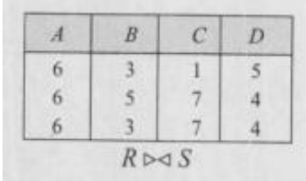

可见 $R \triangleright \triangleleft$ 后的元组个数为 3。因此试题(7)的正确答案是 D。

(8) 关系代数表达式 $\pi\ 1.4(\ \sigma\ 3=6(R \times S))$ 中，$R \times S$ 的 6 个属性列为：R.A、R.B、R.C、R.D、S.C 和 S.D，$\sigma\ 3=6(R \times S)$ 表示 R 与 S 关系进行笛卡尔积运算后，选取第三个属性 R.C 等于第六个属性 S.D 的元组；$\pi\ 1.4(\ \sigma\ 3=6(R \times S))$ 表示从 $\sigma\ 3=6(R \times S)$ 的结果中投影第一个和第四个属性列，即投影 R.A 和 R.D 属性列，因此试题(8)的正确答案是 C。

### 9.

## 第 9 题：[§1 嵌入式—板级支持包BSP]

在嵌入式操作系统中，板级支持包 BSP 作为对硬件的抽象，实现了 (9)。

(9) A. 硬件无关性，操作系统无关性
B. 硬件有关性，操作系统有关性
C. 硬件无关性，操作系统有关性
D. 硬件有关性，操作系统无关性

【答案】D

**考点**：§1 嵌入式—板级支持包BSP

【解析】本题考查嵌入式系统的基础知识。

在嵌入式系统中，板级支持包 Board Support Package(简称 BSP) 是对硬件抽象层的实现，是介于主板的硬件和操作系统驱动程序之间的一层，为整个软件系统提供底层硬件支持，是介于底层硬件和上层软件之间的底层软件开发包，它主要的功能是给上层提供统一接口，同时屏蔽各种硬件底层的差异，以及提供操作系统的驱动及硬件驱动。简单地说，就是 BSP 包含了所有与硬件有关的代码，为操作系统提供了硬件平台无关性。

### 10.

## 第 10 题：[§1 嵌入式—操作系统特点]

以下描述中，(10) 不是嵌入式操作系统的特点。

(10) A. 面向应用，可以进行裁剪和移植
B. 用于特定领域，不需要支持多任务
C. 可靠性高，无需人工干预独立运行，并处理各类事件和故障
D. 要求编码体积小，能够在嵌入式系统的有效存储空间内运行

【答案】B

**考点**：§1 嵌入式—操作系统特点

【解析】本题考查嵌入式系统的基础知识。

嵌入式操作系统是应用于嵌入式系统，实现软硬件资源的分配，任务调度，控制、协调

并发活动等的操作系统软件。它除了具有一般操作系统最基本的功能如多任务调度、同步机制等之外，通常还会具备以下适用于嵌入式系统的特性：面向应用，可以进行检查和移植，以支持开放性和可伸缩性的体系结构；强实时性，以适应各种控制设备及系统；硬件适用性，对于不同硬件平台提供有效的支持并实现统一的设备驱动接高可靠性，运行时无须用户过多干预，并处理各类事件和故障；编码体积小，通常会固化在嵌入式系统有限的存储单元中。

### 11.

## 第 11 题：[§1 嵌入式—可移植性]

嵌入式软件设计需要考虑 (11) 以保障软件良好的可移植性。

(11) A. 先进性
B. 易用性
C. 硬件无关性
D. 可靠性

【答案】C

**考点**：§1 嵌入式—可移植性

【解析】本题考查嵌入式系统的基础知识。

嵌入式系统的软件设计除了需要考虑一般软件设计的基本要求之外，通常都会要求嵌入式系统软件具有良好的可移植性，以实现对不同硬件平台的适用性，这就要求基于硬件抽象层的系统软件设计特性实现对上层软件的统一接口，做到硬件无关性。

### 12.

## 第 12 题：[§1 计算机系统—基础知识]

下列说法中正确的是 (12)。

(12) A. 半双工总线只在一个方向上传输信息，全双工总线可在两个方向上轮流传输信息
B. 半双工总线只在一个方向上传输信息，全双工总线可在两个方向上同时传输信息
C. 半双工总线可在两个方向上轮流传输信息，全双工总线可在两个方向上同时传输信息
D. 半双工总线可在两个方向上同时传输信息，全双工总线可在两个方向上轮流传输信息

【答案】C

**考点**：§1 计算机系统—基础知识

【解析】本题考查计算机系统的基础知识。

对端到端通信总线的信号传输方向与方式的分类定义如下：

单工是指A只能发信号，而B只能接收信号，通信是单向的。

半双工是指A能发信号给B，B也能发信号给A，但这两个过程不能同时进行。

全双工比半双工又进了一步，在A给B发信号的同时，B也可以给A发信号，这两个过程可以同时进行互不影响。

假如有3块容量是80G的硬盘做RAID 5阵列，则这个RAID 5的容量是 (13)；而如果

### 13-14.

## 第 13-14 题：[§1 存储系统—RAID]

有 2 块 80G 的盘和 1 块 40G 的盘，此时 RAID 5 的容量是 (14)。

(13) A. 240G  B. 160G  C. 80G  D. 40G

(14) A. 40G  B. 80G  C. 160G  D. 200G

【答案】B B

**考点**：§1 存储系统—RAID

【解析】本题考查 RAID 的基础概念。

RAID 是英文 Redundant Arrayof Independent Disks 的缩写，中文简称为独立冗余磁盘阵列。简单地说，RAID 是一种把多块独立的硬盘（物理硬盘）按不同的方式组合起来形成一个硬盘组（逻辑硬盘），从而提供比单个硬盘更高的存储性能和提供数据备份技术。组成磁盘阵列的不同方式称为 RAID 级别（RAID Levels）。在用户看起来，组成的磁盘组就像是一个硬盘，用户可以对它进行分区，格式化等。总之，对磁盘阵列的操作与单个硬盘一模一样。不同的是，磁盘阵列的存储速度要比单个硬盘高很多，而且可以提供自动数据备份。数据备份的功能是在用户数据一旦发生损坏后，利用备份信息可以使损坏数据得以恢复，从而保障了用户数据的安全性。RAID 技术分为几种不同的等级，分别可以提供不同的速度，安全性和性价比。根据实际情况选择适当的 RAID 级别可以满足用户对存储系统可用性、性能和容量的要求。常用的 RAID 级别有以下几种：NRAID，JBOD，RAID0，RAID1，RAID1+0，RAID3，RAID5 等。目前经常使用的是 RAID5 和 RAID(1+0)。如果使用物理硬盘容量不相等的硬盘做RAID，那么创建的 RAID 阵列的总容量为较小的硬盘的计算方式。

RAID5 的存储机制是两块存数据，一块存另外两块硬盘的交易校验结果。RAID5 的建立后，坏掉一块硬盘，可以通过另外两块硬盘的数据算出第三块的，所以至少要 3 块。RAID5是一种旋转奇偶校验独立存取的阵列方式，它与 RAID3，RAID4 不同的是没有固定的校验盘，而是按某种规则把奇偶校验信息均匀地分布在阵列所属的硬盘上，所以在每块硬盘上，既有数据信息也有校验信息。这一改变解决了争用校验盘的问题，使得在同一组内并发进行多个写操作。所以 RAID5 既适用于大数据量的操作，也适用于各种事务处理，它是一种快速、大容量和容错分布合理的磁盘阵列。当有 N 块阵列盘时，用户空间为 N-1 块盘容量。

根据以上原理，共有 3 块 80G 的硬盘做 RAID5，则总容量为 (3-1)×80=160G；如果有 2块 80G 的盘和 1 块 40G 的盘，则以较小的盘的容量为计算方式，总容量为 (3-1)×40=80G。

### 15.

## 第 15 题：[§1 网络—IPv6]

以下关于 IPv6 的论述中，正确的是 (15)。

(15) A. IPv6 数据包的首部比 IPv4 复杂  B. IPv6 的地址分为单播、广播和任意播 3 种
C. IPv6 的地址长度为 128 比特  D. 每个主机拥有唯一的 IPv6 地址

【答案】C

**考点**：§1 网络—IPv6

【解析】
IPv6 地址增加到 128 位，并且能够支持多级地址层次；地址自动配置功能简化了网络地址的管理；在组播地址中增加了范围字段，改进了组播路由的可伸缩性；增加的任意地址比 IPv4 中的广播地址更加实用。

IPv6 地址是一个或一组接口的标识符。IPv6 地址被分配到接口，而不是分配给结点。IPv6 地址有三种类型：
(1) 单播(Unicast)地址
(2) 任意播(AnyCast)地址
(3) 组播(Multicast)地址

在 IPv6 地址中，任何全“0”和全“1”字段都是合法的，除非特别排除的之外。特别是前缀可以包含“0”值字段，也可以用“0”作为终结字段。一个接口可以被赋予任何类型的多个地址(单播、任意播、组播)或地址范围。

与 IPv4 相比，IPv6 首部有下列改进：
- 分组头格式得到简化：IPv4 头中的很多字段被丢弃，IPv6 头中字段的数量从 12 个降到了 8 个，中间路由器必须处理的字段从 6 个降到了 4 个，这样就简化了路由器的处理过程，提高了路由选择的效率。
- 改进了对分组头部选项的支持：与 IPv4 不同，路由选项不再集成在分组头中，而是把扩展头作为任选项处理，仅在需要时才插入到 IPv6 头与负载之间。这种方式使得分组头的处理更灵活，也更流畅。以后如果需要，还可以很方便地定义新的扩展功能。
- 提供了流标记能力：IPv6 增加了流标记，可以按照发送端的要求对某些分组进行特别的处理，从而提供了特别的服务质量支持，简化了对多媒体信息的处理，可以更好地传送具有实时需求的应用数据。

### 16.

## 第 16 题：[§6 系统架构—架构风格与性能]

以下关于软件架构风格与系统性能的关系叙述中，错误的是_(16)_。

(16) A. 对于采用层次化架构风格的系统，划分的层次越多，系统的性能越差
B. 对于采用隐式调用架构风格的系统，可以通过处理函数的并发调用提高系统处理性能
C. 采用面向对象架构风格的系统，可以通过引入对象管理层提高系统性能
D. 对于采用解释器架构风格的系统，可以通过部分解释代码预先编译的方式提高系

统性能

【答案】C

**考点**：§6 系统架构—架构风格与性能

【解析】
采用面向对象架构风格的系统，可以通过引入对象管理层提高系统性能。

抽象数据类型概念对软件系统有重要作用，目前软件界已普遍转向使用面向对象系统。这种风格建立在数据抽象和面向对象的基础上，数据的表示方法和它们的相应操作封装在一个抽象数据类型或对象中。这种风格的构件是对象，或者说是抽象数据类型的实例。对象是一种被称作管理者的构件，因为它负责保持资源的完整性。对象是通过函数和过程的调用来交互的。可以通过减少功能调用层次提高系统性能。

### 17.

## 第 17 题：[§1 计算机系统—性能评测程序]

为了测试新系统的性能，用户必须依靠评价程序来评价机器的性能，以下四种评价程序，（17）评测的准确程度最低。

(17) A. 小型基准程序
B. 真实程序
C. 核心程序
D. 合成基准程序

【答案】D

**考点**：§1 计算机系统—性能评测程序

【解析】
相对于小型基准程序、真实程序和核心程序，用合成基准程序评测的准确程度最低。

### 18-19.

## 第 18-19 题：[§2 信息系统—信息化]

供应链中的信息流覆盖了从供应商、制造商到分销商，再到零售商等供应链中的所有环节，其信息流分为需求信息流和供应信息流，（18）属于需求信息流，（19）属于供应信息流。

(18) A. 库存记录
B. 生产计划
C. 商品入库单
D. 提货发运单

(19) A. 客户订单
B. 采购合同
C. 完工报告单
D. 销售报告

【答案】B C

**考点**：§2 信息系统—信息化

【解析】本题考查信息化方面的基础知识。

供应链中的信息流覆盖了从供应商、制造商到分销商，再到零售商等供应链中的所有环节，其信息流分为需求信息流和供应信息流，这是两个不同流向的信息流。当需求信息（如客户订单、生产计划和采购合同等）从需方向供方流动时，便引发物流。同时，供应信息（如入库单、完工报告单、库存记录、可供销售量和提货发运单等）又同物料一起沿着供应链从供方向需方流动。

### 20.

## 第 20 题：[§2 信息系统—电子政务]

电子政务的主要应用模式中不包括（20）。

(20) A. 政府对政府（Government To Government）
B. 政府对客户（Government To Customer）
C. 政府对公务员（Government To Employee）
D. 政府对企业（Government To Business）

【答案】C

**考点**：§2 信息系统—电子政务

【解析】本题考查电子政务的基础知识。

电子政务是政府机构应用现代信息和通信技术，将管理和服务通过网络技术进行集成，在因特网上实现政府组织结构和工作流程的优化重组，超越时间和空间及部门之间的分隔限制，向社会提供优质和全方位的、规范而透明的、符合国际水准的管理与服务。电子政务的主要模式有4种：(1) 政府对政府 (Government To Government)；(2) 政府对公务员(Government To Employee)；(3) 政府对企业 (Government To Business)；(4) 政府对公民(Government To Citizen)。

### 21.

## 第 21 题：[§2 信息系统—电子商务]

电子商务系统中参与电子商务活动的实体包括 (21)。

(21) A. 客户、商户、银行和认证中心
B. 客户、银行、商户和政府机构
C. 客户、商户、银行和物流企业
D. 客户、商户、政府和物流企业

【答案】A

**考点**：§2 信息系统—电子商务

【解析】本题考查电子商务方面的基础知识。

电子商务分五个方面，即电子商情广告、电子选购与交易、电子交易凭证的交换、电子支付与结算，以及网上售后服务等。参与电子商务的实体有4类：客户（个人消费者或集团购买）、商户（包括销售商、制造商和储运商）、银行（包括发行和收单行）及认证中心。

### 22-24.

## 第 22-24 题：[§2 信息系统—商业智能]

商业智能系统的处理过程包括四个主要阶段：数据预处理通过 (22) 实现企业原始数据的初步整合；建立数据仓库是后续数据处理的基础；数据分析是体现系统智能的关键，主要采用 (23) 和 (24) 技术，前者能够实现数据的上卷、下钻和旋转分析，后者利用隐藏的知识，通过建立分析模型预测企业未来发展趋势；数据展现主要完成数据处理结果的可视化。

(22) A. 数据映射和关联
B. 数据集市和数据立方体
C. 数据抽取、转换和装载
D. 数据清洗和数据集成

(23) A. 知识库
B. 数据挖掘
C. 联机事务处理
D. 联机分析处理

(24) A. 知识库
B. 数据挖掘
C. 联机事务处理
D. 联机分析处理

【答案】C D B

**考点**：§2 信息系统—商业智能

【解析】本题考查商业智能方面的基础知识。

商业智能系统的处理过程包括数据预处理、建立数据仓库、数据分析及数据展现4个主要阶段。数据预处理是整合企业原始数据的第一步，包括数据的抽取、转换和装载三个过程。建立数据仓库则是处理海量数据的基础。数据分析是体现系统智能的关键，一般采用OLAP和数据挖掘技术。联机分析处理不仅进行数据汇总/聚集，同时还提供切片、切块、下钻、上卷和旋转等数据分析功能，用户可以方便地对海量数据进行多维分析。数据挖掘的目标则是挖掘数据背后隐藏的知识，通过关联分析、聚类和分类等方法建立分析模型，预测企业未来发展趋势和将要面临的问题。在海量数据和分析手段增多的情况下，数据展现则主要保障系统分析结果的可视化。

### 25.

## 第 25 题：[§4 软件工程—项目范围管理]

关于项目范围管理描述，正确的是_(25)_。

(25) A. 项目范围是指信息系统产品或者服务所应包含的功能
B. 项目范围描述是产品范围说明书的重要组成部分
C. 项目范围定义是信息系统要求的度量
D. 项目范围定义是生产项目计划的基础

【答案】D

**考点**：§4 软件工程—项目范围管理

【解析】本题考查软件项目范围管理方面的基础知识。

项目范围是为了达到项目目标，为了交付具有某种特制的产品和服务，项目所规定要做的。在信息系统项目中，产品范围是指信息系统产品或者服务所应该包含的功能，项目范围是指为了能够交付信息系统项目所必须做的工作。产品范围是项目范围的基础，产品的范围定义是信息系统要求的度量，而项目范围的定义是生产项目计划的基础。产品范围描述是项目范围说明书的重要组成部分。

### 26.

## 第 26 题：[§4 软件工程—配置管理]

项目配置管理中，配置项的状态通常包括_(26)_。

(26) A. 草稿、正式发布和正在修改
B. 草稿、技术评审和正式发布
C. 草稿，评审或审批、正式发布
D. 草稿、正式发布和版本变更

【答案】A

**考点**：§4 软件工程—配置管理

【解析】本题考查软件项目配置管理方面的基础知识。

在配置管理中，所有的配置项都应列入版本控制的范畴。配置项的状态通常有3种，分

别是草稿、正式发布和正在修改。

### 27.

## 第 27 题：[§4 软件工程—需求陈述]

下列叙述中，不满足好的需求陈述要求的是 (27)。

(27) A. 每一项需求都必须完整、准确地描述即将要开发的功能
B. 需求必须能够在系统及其运行环境的能力和约束条件内实现
C. 每一项需求记录的功能都必须是用户的真正的需要
D. 所有需求都应被视为同等重要

【答案】D

**考点**：§4 软件工程—需求陈述

【解析】
理想情况下，每一项用户、业务需求和功能需求都应具备下列性质。

完整性。每一项需求都必须完整地描述即将交付使用的功能。它必须包含开发人员设计和实现这项功能需要的所有信息。

正确性。每一项需求都必须准确地描述将要开发的功能。判断正确性的参考是需求来源，如实际用户和高级的系统需求。如果一项软件需求与其相对应的系统需求发生冲突，这是不正确的。

可行性。需求必须能够在系统及其运行环境的已知能力和约束条件内实现。

必要性。每一项需求记录的功能都必须是用户的真正需要，或者是为符合外部系统需求或标准而必须具备的功能。每项需求都必须来源于有权定义需求的一方。对每项需求都必须追溯至特定的客户需求的来源，例如用例、业务规则或者其他来源。

有优先次序。为每一项功能需求、特性或用例指定一个实现优先级，以表明它在产品的某一版本中的重要程度。如果所有需求都被视为同等重要，项目经理就很难采取措施应对预算削减、进度拖后、人员流失或开发过程中需求增加等情况。

无歧义。一项需求声明对所有读者应该只有一种一致的解释，编写需求时应该使用用户所在领域的、简洁明了的语言。应该在词汇表中列出所有专用的和可能让用户感到迷惑的术语。

可验证性。如果某项需求不可验证，那么判定其实现的正确与否就成了主观臆断，而不是客观分析。不完备、不一致、不可行或有歧义的需求也是不可验证的。

一个大型软件系统的需求总是有变化的。为了降低项目开发的风险，需要一个好的变更控制过程。如下图所示的需求变更管理过程中，①②③处对应的内容应是 (28)；自动化工

### 28-29.

## 第 28-29 题：[§4 软件工程—变更管理]

具能够帮助变更控制过程更有效地运作，(29) 是这类工具应具有的特性之一。

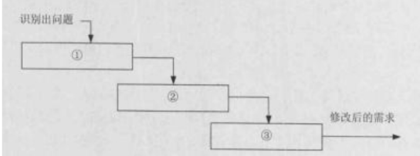

(28) A. 问题分析与变更描述，变更分析与成本计算，变更实现
B. 变更描述与变更分析，成本计算，变更实现
C. 问题分析与变更描述，变更分析，变更实现
D. 变更描述，变更分析，变更实现

(29) A. 自动维护系统的不同版本
B. 支持系统文档的自动更新
C. 自动判定变更是否能够实施
D. 记录每一个状态变更的日期及变更者

【答案】A D

**考点**：§4 软件工程—变更管理

【解析】
一个大型的软件系统的需求总是有变化的。对许多项目来说，系统软件总需要不断完善，一些需求的改进是合理的而且不可避免，要使得软件需求完全不变更，也许是不可能的，但毫无控制的变更是项目陷入混乱、不能按进度完成，或者软件质量无法保证的主要原因之一。一个好的变更控制过程，给项目风险承担者提供了正式的建议需求变更机制，可以通过变更控制过程来跟踪已建议变更的状态，使已建议的变更确保不会丢失或疏忽。需求变更管理过程如下图所示：

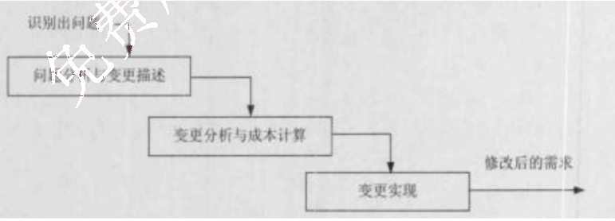

①问题分析和变更描述。这是识别和分析需求问题或者一份明确的变更提议，以检查它的有效性，从而产生一个更明确的需求变更提议。

②变更分析和成本计算。使用可追溯性信息和系统需求的一般知识，对需求变更提议进行影响分析和评估。变更成本计算应该包括对需求文档的修改、系统修改的设计和实现的成本。

一旦分析完成并且确认，应该进行是否执行这一变更的决策。

③变更实现。这要求需求文档和系统设计以及实现都要同时修改。如果先对系统的程序做变更，然后再修改需求文档，这几乎不可避免地会出现需求文档和程序的不一致。

自动化工具能够帮助变更控制过程更有效地运作。许多团队使用商业问题跟踪工具来收集、存储和管理需求变更。用这样的工具创建的最近提交的变更建议清单，可以用作CCB会议的议程。问题跟踪工具也可以随时按变更状态分类报告出变更请求的数目。

因为可用的工具、厂商和特性总在频繁地变化，所以这里无法给出有关工具的具体建议。但工具应该具有以下几个特性，以支持需求变更过程：
①可以定义变更请求中的数据项；
②可以定义变更请求生命周期的状态转换模型；
③可以强制实施状态转换模型，以便只有授权用户可以做出允许的状态变更；
④可以记录每一个状态变更的日期和做出这一变更的人；
⑤可以定义当提议者提交新请求或请求状态被更新时，哪些人可以自动接收电子邮件通知；
⑥可以生成标准的和定制的报告和图表。

有些商业需求管理工具内置有简单的变更建议系统。这些系统可以将提议的变更与某一特定的需求联系起来，这样无论什么时候，只要有人提交了一个相关的变更请求，负责需求的每个人都会收到电子邮件通知。

### 30.

## 第 30 题：[§4 软件工程—处理流程设计]

处理流程设计是系统设计的重要内容。以下关于处理流程设计工具的叙述中，不正确的是_(30)_。

(30) A. 程序流程图（PFD）用于描述系统中每个模块的输入，输出和数据加工
B. N-S图容易表示嵌套关系和层次关系，并具有强烈的结构化特征
C. IPO图的主体是处理过程说明，可以采用流程图、判定树/表等来进行描述
D. 问题分析图（PAD）包含5种基本控制结构，并允许递归使用

【答案】A

**考点**：§4 软件工程—处理流程设计

【解析】
在处理流程设计过程中，为了更清晰地表达过程规则说明，陆续出现了一些用于表示处理流程的工具，这些工具包括三类：图形工具、表格工具和语言工具。其中常见的图形工具包括程序流程图、IPO图、盒图、问题分析图、判定树，表格工具包括判定表，语言工具包括过程设计语言等。

程序流程图(Program How Diagram, PFD)用一些图框表示各种操作，它独立于任何一种程序设计语言，比较直观、清晰，易于学习掌握。流程图中只能包括5种基本控制结构：顺序型、选择型、WHILE循环型(当型循环)、UNTIL循环型(直到型循环)和多分支选择型。

IPO图是由IBM公司发起并逐步完善的一种流程描述工具，其主体是处理过程说明，可以采用流程图、判定树、判定表、盒图、问题分析图或过程设计语言来进行描述。IPO图中的输入、输出与功能模块、文件及系统外部项都需要通过数据字典来描述，同时需要为其中的某些元素添加注释。

N-S图与PFD类似，也包括5种控制结构，分别是顺序型、选择型、WHILE循环型(当型循环)、UNTIL循环型(直到型循环)和多分支选择型，任何一个N-S图都是这5种基本控制结构相互组合与嵌套的结果。在N-S图中，过程的作用域明确；它没有箭头，不能随意转移控制；而且容易表示嵌套关系和层次关系；并具有强烈的结构化特征。但是当问题很复杂时，N-S图可能很大。

问题分析图(Problem Analysis Diagram, PAD)是继PFD和N-S图之后，又一种描述详细设计的工具。PAD也包含5种基本控制结构，并允许递归使用。

过程设计语言(Process Design Language, PDL)也称为结构化语言或伪代码(pseudocode)，它是一种混合语言，采用自然语言的词汇和结构化程序设计语言的语法，用于描述处理过程怎么做，类似于编程语言。过程设计语言用于描述模块中算法和加工逻辑的具体细节，以便在开发人员之间比较精确地进行交流。

对于具有多个互相联系的条件和可能产生多种结果的问题，用结构化语言描述则显得不够直观和紧凑，这时可以用以清楚、简明为特征的判定表(Decision Table)来描述。判定表采用表格形式来表达逻辑判断问题，表格分成4个部分，左上部分为条件说明，左下部分为行动说明，右上部分为各种条件的组合说明，右下部分为各条件组合下相应的行动。

判定树(Decision Tree)也是用来表示逻辑判断问题的一种常用的图形工具，它用树来表达不同条件下的不同处理流程，比语言、表格的方式更为直观。判定树的左侧(称为树根)为加工名，中间是各种条件，所有的行动都列于最右侧。

### 31.

## 第 31 题：[§4 软件工程—UML用例]

用例(use case)用来描述系统对事件做出响应时所采取的行动。用例之间是具有相关性的。在一个会员管理系统中，会员注册时可以采用电话和邮件两种方式。用例“会员注册”和“电话注册”、“邮件注册”之间是 (31) 关系。

(31)A. 包含(include) B.扩展(extend) C.泛化(generalize) D.依赖(depends on)

【答案】C

**考点**：§4 软件工程—UML用例

【解析】
用例之间的关系主要有包含、扩展和泛化，利用这些关系，把一些公共的信息抽取出来，以便于复用，使得用例模型更易于维护。
①包含关系。当可以从两个或两个以上的用例中提取公共行为时，应该使用包含关系来表示它们。其中这个提取出来的公共用例称为抽象用例，而把原始用例称为基本用例或基础用例。
②扩展关系。如果一个用例明显地混合了两种或两种以上的不同场景，即根据情况可能发生多种分支，则可以将这个用例分为一个基本用例和一个或多个扩展用例，这样使描述可能更加清晰。
③泛化关系。当多个用例共同拥有一种类似的结构和行为的时候，可以将它们的共性抽象成为父用例，其他的用例作为泛化关系中的子用例。在用例的泛化关系中，子用例是父用例的一种特殊形式，子用例继承了父用例所有的结构、行为和关系。

### 32-33.

## 第 32-33 题：[§4 软件工程—面向对象设计]

某软件公司欲开发一个绘图软件，要求使用不同的绘图程序绘制不同的图形。在明确用户需求后，该公司的架构师决定采用Bridge模式实现该软件，并设计UML类图如下图所示。图中与Bridge模式中的“Abstraction”角色相对应的类是 (32)，与“Implementor”角色相对应的类是 (33)。

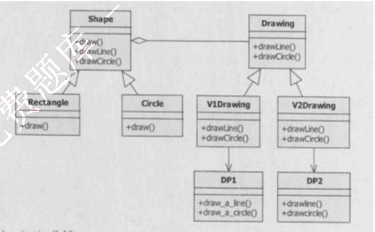

(32) A. Shape  B. Drawing  C. Rectangle  D. V2Drawing
(33) A. Shape  B. Drawing  C. Rectangle  D. V2Drawing

【答案】A B

**考点**：§4 软件工程—面向对象设计

【解析】

桥接模式将抽象部分与它的实现部分分离，使它们都可以独立地变化。它是一种对象结构型模式，又称为柄体(Handle and Body)模式或接口(Interface)模式。桥接模式类似于多重继承方案，但是多重继承方案往往违背了类的单一职责原则，其复用性比较差，桥接模式是比多重继承方案更好的解决方法。

桥接模式的结构如下图所示，其中：

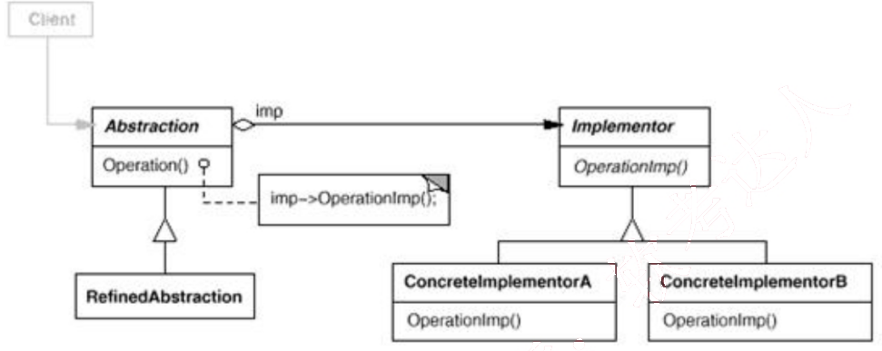

- Abstraction 定义抽象类的接口；维护一个指向 Implementor 类型对象的指针。
- RefinedAbstraction 扩充由 Abstraction 定义的接口。
- Implementor 定义实现类的接口，该接口不一定要与 Abstraction 的接口完全一致；事实上这两个接口可以完全不同。一般来说，Implementor 接口仅提供基本操作，而 Abstraction 则定义了基于这些基本操作的较高层次的操作。
- ConcreteImplementor 实现 Implementor 接口并定义它的具体实现。

图中与 Bridge 模式中的 “Abstraction” 角色相对应的类是 Shape，与 “Implementor” 角色相对应的类是 Drawing。

### 34-35.

## 第 34-35 题：[§4 软件工程—开发模型]

RUP 强调采用 (34) 的方式来开发软件，这样做的好处是 (35)。

(34) A. 原型和螺旋
B. 螺旋和增量
C. 迭代和增量
D. 快速和迭代

(35) A. 在软件开发的早期就可以对关键的，影响大的风险进行处理
B. 可以避免需求的变更
C. 能够非常快速地实现系统的所有需求
D. 能够更好地控制软件的质量

【答案】C A

**考点**：§4 软件工程—开发模型

【解析】

RUP 将项目管理、业务建模、分析与设计等统一起来，贯穿整个开发过程。RUP 中的软件过程在时间上被分解为 4 个顺序的阶段，分别是初始阶段、细化阶段、构建阶段和移交阶段。每个阶段结束时都要安排一次技术评审，以确定这个阶段的目标是否已经满足。如果评审结果令人满意，就可以允许项目进入下一个阶段。可以看出，基于 RUP 的软件过程是一个迭代和增量的过程。通过初始、细化、构建和移交 4 个阶段就是一个开发周期，每次经过这4 个阶段就会产生一代软件。除非产品退役，否则通过重复同样的 4 个阶段，产品将演化为下一代产品，但每一次的侧重点都将放在不同的阶段上。这样做的好处是在软件开发的早期就可以对关键的、影响大的风险进行处理。

### 36.

## 第 36 题：[§4 软件工程—依赖倒置原则]

在面向对象设计的原则中、(36) 原则是指抽象不应该依赖于细节，细节应该依赖于抽象，即应针对接口编程，而不是针对实现编程。

(36) A. 开闭
B. 里氏替换
C. 最少知识
D. 依赖倒置

【答案】D

**考点**：§4 软件工程—依赖倒置原则

【解析】

依赖倒置原则是指抽象不应该依赖于细节，细节应当依赖于抽象。换言之，要针对接口编程，而不是针对实现编程。在程序代码中传递参数时或在组合(或聚合)关系中，尽量引用层次高的抽象层类，即使用接口和抽象类进行变量类型声明、参数类型声明和方法返回类型声明，以及数据类型的转换等，而不要用具体类来做这些事情。为了确保该原则的应用，一个具体类应当只实现接口和抽象类中声明过的方法，而不要给出多余的方法，否则，将无法调用到在子类中增加的新方法。

实现开闭原则的关键是抽象化，并且从抽象化导出具体化实现，如果说开闭原则是 OOD的目标的话，那么依赖倒置原则就是 OOD 的主要机制。有了抽象层，可以使得系统具有很好的灵活性，在程序中尽量使用抽象层进行编程，而将具体类写在配置文件中，这样，如果系统行为发生变化，则只需要扩展抽象层，并修改配置文件，而无须修改原有系统的源代码，在不修改的情况下来扩展系统功能，满足开闭原则的要求。依赖倒置原则是 COM、CORBA、EJB、Spring 等技术和框架背后的基本原则之一。

### 37.

## 第 37 题：[§9 架构演化—遗留系统演化策略]

对于遗留系统的评价框架如下图所示，那么处于“高水平、低价值”区的遗留系统适合于采用的演化策略为 (37)。

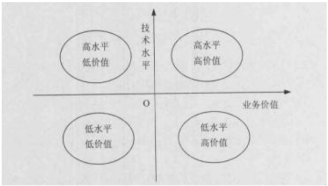

(37) A. 淘汰  B. 继承  C. 改造  D. 集成

【答案】D

**考点**：§9 架构演化—遗留系统演化策略

【解析】
把对遗留系统的评价结果分列在坐标的4个象限内。对处在不同象限的遗留系统采取不同的演化策略。

①淘汰策略。第四象限为低水平、低价值区，即遗留系统的技术含量较低，且具有较低的业务价值。对这种遗留系统的演化策略为淘汰，即全面重新开发新的系统以代替遗留系统。完全淘汰是一种极端性策略，一般是企业的业务产生了根本变化，遗留系统已经基本上不再适应企业运作的需要；或者是遗留系统的维护人员、维护文档资料都丢失了。经过评价，发现将遗留系统完全淘汰，开发全新的系统比改造旧系统从成本上考虑更合算。

②继承策略。第二象限为低水平、高价值区，即遗留系统的技术含量较低，已经满足企业运作的功能或性能要求，但具有较高的商业价值，目前企业的业务尚紧密依赖该系统。称这种遗留系统的演化策略为继承。在开发新系统时，需要完全兼容遗留系统的功能模型和数据模型。为了保证业务的连续性，新老系统必须并行运行一段时间，再逐渐切换到新系统上运行。

③改造策略。第一象限为高水平、高价值区，即遗留系统的技术含量较高，本身还有强大的生命力。系统具有较高的业务价值，基本上能够满足企业业务运作和决策支持的需要。这种系统可能建成的时间还很短，称这种遗留系统的演化策略为改造。改造包括系统功能的增强和数据模型的改造两个方面。系统功能的增强是指在原有系统的基础上增加新的应用要求，对遗留系统本身不做改变；数据模型的改造是指将遗留系统的旧的数据模型向新的数据模型的转化。

④集成策略。第三象限为高水平、低价值区，即遗留系统的技术含量较高，但其业务价值较

低，可能只完成某个部门（或子公司）的业务管理。这种系统在各自的局部领域里工作良好，但对于整个企业来说，存在多个这样的系统，不同的系统基于不同的平台、不同的数据模型，形成了一个个信息孤岛，对这种遗留系统的演化策略为集成。

### 38-39.

## 第 38-39 题：[§4 软件工程—测试类型]

__(38)__ 的目的是检查模块之间，以及模块和已集成的软件之间的接口关系，并验证已集成的软件是否符合设计要求。其测试的技术依据是__(39)__。

(38) A. 单元测试 B. 集成测试 C. 系统测试 D. 回归测试

(39) A. 软件详细设计说明书 B. 技术开发合同 C. 软件概要设计文档 D. 软件配置文档

【答案】B C

**考点**：§4 软件工程—测试类型

【解析】

根据国家标准 GB/T15532-2008，软件测试可分为单元测试、集成测试、配置项测试、系统测试、验收测试和回归测试等类别。

单元测试也称为模块测试，测试的对象是可独立编译或汇编的程序模块、软件构件或面向对象软件中的类（统称为模块），其目的是检查每个模块能否正确地实现设计说明中的功能、性能、接口和其他设计约束等条件，发现模块内可能存在的各种差错。单元测试的技术依据是软件详细设计说明书。

集成测试的目的是检查模块之间，以及模块和已集成的软件之间的接口关系，并验证已集成的软件是否符合设计要求。集成测试的技术依据是软件概要设计文档。

系统测试的对象是完整的、集成的计算机系统，系统测试的目的是在真实系统工作环境下，验证完整的软件配置项能否和系统正确连接，并满足系统/子系统设计文档和软件开发合同规定的要求。系统测试的技术依据是用户需求或开发合同。

配置项测试的对象是软件配置项，配置项测试的目的是检验软件配置项与软件需求规格说明的一致性。

确认测试主要验证软件的功能、性能和其他特性是否与用户需求一致。

验收测试是指针对软件需求规格说明，在交付前以用户为主进行的测试。

回归测试的目的是测试软件变更之后，变更部分的正确性和对变更需求的复合型，以及软件原有的、正确的功能、性能和其他规定的要求的不损害性。

软件架构风格是描述某一特定应用领域中系统组织方式的惯用模式。架构风格反映领域

### 40-41.

## 第 40-41 题：[§6 系统架构—架构风格]

中众多系统所共育的结构和（40），强调对架构（41）的重用。

(40) A. 语义特性 B. 功能需求 C. 质量属性 D. 业务规则

(41) A. 分析 B. 设计 C. 实现 D. 评估

【答案】A B

**考点**：§6 系统架构—架构风格

【解析】本题考查软件架构风格方面的基础知识。

软件架构设计的一个核心问题是能否使用重复的架构模式，即能否达到架构级的软件重用。也就是说，能否在不同的软件系统中，使用同一架构。基于这个目的，学者们开始研究和实践软件架构的风格和类型问题。软件架构风格是描述某一特定应用领域中系统组织方式的惯用模式。它反映了领域中众多系统所共有的结构和语义特性，并指导如何将各个模块和子系统有效地组织成一个完整的系统。按这种方式理解，软件架构风格定义了用于描述系统的术语表和一组指导构件系统的规则。

### 42.

## 第 42 题：[§6 系统架构—架构设计需求]

软件架构是降低成本、改进质量、按时和按需交付产品的关键因素。软件架构设计需满足系统的（42），如性能、安全性和可修改性等，并能够指导设计人员和实现人员的工作。

(42) A. 功能需求 B. 性能需求 C. 质量属性 D. 业务属性

【答案】C

**考点**：§6 系统架构—架构设计需求

【解析】本题考查软件架构设计方面的基础知识。

软件架构是降低成本、改进质量、按时和按需交付产品的关键因素，软件架构设计需要满足系统的质量属性，如性能、安全性和可修改性等，软件架构设计需要确定组件之间的依赖关系，支持项目计划和管理活动，软件架构能够指导设计人员和实现人员的工作。一般在设计软件架构之初，会根据用户需求，确定多个候选架构，并从中选择一个较优的架构，并随着软件的开发，对这个架构进行微调，以达到最佳效果。

### 43.

## 第 43 题：[§6 系统架构—架构描述语言]

架构描述语言（Architecture Description Language，ADL）是一种为明确说明软件系统的概念架构和对这些概念架构建模提供功能的语言。ADL 主要包括以下组成部分：组件、组件接口、（43）和架构配置。

(43) A. 架构风格 B. 架构实现 C. 连接件 D. 组件约束

【答案】C

**考点**：§6 系统架构—架构描述语言

【解析】本题考查架构描述语言的理解与掌握。

架构描述语言（Architecture Description Language，ADL）是一种为明确说明软件系统

的概念架构和对这些概念架构建模提供功能的语言。ADL 主要包括以下组成部分：组件、组件接口、连接件和架构配置。ADL 对连接件的重视成为区分 ADL 和其他建模语言的重要特征之一。

### 44-45.

## 第 44-45 题：[§6 系统架构—ABSD]

基于架构的软件开发(Architecture Based Software Development, ABSD)强调由商业、质量和功能需求的组合驱动软件架构设计。它强调采用 (44) 描述软件架构，用 (45) 来描述需求。

(44) A. 类图和序列图
B. 视角与视图
C. 构建和类图
D. 构建与功能

(45) A. 用例与类图
B. 用例与视角
C. 用例与质量场景
D. 视角与质量场景

【答案】B C

**考点**：§6 系统架构—ABSD

【解析】本题考查基于架构的软件开发方法的基础知识。

根据定义，基于软件架构的开发(Architecture Based Software Development, ABSD)强调由商业、质量和功能需求的组合驱动软件架构设计。它强调采用视角和视图来描述软件架构，采用用例和质量属性场景来描述需求。

### 46.

## 第 46 题：[§6 系统架构—架构风格选择]

某公司拟开发一个地面清洁机器人。机器人的控制者首先定义清洁任务和任务之间的关系，机器人接受任务后，需要响应外界环境中触发的一些突发事件，根据自身状态进行动态调整，最终自动完成任务。针对上述需求，该机器人应该采用 (46) 架构风格最为合适。

(46) A. 面向对象
B. 主程序-子程序
C. 规则系统
D. 管道-过滤器

【答案】C

**考点**：§6 系统架构—架构风格选择

【解析】本题考查架构风格与架构设计策略的理解与掌握。

根据题目描述，机器人需要根据自身状态的外界环境进行自动调整，这是一个典型的根据外部事件进行响应的场景。比较4个候选项，规则系统比较适合根据外部事件，以自身状态为基础自动进行处理和动作的场景。

### 47.

## 第 47 题：[§6 系统架构—架构风格选择]

某公司拟开发一个语音识别系统，其语音识别的主要过程包括分割原始语音信号、识别音素、产生候选词、判定语法片断、提供语义解释等，每个过程都需要进行基于先验知识的条件判断并进行相应的识别动作。针对该系统的特点，采用 (47) 架构风格最为合适。

(47) A. 解释器
B. 面向对象
C. 黑板
D. 隐式调用

【答案】C

**考点**：§6 系统架构—架构风格选择

【解析】本题考查架构风格与架构设计策略的理解与掌握。

根据题目描述，语音识别系统是一个十分典型的专家系统，其特点是求解的正确结果不止一个，求解过程比较复杂，需要通过专家知识和反馈逐步得到正确结果。因此对比4个候选项，黑板结构特别适合求解这类问题。

### 48.

## 第 48 题：[§6 系统架构—架构风格选择]

某公司拟开发了个轿车巡航定速系统，系统需要持续测量车辆当前的实时速度，并根据设定的期望速度启动控制轿车的油门和刹车。针对上述需求，采用(48)架构风格最为合适。

(48) A. 解释器 B. 过程控制 C. 分层 D. 管道-过滤器

【答案】B

**考点**：§6 系统架构—架构风格选择

【解析】本题考查架构风格与架构设计策略的理解与掌握。

根据题目描述，轿车巡航定速系统是一个十分典型的控制系统，其特点是不断采集系统当前状态，与系统中的设定状态进行对比，并通过将当前状态与设定状态进行对比从而进行控制。因此对比4个候选项，过程控制特别适合求解这类问题。

### 49.

## 第 49 题：[§6 系统架构—架构风格选择]

某公司拟开发一套在线游戏系统，该系统的设计目标之一是支持用户自行定义游戏对象属性，行为和对象之间的交互关系。为了实现上述目标，公司应该采用 (49) 架构风格最为合适。

(49) A. 管道-过滤器 B. 隐式调用 C. 主程序-子程序 D. 解释器

【答案】D

**考点**：§6 系统架构—架构风格选择

【解析】本题主要考查软件架构设计策略与架构风格的理解与掌握。

根据题干描述，该软件系统特别强调用户定义系统中对象的关系和行为这一特性，这需要在软件架构层面提供一种运行时的系统行为定义与改变的能力，根据常见架构风格的特点和适用环境，可以知道最合适的架构设计风格应该是解释器风格。

### 50.

## 第 50 题：[§6 系统架构—架构风格选择]

某公司为其研发的硬件产品设计实现了一种特定的编程语言，为了方便开发者进行软件开发，公司拟开发一套针对该编程语言的集成开发环境，包括代码编辑、语法高亮、代码编译、运行调试等功能。针对上述描述，该集成开发环境应采用 (50) 架构风格最为合适。

(50) A. 管道-过滤器 B. 数据仓储 C. 主程序-子程序 D. 解释器

【答案】B

**考点**：§6 系统架构—架构风格选择

【解析】本题主要考查软件架构设计策略与架构风格的理解与掌握。

根据题干描述，编程语言的集成开发环境需要提供代码编辑、语法高亮、代码编译、运行调试等功能，这些功能的特点是以软件代码为中心进行对应的编译处理与辅助操作。根据常见架构风格的特点和适用环境，可以知道最合适的架构设计风格应该是数据仓库风格。

### 51-52.

## 第 51-52 题：[§6 系统架构—架构设计过程]

软件架构设计包括提出架构模型，产生架构设计和进行设计评审等活动，是一个迭代的过程。架构设计主要关注软件组件的结构、属性和 (51)，并通过多种 (52) 全面描述特定系统的架构。

(51) A. 实现方式  B. 交互作用  C. 设计方案  D. 测试方式
(52) A. 对象  B. 代码  C. 文档  D. 视图

【答案】B D

**考点**：§6 系统架构—架构设计过程

【解析】本题主要考查软件架构设计过程的基础知识。

软件架构设计包括提出架构模型、产生架构设计和进行设计评审等活动，是一个迭代的过程。架构设计主要关注软件组件的结构、属性和交互作用，并通过多种视图全面描述特定系统的架构。

### 53-55.

## 第 53-55 题：[§6 系统架构—DSSA]

特定领域软件架构（Domain Specific Software Architecture, DSSA）以一个特定问题领域为对象，形成由领域参考模型，参考需求，(53) 等组成的开发基础架构，支持一个特定领域中多个应用的生成。DSSA 的基本活动包括领域分析、领域设计和领域实现。其中领域分析的主要目的是获得 (54)，从而描述领域中系统之间共同的需求，即领域需求；领域设计的主要目标是获得 (55)，从而描述领域模型中表示需求的解决方案；领域实现的主要目标是开发和组织可重用信息，并实现基础软件架构。

(53) A. 参考设计  B. 参考规约  C. 参考架构  D. 参考实现
(54) A. 领域边界  B. 领域信息  C. 领域对象  D. 领域模型
(55) A. 特点领域软件需求  B. 特定领域软件架构
C. 特定领域软件设计模型  D. 特定领域软件重用模型

【答案】C D B

**考点**：§6 系统架构—DSSA

【解析】

特定领域软件架构(Domain Specific Software Architecture, DSSA)以一个特定问题领域为对象，形成由领域参考模型、参考需求、参考架构等组成的开发基础架构，其目标是

支持一个特定领域中多个应用的生成。DSSA 的基本活动包括领域分析、领域设计和领域实现。其中领域分析的主要目的是获得领域模型，领域模型描述领域中系统之间共同的需求，即领域需求；领域设计的主要目标是获得 DSSA，DSSA 描述领域模型中表示需求的解决方案；领域实现的主要目标是依据领域模型和 DSSA 开发和组织可重用信息，并对基础软件架构进行实现。

### 56-61.

## 第 56-61 题：[§7 质量属性与评估—质量属性与策略]

某公司欲开发一个网上商城系统，在架构设计阶段，公司的架构师识别出3个核心质量属性场景，其中“系统主站断电后，能够在2分钟内自动切换到备用站点，并恢复正常运行”主要与 (56) 质量属性相关，通常可采用 (57) 架构策略实现该属性；“在并发用户数不超过 1000 人时，用户的交易请求应该在 0.5s 内完成”主要与 (58) 质量属性相关通常可采用(59) 架构策略实现该属性；“系统应该能够抵挡恶意用户的入侵行为，并进行报警和记录”主要与 (60) 质量属性相关，通常可采用 (61) 架构策略实现该属性。

(56) A. 性能  B. 可用性  C. 易用性  D. 可修改性

(57) A. 主动冗余  B. 信息隐藏  C. 抽象接口  D. 记录/回放

(58) A. 可测试性  B. 易用性  C. 性能  D. 互操作性

(59) A. 操作串行化  B. 资源调度  C. 心跳  D. 内置监控器

(60) A. 可用性  B. 安全性  C. 可测试性  D. 可修改性

(61) A. 内置监控器  B. 记录/回放  C. 追踪审计  D. 维护现有接口

【答案】B A C B B C

**考点**：§7 质量属性与评估—质量属性与策略

【解析】本题主要考查考生对质量属性的理解和质量属性实现策略的掌握。

对于题干描述：“系统主站断电后，能够在2分钟内自动切换到备用站点，并恢复正常运行”主要与可用性质量属性相关，通常可采用心跳、Ping/Echo、主动冗余、被动冗余、选举等架构策略实现该属性；“在并发用户数不超过 1000 人时，用户的交易请求应该在 0.5s内完成”，主要与性能这一质量属性相关，实现该属性的常见架构策略包括：增加计算资源、减少计算开销、引入并发机制、采用资源调度等。“系统应该能够抵挡恶意用户的入侵行为，并进行报警和记录”主要与安全性质量属性相关，通常可采用入侵检测、用户认证、用户授权、追踪审计等架构策略实现该属性。

架构权衡分析方法(Architecture Tradeoff Analysis Method, ATAM) 是在基于场景的架构分析方法（Scenarios-based Architecture Analysis Method, SAAM）基础之上发展起

来的，主要包括场景和需求收集、(62)，属性模型构造和分析，属性模型折中等四个阶段。

### 62-63.

## 第 62-63 题：[§7 质量属性与评估—ATAM]

ATAM 方法要求在系统开发之前，首先对这些质量属性进行 (63) 和折中。

(62) A. 架构视图和场景实现
B. 架构风格和场景分析
C. 架构设计和目标分析
D. 架构描述和需求评估

(63) A. 设计
B. 实现
C. 测试
D. 评价

【答案】A D

**考点**：§7 质量属性与评估—ATAM

【解析】本题主要考查考生对架构权衡分析方法(Architecture Tradeoff Analysis Method, ATAM) 的掌握和理解。

ATAM 是在基于场景的架构分析方法(Scenarios-based Architecture Analysis Method, SAAM)基础之上发展起来的，主要包括场景和需求收集、架构视图和场景实现、属性模型构造和分析、属性模型折中等4个阶段。ATAM方法要求在系统开发之前，首先对这些质量属性进行评价和折中。

### 64.

## 第 64 题：[§11 标准化与知识产权—委托开发著作权]

用户提出需求并提供经费，委托软件公司开发软件。双方商定的协议（委托开发合同）中未涉及软件著作权归属，其软件著作权应由 (64) 享有。

(64) A. 用户
B. 用户、软件公司共有
C. 软件公司
D. 经裁决所确认的一方

【答案】C

**考点**：§11 标准化与知识产权—委托开发著作权

【解析】

委托开发软件著作权关系的建立，通常由委托方与受委托方订立合同而成立。委托开发软件关系中，委托方的责任主要是提供资金、设备等物质条件，并不直接参与开发软件的创作开发活动。受托方的主要责任是根据委托合同规定的目标开发出符合条件的软件。关于委托开发软件著作权的归属，《计算机软件保护条例》第十二条规定：“受他人委托开发的软件，其著作权的归属由委托者与受委托者签定书面协议约定，如无书面协议或者在协议中未作明确约定，其著作权属于受委托者”。根据该条的规定，软件公司应享有软件著作权。通常，确定委托开发的软件著作权的归属应当掌握两点：

一是委托开发软件系根据委托方的要求，由委托方与受托方以合同确定的权利和义务的关系而进行开发的软件，因此软件著作权归属应当作为合同的重要条款予以明确约定。对于当事人已经在合同中约定软件著作权归属关系的，如事后发生纠纷，软件著作权的归属仍应当根据委托开发软件的合同来确定。

二是在委托开发软件活动中，委托者与受委托者没有签定书面协议，或者在协议中未

对软件著作权归属作出明确的约定，其软件著作权属于受委托者，即属于实际完成软件的开发者。

### 65.

## 第 65 题：[§11 标准化与知识产权—著作权归属]

某摄影家创作一件摄影作品出版后，将原件出售给了某软件设计师。软件设计师不慎将原件毁坏；则该件摄影作品的著作权 (65) 享有。

(65) A. 仍然由摄影家
B. 由摄影家和软件设计师共同
C. 由软件设计师
D. 由摄影家或软件设计师申请的一方

【答案】A

**考点**：§11 标准化与知识产权—著作权归属

【解析】本题考查知识产权基本知识。

摄影家将其摄影作品原件出售时不涉及著作权，这件摄影作品的著作权仍属于摄影家。这是因为摄影家将摄影作品庖件出售时，只是将其摄影作品原件(作品物)的物权转让，并未涉及著作权转让，摄影作品原件的转移不等于摄影作品著作权的转移。所以这件摄影作品的著作权仍属于摄影家。

摄影作品的原件可以买卖、赠予。然而，获得一件摄影作品并不意味着获得该作品的著作权。我国著作权法第18条规定：“美术等作品原件所有权的转移。不视为作品著作权的转移，但美术作品原件的展览权由原件所有人享有。”这就是说作品物转移的事实并不引起作品著作权的转移，受让人只是取得物的所有权和作品原件的展览权，作品的著作权仍然由作者等著作权人享有。除了美术作品之外，对任何原件所有权可能转移的作品，都要注意区分作品物质载体的财产权和作品的著作权这两种不同的权利。

该摄影作品出版后，原件不慎毁坏，摄影家仍享有该摄影作品的著作权。这是因为，该摄影作品原件的灭失，不等于摄影作品著作权的丧失，也就是说，著作权的存在，不以作品原件物质载体的存在为前提，而是依据法定的保护期。

### 66.

## 第 66 题：[§11 标准化与知识产权—职务作品]

软件设计师王某在其公司的某一综合信息管理系统软件开发项目中、承担了大部分程序设计工作。该系统交付用户，投入试运行后，王某辞职离开公司，并带走了该综合信息管理系统的源程序，拒不交还公司。王某认为综合信息管理系统源是他独立完成的，他是综合信息管理系统源程序的软件著作权人。王某的行为 (66)。

(66) A. 侵犯了公司的软件著作权
B. 未侵犯公司的软件著作权
C. 侵犯了公司的商业秘密权
D. 不涉及侵犯公司的软件著作权

【答案】A

**考点**：§11 标准化与知识产权—职务作品

【解析】本题考查知识产权基本知识。

《计算机软件保护条例》第13条规定“自然人在法人或者其他组织中任职期间所开发的软件有下列情形之一的，该软件著作权由该法人或者其他组织享有，该法人或者其他组织可以对开发软件的自然人进行奖励：
(一)针对本职工作中明确指定的开发目标所开发的软件；
(二)开发的软件是从事本职工作活动所预见的结果或者自然的结果；
(三)主要使用了法人或者其他组织的资金、专用设备、未公开的专门信息等物质技术条件所开发并由法人或者其他组织承担责任的软件。

根据《计算机软件保护条例》规定，可以得出这样的结论，当公民作为某单位的职工时，如果其开发的软件属于执行本职工作的结果，该软件著作权应当归单位享有。而单位可以给予开发软件的职工奖励。需要注意的是，奖励软件开发者并不是单位的一种法定义务，软件开发者不可援引《计算机软件保护条例》强迫单位对自己进行奖励。

王某作为公司的职员，完成的某一综合信息管理系统软件是针对其本职工作中明确指定的开发目标而开发的软件。该软件应为职务作品，并属于特殊职务作品。公司对该软件享有除署名权外的软件著作权的其他权利，而王某只享有署名权。王某持有该软件源程序不归还公司的行为，妨碍了公司正常行使软件著作权，构成对公司软件著作权的侵犯，应承担停止侵权责任，即交还软件源程序。

某高校欲构建财务系统，使得用户可通过校园网访问该系统。根据需求，公司给出如下2套方案。

方案一：
1) 出口设备采用一台配置防火墙板卡的核心交换机，并且使用防火墙策略将需要对校园网做应用的服务器进行地址映射；
2) 采用4台高性能服务器实现整体架构，其中3台作为财务应用服务器、1台作为数据备份管理服务器；
3) 通过备份管理软件的备份策略将3台财务应用服务器的数据进行定期备份。

方案二：
1) 出口设备采用1台配置防火墙板卡的核心交换机，并且使用防火墙策略将需要对校园网做应用的服务器进行地址映射；
2) 采用2台高性能服务器实现整体架构，服务器采用虚拟化技术，建多个虚拟机满足财

务系统业务需求。当一台服务器出现物理故障时将业务迁移到另外一台物理服务器上。

### 67-68.

## 第 67-68 题：[§3 信息安全—网络与数据安全]

与方案一相比，方案二的优点是(67)。方案二还有一些缺点，下列不属于其缺点的是(68)。

(67) A. 网络的安全性得到保障
B. 数据的安全性得到保障
C. 业务的连续性得到保障
D. 业务的可用性得到保障

(68) A. 缺少企业级磁盘阵列，不能将数据进行统一的存储与管理
B. 缺少网闸，不能实现财务系统与Internet的物理隔离
C. 缺少安全审计，不便于相关行为的记录、存储与分析
D. 缺少内部财务用户接口，不便于快速管理与维护

【答案】C B

**考点**：§3 信息安全—网络与数据安全

【解析】本题考查网络规划与设计案例。

与方案一相比，方案二服务器采用虚拟化技术，当一台服务器出现物理故障时将业务迁移到另外一台物理服务器上，保障了业务的连续性。网络的安全性、数据的安全性、业务的可用性都没有发生实质性变化。

当然方案二还有一些缺陷，首先缺少将数据进行统一的存储与管理的企业级磁盘阵列；其次缺少安全审计，不便于相关行为的记录、存储与分析；而且缺少内部财务用户接口，不便于快速管理与维护。但是如果加网闸，就不能实现对财务系统的访问，不能实现用户可通过校园网对财务系统的访问。

甲、乙、丙、丁4人加工A、B、C、D四种工件所需工时如下表所示。指派每人加工一种工件，四人加工四种工件其总工时最短的最优方案中，工件B应由(69)加工。

### 69.

## 第 69 题：[§12 应用数学—运筹学]

<table>
  <tr>
    <th></th>
    <th>A</th>
    <th>B</th>
    <th>C</th>
    <th>D</th>
  </tr>
  <tr>
    <th>甲</th>
    <td>14</td>
    <td>9</td>
    <td>4</td>
    <td>15</td>
  </tr>
  <tr>
    <th>乙</th>
    <td>11</td>
    <td>7</td>
    <td>7</td>
    <td>10</td>
  </tr>
  <tr>
    <th>丙</th>
    <td>13</td>
    <td>2</td>
    <td>10</td>
    <td>5</td>
  </tr>
  <tr>
    <th>丁</th>
    <td>17</td>
    <td>9</td>
    <td>15</td>
    <td>13</td>
  </tr>
</table>

(69) A. 甲
B. 乙
C. 丙
D. 丁

【答案】D

**考点**：§12 应用数学—运筹学

【解析】本题考查数学(运筹学)应用的能力。

本题属于指派问题：要求在4×4矩阵中找出四个元素，分别位于不同行，不同列，使其和达到最小值。

显然，任一行(或列)各元素都减(或加)一常数后，并不会影响最优解的位置，只是目标

值（指派方案的各项总和）也减（或加）了这一常数。

我们可以利用这一性质使矩阵更多的元素变成0，其他元素保持正，以利于求解。

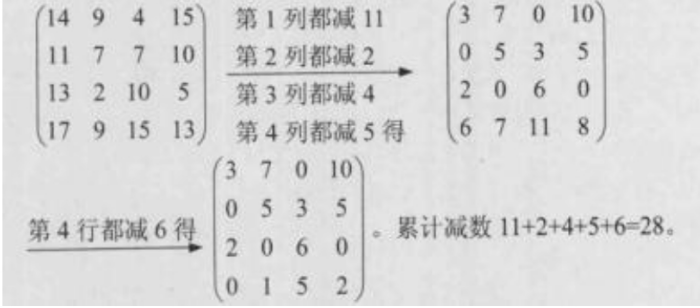

对该矩阵，并不存在全0指派。位于$(1,3)$、$(2,1)$、$(3,4)$、$(4,2)$的元素之和为1是最小的。因此，分配甲、乙、丙、丁分别加工C、A、D、B能达到最少的总工时28+1=29。更进一步，再在第三行上都加1，在第2、4列上都减1，可得到更多的0元素：

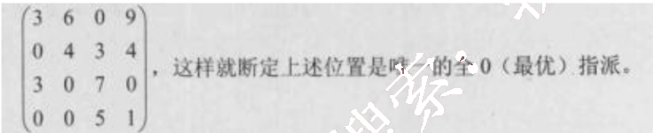

本题也可用试验法解决，但比较烦琐，需要仔细，不要遗漏。

### 70.

## 第 70 题：[§12 应用数学—概率]

小王需要从①地开车到⑦地，可供选择的路线如下图所示。图中，各条箭线表示路段及其行驶方向，箭线旁标注的数字表示该路段的拥堵率（描述堵车的情况，即堵车概率）。拥堵率=1-畅通率，拥堵率=0时表示完全畅通，拥堵率=1时表示无法行驶。根据该图，小王选择拥堵情况最少（畅通情况最好）的路线是 (70)。

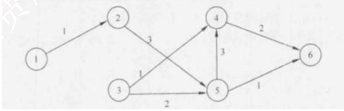

(70) A. ①②③④⑤⑦
B. ①②③④⑥⑦
C. ①②③⑤⑦
D. ①②④⑥⑦

【答案】C

**考点**：§12 应用数学—概率

【解析】本题考查数学（概率）应用的能力。

首先将路段上的拥堵率转换成畅通率如下图：

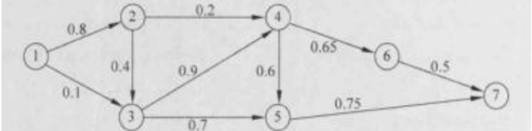

每一条路线上的畅通率等于所有各段畅通率之乘积。两点之间的畅通率等于两点之间所有可能路线畅通率的最大值。以下用 T(ijk...) 表示从点 i 出发，经过点 j、k... 等的路线的畅通率。

据此原则，可以从①开始逐步计算到达各点的最优路线。

T (①②) =0.8；对应路线①②

T (①③) =max (0.1, 0.8×0.4)=0.32；对应路线①②③

T (①④) =max (0.8×0.2, 0.32×0.9)=0.288；对应路线①②③④

T (①⑤) =max (0.32×0.7, 0.288×0.6)=0.224；对应路线①②③⑤

T (①⑥) =0.224×0.65=0.1456；对应路线①②③⑥

T (①⑦) =max (0.1456×0.5, 0.224×0.75)=0.168。对应路线①②③⑤⑦

结论：小王应选择路线①②③⑤⑦，该线路有最好的畅通率 0.168，或最小的拥堵率0.832。

### 71-75.

## 第 71-75 题：[§13 专业英语—阅读]

he objective of (71) is to determine what parts of the application software will be assigned to what hardware. The major software components of the system being developed have to be identified and then allocated to the various hardware components on which the system will operate. All software systems can be divided into four basic functions. The first is (72). Most information systems require data to be stored and retrieved, whether a small file, such as a memo produced by a word processor, or a large database, such as one that stores an organization’s accounting records. The second function is the (73), the processing required to access data, which often means database queries in Structured Query Language. The third function is the (74), which is the logic documented in the DFDs, use cases, and functional requirements. The fourth function is the presentation logic, the display of information to the user and the acceptance of the user’s commands. The three primary hardware components of a system are (75).

(71) A. architecture design  B. modular design
C. physical design  D. distribution design

(72) A. data access components  B. database management system
C. data storage  D. data entities

(73) A. data persistence  B. data access objects
C. database connection  D. dataaccess logic

(74) A. system requirements  B. system architecture
C. application logic  D. application program

(75) A. computers, cables and network  B. clients, servers, and network
C. CPUs, memories and I/O devices  D. CPUs, hard disks and I/O devices

【答案】A C D C C

**考点**：§13 专业英语—阅读

【解析】
架构设计的目标是确定应用软件的哪些部分将被分配到何种硬件。识别出正在开发系统的主要软件构件并分配到系统将要运行的硬件构件。所有软件系统可分为四项基本功能。第一项是数据存储。大多数信息系统需要数据进行存储并检索，无论是一个小文件，比如一个字处理器产生的一个备忘录，还是一个大型数据库，比如存储一个企业会计记录的数据库。第二项功能是数据访问逻辑，处理过程需要访问数据，这通常是指用SQL进行数据库查询。第三项功能是应用程序逻辑，这些逻辑通过数据流图，月例和功能需求来记录。第四项功能是表示逻辑，给用户显示信息并接收用户命令。一个系统的三类主要硬件构件是客户机、服务器和网络。
