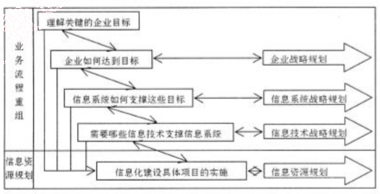

# 2012 年下半年 系统架构设计师 · 论文真题

> 试题一至四任选 1 道；含题干、小问与参考要点
>
> **来源**：本地购买扫描件《2012 年下半年系统架构设计师 答案详解》（贡献者已购买并授权转录）
> **来源类型**：`real`
> **解析方式**：byted-las-document-parse（normal 模式）+ 机械清洗，已剔除页眉、广告条与页码
> **答案与解析**：取自随卷答案详解，非本仓库编写
> **使用建议**：可用于章节训练与年份模考；关键数字建议对照原始 PDF 复核
> **完整性**：综合知识 75 题、案例分析 5 题、论文 4 题齐备

## 试题一：论基于架构的软件设计方法及应用

基于架构的软件设计（Architecture-Based Software Design, ABSD）方法以构成软件架构的商业、质量和功能需求等要素来驱动整个软件开发过程。ABSD 是一个自顶向下，递归细化的软件开发方法，它以软件系统功能的分解为基础，通过选择架构风格实现质量和商业需求，并强调在架构设计过程中使用软件架构模板。采用 ABSD 方法，设计活动可以从项目总体功能框架明确后就开始，因此该方法特别适用于开发一些不能预先决定所有需求的软件系统，如软件产品线系统或长生命周期系统等，也可为需求不能在短时间内明确的软件项目提供指导。

请围绕“基于架构的软件开发方法及应用”论题，依次从以下三个方面进行论述。

1. 概要叙述你参与开发的、采用 ABSD 方法的软件项目以及你在其中所承担的主要工作。
2. 结合项目实际，详细说明采用 ABSD 方法进行软件开发时，需要经历哪些开发阶段？每个阶段包括哪些主要活动？
3. 阐述你在软件开发的过程中都遇到了哪些实际问题及解决方法。

一、论文中要具体介绍项目的背景与总体需求、系统所采用的技术路线以及你所承担的实际工作。

二、采用 ABSD 方法进行软件开发时，需要经历架构需求、架构设计、架构文档化、架构复审、架构实现和架构演化六个阶段。

1. 架构需求阶段需要明确用户对目标软件系统在功能、行为、性能、设计约束等方面的期望。其主要活动包括需求获取、标识构件和架构评审。
(1) 需求获取活动需要定义开发人员必须实现的软件功能，使得用户能够完成他们的任务，从而满足功能需求。与此同时，还要获得软件质量属性，满足一些非功能性需求。
(2) 标识构件活动首先需要获得系统的基本结构，然后对基本结构进行分组，最后将基本结构进行打包成构件。
(3) 架构需求评审活动组织一个由系统涉众（用户、系统分析师、架构师、设计实现人员等）组成的小组，对架构需求及相关构件进行审查。审查的主要内容包括所获取的需求是否真实反映了用户需求，构件合并是否合理等。

2. 架构设计阶段是一个迭代过程，利用架构需求生成并调整架构决策。主要活动包括提出架构模型、将已标识的构件映射到架构中、分析构件之间的相互作用、产生系统架构和架构设计评审。

3. 架构文档化的主要活动是对架构设计进行分析与整理，生成架构规格说明书和测试架构需求的质量设计说明书。

4. 在一个主版本的软件架构分析之后，需要安排一次由外部人员（客户代表和领域专家）参加的架构复审。架构复审需要评价架构是否能够满足需求，质量属性需求是否在架构中得以体现、层次是否清晰、构件划分是否合理等。从而标识潜在的风险，及早发现架构设计中的缺陷和错误。

5. 架构实现主要是对架构进行实现的过程，主要活动包括架构分析与设计、构件实现、构件组装和系统测试。

6. 架构演化阶段主要解决用户在系统开发过程中发生的需求变更问题。主要活动包括架构演化计划、构件变动、更新构件的相互作用、构件的组装与测试和技术评审。

三、在软件开发的过程中可能遇到的问题包括：在架构需求获取过程中如何对捕获的架构需求进行筛选和优先级排序；在架构复审过程中如何解决评审人员的意见不一致问题；在架构实现过程中如何根据项目组实际情况选择开发语言与开发平台；在架构演化过程中如何筛选并处理用户的需求变更，等等。

## 试题二：论企业应用系统的数据持久层架构设计

数据持久层（Data Persistence Layer）通常位于企业应用系统的业务逻辑层和数据源层之间，为整个项目提供一个高层、统一、安全、并发的数据持久机制，完成对各种数据进行持久化的编程工作，并为系统业务逻辑层提供服务。它能够使程序员避免手工编写访问数据源的方法，使其专注于业务逻辑的开发，并且能够在不同项目中重用本框架，这大大简化了数据的增加、删除、修改、查询功能的开发过程，同时又不丧失多层结构的天然优势，继承延续应用系统架构的可伸缩性和可扩展性。当运用关系型数据库作为数据存储机制时，在业务层与数据源间加入数据持久层，能够解决对象与关系的“阻抗不匹配”问题，将对象的状态持久化存储到关系型数据库中。

请围绕“企业应用系统的数据持久层架构设计”论题，依次从以下三方面进行论述。

1. 概要叙述你参与分析和设计的企业应用系统开发项目以及你所担任的主要工作。

2. 分析在企业应用系统的数据持久层架构设计中有哪些数据访问模式，并详细阐述每种数据访问模式的主要内容。

3. 数据持久层架构设计的好坏决定着应用程序性能的优劣，请结合实际说明在数据持久层架构设计中需要考虑哪些问题。

简要描述所参与分析和设计的企业应用系统开发项目，并明确指出在其中承担的主要任务和开展的主要工作。

二、分析在企业应用系统的数据持久层架构设计中有哪些数据访问模式，并详细阐述每种数据访问模式的主要内容。

企业应用系统的数据持久层架构设计中主要有五种数据访问模式：

（1）在线访问（Online Access）。OA是最基本的数据访问模式，也是在实际开发过程中最常采用的。这种数据访问模式会占用一个数据库连接，读取数据，每个数据库操作都会通过这个连接不断地与后台的数据源进行交互。

（2）数据访问对象（Data Access Object）。DAO模式是标准的J2EE设计模式之一，开发人员常常用这种模式将底层数据访问操作与高层业务逻辑分离开。一个典型的DAO实现通常包括：一个DAO工程类；一个DAO接口；一个实现了DAO接口的具体类，包含访问特殊数据源中数据的逻辑；数据传输对象。

（3）数据传输对象（Data Transfer Object）。DTO 是经典 EJB 设计模式之一，它本身是一组对象或者数据的容器，需要跨越不同的进程或者网络的边界来传输数据。对象本身应该不包含具体的业务逻辑，并且通常这些对象内部职能进行一些诸如内部一致性检查和基本验证之类的方法，而且这些方法最好不要再调用其他的对象行为。在具体实现 DTO 时，可以使用编程语言内置的集合对象，也可以通过创建自定义类来实现 DTO 对象。

（4）离线数据模型（Off-line Data Model）。ODM 以数据为中心，数据从数据源获取之后，将按照某种预定义的结构存放在系统中，成为应用的中心。离线方式可以使得对数据的各种操作独立于各种与后台数据源之间的连接或者事务；通过与 XML 集成数据可以方便地与 XML 格式的文档之间相互转换；独立于数据源，ODM 定义了数据的存储结构和规则。

（5）对象关系映射（Object Relational Mapping）。ORM 是随着面向对象软件开发方法发展而产生的，面向对象开发方法是主流的开发方法，关系型数据库是企业级应用环境中永久存放数据的主流数据存储系统。对象和关系数据是业务实体的两种表现形式，业务实体在内存中表现为对象，在数据库中表现为关系数据。ORM 一般以中间件的形式存在，能够帮助将应用程序中的数据转换成关系型数据库中的记录；或者将关系数据库中的记录转换成应用程序中便于操作的对象。

三、数据持久层架构设计的好坏决定着应用程序性能的优劣，无论在 C/S，还是在 B/S 结构中，持久层在处理数据的同时，对服务器锁的类型和持续时间、输入输出活动量以及处理器负荷等产生主要影响，并由此影响应用程序的总体性能。在持久层设计阶段需要考虑的问题包括：网络流量问题；返回结果集的问题；查询或锁定超时的问题；应用程序开发工具的问题；使用游标的问题；应用层设计的问题等。

## 试题三：论决策支持系统的开发与应用

决策支持系统（Decision Support Systems，DSS）是以管理科学、运筹学、控制论和行为科学为基础，以计算机技术、仿真技术和信息技术为手段，以人机交互方式进行半结构化和非结构化决策的信息系统。它调用各种信息资源，并提供各种分析工具，为决策者提供分析问题、建立模型、模拟决策过程和方案的环境，帮助决策者提高决策水平和质量。决策支持系统在许多领域得到了广泛的应用，已成为许多行业经营管理中一个不可缺少的现代化支持工具。

请围绕“决策支持系统的开发与应用”论题，依次从以下三个方面进行论述。
1. 概要叙述你参与管理和开发的决策支持系统项目以及在其中所担任的主要工作。
2. 简要叙述决策支持系统包含的典型组成部件及对应的基本功能。说明在建立决策支持系统时需解决的一般关键问题。
3. 说明你所参与管理和开发的决策支持系统的应用场合以及对决策结果的要求，具体阐述在开发过程中所采用的关键技术、实施过程和实际应用的效果。

简要叙述所参与管理和开发的决策支持系统项目，并明确指出在其中承担的主要任务和开展的主要工作。

二、决策支持系统包括如下典型组件：
(1) 接口部分，即输入/输出的界面，是人机交互的窗口。
(2) 模型管理子系统，具有存储、动态建模的功能。目前模型管理的实现是通过模型库系统来完成的。
(3) 知识管理子系统，集中管理决策问题领域的知识（规则和事实），包括知识的获取、表达、管理等功能。
(4) 数据管理子系统，DSS 的数据库通常包括在数据仓库中。数据仓库是集成的、面向主题的数据库集合。数据仓库通常从内部和外部数据源中抽取。内部数据主要来自于组织的交易处理系统。外部数据包括行业数据、市场调查数据等。
(5) 用户，用户可看作系统的一部分。DSS 的用户主要是企业各层次的管理者和商业分析人员。

在建立决策支持系统时，主要有以下几个关键问题：
1. 建立数据仓库系统

数据仓库系统必须为决策支持的分析处理提供以下服务：
(1) 根据主题需要，从 OLTP 数据库中抽取分析用的数据。为此在抽取过程中要对原始数据进行分类、求和、统计等处理，抽取的过程实际上是数据的再组织。
(2) 在抽取过程中，完成数据净化，即去掉不合格的原始数据，必要时还必须对缺损的数据加以补充。
(3) 在改变分析决策的主题时，可以按主题进行数据查询和访问。
(4) 采用多级存储模式，解决数据量巨大及按照主题、粒度划分的数据组织问题。

2. 模型、方法和知识管理系统

采用数据仓库和多维数据库技术的数据管理子系统将数据进行整理（预处理）和净化之后，形成可靠的易于进行决策的“数据源”（即数据仓库或多维数据库），这个“数据源”的结构与形式和决策支持系统所采用的模型与知识有关。决策粗略地分为结构化决策支持、非结构化决策支持、半结构化决策支持。一个较好的决策支持系统必须完成这三方面的决策支持。

模型、方法和知识的管理是决策支持系统的核心，它对依据问题建立的模型库、方法库和知识库进行管理。
(1) 对模型库、方法库和知识库进行维护。模型、方法和知识管理系统必须有对三库的维护界面；可根据问题的需要对模型、方法和知识库进行增加、删除和修改，并保证三库的一致性：一是系统运行过程调用每个库时不发生矛盾，特别是对知识库的维护更为复杂；二是每种模型、方法和知识都能调用到。
(2) 模型、方法和知识管理系统根据用户的要求和数据仓库提供的数据，能有效地选择模型、方法和知识，经系统运行得到相应的结果，并将结果送给交互环境进行输出。

智能决策支持系统一般是在模型、方法和知识管理系统的基础上增加专家系统和数据采据与知识发现技术。

智能决策支持系统（Intelligence Decision Support System，IDSS）的主要任务包括：
(1) 分析和识别问题；
(2) 描述决策问题和决策知识；
(3) 形成候选的决策方案（目标、规划、方法和途径等）；
(4) 构造决策问题的求解模型（如数学模型、运筹学模型、程序模型、经验模型等）；
(5) 建立评价决策问题的各种准则（如价值准则、科学准则、效益准则等）；
(6) 多方案、多目标、多准则情况下的比较和优化；

(7) 综合分析，包括决策结果或方案对实际问题可能产生的作用和影响的分析，以及各种环境因素、变量对决策方案或结果的影响程序分析等。

3. 用户交互环境

用户交互环境是决策者或决策部门与决策支持系统打交道的界面，它负责接收用户发出的各种命令，根据这些命令调用不同的子系统，并获得处理结果，最后再将这些结果输出给用户。交互环境的好坏直接影响着用户对系统的使用。一个好的交互环境，其输入应当简单、易学、易用。其输出应当做到内容丰富、形式活泼。

三、考生需结合自身参与项目的实际状况，指出其参与管理和开发的决策支持系统的应用行业或领域，选择一个关键问题说明其设计、实现的具体过程、方法以及对实际应用效果的分析。

## 试题四：论企业信息化规划的实施与应用

企业信息化建设是一项长期而艰巨的任务，不可能在短时间内完成。信息化规划是企业信息化建设的纲领和向导，是信息系统设计和实施的前提和依据。信息化规划以整个企业的发展目标和战略、企业各部门的目标与功能为基础，同时结合行业信息化方面的实践和对信息技术发展趋势的掌握，制定出企业信息化远景、目标和发展战略，从而达到全面、系统地指导企业信息化建设的目的。

请围绕“企业信息化规划的实施与应用”论题，依次从以下三个方面进行论述。

1. 概要叙述你参与的企业信息化规划项目以及你在其中所担任的主要工作。

2. 简要叙述企业信息化规划的主要内容。结合你参与的项目的实际情况，详细分析有关企业的信息化规划目标及规划的具体内容。

3. 说明你所参与实施的企业信息化规划的步骤及效果，介绍其是否达到了预期的目标并分析原因。

一、简要叙述所参与管理和开发的企业信息化规划项目，并明确指出在其中承担的主要任务和开展的主要工作。

二、企业信息化规划的内容

企业信息化规划不仅涉及到信息系统规划，同时与企业规划、业务流程建模等紧密相关，是融合企业战略、管理规划、业务流程重组等内容的“业务+管理+技术”的规划活动，如下图所示。

涉及到业务流程重组和信息资源规划、信息技术战略规划、信息系统战略规划和企业战略规划等多个领域。所有的规划都应该围绕企业关键目标的实现而展开，并为企业目标的实现提

供支持和必须的服务。

进行信息化规划时，需要做好以下几个方面的工作：

(1) 明确发展目标和实施重点。

(2) 成立领导机构。

(3) 做好企业业务信息化需求分析。

(4) 确定企业信息化不同发展阶段的投资预算。

(5) 制定必要的促进企业信息化建设的规章制度。

三、结合实际项目，详细阐述企业信息化规划的目标和实施重点，对于企业业务信息化需求分析应进行重点论述。说明企业信息化规划的实施过程，总结实施效果并进行进一步的分析。
