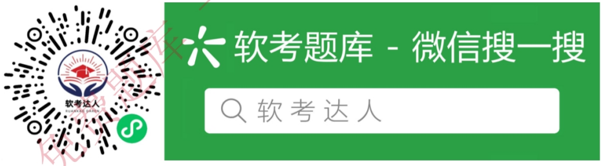

# 2015 年下半年 系统架构设计师 · 论文真题

> 试题一至四任选 1 道；含题干、小问与参考要点
>
> **来源**：本地购买扫描件《2015 年下半年系统架构设计师 答案详解》（贡献者已购买并授权转录）
> **来源类型**：`real`
> **解析方式**：byted-las-document-parse（normal 模式）+ 机械清洗，已剔除页眉、广告条与页码
> **答案与解析**：取自随卷答案详解，非本仓库编写
> **使用建议**：可用于章节训练与年份模考；关键数字建议对照原始 PDF 复核
> **完整性**：综合知识 75 题、案例分析 5 题、论文 4 题齐备

## 试题一：论应用服务器基础软件

应用服务器是在当今基于互联网的企业级应用迅速发展，电子商务应用出现并快速膨胀的需求下产生的一种新技术。在分布式、多层结构及基于组件和服务器端程序设计的企业级应用开发中，应用服务器提供的是一个开发、部署、运行和管理、维护的平台，提供软件“集群”功能，可以让多个不同的异构服务器协同工作、相互备份，以满足企业级应用所需要的高可用性、高性能、高可靠性和可伸缩性等实际需求。应用服务器技术的出现，能够加快应用的开发速度，减少应用的开发量。通过隔离底层细节，便于商业逻辑的实现与扩展，同时也为企业应用提供现成的、稳定的、灵活的、成熟的基础架构。

请以“应用服务器基础软件”为题，依次从以下三个方面进行论述：
1. 概要叙述你参与分析和开发的软件系统开发项目以及你所担任的主要工作。
2. 论述并分析应用服务器在软件设计、开发、部署、运行和管理阶段，应该提供哪些核心功能？
3. 详细说明你所参与的软件系统开发项目，采用了哪种应用服务器，在软件开发、部署和运行阶段，具体实施效果如何。

写作要点：
一、简要描述所参与分析和开发的软件系统开发项目，并明确指出在其中承担的主要任务和开展的主要工作。
二、论述和分析应用服务器应该具备的核心功能。

应用服务器是应用设计、开发、部署、运行、管理、维护的平台。应用服务器既是应用开发的平台，包括表示层、应用层和数据层的设计模式和编程环境；同时又是多层结构应用的部署、运行平台，对多层结构应用进行配置、启动、监控、调整，并在开发的不同阶段提供不同的功能。
1. 设计阶段，应用服务器完成底层通信、服务，并屏蔽掉复杂的底层技术细节，向用户提供结构简单、功能完善的编程接口，让用户可以专心于商务逻辑的设计。
2. 开发阶段，应用服务器提供了完全开放的编程语言和应用接口，同时也提供快速开发的工具和手段，帮助用户提高开发效率。
3. 部署阶段，应用服务器提供了对多种网络环境的支持，帮助用户在复杂的网络环境中配置系统参数，发挥系统最大性能。

4. 运行阶段，应用服务器基于开发技术标准，提供了系统的运行环境，提供了系统的名字解析、路由选择、负载平衡、事务控制等服务，并提供系统容错、修赏、迁移、升级扩展等功能。

5. 管理阶段，应用服务器提供图形化界面来管理整个系统的资源，而且系统在运行期间也能动态监控和管理。

三、针对作者实际参与的软件系统开发项目，说明所采用的应用服务器，并描述该应用服务器在开发、部署和运行阶段的实际应用效果。

## 试题二：论软件系统架构风格

系统架构风格（System Architecture Style）是描述某一特定应用领域中系统组织方式的惯用模式。架构风格定义了一个词汇表和一组约束，词汇表中包含一些构件和连接件类型，而这组约束指出系统是如何将这些构件和连接件组合起来的。软件系统架构风格反映了领域中众多软件系统所共有的结构和语义特性，并指导如何将各个模块和子系统有效地组织成一个完整的系统。软件系统架构风格的共有部分可以使得不同系统共享同一个实现代码，系统能够按照常用的、规范化的方式来组织，便于不同设计者很容易地理解系统架构。

请以“软件系统架构风格”论题，依次从以下三个方面进行论述：
1. 概要叙述你参与分析和开发的软件系统开发项目以及你所担任的主要工作。
2. 分析软件系统开发中常用的软件系统架构风格有哪些？详细阐述每种风格的具体含义。
3. 详细说明在你所参与的软件系统开发项目中，采用了哪种软件系统架构风格，具体实施效果如何。

写作要点：
一、简要描述所参与分析和开发的软件系统开发项目，并明确指出在其中承担的主要任务和开展的主要工作。

二、分析在软件系统开发中常用的软件系统架构风格，详细阐述每种风格的具体含义。
软件系统开发中常用的软件系统架构风格主要包括：

1. 管道和过滤器风格
在管道/过滤器风格的软件体系结构中，每个构件都有一组输入和输出，构件读输入的数据流，经过内部处理，然后产生输出数据流。这个过程通常通过对输入流的变换及增量计算来完成，所以在输入被完全消费之前，输出便产生了。因此，这里的构件被称为过滤器，这种风格的连接件就像是数据流传输的管道，将一个过滤器的输出传到另一过滤器的输入。此风格特别重要的过滤器必须是独立的实体，它不能与其他的过滤器共享数据，而且一个过滤器不知道它上游和下游的标识。一个管道/过滤器网络输出的正确性并不依赖于过滤器进行增量计算过程的顺序。

2. 数据抽象和面向对象风格
抽象数据类型概念对软件系统有着重要作用，目前软件界已普遍转向使用面向对象系统。

这种风格建立在数据抽象和面向对象的基础上，数据的表示方法和它们的相应操作封装在一个抽象数据类型或对象中。这种风格的构件是对象，或者说是抽象数据类型的实例。对象是一种被称作管理者的构件，因为它负责保持资源的完整性。对象是通过函数和过程的调用来交互的。

3. 基于事件的隐式调用风格

基于事件的隐式调用风格的思想是构件不直接调用一个过程，而是触发或广播一个或多个事件。系统中的其他构件中的过程在一个或多个事件中注册，当一个事件被触发，系统自动调用在这个事件中注册的所有过程，这样，一个事件的触发就导致了另一模块中的过程的调用。基于事件的隐式调用风格的主要特点是事件的触发者并不知道哪些构件会被这些事件影响。这样不能假定构件的处理顺序，甚至不知道哪些过程会被调用，因此，许多隐式调用的系统也包含显式调用作为构件交互的补充形式。

4. 层次系统风格

层次系统组织成一个层次结构，每一层为上层服务，并作为下层客户。在一些层次系统中，除了一些精心挑选的输出函数外，内部的层只对相邻的层可见。这样的系统中构件在一些层实现了虚拟机（在另一些层次系统中层是部分不透明的）。连接件通过决定层间如何交互的协议来定义，拓扑约束包括对相邻层间交互的约束。这种风格支持基于可增加抽象层的设计。这样，允许将一个复杂问题分解成一个增量步骤序列的实现。由于每一层最多只影响两层，同时只要给相邻层提供相同的接口，允许每层用不同的方法实现，同样为软件重用提供了强大的支持。

5. 仓库风格

在仓库风格中，有两种不同的构件：中央数据结构说明当前状态，独立构件在中央数据存储上执行，仓库与构件间的相互作用在系统中会有大的变化。控制原则的选取产生两个主要的子类。若输入流中某类时间触发进程执行的选择，则仓库是一传统型数据库；另一方面，若中央数据结构的当前状态触发进程执行的选择，则仓库是一黑板系统。

6. C2 风格

C2 体系结构风格可以概括为：通过连接件绑定在一起的按照一组规则运作的并行构件网络。C2 风格中的系统组织规则如下：系统中的构件和连接件都有一个顶部和一个底部；构件的顶部应连接到某连接件的底部，构件的底部则应连接到某连接件的顶部，而构件与构件之间的直接连接是不允许的；一个连接件可以和任意数目的其他构件和连接件连接；当两个连接件进行直接连接时，必须由其中一个的底部到另一个的顶部。

三、针对作者实际参与的软件系统开发项目，说明所采用的软件架构风格，并描述该架构风格所产生的实际应用效果。

## 试题三：论面向服务的架构及其应用

面向服务的架构（Service-Oriented Architecture, SOA）是一种组件模型，把应用程序中的不同功能单元（即服务）通过这些服务之间定义良好的接口和契约联系起来，使得这些系统中的服务能够以一种统一和通用的方式进行交互。从应用角度看，SOA 是一种应用框架，它关注企业日常的业务应用，将其划分为单独的业务功能和流程，并抽象为服务，用户和系统开发人员可以构建、部署和整合这些服务，无需依赖特定的应用程序及应用平台，从而提高企业业务流程的灵活性。SOA 有助于实现更多的信息资产重用、更轻松地管理和更快地应用开发与部署。

请以“面向服务的架构及其应用”为题，依次从以下三个方面进行论述：
1. 概要叙述你参与实施的、基于面向服务架构的软件开发项目以及所担任的主要工作。
2. 指出 SOA 技术参考架构中都包含哪些服务类别，并对每类服务的定义和作用进行简要说明。
3. 详细阐述你的项目是如何以面向服务的架构为指导进行实施的，在实施过程中遇到了哪些问题，是如何解决的。

### 写作要点：
一、论文中要具体介绍组织的业务背景、组织结构、现有应用系统的分布、采用的技术等内容和担任的实际工作。

二、SOA 技术参考架构主要描述 SOA 基础技术平台与辅助工具，同时描述这两部分与其他外围相关元素之间的关系。SOA 技术参考架构将服务分为 6 类，具体描述如下：

1. 连接服务
连接服务又称连通服务，是面向服务架构的骨干，在完成服务的接入，服务间的通信和交互基础上，还提供安全性、可靠性、高性能的服务能力保障。连接服务的一个典型实现就是企业服务总线(Enterprise Service Bus，ESB)。

2. 协作服务
协作服务通常由通信代理和 Web 服务代理两部分组成。通信代理与连通服务中的通信代理实现内部有效的数据通信，Web 服务代理与外部的公共注册中心交互，注册本平台对外开放的 Web 服务以及查找所需要访问的外部 Web 服务。协作服务既可以实现组织之间(如供应链的合作伙伴之间)的交互通信，也可以实现组织内部(如跨地域的分支机构之间，并有防火

墙进行保护的情况)之间的交互通信。

3. 业务服务

业务服务指为新建服务提供的特定运行支持环境。新建服务包括单个服务以及合成服务，不包括流程化的服务。合成服务一般由应用编码实现，它可以调用其他的服务（包括：单个服务、合成服务和流程化的服务）。业务服务与连通服务相联接，其中的新建服务与其他服务的通信和交互通过连通服务来实现。业务服务的运行信息由运行管理服务保存，业务服务也接受并执行运行管理服务的管理和控制命令。

4. 业务流程服务

流程服务是业务流程的运行环境，提供流程驱动、服务调用、事务管理等功能。流程服务是为业务流程的运行提供的一组标准服务。业务流程是一组服务的集合，可以按照特定的顺序并使用一组特定的规则进行调用。业务流程可以由不同粒度的服务组成，其本身也可视为服务。

5. 交互服务

交互服务实现人与服务之间的交互功能。人可以是服务的消费者，也可以是服务的提供者。人不能直接消费服务，也不能直接提供服务，需要通过相应的程序实现代理操作（即人通过操作程序实现与服务的交互）。交互服务就是需要提供一组完整的功能，以实现人与服务的交互，并能够方便地进行交互。人员需要请求服务时，向连通服务发送消息请求，由连通服务查找服务，并将请求消息传递给服务提供者。

6. 信息服务

信息服务特指为上层应用系统、同层的其他服务等提供数据访问及资源访问服务。其目标是使应用系统能够统一、透明、高效地访问和操纵位于网络环境中的各种分布、异构的数据资源，为实现全局数据访问、加快应用开发、增强网络应用和方便系统管理提供支持。

三、考生需要详细描述所参与的项目是如何以面向服务的架构为指导思想进行实施的，包括如何发现服务、如何对服务进行分类等。可能存在的问题包括如何进行服务规约，包括候选服务的分类与选择，服务编排，服务库的设计等；如何实现服务，包括将服务的实现分配到相应的服务构件中，并决定服务的实现方式。

## 试题四：论企业集成平台的技术与应用

企业集成平台是一个支持复杂信息环境下信息系统开发、集成和协同运行的软件支撑环境。它基于各种企业经营业务的信息特征，在异构分布环境（操作系统、网络、数据库）下为应用提供一致的信息访问和交互手段，对其上运行的应用进行管理，为应用提供服务，并支持企业信息环境下各特定领域的应用系统的集成。企业集成平台的核心是企业集成架构，包括信息、过程、应用集成的架构。

请以“企业集成平台的技术与应用力”为题，依次从以下三个方面进行论述：
1. 概要叙述你参与管理和开发的企业集成平台相关的软件项目以及你在其中所担任的主要工作。
2. 简要说明企业集成平台的基本功能及企业集成的关键技术，并结合项目实际情况，阐述该项目所选择的关键技术及其原因。
3. 结合你具体参与管理和开发的实际项目，举例说明所采用的企业集成架构设计技术的具体实施方式及过程，并详细分析其实现效果。

写作要点：

一、简要叙述所参与管理和开发的软件项目，并明确指出在其中承担的主要任务和开展的主要工作。

二、企业集成平台的基本功能有：
1. 通信服务

提供分布环境下透明的同步/异步通信服务功能，使用户和应用程序无须关心具体的操作系统和应用程序所处的网络物理位置，而以透明的函数调用或对象服务方式完成它们所需的通信服务要求。

2. 信息集成服务

为应用提供透明的信息访问服务，通过实现异种数据库系统之间数据的交换、互操作、分布数据管理和共享信息模型定义（或共享信息数据库的建立），使集成平台上运行的应用、服务或用户端能够以一致的语义和接口实现对数据（数据库、数据文件、应用交互信息）的访问与控制。

3. 应用集成服务

通过高层应用编程接口来实现对相应应用程序的访问，这些高层应用编程接口包含在不

同的适配器或代理中，被用来连接不同的应用程序。这些接口以函数或对象服务的方式向平台的组件模型提供信息，使用户在无需对原有系统进行修改（不会影响原有系统的功能）的情况下，只要在原有系统的基础上加上相应的访问接口就可以将现有的、用不同的技术实现的系统互联起来，通过为应用提供数据交换和访问操作，使各种不同的系统能够相互协作。

4. 二次开发工具
是集成平台提供的一组帮助用户开发特定应用程序（如实现数据转换的适配器或应用封装服务等）的支持工具，其目的是简化用户在企业集成平台实施过程中（特定应用程序接口）的开发工作。

5. 平台运行管理工具
是企业集成平台的运行管理和控制模块，负责企业集成平台系统的静态和动态配置、集成平台应用运行管理和维护、事件管理和出错管理等。通过命名服务、目录服务、平台的动态静态配置，以及其中的关键数据的定期备份等功能来维护整个服务平台的系统配置及稳定运行。

企业集成的关键技术：
1. 数据交换格式

企业业务数据可以分为结构化数据（表单）和非结构化数据（文档），它们一般存储在不同数据库或文档管理系统中。企业数据集成中常用的几种数据交换格式如下。

(1) EDI（电子数据交换）。EDI 格式处理的目的是将在功效上与纸介质文件等同的电子表单用统一的（或标准的）格式进行表示，以保证各个独立开发的计算机应用之间能够实现表单数据共享与集成。

(2) XML。XML 是W3C 制定的一个面向各类信息的数据存储工具盒可配置载体的开放式标准，其目的是为了更好地使用 Web 应用的需求，解决 HTML 在表达能力、可扩展性和交互性等方面的缺陷。

(3) STEP。STEP 标准是一个描述如何表达和交换数字化产品信息的 ISO 标准，其目的是提供一种不依赖于具体系统的中性模型和机制，并将其用来描述整个生命周期内的产品数据。

(4) PDML。PDML 的技术目标是提供一种灵活的方法，使得不同应用软件系统中的产品数据能够进行交换。它是在 STEP 和 XML 基础上实现不同系统间产品数据交换和集成的一种新模式。

2. 分布式应用集成基础框架

比较有影响的主要有：

(1) CORBA。CORBA 是对象管理组织(OMG)为解决分布式处理环境中硬件和软件系统的互连而提出的一种标准的面向对象应用程序体系规范。

(2) COM+。

(3) JavaEE。

(4) WebService。

(对于实际采用的关键技术，应结合项目实际情况，说明选择这种/这些技术的原因)

三、考生需结合自身参与项目的实际状况，指出其参与管理和开发的项目是如何应用所选择的关键技术进行企业集成架构的设计与实现的，说明具体的实施过程、方式方法和工具，并对实现效果进行分析。

