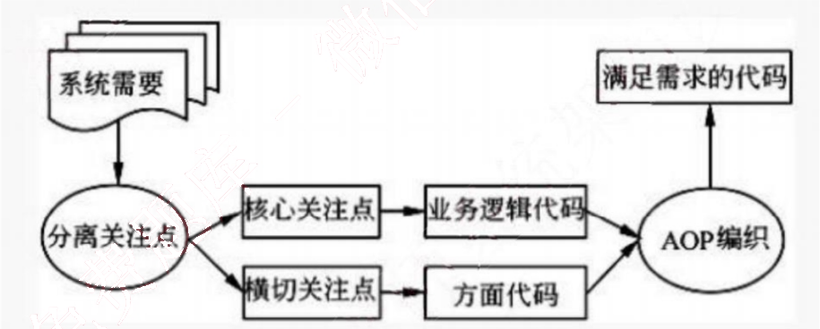
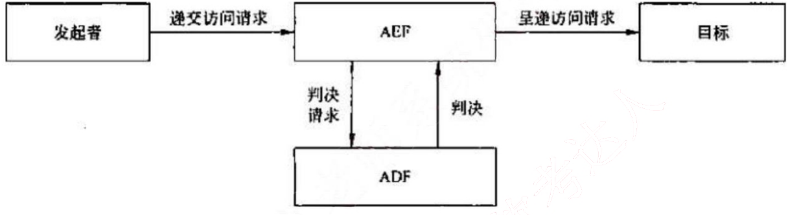
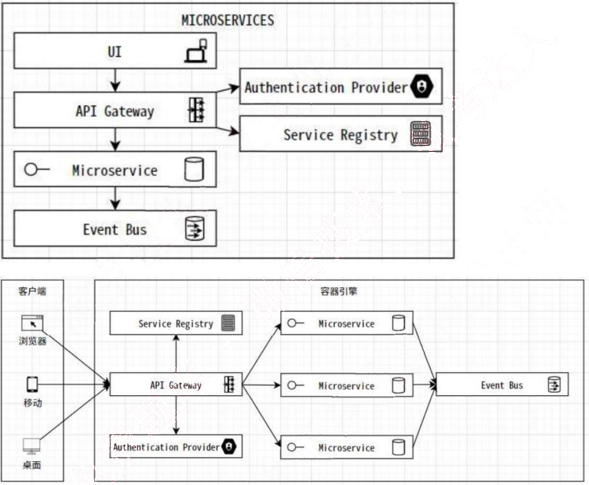

# 2021 年下半年 系统架构设计师 · 论文真题

> 试题一至四任选 1 道；含题干与小问
>
> **来源**：本地购买扫描件《2021.11 系统架构设计师真题及解析》（贡献者已购买并授权转录）
> **来源类型**：`real`
> **解析方式**：byted-las-document-parse（normal 模式）+ 机械清洗，已剔除页眉、广告条与页码
> **答案与解析**：取自该卷解析
> **使用建议**：可用于章节训练与年份模考；关键数字建议对照原始 PDF 复核
> **完整性**：论文 4 题齐备

从下列的4道试题（试题一至试题四）中任选1道解答。请在答题纸上的指定位置处将所选择试题的题号框涂黑。若多涂或者未涂题号框，则对题号最小的一道试题进行评分。

## 试题一：论面向方面的编程技术及其应用

针对应用开发所面临的规模不断扩大、复杂度不断提升的问题，面向方面的编程（Aspect Oriented Programming, AOP）技术提供了一种有效的程序开发方法。为了理解和完成一个复杂的程序，通常要把程序进行功能划分和封装。一般系统中的某些通用功能，如安全性、持续性、日志记录等等，其代码是分散的，较难实现模块化，不利于程序演变、维护和更新。AOP技术将逻辑上关系松散的代码封装到一个具有某种公共行为的可重用模块，并将其命名为方面（Aspect）。

请围绕“面向方面的编程技术及其应用”论题，依次从以下三个方面进行论述。

1. 概要叙述你参与实施的应用AOP技术的软件项目以及你在其中所担任的主要工作。
2. 叙述在软件项目实践过程使用AOP技术开发的具体步骤。
3. 结合项目内容，论述该项目使用AOP技术的原因，开发过程中存在的问题和解决方法，以及使用AOP技术带来的实际应用效果。

解析：

AOP包括三个开发步骤，分别是方面分解、关注点实现和方面的重新组合。

（1）方面分解。分解需求提取出横切关注点和核心关注点。把核心模块级关注点和系统级的横切关注点进行分离。例如，对于一个信用卡系统，可以分解出三个关注点：核心的信用卡处理、日志和验证。

（2）关注点实现。各自独立地实现这些关注点，用OOP（面向对象的程序设计）实现核心关注点，用AOP实现横切关注点。例如，可以用OOP实现信用卡处理单元，而用AOP实现日志单元和验证单元。

（3）方面的重新组合。方面集成器通过创建一个模块单元（方面）来制定重组的规则，重组过程也称为编织。

## 试题二：论系统安全架构设计及其应用

随着社会信息化进程的加快，计算机及网络已经被各行各业广泛应用，信息安全问题也变得愈来愈重要。它具有机密性、完整性、可用性、可控性和不可依赖性等特征。信息系统的安全保障是以风险和策略为基础，在信息系统的整个生命周期中提供包括技术、管理、人员和工程过程的整体安全，以保障信息的安全特征。

请围绕“系统安全架构设计及其应用”论题，依次从以下三个方面进行论述。

1. 概要叙述你参与管理和开发的涉及安全架构设计的软件项目以及承担的主要工作。
2. 请详细论述安全架构设计中鉴别框架和访问控制框架设计的内容，并论述鉴别和访问控制所面临的主要威胁有哪些，说明其危害。
3. 请简要说明在你所参与项目的开发过程中，在鉴别框架和访问控制框架设计中存在的实际问题，以及是如何解决这些问题的。

解析：鉴别（Authentication）的基本目的，就是防止其他实体占用和独立操作被鉴别实体的身份。鉴别提供了实体声称其身份的保证，只有在主体和验证者的关系背景下，鉴别才是有意义的。鉴别有两种重要的关系背景：一是实体由申请者来代表，申请者与验证者之间存在着特定的通信关系（如实体鉴别）；二是实体为验证者提供数据项来源。

鉴别的方式主要基于以下5种：
（1）已知的，如一个秘密的口令。
（2）拥有的，如IC卡、令牌等。
（3）不改变的特性，如生物特征。
（4）相信可靠的第三方建立的鉴别（递推）。
（5）环境（如主机地址等）。

鉴别服务分为以下阶段：安装阶段；修改鉴别信息阶段；分发阶段；获取阶段；传送阶段；验证阶段；停活阶段；重新激活阶段；取消安装阶段。

在安装阶段，定义申请AI和验证AI。修改鉴别信息阶段，实体或管理者申请AI和验证AI变更（如修改口令）。在分发阶段，为了验证交换AI，把验证AI分发到各实体（如申请者或验证者）以供使用。在获取阶段，申请者或验证者可得到为鉴别实例生成特定交换AI所需的信息，通过与可信第三方进行交互或鉴别实体间的信息交换可得到交换AI。例如，当使用联机密钥分配中心时，申请者或验证者可从密钥分配中心得到一些信息，如鉴别证书。在传送阶段，在申请者与验证者之间传

送交交换 AI。在验证阶段，用验证 AI 核对交换 AI。在停活阶段，将建立一种状态，使得以前能被鉴别的实体暂时不能被鉴别。在重新激活阶段，使在停活阶段建立的状态将被终止。在取消安装阶段，实体从实体集合中被拆除。

访问控制（AccessControl）决定开放系统环境中允许使用哪些资源、在什么地方适合阻止未授权访问的过程。在访问控制实例中，访问可以是对一个系统（即对一个系统通信部分的一个实体）或对一个系统内部进行的。

基本访问控制功能示意图

ACI（访问控制信息）是用于访问控制目的的任何信息，其中包括上下文信息。ADI（访问控制判决信息）是在做出一个特定的访问控制判决时可供 ADF 使用的部分（或全部）ACI。ADF（访问控制判决功能）是一种特定功能，它通过对访问请求、ADI 以及该访问请求的上下文使用访问控制策略规则而做出访问控制判决。AEF（访问控制实施功能）确保只有对目标允许的访问才由发起者执行。

涉及访问控制的有发起者、AEF、ADF 和目标。发起者代表访问或试图访问目标的人和基于计算机的实体。目标代表被试图访问或由发起者访问的，基于计算机或通信的实体。例如，目标可能是 OSI 实体、文件或者系统。访问请求代表构成试图访问部分的操作和操作数。

当发起者请求对目标进行特殊访问时，AEF 就通知 ADF 需要一个判决来做出决定。为了作出判决，给 ADF 提供了访问请求（作为判决请求的一部分）和下列几种访问控制判决信息（ADI）。

## 试题三：论企业集成平台的理解与应用

企业集成平台（Enterprise Imtcgation Plaform, EIP）是支持企业信息集成的像环境，其主要功能是为企业中的数据、系统和应用等多种对象的协同行提供各种公共服务及运行时的支撑环境。企业集成平台能够根据业务模型的变化快速地进行信息系统的配置和调整，保证不同系统、应用、服务或操作人员之同顺畅地相互操作，进而提高企业适应市场变化的能力，使企业能够在复杂多变的市场环境中生存。

请围绕“企业集成平台的理解与应用”论题，依次从以下三个方阅进行论述。

1. 概要叙述你参与管理和开发的、采用企业集成平台进行企业信息集成的软件项目以及你在其中所承担的主要工作。

2. 请给出至少4种企业集成平台应具有的基本功能，并对这4种功能的内涵进行简要阐述。

3. 具体阐述你参与管理和开发的项目是如何使用企业集成平台进行企业信息集成的，并围绕上述4种功能，详细论述在集成过程中遇到了哪些实际问题，是如何解决的。

解析：

集成平台是支持企业集成的支撑环境，包括硬件、软件、软件工具和系统，通过集成各种企业应用软件形成企业集成系统。由于硬件环境和应用软件的多样性，企业信息系统的功能和环境都非常复杂，因此，为了能够较好地满足企业的应用需求，作为企业集成系统支持环境的集成平台，其基本功能要如下。

（1）通信服务
提供分布环境下透明的同步/异步通信服务功能，使用户和应用程序无需关心具体的操作系统和应用程序所处的网络物理位置，而以透明的函数调用或对象服务方式完成它们所需的通信服务要求。

（2）信息集成服务
为应用提供透明的信息访问服务，通过实现异种数据库系统之间数据的交换、互操作、分布数据管理和共享信息模型定义（或共享信息数据库的建立），使集成平台上运行的应用、服务或用户端能够以一致的语义和接口实现对数据（数据库、数据文件、应用交互信息）的访问与控制。

（3）应用集成服务
通过高层应用编程接口来实现对相应应用程序的访问，这些高层应用编程接口包含在不同的适配器或代理中，被用来连接不同的应用程序。这些接口以函数或对象服务的方式向平台的组件模型提供信息，使用户在无需对原有系统进行修改（不会影响原有系统的功能）的情况下，只要在原有系统的基础上加上相应的访问接口就可以将现有的、用不同的技术实现的系统互联起来，通过为应用提供数据交换和访问操作，使各种不同的系统能够相互协作。

（4）二次开发工具
是集成平台提供的一组帮助用户开发特定应用程序（如实现数据转换的适配器或应用封装服务等）的支持工具，其目的是简化用户在企业集成平台实施过程中（特定应用程序接口）的开发工作。

（5）平台运行管理工具

是企业集成平台的运行管理和控制模块，负责企业集成平台系统的静态和动态配置、集成平台应用运行管理和维护、事件管理和出错管理等。通过命名服务、目录服务、平台的动态静态配置，以及其中的关键数据的定期备份等功能来维护整个服务平台的系统配置及稳定运行。

## 试题四：论微服务架构及其应用

微服务架构（Microservices Architecture）是一种架构风格，它将一个复杂的应用拆分成多个独立自治的服务，服务与服务间通过松耦合的形式交互，在微服务架构中，服务是细粒度的，协议是轻量级的。这些服务通常按业务能力组织，有自身的技术堆栈。

请围绕“微服务架构及其应用”论题，依次从以下三个方面进行论述。
1. 概要叙述你参与管理和开发的、采用微服务架构的软件项目以及你在其中所承担的主要工作。
2. 请简要描述微服务架构的优点。
3. 具体阐述你参与管理和开发的项目是如何基于微服务架构进行软件设计实现的。

解析：

微服务好处：
高异构性，高性能，高弹性，高扩展，易部署，可组合性，可替代性

微服务优点：
- 通过应用“分而治之”的原则，持续交付和部署大型，复杂的应用程序
- 通过更易于理解，开发和测试系统来提高模块化
- 通过每个微服务具有较小的代码库来降低复杂性
- 允许更新功能，而对系统的其余部分没有影响或影响极小
- 使架构变得高度可扩展
- 大大减少了破坏系统无关部分的机会
- 可以独立交付和部署服务，而不必等待整个系统发布
- 允许部署到多个云和本地基础设施环境
- 在持续发展现有系统的同时持续融入和利用最新的技术
- 使同一时间在同一系统上工作的一组开发人员间的协作更可控
- 允许新的团队成员更快地提高生产力，他们可以开发新功能而不必学习整个系统

基于微服务的系统设计实现：
设计原则
- 围绕业务概念建模

● 实现自动化
● 隐藏内部实现细节
● 一切去中心化
● 独立部署
● 隔离失败
● 高度可观察

设计实现

微服务 RESTful API：

业务服务及通用服务

服务网关 API Gateway：

客户端到微服务通信

服务注册 Service Registry：

微服务注册，发现中心

事件总线 Event Bus：

微服务到微服务通信

安全保护 Auth Provider：
认证授权提供服务

